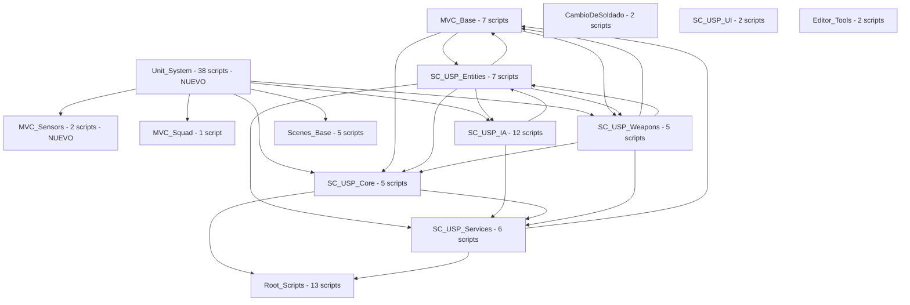

# Mapa de Arquitectura y Dependencias de Sistemas

Este documento describe la relacion y dependencias entre los diferentes dominios o sistemas del proyecto.

**Ultima actualizacion: 2026-06-01**

## Cambio Arquitectural: Soldier → Unit

El sistema de soldados original (SoldierController/Model/View/States) fue reemplazado por un sistema unificado de unidades (UnitController/UnitModel/UnitView) que maneja tanto aliados como enemigos. Los scripts del nuevo sistema viven en `Scenes/Tests/_USP/`. El viejo sistema en `Scripts/SC_USP/` aún existe para tanques, entidades auxiliares e IA enemiga clásica.

## Diagrama de Relaciones (Mermaid)

## Resumen de Sistemas

### Unit_System (NUEVO — Scenes/Tests/_USP/)
- **Ruta**: `Scenes/Tests/_USP/`
- **Cantidad de scripts**: 38
- **Descripcion**: Sistema unificado de unidades que reemplaza SoldierController/EnemyController. Toda unidad es un `UnitController` con `UnitModel` y `UnitView`. La FSM usa `IUnitState` con 7 estados (Liderando, SeguirFormacion, Atacar, Perseguir, Esperando, HuirDetrasLider, IrADestino).
- **Scripts clave**:
  - [UnitController](file:///Assets/Docs/FileIndex/UnitController.md) — Controller MVC + IDaniable + IDetectable
  - [UnitModel](file:///Assets/Docs/FileIndex/UnitModel.md) — Datos de salud/combate/movimiento/equipo
  - [UnitView](file:///Assets/Docs/FileIndex/UnitView.md) — Visuales, LineRenderer, indicadores, barra de vida
  - [LiderandoState](file:///Assets/Docs/FileIndex/LiderandoState.md) — 7 estados de la FSM
  - [UnitStates](file:///Assets/Docs/FileIndex/UnitStates.md) — Interfaz IUnitState
  - [GenericDetector](file:///Assets/Docs/FileIndex/GenericDetector.md) — Sensor genérico con eventos
  - [LeaderManager](file:///Assets/Docs/FileIndex/LeaderManager.md) — Singleton, cicla líderes Q/E
  - [UnitCommander](file:///Assets/Docs/FileIndex/UnitCommander.md) — Órdenes manuales click der / 1-2-3
  - [GEN_Inputs](file:///Assets/Docs/FileIndex/GEN_Inputs.md) — Input centralizado
  - [GlobalData](file:///Assets/Docs/FileIndex/GlobalData.md) — Referencia estática al líder

### MVC_Sensors (NUEVO — Scripts/MVC/Sensors/)
- **Ruta**: `Scripts/MVC/Sensors/`
- **Cantidad de scripts**: 2
- **Scripts**:
  - [IDetectable](file:///Assets/Docs/FileIndex/IDetectable.md) — interfaz + enum DetectableType
  - [DetectableEntity](file:///Assets/Docs/FileIndex/DetectableEntity.md) — implementación genérica

### MVC_Base
- **Ruta**: `Scripts/MVC/(?!Squad|Enemy|Sensors)`
- **Cantidad de scripts**: 7
- **Scripts**:
  - [CharacterControllerMVC](file:///Assets/Docs/FileIndex/CharacterControllerMVC.md)
  - [ICharacterInput](file:///Assets/Docs/FileIndex/ICharacterInput.md)
  - [IMovementHandler](file:///Assets/Docs/FileIndex/IMovementHandler.md)
  - [IWeaponInput](file:///Assets/Docs/FileIndex/IWeaponInput.md)
  - [UnityCharacterInput](file:///Assets/Docs/FileIndex/UnityCharacterInput.md)
  - [UnityWeaponInput](file:///Assets/Docs/FileIndex/UnityWeaponInput.md)
  - [WeaponControllerMVC](file:///Assets/Docs/FileIndex/WeaponControllerMVC.md)

### MVC_Squad
- **Ruta**: `Scripts/MVC/Squad`
- **Cantidad de scripts**: 1
- **Scripts**:
  - [SquadEventBus](file:///Assets/Docs/FileIndex/SquadEventBus.md) — static class, eventos: OnUnitDamaged, OnUnitDied, OnLeaderChanged, OnHelpRequested

### CambioDeSoldado
- **Ruta**: `Scripts/CambioDeSoldado`
- **Cantidad de scripts**: 2
- **Scripts**:
  - [CambioDeLider](file:///Assets/Docs/FileIndex/CambioDeLider.md)
  - [UnitFSM](file:///Assets/Docs/FileIndex/UnitFSM.md)

### SC_USP_Core
- **Ruta**: `Scripts/SC_USP/Core`
- **Cantidad de scripts**: 5
- **Scripts**:
  - [CharacterModel](file:///Assets/Docs/FileIndex/CharacterModel.md)
  - [IDaniable](file:///Assets/Docs/FileIndex/IDaniable.md)
  - [InformacionPersonaje](file:///Assets/Docs/FileIndex/InformacionPersonaje.md)
  - [Interfaces](file:///Assets/Docs/FileIndex/Interfaces.md)
  - [WeaponModel](file:///Assets/Docs/FileIndex/WeaponModel.md)

### SC_USP_Entities
- **Ruta**: `Scripts/SC_USP/Entities`
- **Cantidad de scripts**: 7
- **Scripts**:
  - [CharacterView](file:///Assets/Docs/FileIndex/CharacterView.md)
  - [ControladorTanque](file:///Assets/Docs/FileIndex/ControladorTanque.md)
  - [Enemigo](file:///Assets/Docs/FileIndex/Enemigo.md)
  - [EntrarAlTanque](file:///Assets/Docs/FileIndex/EntrarAlTanque.md)
  - [PlayerController](file:///Assets/Docs/FileIndex/PlayerController.md)
  - [Puntero_Tanque](file:///Assets/Docs/FileIndex/Puntero_Tanque.md)
  - [Tanque](file:///Assets/Docs/FileIndex/Tanque.md)

### SC_USP_IA
- **Ruta**: `Scripts/SC_USP/IA`
- **Cantidad de scripts**: 12
- **Scripts**:
  - [IA_F_ChangeMode](file:///Assets/Docs/FileIndex/IA_F_ChangeMode.md)
  - [IA_F_ControllerSeguidor](file:///Assets/Docs/FileIndex/IA_F_ControllerSeguidor.md)
  - [IA_F_EnemyCercanos](file:///Assets/Docs/FileIndex/IA_F_EnemyCercanos.md)
  - [IA_F_PathFanding_Theta](file:///Assets/Docs/FileIndex/IA_F_PathFanding_Theta.md)
  - [IA_P2_FOV](file:///Assets/Docs/FileIndex/IA_P2_FOV.md)
  - [IA_P2_FSM](file:///Assets/Docs/FileIndex/IA_P2_FSM.md)
  - [IA_P2_INT_gentState](file:///Assets/Docs/FileIndex/IA_P2_INT_gentState.md)
  - [IA_P2_LineOfSight3D](file:///Assets/Docs/FileIndex/IA_P2_LineOfSight3D.md)
  - [IA_P2_PathfindingManager](file:///Assets/Docs/FileIndex/IA_P2_PathfindingManager.md)
  - [IA_P2_ST_ChaseState](file:///Assets/Docs/FileIndex/IA_P2_ST_ChaseState.md)
  - [IA_P2_ST_PatrolState](file:///Assets/Docs/FileIndex/IA_P2_ST_PatrolState.md)
  - [IA_P2_ST_ReturningToPatrolState](file:///Assets/Docs/FileIndex/IA_P2_ST_ReturningToPatrolState.md)
  - [IA_P2_ST_SearchingState](file:///Assets/Docs/FileIndex/IA_P2_ST_SearchingState.md)

### SC_USP_Weapons
- **Ruta**: `Scripts/SC_USP/Weapons`
- **Cantidad de scripts**: 5
- **Scripts**:
  - [Cohete](file:///Assets/Docs/FileIndex/Cohete.md)
  - [Proyectil](file:///Assets/Docs/FileIndex/Proyectil.md)
  - [Proyectil2](file:///Assets/Docs/FileIndex/Proyectil2.md)
  - [WeaponController](file:///Assets/Docs/FileIndex/WeaponController.md)
  - [WeaponView](file:///Assets/Docs/FileIndex/WeaponView.md)

### SC_USP_Services
- **Ruta**: `Scripts/SC_USP/Services`
- **Cantidad de scripts**: 6
- **Scripts**:
  - [AutoDestruccionSegura](file:///Assets/Docs/FileIndex/AutoDestruccionSegura.md)
  - [CrearYDestruir](file:///Assets/Docs/FileIndex/CrearYDestruir.md)
  - [IA_P2_BusEvent_Manager](file:///Assets/Docs/FileIndex/IA_P2_BusEvent_Manager.md)
  - [PersecucionEnemigo](file:///Assets/Docs/FileIndex/PersecucionEnemigo.md)
  - [ProxiesUSP](file:///Assets/Docs/FileIndex/ProxiesUSP.md)
  - [Rigidbody2DMovementHandler](file:///Assets/Docs/FileIndex/Rigidbody2DMovementHandler.md)

### SC_USP_UI
- **Ruta**: `Scripts/SC_USP/UI`
- **Cantidad de scripts**: 2
- **Scripts**:
  - [CambiarOpacidad](file:///Assets/Docs/FileIndex/CambiarOpacidad.md)
  - [Soldado_Anim](file:///Assets/Docs/FileIndex/Soldado_Anim.md)

### Scenes_Base
- **Ruta**: `Scenes/Base`
- **Cantidad de scripts**: 5
- **Scripts**:
  - [CollisionDetector](file:///Assets/Docs/FileIndex/CollisionDetector.md)
  - [DebugColisionesFull](file:///Assets/Docs/FileIndex/DebugColisionesFull.md)
  - [DesactivarPorTimer](file:///Assets/Docs/FileIndex/DesactivarPorTimer.md)
  - [IInteractable](file:///Assets/Docs/FileIndex/IInteractable.md)
  - [ShotImpactBus](file:///Assets/Docs/FileIndex/ShotImpactBus.md)

### Root_Scripts
- **Ruta**: `Scripts/` (raíz, sin subcarpetas)
- **Cantidad de scripts**: 15
- **Scripts**:
  - [BD_Audios](file:///Assets/Docs/FileIndex/BD_Audios.md)
  - [Camara](file:///Assets/Docs/FileIndex/Camara.md)
  - [CodigoDeInicio](file:///Assets/Docs/FileIndex/CodigoDeInicio.md)
  - [ConfiguracionGlobal](file:///Assets/Docs/FileIndex/ConfiguracionGlobal.md)
  - [GestorTexto](file:///Assets/Docs/FileIndex/GestorTexto.md)
  - [Ideas y pseudocodigos](file:///Assets/Docs/FileIndex/Ideas y pseudocodigos.md)
  - [IndicadorEnemigos](file:///Assets/Docs/FileIndex/IndicadorEnemigos.md)
  - [MenuVictoria](file:///Assets/Docs/FileIndex/MenuVictoria.md)
  - [Obstaculo](file:///Assets/Docs/FileIndex/Obstaculo.md)
  - [PickUp](file:///Assets/Docs/FileIndex/PickUp.md)
  - [Prueba_de_color](file:///Assets/Docs/FileIndex/Prueba_de_color.md)
  - [SenalisacionAEnemigos](file:///Assets/Docs/FileIndex/SenalisacionAEnemigos.md)
  - [SistemaPuntaje](file:///Assets/Docs/FileIndex/SistemaPuntaje.md)
  - [Torreta](file:///Assets/Docs/FileIndex/Torreta.md)
  - [VibracionCamara](file:///Assets/Docs/FileIndex/VibracionCamara.md)

### Editor_Tools
- **Ruta**: `Editor/`
- **Cantidad de scripts**: 2
- **Scripts**:
  - [CentralizadorScripts](file:///Assets/Docs/FileIndex/CentralizadorScripts.md)
  - [Physics2DMigrator](file:///Assets/Docs/FileIndex/Physics2DMigrator.md)
