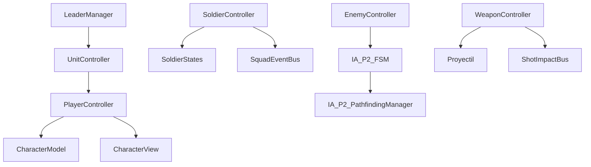

# Context Pack – DV_C5_Juego

Este archivo proporciona la visión de alto nivel del proyecto para que cualquier agente de IA pueda entender el juego de forma inmediata sin leer los scripts individuales.

---

## 1. Propósito Global del Proyecto
El proyecto **DV_C5_Juego** es un prototipo de shooter táctico y de infiltración en Unity (2D con perspectiva top-down/3D hibridada usando URP 2D). El jugador comanda un escuadrón de soldados, pudiendo alternar el control directo entre ellos (liderazgo) mientras los demás soldados le siguen en formación. El juego implementa mecánicas avanzadas de sigilo, visión de enemigos (FOV), sensores de disparo, uso de vehículos interactuables (tanques), e inteligencia artificial avanzada basada en FSM (Máquinas de Estado Finito) y Pathfinding Theta* y A*.

---

## 2. Flujo Principal del Juego
1. **Inicio**: El juego arranca en `MenuInicial.unity`. El jugador hace clic en jugar y se carga la escena principal `_Juego.unity` o `_USP.unity`.
2. **Control de Escuadrón**: 
   - El `LeaderManager` y `CambioDeLider` gestionan cuál es el soldado controlado actualmente por el jugador.
   - El líder se mueve usando el teclado/mouse (vía `UnityCharacterInput` y `PlayerController`).
   - Los seguidores se reubican automáticamente siguiendo formaciones dinámicas calculadas por `PositionManager` y `FormationRelocator`.
3. **Interacción con Tanques**: 
   - Si el líder se aproxima a un tanque con `EntrarAlTanque`, puede presionar una tecla para transferir el control al `ControladorTanque`. El soldado físico desaparece y el jugador maneja el tanque. Al salir, el soldado reaparece al lado.
4. **Inteligencia Artificial Enemiga**:
   - Los enemigos patrullan rutas predefinidas usando `IA_P2_ST_PatrolState`.
   - Utilizan un cono de visión dinámico (`IA_P2_FOV` e `IA_P2_LineOfSight3D`) para detectar al jugador.
   - Al detectar sospechas o disparos (mediante `ShotSensor` y `EnemyDetector`), cambian de estado (Searching, Chase) a través de `IA_P2_FSM`.
   - El movimiento inteligente se calcula usando nodos de mapa y el gestor de caminos Theta* (`IA_P2_PathfindingManager`).
5. **Combate**:
   - Soldados y enemigos poseen salud, armas (`WeaponController`) y disparan balas/cohetes (`Proyectil`, `Cohete`).
   - Se registran impactos y efectos de partículas (sangre, impacto de muros) a través de `Manager_VFX`.
6. **Condiciones de Fin**:
   - **Victoria**: Destruir todos los objetivos/enemigos o llegar a la zona de escape, lo que carga `MenuDeVictoria.unity`.
   - **Derrota**: La muerte de los soldados del escuadrón activa `ControlDerrota.cs` y carga `EscenaPerdiste.unity`.

---

## 3. Principales Dependencias de Arquitectura

---

## 4. Riesgos Técnicos y Deuda Identificada
- **Complejidad de Eventos**: Existen múltiples buses de eventos (`SquadEventBus`, `IA_P2_BusEvent_Manager`, `ShotImpactBus`) que se comunican de forma desacoplada, lo que puede dificultar el seguimiento de bugs en la pila de llamadas.
- **Doble Lógica de Entrada**: Existe código de MVC antiguo (`Scripts/MVC/`) conviviendo con la estructura USP (`Scripts/SC_USP/`). Deben respetarse los límites de cada arquitectura al hacer cambios.
- **NavMesh vs Pathfinding**: El movimiento usa tanto NavMesh de Unity (`NavMesh-Square.asset`) como pathfinding customizado Theta* en cuadrícula de nodos (`IA_P2_PathNode`). Cuidado al modificar lógica de movimiento.
