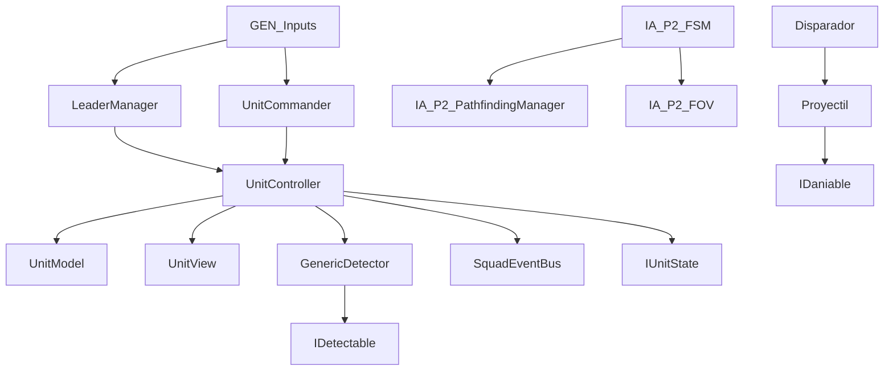

# Context Pack – DV_C5_Juego

Este archivo proporciona la visión de alto nivel del proyecto para que cualquier agente de IA pueda entender el juego de forma inmediata sin leer los scripts individuales.

**Ultima actualizacion: 2026-06-01**

---

## 1. Propósito Global del Proyecto
El proyecto **DV_C5_Juego** es un prototipo de shooter táctico y de infiltración en Unity (2D con perspectiva top-down, URP 2D, Unity 2022.3.5f1). El jugador comanda un escuadrón de soldados, pudiendo alternar el control directo entre ellos (liderazgo) mientras los demás soldados le siguen en formación. El juego implementa mecánicas avanzadas de sigilo, visión de enemigos (FOV), sensores de disparo, uso de vehículos interactuables (tanques), e inteligencia artificial avanzada basada en FSM (Máquinas de Estado Finito) y Pathfinding Theta* y A*.

---

## 2. Sistema de Unidades (refactorización 2026-06-01)

El sistema original de soldados (SoldierController/Model/View) fue reemplazado por un **sistema unificado de unidades** donde aliados y enemigos comparten la misma arquitectura MVC:

- **UnitController** (Game.Squad): Controller central. Implementa `IDaniable` e `IDetectable`. Maneja FSM, detección, combate y daño.
- **UnitModel**: Datos de salud, combate, movimiento y equipo (`UnitTeam`).
- **UnitView**: Visuales, LineRenderer, indicadores de estado (titileo), barra de vida OnGUI.
- **IUnitState**: Interfaz de estados. 7 implementaciones en `LiderandoState.cs`.

### FSM de unidades (estados):
| Estado | Descripción |
|---|---|
| **LiderandoState** | Control manual del jugador (WASD + mouse + disparo) |
| **SeguirFormacionState** | Seguir al slot de formación asignado |
| **AtacarState** | Detenerse y disparar al target (en rango) |
| **PerseguirState** | Moverse hacia el target via agente |
| **EsperandoState** | Detenerse (puede ser temporizado 5s tras orden) |
| **HuirDetrasLiderState** | Cobertura detrás del líder si HP < 50% |
| **IrADestinoState** | Ir a punto de orden manual (click der / tecla 1-2-3) |

### Sistema de detección genérico (Game.Sensors):
- **IDetectable** / **DetectableEntity**: Interfaz y componente para entidades detectables (Aliado, Enemigo, Interactuable, Proyectil).
- **GenericDetector**: CircleCollider2D trigger + raycast 2D con throttle 0.15s. Eventos: `OnTargetDetected`, `OnTargetLost`.

### Input centralizado:
- **GEN_Inputs** (Singleton): WASD, mouse, click izq (disparo), click der (orden), Q/E (ciclar líder), 1-2-3 (orden directa), Z (volver a formación).
- **LeaderManager**: Gestiona ciclo de liderazgo Q/E.
- **UnitCommander**: Órdenes manuales a unidades (click der → aliado más cercano, 1-2-3 → unidad específica).

### Sistema de ayuda con prioridad:
Cuando una unidad recibe daño, emite `SquadEventBus.TriggerHelpRequested()` con prioridad (1=líder atacado, 2=aliado atacado). Los aliados responden según prioridad: líder atacado siempre tiene precedencia.

---

## 3. Flujo Principal del Juego
1. **Inicio**: El juego arranca en `MenuInicial.unity`. El jugador hace clic en jugar y se carga la escena principal `_USP.unity` o `_Juego.unity`.
2. **Control de Escuadrón**: 
   - El `LeaderManager` gestiona cuál es la unidad controlada por el jugador.
   - El líder se mueve con WASD, apunta con mouse (`LiderandoState`).
   - Los seguidores se reubican automáticamente siguiendo formaciones (`PositionManager`, `FormationRelocator`, `SeguirFormacionState`).
   - Se pueden dar órdenes individuales (click der, teclas 1-2-3) que envían unidades a posiciones específicas (`IrADestinoState`).
3. **Interacción con Tanques**: 
   - Si el líder se aproxima a un tanque con `EntrarAlTanque`, puede transferir el control al `ControladorTanque`.
4. **Inteligencia Artificial Enemiga**:
   - Los enemigos patrullan rutas predefinidas usando `IA_P2_ST_PatrolState`.
   - Utilizan FOV dinámico (`IA_P2_FOV`) y sensores (`GenericDetector`) para detectar al jugador.
   - Al detectar, cambian de estado (Searching, Chase) a través de `IA_P2_FSM`.
   - El movimiento usa Theta* (`IA_P2_PathfindingManager`).
5. **Combate**:
   - Unidades poseen salud y armas. Disparan via `Disparador` → `Proyectil`/`Cohete`.
   - Los aliados responden automáticamente a ataques y pedidos de ayuda via `SquadEventBus`.
   - Impactos y VFX via `Manager_VFX`.
6. **Condiciones de Fin**:
   - **Victoria**: Destruir objetivos → `MenuDeVictoria.unity`.
   - **Derrota**: Muerte de soldados → `ControlDerrota` → `EscenaPerdiste.unity`.

---

## 4. Principales Dependencias de Arquitectura

---

## 5. Namespaces del Proyecto
| Namespace | Contenido |
|---|---|
| `Game.Squad` | UnitController, IUnitState, todos los estados, SquadEventBus |
| `Game.Sensors` | IDetectable, DetectableType, DetectableEntity, GenericDetector |
| `Game.Core` | UnitTeam, IHealth |
| `Game.MVC` | CharacterControllerMVC, WeaponControllerMVC, interfaces de input |
| `USP.Core` | CharacterModel, SoldierModel, EnemyModel, WeaponModel, IDaniable, Interfaces |
| `USP.Entities` | PlayerController, EnemyController, CharacterView, tanques |
| `USP.Services` | GameManager, VFX, pathfinding, utilidades |
| `USP.Weapons` | WeaponController, Proyectil, Cohete |
| *(global)* | IDaniable, GEN_Inputs, LeaderManager, UnitCommander, GlobalData, UnitModel, UnitView |

---

## 6. Riesgos Técnicos y Deuda Identificada
- **Auditoría 2026-05-31**: Ver [AuditReport_2026-05-31.md](file:///Assets/Docs/AuditReport_2026-05-31.md) para el detalle de 47 correcciones aplicadas. Compila limpio (0 errores, 0 warnings).
- **Coexistencia de sistemas**: El viejo sistema USP (Scripts/SC_USP/) coexiste con el nuevo sistema Unit (Scenes/Tests/_USP/). Ambos usan `IDaniable` y `IA_P2_AgentIA`.
- **Interfaz `IDaniable`**: Vive en el namespace **global** (no en `USP.Core`). La implementan `Destruible`, `UnitController`; la consumen los proyectiles vía `GetComponent<IDaniable>()`.
- **Scripts en ubicación de escena**: ~38 scripts viven en `Scenes/Tests/_USP/` junto a la escena, no en `Scripts/`. Esto es intencional durante la iteración.
- **Buses de eventos**: `SquadEventBus` (estático), `IA_P2_BusEvent_Manager`, `ShotImpactBus` — comunicación desacoplada.
- **NavMesh vs Pathfinding**: Coexisten NavMesh de Unity y Theta* custom (`IA_P2_PathNode`).
- **`IA_P2_FSM.IsPlayerVisible()`** siempre retorna false — detección real en `IA_P2_FOV`.
- **Clases vacías**: `Obstaculo.cs`, `Prueba_de_color.cs`, `SistemaPuntaje.cs` — posiblemente referenciadas en prefabs.
