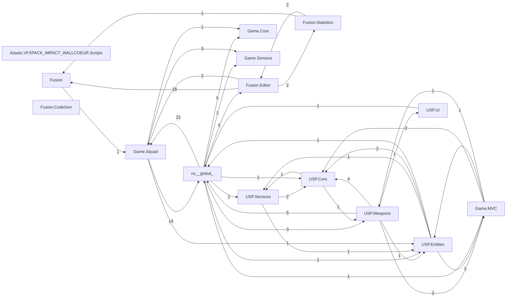

# 📘 Reporte global — Assets

_Generado: 2026-06-11 22:02:18_

## Índice

1. [Métricas](#métricas)
2. [Diagramas](#diagramas)
3. [Documentación](#documentación)
4. [Volcado completo de Roslyn](#volcado-completo-de-roslyn)
5. [Tablas](#tablas)
6. [Otros formatos](#otros-formatos)

## Métricas

| Métrica | Valor |
|---------|------:|
| Archivos | 153 |
| Carpetas | 23 |
| Namespaces | 14 |
| Clases | 397 |
| Interfaces | 16 |
| Enums | 17 |
| Métodos | 1569 |
| Propiedades | 242 |
| Campos | 1264 |
| Eventos | 21 |
| Líneas totales | 43774 |

## Diagramas

### Mapa de dependencias entre clases

```mermaid
flowchart LR
    direction LR
    FusionStatsGraphBase["FusionStatsGraphBase"]
    FusionBootstrap["FusionBootstrap"]
    ReflectionUtils["ReflectionUtils"]
    FusionRunnerVisibilityControlsWindow["FusionRunnerVisibilityContr..."]
    InformacionPersonaje["InformacionPersonaje"]
    AssetDatabaseUtils["AssetDatabaseUtils"]
    NetworkSceneManagerDefault["NetworkSceneManagerDefault"]
    UnitController["UnitController"]
    UnitView["UnitView"]
    FusionStatistics["FusionStatistics"]
    FusionStatsCanvas["FusionStatsCanvas"]
    RenderSimStats[/"RenderSimStats"/]
    ControladorTanque["ControladorTanque"]
    FusionEditorSkin["FusionEditorSkin"]
    UnitModel["UnitModel"]
    FusionEditorGUI["FusionEditorGUI"]
    Enemigo["Enemigo"]
    FusionProfiler["FusionProfiler"]
    FusionNetworkObjectStatsGraphCombine["FusionNetworkObjectStatsGra..."]
    Bala["Bala"]
    NetworkRunnerVisibilityExtensions["NetworkRunnerVisibilityExte..."]
    IA_P2_AgentIA["IA_P2_AgentIA"]
    FusionGrid["FusionGrid"]
    NetworkObjectEditor["NetworkObjectEditor"]
    Labels["Labels"]
    IA_P2_FSM["IA_P2_FSM"]
    Tanque["Tanque"]
    WeaponModel["WeaponModel"]
    NetworkCharacterController["NetworkCharacterController"]
    RunnerEnableVisibility["RunnerEnableVisibility"]
    RunnerVisibilityLink["RunnerVisibilityLink"]
    ComponentPropertiesCopier["ComponentPropertiesCopier"]
    IA_P2_FOV["IA_P2_FOV"]
    FusionStatBuffer["FusionStatBuffer"]
    CharacterModel["CharacterModel"]
    EnemyModel["EnemyModel"]
    GameManager["GameManager"]
    FusionBootstrapDebugGUI["FusionBootstrapDebugGUI"]
    FusionStatsConfig["FusionStatsConfig"]
    LazyGUIStyle["LazyGUIStyle"]
    FusionStatsPanelHeader["FusionStatsPanelHeader"]
    FixedBufferPropertyAttributeDrawer["FixedBufferPropertyAttribut..."]
    FusionCodeDoc["FusionCodeDoc"]
    RangeExAttributeDrawer["RangeExAttributeDrawer"]
    FusionInstaller["FusionInstaller"]
    LogSettingsDrawer["LogSettingsDrawer"]
    FusionEditorGUI["FusionEditorGUI"]
    DebugColisionesFull["DebugColisionesFull"]
    TickRateDrawer["TickRateDrawer"]
    DecoratingPropertyAttributeDrawer["DecoratingPropertyAttribute..."]
    AnimatorControllerTools["AnimatorControllerTools"]
    WeaponView["WeaponView"]
    GenericDetector["GenericDetector"]
    Proyectil["Proyectil"]
    EnumDrawer["EnumDrawer"]
    PropertyDrawerWithErrorHandling["PropertyDrawerWithErrorHand..."]
    TransformPathCache["TransformPathCache"]
    FusionGlobalScriptableObjectUtils["FusionGlobalScriptableObjec..."]
    SerializedPropertyUtilities["SerializedPropertyUtilities"]
    SplitterState["SplitterState"]
    NetworkProjectConfigImporter["NetworkProjectConfigImporter"]
    IA_P2_PathfindingManager["IA_P2_PathfindingManager"]
    PlayerController["PlayerController"]
    UnitFSM["UnitFSM"]
    GEN_Inputs["GEN_Inputs"]
    LeaderManager["LeaderManager"]
    NetworkAssetSourceResource["NetworkAssetSourceResource"]
    JsonUtilityExtensions["JsonUtilityExtensions"]
    NetworkObjectBaker["NetworkObjectBaker"]
    FusionUnitySceneManagerUtils["FusionUnitySceneManagerUtils"]
    InternalTreeView["InternalTreeView"]
    ScriptAttributeUtility["ScriptAttributeUtility"]
    NetworkProjectConfigUtilities["NetworkProjectConfigUtilities"]
    NetworkProjectConfigImporterEditor["NetworkProjectConfigImporte..."]
    EntrarAlTanque["EntrarAlTanque"]
    UnitCommander["UnitCommander"]
    RawDataDrawer["RawDataDrawer"]
    EditorGUI["EditorGUI"]
    WeaponControllerMVC["WeaponControllerMVC"]
    AssetEnumerator["AssetEnumerator"]

    FusionStatsGraphBase -->|usa| FusionStatBuffer
    FusionStatsGraphBase -->|usa| FusionStatistics
    FusionBootstrap -->|usa| FusionBootstrapDebugGUI
    FusionBootstrap -->|usa| NetworkSceneManagerDefault
    FusionRunnerVisibilityControlsWindow -->|usa| RunnerEnableVisibility
    FusionRunnerVisibilityControlsWindow -->|usa| NetworkRunnerVisibilityExtensions
    FusionRunnerVisibilityControlsWindow -->|usa| Labels
    FusionRunnerVisibilityControlsWindow -->|usa| FusionEditorSkin
    FusionRunnerVisibilityControlsWindow -->|usa| FusionStatistics
    FusionRunnerVisibilityControlsWindow -->|usa| EditorGUI
    InformacionPersonaje -->|usa| GameManager
    AssetDatabaseUtils -->|usa| AssetEnumerator
    NetworkSceneManagerDefault -->|usa| FusionUnitySceneManagerUtils
    UnitController -->|usa| UnitModel
    UnitController -->|usa| UnitView
    UnitController -->|usa| IA_P2_AgentIA
    UnitController -->|usa| GenericDetector
    UnitController -->|usa| Enemigo
    UnitView -->|usa| UnitModel
    FusionStatistics -->|usa| FusionStatsGraphBase
    FusionStatistics -->|usa| FusionNetworkObjectStatsGraphCombine
    FusionStatistics -->|usa| FusionStatsPanelHeader
    FusionStatistics -->|usa| FusionStatsConfig
    FusionStatistics -->|usa| FusionStatsCanvas
    FusionStatistics -->|usa| RenderSimStats
    FusionStatsCanvas -->|usa| FusionStatsPanelHeader
    FusionStatsCanvas -->|usa| FusionStatsConfig
    FusionStatsCanvas -->|usa| FusionStatistics
    ControladorTanque -->|usa| EntrarAlTanque
    ControladorTanque -->|usa| Proyectil
    ControladorTanque -->|usa| Bala
    FusionEditorSkin -->|usa| LazyGUIStyle
    FusionEditorGUI -->|usa| FusionEditorSkin
    FusionEditorGUI -->|usa| EditorGUI
    FusionEditorGUI -->|usa| ScriptAttributeUtility
    FusionEditorGUI -->|usa| FusionCodeDoc
    Enemigo -->|usa| GameManager
    FusionNetworkObjectStatsGraphCombine -->|usa| FusionStatistics
    Bala -->|usa| Proyectil
    NetworkRunnerVisibilityExtensions -->|usa| RunnerVisibilityLink
    IA_P2_AgentIA -->|usa| IA_P2_PathfindingManager
    FusionGrid -->|usa| InternalTreeView
    FusionGrid -->|usa| FusionEditorSkin
    FusionGrid -->|usa| EditorGUI
    NetworkObjectEditor -->|usa| NetworkProjectConfigUtilities
    NetworkObjectEditor -->|usa| FusionEditorGUI
    NetworkObjectEditor -->|usa| AssetDatabaseUtils
    NetworkObjectEditor -->|usa| EditorGUI
    Labels -->|usa| RunnerEnableVisibility
    Labels -->|usa| NetworkRunnerVisibilityExtensions
    IA_P2_FSM -->|usa| IA_P2_AgentIA
    IA_P2_FSM -->|usa| IA_P2_FOV
    RunnerVisibilityLink -->|usa| NetworkRunnerVisibilityExtensions
    CharacterModel -->|usa| InformacionPersonaje
    GameManager -->|usa| Enemigo
    FusionBootstrapDebugGUI -->|usa| FusionBootstrap
    FusionStatsConfig -->|usa| FusionStatistics
    FusionStatsPanelHeader -->|usa| RenderSimStats
    FusionStatsPanelHeader -->|usa| FusionStatistics
    FixedBufferPropertyAttributeDrawer -->|hereda| PropertyDrawerWithErrorHandling
    FixedBufferPropertyAttributeDrawer -->|usa| EditorGUI
    FixedBufferPropertyAttributeDrawer -->|usa| FusionEditorGUI
    FixedBufferPropertyAttributeDrawer -->|usa| ScriptAttributeUtility
    FusionCodeDoc -->|usa| AssetDatabaseUtils
    RangeExAttributeDrawer -->|hereda| PropertyDrawerWithErrorHandling
    RangeExAttributeDrawer -->|usa| EditorGUI
    RangeExAttributeDrawer -->|usa| FusionEditorGUI
    LogSettingsDrawer -->|usa| FusionCodeDoc
    LogSettingsDrawer -->|usa| EditorGUI
    LogSettingsDrawer -->|usa| FusionEditorGUI
    LogSettingsDrawer -->|usa| AssetDatabaseUtils
    FusionEditorGUI -->|usa| EditorGUI
    FusionEditorGUI -->|usa| FusionEditorSkin
    FusionEditorGUI -->|usa| ScriptAttributeUtility
    TickRateDrawer -->|usa| LazyGUIStyle
    TickRateDrawer -->|usa| EditorGUI
    TickRateDrawer -->|usa| FusionEditorGUI
    DecoratingPropertyAttributeDrawer -->|usa| FusionEditorGUI
    DecoratingPropertyAttributeDrawer -->|usa| EditorGUI
    DecoratingPropertyAttributeDrawer -->|usa| ScriptAttributeUtility
    WeaponView -->|usa| Proyectil
    WeaponView -->|usa| InformacionPersonaje
    WeaponView -->|usa| WeaponModel
    WeaponView -->|usa| Bala
    Proyectil -->|usa| InformacionPersonaje
    Proyectil -->|usa| Enemigo
    EnumDrawer -->|usa| EditorGUI
    PropertyDrawerWithErrorHandling -->|usa| EditorGUI
    PropertyDrawerWithErrorHandling -->|usa| FusionEditorGUI
    FusionGlobalScriptableObjectUtils -->|usa| AssetDatabaseUtils
    NetworkProjectConfigImporter -->|usa| AssetDatabaseUtils
    PlayerController -->|usa| CharacterModel
    UnitFSM -->|usa| UnitController
    LeaderManager -->|usa| UnitController
    LeaderManager -->|usa| GEN_Inputs
    NetworkObjectBaker -->|usa| TransformPathCache
    InternalTreeView -->|usa| FusionGrid
    NetworkProjectConfigUtilities -->|usa| FusionGlobalScriptableObjectUtils
    NetworkProjectConfigUtilities -->|usa| AssetDatabaseUtils
    NetworkProjectConfigUtilities -->|usa| NetworkProjectConfigImporter
    NetworkProjectConfigImporterEditor -->|usa| NetworkProjectConfigImporter
    NetworkProjectConfigImporterEditor -->|usa| LogSettingsDrawer
    NetworkProjectConfigImporterEditor -->|usa| FusionEditorGUI
    NetworkProjectConfigImporterEditor -->|usa| EditorGUI
    NetworkProjectConfigImporterEditor -->|usa| NetworkProjectConfigUtilities
    EntrarAlTanque -->|usa| ControladorTanque
    UnitCommander -->|usa| GEN_Inputs
    UnitCommander -->|usa| LeaderManager
    UnitCommander -->|usa| UnitController
    RawDataDrawer -->|usa| FusionEditorSkin
    RawDataDrawer -->|usa| EditorGUI
    WeaponControllerMVC -->|usa| WeaponModel
    WeaponControllerMVC -->|usa| WeaponView
```


_Versión imagen: [flowchart.svg](flowchart.svg)_

### Diagrama de clases

```mermaid
classDiagram
    %%{init: {'flowchart': {'htmlLabels': true}}}%%
    class FusionSta...
    class FusionBoo...
    class Reflectio...
    class FusionRun...
    class Informaci...
    class AssetData...
    class NetworkSc...
    class UnitContr...
    class UnitView
    class FusionSta...
    class FusionSta...
    class RenderSim...
    class Controlad...
    class FusionEdi...
    class UnitModel
    class FusionEdi...
    class Enemigo
    class FusionPro...
    class FusionNet...
    class Bala
    class NetworkRu...
    class IA_P2_Age...
    class FusionGrid
    class NetworkOb...
    class Labels
    class IA_P2_FSM
    class Tanque
    class WeaponModel
    class NetworkCh...
    class RunnerEna...
    class RunnerVis...
    class Component...
    class IA_P2_FOV
    class FusionSta...
    class Character...
    class EnemyModel
    class GameManager
    class FusionBoo...
    class FusionSta...
    class LazyGUIStyle
    class FusionSta...
    class FixedBuff...
    class FusionCod...
    class RangeExAt...
    class FusionIns...
    class LogSettin...
    class FusionEdi...
    class DebugColi...
    class TickRateD...
    class Decoratin...
    class AnimatorC...
    class WeaponView
    class GenericDe...
    class Proyectil
    class EnumDrawer
    class PropertyD...
    class Transform...
    class FusionGlo...
    class Serialize...
    class SplitterS...
    class NetworkPr...
    class IA_P2_Pat...
    class PlayerCon...
    class UnitFSM
    class GEN_Inputs
    class LeaderMan...
    class NetworkAs...
    class JsonUtili...
    class NetworkOb...
    class FusionUni...
    class InternalT...
    class ScriptAtt...
    class NetworkPr...
    class NetworkPr...
    class EntrarAlT...
    class UnitComma...
    class RawDataDr...
    class EditorGUI
    class WeaponCon...
    class AssetEnum...

    PropertyD... <|-- FixedBuff...
    PropertyD... <|-- RangeExAt...
```

### Diagrama de namespaces


_Versión imagen: [namespaces-mermaid.svg](namespaces-mermaid.svg)_

> Imágenes vectoriales: [clases (PlantUML)](classDiagram.svg) · [namespaces (PlantUML)](namespaces.svg) · [DGML para Visual Studio](project.dgml)

## Documentación


Generado: 2026-06-11 22:02:01

### Resumen

- Archivos: 153
- Carpetas: 23
- Namespaces: 14
- Clases: 397
- Interfaces: 16
- Enums: 17
- Métodos: 1569
- Propiedades: 242
- Campos: 1264
- Líneas totales: 43774 (código 32725, comentarios 2989, blancos 8060)

### Mapa de relaciones

- **BD_Audios** hereda de **MonoBehaviour**
- **BD_Audios** usa **CoroutineHelper**
- **CoroutineHelper** hereda de **MonoBehaviour**
- **Camara** hereda de **MonoBehaviour**
- **CodigoDeInicio** hereda de **MonoBehaviour**
- **CodigoDeInicio** usa **BD_Audios**
- **GestorTexto** hereda de **MonoBehaviour**
- **Ideasypseudocodigos** hereda de **MonoBehaviour**
- **IndicadorEnemigos** hereda de **MonoBehaviour**
- **IndicadorEnemigos** usa **GameManager**
- **MenuVictoria** hereda de **MonoBehaviour**
- **Obstaculo** hereda de **MonoBehaviour**
- **PickUp** hereda de **MonoBehaviour**
- **PickUp** usa **UnitController**
- **PickUp** usa **UnitTeam**
- **Prueba_de_color** hereda de **MonoBehaviour**
- **SenalizacionDeEnemigos** hereda de **MonoBehaviour**
- **SistemaPuntaje** hereda de **MonoBehaviour**
- **Torreta** hereda de **MonoBehaviour**
- **Torreta** usa **GameManager**
- **VibracionCamara** hereda de **MonoBehaviour**
- **VibracionCamara** usa **ConfiguracionGlobal**
- **Cohete** hereda de **MonoBehaviour**
- **Cohete** usa **IDaniable**
- **Proyectil** hereda de **MonoBehaviour**
- **Proyectil** usa **Manager_VFX**
- **Proyectil** usa **IDaniable**
- **Proyectil** usa **InformacionPersonaje**
- **Proyectil** usa **Enemigo**
- **Proyectil2** hereda de **MonoBehaviour**
- **WeaponController** hereda de **MonoBehaviour**
- **WeaponController** usa **WeaponModel**
- **WeaponController** usa **WeaponView**
- **WeaponController** usa **IWeaponInput**
- **WeaponController** usa **WeaponControllerMVC**
- **WeaponController** usa **UnityWeaponInput**
- **WeaponView** hereda de **MonoBehaviour**
- **WeaponView** usa **CambiarOpacidad**
- **WeaponView** usa **Proyectil**
- **WeaponView** usa **InformacionPersonaje**
- **WeaponView** usa **WeaponModel**
- **WeaponView** usa **Bala**
- **WeaponView** usa **BD_Audios**
- **CambiarOpacidad** hereda de **MonoBehaviour**
- **Soldado_Anim** hereda de **MonoBehaviour**
- **Soldado_Anim** usa **BD_Audios**
- **AutoDestruccionSegura** hereda de **MonoBehaviour**
- **CrearYDestruir** hereda de **MonoBehaviour**
- **IA_P2_BusEvent_Manager** hereda de **MonoBehaviour**
- **IA_P2_BusEvent_Manager** usa **IA_P2_FSM**
- **PersecucionEnemigo** hereda de **MonoBehaviour**
- **PersecucionEnemigo** usa **Enemigo**
- **MovementProxy** usa **IMovable**
- **ShootingProxy** usa **IAttackable**
- **Rigidbody2DMovementHandler** hereda de **MonoBehaviour**
- **Rigidbody2DMovementHandler** implementa **IMovementHandler**
- **Rigidbody2DMovementHandler** usa **BD_Audios**
- **IA_F_ChangeMode** hereda de **MonoBehaviour**
- **IA_F_ChangeMode** usa **IA_P2_AgentIA**
- **IA_F_ChangeMode** usa **IA_P2_BusEvent_Manager**
- **IA_F_ControllerSeguidor** hereda de **MonoBehaviour**
- **IA_F_ControllerSeguidor** usa **IA_P2_AgentIA**
- **IA_F_ControllerSeguidor** usa **IA_F_EnemyCercanos**
- **IA_F_EnemyCercanos** hereda de **MonoBehaviour**
- **IA_F_PathFinding_Theta** usa **IA_P2_LineOfSight3D**
- **IA_P2_FOV** hereda de **MonoBehaviour**
- **IA_P2_FOV** usa **IA_P2_LineOfSight3D**
- **IA_P2_FSM** hereda de **MonoBehaviour**
- **IA_P2_FSM** usa **IA_P2_AgentIA**
- **IA_P2_FSM** usa **AgentState**
- **IA_P2_FSM** usa **IA_P2_INT_gentState**
- **IA_P2_FSM** usa **IA_P2_FOV**
- **IA_P2_FSM** usa **IA_P2_ST_PatrolState**
- **IA_P2_FSM** usa **IA_P2_ST_ChaseState**
- **IA_P2_FSM** usa **IA_P2_ST_SearchingState**
- **IA_P2_FSM** usa **IA_P2_ST_ReturningToPatrolState**
- **IA_P2_FSM** usa **IA_P2_BusEvent_Manager**
- **IA_P2_INT_gentState** usa **IA_P2_FSM**
- **IA_P2_PathfindingManager** usa **IA_P2_PathNode**
- **IA_P2_PathfindingManager** usa **IA_P2_PathfindingModel**
- **IA_P2_PathfindingManager** usa **FinalPathResult**
- **IA_P2_PathfindingManager** usa **NodeDistance**
- **IA_P2_PathfindingManager** usa **IA_P2_LineOfSight3D**
- **IA_P2_PathfindingManager** usa **AStarResult**
- **IA_P2_PathfindingManager** usa **ThetaStarResult**
- **AStarResult** usa **IA_P2_PathNode**
- **NodeDistance** usa **IA_P2_PathNode**
- **IA_P2_ST_ChaseState** implementa **IA_P2_INT_gentState**
- **IA_P2_ST_ChaseState** usa **IA_P2_FSM**
- **IA_P2_ST_ChaseState** usa **AgentState**
- **IA_P2_ST_ChaseState** usa **IA_P2_LineOfSight3D**
- **IA_P2_ST_PatrolState** implementa **IA_P2_INT_gentState**
- **IA_P2_ST_PatrolState** usa **IA_P2_FSM**
- **IA_P2_ST_PatrolState** usa **AgentState**
- **IA_P2_ST_ReturningToPatrolState** implementa **IA_P2_INT_gentState**
- **IA_P2_ST_ReturningToPatrolState** usa **IA_P2_FSM**
- **IA_P2_ST_ReturningToPatrolState** usa **AgentState**
- **IA_P2_ST_SearchingState** implementa **IA_P2_INT_gentState**
- **IA_P2_ST_SearchingState** usa **IA_P2_FSM**
- **IA_P2_ST_SearchingState** usa **AgentState**
- **IA_P2_ST_SearchingState** usa **IA_P2_LineOfSight3D**
- **CharacterView** hereda de **MonoBehaviour**
- **ControladorTanque** hereda de **MonoBehaviour**
- **ControladorTanque** usa **EntrarAlTanque**
- **ControladorTanque** usa **Proyectil**
- **ControladorTanque** usa **Bala**
- **ControladorTanque** usa **BD_Audios**
- **Enemigo** hereda de **MonoBehaviour**
- **Enemigo** usa **GameManager**
- **EntrarAlTanque** hereda de **MonoBehaviour**
- **EntrarAlTanque** usa **ControladorTanque**
- **PlayerController** hereda de **MonoBehaviour**
- **PlayerController** usa **CharacterModel**
- **PlayerController** usa **CharacterView**
- **PlayerController** usa **Rigidbody2DMovementHandler**
- **PlayerController** usa **ICharacterInput**
- **PlayerController** usa **UnityCharacterInput**
- **PlayerController** usa **BD_Audios**
- **Puntero_Tanque** hereda de **MonoBehaviour**
- **Puntero_Tanque** usa **Tanque**
- **Tanque** hereda de **MonoBehaviour**
- **Tanque** usa **Puntero_Tanque**
- **Tanque** usa **Cohete**
- **Tanque** usa **ObjetoColisionado**
- **CharacterModel** hereda de **MonoBehaviour**
- **CharacterModel** usa **InformacionPersonaje**
- **InformacionPersonaje** hereda de **MonoBehaviour**
- **InformacionPersonaje** implementa **IHealth**
- **InformacionPersonaje** usa **WeaponController**
- **InformacionPersonaje** usa **GameManager**
- **WeaponModel** hereda de **MonoBehaviour**
- **SelectedSoldierUIFeedback** hereda de **MonoBehaviour**
- **SelectedSoldierUIFeedback** usa **UnitController**
- **CharacterControllerMVC** usa **CharacterModel**
- **CharacterControllerMVC** usa **CharacterView**
- **CharacterControllerMVC** usa **ICharacterInput**
- **CharacterControllerMVC** usa **IMovementHandler**
- **UnityCharacterInput** implementa **ICharacterInput**
- **UnityWeaponInput** implementa **IWeaponInput**
- **WeaponControllerMVC** usa **WeaponModel**
- **WeaponControllerMVC** usa **WeaponView**
- **WeaponControllerMVC** usa **IWeaponInput**
- **SquadEventBus** usa **UnitController**
- **DetectableEntity** hereda de **MonoBehaviour**
- **DetectableEntity** implementa **IDetectable**
- **DetectableEntity** usa **DetectableType**
- **IDetectable** usa **DetectableType**
- **CambioDeLider** hereda de **MonoBehaviour**
- **UnitFSM** hereda de **MonoBehaviour**
- **UnitFSM** usa **State**
- **UnitFSM** usa **UnitController**
- **UnitFSM** usa **TickManager**
- **AmmoManager** hereda de **MonoBehaviour**
- **AmmoManager** usa **UnitController**
- **AmmoManager** usa **UnitModel**
- **Bala** hereda de **MonoBehaviour**
- **Bala** implementa **IDetectable**
- **Bala** usa **DetectableType**
- **Bala** usa **Proyectil**
- **Bala** usa **CursorManager**
- **Bala** usa **IDaniable**
- **Bala** usa **CoroutineHelper**
- **Bala** usa **Manager_VFX**
- **Bala** usa **BD_Audios**
- **Bala** usa **BalaPool**
- **BalaPool** hereda de **MonoBehaviour**
- **BalaPool** usa **Bala**
- **ControlDerrota** hereda de **MonoBehaviour**
- **ControlDerrota** usa **LeaderManager**
- **CursorManager** hereda de **MonoBehaviour**
- **CursorManager** usa **IInteractable**
- **CursorManager** usa **IDaniable**
- **Destruible** hereda de **MonoBehaviour**
- **Destruible** implementa **IDaniable**
- **Destruible** usa **UnitController**
- **Disparador** hereda de **MonoBehaviour**
- **Disparador** usa **Manager_VFX**
- **Disparador** usa **BD_Audios**
- **Disparador** usa **BalaPool**
- **Disparador** usa **Bala**
- **EnemyModel** hereda de **MonoBehaviour**
- **EnemyModel** implementa **IHealth**
- **EnemyView** hereda de **MonoBehaviour**
- **EnemyView** usa **EnemyModel**
- **FormationRelocator** hereda de **MonoBehaviour**
- **FormationRelocator** usa **GlobalData**
- **FormationRelocator** usa **IA_P2_PathfindingModel**
- **GameManager** hereda de **MonoBehaviour**
- **GameManager** usa **Enemigo**
- **GenericDetector** hereda de **MonoBehaviour**
- **GenericDetector** usa **DetectableType**
- **GenericDetector** usa **IDetectable**
- **GEN_Inputs** hereda de **MonoBehaviour**
- **GlobalData** usa **UnitController**
- **GlobalHUD** hereda de **MonoBehaviour**
- **GlobalHUD** usa **LeaderManager**
- **IA_P2_AgentIA** hereda de **MonoBehaviour**
- **IA_P2_AgentIA** usa **IA_P2_PathfindingModel**
- **IA_P2_AgentIA** usa **IA_P2_PathfindingManager**
- **IA_P2_AgentIA** usa **IA_F_PathFinding_Theta**
- **IA_P2_PathfindingModel** hereda de **MonoBehaviour**
- **IA_P2_PathfindingModel** usa **IA_P2_PathNode**
- **IA_P2_PathfindingModel** usa **IA_P2_LineOfSight3D**
- **IA_P2_PathNode** hereda de **MonoBehaviour**
- **IA_P2_PathNode** usa **IA_P2_PathfindingModel**
- **InteractableItem** hereda de **MonoBehaviour**
- **InteractableItem** implementa **IInteractable**
- **InteractableItem** usa **UnitController**
- **InteractableItem** usa **UnitTeam**
- **InteractableItem** usa **BD_Audios**
- **LeaderManager** hereda de **MonoBehaviour**
- **LeaderManager** usa **UnitController**
- **LeaderManager** usa **GEN_Inputs**
- **LeaderManager** usa **GlobalData**
- **LeaderManager** usa **MainGameController**
- **LeaderManager** usa **SeguirFormacionState**
- **LeaderManager** usa **LiderandoState**
- **LiderandoState** implementa **IUnitState**
- **LiderandoState** usa **UnitController**
- **LiderandoState** usa **GEN_Inputs**
- **SeguirFormacionState** implementa **IUnitState**
- **SeguirFormacionState** usa **UnitController**
- **SeguirFormacionState** usa **EsperandoState**
- **AtacarState** implementa **IUnitState**
- **AtacarState** usa **UnitController**
- **AtacarState** usa **IndicatorType**
- **AtacarState** usa **SeguirFormacionState**
- **AtacarState** usa **PerseguirState**
- **PerseguirState** implementa **IUnitState**
- **PerseguirState** usa **UnitController**
- **PerseguirState** usa **IndicatorType**
- **PerseguirState** usa **SeguirFormacionState**
- **PerseguirState** usa **AtacarState**
- **EsperandoState** implementa **IUnitState**
- **EsperandoState** usa **UnitController**
- **EsperandoState** usa **IndicatorType**
- **EsperandoState** usa **SeguirFormacionState**
- **HuirDetrasLiderState** implementa **IUnitState**
- **HuirDetrasLiderState** usa **UnitController**
- **HuirDetrasLiderState** usa **GlobalData**
- **HuirDetrasLiderState** usa **SeguirFormacionState**
- **IrADestinoState** implementa **IUnitState**
- **IrADestinoState** usa **UnitController**
- **IrADestinoState** usa **IndicatorType**
- **IrADestinoState** usa **EsperandoState**
- **MainGameController** hereda de **MonoBehaviour**
- **MainGameController** usa **LeaderManager**
- **MainGameController** usa **GlobalData**
- **MainGameController** usa **UnitModel**
- **MainGameController** usa **UnitFSM**
- **Manager_VFX** hereda de **MonoBehaviour**
- **MarkerAnim** hereda de **MonoBehaviour**
- **MenuPausa** hereda de **MonoBehaviour**
- **Municion** hereda de **MonoBehaviour**
- **PositionManager** hereda de **MonoBehaviour**
- **PositionManager** usa **GlobalData**
- **PositionManager** usa **UnitController**
- **PositionManager** usa **UnitTeam**
- **PositionManager** usa **EsperandoState**
- **PositionManager** usa **SeguirFormacionState**
- **RehenBruto** hereda de **MonoBehaviour**
- **RehenBruto** usa **IA_P2_AgentIA**
- **RehenBruto** usa **GlobalData**
- **ShotSensor** hereda de **MonoBehaviour**
- **ShotSensor** usa **UnitController**
- **ShotSensor** usa **Bala**
- **TickManager** hereda de **MonoBehaviour**
- **UnitCommander** hereda de **MonoBehaviour**
- **UnitCommander** usa **GEN_Inputs**
- **UnitCommander** usa **LeaderManager**
- **UnitCommander** usa **UnitController**
- **UnitCommander** usa **SeguirFormacionState**
- **UnitCommander** usa **IrADestinoState**
- **UnitCommander** usa **UnitTeam**
- **UnitController** hereda de **MonoBehaviour**
- **UnitController** implementa **IDaniable**
- **UnitController** implementa **IDetectable**
- **UnitController** usa **UnitModel**
- **UnitController** usa **UnitView**
- **UnitController** usa **IA_P2_AgentIA**
- **UnitController** usa **Disparador**
- **UnitController** usa **GenericDetector**
- **UnitController** usa **DetectableType**
- **UnitController** usa **UnitTeam**
- **UnitController** usa **Enemigo**
- **UnitController** usa **EsperandoState**
- **UnitController** usa **SquadEventBus**
- **UnitController** usa **AtacarState**
- **UnitController** usa **PerseguirState**
- **UnitController** usa **IndicatorType**
- **UnitController** usa **IUnitState**
- **UnitModel** hereda de **MonoBehaviour**
- **UnitModel** implementa **IHealth**
- **UnitModel** usa **UnitTeam**
- **UnitPathRenderer** hereda de **MonoBehaviour**
- **UnitPathRenderer** usa **UnitController**
- **UnitPathRenderer** usa **UnitFSM**
- **UnitPathRenderer** usa **State**
- **IUnitState** usa **UnitController**
- **UnitView** hereda de **MonoBehaviour**
- **UnitView** usa **UnitModel**
- **UnitView** usa **IndicatorEntry**
- **UnitView** usa **IndicatorType**
- **DesactivarPorTimer** hereda de **MonoBehaviour**
- **CollisionDetector** hereda de **MonoBehaviour**
- **DebugColisionesFull** hereda de **MonoBehaviour**
- **DropdownController** hereda de **MonoBehaviour**
- **DropdownController** usa **VfxController**
- **VfxController** hereda de **MonoBehaviour**
- **FusionGlobalScriptableObjectAddressAttribute** hereda de **FusionGlobalScriptableObjectSourceAttribute**
- **FusionGlobalScriptableObjectResourceAttribute** hereda de **FusionGlobalScriptableObjectSourceAttribute**
- **FusionCoroutine** implementa **ICoroutine**
- **FusionCoroutine** implementa **IDisposable**
- **FusionLogInitializer** usa **FusionUnityLogger**
- **FusionUnityLogger** hereda de **FusionUnityLoggerBase**
- **FusionUnityLogger** usa **Stage**
- **JsonUtilityExtensions** usa **TypeNameWrapper**
- **FusionMppm** usa **FusionMppmStatus**
- **FusionMppm** usa **FusionMppmCommand**
- **NetworkObjectBaker** usa **TransformPath**
- **NetworkObjectBaker** usa **TransformPathCache**
- **NetworkObjectBaker** usa **Result**
- **NetworkObjectBaker** usa **_Indices**
- **TransformPath** usa **_Indices**
- **TransformPathCache** implementa **IComparer**
- **TransformPathCache** implementa **IEqualityComparer**
- **TransformPathCache** usa **TransformPath**
- **NetworkPrefabSourceStatic** hereda de **NetworkAssetSourceStatic**
- **NetworkPrefabSourceStatic** implementa **INetworkPrefabSource**
- **NetworkPrefabSourceStaticLazy** hereda de **NetworkAssetSourceStaticLazy**
- **NetworkPrefabSourceStaticLazy** implementa **INetworkPrefabSource**
- **NetworkPrefabSourceResource** hereda de **NetworkAssetSourceResource**
- **NetworkPrefabSourceResource** implementa **INetworkPrefabSource**
- **FusionStatisticsHelper** usa **RenderSimStats**
- **FusionStatsGraphBase** hereda de **MonoBehaviour**
- **FusionStatsGraphBase** usa **FusionStatBuffer**
- **FusionStatsGraphBase** usa **FusionStatistics**
- **SceneEqualityComparer** implementa **IEqualityComparer**
- **NetworkRunnerVisibilityExtensions** usa **IRunnerVisibilityRecognizedType**
- **NetworkRunnerVisibilityExtensions** usa **RunnerVisibility**
- **NetworkRunnerVisibilityExtensions** usa **RunnerVisibilityLink**
- **NetworkRunnerVisibilityExtensions** usa **RunnerVisibilityLinksRoot**
- **NetworkRunnerVisibilityExtensions** usa **EnableOnSingleRunner**
- **NetworkRunnerVisibilityExtensions** usa **PreferredRunners**
- **RunnerVisibility** usa **RunnerVisibilityLink**
- **FusionAddressablePrefabsPreloader** hereda de **MonoBehaviour**
- **FusionBasicBillboard** hereda de **Behaviour**
- **FusionBootstrap** hereda de **Behaviour**
- **FusionBootstrap** usa **FusionMppmCommand**
- **FusionBootstrap** usa **StartCommand**
- **FusionBootstrap** usa **StartModes**
- **FusionBootstrap** usa **Stage**
- **FusionBootstrap** usa **State**
- **FusionBootstrap** usa **FusionBootstrapDebugGUI**
- **FusionBootstrap** usa **FusionMppm**
- **FusionBootstrap** usa **FusionMppmStatus**
- **FusionBootstrap** usa **NetworkSceneManagerDefault**
- **FusionBootstrap** usa **NetworkObjectProviderDefault**
- **StartCommand** hereda de **FusionMppmCommand**
- **FusionBootstrapDebugGUI** hereda de **Behaviour**
- **FusionBootstrapDebugGUI** usa **FusionBootstrap**
- **FusionBootstrapDebugGUI** usa **Stage**
- **FusionBootstrapDebugGUI** usa **FusionScalableIMGUI**
- **NetworkCCData** implementa **INetworkStruct**
- **NetworkCharacterController** hereda de **NetworkTRSP**
- **NetworkCharacterController** implementa **INetworkTRSPTeleport**
- **NetworkCharacterController** implementa **IBeforeAllTicks**
- **NetworkCharacterController** implementa **IAfterAllTicks**
- **NetworkCharacterController** implementa **IBeforeCopyPreviousState**
- **NetworkCharacterController** usa **NetworkCCData**
- **NetworkObjectProviderDefault** hereda de **Behaviour**
- **NetworkObjectProviderDefault** implementa **INetworkObjectProvider**
- **NetworkSceneManagerDefault** hereda de **Behaviour**
- **NetworkSceneManagerDefault** implementa **INetworkSceneManager**
- **NetworkSceneManagerDefault** usa **FusionUnitySceneManagerUtils**
- **NetworkSceneManagerDefault** usa **SceneEqualityComparer**
- **NetworkSceneManagerDefault** usa **MultiPeerSceneRoot**
- **NetworkSceneManagerDefault** usa **FusionCoroutine**
- **NetworkSceneManagerDefault** usa **LoadingScope**
- **MultiPeerSceneRoot** hereda de **MonoBehaviour**
- **LoadingScope** implementa **IDisposable**
- **LoadingScope** usa **NetworkSceneManagerDefault**
- **EnableOnSingleRunner** hereda de **Behaviour**
- **EnableOnSingleRunner** usa **RunnerVisibilityLink**
- **EnableOnSingleRunner** usa **PreferredRunners**
- **RunnerAOIGizmos** hereda de **SimulationBehaviour**
- **RunnerEnableVisibility** hereda de **Behaviour**
- **RunnerEnableVisibility** implementa **INetworkRunnerCallbacks**
- **RunnerLagCompensationGizmos** hereda de **Behaviour**
- **RunnerVisibilityLink** hereda de **MonoBehaviour**
- **RunnerVisibilityLink** usa **PreferredRunners**
- **RunnerVisibilityLink** usa **ComponentType**
- **RunnerVisibilityLink** usa **NetworkRunnerVisibilityExtensions**
- **RunnerVisibilityLinksRoot** hereda de **MonoBehaviour**
- **FusionNetworkObjectStatistics** hereda de **MonoBehaviour**
- **FusionNetworkObjectStatistics** usa **FusionStatistics**
- **FusionNetworkObjectStatsGraph** hereda de **FusionStatsGraphBase**
- **FusionNetworkObjectStatsGraph** usa **NetworkObjectStat**
- **FusionNetworkObjectStatsGraph** usa **FusionNetworkObjectStatsGraphCombine**
- **FusionNetworkObjectStatsGraphCombine** hereda de **MonoBehaviour**
- **FusionNetworkObjectStatsGraphCombine** usa **NetworkObjectStat**
- **FusionNetworkObjectStatsGraphCombine** usa **FusionNetworkObjectStatsGraph**
- **FusionNetworkObjectStatsGraphCombine** usa **FusionStatistics**
- **FusionNetworkObjectStatsGraphCombine** usa **FusionNetworkObjectStatistics**
- **FusionStatistics** hereda de **SimulationBehaviour**
- **FusionStatistics** implementa **ISpawned**
- **FusionStatistics** usa **FusionStatsGraphBase**
- **FusionStatistics** usa **FusionNetworkObjectStatsGraphCombine**
- **FusionStatistics** usa **FusionStatsPanelHeader**
- **FusionStatistics** usa **FusionStatsConfig**
- **FusionStatistics** usa **FusionStatsCanvas**
- **FusionStatistics** usa **FusionNetworkObjectStatistics**
- **FusionStatistics** usa **RenderSimStats**
- **FusionStatistics** usa **CanvasAnchor**
- **FusionStatistics** usa **FusionStatisticsStatCustomConfig**
- **FusionStatistics** usa **FusionBasicBillboard**
- **FusionStatistics** usa **FusionStatsWorldAnchor**
- **FusionStatisticsStatCustomConfig** usa **RenderSimStats**
- **FusionStatsCanvas** hereda de **MonoBehaviour**
- **FusionStatsCanvas** implementa **IDragHandler**
- **FusionStatsCanvas** implementa **IEndDragHandler**
- **FusionStatsCanvas** implementa **IBeginDragHandler**
- **FusionStatsCanvas** usa **FusionStatsPanelHeader**
- **FusionStatsCanvas** usa **FusionStatsConfig**
- **FusionStatsCanvas** usa **CanvasAnchor**
- **FusionStatsCanvas** usa **DragMode**
- **FusionStatsCanvas** usa **FusionStatistics**
- **FusionStatsCanvas** usa **FusionStatisticsHelper**
- **FusionStatsConfig** hereda de **MonoBehaviour**
- **FusionStatsConfig** usa **FusionStatistics**
- **FusionStatsGraphDefault** hereda de **FusionStatsGraphBase**
- **FusionStatsGraphDefault** usa **RenderSimStats**
- **FusionStatsGraphDefault** usa **FusionStatisticsHelper**
- **FusionStatsGraphDefault** usa **FusionStatistics**
- **FusionStatsGraphDefault** usa **FusionStatisticsStatCustomConfig**
- **FusionStatsPanelHeader** hereda de **MonoBehaviour**
- **FusionStatsPanelHeader** usa **FusionStatsGraphDefault**
- **FusionStatsPanelHeader** usa **RenderSimStats**
- **FusionStatsPanelHeader** usa **FusionStatistics**
- **FusionStatsPanelHeader** usa **FusionStatisticsStatCustomConfig**
- **FusionStatsWorldAnchor** hereda de **MonoBehaviour**
- **FusionStatsWorldAnchor** usa **FusionStatsConfig**
- **FusionStatsWorldAnchor** usa **FusionStatsCanvas**
- **AssetObjectEditor** hereda de **Editor**
- **BehaviourEditor** hereda de **FusionEditor**
- **ChangeDllManager** usa **AssetDatabase**
- **ChangeDllManager** usa **PathUtils**
- **FixedBufferPropertyAttributeDrawer** hereda de **PropertyDrawerWithErrorHandling**
- **FixedBufferPropertyAttributeDrawer** usa **SurrogatePool**
- **FixedBufferPropertyAttributeDrawer** usa **SerializedProperty**
- **FixedBufferPropertyAttributeDrawer** usa **EditorGUIUtility**
- **FixedBufferPropertyAttributeDrawer** usa **EditorGUI**
- **FixedBufferPropertyAttributeDrawer** usa **UnityInternal**
- **FixedBufferPropertyAttributeDrawer** usa **IndentLevelScope**
- **FixedBufferPropertyAttributeDrawer** usa **FusionEditorGUI**
- **FixedBufferPropertyAttributeDrawer** usa **LabelWidthScope**
- **FixedBufferPropertyAttributeDrawer** usa **ScriptAttributeUtility**
- **FixedBufferPropertyAttributeDrawer** usa **FusionUnitySurrogateBaseWrapper**
- **FixedBufferPropertyAttributeDrawer** usa **PropertyEntry**
- **FixedBufferPropertyAttributeDrawer** usa **EditorApplication**
- **SurrogatePool** usa **FusionUnitySurrogateBaseWrapper**
- **SurrogatePool** usa **PropertyEntry**
- **SurrogatePool** usa **EditorApplication**
- **SurrogatePool** usa **SerializedProperty**
- **PropertyEntry** usa **SerializedProperty**
- **PropertyEntry** usa **FusionUnitySurrogateBaseWrapper**
- **INetworkPrefabSourceDrawer** hereda de **PropertyDrawerWithErrorHandling**
- **INetworkPrefabSourceDrawer** usa **SerializedProperty**
- **INetworkPrefabSourceDrawer** usa **FusionEditorGUI**
- **INetworkPrefabSourceDrawer** usa **PropertyScopeWithPrefixLabel**
- **INetworkPrefabSourceDrawer** usa **EditorGUI**
- **INetworkPrefabSourceDrawer** usa **NetworkProjectConfigUtilities**
- **INetworkPrefabSourceDrawer** usa **NetworkPrefabRefDrawer**
- **INetworkPrefabSourceDrawer** usa **NetworkAssetSourceFactory**
- **INetworkPrefabSourceDrawer** usa **NetworkAssetSourceFactoryContext**
- **INetworkPrefabSourceDrawer** usa **EditorGUIUtility**
- **NetworkBoolDrawer** hereda de **PropertyDrawer**
- **NetworkBoolDrawer** usa **SerializedProperty**
- **NetworkBoolDrawer** usa **FusionEditorGUI**
- **NetworkBoolDrawer** usa **PropertyScope**
- **NetworkBoolDrawer** usa **EditorGUI**
- **NetworkObjectGuidDrawer** hereda de **PropertyDrawerWithErrorHandling**
- **NetworkObjectGuidDrawer** usa **SerializedProperty**
- **NetworkObjectGuidDrawer** usa **FusionEditorGUI**
- **NetworkObjectGuidDrawer** usa **PropertyScopeWithPrefixLabel**
- **NetworkObjectGuidDrawer** usa **EditorGUI**
- **NetworkPrefabAttributeDrawer** hereda de **PropertyDrawerWithErrorHandling**
- **NetworkPrefabAttributeDrawer** usa **SerializedProperty**
- **NetworkPrefabAttributeDrawer** usa **FusionEditorGUI**
- **NetworkPrefabAttributeDrawer** usa **PropertyScopeWithPrefixLabel**
- **NetworkPrefabAttributeDrawer** usa **EditorGUI**
- **NetworkPrefabAttributeDrawer** usa **UnityInternal**
- **NetworkPrefabAttributeDrawer** usa **ObjectSelector**
- **NetworkPrefabAttributeDrawer** usa **EditorGUIUtility**
- **NetworkPrefabAttributeDrawer** usa **NetworkProjectConfigImporter**
- **NetworkPrefabAttributeDrawer** usa **AssetDatabaseUtils**
- **NetworkPrefabRefDrawer** hereda de **PropertyDrawerWithErrorHandling**
- **NetworkPrefabRefDrawer** usa **SerializedProperty**
- **NetworkPrefabRefDrawer** usa **NetworkObjectGuidDrawer**
- **NetworkPrefabRefDrawer** usa **FusionEditorGUI**
- **NetworkPrefabRefDrawer** usa **PropertyScopeWithPrefixLabel**
- **NetworkPrefabRefDrawer** usa **NetworkProjectConfigUtilities**
- **NetworkPrefabRefDrawer** usa **EditorGUI**
- **NetworkPrefabRefDrawer** usa **NetworkObjectEditor**
- **NetworkPrefabRefDrawer** usa **AssetDatabaseUtils**
- **NetworkPrefabRefDrawer** usa **NetworkProjectConfigImporter**
- **NetworkPrefabRefDrawer** usa **UnityInternal**
- **NetworkPrefabRefDrawer** usa **ObjectSelector**
- **NetworkPrefabRefDrawer** usa **EditorGUIUtility**
- **NetworkStringDrawer** hereda de **PropertyDrawerWithErrorHandling**
- **NetworkStringDrawer** usa **SerializedProperty**
- **NetworkStringDrawer** usa **EditorGUI**
- **NetworkStringDrawer** usa **FusionEditorGUI**
- **NetworkStringDrawer** usa **ShowMixedValueScope**
- **SceneRefDrawer** hereda de **PropertyDrawer**
- **SceneRefDrawer** usa **SerializedProperty**
- **SceneRefDrawer** usa **FusionEditorGUI**
- **SceneRefDrawer** usa **PropertyScopeWithPrefixLabel**
- **SceneRefDrawer** usa **EditorGUI**
- **SerializableDictionaryDrawer** hereda de **PropertyDrawerWithErrorHandling**
- **SerializableDictionaryDrawer** usa **SerializedProperty**
- **SerializableDictionaryDrawer** usa **FusionEditorGUI**
- **SerializableDictionaryDrawer** usa **PropertyScope**
- **SerializableDictionaryDrawer** usa **EditorGUI**
- **SerializableDictionaryDrawer** usa **SerializedPropertyUtilities**
- **SerializableDictionaryDrawer** usa **SerializedPropertyEqualityComparer**
- **TickRateDrawer** hereda de **PropertyDrawer**
- **TickRateDrawer** usa **LazyGUIStyle**
- **TickRateDrawer** usa **SerializedProperty**
- **TickRateDrawer** usa **EditorGUIUtility**
- **TickRateDrawer** usa **EditorGUI**
- **TickRateDrawer** usa **FusionEditorGUI**
- **TickRateDrawer** usa **PropertyScope**
- **EditorRecompileHook** usa **EditorApplication**
- **EditorRecompileHook** usa **NetworkProjectConfigUtilities**
- **FusionAssistants** usa **EnableOnSingleRunner**
- **HierarchyIteratorExtensions** usa **HierarchyIterator**
- **FusionBootstrapEditor** hereda de **BehaviourEditor**
- **FusionBootstrapEditor** usa **FusionBootstrap**
- **FusionBootstrapEditor** usa **FusionEditorGUI**
- **FusionBootstrapEditor** usa **WarningScope**
- **FusionBuildTriggers** implementa **IPreprocessBuildWithReport**
- **NetworkAssetSourceFactoryContext** usa **AssetDatabaseUtils**
- **NetworkAssetSourceFactoryContext** usa **EditorUtility**
- **NetworkAssetSourceFactoryContext** usa **AssetDatabase**
- **NetworkAssetSourceFactoryResource** implementa **INetworkAssetSourceFactory**
- **NetworkAssetSourceFactoryResource** usa **NetworkAssetSourceFactoryContext**
- **NetworkAssetSourceFactoryResource** usa **PathUtils**
- **NetworkAssetSourceFactoryResource** usa **NetworkAssetSourceResource**
- **NetworkAssetSourceFactoryStatic** implementa **INetworkAssetSourceFactory**
- **NetworkAssetSourceFactoryStatic** usa **NetworkAssetSourceFactoryContext**
- **NetworkAssetSourceFactoryStatic** usa **NetworkAssetSourceStaticLazy**
- **AssetDatabaseUtils** usa **EditorUtility**
- **AssetDatabaseUtils** usa **AssetDatabase**
- **AssetDatabaseUtils** usa **EditorApplication**
- **AssetDatabaseUtils** usa **AssetEnumerable**
- **AssetDatabaseUtils** usa **UnityInternal**
- **AssetDatabaseUtils** usa **HierarchyIterator**
- **AssetDatabaseUtils** usa **AssetEnumerator**
- **AssetDatabaseUtils** usa **FusionMppm**
- **AssetEnumerator** implementa **IEnumerator**
- **AssetEnumerator** usa **UnityInternal**
- **AssetEnumerator** usa **HierarchyIterator**
- **AssetEnumerable** implementa **IEnumerable**
- **AssetEnumerable** usa **AssetEnumerator**
- **EditorButtonDrawer** usa **Editor**
- **EditorButtonDrawer** usa **ButtonEntry**
- **EditorButtonDrawer** usa **EditorApplication**
- **EditorButtonDrawer** usa **DoIfAttributeDrawer**
- **EditorButtonDrawer** usa **FusionEditorGUI**
- **EditorButtonDrawer** usa **WarningScope**
- **EditorButtonDrawer** usa **EditorGUI**
- **EditorButtonDrawer** usa **EditorUtility**
- **EnumDrawer** usa **SerializedProperty**
- **EnumDrawer** usa **EditorGUI**
- **EnumDrawer** usa **UnityInternal**
- **EnumDrawer** usa **EditorUtility**
- **LogSettingsDrawer** usa **FusionCodeDoc**
- **LogSettingsDrawer** usa **EditorGUI**
- **LogSettingsDrawer** usa **FusionEditorGUI**
- **LogSettingsDrawer** usa **ShowMixedValueScope**
- **LogSettingsDrawer** usa **WarningScope**
- **LogSettingsDrawer** usa **AssetDatabaseUtils**
- **FusionCodeDoc** usa **CodeDoc**
- **FusionCodeDoc** usa **EditorGUIUtility**
- **FusionCodeDoc** usa **MemberInfoEntry**
- **FusionCodeDoc** usa **AssetDatabase**
- **FusionCodeDoc** usa **Regexes**
- **FusionCodeDoc** usa **AssetDatabaseUtils**
- **CodeDoc** usa **MemberInfoEntry**
- **Postprocessor** hereda de **AssetPostprocessor**
- **Postprocessor** usa **AssetDatabaseUtils**
- **FusionCustomDependency** usa **EditorApplication**
- **FusionCustomDependency** usa **AssetDatabase**
- **FusionCustomDependency** usa **AssetDatabaseUtils**
- **FusionEditor** hereda de **Editor**
- **FusionEditor** usa **EditorButtonDrawer**
- **FusionEditor** usa **FusionEditorGUI**
- **FusionEditorGUI** usa **FusionEditorSkin**
- **FusionEditorGUI** usa **IndentLevelScope**
- **FusionEditorGUI** usa **EditorGUI**
- **FusionEditorGUI** usa **EditorGUIUtility**
- **FusionEditorGUI** usa **EnabledScope**
- **FusionEditorGUI** usa **InlineHelpStyle**
- **FusionEditorGUI** usa **Event**
- **FusionEditorGUI** usa **UnityInternal**
- **FusionEditorGUI** usa **BackgroundColorScope**
- **FusionEditorGUI** usa **Editor**
- **FusionEditorGUI** usa **ScriptFieldDrawer**
- **FusionEditorGUI** usa **PropertyDrawer**
- **FusionEditorGUI** usa **SerializedProperty**
- **FusionEditorGUI** usa **ScriptAttributeUtility**
- **FusionEditorGUI** usa **FusionCodeDoc**
- **FusionEditorGUI** usa **PropertyHandler**
- **FusionEditorGUI** usa **PropertyDrawerOrderComparer**
- **FusionEditorGUI** usa **LazyAuto**
- **LazyAuto** hereda de **Lazy**
- **PropertyDrawerOrderComparer** implementa **IComparer**
- **PropertyDrawerOrderComparer** usa **PropertyDrawer**
- **FusionEditorGUI** usa **EditorGUI**
- **FusionEditorGUI** usa **SerializedProperty**
- **FusionEditorGUI** usa **UnityInternal**
- **FusionEditorGUI** usa **EditorGUI**
- **FusionEditorGUI** usa **EditorGUIUtility**
- **FusionEditorGUI** usa **SerializedProperty**
- **FusionEditorGUI** usa **FusionEditorSkin**
- **CustomEditorScope** implementa **IDisposable**
- **CustomEditorScope** usa **EditorGUI**
- **EnabledScope** implementa **IDisposable**
- **BackgroundColorScope** implementa **IDisposable**
- **ColorScope** implementa **IDisposable**
- **ContentColorScope** implementa **IDisposable**
- **FieldWidthScope** implementa **IDisposable**
- **FieldWidthScope** usa **EditorGUIUtility**
- **HierarchyModeScope** implementa **IDisposable**
- **HierarchyModeScope** usa **EditorGUIUtility**
- **IndentLevelScope** implementa **IDisposable**
- **IndentLevelScope** usa **EditorGUI**
- **LabelWidthScope** implementa **IDisposable**
- **LabelWidthScope** usa **EditorGUIUtility**
- **ShowMixedValueScope** implementa **IDisposable**
- **ShowMixedValueScope** usa **EditorGUI**
- **DisabledGroupScope** implementa **IDisposable**
- **DisabledGroupScope** usa **EditorGUI**
- **PropertyScope** implementa **IDisposable**
- **PropertyScope** usa **SerializedProperty**
- **PropertyScope** usa **EditorGUI**
- **PropertyScopeWithPrefixLabel** implementa **IDisposable**
- **PropertyScopeWithPrefixLabel** usa **SerializedProperty**
- **PropertyScopeWithPrefixLabel** usa **EditorGUI**
- **BoxScope** implementa **IDisposable**
- **BoxScope** usa **FusionEditorSkin**
- **BoxScope** usa **EditorGUI**
- **WarningScope** implementa **IDisposable**
- **WarningScope** usa **FusionEditorSkin**
- **ErrorScope** implementa **IDisposable**
- **ErrorScope** usa **FusionEditorSkin**
- **GUIContentScope** implementa **IDisposable**
- **FusionEditorGUI** usa **EditorGUIUtility**
- **FusionEditorGUI** usa **EnabledScope**
- **FusionEditorGUI** usa **Editor**
- **FusionEditorGUI** usa **EditorGUI**
- **FusionEditorGUI** usa **FusionEditorSkin**
- **FusionEditorGUI** usa **UnityInternal**
- **FusionEditorGUI** usa **ScriptAttributeUtility**
- **FusionEditorGUI** usa **PropertyDrawerForArrayWorkaround**
- **FusionEditorGUI** usa **FusionEditorGUIDisplayTypePickerMenuFlags**
- **FusionEditorGUI** usa **EditorUtility**
- **FusionEditorGUI** usa **SerializedProperty**
- **FusionEditorUtility** usa **EditorApplication**
- **FusionGlobalScriptableObjectEditorAttribute** hereda de **FusionGlobalScriptableObjectSourceAttribute**
- **FusionGlobalScriptableObjectEditorAttribute** usa **FusionGlobalScriptableObjectUtils**
- **FusionGlobalScriptableObjectEditorAttribute** usa **AssetDatabase**
- **FusionGlobalScriptableObjectUtils** usa **EditorUtility**
- **FusionGlobalScriptableObjectUtils** usa **AssetDatabase**
- **FusionGlobalScriptableObjectUtils** usa **AssetDatabaseUtils**
- **FusionGridState** hereda de **TreeViewState**
- **FusionGridItem** hereda de **TreeViewItem**
- **FusionGrid** hereda de **FusionGrid**
- **FusionGrid** usa **FusionGridState**
- **FusionGrid** usa **FusionGridItem**
- **FusionGrid** usa **FusionGridState**
- **FusionGrid** usa **FusionGridItem**
- **FusionGrid** usa **InternalTreeView**
- **FusionGrid** usa **GUIState**
- **FusionGrid** usa **Column**
- **FusionGrid** usa **State**
- **FusionGrid** usa **FusionEditorSkin**
- **FusionGrid** usa **EditorGUI**
- **FusionGrid** usa **EditorUtility**
- **FusionGrid** usa **Grid**
- **FusionGrid** usa **EditorGUIUtility**
- **FusionGrid** usa **ComparisonComparer**
- **GUIState** usa **InternalTreeView**
- **Column** hereda de **Column**
- **InternalTreeView** hereda de **TreeView**
- **InternalTreeView** usa **State**
- **InternalTreeView** usa **Grid**
- **InternalTreeView** usa **EditorGUIUtility**
- **InternalTreeView** usa **Column**
- **InternalTreeView** usa **ComparisonComparer**
- **InternalTreeView** usa **FusionGrid**
- **ComparisonComparer** implementa **IComparer**
- **InternalTreeViewItem** hereda de **TreeViewItem**
- **FusionMonoBehaviourDefaultEditor** hereda de **FusionEditor**
- **FusionPropertyDrawerMetaAttribute** hereda de **Attribute**
- **FusionScriptableObjectDefaultEditor** hereda de **FusionEditor**
- **RawDataDrawer** usa **SerializedProperty**
- **RawDataDrawer** usa **FusionEditorSkin**
- **RawDataDrawer** usa **UnityInternal**
- **RawDataDrawer** usa **EditorGUI**
- **ReflectionUtils** usa **DelegateSwizzle**
- **ReflectionUtils** usa **InstanceAccessor**
- **ReflectionUtils** usa **StaticAccessor**
- **SerializedPropertyUtilities** usa **SerializedProperty**
- **SerializedPropertyUtilities** usa **UnityInternal**
- **SerializedPropertyUtilities** usa **SerializedPropertyEnumerable**
- **SerializedPropertyUtilities** usa **SerializedPropertyEqualityComparer**
- **SerializedPropertyUtilities** usa **HashCodeUtilities**
- **SerializedPropertyUtilities** usa **SerializedPropertyEnumerator**
- **SerializedPropertyEqualityComparer** implementa **IEqualityComparer**
- **SerializedPropertyEqualityComparer** usa **SerializedProperty**
- **SerializedPropertyEqualityComparer** usa **HashCodeUtilities**
- **SerializedPropertyEnumerable** implementa **IEnumerable**
- **SerializedPropertyEnumerable** usa **SerializedProperty**
- **SerializedPropertyEnumerable** usa **SerializedPropertyEnumerator**
- **SerializedPropertyEnumerator** implementa **IEnumerator**
- **SerializedPropertyEnumerator** usa **SerializedProperty**
- **UnityInternal** usa **AssetDatabase**
- **UnityInternal** usa **Event**
- **UnityInternal** usa **Editor**
- **UnityInternal** usa **SerializedProperty**
- **UnityInternal** usa **EditorGUI**
- **UnityInternal** usa **EditorUtility**
- **UnityInternal** usa **HandleUtility**
- **UnityInternal** usa **DecoratorDrawer**
- **UnityInternal** usa **PropertyDrawer**
- **UnityInternal** usa **EditorGUIUtility**
- **UnityInternal** usa **PropertyHandler**
- **UnityInternal** usa **PropertyHandlerCache**
- **UnityInternal** usa **Statics**
- **UnityInternal** usa **EditorApplication**
- **UnityInternal** usa **ObjectSelector**
- **UnityInternal** usa **SplitterState**
- **UnityInternal** usa **InternalStyles**
- **UnityInternal** usa **LazyGUIStyle**
- **UnityInternal** usa **StaticAccessor**
- **UnityInternal** usa **InstanceAccessor**
- **UnityInternal** usa **DelegateSwizzle**
- **Event** usa **StaticAccessor**
- **EditorGUI** usa **SerializedProperty**
- **EditorGUI** usa **StaticAccessor**
- **GUIClip** usa **StaticAccessor**
- **LayerMatrixGUI** usa **Editor**
- **DecoratorDrawer** usa **InstanceAccessor**
- **PropertyDrawer** usa **InstanceAccessor**
- **EditorGUIUtility** usa **StaticAccessor**
- **ScriptAttributeUtility** usa **Editor**
- **ScriptAttributeUtility** usa **SerializedProperty**
- **ScriptAttributeUtility** usa **PropertyHandler**
- **ScriptAttributeUtility** usa **PropertyHandlerCache**
- **ScriptAttributeUtility** usa **DelegateSwizzle**
- **ScriptAttributeUtility** usa **StaticAccessor**
- **PropertyHandlerCache** usa **Editor**
- **PropertyHandlerCache** usa **SerializedProperty**
- **PropertyHandlerCache** usa **PropertyHandler**
- **PropertyHandlerCache** usa **Statics**
- **Statics** usa **Editor**
- **Statics** usa **SerializedProperty**
- **Statics** usa **PropertyHandler**
- **PropertyHandler** implementa **IEquatable**
- **PropertyHandler** usa **Editor**
- **PropertyHandler** usa **DecoratorDrawer**
- **PropertyHandler** usa **PropertyDrawer**
- **PropertyHandler** usa **Statics**
- **PropertyHandler** usa **InstanceAccessor**
- **Statics** usa **Editor**
- **Statics** usa **DecoratorDrawer**
- **Statics** usa **PropertyDrawer**
- **Statics** usa **InstanceAccessor**
- **ObjectSelector** usa **Editor**
- **ObjectSelector** usa **Statics**
- **ObjectSelector** usa **StaticAccessor**
- **ObjectSelector** usa **InstanceAccessor**
- **Statics** usa **Editor**
- **Statics** usa **StaticAccessor**
- **Statics** usa **InstanceAccessor**
- **InspectorWindow** usa **Editor**
- **InspectorWindow** usa **InstanceAccessor**
- **SerializedProperty** usa **InstanceAccessor**
- **SplitterGUILayout** usa **Editor**
- **SplitterGUILayout** usa **SplitterState**
- **SplitterState** implementa **ISerializationCallbackReceiver**
- **SplitterState** usa **Editor**
- **InternalStyles** usa **LazyGUIStyle**
- **FusionOdinAttributeConverterAttribute** hereda de **Attribute**
- **PropertyDrawerForArrayWorkaround** usa **ArrayLengthAttributeDrawer**
- **ArrayLengthAttributeDrawer** hereda de **DecoratingPropertyAttributeDrawer**
- **ArrayLengthAttributeDrawer** implementa **INonApplicableOnArrayElements**
- **ArrayLengthAttributeDrawer** usa **EditorGUIUtility**
- **ArrayLengthAttributeDrawer** usa **SerializedProperty**
- **AssemblyNameAttributeDrawer** hereda de **PropertyDrawerWithErrorHandling**
- **AssemblyNameAttributeDrawer** usa **Editor**
- **AssemblyNameAttributeDrawer** usa **AssemblyInfo**
- **AssemblyNameAttributeDrawer** usa **SerializedProperty**
- **AssemblyNameAttributeDrawer** usa **AsmDefType**
- **AssemblyNameAttributeDrawer** usa **FusionEditorGUI**
- **AssemblyNameAttributeDrawer** usa **PropertyScope**
- **AssemblyNameAttributeDrawer** usa **EditorGUI**
- **AssemblyNameAttributeDrawer** usa **UnityInternal**
- **AssemblyNameAttributeDrawer** usa **AsmDefData**
- **AssemblyNameAttributeDrawer** usa **AssetDatabase**
- **PropertyDrawerForArrayWorkaround** usa **BinaryDataAttributeDrawer**
- **BinaryDataAttributeDrawer** hereda de **PropertyDrawerWithErrorHandling**
- **BinaryDataAttributeDrawer** implementa **INonApplicableOnArrayElements**
- **BinaryDataAttributeDrawer** usa **RawDataDrawer**
- **BinaryDataAttributeDrawer** usa **SerializedProperty**
- **BinaryDataAttributeDrawer** usa **FusionEditorGUI**
- **BinaryDataAttributeDrawer** usa **PropertyScope**
- **BinaryDataAttributeDrawer** usa **EditorGUIUtility**
- **BinaryDataAttributeDrawer** usa **EditorGUI**
- **BinaryDataAttributeDrawer** usa **EnabledScope**
- **BinaryDataAttributeDrawer** usa **UnityInternal**
- **DecoratingPropertyAttributeDrawer** hereda de **PropertyDrawer**
- **DecoratingPropertyAttributeDrawer** usa **SerializedProperty**
- **DecoratingPropertyAttributeDrawer** usa **FusionEditorGUI**
- **DecoratingPropertyAttributeDrawer** usa **EditorGUI**
- **DecoratingPropertyAttributeDrawer** usa **INonApplicableOnArrayElements**
- **DecoratingPropertyAttributeDrawer** usa **UnityInternal**
- **DecoratingPropertyAttributeDrawer** usa **ScriptAttributeUtility**
- **DecoratingPropertyAttributeDrawer** usa **PropertyDrawerForArrayWorkaround**
- **DecoratingPropertyAttributeDrawer** usa **DecoratorDrawer**
- **DirectoryPathAttributeDrawer** hereda de **PropertyDrawerWithErrorHandling**
- **DirectoryPathAttributeDrawer** usa **SerializedProperty**
- **DirectoryPathAttributeDrawer** usa **EditorGUIUtility**
- **DirectoryPathAttributeDrawer** usa **EditorApplication**
- **DirectoryPathAttributeDrawer** usa **EditorUtility**
- **DirectoryPathAttributeDrawer** usa **PathUtils**
- **DirectoryPathAttributeDrawer** usa **EditorGUI**
- **DisplayAsEnumAttributeDrawer** hereda de **PropertyDrawerWithErrorHandling**
- **DisplayAsEnumAttributeDrawer** usa **EnumDrawer**
- **DisplayAsEnumAttributeDrawer** usa **SerializedProperty**
- **DisplayAsEnumAttributeDrawer** usa **FusionEditorGUI**
- **DisplayAsEnumAttributeDrawer** usa **PropertyScopeWithPrefixLabel**
- **PropertyDrawerForArrayWorkaround** usa **DisplayNameAttributeDrawer**
- **DisplayNameAttributeDrawer** hereda de **DecoratingPropertyAttributeDrawer**
- **DisplayNameAttributeDrawer** implementa **INonApplicableOnArrayElements**
- **DisplayNameAttributeDrawer** usa **SerializedProperty**
- **DoIfAttributeDrawer** hereda de **DecoratingPropertyAttributeDrawer**
- **DoIfAttributeDrawer** implementa **INonApplicableOnArrayElements**
- **DoIfAttributeDrawer** usa **SerializedProperty**
- **PropertyDrawerForArrayWorkaround** usa **DrawIfAttributeDrawer**
- **DrawIfAttributeDrawer** hereda de **DoIfAttributeDrawer**
- **DrawIfAttributeDrawer** usa **SerializedProperty**
- **DrawIfAttributeDrawer** usa **EditorGUIUtility**
- **DrawIfAttributeDrawer** usa **EditorGUI**
- **DrawInlineAttributeDrawer** hereda de **PropertyDrawer**
- **DrawInlineAttributeDrawer** usa **SerializedProperty**
- **DrawInlineAttributeDrawer** usa **EditorGUI**
- **DrawInlineAttributeDrawer** usa **FusionEditorGUI**
- **DrawInlineAttributeDrawer** usa **EditorGUIUtility**
- **PropertyDrawerForArrayWorkaround** usa **ErrorIfAttributeDrawer**
- **ErrorIfAttributeDrawer** hereda de **MessageIfDrawerBase**
- **ErrorIfAttributeDrawer** usa **FusionEditorSkin**
- **ExpandableEnumAttributeDrawer** hereda de **PropertyDrawerWithErrorHandling**
- **ExpandableEnumAttributeDrawer** usa **EnumDrawer**
- **ExpandableEnumAttributeDrawer** usa **LazyGUIStyle**
- **ExpandableEnumAttributeDrawer** usa **SerializedProperty**
- **ExpandableEnumAttributeDrawer** usa **EditorGUIUtility**
- **ExpandableEnumAttributeDrawer** usa **FusionEditorGUI**
- **ExpandableEnumAttributeDrawer** usa **PropertyScope**
- **ExpandableEnumAttributeDrawer** usa **EditorGUI**
- **ExpandableEnumAttributeDrawer** usa **EnabledScope**
- **ExpandableEnumAttributeDrawer** usa **Event**
- **ExpandableEnumAttributeDrawer** usa **FusionCodeDoc**
- **ExpandableEnumAttributeDrawer** usa **FusionEditorSkin**
- **PropertyDrawerForArrayWorkaround** usa **FieldEditorButtonAttributeDrawer**
- **FieldEditorButtonAttributeDrawer** hereda de **DecoratingPropertyAttributeDrawer**
- **FieldEditorButtonAttributeDrawer** usa **SerializedProperty**
- **FieldEditorButtonAttributeDrawer** usa **EditorGUIUtility**
- **FieldEditorButtonAttributeDrawer** usa **EditorGUI**
- **FieldEditorButtonAttributeDrawer** usa **DisabledGroupScope**
- **HideArrayElementLabelAttributeDrawer** hereda de **DecoratingPropertyAttributeDrawer**
- **HideArrayElementLabelAttributeDrawer** usa **SerializedProperty**
- **PropertyDrawerForArrayWorkaround** usa **InlineHelpAttributeDrawer**
- **InlineHelpAttributeDrawer** hereda de **DecoratingPropertyAttributeDrawer**
- **InlineHelpAttributeDrawer** implementa **INonApplicableOnArrayElements**
- **InlineHelpAttributeDrawer** usa **SerializedProperty**
- **InlineHelpAttributeDrawer** usa **FusionEditorGUI**
- **InlineHelpAttributeDrawer** usa **GUIContentScope**
- **InlineHelpAttributeDrawer** usa **EditorGUI**
- **InlineHelpAttributeDrawer** usa **FusionCodeDoc**
- **InlineHelpAttributeDrawer** usa **PropertyDrawer**
- **InlineHelpAttributeDrawer** usa **FusionPropertyDrawerMetaAttribute**
- **InlineHelpAttributeDrawer** usa **EnabledScope**
- **InlineHelpAttributeDrawer** usa **FusionEditorSkin**
- **LayerAttributeDrawer** hereda de **PropertyDrawer**
- **LayerAttributeDrawer** usa **SerializedProperty**
- **LayerAttributeDrawer** usa **EditorGUI**
- **LayerAttributeDrawer** usa **FusionEditorGUI**
- **LayerAttributeDrawer** usa **PropertyScope**
- **LayerAttributeDrawer** usa **ShowMixedValueScope**
- **PropertyDrawerForArrayWorkaround** usa **LayerMatrixAttributeDrawer**
- **LayerMatrixAttributeDrawer** hereda de **PropertyDrawerWithErrorHandling**
- **LayerMatrixAttributeDrawer** implementa **INonApplicableOnArrayElements**
- **LayerMatrixAttributeDrawer** usa **SerializedProperty**
- **LayerMatrixAttributeDrawer** usa **FusionEditorGUI**
- **LayerMatrixAttributeDrawer** usa **PropertyScopeWithPrefixLabel**
- **LayerMatrixAttributeDrawer** usa **LayerMatrixPopup**
- **LayerMatrixAttributeDrawer** usa **EditorGUIUtility**
- **LayerMatrixAttributeDrawer** usa **UnityInternal**
- **LayerMatrixAttributeDrawer** usa **LayerMatrixGUI**
- **LayerMatrixPopup** hereda de **PopupWindowContent**
- **LayerMatrixPopup** usa **UnityInternal**
- **LayerMatrixPopup** usa **LayerMatrixGUI**
- **LayerMatrixPopup** usa **FusionEditorGUI**
- **MaxStringByteCountAttributeDrawer** hereda de **PropertyDrawerWithErrorHandling**
- **MaxStringByteCountAttributeDrawer** usa **SerializedProperty**
- **MaxStringByteCountAttributeDrawer** usa **FusionEditorGUI**
- **MaxStringByteCountAttributeDrawer** usa **PropertyScope**
- **MessageIfDrawerBase** hereda de **DoIfAttributeDrawer**
- **MessageIfDrawerBase** usa **SerializedProperty**
- **MessageIfDrawerBase** usa **EditorGUIUtility**
- **MessageIfDrawerBase** usa **FusionEditorGUI**
- **PropertyDrawerForArrayWorkaround** hereda de **DecoratorDrawer**
- **PropertyDrawerForArrayWorkaround** usa **RedirectCustomPropertyDrawerAttribute**
- **PropertyDrawerForArrayWorkaround** usa **UnityInternal**
- **PropertyDrawerForArrayWorkaround** usa **PropertyHandler**
- **PropertyDrawerForArrayWorkaround** usa **PropertyDrawer**
- **PropertyDrawerForArrayWorkaround** usa **ScriptAttributeUtility**
- **PropertyDrawerForArrayWorkaround** usa **DummyPropertyDrawer**
- **PropertyDrawerForArrayWorkaround** usa **SerializedProperty**
- **PropertyDrawerForArrayWorkaround** usa **EditorGUI**
- **RedirectCustomPropertyDrawerAttribute** hereda de **Attribute**
- **DummyPropertyDrawer** hereda de **PropertyDrawer**
- **DummyPropertyDrawer** usa **SerializedProperty**
- **DummyPropertyDrawer** usa **EditorGUI**
- **PropertyDrawerWithErrorHandling** hereda de **PropertyDrawer**
- **PropertyDrawerWithErrorHandling** usa **SerializedProperty**
- **PropertyDrawerWithErrorHandling** usa **Entry**
- **PropertyDrawerWithErrorHandling** usa **EditorGUI**
- **PropertyDrawerWithErrorHandling** usa **EditorGUIUtility**
- **PropertyDrawerWithErrorHandling** usa **FusionEditorGUI**
- **PropertyDrawerWithErrorHandling** usa **UnityInternal**
- **RangeExAttributeDrawer** hereda de **PropertyDrawerWithErrorHandling**
- **RangeExAttributeDrawer** usa **SerializedProperty**
- **RangeExAttributeDrawer** usa **EditorGUI**
- **RangeExAttributeDrawer** usa **FusionEditorGUI**
- **RangeExAttributeDrawer** usa **PropertyScope**
- **RangeExAttributeDrawer** usa **EditorGUIUtility**
- **RangeExAttributeDrawer** usa **LabelWidthScope**
- **RangeExAttributeDrawer** usa **IndentLevelScope**
- **PropertyDrawerForArrayWorkaround** usa **ReadOnlyAttributeDrawer**
- **ReadOnlyAttributeDrawer** hereda de **DecoratingPropertyAttributeDrawer**
- **ReadOnlyAttributeDrawer** implementa **INonApplicableOnArrayElements**
- **ReadOnlyAttributeDrawer** usa **SerializedProperty**
- **ReadOnlyAttributeDrawer** usa **EditorApplication**
- **ReadOnlyAttributeDrawer** usa **EditorGUI**
- **ReadOnlyAttributeDrawer** usa **DisabledGroupScope**
- **ScenePathAttributeDrawer** hereda de **PropertyDrawerWithErrorHandling**
- **ScenePathAttributeDrawer** usa **SerializedProperty**
- **ScenePathAttributeDrawer** usa **AssetDatabase**
- **ScenePathAttributeDrawer** usa **FusionEditorGUI**
- **ScenePathAttributeDrawer** usa **PropertyScope**
- **ScenePathAttributeDrawer** usa **EditorGUI**
- **ScriptFieldDrawer** hereda de **PropertyDrawer**
- **ScriptFieldDrawer** usa **SerializedProperty**
- **ScriptFieldDrawer** usa **EditorGUI**
- **ScriptFieldDrawer** usa **FusionEditorGUI**
- **ScriptFieldDrawer** usa **FusionEditorSkin**
- **ScriptFieldDrawer** usa **EnabledScope**
- **ScriptFieldDrawer** usa **EditorGUIUtility**
- **ScriptFieldDrawer** usa **Event**
- **ScriptFieldDrawer** usa **AssetDatabase**
- **ScriptFieldDrawer** usa **FusionCodeDoc**
- **SerializableTypeDrawer** hereda de **PropertyDrawerWithErrorHandling**
- **SerializableTypeDrawer** usa **SerializedProperty**
- **SerializableTypeDrawer** usa **EditorGUI**
- **SerializableTypeDrawer** usa **FusionEditorGUI**
- **SerializeReferenceTypePickerAttributeDrawer** hereda de **DecoratingPropertyAttributeDrawer**
- **SerializeReferenceTypePickerAttributeDrawer** usa **SerializedProperty**
- **SerializeReferenceTypePickerAttributeDrawer** usa **EditorGUIUtility**
- **SerializeReferenceTypePickerAttributeDrawer** usa **EditorGUI**
- **SerializeReferenceTypePickerAttributeDrawer** usa **FusionEditorGUI**
- **SerializeReferenceTypePickerAttributeDrawer** usa **FusionEditorGUIDisplayTypePickerMenuFlags**
- **PropertyDrawerForArrayWorkaround** usa **SpaceAfterAttributeDrawer**
- **SpaceAfterAttributeDrawer** hereda de **DecoratingPropertyAttributeDrawer**
- **SpaceAfterAttributeDrawer** implementa **INonApplicableOnArrayElements**
- **SpaceAfterAttributeDrawer** usa **SerializedProperty**
- **ToggleLeftAttributeDrawer** hereda de **PropertyDrawer**
- **ToggleLeftAttributeDrawer** usa **SerializedProperty**
- **ToggleLeftAttributeDrawer** usa **EditorGUI**
- **UnitAttributeDrawer** hereda de **DecoratingPropertyAttributeDrawer**
- **UnitAttributeDrawer** usa **SerializedProperty**
- **UnitAttributeDrawer** usa **FusionPropertyDrawerMetaAttribute**
- **UnitAttributeDrawer** usa **EditorGUIUtility**
- **UnitAttributeDrawer** usa **FusionEditorGUI**
- **UnityAssetGuidAttributeDrawer** hereda de **PropertyDrawerWithErrorHandling**
- **UnityAssetGuidAttributeDrawer** usa **SerializedProperty**
- **UnityAssetGuidAttributeDrawer** usa **FusionEditorGUI**
- **UnityAssetGuidAttributeDrawer** usa **PropertyScopeWithPrefixLabel**
- **UnityAssetGuidAttributeDrawer** usa **EditorGUI**
- **UnityAssetGuidAttributeDrawer** usa **AssetDatabase**
- **UnityAssetGuidAttributeDrawer** usa **EnabledScope**
- **UnityAssetGuidAttributeDrawer** usa **EditorGUIUtility**
- **UnityAssetGuidAttributeDrawer** usa **PropertyScope**
- **UnityResourcePathAttributeDrawer** hereda de **PropertyDrawerWithErrorHandling**
- **UnityResourcePathAttributeDrawer** usa **SerializedProperty**
- **UnityResourcePathAttributeDrawer** usa **FusionEditorGUI**
- **UnityResourcePathAttributeDrawer** usa **PropertyScopeWithPrefixLabel**
- **UnityResourcePathAttributeDrawer** usa **EditorGUI**
- **UnityResourcePathAttributeDrawer** usa **AssetDatabase**
- **UnityResourcePathAttributeDrawer** usa **EnabledScope**
- **UnityResourcePathAttributeDrawer** usa **EditorGUIUtility**
- **PropertyDrawerForArrayWorkaround** usa **WarnIfAttributeDrawer**
- **WarnIfAttributeDrawer** hereda de **MessageIfDrawerBase**
- **WarnIfAttributeDrawer** usa **FusionEditorSkin**
- **FusionHierarchyWindowOverlay** usa **EditorApplication**
- **FusionHierarchyWindowOverlay** usa **EditorGUIUtility**
- **FusionHierarchyWindowOverlay** usa **EditorUtility**
- **FusionHierarchyWindowOverlay** usa **EditorGUI**
- **FusionSceneSetupAssistants** usa **FusionAssistants**
- **FusionSceneSetupAssistants** usa **FusionBootstrap**
- **FusionSceneSetupAssistants** usa **RunnerVisibilityLink**
- **FusionUnitySurrogateBaseWrapper** hereda de **ScriptableObject**
- **FusionUnitySurrogateBaseWrapper** usa **SerializedProperty**
- **NetworkBehaviourEditor** hereda de **BehaviourEditor**
- **NetworkBehaviourEditor** usa **EditorGUI**
- **NetworkBehaviourEditor** usa **FusionEditorGUI**
- **NetworkBehaviourEditor** usa **WarningScope**
- **NetworkMecanimAnimatorBaker** usa **AnimatorControllerTools**
- **NetworkMecanimAnimatorBaker** usa **EditorUtility**
- **NetworkObjectBakerEditTime** hereda de **NetworkObjectBaker**
- **NetworkObjectBakerEditTime** usa **NetworkObjectBakerEditTimeHandlerAttribute**
- **NetworkObjectBakerEditTime** usa **EditorUtility**
- **NetworkObjectBakerEditTime** usa **HashCodeUtilities**
- **NetworkObjectBakerEditTimeHandlerAttribute** hereda de **Attribute**
- **NetworkObjectEditor** hereda de **BehaviourEditor**
- **NetworkObjectEditor** usa **NetworkProjectConfigUtilities**
- **NetworkObjectEditor** usa **FusionEditorGUI**
- **NetworkObjectEditor** usa **AssetDatabase**
- **NetworkObjectEditor** usa **AssetDatabaseUtils**
- **NetworkObjectEditor** usa **WarningScope**
- **NetworkObjectEditor** usa **EditorGUI**
- **NetworkObjectEditor** usa **EditorApplication**
- **NetworkObjectEditor** usa **BoxScope**
- **NetworkObjectEditor** usa **EditorUtility**
- **NetworkObjectEditor** usa **ShowMixedValueScope**
- **NetworkObjectEditor** usa **EditorGUIUtility**
- **NetworkObjectEditor** usa **IndentLevelScope**
- **NetworkObjectPostprocessor** hereda de **AssetPostprocessor**
- **NetworkObjectPostprocessor** usa **NetworkObjectBakePrefabArgs**
- **NetworkObjectPostprocessor** usa **NetworkObjectBakeSceneArgs**
- **NetworkObjectPostprocessor** usa **EditorApplication**
- **NetworkObjectPostprocessor** usa **AssetDatabase**
- **NetworkObjectPostprocessor** usa **AssetDatabaseUtils**
- **NetworkObjectPostprocessor** usa **NetworkProjectConfigImporter**
- **NetworkObjectPostprocessor** usa **NetworkObjectBaker**
- **NetworkObjectPostprocessor** usa **NetworkObjectBakerEditTime**
- **NetworkObjectPostprocessor** usa **FusionAssistants**
- **NetworkObjectBakePrefabArgs** usa **NetworkObjectBaker**
- **NetworkObjectBakeSceneArgs** usa **NetworkObjectBaker**
- **INetworkAssetSourceFactory** usa **NetworkAssetSourceFactoryContext**
- **NetworkAssetSourceFactory** usa **INetworkAssetSourceFactory**
- **NetworkAssetSourceFactory** usa **NetworkAssetSourceFactoryContext**
- **NetworkAssetSourceFactoryStatic** usa **NetworkAssetSourceFactoryContext**
- **NetworkAssetSourceFactoryStatic** usa **NetworkPrefabSourceStaticLazy**
- **NetworkAssetSourceFactoryResource** usa **NetworkAssetSourceFactoryContext**
- **NetworkAssetSourceFactoryResource** usa **NetworkPrefabSourceResource**
- **NetworkRunnerEditor** hereda de **BehaviourEditor**
- **NetworkRunnerEditor** usa **EditorApplication**
- **NetworkRunnerEditor** usa **RunnerEnableVisibility**
- **NetworkTRSPEditor** hereda de **NetworkBehaviourEditor**
- **NetworkTRSPEditor** usa **EditorGUI**
- **PhotonAppSettingsEditor** hereda de **Editor**
- **PhotonAppSettingsEditor** usa **FusionEditorGUI**
- **PhotonAppSettingsEditor** usa **EditorGUIUtility**
- **FusionStatisticsEditor** hereda de **Editor**
- **FusionStatisticsEditor** usa **FusionStatistics**
- **FusionStatisticsEditor** usa **EditorGUI**
- **AnimatorControllerTools** usa **EditorUtility**
- **AssetDatabaseUtils** usa **AssetDatabase**
- **FusionEditorGUI** usa **EditorGUI**
- **FusionEditorGUI** usa **IndentLevelScope**
- **FusionEditorGUI** usa **SerializedProperty**
- **FusionEditorGUI** usa **Event**
- **FusionEditorGUI** usa **HashCodeUtilities**
- **NetworkProjectConfigUtilities** usa **EditorApplication**
- **NetworkProjectConfigUtilities** usa **FusionGlobalScriptableObjectUtils**
- **NetworkProjectConfigUtilities** usa **AssetDatabase**
- **NetworkProjectConfigUtilities** usa **AssetDatabaseUtils**
- **NetworkProjectConfigUtilities** usa **NetworkProjectConfigImporter**
- **NetworkProjectConfigUtilities** usa **EditorGUIUtility**
- **NetworkProjectConfigUtilities** usa **PathUtils**
- **FusionEditorConfigImporter** hereda de **ScriptedImporter**
- **FusionEditorSkin** hereda de **ScriptableObject**
- **FusionEditorSkin** usa **EditorGUIUtility**
- **FusionEditorSkin** usa **LazyAsset**
- **FusionEditorSkin** usa **LazyGUIStyle**
- **FusionRunnerVisibilityControlsWindow** hereda de **EditorWindow**
- **FusionRunnerVisibilityControlsWindow** usa **RunnerEnableVisibility**
- **FusionRunnerVisibilityControlsWindow** usa **NetworkRunnerVisibilityExtensions**
- **FusionRunnerVisibilityControlsWindow** usa **EditorGUIUtility**
- **FusionRunnerVisibilityControlsWindow** usa **Labels**
- **FusionRunnerVisibilityControlsWindow** usa **FusionEditorSkin**
- **FusionRunnerVisibilityControlsWindow** usa **FusionStatistics**
- **FusionRunnerVisibilityControlsWindow** usa **EditorGUI**
- **FusionRunnerVisibilityControlsWindow** usa **DisabledGroupScope**
- **FusionRunnerVisibilityControlsWindow** usa **Event**
- **FusionRunnerVisibilityControlsWindow** usa **CanvasAnchor**
- **Labels** usa **RunnerEnableVisibility**
- **Labels** usa **NetworkRunnerVisibilityExtensions**
- **FusionWeaverTriggerImporter** hereda de **ScriptedImporter**
- **FusionWeaverTriggerImporter** usa **NetworkProjectConfigImporter**
- **FusionWeaverTriggerImporter** usa **ILWeaverUtils**
- **FusionWeaverTriggerImporter** usa **FusionCustomDependency**
- **FusionWeaverTriggerImporter** usa **EditorApplication**
- **FusionWeaverTriggerImporter** usa **NetworkProjectConfigUtilities**
- **Postprocessor** hereda de **AssetPostprocessor**
- **Postprocessor** usa **NetworkProjectConfigImporter**
- **NetworkPrefabsInspector** hereda de **EditorWindow**
- **NetworkPrefabsInspector** usa **Grid**
- **NetworkPrefabsInspector** usa **EditorGUI**
- **NetworkPrefabsInspector** usa **FusionGridItem**
- **NetworkPrefabsInspector** usa **AssetDatabase**
- **NetworkPrefabsInspector** usa **NetworkProjectConfigUtilities**
- **NetworkPrefabsInspector** usa **LoadState**
- **NetworkPrefabsInspector** usa **GridItem**
- **NetworkPrefabsInspector** usa **Column**
- **NetworkPrefabsInspector** usa **FusionEditorSkin**
- **NetworkPrefabsInspector** usa **FusionEditorGUI**
- **NetworkPrefabsInspector** usa **ContentColorScope**
- **NetworkPrefabsInspector** usa **INetworkPrefabSourceDrawer**
- **NetworkPrefabsInspector** usa **EditorUtility**
- **NetworkPrefabsInspector** usa **FusionGrid**
- **InspectorTreeViewState** hereda de **TreeViewState**
- **GridItem** hereda de **FusionGridItem**
- **GridItem** usa **AssetDatabase**
- **GridItem** usa **NetworkProjectConfigUtilities**
- **GridItem** usa **LoadState**
- **Grid** hereda de **FusionGrid**
- **Grid** usa **GridItem**
- **Grid** usa **Column**
- **Grid** usa **FusionEditorSkin**
- **Grid** usa **LoadState**
- **Grid** usa **FusionEditorGUI**
- **Grid** usa **ContentColorScope**
- **Grid** usa **EditorGUI**
- **Grid** usa **INetworkPrefabSourceDrawer**
- **Grid** usa **EditorUtility**
- **NetworkProjectConfigImporter** hereda de **ScriptedImporter**
- **NetworkProjectConfigImporter** usa **NetworkAssetSourceFactory**
- **NetworkProjectConfigImporter** usa **AssetDatabaseUtils**
- **NetworkProjectConfigImporter** usa **AssetDatabase**
- **NetworkProjectConfigImporter** usa **NetworkAssetSourceFactoryContext**
- **NetworkProjectConfigImporter** usa **FusionCustomDependency**
- **Postprocessor** hereda de **AssetPostprocessor**
- **Postprocessor** usa **AssetDatabase**
- **NetworkProjectConfigImporterEditor** hereda de **ScriptedImporterEditor**
- **NetworkProjectConfigImporterEditor** usa **NetworkProjectConfigImporter**
- **NetworkProjectConfigImporterEditor** usa **LogSettingsDrawer**
- **NetworkProjectConfigImporterEditor** usa **FusionEditorGUI**
- **NetworkProjectConfigImporterEditor** usa **EditorGUI**
- **NetworkProjectConfigImporterEditor** usa **NetworkPrefabsInspector**
- **NetworkProjectConfigImporterEditor** usa **EnabledScope**
- **NetworkProjectConfigImporterEditor** usa **NetworkProjectConfigUtilities**
- **NetworkProjectConfigImporterEditor** usa **EditorUtility**
- **ILWeaverException** hereda de **Exception**
- **CentralizadorScripts** hereda de **EditorWindow**
- **CentralizadorScripts** usa **AssetDatabase**
- **CentralizadorScripts** usa **EditorUtility**
- **ComponentPropertiesCopier** usa **SerializedProperty**
- **ComponentPropertiesCopierTestMenu** usa **ComponentPropertiesCopier**
- **Physics2DMigrator** usa **AssetDatabase**
- **Physics2DMigrator** usa **EditorApplication**

### Tipos

#### Namespace `(sin namespace)`

##### enum AgentState

- Archivo: `IA_P2_FSM.cs` (7 líneas)

**Campos:**

- Patrolling : enum
- Chasing : enum
- Searching : enum
- ReturningToPatrol : enum

##### class AmmoManager

- Archivo: `AmmoManager.cs` (37 líneas)
- Hereda de: `MonoBehaviour`
- Usa: `UnitController`, `UnitModel`

**Campos:**

- distanciaCompartir : float

**Métodos:**

- private Update() : void
- private BalancearMunicion(UnitModel a, UnitModel b) : void

##### class AStarResult

- Archivo: `IA_P2_PathfindingManager.cs` (5 líneas)
- Usa: `IA_P2_PathNode`

**Campos:**

- path : List<IA_P2_PathNode>
- cost : float

##### class AutoDestruccionSegura

- Archivo: `AutoDestruccionSegura.cs` (26 líneas)
- Hereda de: `MonoBehaviour`

**Campos:**

- tiempoDeVidaEfecto : float
- appIsQuitting : bool

**Métodos:**

- private Start() : void
- private OnApplicationQuit() : void
- private OnDestroy() : void

##### class Bala

- Archivo: `Bala.cs` (157 líneas)
- Hereda de: `MonoBehaviour`
- Implementa: `IDetectable`
- Usa: `DetectableType`, `Proyectil`, `CursorManager`, `IDaniable`, `CoroutineHelper`, `Manager_VFX`, `BD_Audios`, `BalaPool`

**Campos:**

- damage : float
- dueno : GameObject
- velocidad : float
- spriteInicio : Sprite
- spriteDurante : Sprite
- spriteExplosion : Sprite
- sr : SpriteRenderer
- col : BoxCollider2D
- explotando : bool
- _cursorCache : CursorManager
- vfxName : string
- impactSoundName : string

**Métodos:**

- public GetName() : string
- public GetDetectableType() : DetectableType
- public GetTransform() : Transform
- private OnEnable() : void
- private Update() : void
- private CambiarADurante() : void
- private OnTriggerEnter2D(Collider2D collider) : void
- private OnCollisionEnter2D(Collision2D collision) : void
- private ProcesarImpacto(GameObject hitGo, Vector3 contactPoint) : void
- private RestaurarEscalaCursor(CursorManager cursor) : System.Collections.IEnumerator
- public Explosion() : void
- private Desactivar() : void

##### class BalaPool

- Archivo: `BalaPool.cs` (70 líneas)
- Hereda de: `MonoBehaviour`
- Usa: `Bala`

**Campos:**

- Instance : BalaPool
- prefabBala : Bala
- pool : Queue<Bala>

**Métodos:**

- private Awake() : void
- private OnEnable() : void
- private ReconstruirPoolDesdeHijos() : void
- private ExpandirPool(int cantidad) : void
- public GetBala() : Bala
- public ReturnBala(Bala b) : void

##### class BD_Audios

- Archivo: `BD_Audios.cs` (198 líneas)
- Hereda de: `MonoBehaviour`
- Usa: `CoroutineHelper`

**Campos:**

- Sonidos : Dictionary<string, AudioSource>

**Métodos:**

- private OnEnable() : void
- private Update() : void
- private static ValidarYLimpiarSonidos() : void
- public static ReproducirAudioUnaVez(string nombre) : void
- public static DetenerAudio(string nombre) : void
- public static ReproducirConSolapamiento(string palabraClave) : bool
- public static CargarAudios() : void
- public static ObtenerSonidoPorNombre(string nombre) : AudioSource
- public static ReproducirBucleConVolumen(string palabraClave, bool esCancionFondo, float volumen) : bool

##### class Camara

- Archivo: `Camara.cs` (19 líneas)
- Hereda de: `MonoBehaviour`

**Campos:**

- target : Transform
- offset : float
- smoothSpeed : float

**Métodos:**

- private Update() : void
- private LateUpdate() : void

##### class CambioDeLider

- Archivo: `CambioDeLider.cs` (36 líneas)
- Hereda de: `MonoBehaviour`

**Campos:**

- Soldados : List<GameObject>
- LiderActual : GameObject
- CabezaDeSeguidores : Transform
- OnLiderCambiado : Action<GameObject>

**Métodos:**

- private Update() : void
- public CambiarLider(int numeroDeSoldado) : void

##### class CentralizadorScripts

- Archivo: `CentralizadorScripts.cs` (98 líneas)
- Hereda de: `EditorWindow`
- Usa: `AssetDatabase`, `EditorUtility`

**Métodos:**

- public static CentralizarScriptsEnEscena() : void

##### class CodigoDeInicio

- Archivo: `CodigoDeInicio.cs` (16 líneas)
- Hereda de: `MonoBehaviour`
- Usa: `BD_Audios`

**Métodos:**

- private Start() : void
- private Update() : void

##### class CollisionDetector

- Archivo: `CollisionDetector.cs` (73 líneas)
- Hereda de: `MonoBehaviour`

**Campos:**

- radioEsfera : float
- duracionLinea : float

**Métodos:**

- private OnCollisionEnter2D(Collision2D collision) : void
- private OnCollisionStay2D(Collision2D collision) : void
- private OnCollisionExit2D(Collision2D collision) : void
- private OnTriggerEnter2D(Collider2D other) : void
- private OnTriggerStay2D(Collider2D other) : void
- private OnTriggerExit2D(Collider2D other) : void
- private OnDrawGizmos() : void

##### static class ComponentPropertiesCopier

- Archivo: `ComponentPropertiesCopier.cs` (517 líneas)
- Usa: `SerializedProperty`

**Métodos:**

- public static CopyComponentProperties(MenuCommand command) : void
- public static CopyAllComponentsPropertiesFromComponent(MenuCommand command) : void
- public static CopyGameObjectPropertiesFromGameObjectContext(MenuCommand command) : void
- public static CopyGameObjectProperties(MenuCommand command) : void
- public static PastePropertiesFromComponentContext(MenuCommand command) : void
- public static PastePropertiesFromGameObjectContext(MenuCommand command) : void
- public static PastePropertiesFromGameObjectMenu(MenuCommand command) : void
- private static CopyGameObjectPropertiesInternal(GameObject go) : void
- public static FormatGameObjectProperties(GameObject go) : string
- public static FormatComponentProperties(Component component) : string
- private static ShouldEnterChildren(SerializedProperty property) : bool
- private static GetPropertyValueString(SerializedProperty property) : string
- public static PastePropertiesFromClipboard(GameObject targetGo) : void
- private static SetPropertyValueFromString(SerializedProperty prop, string valueStr) : void
- private static TryParseFloat(string s, out float result) : bool
- private static ParseVector2(string s) : Vector2
- private static ParseVector3(string s) : Vector3
- private static ParseVector4(string s) : Vector4
- private static ParseQuaternion(string s) : Quaternion
- private static ParseVector2Int(string s) : Vector2Int
- private static ParseVector3Int(string s) : Vector3Int
- private static ParseColor(string s) : Color

##### static class ComponentPropertiesCopierTestMenu

- Archivo: `ComponentPropertiesCopierTestMenu.cs` (70 líneas)
- Usa: `ComponentPropertiesCopier`

**Métodos:**

- public static RunTest() : void
- private static FindGameObjectWithComponents(GameObject go) : GameObject

##### static class ConfiguracionGlobal

- Archivo: `ConfiguracionGlobal.cs` (19 líneas)

**Campos:**

- coeficienteDificultad : float
- coeficienteDanioEnemigo : float
- coeficienteVidaJugador : float
- puntajeParaGanar : int
- tiempoEsperaVictoria : float
- duracionVibracionCamara : float
- intensidadVibracionDisparo : float
- intensidadVibracionGranada : float
- duracionVibracionMovilDisparo : long
- duracionVibracionMovilGranada : long

##### class ControladorTanque

- Archivo: `ControladorTanque.cs` (207 líneas)
- Hereda de: `MonoBehaviour`
- Usa: `EntrarAlTanque`, `Proyectil`, `Bala`, `BD_Audios`

**Campos:**

- velocidadTanque : float
- rotacionTanque : float
- proyectilPrefab : GameObject
- puntoDisparo : Transform
- controlActivo : bool
- rb2D : Rigidbody2D
- InterfazDelSoldado : GameObject
- InterfazDelTanque : GameObject
- velocidadActual : float
- velocidadMaxima : float
- aceleracionTanque : float
- desaceleracionTanque : float
- friccionPiso : float
- canon : GameObject
- texto : TextMeshProUGUI
- muriendo : bool
- disparoSolicitado : bool
- vida : int

**Métodos:**

- private Start() : void
- private Update() : void
- private MoverTanque() : void
- private ApuntarCanon() : void
- private FixedUpdate() : void
- public ActivarControlTanque() : void
- public DesactivarControlTanque() : void
- private DispararProyectil() : void
- private OnCollisionEnter2D(Collision2D collision) : void

##### class ControlDerrota

- Archivo: `ControlDerrota.cs` (37 líneas)
- Hereda de: `MonoBehaviour`
- Usa: `LeaderManager`

**Campos:**

- leaderManager : LeaderManager
- escenaDerrota : string
- soldadosVivos : int

**Métodos:**

- private Update() : void

##### class CoroutineHelper

- Archivo: `BD_Audios.cs` (26 líneas)
- Hereda de: `MonoBehaviour`

**Propiedades:**

- Instance : CoroutineHelper

**Campos:**

- _instance : CoroutineHelper

**Métodos:**

- private Awake() : void

##### class CrearYDestruir

- Archivo: `CrearYDestruir.cs` (23 líneas)
- Hereda de: `MonoBehaviour`

**Campos:**

- PrefabDeSangre : GameObject
- appIsQuitting : bool

**Métodos:**

- private OnApplicationQuit() : void
- public OnDestroy() : void

##### class CursorManager

- Archivo: `CursorManager.cs` (81 líneas)
- Hereda de: `MonoBehaviour`
- Usa: `IInteractable`, `IDaniable`

**Campos:**

- cursorNormal : Texture2D
- cursorInteractuar : Texture2D
- scaleBlinkTimer : float

**Métodos:**

- private Update() : void
- private FixedUpdate() : void
- private CambiarCursor(Texture2D tex) : void

##### class DebugColisionesFull

- Archivo: `DebugColisionesFull.cs` (113 líneas)
- Hereda de: `MonoBehaviour`

**Campos:**

- Objetivo : GameObject

**Métodos:**

- private OnCollisionEnter2D(Collision2D c) : void
- private OnCollisionStay2D(Collision2D c) : void
- private OnCollisionExit2D(Collision2D c) : void
- private DebugCollision2D(string fase, Collision2D c) : void
- private OnTriggerEnter2D(Collider2D other) : void
- private OnTriggerStay2D(Collider2D other) : void
- private OnTriggerExit2D(Collider2D other) : void
- private DebugTrigger2D(string fase, Collider2D other) : void
- private OnCollisionEnter(Collision c) : void
- private OnCollisionStay(Collision c) : void
- private OnCollisionExit(Collision c) : void
- private DebugCollision3D(string fase, Collision c) : void
- private OnTriggerEnter(Collider other) : void
- private OnTriggerStay(Collider other) : void
- private OnTriggerExit(Collider other) : void
- private DebugTrigger3D(string fase, Collider other) : void

##### class DesactivarPorTimer

- Archivo: `DesactivarPorTimer.cs` (18 líneas)
- Hereda de: `MonoBehaviour`

**Métodos:**

- public OnEnable() : void
- private OnDisable() : void
- private Desactivar() : void

##### class Destruible

- Archivo: `Destruible.cs` (31 líneas)
- Hereda de: `MonoBehaviour`
- Implementa: `IDaniable`
- Usa: `UnitController`

**Campos:**

- vida : float
- maxVida : float

**Métodos:**

- public RecibirDano(int cantidad, GameObject atacante) : void
- private MorirObjeto() : void

##### class Disparador

- Archivo: `Disparador.cs` (81 líneas)
- Hereda de: `MonoBehaviour`
- Usa: `Manager_VFX`, `BD_Audios`, `BalaPool`, `Bala`

**Campos:**

- dañoBala : float
- velocidadBala : float
- vfxName : string
- disparoSoundName : string
- impactSoundName : string

**Métodos:**

- private Start() : void
- public Disparar() : void

##### class EntrarAlTanque

- Archivo: `EntrarAlTanque.cs` (158 líneas)
- Hereda de: `MonoBehaviour`
- Usa: `ControladorTanque`

**Campos:**

- controladorTanque : ControladorTanque
- soldado : GameObject
- estaDentroDelTanque : bool
- dentroDelTanque : bool
- SizeTama : float

**Métodos:**

- private Start() : void
- private Update() : void
- private AccionDeEntrar() : void
- private CambiarEstadoComponentesSoldado(bool estado) : void
- public SalirDelTanque() : void
- public ActivarTodosLosComponentes(GameObject objeto) : void
- private OnGUI() : void

##### class FinalPathResult

- Archivo: `IA_P2_PathfindingManager.cs` (5 líneas)

**Campos:**

- path : List<Vector3>
- totalCost : float

##### class FormationRelocator

- Archivo: `FormationRelocator.cs` (138 líneas)
- Hereda de: `MonoBehaviour`
- Usa: `GlobalData`, `IA_P2_PathfindingModel`

**Campos:**

- puntosDeFormacion : List<Transform>
- obstacleLayer : LayerMask
- radioSeguridadSoldado : float
- distanciaPreferida : float
- distanciaMinima : float
- direccionesFijasMundo : List<Vector3>

**Métodos:**

- private Start() : void
- private Update() : void
- private CalcularPosicionValida(Vector3 origenLider, Vector3 destinoIdeal, Vector3 direccionOriginal, List<Vector3> posicionesOcupadas) : Vector3
- private EsPosicionValida(Vector3 origen, Vector3 destino, List<Vector3> posicionesOcupadas) : bool

##### class GEN_Inputs

- Archivo: `GEN_Inputs.cs` (93 líneas)
- Hereda de: `MonoBehaviour`

**Propiedades:**

- Instance : GEN_Inputs
- MovimientoInput : Vector2
- MouseWorldPosition : Vector3
- DisparoSostenido : bool
- DisparoPresionado : bool
- OrdenPresionada : bool
- RegresarAFormacion : bool

**Campos:**

- camaraReferencia : Camera
- debugVerbose : bool

**Métodos:**

- public Awake() : void
- private OnEnable() : void
- private Update() : void
- private TriggerOrdenDirecta(int index) : void

##### class GestorTexto

- Archivo: `GestorTexto.cs` (86 líneas)
- Hereda de: `MonoBehaviour`

**Campos:**

- textoRecogido : Text
- temporizadorOcultarTexto : float
- tiempoDeVisibilidad : float
- textoVisible : bool

**Métodos:**

- private Start() : void
- private Update() : void
- private BuscarTextoRecogido() : void
- public MostrarTexto(string mensaje) : void
- private OcultarTexto() : void

##### class GlobalData

- Archivo: `GlobalData.cs` (5 líneas)
- Usa: `UnitController`

**Campos:**

- liderActual : UnitController

##### class GlobalHUD

- Archivo: `GlobalHUD.cs` (12 líneas)
- Hereda de: `MonoBehaviour`
- Usa: `LeaderManager`

**Campos:**

- leaderManager : LeaderManager
- offset : Vector2
- anchoBarra : float
- altoBarra : float

**Métodos:**

- private OnGUI() : void

##### class IA_F_ChangeMode

- Archivo: `IA_F_ChangeMode.cs` (86 líneas)
- Hereda de: `MonoBehaviour`
- Usa: `IA_P2_AgentIA`, `IA_P2_BusEvent_Manager`

**Campos:**

- agentIA : IA_P2_AgentIA
- objetivoEnemigo : GameObject

**Métodos:**

- private Update() : void
- public CambiarDeModo() : void
- public CambiarDeModo(bool ModoIA) : void
- public OrdenarAtaque() : void

##### class IA_F_ControllerSeguidor

- Archivo: `IA_F_ControllerSeguidor.cs` (83 líneas)
- Hereda de: `MonoBehaviour`
- Usa: `IA_P2_AgentIA`, `IA_F_EnemyCercanos`

**Campos:**

- Posicion : GameObject
- target : GameObject
- agent : IA_P2_AgentIA
- Enemigos : List<GameObject>
- obstacleLayer : LayerMask
- Cercanos : IA_F_EnemyCercanos

**Métodos:**

- private Update() : void
- private ObtenerEnemigo() : GameObject
- public EsVisible(Transform PosibleEnemigo) : bool

##### class IA_F_EnemyCercanos

- Archivo: `IA_F_EnemyCercanos.cs` (14 líneas)
- Hereda de: `MonoBehaviour`

**Campos:**

- Colisionados : List<GameObject>

**Métodos:**

- public OnCollisionEnter2D(Collision2D collision) : void
- public OnCollisionExit2D(Collision2D collision) : void

##### static class IA_F_PathFinding_Theta

- Archivo: `IA_F_PathFanding_Theta.cs` (82 líneas)
- Usa: `IA_P2_LineOfSight3D`

**Métodos:**

- public static OptimizarConTheta(List<Vector3> recorridoAStar, LayerMask obstacleLayer) : List<Vector3>

##### class IA_P2_AgentIA

- Archivo: `IA_P2_AgentIA.cs` (235 líneas)
- Hereda de: `MonoBehaviour`
- Usa: `IA_P2_PathfindingModel`, `IA_P2_PathfindingManager`, `IA_F_PathFinding_Theta`

**Campos:**

- targetObject : GameObject
- moveSpeed : float
- rotationSpeed : float
- nodeReachDistance : float
- graphicsRoot : Transform
- debug_BlockMovement : bool
- debug_BlockRotation : bool
- currentPath : List<Vector3>
- currentIndex : int
- isMoving : bool
- currentSpeed : float
- DistanceStop : float

**Métodos:**

- public OnDisable() : void
- public SetSpeed(float speed) : void
- public AsignarColor(Color color) : void
- public GoToGameobject(GameObject target) : void
- public GetStateActual(Vector3 targetPosition) : int
- public GoTo(Vector3 targetPosition, float Offset = 0) : void
- private Update() : void
- public StopAgent() : void
- public IsMoving() : bool
- public IsOnFinalPathSegment() : bool
- public LookAtTarget(Vector3 targetPosition) : void

##### class IA_P2_BusEvent_Manager

- Archivo: `IA_P2_BusEvent_Manager.cs` (34 líneas)
- Hereda de: `MonoBehaviour`
- Usa: `IA_P2_FSM`

**Campos:**

- botonBuscarAgentes : string
- agentes : List<IA_P2_FSM>
- OnEnemyFound : Action<GameObject>
- ultimaPosicionVisto : Vector3
- ultimoEnemigoVisto : GameObject

**Métodos:**

- private OnEnable() : void
- public static BuscarAgentesEnEscena() : void
- public static NotificarEncontrado(GameObject enemigo, string NombreDelOrigen) : void

##### class IA_P2_FOV

- Archivo: `IA_P2_FOV.cs` (252 líneas)
- Hereda de: `MonoBehaviour`
- Usa: `IA_P2_LineOfSight3D`

**Campos:**

- fovAngle : float
- viewDistance : float
- visionObstacles : LayerMask
- targetLayer : LayerMask
- OnTargetDetected : Action<GameObject>
- OnTargetLost : Action<GameObject>
- enemiesInTrigger : List<GameObject>
- resolution : int
- fovColor : Color
- detectionColor : Color
- lostTargetColor : Color
- _visibleTargets : List<GameObject>
- _currentlyVisibleTargets : HashSet<GameObject>

**Métodos:**

- private Update() : void
- private ProcessTarget(GameObject target) : void
- private OnTriggerEnter2D(Collider2D other) : void
- private OnTriggerExit2D(Collider2D other) : void
- private IsInFOV(Transform target) : bool
- private HasLineOfSight(Transform target) : bool
- private Reset() : void
- private OnValidate() : void

##### class IA_P2_FSM

- Archivo: `IA_P2_FSM.cs` (241 líneas)
- Hereda de: `MonoBehaviour`
- Usa: `IA_P2_AgentIA`, `AgentState`, `IA_P2_INT_gentState`, `IA_P2_FOV`, `IA_P2_ST_PatrolState`, `IA_P2_ST_ChaseState`, `IA_P2_ST_SearchingState`, `IA_P2_ST_ReturningToPatrolState`, `IA_P2_BusEvent_Manager`

**Campos:**

- agent : IA_P2_AgentIA
- patrolWaypoints : List<Transform>
- target : GameObject
- lastKnownPosition : Vector3
- currentStateEnum : AgentState
- _previousStateTracker : AgentState
- _patrolState : IA_P2_INT_gentState
- _chaseState : IA_P2_INT_gentState
- _searchingState : IA_P2_INT_gentState
- _returningState : IA_P2_INT_gentState
- _currentState : IA_P2_INT_gentState
- NotificacionDeEnemigoVisible : IA_P2_FOV

**Métodos:**

- private OnEnable() : void
- private OnDisable() : void
- public LoPerdiDeVision(GameObject objetivoPerdido) : void
- public PerseguirEnemigo(GameObject enemigo) : void
- private Update() : void
- public TransitionTo(AgentState stateKey) : void
- public IsPlayerVisible() : bool
- public ToggleState() : void
- public DibujarRutaPatrulla() : void
- public SePerdioElObjetivo() : void

##### interface IA_P2_INT_gentState

- Archivo: `IA_P2_INT_gentState.cs` (7 líneas)
- Usa: `IA_P2_FSM`

**Métodos:**

- public Enter(IA_P2_FSM context) : void
- public Execute(IA_P2_FSM context) : void
- public Exit(IA_P2_FSM context) : void

##### static class IA_P2_LineOfSight3D

- Archivo: `IA_P2_LineOfSight3D.cs` (11 líneas)

**Métodos:**

- public static Check(Vector3 from, Vector3 to, LayerMask obstacleLayer) : bool

##### static class IA_P2_PathfindingManager

- Archivo: `IA_P2_PathfindingManager.cs` (465 líneas)
- Usa: `IA_P2_PathNode`, `IA_P2_PathfindingModel`, `FinalPathResult`, `NodeDistance`, `IA_P2_LineOfSight3D`, `AStarResult`, `ThetaStarResult`

**Métodos:**

- public static RequestPath(Vector3 Origen, Vector3 targetPos, float stopOffset = 0f) : List<Vector3>
- private static GetOffsetTarget(Vector3 from, Vector3 to, float offset) : Vector3
- private static FindKClosestVisibleNodes(Vector3 pos, int k, LayerMask obstacleLayer) : List<IA_P2_PathNode>
- private static RunAStar(IA_P2_PathNode start, IA_P2_PathNode end, Vector3 targetPos, Dictionary<IA_P2_PathNode, float> g) : AStarResult
- private static Reconstruct(Dictionary<IA_P2_PathNode, IA_P2_PathNode> came, IA_P2_PathNode end) : List<IA_P2_PathNode>
- private static ReconstructPartial(Dictionary<IA_P2_PathNode, IA_P2_PathNode> came, IA_P2_PathNode end) : List<IA_P2_PathNode>
- private static RunThetaStar(IA_P2_PathNode start, IA_P2_PathNode end, Vector3 targetPos, LayerMask obstacle) : ThetaStarResult
- private static IsAvoidable(GameObject obj) : bool
- private static CalculateAvoidancePoint(Vector3 from, Vector3 to, RaycastHit2D hit, LayerMask layer) : Vector3
- public static DrawDebugCircle(Vector3 center, float radius, Color color, float duration) : void
- private static DrawDebugCross(Vector3 center, float size, Color color, float duration) : void
- private static CheckPathWithAvoidance(Vector3 start, Vector3 end, LayerMask layer) : List<Vector3>
- private static ReconstructPathWithAvoidance(Dictionary<IA_P2_PathNode, IA_P2_PathNode> parentMap, Dictionary<IA_P2_PathNode, Vector3> avoidanceMap, IA_P2_PathNode current) : List<Vector3>

##### class IA_P2_PathfindingModel

- Archivo: `IA_P2_PathfindingModel.cs` (87 líneas)
- Hereda de: `MonoBehaviour`
- Usa: `IA_P2_PathNode`, `IA_P2_LineOfSight3D`

**Campos:**

- sideOffset : float
- obstacleLayer : LayerMask
- allNodes : List<IA_P2_PathNode>
- Instance : IA_P2_PathfindingModel

**Métodos:**

- public Awake() : void
- public OnEnable() : void
- public ReCalcularVecinos() : void
- public GenerateNeighbors() : void
- public GenerateNeighborsForNode(IA_P2_PathNode node) : void

##### class IA_P2_PathNode

- Archivo: `IA_P2_PathNode.cs` (137 líneas)
- Hereda de: `MonoBehaviour`
- Usa: `IA_P2_PathfindingModel`

**Campos:**

- movementCost : float
- Vecinos : List<IA_P2_PathNode>

**Métodos:**

- public ReCalcularCercanos() : void

##### class IA_P2_ST_ChaseState

- Archivo: `IA_P2_ST_ChaseState.cs` (55 líneas)
- Implementa: `IA_P2_INT_gentState`
- Usa: `IA_P2_FSM`, `AgentState`, `IA_P2_LineOfSight3D`

**Campos:**

- _goingToLastKnown : bool

**Métodos:**

- public Enter(IA_P2_FSM context) : void
- public Execute(IA_P2_FSM context) : void
- public Exit(IA_P2_FSM context) : void

##### class IA_P2_ST_PatrolState

- Archivo: `IA_P2_ST_PatrolState.cs` (123 líneas)
- Implementa: `IA_P2_INT_gentState`
- Usa: `IA_P2_FSM`, `AgentState`

**Campos:**

- _currentWaypoint : int
- _registrada : Vector3
- _lastGoToTime : float
- _cooldown : float
- _ultimoDestino : Vector3
- _distanciaMinima : float

**Métodos:**

- public Enter(IA_P2_FSM context) : void
- public Execute(IA_P2_FSM context) : void
- public Exit(IA_P2_FSM context) : void
- private DrawAllWaypoints(IA_P2_FSM context) : void

##### class IA_P2_ST_ReturningToPatrolState

- Archivo: `IA_P2_ST_ReturningToPatrolState.cs` (101 líneas)
- Implementa: `IA_P2_INT_gentState`
- Usa: `IA_P2_FSM`, `AgentState`

**Campos:**

- _patrolDestination : Vector3
- _nextRetryTime : float
- RETRY_EVERY : float
- _retryCount : int
- MAX_RETRIES : int

**Métodos:**

- public Enter(IA_P2_FSM context) : void
- public Execute(IA_P2_FSM context) : void
- public Exit(IA_P2_FSM context) : void
- private TryGoToPatrol(IA_P2_FSM context) : void

##### class IA_P2_ST_SearchingState

- Archivo: `IA_P2_ST_SearchingState.cs` (51 líneas)
- Implementa: `IA_P2_INT_gentState`
- Usa: `IA_P2_FSM`, `AgentState`, `IA_P2_LineOfSight3D`

**Campos:**

- _alertTimer : float
- ALERT_TIME : float

**Métodos:**

- public Enter(IA_P2_FSM context) : void
- public Execute(IA_P2_FSM context) : void
- public Exit(IA_P2_FSM context) : void

##### interface IDaniable

- Archivo: `IDaniable.cs` (9 líneas)

**Métodos:**

- public RecibirDano(int cantidad, GameObject atacante) : void

##### class Ideasypseudocodigos

- Archivo: `Ideas y pseudocodigos.cs` (33 líneas)
- Hereda de: `MonoBehaviour`

**Métodos:**

- private Start() : void
- private Update() : void

##### interface IInteractable

- Archivo: `IInteractable.cs` (6 líneas)

**Métodos:**

- public GetInteractName() : string
- public Interact(GameObject interactuante) : void
- public GetTransform() : Transform

##### class IndicadorEnemigos

- Archivo: `IndicadorEnemigos.cs` (62 líneas)
- Hereda de: `MonoBehaviour`
- Usa: `GameManager`

**Campos:**

- gameManager : GameManager
- texturaIndicador : Texture2D
- desface : float
- camara : Camera
- _pool : List<Image>
- _spriteIndicador : Sprite

**Métodos:**

- private Update() : void
- private ObtenerIndicador(int index) : Image

##### class IndicatorEntry

- Archivo: `UnitIndicatorSetup.cs` (12 líneas)

**Campos:**

- name : string
- indicator : GameObject
- onTime : float
- offTime : float
- duration : float

##### enum IndicatorType

- Archivo: `UnitIndicatorSetup.cs` (6 líneas)

**Campos:**

- Heal : enum
- Combat : enum
- Moving : enum

##### class InteractableItem

- Archivo: `InteractableItem.cs` (80 líneas)
- Hereda de: `MonoBehaviour`
- Implementa: `IInteractable`
- Usa: `UnitController`, `UnitTeam`, `BD_Audios`

**Campos:**

- nombreItem : string
- curacion : float
- leaderInside : bool
- leaderGo : GameObject

**Métodos:**

- public GetInteractName() : string
- public GetTransform() : Transform
- private Update() : void
- private OnTriggerEnter2D(Collider2D other) : void
- private OnTriggerExit2D(Collider2D other) : void
- public Interact(GameObject interactuante) : void

##### class LeaderManager

- Archivo: `LeaderManager.cs` (167 líneas)
- Hereda de: `MonoBehaviour`
- Usa: `UnitController`, `GEN_Inputs`, `GlobalData`, `MainGameController`, `SeguirFormacionState`, `LiderandoState`

**Campos:**

- Instance : LeaderManager
- unidades : List<UnitController>
- indiceInicial : int
- indiceActual : int
- _suscrito : bool

**Métodos:**

- private OnEnable() : void
- private Start() : void
- private OnDestroy() : void
- private Update() : void
- private AsignarLiderMasCercanoALiderMuerto() : void
- private SuscribirseAInputs() : void
- private OnCycleLeader(bool derecha) : void
- public CambiarLider(int index) : void

##### class MainGameController

- Archivo: `MainGameController.cs` (67 líneas)
- Hereda de: `MonoBehaviour`
- Usa: `LeaderManager`, `GlobalData`, `UnitModel`, `UnitFSM`

**Campos:**

- leaderManager : LeaderManager
- txtLider : TextMeshProUGUI
- txtAliados : TextMeshProUGUI
- suavizado : float
- transicionDuracion : float
- transicionTimer : float
- transicionInicioPos : Vector3

**Métodos:**

- public IniciarTransicionSuave(float duracion) : void
- private FixedUpdate() : void

##### class Manager_VFX

- Archivo: `Manager_VFX.cs` (127 líneas)
- Hereda de: `MonoBehaviour`

**Propiedades:**

- Instance : Manager_VFX

**Campos:**

- vfxPrefabs : List<GameObject>
- poolSize : int
- pooledObjects : List<GameObject>
- currentPoolIndex : int

**Métodos:**

- private OnEnable() : void
- private Start() : void
- private InicializarPool() : void
- public SpawnVFX(string effectName, Vector3 position) : GameObject

##### class MarkerAnim

- Archivo: `MarkerAnim.cs` (33 líneas)
- Hereda de: `MonoBehaviour`

**Campos:**

- velocidadAnim : float
- escalaMaxima : float
- animTimer : float

**Métodos:**

- private Update() : void
- public IniciarAnimacion(Vector3 posicion) : void

##### class MenuPausa

- Archivo: `MenuPausa.cs` (38 líneas)
- Hereda de: `MonoBehaviour`

**Campos:**

- objetoMenu : GameObject
- estaPausado : bool

**Métodos:**

- private Update() : void
- public Reanudar() : void
- private Pausar() : void

##### class MenuVictoria

- Archivo: `MenuVictoria.cs` (21 líneas)
- Hereda de: `MonoBehaviour`

**Campos:**

- NombreDeLaEscenaDeJuego : string

**Métodos:**

- public SalirDelJuego() : void
- public ContinuarJugando() : void

##### class Municion

- Archivo: `Municion.cs` (15 líneas)
- Hereda de: `MonoBehaviour`

**Campos:**

- balasActuales : int
- maxBalas : int

**Métodos:**

- public PuedeDisparar() : bool
- public GastarBala() : void

##### class NodeDistance

- Archivo: `IA_P2_PathfindingManager.cs` (5 líneas)
- Usa: `IA_P2_PathNode`

**Campos:**

- node : IA_P2_PathNode
- distance : float

##### class ObjetoColisionado

- Archivo: `Tanque.cs` (12 líneas)

**Campos:**

- objeto : GameObject
- distancia : float

**Métodos:**

- public ObjetoColisionado(GameObject obj, float dist) : (constructor)

##### class Obstaculo

- Archivo: `Obstaculo.cs` (22 líneas)
- Hereda de: `MonoBehaviour`

**Métodos:**

- private Start() : void
- private Update() : void

##### class PersecucionEnemigo

- Archivo: `PersecucionEnemigo.cs` (70 líneas)
- Hereda de: `MonoBehaviour`
- Usa: `Enemigo`

**Campos:**

- objetivo : Transform
- velocidadMovimiento : float
- distanciaDetenerse : float
- enemigoScript : Enemigo
- distanciaVisible : float

**Métodos:**

- private Start() : void
- private Update() : void
- private PerseguirJugador() : void
- public MirarJugador() : void

##### class Physics2DMigrator

- Archivo: `Physics2DMigrator.cs` (233 líneas)
- Usa: `AssetDatabase`, `EditorApplication`

**Métodos:**

- public static Migrate() : void
- private static CleanMissingScriptsRecursively(GameObject obj) : void
- private static AlignZDepthRecursively(GameObject obj) : void
- private static Convert3DTo2DComponents(GameObject obj) : bool
- public static MigratePrefabsTo2D() : void

##### class PickUp

- Archivo: `PickUp.cs` (13 líneas)
- Hereda de: `MonoBehaviour`
- Usa: `UnitController`, `UnitTeam`

**Métodos:**

- private OnTriggerEnter2D(Collider2D other) : void

##### class PositionManager

- Archivo: `PositionManager.cs` (35 líneas)
- Hereda de: `MonoBehaviour`
- Usa: `GlobalData`, `UnitController`, `UnitTeam`, `EsperandoState`, `SeguirFormacionState`

**Campos:**

- Instance : PositionManager
- puntosFormacion : List<Transform>

**Métodos:**

- private Awake() : void
- private Update() : void
- private OrganizarEscuadra() : void

##### class Prueba_de_color

- Archivo: `Prueba_de_color.cs` (14 líneas)
- Hereda de: `MonoBehaviour`

**Métodos:**

- private Start() : void
- private Update() : void

##### class Puntero_Tanque

- Archivo: `Puntero_Tanque.cs` (45 líneas)
- Hereda de: `MonoBehaviour`
- Usa: `Tanque`

**Campos:**

- tiempoSeguir : float
- tanque : Tanque

**Métodos:**

- private Start() : void
- private Update() : void
- public SeguirJugador() : IEnumerator

##### class RehenBruto

- Archivo: `RehenBruto.cs` (65 líneas)
- Hereda de: `MonoBehaviour`
- Usa: `IA_P2_AgentIA`, `GlobalData`

**Campos:**

- distanciaParaSeguir : float
- distanciaParaParar : float
- yaMeRescataron : bool
- objetoVictoria : Transform
- distanciaParaGanar : float
- nombreDeLaEscena : string
- agente : IA_P2_AgentIA

**Métodos:**

- private Start() : void
- private Update() : void

##### class SelectedSoldierUIFeedback

- Archivo: `SelectedSoldierUIFeedback.cs` (11 líneas)
- Hereda de: `MonoBehaviour`
- Usa: `UnitController`

**Métodos:**

- public OnLeaderChanged(UnitController newLeader) : void

##### class SenalizacionDeEnemigos

- Archivo: `SenalisacionAEnemigos.cs` (101 líneas)
- Hereda de: `MonoBehaviour`

**Campos:**

- prefabFlecha : GameObject
- distanciaVisible : float
- tiempoEntreActualizaciones : float
- objetoFlechas : Transform
- enemigosTransform : List<Transform>
- flechasActivas : List<GameObject>

**Métodos:**

- private Start() : void
- private ActualizarEnemigos() : IEnumerator
- private Update() : void

##### static class ShotImpactBus

- Archivo: `ShotImpactBus.cs` (13 líneas)

**Métodos:**

- public static Trigger(Vector3 impactPos, GameObject owner) : void

##### class ShotSensor

- Archivo: `ShotSensor.cs` (20 líneas)
- Hereda de: `MonoBehaviour`
- Usa: `UnitController`, `Bala`

**Campos:**

- miController : UnitController

**Métodos:**

- private OnTriggerEnter2D(Collider2D other) : void

##### class SistemaPuntaje

- Archivo: `SistemaPuntaje.cs` (4 líneas)
- Hereda de: `MonoBehaviour`

##### static class SquadEventBus

- Archivo: `SquadEventBus.cs` (46 líneas)
- Usa: `UnitController`

**Métodos:**

- public static TriggerUnitDamaged(UnitController unit, float damage, GameObject attacker) : void
- public static TriggerUnitDied(UnitController unit) : void
- public static TriggerLeaderChanged(UnitController leader) : void
- public static TriggerHelpRequested(UnitController victim, Transform attacker, int priority) : void
- public static TriggerUnitDowned(UnitController downed) : void
- public static TriggerUnitRevived(UnitController revived, UnitController reviver) : void

##### class Tanque

- Archivo: `Tanque.cs` (220 líneas)
- Hereda de: `MonoBehaviour`
- Usa: `Puntero_Tanque`, `Cohete`, `ObjetoColisionado`

**Campos:**

- cohetePrefab : GameObject
- punteroPrefab : GameObject
- velocidadMovimiento : float
- distanciaDeteccion : float
- jugador : Transform
- punteroActual : GameObject
- puedeGenerarPuntero : bool
- enModoApuntado : bool
- puedeDisparar : bool
- OrigenDeDisparo : Transform
- objetosColisionados : List<GameObject>
- objetosColisionadosConDistancia : List<ObjetoColisionado>

**Métodos:**

- private Start() : void
- private FixedUpdate() : void
- private MoverHaciaJugador() : void
- private EntrarModoApuntado() : void
- private GenerarPuntero() : void
- public Disparar() : void
- public PunteroDestruido() : void
- public DesactivarDisparoTemporal() : void
- private ReactivarDisparo() : IEnumerator
- public VerificaSiAhiUnObstaculoEntreTuyElEnemigo(Transform Tanque, Transform soldado) : bool

##### class ThetaStarResult

- Archivo: `IA_P2_PathfindingManager.cs` (5 líneas)

**Campos:**

- path : List<Vector3>
- cost : float

##### class TickManager

- Archivo: `TickManager.cs` (30 líneas)
- Hereda de: `MonoBehaviour`

**Campos:**

- Instance : TickManager
- t01 : float
- t05 : float
- t1 : float

**Métodos:**

- private OnEnable() : void
- private Update() : void

##### class Torreta

- Archivo: `Torreta.cs` (28 líneas)
- Hereda de: `MonoBehaviour`
- Usa: `GameManager`

**Campos:**

- TorretaPrefab : GameObject
- TorretaTransform : Transform
- Rango : float
- player : Transform

**Métodos:**

- private Start() : void
- private Update() : void

##### class UnitCommander

- Archivo: `UnitCommander.cs` (178 líneas)
- Hereda de: `MonoBehaviour`
- Usa: `GEN_Inputs`, `LeaderManager`, `UnitController`, `SeguirFormacionState`, `IrADestinoState`, `UnitTeam`

**Campos:**

- _suscrito : bool
- _ultimaPosOrden : Vector3
- _hayOrdenPendiente : bool
- _destinosActivos : System.Collections.Generic.Dictionary<UnitController, Vector3>

**Métodos:**

- private Start() : void
- private Update() : void
- private SuscribirseAInputs() : void
- private OnDestroy() : void
- private OnOrdenDirecta(int index) : void
- private LimpiarDestinosInactivos() : void
- private ObtenerDestinoAjustado(Vector3 destinoOriginal) : Vector3
- private MandarMasCercano(Vector3 destino) : void

##### class UnitModel

- Archivo: `UnitModel.cs` (62 líneas)
- Hereda de: `MonoBehaviour`
- Implementa: `IHealth`
- Usa: `UnitTeam`

**Propiedades:**

- IsDown : bool
- IsDead : bool
- IsLeader : bool
- CurrentHealth : float
- MaxHealth : float

**Campos:**

- unitName : string
- team : UnitTeam
- isPlayerControlled : bool
- healthMax : float
- healthActual : float
- reviveHealthPercent : float
- damage : float
- fireRate : float
- ammoActual : int
- ammoMax : int
- attackRange : float
- detectionRange : float
- speedPatrol : float
- speedChase : float

**Métodos:**

- private Start() : void
- public TakeDamage(float amount, GameObject attacker) : void
- public TakeDamage(int amount, GameObject attacker) : void
- public AddHealth(float amount) : void
- public CanFire() : bool
- public ConsumeAmmo() : void
- public ReviveHealth() : void

##### class UnitPathRenderer

- Archivo: `UnitPathRenderer.cs` (45 líneas)
- Hereda de: `MonoBehaviour`
- Usa: `UnitController`, `UnitFSM`, `State`

**Campos:**

- line : LineRenderer
- controller : UnitController
- fsm : UnitFSM
- colorMovimiento : Color
- anchoLinea : float

**Métodos:**

- private Awake() : void
- private LateUpdate() : void
- private DibujarCamino() : void

##### class UnitView

- Archivo: `UnitView.cs` (212 líneas)
- Hereda de: `MonoBehaviour`
- Usa: `UnitModel`, `IndicatorEntry`, `IndicatorType`

**Campos:**

- model : UnitModel
- mainSprite : SpriteRenderer
- selectionRing : GameObject
- graphicsRoot : Transform
- lineRenderer : LineRenderer
- healIndicator : IndicatorEntry
- combatIndicator : IndicatorEntry
- movingIndicator : IndicatorEntry
- barWidth : float
- offset : Vector2
- _activeBlinkRoutines : Dictionary<IndicatorType, Coroutine>
- barHeight : float
- bgColor : Color
- fillColor : Color
- borderColor : Color

**Métodos:**

- private Awake() : void
- private Update() : void
- public RotateGraphics(float angle) : void
- public RotateGraphicsSmooth(float angle, float speed) : void
- public ShowLineToTarget(Vector3 from, Vector3 targetPos) : void
- public ShowLineToDestination(Vector3 from, Vector3 destination) : void
- public ShowLinePath(List<Vector3> path, Color color) : void
- public HideLine() : void
- public StartBlink(IndicatorType type) : void
- public StopBlink(IndicatorType type) : void
- public StopAllBlinks() : void
- private BlinkRoutine(IndicatorEntry entry) : IEnumerator
- private GetEntry(IndicatorType type) : IndicatorEntry
- private HideAllIndicators() : void
- public TriggerFlash() : void
- private FlashRoutine() : IEnumerator
- private OnGUI() : void
- public SetSelectionRing(bool isActive) : void

##### class VibracionCamara

- Archivo: `VibracionCamara.cs` (35 líneas)
- Hereda de: `MonoBehaviour`
- Usa: `ConfiguracionGlobal`

**Campos:**

- posicionOriginal : Vector3
- tiempoRestante : float
- intensidadActual : float

**Métodos:**

- private Start() : void
- private Update() : void
- public IniciarVibracion(float intensidad) : void

#### Namespace `Assets.VFXPACK_IMPACT_WALLCOEUR.Scripts`

##### class DropdownController

- Archivo: `DropdownController.cs` (63 líneas)
- Hereda de: `MonoBehaviour`
- Usa: `VfxController`

**Campos:**

- _vfxController : VfxController
- _dropdown : TMP_Dropdown

**Métodos:**

- private Start() : void
- private GenerateDropdown() : void
- private OnDropdownValueChanged(int index) : void
- public PlayVfx() : void
- public StopVfx() : void
- public PreviousVfx() : void
- public NextVfx() : void

##### class VfxController

- Archivo: `VfxController.cs` (26 líneas)
- Hereda de: `MonoBehaviour`

**Propiedades:**

- VfxList : List<GameObject>

**Campos:**

- _vfxList : List<GameObject>
- _currentVfx : GameObject

**Métodos:**

- public Play(int index) : void
- public Stop() : void

#### Namespace `Fusion`

##### struct _Indices

- Archivo: `Fusion.Unity.cs` (3 líneas)

**Campos:**

- Value : ushort

##### enum ComponentType

- Archivo: `RunnerVisibilityLink.cs` (5 líneas)

**Campos:**

- None : enum
- Renderer : enum
- Behaviour : enum

##### class EnableOnSingleRunner

- Archivo: `EnableOnSingleRunner.cs` (102 líneas)
- Hereda de: `Behaviour`
- Usa: `RunnerVisibilityLink`, `PreferredRunners`

**Campos:**

- PreferredRunner : RunnerVisibilityLink.PreferredRunners
- Components : UnityEngine.Component[]
- _guid : string
- reusableComponentsList : List<Component>
- reusableComponentsList2 : List<Component>

**Métodos:**

- internal AddNodes(List<RunnerVisibilityLink> existingNodes) : void
- public FindRecognizedTypes() : void
- public FindNestedRecognizedTypes() : void
- private static FindRecognizedComponentsOnGameObject(GameObject go) : Component[]
- private static FindRecognizedNestedComponents(GameObject go) : Component[]

##### class FusionAddressablePrefabsPreloader

- Archivo: `FusionAddressablePrefabsPreloader.cs` (31 líneas)
- Hereda de: `MonoBehaviour`

##### class FusionBasicBillboard

- Archivo: `FusionBasicBillboard.cs` (67 líneas)
- Hereda de: `Behaviour`

**Propiedades:**

- MainCamera : Camera

**Campos:**

- Camera : Camera
- _lastCameraFindTime : float
- _currentCam : Camera

**Métodos:**

- private OnEnable() : void
- private OnDisable() : void
- private LateUpdate() : void
- public UpdateLookAt() : void
- private static ResetStatics() : void

##### class FusionBootstrap

- Archivo: `FusionBootstrap.cs` (655 líneas)
- Hereda de: `Behaviour`
- Usa: `FusionMppmCommand`, `StartCommand`, `StartModes`, `Stage`, `State`, `FusionBootstrapDebugGUI`, `FusionMppm`, `FusionMppmStatus`, `NetworkSceneManagerDefault`, `NetworkObjectProviderDefault`

**Propiedades:**

- CurrentStage : Stage
- LastCreatedClientIndex : int
- CurrentServerMode : GameMode
- CanAddClients : bool
- CanAddSharedClients : bool
- IsShutdown : bool
- IsShutdownAndMultiPeer : bool
- UsingMultiPeerMode : bool
- ShowAutoClients : bool
- IsMPPMEnabled : bool
- ShouldShowGUI : bool

**Campos:**

- RunnerPrefab : NetworkRunner
- StartMode : StartModes
- AutoStartAs : GameMode
- AutoHideGUI : bool
- AutoClients : int
- ClientStartDelay : float
- ServerPort : ushort
- DefaultRoomName : string
- _server : NetworkRunner
- InitialScenePath : string
- _initialScenePath : string
- _currentStage : Stage
- AutoConnectVirtualInstances : bool
- VirtualInstanceConnectDelay : float

**Métodos:**

- protected Start() : void
- protected ShowUserInterface() : void
- private TryGetSceneRef(out SceneRef sceneRef) : bool
- public StartSinglePlayer() : void
- public StartServer() : void
- public StartHost() : void
- public StartClient() : void
- public StartSharedClient() : void
- public StartAutoClient() : void
- public StartServerPlusClients() : void
- public StartHostPlusClients() : void
- public Shutdown() : void
- public StartServerPlusClients(int clientCount) : void
- public StartHostPlusClients(int clientCount) : void
- public StartMultipleClients(int clientCount) : void
- public StartMultipleSharedClients(int clientCount) : void
- public StartMultipleAutoClients(int clientCount) : void
- public ShutdownAll() : void
- protected StartWithClients(GameMode serverMode, SceneRef sceneRef, int clientCount) : IEnumerator
- protected StartWithMppmVirtualInstance() : IEnumerator
- public AddClient() : void
- public AddSharedClient() : void
- public AddClient(GameMode serverMode, SceneRef sceneRef) : Task
- protected StartClients(int clientCount, GameMode serverMode, SceneRef sceneRef = default) : IEnumerator
- protected InitializeNetworkRunner(NetworkRunner runner, GameMode gameMode, NetAddress address, SceneRef scene, Action<NetworkRunner> onGameStarted, INetworkRunnerUpdater updater = null) : Task

##### class FusionBootstrapDebugGUI

- Archivo: `FusionBootstrapDebugGUI.cs` (350 líneas)
- Hereda de: `Behaviour`
- Usa: `FusionBootstrap`, `Stage`, `FusionScalableIMGUI`

**Campos:**

- EnableHotkeys : bool
- BaseSkin : GUISkin
- _networkDebugStart : FusionBootstrap
- _clientCount : string
- _isMultiplePeerMode : bool
- _nicifiedStageNames : Dictionary<FusionBootstrap.Stage, string>

**Métodos:**

- protected OnValidate() : void
- protected ValidateClientCount() : void
- protected GetClientCount() : int
- protected Awake() : void
- protected Start() : void
- protected EnsureNetworkDebugStartExists() : FusionBootstrap
- private Update() : void
- protected OnGUI() : void
- private StartHostWithClients(FusionBootstrap nds) : void
- private StartServerWithClients(FusionBootstrap nds) : void
- private StartMultipleClients(FusionBootstrap nds) : void
- private StartMultipleAutoClients(FusionBootstrap nds) : void
- private StartMultipleSharedClients(FusionBootstrap nds) : void
- public static ConvertEnumToNicifiedNameLookup(string prefix = null, Dictionary<T, string> nonalloc = null) : Dictionary<T, string>

##### class FusionCoroutine

- Archivo: `Fusion.Unity.cs` (70 líneas)
- Implementa: `ICoroutine`, `IDisposable`

**Propiedades:**

- IsDone : bool
- Progress : float
- Error : ExceptionDispatchInfo
- Current : object

**Campos:**

- _inner : IEnumerator
- _completed : Action<IAsyncOperation>

**Métodos:**

- public FusionCoroutine(IEnumerator inner) : (constructor)
- private MoveNext() : bool
- private Reset() : void
- public Dispose() : void

##### class FusionGlobalScriptableObjectAddressAttribute

- Archivo: `Fusion.Unity.cs` (37 líneas)
- Hereda de: `FusionGlobalScriptableObjectSourceAttribute`

**Propiedades:**

- Address : string

**Métodos:**

- public FusionGlobalScriptableObjectAddressAttribute(Type objectType, string address) : (constructor)
- public Load(Type type) : FusionGlobalScriptableObjectLoadResult

##### class FusionGlobalScriptableObjectResourceAttribute

- Archivo: `Fusion.Unity.cs` (60 líneas)
- Hereda de: `FusionGlobalScriptableObjectSourceAttribute`

**Propiedades:**

- ResourcePath : string
- InstantiateIfLoadedInEditor : bool

**Métodos:**

- public FusionGlobalScriptableObjectResourceAttribute(Type objectType, string resourcePath = "") : (constructor)
- public Load(Type type) : FusionGlobalScriptableObjectLoadResult

##### class FusionLogInitializer

- Archivo: `Fusion.Unity.cs` (7 líneas)
- Usa: `FusionUnityLogger`

**Métodos:**

- private static InitializeUnityLoggerUser(ref FusionUnityLogger logger) : void
- private static CreateLogger(bool isDarkMode) : FusionUnityLogger

##### static class FusionLogInitializer

- Archivo: `Fusion.Unity.cs` (103 líneas)

**Métodos:**

- public static Initialize() : void
- private static InitializeUser(ref LogLevel logLevel, ref TraceChannels traceChannels) : void

##### class FusionMppm

- Archivo: `Fusion.Unity.cs` (213 líneas)
- Usa: `FusionMppmStatus`, `FusionMppmCommand`

**Campos:**

- Status : FusionMppmStatus
- MainEditor : FusionMppm

**Métodos:**

- public Send(T data) : void
- public static Broadcast(T data) : void
- private FusionMppm() : (constructor)

##### abstract class FusionMppmCommand

- Archivo: `Fusion.Unity.cs` (16 líneas)

**Propiedades:**

- NeedsAck : bool
- PersistentKey : string

**Métodos:**

- public Execute() : void

##### enum FusionMppmStatus

- Archivo: `Fusion.Unity.cs` (14 líneas)

**Campos:**

- Disabled : enum
- MainInstance : enum
- VirtualInstance : enum

##### static class FusionProfiler

- Archivo: `Fusion.Unity.cs` (192 líneas)

**Campos:**

- Category : ProfilerCategory
- InterpolationOffset : IntPtr
- InputSize : IntPtr
- InputQueue : IntPtr
- WorldSnapshotSize : IntPtr
- Resimulations : IntPtr
- RoundTripTime : IntPtr
- RpcIn : IntPtr
- RpcOut : IntPtr
- InputRecvDelta : IntPtr
- InputRecvDeltaDeviation : IntPtr
- AllocCounters : Dictionary<EngineProfiler.InternalSimulationType, (IntPtr Count, IntPtr Size)>
- ObjectAllocatorUsage : IntPtr
- MiscAllocatorUsage : IntPtr
- PacketIn : (IntPtr Updates, IntPtr Destroys, IntPtr Count)
- PacketOut : (IntPtr Updates, IntPtr Destroys, IntPtr Count)
- PacketLost : (IntPtr Updates, IntPtr Destroys, IntPtr Count)
- PacketDelivered : (IntPtr Updates, IntPtr Destroys, IntPtr Count)
- UDPPackets : IntPtr

**Métodos:**

- private static Init() : void
- private static CreateCounter(string name, ProfilerMarkerDataType dataType, ProfilerMarkerDataUnit unit) : IntPtr
- private static CreateCounterValue(string name, ProfilerMarkerDataUnit unit, ProfilerCounterOptions options = ProfilerCounterOptions.FlushOnEndOfFrame) : IntPtr
- private static SetCounter(IntPtr counter, int value) : void
- private static SetCounter(IntPtr counter, float value) : void
- private static SetCounterValue(IntPtr counter, int value, bool delta = false) : void

##### static class FusionRuntimeCheck

- Archivo: `Fusion.Unity.cs` (26 líneas)

**Métodos:**

- private static RuntimeCheck() : void

##### static class FusionScalableIMGUI

- Archivo: `Fusion.Unity.cs` (76 líneas)

**Campos:**

- _scalableSkin : GUISkin

**Métodos:**

- private static InitializedGUIStyles(GUISkin baseSkin) : void
- public static GetScaledSkin(GUISkin baseSkin, out float height, out float width, out int padding, out int margin, out float boxLeft) : GUISkin
- public static ScaleGuiSkinToScreenHeight() : (float, float, int, int, float)

##### static class FusionUnityExtensions

- Archivo: `Fusion.Unity.cs` (71 líneas)

##### class FusionUnityLogger

- Archivo: `Fusion.Unity.cs` (115 líneas)
- Hereda de: `FusionUnityLoggerBase`
- Usa: `Stage`

**Campos:**

- LogActiveRunnerTick : bool

**Métodos:**

- public FusionUnityLogger(Thread mainThread, bool isDarkMode) : (constructor)
- protected CreateMessage(in LogContext context) : (string, Object)
- private TryAppendRunnerPrefix(StringBuilder builder, NetworkRunner runner) : bool
- private TryAppendNetworkObjectPrefix(StringBuilder builder, NetworkObject networkObject) : bool
- private TryAppendSimulationBehaviourPrefix(StringBuilder builder, SimulationBehaviour simulationBehaviour) : bool

##### static class FusionUnitySceneManagerUtils

- Archivo: `Fusion.Unity.cs` (221 líneas)

**Campos:**

- _reusableGameObjectList : List<GameObject>

**Métodos:**

- public static IsAddedToBuildSettings(this Scene scene) : bool
- public static GetLocalPhysicsMode(this Scene scene) : LocalPhysicsMode
- public static GetComponents(this Scene scene, bool includeInactive) : T[]
- public static GetComponents(this Scene scene, bool includeInactive, out GameObject[] rootObjects) : T[]
- public static GetComponents(this Scene scene, List<T> results, bool includeInactive) : void
- public static FindComponent(this Scene scene, bool includeInactive = false) : T
- public static CanBeUnloaded(this Scene scene) : bool
- public static Dump(this Scene scene) : string
- public static Dump(this LoadSceneParameters loadSceneParameters) : string
- public static GetSceneBuildIndex(string nameOrPath) : int
- public static GetSceneIndex(IList<string> scenePathsOrNames, string nameOrPath) : int
- public static GetFileNameWithoutExtensionPosition(string nameOrPath, out int index, out int length) : void

##### interface IRunnerVisibilityRecognizedType

- Archivo: `RunnerVisibilityLink.cs` (3 líneas)

##### static class JsonUtilityExtensions

- Archivo: `Fusion.Unity.cs` (348 líneas)
- Usa: `TypeNameWrapper`

**Campos:**

- TypePropertyName : string

**Métodos:**

- public static EnquoteIntegers(string json, int minDigits = 8) : string
- public static ToJsonWithTypeAnnotation(object obj, InstanceIDHandlerDelegate instanceIDHandler = null) : string
- public static ToJsonWithTypeAnnotation(object obj, TextWriter writer, int? integerEnquoteMinDigits = null, TypeSerializerDelegate typeSerializer = null, InstanceIDHandlerDelegate instanceIDHandler = null) : void
- public static FromJsonWithTypeAnnotation(string json, TypeResolverDelegate typeResolver = null) : T
- public static FromJsonWithTypeAnnotation(string json, TypeResolverDelegate typeResolver = null) : object
- private static FromJsonWithTypeAnnotationInternal(string json, TypeResolverDelegate typeResolver = null, IList targetList = null) : object
- private static ToJsonInternal(object obj, TextWriter writer, int? integerEnquoteMinDigits = null, TypeSerializerDelegate typeResolver = null, InstanceIDHandlerDelegate instanceIDHandler = null) : void
- private static FromJsonWithTypeAnnotationToObject(ref int i, string json, TypeResolverDelegate typeResolver) : object
- internal static FindObjectEnd(string json, int start = 0) : int
- private static FindScopeEnd(string json, int start, char cstart = '{', char cend = '}') : int
- private SkipWhiteOrThrow(int i) : int
- private SkipWhiteOrThrow(int i) : int

##### struct LoadingScope

- Archivo: `NetworkSceneManagerDefault.cs` (14 líneas)
- Implementa: `IDisposable`
- Usa: `NetworkSceneManagerDefault`

**Campos:**

- _manager : NetworkSceneManagerDefault

**Métodos:**

- public LoadingScope(NetworkSceneManagerDefault manager) : (constructor)
- public Dispose() : void

##### class MultiPeerSceneRoot

- Archivo: `NetworkSceneManagerDefault.cs` (6 líneas)
- Hereda de: `MonoBehaviour`

**Campos:**

- SceneRef : SceneRef
- ScenePath : string
- SceneHandle : int
- Scene : Scene

##### class NetworkAssetSourceResource

- Archivo: `Fusion.Unity.cs` (161 líneas)

**Propiedades:**

- IsCompleted : bool
- Description : string

**Campos:**

- ResourcePath : string
- SubObjectName : string
- _state : object
- _acquireCount : int

**Métodos:**

- public Acquire(bool synchronous) : void
- public Release() : void
- public WaitForResult() : T
- private FinishAsyncOp(ResourceRequest asyncOp) : void
- private static LoadNamedResource(string resoucePath, string subObjectName) : T
- private LoadInternal(bool synchronous) : void
- private UnloadInternal() : void

##### class NetworkAssetSourceStatic

- Archivo: `Fusion.Unity.cs` (69 líneas)

**Propiedades:**

- Prefab : T
- IsCompleted : bool
- Description : string

**Campos:**

- Object : T

**Métodos:**

- public Acquire(bool synchronous) : void
- public Release() : void
- public WaitForResult() : T

##### class NetworkAssetSourceStaticLazy

- Archivo: `Fusion.Unity.cs` (61 líneas)

**Propiedades:**

- Prefab : LazyLoadReference<T>
- IsCompleted : bool
- Description : string

**Campos:**

- Object : LazyLoadReference<T>

**Métodos:**

- public Acquire(bool synchronous) : void
- public Release() : void
- public WaitForResult() : T

##### struct NetworkCCData

- Archivo: `NetworkCharacterController.cs` (27 líneas)
- Implementa: `INetworkStruct`

**Propiedades:**

- Grounded : bool
- Velocity : Vector3

**Campos:**

- WORDS : int
- SIZE : int
- TRSPData : NetworkTRSPData
- _grounded : int
- _velocityData : Vector3Compressed

##### class NetworkCharacterController

- Archivo: `NetworkCharacterController.cs` (122 líneas)
- Hereda de: `NetworkTRSP`
- Implementa: `INetworkTRSPTeleport`, `IBeforeAllTicks`, `IAfterAllTicks`, `IBeforeCopyPreviousState`
- Usa: `NetworkCCData`

**Propiedades:**

- Data : ref NetworkCCData
- Velocity : Vector3
- Grounded : bool

**Campos:**

- gravity : float
- jumpImpulse : float
- acceleration : float
- braking : float
- maxSpeed : float
- rotationSpeed : float
- _initial : Tick
- _controller : CharacterController

**Métodos:**

- public Teleport(Vector3? position = null, Quaternion? rotation = null) : void
- public Jump(bool ignoreGrounded = false, float? overrideImpulse = null) : void
- public Move(Vector3 direction) : void
- public Spawned() : void
- public Render() : void
- private BeforeAllTicks(bool resimulation, int tickCount) : void
- private AfterAllTicks(bool resimulation, int tickCount) : void
- private BeforeCopyPreviousState() : void
- private Awake() : void
- private CopyToBuffer() : void
- private CopyToEngine() : void

##### class NetworkObjectBaker

- Archivo: `Fusion.Unity.cs` (391 líneas)
- Usa: `TransformPath`, `TransformPathCache`, `Result`, `_Indices`

**Campos:**

- _allNetworkObjects : List<NetworkObject>
- _networkObjectsPaths : List<TransformPath>
- _allSimulationBehaviours : List<SimulationBehaviour>
- _pathCache : TransformPathCache
- _arrayBufferNB : List<NetworkBehaviour>
- _arrayBufferNO : List<NetworkObject>

**Métodos:**

- protected SetDirty(MonoBehaviour obj) : void
- protected TryGetExecutionOrder(MonoBehaviour obj, out int order) : bool
- protected GetSortKey(NetworkObject obj) : uint
- protected PostprocessBehaviour(SimulationBehaviour behaviour) : bool
- public Bake(GameObject root) : Result
- private Set(MonoBehaviour host, ref T field, T value) : bool
- private Set(MonoBehaviour host, ref T[] field, List<T> value) : bool

##### class NetworkObjectProviderDefault

- Archivo: `NetworkObjectProviderDefault.cs` (89 líneas)
- Hereda de: `Behaviour`
- Implementa: `INetworkObjectProvider`

**Campos:**

- DelayIfSceneManagerIsBusy : bool

**Métodos:**

- public AcquirePrefabInstance(NetworkRunner runner, in NetworkPrefabAcquireContext context, out NetworkObject instance) : NetworkObjectAcquireResult
- public ReleaseInstance(NetworkRunner runner, in NetworkObjectReleaseContext context) : void
- public GetPrefabId(NetworkRunner runner, NetworkObjectGuid prefabGuid) : NetworkPrefabId
- protected InstantiatePrefab(NetworkRunner runner, NetworkObject prefab) : NetworkObject
- protected DestroyPrefabInstance(NetworkRunner runner, NetworkPrefabId prefabId, NetworkObject instance) : void
- protected DestroyPrefabNestedObject(NetworkRunner runner, NetworkObject instance) : void
- protected DestroySceneObject(NetworkRunner runner, NetworkSceneObjectId sceneObjectId, NetworkObject instance) : void
- private Shutdown(NetworkRunner runner) : void

##### class NetworkPrefabSourceResource

- Archivo: `Fusion.Unity.cs` (5 líneas)
- Hereda de: `NetworkAssetSourceResource`
- Implementa: `INetworkPrefabSource`

**Propiedades:**

- AssetGuid : NetworkObjectGuid

**Campos:**

- AssetGuid : NetworkObjectGuid

##### class NetworkPrefabSourceStatic

- Archivo: `Fusion.Unity.cs` (5 líneas)
- Hereda de: `NetworkAssetSourceStatic`
- Implementa: `INetworkPrefabSource`

**Propiedades:**

- AssetGuid : NetworkObjectGuid

**Campos:**

- AssetGuid : NetworkObjectGuid

##### class NetworkPrefabSourceStaticLazy

- Archivo: `Fusion.Unity.cs` (5 líneas)
- Hereda de: `NetworkAssetSourceStaticLazy`
- Implementa: `INetworkPrefabSource`

**Propiedades:**

- AssetGuid : NetworkObjectGuid

**Campos:**

- AssetGuid : NetworkObjectGuid

##### static class NetworkRunnerVisibilityExtensions

- Archivo: `Fusion.Unity.cs` (358 líneas)
- Usa: `IRunnerVisibilityRecognizedType`, `RunnerVisibility`, `RunnerVisibilityLink`, `RunnerVisibilityLinksRoot`, `EnableOnSingleRunner`, `PreferredRunners`

**Campos:**

- RecognizedBehaviourNames : string[]
- RecognizedBehaviourTypes : System.Type[]
- DictionaryLookup : Dictionary<NetworkRunner, RunnerVisibility>
- _commonLinksWithMissingInputAuthNeedRefresh : bool
- CommonObjectLookup : Dictionary<string, List<RunnerVisibilityLink>>

**Métodos:**

- private static ResetAllSimulationStatics() : void
- private static NetworkRunnerVisibilityExtensions() : (constructor)
- public static RetryRefreshCommonLinks() : void
- public static EnableVisibilityExtension(this NetworkRunner runner) : void
- public static DisableVisibilityExtension(this NetworkRunner runner) : void
- public static HasVisibilityEnabled(this NetworkRunner runner) : bool
- public static GetVisible(this NetworkRunner runner) : bool
- public static SetVisible(this NetworkRunner runner, bool isVisibile) : void
- private static GetVisibilityNodes(this NetworkRunner runner) : LinkedList<RunnerVisibilityLink>
- private static GetVisibilityInfo(this NetworkRunner runner) : RunnerVisibility
- public static AddVisibilityNodes(this NetworkRunner runner, GameObject go) : void
- private static CollectBehavioursAndAddNodes(GameObject go, NetworkRunner runner, List<RunnerVisibilityLink> existingNodes) : void
- internal static IsRecognizedByRunnerVisibility(this System.Type type) : bool
- private static RegisterNode(RunnerVisibilityLink link, NetworkRunner runner, Component comp) : void
- public static UnregisterNode(this RunnerVisibilityLink link) : void
- private static AddNodeToCommonLookup(RunnerVisibilityLink link) : void
- private static RefreshRunnerVisibility(NetworkRunner runner, bool refreshCommonObjects = true) : void
- internal static RefreshCommonObjectVisibilities() : void
- internal static ResetStatics() : void

##### class NetworkSceneManagerDefault

- Archivo: `NetworkSceneManagerDefault.cs` (831 líneas)
- Hereda de: `Behaviour`
- Implementa: `INetworkSceneManager`
- Usa: `FusionUnitySceneManagerUtils`, `SceneEqualityComparer`, `MultiPeerSceneRoot`, `FusionCoroutine`, `LoadingScope`

**Propiedades:**

- MultiPeerScene : Scene
- MultiPeerDontDestroyOnLoadRoot : Transform
- Runner : NetworkRunner
- IsMultiplePeer : bool
- IsBusy : bool
- MainRunnerScene : Scene

**Campos:**

- IsSceneTakeOverEnabled : bool
- LogSceneLoadErrors : bool
- DestroySpawnedPrefabsOnSceneUnload : bool
- _allOwnedScenes : Dictionary<Scene, NetworkSceneManagerDefault>
- _multiPeerSceneRoots : List<MultiPeerSceneRoot>
- _multiPeerActiveRoot : MultiPeerSceneRoot
- _runningCoroutines : List<ICoroutine>
- _tempUnloadScene : Scene
- _isLoading : bool

**Métodos:**

- private static ClearStatics() : void
- private static NetworkSceneManagerDefault() : (constructor)
- public Initialize(NetworkRunner runner) : void
- public Shutdown() : void
- public IsRunnerScene(Scene scene) : bool
- public TryGetPhysicsScene2D(out PhysicsScene2D scene2D) : bool
- public TryGetPhysicsScene3D(out PhysicsScene scene3D) : bool
- public MakeDontDestroyOnLoad(GameObject obj) : void
- public MoveGameObjectToScene(GameObject gameObject, SceneRef sceneRef) : bool
- public LoadScene(SceneRef sceneRef, NetworkLoadSceneParameters parameters) : NetworkSceneAsyncOp
- public UnloadScene(SceneRef sceneRef) : NetworkSceneAsyncOp
- public GetSceneRef(string sceneNameOrPath) : SceneRef
- public GetSceneRef(GameObject gameObject) : SceneRef
- public OnSceneInfoChanged(NetworkSceneInfo sceneInfo, NetworkSceneInfoChangeSource changeSource) : bool
- protected LoadSceneCoroutine(SceneRef sceneRef, NetworkLoadSceneParameters sceneParams) : IEnumerator
- protected UnloadSceneCoroutine(SceneRef sceneRef) : IEnumerator
- protected OnSceneLoaded(SceneRef sceneRef, Scene scene, NetworkLoadSceneParameters sceneParams) : IEnumerator
- protected OnLoadSceneProgress(SceneRef sceneRef, float progress) : void
- private DestroyAllRuntimeSpawnedObjectsInScene(Scene scene, SceneRef sceneRef) : void
- private FindSceneToTakeOver(SceneRef sceneRef) : Scene
- private StartTracedCoroutine(IEnumerator inner) : ICoroutine
- protected MakeLoadingScope() : LoadingScope
- protected MarkSceneAsOwned(SceneRef sceneRef, Scene scene) : void
- private FailOp(SceneRef sceneRef, Exception exception) : NetworkSceneAsyncOp

##### enum PreferredRunners

- Archivo: `RunnerVisibilityLink.cs` (18 líneas)

**Campos:**

- Auto : enum
- Server : enum
- Client : enum
- InputAuthority : enum

##### struct Result

- Archivo: `Fusion.Unity.cs` (11 líneas)

**Propiedades:**

- HadChanges : bool
- ObjectCount : int
- BehaviourCount : int

**Métodos:**

- public Result(bool dirty, int objectCount, int behaviourCount) : (constructor)

##### class RunnerAOIGizmos

- Archivo: `RunnerAOIGizmos.cs` (74 líneas)
- Hereda de: `SimulationBehaviour`

##### class RunnerEnableVisibility

- Archivo: `RunnerEnableVisibility.cs` (73 líneas)
- Hereda de: `Behaviour`
- Implementa: `INetworkRunnerCallbacks`

**Métodos:**

- private Awake() : void
- private OnDestroy() : void
- private RunnerOnObjectAcquired(NetworkRunner runner, NetworkObject obj) : void
- public OnReliableDataProgress(NetworkRunner runner, PlayerRef player, ReliableKey key, float progress) : void
- private OnSceneLoadDone(NetworkRunner runner) : void
- private OnObjectExitAOI(NetworkRunner runner, NetworkObject obj, PlayerRef player) : void
- private OnObjectEnterAOI(NetworkRunner runner, NetworkObject obj, PlayerRef player) : void
- private OnPlayerJoined(NetworkRunner runner, PlayerRef player) : void
- private OnPlayerLeft(NetworkRunner runner, PlayerRef player) : void
- private OnInput(NetworkRunner runner, NetworkInput input) : void
- private OnInputMissing(NetworkRunner runner, PlayerRef player, NetworkInput input) : void
- private OnShutdown(NetworkRunner runner, ShutdownReason shutdownReason) : void
- private OnConnectedToServer(NetworkRunner runner) : void
- private OnDisconnectedFromServer(NetworkRunner runner, NetDisconnectReason reason) : void
- private OnConnectRequest(NetworkRunner runner, NetworkRunnerCallbackArgs.ConnectRequest request, byte[] token) : void
- private OnConnectFailed(NetworkRunner runner, NetAddress remoteAddress, NetConnectFailedReason reason) : void
- private OnUserSimulationMessage(NetworkRunner runner, SimulationMessagePtr message) : void
- private OnSessionListUpdated(NetworkRunner runner, List<SessionInfo> sessionList) : void
- private OnCustomAuthenticationResponse(NetworkRunner runner, Dictionary<string, object> data) : void
- private OnHostMigration(NetworkRunner runner, HostMigrationToken hostMigrationToken) : void
- private OnReliableDataReceived(NetworkRunner runner, PlayerRef player, ReliableKey key, ArraySegment<byte> data) : void
- private OnSceneLoadStart(NetworkRunner runner) : void

##### class RunnerLagCompensationGizmos

- Archivo: `RunnerLagCompensationGizmos.cs` (74 líneas)
- Hereda de: `Behaviour`

**Campos:**

- DrawSnapshotHistory : bool
- DrawBroadphaseNodes : bool
- StateAuthHitboxCollor : Color
- NonStateAuthHitboxCollor : Color
- _runner : NetworkRunner

**Métodos:**

- private Awake() : void
- private OnDrawGizmos() : void
- private RenderHitboxHistory() : void
- private RenderBHVBroadphase() : void

##### class RunnerVisibility

- Archivo: `Fusion.Unity.cs` (5 líneas)
- Usa: `RunnerVisibilityLink`

**Propiedades:**

- IsVisible : bool

**Campos:**

- Nodes : LinkedList<RunnerVisibilityLink>

##### class RunnerVisibilityLink

- Archivo: `RunnerVisibilityLink.cs` (222 líneas)
- Hereda de: `MonoBehaviour`
- Usa: `PreferredRunners`, `ComponentType`, `NetworkRunnerVisibilityExtensions`

**Propiedades:**

- IsOnSingleRunner : bool
- DefaultState : bool
- Enabled : bool

**Campos:**

- PreferredRunner : PreferredRunners
- Component : Component
- Guid : string
- _showAtRuntime : bool
- _runner : NetworkRunner
- _componentType : ComponentType
- _networkObject : NetworkObject
- _originalState : bool

**Métodos:**

- private Reset() : void
- private AssociateComponent(Component component) : bool
- private OnValidate() : void
- private Awake() : void
- private OnDestroy() : void
- internal Initialize(UnityEngine.Component comp, NetworkRunner runner) : void
- public SetEnabled(bool enabled) : void
- internal IsInputAuth() : bool
- internal SetupOnSingleRunnerLink(PreferredRunners preferredRunner) : void
- internal InvokeRefreshCommonObjectVisibilities(float time) : void
- private RetryRefreshCommonLinks() : void

##### class RunnerVisibilityLinksRoot

- Archivo: `RunnerVisibilityLinksRoot.cs` (6 líneas)
- Hereda de: `MonoBehaviour`

**Métodos:**

- private Awake() : void

##### class SceneEqualityComparer

- Archivo: `Fusion.Unity.cs` (9 líneas)
- Implementa: `IEqualityComparer`

**Métodos:**

- public Equals(Scene x, Scene y) : bool
- public GetHashCode(Scene obj) : int

##### enum Stage

- Archivo: `FusionBootstrap.cs` (8 líneas)

**Campos:**

- Disconnected : enum
- StartingUp : enum
- UnloadOriginalScene : enum
- ConnectingServer : enum
- ConnectingClients : enum
- AllConnected : enum

##### class StartCommand

- Archivo: `FusionBootstrap.cs` (13 líneas)
- Hereda de: `FusionMppmCommand`

**Campos:**

- RoomName : string
- InitialScene : SceneRef
- ClientCount : int
- IsShared : bool
- Instance : StartCommand

**Métodos:**

- public Execute() : void

##### enum StartModes

- Archivo: `FusionBootstrap.cs` (5 líneas)

**Campos:**

- UserInterface : enum
- Automatic : enum
- Manual : enum

##### static class TraceChannelsExtensions

- Archivo: `Fusion.Unity.cs` (50 líneas)

**Métodos:**

- public static AddChannelsFromDefines(this TraceChannels traceChannels) : TraceChannels

##### struct TransformPath

- Archivo: `Fusion.Unity.cs` (37 líneas)
- Usa: `_Indices`

**Campos:**

- MaxDepth : int
- Indices : _Indices
- Depth : ushort
- Next : ushort

**Métodos:**

- internal TransformPath(ushort depth, ushort next, List<ushort> indices, int offset, int count) : (constructor)
- public ToString() : string

##### class TransformPathCache

- Archivo: `Fusion.Unity.cs` (148 líneas)
- Implementa: `IComparer`, `IEqualityComparer`
- Usa: `TransformPath`

**Campos:**

- _cache : Dictionary<Transform, TransformPath>
- _siblingIndexStack : List<ushort>
- _nexts : List<TransformPath>

**Métodos:**

- public Create(Transform transform) : TransformPath
- public Clear() : void
- public Equals(TransformPath x, TransformPath y) : bool
- public GetHashCode(TransformPath obj) : int
- public Compare(TransformPath x, TransformPath y) : int
- private CompareToDepthUnchecked(in TransformPath x, in TransformPath y, int depth) : int
- private GetHashCode(in TransformPath path, int hash) : int
- public IsAncestorOf(in TransformPath x, in TransformPath y) : bool
- public IsEqualOrAncestorOf(in TransformPath x, in TransformPath y) : bool
- public Dump(in TransformPath x) : string
- private Dump(in TransformPath x, StringBuilder builder) : void

##### class TypeNameWrapper

- Archivo: `Fusion.Unity.cs` (7 líneas)

**Campos:**

- __TypeName : string

#### Namespace `Fusion.CodeGen`

##### class ILWeaverException

- Archivo: `Fusion.CodeGen.cs` (15 líneas)
- Hereda de: `Exception`

**Métodos:**

- public ILWeaverException(string error) : (constructor)
- public ILWeaverException(string error, Exception innerException) : (constructor)
- public static DebugThrowIf(bool condition, string message) : void

#### Namespace `Fusion.Editor`

##### static class AnimatorControllerTools

- Archivo: `Fusion.Unity.Editor.cs` (290 líneas)
- Usa: `EditorUtility`

**Campos:**

- AUTO_REBUILD_RATE : double
- tempNamesList : List<string>
- tempHashList : List<int>

**Métodos:**

- internal static GetController(Animator a) : AnimatorController
- private static GetTriggerNames(AnimatorController ctr, List<string> namelist) : void
- private static GetTriggerNames(AnimatorController ctr, List<int> hashlist) : void
- private static GetStatesNames(AnimatorController ctr, List<string> namelist) : void
- private static ExtractSubNames(AnimatorController ctr, string path, ChildAnimatorStateMachine[] substates, List<string> namelist) : void
- private static ExtractNames(AnimatorController ctr, string path, ChildAnimatorState[] states, List<string> namelist) : void
- private static GetStatesNames(AnimatorController ctr, List<int> hashlist) : void
- private static ExtractSubtHashes(AnimatorController ctr, string path, ChildAnimatorStateMachine[] substates, List<int> hashlist) : void
- private static ExtractHashes(AnimatorController ctr, string path, ChildAnimatorState[] states, List<int> hashlist) : void
- internal static GetHashesAndNames(NetworkMecanimAnimator netAnim, List<string> sharedTriggNames, List<string> sharedStateNames, ref int[] sharedTriggIndexes, ref int[] sharedStateIndexes) : void
- internal static GetWordCount(NetworkMecanimAnimator nma) : int
- private static CompareNameLists(List<string> one, List<string> two) : bool
- private static CompareIntArray(int[] old, List<int> temp) : bool
- private static CopyNameList(List<string> src, List<string> trg) : void

##### class ArrayLengthAttributeDrawer

- Archivo: `Fusion.Unity.Editor.cs` (39 líneas)
- Hereda de: `DecoratingPropertyAttributeDrawer`
- Implementa: `INonApplicableOnArrayElements`
- Usa: `EditorGUIUtility`, `SerializedProperty`

**Campos:**

- _style : GUIStyle

**Métodos:**

- private GetStyle() : GUIStyle
- protected OnGUIInternal(Rect position, SerializedProperty property, GUIContent label) : void

##### class AsmDefData

- Archivo: `Fusion.Unity.Editor.cs` (6 líneas)

**Campos:**

- includePlatforms : string[]
- name : string
- allowUnsafeCode : bool

##### enum AsmDefType

- Archivo: `Fusion.Unity.Editor.cs` (9 líneas)

**Campos:**

- Predefined : enum
- InPackages : enum
- InAssets : enum
- Editor : enum
- Runtime : enum
- All : enum

##### struct AssemblyInfo

- Archivo: `Fusion.Unity.Editor.cs` (11 líneas)

**Campos:**

- Name : string
- AllowUnsafeCode : bool
- IsPredefined : bool

**Métodos:**

- public AssemblyInfo(string name, bool allowUnsafeCode, bool isPredefined) : (constructor)

##### class AssemblyNameAttributeDrawer

- Archivo: `Fusion.Unity.Editor.cs` (162 líneas)
- Hereda de: `PropertyDrawerWithErrorHandling`
- Usa: `Editor`, `AssemblyInfo`, `SerializedProperty`, `AsmDefType`, `FusionEditorGUI`, `PropertyScope`, `EditorGUI`, `UnityInternal`, `AsmDefData`, `AssetDatabase`

**Campos:**

- DropdownWidth : float
- DropdownContent : GUIContent
- _lastCheckedAssemblyName : string
- _allAssemblies : Dictionary<string, AssemblyInfo>

**Métodos:**

- protected OnGUIInternal(Rect position, SerializedProperty property, GUIContent label) : void
- private static GetAssemblies(AsmDefType types) : IEnumerable<AssemblyInfo>

##### static class AssetDatabase

- Archivo: `Fusion.Unity.Editor.cs` (11 líneas)

**Campos:**

- TryGetAssetFolderInfo : TryGetAssetFolderInfoDelegate

##### static class AssetDatabaseUtils

- Archivo: `Fusion.Unity.Editor.cs` (674 líneas)
- Usa: `EditorUtility`, `AssetDatabase`, `EditorApplication`, `AssetEnumerable`, `UnityInternal`, `HierarchyIterator`, `AssetEnumerator`, `FusionMppm`

**Propiedades:**

- ValidBuildTargetGroups : IEnumerable<BuildTargetGroup>

**Campos:**

- s_rootFolders : Lazy<string[]>

**Métodos:**

- public static SetAssetAndTheMainAssetDirty(UnityEngine.Object obj) : void
- public static GetAssetPathOrThrow(ObjectIdType instanceID) : string
- public static GetAssetPathOrThrow(UnityEngine.Object obj) : string
- public static GetAssetPathOrThrow(string assetGuid) : string
- public static GetAssetGuidOrThrow(string assetPath) : string
- public static GetAssetGuidOrThrow(ObjectIdType instanceId) : string
- public static GetAssetGuidOrThrow(UnityEngine.Object obj) : string
- public static GetGUIDAndLocalFileIdentifierOrThrow(LazyLoadReference<T> reference) : (string, long)
- public static GetGUIDAndLocalFileIdentifierOrThrow(UnityEngine.Object obj) : (string, long)
- public static GetGUIDAndLocalFileIdentifierOrThrow(ObjectIdType instanceId) : (string, long)
- public static MoveAssetOrThrow(string source, string destination) : void
- public static HasLabel(string assetPath, string label) : bool
- public static HasLabel(UnityEngine.Object obj, string label) : bool
- public static HasLabel(GUID guid, string label) : bool
- public static HasAnyLabel(string assetPath, params string[] labels) : bool
- public static HasAnyLabel(UnityEngine.Object asset, params string[] labels) : bool
- public static SetLabel(string assetPath, string label, bool present) : bool
- public static SetLabel(UnityEngine.Object obj, string label, bool present) : bool
- public static SetLabels(string assetPath, string[] labels) : bool
- public static HasScriptingDefineSymbol(NamedBuildTarget target, string value) : bool
- public static HasScriptingDefineSymbol(BuildTargetGroup group, string value) : bool
- public static SetScriptableObjectType(ScriptableObject obj) : T
- public static SetScriptableObjectType(ScriptableObject obj, Type type) : ScriptableObject
- private static IsEnumValueObsolete(string valueName) : bool
- public static HasScriptingDefineSymbol(string value) : bool?
- public static UpdateScriptingDefineSymbol(BuildTargetGroup group, string define, bool enable) : void
- public static UpdateScriptingDefineSymbol(string define, bool enable) : void
- internal static UpdateScriptingDefineSymbol(BuildTargetGroup group, IEnumerable<string> definesToAdd, IEnumerable<string> definesToRemove) : void
- internal static UpdateScriptingDefineSymbol(IEnumerable<string> definesToAdd, IEnumerable<string> definesToRemove) : void
- private static UpdateScriptingDefineSymbolInternal(IEnumerable<BuildTargetGroup> groups, IEnumerable<string> definesToAdd, IEnumerable<string> definesToRemove) : void
- public static IterateAssets(string root = null, string label = null) : AssetEnumerable
- public static IterateAssets(string root = null, string label = null, Type type = null) : AssetEnumerable
- public static IsPathWritable(string path) : bool
- private static IsPackageHidden(UnityEditor.PackageManager.PackageInfo info) : bool
- internal static GetMainAssetTypeFromGUID(GUID guid) : Type
- public static RegisterCustomDependencyWithMppmWorkaround(string customDependency, Hash128 hash) : void
- public static GetAddress(UnityEngine.Object asset) : string
- public static GetAddress(string guid) : string

##### static class AssetDatabaseUtils

- Archivo: `Fusion.Unity.Editor.cs` (24 líneas)
- Usa: `AssetDatabase`

**Métodos:**

- public static GetSubAsset(GameObject prefab) : T
- public static IsSceneObject(GameObject go) : bool

##### struct AssetEnumerable

- Archivo: `Fusion.Unity.Editor.cs` (24 líneas)
- Implementa: `IEnumerable`
- Usa: `AssetEnumerator`

**Campos:**

- _root : string
- _label : string
- _type : Type

**Métodos:**

- public AssetEnumerable(string root, string label, Type type) : (constructor)
- public GetEnumerator() : AssetEnumerator
- private GetEnumerator() : IEnumerator<HierarchyIteratorType>
- private GetEnumerator() : IEnumerator

##### struct AssetEnumerator

- Archivo: `Fusion.Unity.Editor.cs` (118 líneas)
- Implementa: `IEnumerator`
- Usa: `UnityInternal`, `HierarchyIterator`

**Propiedades:**

- Current : HierarchyIteratorType
- Current : object

**Campos:**

- _hierarchyProperty : HierarchyIteratorType
- _rootFolderIndex : int
- _skipFirstNext : bool
- _rootFolders : string[]

**Métodos:**

- public AssetEnumerator(string root, string label, Type type) : (constructor)
- public MoveNext() : bool
- public Reset() : void
- public Dispose() : void
- private static MakeSearchFilter(string label, Type type) : string

##### class AssetObjectEditor

- Archivo: `Fusion.Unity.Editor.cs` (6 líneas)
- Hereda de: `Editor`

**Métodos:**

- public OnInspectorGUI() : void

##### struct BackgroundColorScope

- Archivo: `Fusion.Unity.Editor.cs` (12 líneas)
- Implementa: `IDisposable`

**Campos:**

- value : Color

**Métodos:**

- public BackgroundColorScope(Color color) : (constructor)
- public Dispose() : void

##### class BehaviourEditor

- Archivo: `Fusion.Unity.Editor.cs` (4 líneas)
- Hereda de: `FusionEditor`

##### class BinaryDataAttributeDrawer

- Archivo: `Fusion.Unity.Editor.cs` (46 líneas)
- Hereda de: `PropertyDrawerWithErrorHandling`
- Implementa: `INonApplicableOnArrayElements`
- Usa: `RawDataDrawer`, `SerializedProperty`, `FusionEditorGUI`, `PropertyScope`, `EditorGUIUtility`, `EditorGUI`, `EnabledScope`, `UnityInternal`

**Campos:**

- MaxLines : int
- _drawer : RawDataDrawer

**Métodos:**

- protected OnGUIInternal(Rect position, SerializedProperty property, GUIContent label) : void
- public GetPropertyHeight(SerializedProperty property, GUIContent label) : float

##### struct BoxScope

- Archivo: `Fusion.Unity.Editor.cs` (29 líneas)
- Implementa: `IDisposable`
- Usa: `FusionEditorSkin`, `EditorGUI`

**Campos:**

- _indent : int

**Métodos:**

- public BoxScope(string message, int indent = 0, float space = 0.0f) : (constructor)
- public Dispose() : void

##### struct ButtonEntry

- Archivo: `Fusion.Unity.Editor.cs` (6 líneas)

**Campos:**

- Method : MethodInfo
- Content : GUIContent
- Attribute : EditorButtonAttribute
- DoIfs : (DoIfAttributeBase, Func<object, object>)[]

##### static class ChangeDllManager

- Archivo: `Fusion.Unity.Editor.cs` (102 líneas)
- Usa: `AssetDatabase`, `PathUtils`

**Campos:**

- FusionRuntimeDllGuid : string
- FileList : string[]

**Métodos:**

- public static ChangeDllModeToSharedDebug() : void
- public static ChangeDllModeToSharedRelease() : void
- private static ChangeDllMode(NetworkRunner.BuildTypes buildType) : void
- private GetBuildTypeExtension(NetworkRunner.BuildTypes referenceBuildType) : string
- private GetBuildTypeSubFolder(NetworkRunner.BuildTypes referenceBuildModes) : string

##### class CodeDoc

- Archivo: `Fusion.Unity.Editor.cs` (4 líneas)
- Usa: `MemberInfoEntry`

**Campos:**

- AssemblyName : string
- Entries : Dictionary<string, MemberInfoEntry>

##### struct ColorScope

- Archivo: `Fusion.Unity.Editor.cs` (12 líneas)
- Implementa: `IDisposable`

**Campos:**

- value : Color

**Métodos:**

- public ColorScope(Color color) : (constructor)
- public Dispose() : void

##### class Column

- Archivo: `Fusion.Unity.Editor.cs` (12 líneas)
- Hereda de: `Column`

**Campos:**

- getSearchText : Func<TItem, string>
- getComparer : Func<int, Comparison<TItem>>
- cellGUI : Action<TItem, Rect, bool, bool>
- initiallyVisible : bool
- initiallySorted : bool
- initiallySortedAscending : bool

##### class ComparisonComparer

- Archivo: `Fusion.Unity.Editor.cs` (4 líneas)
- Implementa: `IComparer`

**Campos:**

- Comparison : Comparison<TItem>

**Métodos:**

- public Compare(TItem x, TItem y) : int

##### struct ContentColorScope

- Archivo: `Fusion.Unity.Editor.cs` (12 líneas)
- Implementa: `IDisposable`

**Campos:**

- value : Color

**Métodos:**

- public ContentColorScope(Color color) : (constructor)
- public Dispose() : void

##### class CustomEditorScope

- Archivo: `Fusion.Unity.Editor.cs` (17 líneas)
- Implementa: `IDisposable`
- Usa: `EditorGUI`

**Propiedades:**

- HadChanges : bool

**Campos:**

- serializedObject : SerializedObject

**Métodos:**

- public CustomEditorScope(SerializedObject so) : (constructor)
- public Dispose() : void

##### abstract class DecoratingPropertyAttributeDrawer

- Archivo: `Fusion.Unity.Editor.cs` (197 líneas)
- Hereda de: `PropertyDrawer`
- Usa: `SerializedProperty`, `FusionEditorGUI`, `EditorGUI`, `INonApplicableOnArrayElements`, `UnityInternal`, `ScriptAttributeUtility`, `PropertyDrawerForArrayWorkaround`, `DecoratorDrawer`

**Propiedades:**

- NextDrawer : PropertyDrawer

**Campos:**

- _isLastDrawer : bool
- _nestingLevel : int
- _isInitialized : bool

**Métodos:**

- public DecoratingPropertyAttributeDrawer() : (constructor)
- public OnGUI(Rect position, SerializedProperty property, GUIContent label) : void
- public GetPropertyHeight(SerializedProperty property, GUIContent label) : float
- protected GetPropertyHeightInternal(SerializedProperty property, GUIContent label) : float
- protected OnGUIInternal(Rect position, SerializedProperty property, GUIContent label) : void
- private InvokeOnGUIOnNextDrawer(DecoratingPropertyAttributeDrawer current, Rect position, SerializedProperty prop, GUIContent label) : void
- private InvokeGetPropertyHeightOnNextDrawer(SerializedProperty prop, GUIContent label) : float
- private InvokeOnGUIInternal(Rect position, SerializedProperty prop, GUIContent label) : void
- private InvokeGetPropertyHeightInternal(SerializedProperty prop, GUIContent label) : float
- protected EnsureInitialized(SerializedProperty property) : bool
- internal InitInjected(PropertyDrawer next) : void
- public GetNextDrawer(SerializedProperty property) : PropertyDrawer
- private GetLogMessage(string message) : string

##### static class DecoratorDrawer

- Archivo: `Fusion.Unity.Editor.cs` (8 líneas)
- Usa: `InstanceAccessor`

**Campos:**

- m_Attribute : InstanceAccessor<PropertyAttribute>

**Métodos:**

- public static SetAttribute(UnityEditor.DecoratorDrawer drawer, PropertyAttribute attribute) : void

##### static class DelegateSwizzle

- Archivo: `Fusion.Unity.Editor.cs` (13 líneas)

**Métodos:**

- public static Make(Expression<Func<In0, In1, Out0>> out0) : DelegateSwizzle
- public static Make(Expression<Func<In0, In1, Out0>> out0, Expression<Func<In0, In1, Out1>> out1) : DelegateSwizzle
- public static Make(Expression<Func<In0, In1, Out0>> out0, Expression<Func<In0, In1, Out1>> out1, Expression<Func<In0, In1, Out3>> out3) : DelegateSwizzle

##### class DelegateSwizzle

- Archivo: `Fusion.Unity.Editor.cs` (9 líneas)

**Propiedades:**

- Converters : Expression[]
- Types : Type[]

**Métodos:**

- public DelegateSwizzle(Expression[] converters, Type[] types) : (constructor)

##### class DirectoryPathAttributeDrawer

- Archivo: `Fusion.Unity.Editor.cs` (72 líneas)
- Hereda de: `PropertyDrawerWithErrorHandling`
- Usa: `SerializedProperty`, `EditorGUIUtility`, `EditorApplication`, `EditorUtility`, `PathUtils`, `EditorGUI`

**Campos:**

- MinWidthRequired : int
- ButtonContent : GUIContent
- _awaitingProperty : (string PropertyPath, string Path)

**Métodos:**

- protected OnGUIInternal(Rect position, SerializedProperty property, GUIContent label) : void
- private static ExpandAndMakeAbsoluteSafe(string path) : string

##### struct DisabledGroupScope

- Archivo: `Fusion.Unity.Editor.cs` (9 líneas)
- Implementa: `IDisposable`
- Usa: `EditorGUI`

**Métodos:**

- public DisabledGroupScope(bool disabled) : (constructor)
- public Dispose() : void

##### class DisplayAsEnumAttributeDrawer

- Archivo: `Fusion.Unity.Editor.cs` (43 líneas)
- Hereda de: `PropertyDrawerWithErrorHandling`
- Usa: `EnumDrawer`, `SerializedProperty`, `FusionEditorGUI`, `PropertyScopeWithPrefixLabel`

**Campos:**

- _enumDrawer : EnumDrawer
- _cachedGetters : Dictionary<(Type, string), Func<object, Type>>

**Métodos:**

- protected OnGUIInternal(Rect position, SerializedProperty property, GUIContent label) : void

##### class DisplayNameAttributeDrawer

- Archivo: `Fusion.Unity.Editor.cs` (25 líneas)
- Hereda de: `DecoratingPropertyAttributeDrawer`
- Implementa: `INonApplicableOnArrayElements`
- Usa: `SerializedProperty`

**Campos:**

- _label : GUIContent

**Métodos:**

- protected OnGUIInternal(Rect position, SerializedProperty property, GUIContent label) : void

##### abstract class DoIfAttributeDrawer

- Archivo: `Fusion.Unity.Editor.cs` (148 líneas)
- Hereda de: `DecoratingPropertyAttributeDrawer`
- Implementa: `INonApplicableOnArrayElements`
- Usa: `SerializedProperty`

**Campos:**

- _cachedGetters : Dictionary<(Type, string), Func<object, object>>

**Métodos:**

- internal static CheckDraw(DoIfAttributeBase doIf, SerializedObject serializedObject) : bool
- internal static CheckDraw(DoIfAttributeBase doIf, SerializedProperty property) : bool
- private static CheckProperty(DoIfAttributeBase doIf, SerializedProperty compareProperty) : bool
- private static CheckGetter(DoIfAttributeBase doIf, SerializedObject serializedObject, int depth, string referencePath) : bool?
- public static CheckCondition(DoIfAttributeBase attribute, double value) : bool
- public static CheckCondition(DoIfAttributeBase attribute, long value) : bool
- public static CheckCondition(DoIfAttributeBase attribute, object value) : bool

##### class DrawIfAttributeDrawer

- Archivo: `Fusion.Unity.Editor.cs` (24 líneas)
- Hereda de: `DoIfAttributeDrawer`
- Usa: `SerializedProperty`, `EditorGUIUtility`, `EditorGUI`

**Propiedades:**

- Attribute : DrawIfAttribute

**Métodos:**

- protected GetPropertyHeightInternal(SerializedProperty property, GUIContent label) : float
- protected OnGUIInternal(Rect position, SerializedProperty property, GUIContent label) : void

##### class DrawInlineAttributeDrawer

- Archivo: `Fusion.Unity.Editor.cs` (8 líneas)

##### class DrawInlineAttributeDrawer

- Archivo: `Fusion.Unity.Editor.cs` (26 líneas)
- Hereda de: `PropertyDrawer`
- Usa: `SerializedProperty`, `EditorGUI`, `FusionEditorGUI`, `EditorGUIUtility`

**Métodos:**

- public OnGUI(Rect position, SerializedProperty property, GUIContent label) : void
- public GetPropertyHeight(SerializedProperty property, GUIContent label) : float

##### class DummyPropertyDrawer

- Archivo: `Fusion.Unity.Editor.cs` (12 líneas)
- Hereda de: `PropertyDrawer`
- Usa: `SerializedProperty`, `EditorGUI`

**Campos:**

- _errorReported : bool

**Métodos:**

- public GetPropertyHeight(SerializedProperty property, GUIContent label) : float

##### static class Editor

- Archivo: `Fusion.Unity.Editor.cs` (8 líneas)

**Campos:**

- DoDrawDefaultInspector : DoDrawDefaultInspectorDelegate
- InternalSetHidden : BoolSetterDelegate

##### static class EditorApplication

- Archivo: `Fusion.Unity.Editor.cs` (4 líneas)

**Campos:**

- Internal_CallAssetLabelsHaveChanged : Action

##### struct EditorButtonDrawer

- Archivo: `Fusion.Unity.Editor.cs` (129 líneas)
- Usa: `Editor`, `ButtonEntry`, `EditorApplication`, `DoIfAttributeDrawer`, `FusionEditorGUI`, `WarningScope`, `EditorGUI`, `EditorUtility`

**Campos:**

- _lastEditor : Editor
- _buttons : List<ButtonEntry>

**Métodos:**

- public Draw(Editor editor) : void
- private Refresh(Editor editor) : void

##### static class EditorGUI

- Archivo: `Fusion.Unity.Editor.cs` (24 líneas)
- Usa: `SerializedProperty`, `StaticAccessor`

**Propiedades:**

- TextFieldHash : int
- DelayedTextFieldHash : int
- indent : float

**Campos:**

- MultiFieldPrefixLabel : MultiFieldPrefixLabelDelegate
- TextFieldInternal : TextFieldInternalDelegate
- ToolbarSearchField : ToolbarSearchFieldDelegate
- DelayedTextFieldInternal : DelayedTextFieldInternalDelegate
- DefaultPropertyField : DefaultPropertyFieldDelegate
- s_TextFieldHash : FieldInfo
- s_DelayedTextFieldHash : FieldInfo
- s_indent : StaticAccessor<float>
- EndEditingActiveTextField : Action

##### static class EditorGUIUtility

- Archivo: `Fusion.Unity.Editor.cs` (18 líneas)
- Usa: `StaticAccessor`

**Propiedades:**

- LastControlID : int
- contextWidth : float

**Campos:**

- s_LastControlID : StaticAccessor<int>
- _contentWidth : StaticAccessor<float>
- GetScript : GetScriptDelegate
- GetIconForObject : GetIconForObjectDelegate
- TempContent : TempContentDelegate
- GetHelpIcon : GetHelpIconDelegate

##### static class EditorRecompileHook

- Archivo: `Fusion.Unity.Editor.cs` (51 líneas)
- Usa: `EditorApplication`, `NetworkProjectConfigUtilities`

**Métodos:**

- private static EditorRecompileHook() : (constructor)
- private static ShutdownRunners() : void
- private static StoreConfigPath() : void

##### static class EditorUtility

- Archivo: `Fusion.Unity.Editor.cs` (6 líneas)

**Campos:**

- DisplayCustomMenu : DisplayCustomMenuDelegate

##### struct EnabledScope

- Archivo: `Fusion.Unity.Editor.cs` (12 líneas)
- Implementa: `IDisposable`

**Campos:**

- value : bool

**Métodos:**

- public EnabledScope(bool enabled) : (constructor)
- public Dispose() : void

##### struct Entry

- Archivo: `Fusion.Unity.Editor.cs` (4 líneas)

**Campos:**

- message : string
- type : MessageType

##### struct EnumDrawer

- Archivo: `Fusion.Unity.Editor.cs` (228 líneas)
- Usa: `SerializedProperty`, `EditorGUI`, `UnityInternal`, `EditorUtility`

**Propiedades:**

- Values : Mask256[]
- Names : string[]
- IsFlags : bool
- EnumType : Type
- BitMask : Mask256
- Fields : FieldInfo[]

**Campos:**

- _values : Mask256[]
- _names : string[]
- _isFlags : bool
- _enumType : Type
- _allBitMask : Mask256
- _fields : FieldInfo[]
- _selectedIndices : List<int>

**Métodos:**

- public EnsureInitialized(Type enumType, bool includeFields) : bool
- public Draw(Rect position, SerializedProperty property, Type enumType, bool isEnum) : void

##### class ErrorIfAttributeDrawer

- Archivo: `Fusion.Unity.Editor.cs` (9 líneas)
- Hereda de: `MessageIfDrawerBase`
- Usa: `FusionEditorSkin`

**Propiedades:**

- Attribute : ErrorIfAttribute
- IsBox : bool
- Message : string
- MessageType : MessageType
- InlineBoxColor : Color
- MessageIcon : Texture

##### struct ErrorScope

- Archivo: `Fusion.Unity.Editor.cs` (25 líneas)
- Implementa: `IDisposable`
- Usa: `FusionEditorSkin`

**Campos:**

- _isValid : bool

**Métodos:**

- public ErrorScope(string message, float space = 0.0f) : (constructor)
- public Dispose() : void

##### static class Event

- Archivo: `Fusion.Unity.Editor.cs` (5 líneas)
- Usa: `StaticAccessor`

**Propiedades:**

- s_Current : UnityEngine.Event

**Campos:**

- s_Current_ : StaticAccessor<UnityEngine.Event>

##### class ExpandableEnumAttributeDrawer

- Archivo: `Fusion.Unity.Editor.cs` (243 líneas)
- Hereda de: `PropertyDrawerWithErrorHandling`
- Usa: `EnumDrawer`, `LazyGUIStyle`, `SerializedProperty`, `EditorGUIUtility`, `FusionEditorGUI`, `PropertyScope`, `EditorGUI`, `EnabledScope`, `Event`, `FusionCodeDoc`, `FusionEditorSkin`

**Propiedades:**

- attribute : ExpandableEnumAttribute

**Campos:**

- ToggleIndent : float
- _gridOptions : GUIContent[]
- _enumDrawer : EnumDrawer
- _buttonStyle : LazyGUIStyle

**Métodos:**

- protected OnGUIInternal(Rect position, SerializedProperty property, GUIContent label) : void
- public GetPropertyHeight(SerializedProperty property, GUIContent label) : float
- private static GetHelpPath(SerializedProperty property, FieldInfo field) : string

##### class FieldEditorButtonAttributeDrawer

- Archivo: `Fusion.Unity.Editor.cs` (48 líneas)
- Hereda de: `DecoratingPropertyAttributeDrawer`
- Usa: `SerializedProperty`, `EditorGUIUtility`, `EditorGUI`, `DisabledGroupScope`

**Métodos:**

- protected OnGUIInternal(Rect position, SerializedProperty property, GUIContent label) : void
- private static DrawButton(Rect buttonPosition, FieldEditorButtonAttribute attribute, Type targetObjectType, Object[] targetObjects) : bool
- protected GetPropertyHeightInternal(SerializedProperty property, GUIContent label) : float

##### struct FieldWidthScope

- Archivo: `Fusion.Unity.Editor.cs` (12 líneas)
- Implementa: `IDisposable`
- Usa: `EditorGUIUtility`

**Campos:**

- value : float

**Métodos:**

- public FieldWidthScope(float fieldWidth) : (constructor)
- public Dispose() : void

##### class FixedBufferPropertyAttributeDrawer

- Archivo: `Fusion.Unity.Editor.cs` (423 líneas)
- Hereda de: `PropertyDrawerWithErrorHandling`
- Usa: `SurrogatePool`, `SerializedProperty`, `EditorGUIUtility`, `EditorGUI`, `UnityInternal`, `IndentLevelScope`, `FusionEditorGUI`, `LabelWidthScope`, `ScriptAttributeUtility`, `FusionUnitySurrogateBaseWrapper`, `PropertyEntry`, `EditorApplication`

**Propiedades:**

- ActualFieldType : Type
- Capacity : int
- SurrogateType : Type

**Campos:**

- FixedBufferFieldName : string
- WrapperSurrogateDataPath : string
- SpacingSubLabel : float
- _multiFieldPrefixId : int
- _buffer : int[]
- _pool : SurrogatePool
- _vectorProperties : GUIContent[]
- _needsSurrogateCache : Dictionary<string, bool>
- _optimisedReaderWriters : Dictionary<Type, UnitySurrogateBase>

**Métodos:**

- public GetPropertyHeight(SerializedProperty property, GUIContent label) : float
- protected OnGUIInternal(Rect position, SerializedProperty property, GUIContent label) : void
- private DoFloatField(Rect position, SerializedProperty property, GUIContent label, IUnityValueSurrogate<float> surrogate) : void
- private DoFloatVectorProperty(Rect position, SerializedProperty property, GUIContent label, int count, IUnityValueSurrogate<T> readerWriter) : void
- private GetFixedBufferProperty(SerializedProperty prop) : SerializedProperty
- private NeedsSurrogate(SerializedProperty property) : bool
- private UpdateSurrogateFromFixedBuffer(SerializedProperty sp, UnitySurrogateBase surrogate, bool write, bool force) : bool

##### static class FusionAssistants

- Archivo: `Fusion.Unity.Editor.cs` (126 líneas)
- Usa: `EnableOnSingleRunner`

**Campos:**

- PRIORITY : int
- PRIORITY_LOW : int

**Métodos:**

- public static EnsureComponentExists(this GameObject go) : T
- public static EnsureComponentsExistInScene(string preferredGameObjectName, params Type[] components) : GameObject
- public static EnsureExistsInScene(string preferredGameObjectName = null, GameObject onThisObject = null, params Type[] otherRequiredComponents) : T
- public static CreatePrimitive(PrimitiveType? primitive, string name, Vector3? position, Quaternion? rotation, Vector3? scale, Transform parent, Material material, params Type[] addComponents) : GameObject
- internal static EnsureComponentHasVisibilityNode(this Component component) : EnableOnSingleRunner

##### class FusionBootstrapEditor

- Archivo: `Fusion.Unity.Editor.cs` (27 líneas)
- Hereda de: `BehaviourEditor`
- Usa: `FusionBootstrap`, `FusionEditorGUI`, `WarningScope`

**Métodos:**

- public OnInspectorGUI() : void

##### class FusionBuildTriggers

- Archivo: `Fusion.Unity.Editor.cs` (17 líneas)
- Implementa: `IPreprocessBuildWithReport`

**Propiedades:**

- callbackOrder : int

**Campos:**

- CallbackOrder : int

**Métodos:**

- public OnPreprocessBuild(BuildReport report) : void

##### static class FusionCodeDoc

- Archivo: `Fusion.Unity.Editor.cs` (371 líneas)
- Usa: `CodeDoc`, `EditorGUIUtility`, `MemberInfoEntry`, `AssetDatabase`, `Regexes`, `AssetDatabaseUtils`

**Propiedades:**

- CrefColor : string

**Campos:**

- Label : string
- Extension : string
- ExtensionWithDot : string
- s_parsedCodeDocs : Dictionary<string, CodeDoc>
- s_guiContentCache : Dictionary<(string assemblyName, string memberKey), (GUIContent withoutType, GUIContent withType)>

**Métodos:**

- public static FindEntry(MemberInfo member, bool addTypeInfo = true) : GUIContent
- public static FindEntry(FieldInfo field, bool addTypeInfo = true) : GUIContent
- public static FindEntry(PropertyInfo property) : GUIContent
- public static FindEntry(MethodInfo method) : GUIContent
- public static FindEntry(Type type) : GUIContent
- private static FindEntry(MemberInfo member, string key, bool addTypeInfo = true) : GUIContent
- private static TryResolveInheritDoc(string key, out MemberInfoEntry entry) : bool
- private static TryGetEntry(string key, out MemberInfoEntry entry, string assemblyName = null) : bool
- private static SanitizeTypeName(Type type) : string
- public static InvalidateCache() : void
- private static TryParseCodeDoc(string path, out CodeDoc result) : bool
- private static Reformat(string summary, bool forTooltip) : string
- private AppendContent(GUIContent existing, string append) : GUIContent

##### class FusionCustomDependency

- Archivo: `Fusion.Unity.Editor.cs` (60 líneas)
- Usa: `EditorApplication`, `AssetDatabase`, `AssetDatabaseUtils`

**Campos:**

- Name : string
- _applyHash : EditorApplication.CallbackFunction
- _getter : Func<Hash128?>
- IsGlobalImmediateRefreshEnabled : bool

**Métodos:**

- public FusionCustomDependency(string name, Func<Hash128?> getter) : (constructor)
- public Refresh(bool forceImmediate = false) : void
- private Update(bool delayed) : void

##### abstract class FusionEditor

- Archivo: `Fusion.Unity.Editor.cs` (60 líneas)
- Hereda de: `Editor`
- Usa: `EditorButtonDrawer`, `FusionEditorGUI`

**Campos:**

- _buttonDrawer : EditorButtonDrawer

**Métodos:**

- protected PrepareOnInspectorGUI() : void
- protected DrawEditorButtons() : void
- public OnInspectorGUI() : void
- protected DrawScriptPropertyField() : void
- protected OnEnable() : void
- protected OnDisable() : void

##### class FusionEditorConfigImporter

- Archivo: `FusionEditorConfigImporter.cs` (16 líneas)
- Hereda de: `ScriptedImporter`

**Métodos:**

- public OnImportAsset(AssetImportContext ctx) : void

##### static class FusionEditorGUI

- Archivo: `Fusion.Unity.Editor.cs` (347 líneas)
- Usa: `FusionEditorSkin`, `IndentLevelScope`, `EditorGUI`, `EditorGUIUtility`, `EnabledScope`, `InlineHelpStyle`, `Event`, `UnityInternal`, `BackgroundColorScope`, `Editor`, `ScriptFieldDrawer`, `PropertyDrawer`, `SerializedProperty`, `ScriptAttributeUtility`, `FusionCodeDoc`, `PropertyHandler`, `PropertyDrawerOrderComparer`, `LazyAuto`

**Campos:**

- SCROLL_WIDTH : float
- LEFT_HELP_INDENT : float
- s_expandedHelp : (object, string, int)

**Métodos:**

- internal static GetInlineHelpButtonRect(Rect position, bool expectFoldout = true, bool forScriptHeader = false) : Rect
- internal static DrawInlineHelpButton(Rect buttonRect, bool state, bool doButton = true, bool doIcon = true) : bool
- internal static GetInlineBoxSize(GUIContent content) : Vector2
- internal static DrawInlineBoxUnderProperty(GUIContent content, Rect propertyRect, Color color, bool drawSelector = false, bool hasFoldout = false) : Rect
- internal static DrawScriptHeaderBackground(Rect position, Color color) : void
- internal static DrawScriptHeaderIcon(Rect position) : void
- internal static InjectScriptHeaderDrawer(Editor editor) : bool
- internal static InjectScriptHeaderDrawer(Editor editor, out ScriptFieldDrawer drawer) : bool
- internal static InjectScriptHeaderDrawer(SerializedObject serializedObject) : bool
- internal static InjectScriptHeaderDrawer(SerializedObject serializedObject, out ScriptFieldDrawer drawer) : bool
- internal static SetScriptFieldHidden(Editor editor, bool hidden) : void
- internal static LayoutHelpPrefix(Editor editor, SerializedProperty property) : Rect
- internal static LayoutHelpPrefix(ScriptableObject editor, MemberInfo memberInfo) : Rect
- internal static LayoutHelpPrefix(ScriptableObject editor, string path, GUIContent help) : Rect
- private static AddDrawer(SerializedProperty property, PropertyDrawer drawer) : void
- private static TryInjectDrawer(SerializedProperty property, FieldInfo field, Func<PropertyAttribute> attributeFactory, Func<DrawerType> drawerFactory, out DrawerType drawer) : bool
- internal static IsHelpExpanded(object id, int pathHash) : bool
- internal static IsHelpExpanded(object id, string path) : bool
- internal static SetHelpExpanded(object id, string path, bool value) : void
- internal static SetHelpExpanded(object id, int pathHash, bool value) : void
- private static HasPropertyDrawer(IEnumerable<PropertyDrawer> orderedDrawers) : bool
- private static GetPropertyDrawer(IEnumerable<PropertyDrawer> orderedDrawers) : T
- internal static InsertPropertyDrawerByAttributeOrder(List<T> orderedDrawers, T drawer) : int

##### static class FusionEditorGUI

- Archivo: `Fusion.Unity.Editor.cs` (139 líneas)
- Usa: `EditorGUI`, `SerializedProperty`, `UnityInternal`

**Métodos:**

- internal static IfOdin(T ifOdin, T ifNotOdin) : T
- internal static ForwardObjectField(Rect position, UnityEngine.Object value, Type objectType, bool allowSceneObjects) : UnityEngine.Object
- internal static ForwardObjectField(Rect position, GUIContent label, UnityEngine.Object value, Type objectType, bool allowSceneObjects) : UnityEngine.Object
- internal static ForwardPropertyField(Rect position, SerializedProperty property, GUIContent label, bool includeChildren, bool lastDrawer = true) : bool

##### static class FusionEditorGUI

- Archivo: `Fusion.Unity.Editor.cs` (275 líneas)
- Usa: `EditorGUI`, `EditorGUIUtility`, `SerializedProperty`, `FusionEditorSkin`

##### static class FusionEditorGUI

- Archivo: `Fusion.Unity.Editor.cs` (206 líneas)
- Usa: `EditorGUIUtility`, `EnabledScope`, `Editor`, `EditorGUI`, `FusionEditorSkin`, `UnityInternal`, `ScriptAttributeUtility`, `PropertyDrawerForArrayWorkaround`, `FusionEditorGUIDisplayTypePickerMenuFlags`, `EditorUtility`, `SerializedProperty`

**Propiedades:**

- PrefebOverridenColor : Color
- FoldoutWidth : float

**Campos:**

- ScriptPropertyName : string
- IconHeight : int
- WhitespaceContent : GUIContent

**Métodos:**

- internal static Decorate(Rect rect, string tooltip, MessageType messageType, bool hasLabel = false, bool drawBorder = true, bool drawButton = true, bool rightAligned = false) : Rect
- internal static AppendTooltip(string tooltip, ref GUIContent label) : void
- internal static ScriptPropertyField(Editor editor) : void
- internal static ScriptPropertyField(SerializedObject obj) : void
- internal static Overlay(Rect position, string label) : void
- internal static Overlay(Rect position, GUIContent label) : void
- internal static GetLinesHeight(int count) : float
- internal static GetLinesHeightWithNarrowModeSupport(int count) : float
- internal static GetDrawerTypeIncludingWorkarounds(System.Attribute attribute) : System.Type
- internal static DisplayTypePickerMenu(Rect position, Type[] baseTypes, Action<Type> callback, Func<Type, bool> filter, string noneOptionLabel = "[None]", Type selectedType = null, FusionEditorGUIDisplayTypePickerMenuFlags flags = FusionEditorGUIDisplayTypePickerMenuFlags.Default) : void
- internal static DisplayTypePickerMenu(Rect position, Type[] baseTypes, Action<Type> callback, string noneOptionLabel = "[None]", Type selectedType = null, bool enableAbstract = false, bool enableGenericTypeDefinitions = false, FusionEditorGUIDisplayTypePickerMenuFlags flags = FusionEditorGUIDisplayTypePickerMenuFlags.Default) : void
- internal static DisplayTypePickerMenu(Rect position, Type baseType, Action<Type> callback, string noneOptionLabel = "[None]", Type selectedType = null, bool enableAbstract = false, bool enableGenericTypeDefinitions = false, FusionEditorGUIDisplayTypePickerMenuFlags flags = FusionEditorGUIDisplayTypePickerMenuFlags.Default) : void
- internal static GetPropertyHeight(SerializedProperty property) : float

##### static class FusionEditorGUI

- Archivo: `Fusion.Unity.Editor.cs` (34 líneas)
- Usa: `EditorGUI`, `IndentLevelScope`, `SerializedProperty`

**Métodos:**

- public static LayoutSelectableLabel(GUIContent label, string contents) : void
- public static DrawDefaultInspector(SerializedObject obj, bool drawScript = true) : bool

##### static class FusionEditorGUI

- Archivo: `Fusion.Unity.Editor.cs` (126 líneas)
- Usa: `Event`, `HashCodeUtilities`

**Campos:**

- _thumbnailFieldHash : int
- _thumbnailBackground : Texture2D
- _thumbnailStyle : GUIStyle

**Métodos:**

- public static DrawTypeThumbnail(Rect position, Type type, string prefixToSkip, string tooltip = null) : void
- private static GetPersistentColor(string str) : Color
- private static GeneratePastelColor(int seed) : Color
- private static GenerateAcronym(Type type, string prefixToStrip) : string
- private static EnsureThumbnailStyles() : void

##### enum FusionEditorGUIDisplayTypePickerMenuFlags

- Archivo: `Fusion.Unity.Editor.cs` (19 líneas)

**Campos:**

- None : enum
- GroupByNamespace : enum
- ShowFullName : enum
- Default : enum

##### class FusionEditorSkin

- Archivo: `FusionEditorSkin.cs` (95 líneas)
- Hereda de: `ScriptableObject`
- Usa: `EditorGUIUtility`, `LazyAsset`, `LazyGUIStyle`

**Propiedades:**

- instance : FusionEditorSkin
- HelpButtonStyle : GUIStyle
- InlineBoxFullWidthStyle : GUIStyle
- InlineBoxFullWidthScopeStyle : GUIStyle
- ScriptHeaderBackgroundStyle : GUIStyle
- ScriptHeaderIconStyle : GUIStyle
- ScriptHeaderLabelStyle : GUIStyle
- RichLabelStyle : GUIStyle
- InlineSelectorStyle : GUIStyle
- OutlineBoxStyle : GUIStyle
- HelpInlineBoxColor : Color
- WarningInlineBoxColor : Color
- ErrorInlineBoxColor : Color

**Campos:**

- s_Instance : FusionEditorSkin
- Skin : GUISkin
- InfoIcon : LazyAsset<Texture2D>
- WarningIcon : LazyAsset<Texture2D>
- ErrorIcon : LazyAsset<Texture2D>
- LoadStateIcon : LazyAsset<Texture2D>
- RefreshIcon : LazyAsset<Texture2D>
- OverlayLabelStyle : LazyGUIStyle
- RawDataStyle : LazyGUIStyle
- DropDownListStyle : LazyGUIStyle
- _scriptHeaderStyles : Dictionary<ScriptHeaderBackColor, Color>

**Métodos:**

- private static FindTextureOrThrow(string id) : Texture2D
- private static FindBuiltInStyleOrThrow(string styleName) : GUIStyle
- public static GetScriptHeaderColor(ScriptHeaderBackColor settingsBackColor) : Color

##### class FusionEditorUtility

- Archivo: `Fusion.Unity.Editor.cs` (7 líneas)
- Usa: `EditorApplication`

**Métodos:**

- public static DelayCall(EditorApplication.CallbackFunction callback) : void

##### class FusionGlobalScriptableObjectEditorAttribute

- Archivo: `Fusion.Unity.Editor.cs` (15 líneas)
- Hereda de: `FusionGlobalScriptableObjectSourceAttribute`
- Usa: `FusionGlobalScriptableObjectUtils`, `AssetDatabase`

**Métodos:**

- public FusionGlobalScriptableObjectEditorAttribute(Type objectType) : (constructor)
- public Load(Type type) : FusionGlobalScriptableObjectLoadResult

##### static class FusionGlobalScriptableObjectUtils

- Archivo: `Fusion.Unity.Editor.cs` (224 líneas)
- Usa: `EditorUtility`, `AssetDatabase`, `AssetDatabaseUtils`

**Campos:**

- GlobalAssetLabel : string
- s_cache : List<(FusionGlobalScriptableObject, bool)>

**Métodos:**

- public static SetDirty(this FusionGlobalScriptableObject obj) : void
- public static GetGlobalAssetPath() : string
- public static TryGetGlobalAssetPath(out string path) : bool
- private static GetAttributeOrThrow(Type type) : FusionGlobalScriptableObjectAttribute
- public static EnsureAssetExists() : bool
- private static CreateDefaultAsset(Type type) : FusionGlobalScriptableObject
- private static IsDefault(this FusionGlobalScriptableObject obj) : bool
- private static SetGlobal(FusionGlobalScriptableObject obj) : bool
- internal static CreateFindDefaultAssetPathCache() : void
- internal static ClearFindDefaultAssetPathCache() : void
- internal static FindDefaultAssetPath(Type type, bool fallbackToSearchWithoutLabel = false) : string
- public static TryImportGlobal() : bool

##### abstract class FusionGrid

- Archivo: `Fusion.Unity.Editor.cs` (3 líneas)
- Hereda de: `FusionGrid`
- Usa: `FusionGridState`, `FusionGridItem`

##### abstract class FusionGrid

- Archivo: `Fusion.Unity.Editor.cs` (354 líneas)
- Usa: `FusionGridState`, `FusionGridItem`, `InternalTreeView`, `GUIState`, `Column`, `State`, `FusionEditorSkin`, `EditorGUI`, `EditorUtility`, `Grid`, `EditorGUIUtility`, `ComparisonComparer`

**Campos:**

- HasValidState : bool
- State : TState
- UpdatePeriod : float
- _gui : Lazy<GUIState>
- _columns : Lazy<Column[]>
- _nextUpdateTime : float
- _lastContentHash : int

**Métodos:**

- public GetContentHash() : int
- public FusionGrid() : (constructor)
- private ResetColumns() : void
- private ResetGUI() : void
- public OnInspectorUpdate() : void
- public OnEnable() : void
- public OnGUI(Rect rect) : void
- public DrawToolbarReloadButton() : void
- public DrawToolbarSyncSelectionButton() : void
- public DrawToolbarSearchField() : void
- public DrawToolbarResetView() : void
- public ResetTree() : void
- protected CreateColumns() : IEnumerable<Column>
- protected CreateRows() : IEnumerable<TItem>
- protected CreateContextMenu(TItem item, TreeView treeView) : GenericMenu
- protected static MakeSimpleColumn(Expression<Func<TItem, T>> propertyExpression, Column column) : Column

##### class FusionGridItem

- Archivo: `Fusion.Unity.Editor.cs` (3 líneas)
- Hereda de: `TreeViewItem`

**Propiedades:**

- TargetObject : Object

##### class FusionGridState

- Archivo: `Fusion.Unity.Editor.cs` (5 líneas)
- Hereda de: `TreeViewState`

**Campos:**

- HeaderState : MultiColumnHeaderState
- SyncSelection : bool

##### class FusionHierarchyWindowOverlay

- Archivo: `Fusion.Unity.Editor.cs` (108 líneas)
- Usa: `EditorApplication`, `EditorGUIUtility`, `EditorUtility`, `EditorGUI`

**Campos:**

- s_hierarchyOverlayLabelStyle : Lazy<GUIStyle>
- s_multipleInstancesContent : GUIContent

**Métodos:**

- public static Initialize() : void
- private static HierarchyWindowOverlay(int instanceId, Rect position) : void
- private MakeRunnerContent(NetworkRunner runner) : GUIContent

##### class FusionInstaller

- Archivo: `Fusion.Unity.Editor.cs` (115 líneas)

**Propiedades:**

- DEFINE_VERSION_EXTENDED_MAJOR : string
- DEFINE_VERSION_EXTENDED_MAJOR_MINOR : string
- DEFINE_VERSION_EXTENDED_MAJOR_MINOR_PATCH : string

**Campos:**

- DEFINE_VERSION : string
- DEFINE_WEAVER : string
- DEFINE_VERSION_EXTENDED_CHECK : string
- DEFINE_VERSION_EXTENDED : string
- DEFINE_LOG_CHECK : string
- DEFINE_LOG_DEFAULT : string
- PACKAGE_TO_SEARCH : string
- PACKAGE_TO_INSTALL : string
- PACKAGES_DIR : string
- MANIFEST_FILE : string

**Métodos:**

- private static FusionInstaller() : (constructor)
- private static CheckDefineForRemoval(ref string defines, Func<string, bool> check) : void
- private static TryAddDefine(ref string defines, string targetDefine, Func<string, bool> check) : void
- private static BuildVersionDefines() : IEnumerable<string>
- private static GetCurrentDefines() : string
- private static SetCurrentDefines(string defines) : void

##### class FusionMonoBehaviourDefaultEditor

- Archivo: `Fusion.Unity.Editor.cs` (4 líneas)
- Hereda de: `FusionEditor`

##### class FusionOdinAttributeConverterAttribute

- Archivo: `Fusion.Unity.Editor.cs` (3 líneas)
- Hereda de: `Attribute`

##### class FusionPropertyDrawerMetaAttribute

- Archivo: `Fusion.Unity.Editor.cs` (5 líneas)
- Hereda de: `Attribute`

**Propiedades:**

- HasFoldout : bool
- HandlesUnits : bool

##### class FusionRunnerVisibilityControlsWindow

- Archivo: `FusionRunnerVisibilityControlsWindow.cs` (338 líneas)
- Hereda de: `EditorWindow`
- Usa: `RunnerEnableVisibility`, `NetworkRunnerVisibilityExtensions`, `EditorGUIUtility`, `Labels`, `FusionEditorSkin`, `FusionStatistics`, `EditorGUI`, `DisabledGroupScope`, `Event`, `CanvasAnchor`

**Propiedades:**

- Instance : FusionRunnerVisibilityControlsWindow

**Campos:**

- WINDOW_MIN_W : int
- WINDOW_MIN_H : int
- STATS_BTTN_WIDE : int
- STATS_BTTN_SLIM : int
- RUNNR_BTTN_WIDE : int
- RUNNR_BTTN_SLIM : int
- FONT_SIZE : int
- TEXT_SWITCH_WIDTH : float
- WIDE_SWITCH_WIDTH : float
- REFRESH_RATE : double
- s_labelStyle : Lazy<GUIStyle>
- s_labelTinyStyle : Lazy<GUIStyle>
- s_labelCenterStyle : Lazy<GUIStyle>
- s_buttonStyle : Lazy<GUIStyle>
- s_helpboxStyle : Lazy<GUIStyle>
- s_invisibleButtonStyle : Lazy<GUIStyle>
- s_invisibleButtonGrayStyle : Lazy<GUIStyle>
- Dark : Lazy<string>
- s_runnerGC : Lazy<GUIContent>
- s_playerObjGC : Lazy<GUIContent>
- s_visibleIcon : Lazy<GUIContent>
- s_hiddenIcon : Lazy<GUIContent>
- s_inputIconLong : Lazy<GUIContent>
- s_inputIconShort : Lazy<GUIContent>
- s_noInputIconLong : Lazy<GUIContent>
- s_noInputIconShort : Lazy<GUIContent>
- s_noVisibilityWarn : Lazy<GUIContent>
- s_statsGC : Lazy<GUIContent>
- _toolbarButtonStyle : GUIStyle
- _scrollPosition : Vector2
- _lastRepaintTime : double
- _stats : Dictionary<NetworkRunner, FusionStatistics>

**Métodos:**

- public static ShowWindow() : void
- private Awake() : void
- private OnEnable() : void
- private OnDestroy() : void
- private Update() : void
- private OnGUI() : void
- private DrawRunnerRow(NetworkRunner runner, bool shortText, bool isWide, float currentViewWidth, ref bool runnerWithoutVisibilityEnabledDetected) : void
- private CreateOrUpdateFusionStats(NetworkRunner runner, CanvasAnchor anchor) : void
- private ShowButton(Rect position) : void

##### static class FusionSceneSetupAssistants

- Archivo: `Fusion.Unity.Editor.cs` (97 líneas)
- Usa: `FusionAssistants`, `FusionBootstrap`, `RunnerVisibilityLink`

**Métodos:**

- public static AddNetworkingToScene() : void
- public static AddNetworkStartup() : (FusionBootstrap, NetworkRunner)
- public static AddCurrentSceneToSettings() : void
- public static DirtyAndSaveScene(Scene scene) : void
- public static HandleAudioListeners() : void
- public static HandleLights() : void
- public static AddSceneToBuildSettings(this Scene scene) : void

##### class FusionScriptableObjectDefaultEditor

- Archivo: `Fusion.Unity.Editor.cs` (3 líneas)
- Hereda de: `FusionEditor`

##### class FusionUnitySurrogateBaseWrapper

- Archivo: `Fusion.Unity.Editor.cs` (8 líneas)
- Hereda de: `ScriptableObject`
- Usa: `SerializedProperty`

**Campos:**

- Surrogate : UnitySurrogateBase
- SurrogateProperty : SerializedProperty
- SurrogateType : Type

##### class FusionWeaverTriggerImporter

- Archivo: `FusionWeaverTriggerImporter.cs` (57 líneas)
- Hereda de: `ScriptedImporter`
- Usa: `NetworkProjectConfigImporter`, `ILWeaverUtils`, `FusionCustomDependency`, `EditorApplication`, `NetworkProjectConfigUtilities`

**Campos:**

- Extension : string
- ExtensionWithoutDot : string
- RunWeaverOnConfigChanges : bool
- DependencyHash : FusionCustomDependency

**Métodos:**

- public OnImportAsset(AssetImportContext ctx) : void

##### class Grid

- Archivo: `NetworkPrefabsInspector.cs` (179 líneas)
- Hereda de: `FusionGrid`
- Usa: `GridItem`, `Column`, `FusionEditorSkin`, `LoadState`, `FusionEditorGUI`, `ContentColorScope`, `EditorGUI`, `INetworkPrefabSourceDrawer`, `EditorUtility`

**Campos:**

- PrefabTable : NetworkPrefabTable
- OnlyLoaded : bool

**Métodos:**

- public GetContentHash() : int
- protected CreateColumns() : IEnumerable<Column>
- protected CreateRows() : IEnumerable<GridItem>
- protected CreateContextMenu(GridItem item, TreeView treeView) : GenericMenu
- private AddSpawnItems(string s, NetworkRunner networkRunner) : void

##### class GridItem

- Archivo: `NetworkPrefabsInspector.cs` (53 líneas)
- Hereda de: `FusionGridItem`
- Usa: `AssetDatabase`, `NetworkProjectConfigUtilities`, `LoadState`

**Propiedades:**

- InstanceCount : int
- Path : string
- Guid : string
- TargetObject : Object
- Source : INetworkPrefabSource
- Description : string
- LoadState : LoadState
- PrefabId : NetworkPrefabId

**Campos:**

- _prefabId : NetworkPrefabId
- _prefabTable : NetworkPrefabTable

**Métodos:**

- public GridItem(NetworkPrefabTable prefabTable, NetworkPrefabId prefabId) : (constructor)

##### static class GUIClip

- Archivo: `Fusion.Unity.Editor.cs` (7 líneas)
- Usa: `StaticAccessor`

**Propiedades:**

- visibleRect : Rect

**Campos:**

- InternalType : Type
- _visibleRect : StaticAccessor<Rect>

##### struct GUIContentScope

- Archivo: `Fusion.Unity.Editor.cs` (19 líneas)
- Implementa: `IDisposable`

**Campos:**

- _text : string
- _tooltip : string
- _content : GUIContent

**Métodos:**

- public GUIContentScope(GUIContent content) : (constructor)
- public Dispose() : void

##### class GUIState

- Archivo: `Fusion.Unity.Editor.cs` (5 líneas)
- Usa: `InternalTreeView`

**Campos:**

- TreeView : InternalTreeView
- MultiColumnHeader : MultiColumnHeader
- SearchField : SearchField

##### static class HandleUtility

- Archivo: `Fusion.Unity.Editor.cs` (4 líneas)

**Campos:**

- ApplyWireMaterial : Action

##### static class HashCodeUtilities

- Archivo: `Fusion.Unity.Editor.cs` (79 líneas)

**Campos:**

- InitialHash : int

**Métodos:**

- public static GetHashDeterministic(this string str, int initialHash = InitialHash) : int
- public static CombineHashCodes(int a, int b) : int
- public static CombineHashCodes(int a, int b, int c) : int
- public static GetArrayHashCode(T* ptr, int length, int initialHash = InitialHash) : int
- public static GetHashCodeDeterministic(byte[] data, int initialHash = 0) : int
- public static GetHashCodeDeterministic(string data, int initialHash = 0) : int
- public static GetHashCodeDeterministic(T data, int initialHash = 0) : int
- public static GetHashCodeDeterministic(T* data, int initialHash = 0) : int

##### class HideArrayElementLabelAttributeDrawer

- Archivo: `Fusion.Unity.Editor.cs` (9 líneas)

##### class HideArrayElementLabelAttributeDrawer

- Archivo: `Fusion.Unity.Editor.cs` (9 líneas)
- Hereda de: `DecoratingPropertyAttributeDrawer`
- Usa: `SerializedProperty`

**Métodos:**

- protected OnGUIInternal(Rect position, SerializedProperty property, GUIContent label) : void

##### static class HierarchyIterator

- Archivo: `Fusion.Unity.Editor.cs` (12 líneas)

**Campos:**

- CopySearchFilterFrom : CopySearchFilterFromDelegate

##### static class HierarchyIteratorExtensions

- Archivo: `Fusion.Unity.Editor.cs` (22 líneas)
- Usa: `HierarchyIterator`

**Métodos:**

- public static GetObjectId(this HierarchyIterator iterator) : int
- public static GetAssetGuid(this HierarchyIterator iterator) : GUID

##### struct HierarchyModeScope

- Archivo: `Fusion.Unity.Editor.cs` (12 líneas)
- Implementa: `IDisposable`
- Usa: `EditorGUIUtility`

**Campos:**

- value : bool

**Métodos:**

- public HierarchyModeScope(bool value) : (constructor)
- public Dispose() : void

##### static class ILWeaverUtils

- Archivo: `Fusion.Unity.Editor.cs` (12 líneas)

**Métodos:**

- public static RunWeaver() : void

##### struct IndentLevelScope

- Archivo: `Fusion.Unity.Editor.cs` (12 líneas)
- Implementa: `IDisposable`
- Usa: `EditorGUI`

**Campos:**

- value : int

**Métodos:**

- public IndentLevelScope(int indentLevel) : (constructor)
- public Dispose() : void

##### interface INetworkAssetSourceFactory

- Archivo: `Fusion.Unity.Editor.cs` (6 líneas)

**Propiedades:**

- Order : int

##### interface INetworkAssetSourceFactory

- Archivo: `Fusion.Unity.Editor.cs` (3 líneas)
- Usa: `NetworkAssetSourceFactoryContext`

**Métodos:**

- public TryCreatePrefabSource(in NetworkAssetSourceFactoryContext context) : INetworkPrefabSource

##### class INetworkPrefabSourceDrawer

- Archivo: `Fusion.Unity.Editor.cs` (66 líneas)
- Hereda de: `PropertyDrawerWithErrorHandling`
- Usa: `SerializedProperty`, `FusionEditorGUI`, `PropertyScopeWithPrefixLabel`, `EditorGUI`, `NetworkProjectConfigUtilities`, `NetworkPrefabRefDrawer`, `NetworkAssetSourceFactory`, `NetworkAssetSourceFactoryContext`, `EditorGUIUtility`

**Campos:**

- ThumbnailWidth : int

**Métodos:**

- protected OnGUIInternal(Rect position, SerializedProperty property, GUIContent label) : void
- public static DrawThumbnailPrefix(Rect position, INetworkPrefabSource source) : Rect
- public static DrawThumbnail(Rect position, INetworkPrefabSource source) : void
- public static DrawSourceObjectPicker(Rect position, GUIContent label, INetworkPrefabSource source) : INetworkPrefabSource
- public GetPropertyHeight(SerializedProperty property, GUIContent label) : float

##### class InlineHelpAttributeDrawer

- Archivo: `Fusion.Unity.Editor.cs` (129 líneas)
- Hereda de: `DecoratingPropertyAttributeDrawer`
- Implementa: `INonApplicableOnArrayElements`
- Usa: `SerializedProperty`, `FusionEditorGUI`, `GUIContentScope`, `EditorGUI`, `FusionCodeDoc`, `PropertyDrawer`, `FusionPropertyDrawerMetaAttribute`, `EnabledScope`, `FusionEditorSkin`

**Propiedades:**

- attribute : InlineHelpAttribute

**Campos:**

- _initialized : bool
- _helpContent : GUIContent
- _labelContent : GUIContent

**Métodos:**

- protected GetPropertyHeightInternal(SerializedProperty property, GUIContent label) : float
- protected OnGUIInternal(Rect position, SerializedProperty property, GUIContent label) : void
- private EnsureContentInitialized(SerializedProperty property) : void
- private HasFoldout(PropertyDrawer nextDrawer, SerializedProperty property) : bool
- public static DrawInlineHelpBeforeProperty(GUIContent label, GUIContent helpContent, Rect propertyRect, int pathHash, int depth, bool hasFoldout, object context, bool drawHelp = false) : (bool expanded, Rect buttonRect)
- public static DrawInlineHelpAfterProperty(Rect buttonRect, bool wasExpanded, GUIContent helpContent, Rect propertyRect) : void

##### static class InlineHelpStyle

- Archivo: `Fusion.Unity.Editor.cs` (5 líneas)

**Campos:**

- MarginOuter : float
- HideInlineContent : GUIContent
- ShowInlineContent : GUIContent

##### interface INonApplicableOnArrayElements

- Archivo: `Fusion.Unity.Editor.cs` (2 líneas)

##### class InspectorTreeViewState

- Archivo: `NetworkPrefabsInspector.cs` (5 líneas)
- Hereda de: `TreeViewState`

**Campos:**

- HeaderState : MultiColumnHeaderState
- SyncSelection : bool

##### class InspectorWindow

- Archivo: `Fusion.Unity.Editor.cs` (20 líneas)
- Usa: `Editor`, `InstanceAccessor`

**Propiedades:**

- isLocked : bool

**Campos:**

- InternalType : Type
- _isLockedAccessor : InstanceAccessor<bool>
- _instance : EditorWindow

**Métodos:**

- public InspectorWindow(EditorWindow instance) : (constructor)

##### struct InstanceAccessor

- Archivo: `Fusion.Unity.Editor.cs` (4 líneas)

**Campos:**

- GetValue : Func<object, TValue>
- SetValue : Action<object, TValue>

##### class InternalStyles

- Archivo: `Fusion.Unity.Editor.cs` (26 líneas)
- Usa: `LazyGUIStyle`

**Propiedades:**

- InspectorTitlebar : LazyGUIStyle
- FoldoutTitlebar : LazyGUIStyle
- BoxWithBorders : LazyGUIStyle
- HierarchyTreeViewLine : LazyGUIStyle
- HierarchyTreeViewSceneBackground : LazyGUIStyle
- OptionsButtonStyle : LazyGUIStyle
- AddComponentButton : LazyGUIStyle
- AnimationEventTooltip : LazyGUIStyle
- AnimationEventTooltipArrow : LazyGUIStyle

**Campos:**

- Instance : InternalStyles

**Métodos:**

- private static GetStyle(params string[] names) : GUIStyle

##### class InternalTreeView

- Archivo: `Fusion.Unity.Editor.cs` (158 líneas)
- Hereda de: `TreeView`
- Usa: `State`, `Grid`, `EditorGUIUtility`, `Column`, `ComparisonComparer`, `FusionGrid`

**Propiedades:**

- state : TState
- Grid : FusionGrid<TItem, TState>

**Métodos:**

- public InternalTreeView(FusionGrid<TItem, TState> grid, MultiColumnHeader header) : (constructor)
- protected SelectionChanged(IList<int> selectedIds) : void
- protected SingleClickedItem(int id) : void
- public SyncSelection() : void
- private GetColumnForIndex(int index) : Column
- protected BuildRoot() : TreeViewItem
- private GetComparision() : Comparison<TItem>
- protected BuildRows(TreeViewItem root) : IList<TreeViewItem>
- protected ContextClickedItem(int id) : void
- protected RowGUI(RowGUIArgs args) : void
- protected DoesItemMatchSearch(TreeViewItem item_, string search) : bool

##### class InternalTreeViewItem

- Archivo: `Fusion.Unity.Editor.cs` (3 líneas)
- Hereda de: `TreeViewItem`

##### static class Labels

- Archivo: `FusionRunnerVisibilityControlsWindow.cs` (36 líneas)
- Usa: `RunnerEnableVisibility`, `NetworkRunnerVisibilityExtensions`

**Campos:**

- NoActiveRunner : string
- NoRunners : string
- SP : string
- H : string
- S : string
- C : string
- P : string
- Dash : string
- ProvidingInputs : string
- NoInputs : string
- StatsLeft : string
- StatsRight : string
- ArrowsLeft : string
- ArrowsRight : string
- UserID : string
- VisibilityTooltip : string
- InputTooltip : string
- StatsTooltip : string
- RunnerTooltip : string
- PlayerObjTooltip : string
- NoVisibilityWarn : string
- HoldShift : string
- RunnerVisibilityNotEnabled : string

##### struct LabelWidthScope

- Archivo: `Fusion.Unity.Editor.cs` (12 líneas)
- Implementa: `IDisposable`
- Usa: `EditorGUIUtility`

**Campos:**

- value : float

**Métodos:**

- public LabelWidthScope(float labelWidth) : (constructor)
- public Dispose() : void

##### class LayerAttributeDrawer

- Archivo: `Fusion.Unity.Editor.cs` (18 líneas)
- Hereda de: `PropertyDrawer`
- Usa: `SerializedProperty`, `EditorGUI`, `FusionEditorGUI`, `PropertyScope`, `ShowMixedValueScope`

**Métodos:**

- public OnGUI(Rect p, SerializedProperty prop, GUIContent label) : void

##### class LayerMatrixAttributeDrawer

- Archivo: `Fusion.Unity.Editor.cs` (79 líneas)
- Hereda de: `PropertyDrawerWithErrorHandling`
- Implementa: `INonApplicableOnArrayElements`
- Usa: `SerializedProperty`, `FusionEditorGUI`, `PropertyScopeWithPrefixLabel`, `LayerMatrixPopup`, `EditorGUIUtility`, `UnityInternal`, `LayerMatrixGUI`

**Métodos:**

- protected OnGUIInternal(Rect position, SerializedProperty property, GUIContent label) : void
- public GetPropertyHeight(SerializedProperty property, GUIContent label) : float

##### static class LayerMatrixGUI

- Archivo: `Fusion.Unity.Editor.cs` (53 líneas)
- Usa: `Editor`

**Campos:**

- TypeName : string
- InternalType : Type
- InternalGetValueFuncType : Type
- InternalSetValueFuncType : Type
- _DoGUI : Delegate

**Métodos:**

- public static Draw(GUIContent label, GetValueFunc getValue, SetValueFunc setValue) : void

##### class LayerMatrixPopup

- Archivo: `Fusion.Unity.Editor.cs` (44 líneas)
- Hereda de: `PopupWindowContent`
- Usa: `UnityInternal`, `LayerMatrixGUI`, `FusionEditorGUI`

**Campos:**

- checkboxSize : int
- margin : int
- MaxLayers : int
- _label : GUIContent
- _numLayers : int
- _labelWidth : float
- _getter : UnityInternal.LayerMatrixGUI.GetValueFunc
- _setter : UnityInternal.LayerMatrixGUI.SetValueFunc

**Métodos:**

- public LayerMatrixPopup(string label, UnityInternal.LayerMatrixGUI.GetValueFunc getter, UnityInternal.LayerMatrixGUI.SetValueFunc setter) : (constructor)
- public OnGUI(Rect rect) : void
- public GetWindowSize() : Vector2

##### class LazyAsset

- Archivo: `Fusion.Unity.Editor.cs` (35 líneas)

**Propiedades:**

- Value : T
- NeedsUpdate : bool

**Campos:**

- _value : T
- _factory : Func<T>

**Métodos:**

- public LazyAsset(Func<T> factory) : (constructor)

##### static class LazyAsset

- Archivo: `Fusion.Unity.Editor.cs` (5 líneas)

**Métodos:**

- public static Create(Func<T> factory) : LazyAsset<T>

##### static class LazyAuto

- Archivo: `Fusion.Unity.Editor.cs` (5 líneas)

**Métodos:**

- public static Create(Func<T> valueFactory) : LazyAuto<T>

##### class LazyAuto

- Archivo: `Fusion.Unity.Editor.cs` (8 líneas)
- Hereda de: `Lazy`

**Métodos:**

- public LazyAuto(Func<T> valueFactory) : (constructor)

##### class LazyGUIContent

- Archivo: `Fusion.Unity.Editor.cs` (46 líneas)

**Propiedades:**

- Value : GUIContent
- NeedsUpdate : bool

**Campos:**

- _factory : Func<List<Object>, GUIContent>
- _value : GUIContent
- _dependencies : List<Object>

**Métodos:**

- public LazyGUIContent(Func<List<Object>, GUIContent> factory) : (constructor)
- public static Create(Func<List<Object>, GUIContent> factory) : LazyGUIContent

##### class LazyGUIStyle

- Archivo: `Fusion.Unity.Editor.cs` (61 líneas)

**Propiedades:**

- Value : GUIStyle
- NeedsUpdate : bool
- font : Font
- fontStyle : FontStyle
- richText : bool
- margin : RectOffset
- fixedWidth : float
- fixedHeight : float
- padding : RectOffset
- normal : GUIStyleState
- onNormal : GUIStyleState

**Campos:**

- _factory : Func<List<Object>, GUIStyle>
- _value : GUIStyle
- _dependencies : List<Object>

**Métodos:**

- public LazyGUIStyle(Func<List<Object>, GUIStyle> factory) : (constructor)
- public static Create(Func<List<Object>, GUIStyle> factory) : LazyGUIStyle
- public CalcSize(GUIContent content) : Vector2
- public Draw(Rect position, GUIContent content, bool isHover, bool isActive, bool on, bool hasKeyboardFocus) : void
- public Draw(Rect position, bool isHover, bool isActive, bool on, bool hasKeyboardFocus) : void
- public CalcHeight(GUIContent content, float width) : float

##### static class LazyLoadReferenceExtensions

- Archivo: `Fusion.Unity.Editor.cs` (11 líneas)

**Métodos:**

- public static GetObjectId(this LazyLoadReference<T> obj) : int

##### enum LoadState

- Archivo: `NetworkPrefabsInspector.cs` (6 líneas)

**Campos:**

- NotLoaded : enum
- Loading : enum
- LoadedNoInstances : enum
- Loaded : enum

##### struct LogSettingsDrawer

- Archivo: `Fusion.Unity.Editor.cs` (269 líneas)
- Usa: `FusionCodeDoc`, `EditorGUI`, `FusionEditorGUI`, `ShowMixedValueScope`, `WarningScope`, `AssetDatabaseUtils`

**Campos:**

- _logLevels : Dictionary<string, LogLevel>
- _enablingDefines : Dictionary<string, TraceChannels>
- _defines : Dictionary<NamedBuildTarget, string[]>
- _logLevelHelpContent : Lazy<GUIContent>
- _traceChannelsHelpContent : Lazy<GUIContent>

**Métodos:**

- private EnsureInitialized() : void
- public DrawLayoutLevelEnumOnly(ScriptableObject editor) : void
- public DrawLogLevelEnum(Rect rect) : void
- public DrawLayout(ScriptableObject editor, bool inlineHelp = true) : void
- private SetLogLevel(LogLevel activeLogLevel) : void
- private SetTraceChannels(TraceChannels activeTraceChannels) : void
- public GetActiveBuildTargetDefinedLogLevel() : LogLevel?
- private GetActiveBuildTargetDefinedTraceChannels() : TraceChannels
- private GetAllBuildTargetsDefinedLogLevel() : LogLevel?
- private GetAllBuildTargetsDefinedTraceChannels() : TraceChannels?
- private GetDefinedLogLevel(NamedBuildTarget group) : LogLevel?
- private GetDefinedTraceChannels(NamedBuildTarget group) : TraceChannels
- private UpdateDefines() : void

##### class MaxStringByteCountAttributeDrawer

- Archivo: `Fusion.Unity.Editor.cs` (19 líneas)
- Hereda de: `PropertyDrawerWithErrorHandling`
- Usa: `SerializedProperty`, `FusionEditorGUI`, `PropertyScope`

**Métodos:**

- protected OnGUIInternal(Rect position, SerializedProperty property, GUIContent label) : void

##### struct MemberInfoEntry

- Archivo: `Fusion.Unity.Editor.cs` (5 líneas)

**Campos:**

- Summary : string
- Tooltip : string
- InheritDocKey : string

##### abstract class MessageIfDrawerBase

- Archivo: `Fusion.Unity.Editor.cs` (76 líneas)
- Hereda de: `DoIfAttributeDrawer`
- Usa: `SerializedProperty`, `EditorGUIUtility`, `FusionEditorGUI`

**Propiedades:**

- IsBox : bool
- Message : string
- MessageType : MessageType
- InlineBoxColor : Color
- MessageIcon : Texture
- Attribute : DoIfAttributeBase
- MessageContent : GUIContent

**Campos:**

- _messageContent : GUIContent

**Métodos:**

- protected GetPropertyHeightInternal(SerializedProperty property, GUIContent label) : float
- protected OnGUIInternal(Rect position, SerializedProperty property, GUIContent label) : void
- private CalcBoxHeight() : float

##### class NetworkAssetSourceFactory

- Archivo: `Fusion.Unity.Editor.cs` (25 líneas)
- Usa: `INetworkAssetSourceFactory`, `NetworkAssetSourceFactoryContext`

**Campos:**

- _factories : List<INetworkAssetSourceFactory>

**Métodos:**

- public TryCreatePrefabSource(in NetworkAssetSourceFactoryContext context, bool removeFaultedFactories = true) : INetworkPrefabSource

##### struct NetworkAssetSourceFactoryContext

- Archivo: `Fusion.Unity.Editor.cs` (68 líneas)
- Usa: `AssetDatabaseUtils`, `EditorUtility`, `AssetDatabase`

**Propiedades:**

- AssetPath : string
- Object : UnityEngine.Object

**Campos:**

- InstanceID : ObjectIdType
- AssetGuid : string
- AssetName : string
- IsMainAsset : bool

**Métodos:**

- public NetworkAssetSourceFactoryContext(string assetGuid, ObjectIdType instanceID, string assetName, bool isMainAsset) : (constructor)
- public NetworkAssetSourceFactoryContext(HierarchyIteratorType hierarchyProperty) : (constructor)
- public NetworkAssetSourceFactoryContext(UnityEngine.Object obj) : (constructor)

##### class NetworkAssetSourceFactoryResource

- Archivo: `Fusion.Unity.Editor.cs` (25 líneas)
- Implementa: `INetworkAssetSourceFactory`
- Usa: `NetworkAssetSourceFactoryContext`, `PathUtils`, `NetworkAssetSourceResource`

**Propiedades:**

- Order : int

**Campos:**

- Order : int

**Métodos:**

- protected TryCreateInternal(in NetworkAssetSourceFactoryContext context, out TSource result) : bool

##### class NetworkAssetSourceFactoryResource

- Archivo: `Fusion.Unity.Editor.cs` (8 líneas)
- Usa: `NetworkAssetSourceFactoryContext`, `NetworkPrefabSourceResource`

**Métodos:**

- public TryCreatePrefabSource(in NetworkAssetSourceFactoryContext context) : INetworkPrefabSource

##### class NetworkAssetSourceFactoryStatic

- Archivo: `Fusion.Unity.Editor.cs` (28 líneas)
- Implementa: `INetworkAssetSourceFactory`
- Usa: `NetworkAssetSourceFactoryContext`, `NetworkAssetSourceStaticLazy`

**Propiedades:**

- Order : int

**Campos:**

- Order : int

**Métodos:**

- protected TryCreateInternal(in NetworkAssetSourceFactoryContext context, out TSource result) : bool

##### class NetworkAssetSourceFactoryStatic

- Archivo: `Fusion.Unity.Editor.cs` (8 líneas)
- Usa: `NetworkAssetSourceFactoryContext`, `NetworkPrefabSourceStaticLazy`

**Métodos:**

- public TryCreatePrefabSource(in NetworkAssetSourceFactoryContext context) : INetworkPrefabSource

##### class NetworkBehaviourEditor

- Archivo: `Fusion.Unity.Editor.cs` (144 líneas)
- Hereda de: `BehaviourEditor`
- Usa: `EditorGUI`, `FusionEditorGUI`, `WarningScope`

**Propiedades:**

- ValidTargets : IEnumerable<NetworkBehaviour>

**Campos:**

- NETOBJ_REQUIRED_WARN_TEXT : string
- _buffer : int[]

**Métodos:**

- public OnInspectorGUI() : void
- private TransferBackingFields(bool backingFieldsToState) : bool
- private DrawNetworkObjectCheck() : void

##### class NetworkBoolDrawer

- Archivo: `Fusion.Unity.Editor.cs` (14 líneas)
- Hereda de: `PropertyDrawer`
- Usa: `SerializedProperty`, `FusionEditorGUI`, `PropertyScope`, `EditorGUI`

**Métodos:**

- public OnGUI(Rect position, SerializedProperty property, GUIContent label) : void

##### static class NetworkMecanimAnimatorBaker

- Archivo: `Fusion.Unity.Editor.cs` (45 líneas)
- Usa: `AnimatorControllerTools`, `EditorUtility`

**Métodos:**

- public static PostprocessAnimator(NetworkMecanimAnimator animator) : bool

##### class NetworkObjectBakePrefabArgs

- Archivo: `Fusion.Unity.Editor.cs` (13 líneas)
- Usa: `NetworkObjectBaker`

**Propiedades:**

- IsPrefabDirty : bool
- Handled : bool
- LoadedPrefabRoot : GameObject
- Path : string
- Baker : NetworkObjectBaker

**Métodos:**

- public NetworkObjectBakePrefabArgs(NetworkObjectBaker baker, GameObject loadedPrefabRoot, string path) : (constructor)

##### class NetworkObjectBakerEditTime

- Archivo: `Fusion.Unity.Editor.cs` (69 líneas)
- Hereda de: `NetworkObjectBaker`
- Usa: `NetworkObjectBakerEditTimeHandlerAttribute`, `EditorUtility`, `HashCodeUtilities`

**Campos:**

- _executionOrderCache : Dictionary<Type, int?>
- _bakeHandlers : ILookup<Type, Delegate>

**Métodos:**

- public NetworkObjectBakerEditTime() : (constructor)
- protected TryGetExecutionOrder(MonoBehaviour obj, out int order) : bool
- protected SetDirty(MonoBehaviour obj) : void
- protected GetSortKey(NetworkObject obj) : uint
- protected PostprocessBehaviour(SimulationBehaviour behaviour) : bool

##### class NetworkObjectBakerEditTimeHandlerAttribute

- Archivo: `Fusion.Unity.Editor.cs` (4 líneas)
- Hereda de: `Attribute`

**Propiedades:**

- Order : int

##### class NetworkObjectBakeSceneArgs

- Archivo: `Fusion.Unity.Editor.cs` (10 líneas)
- Usa: `NetworkObjectBaker`

**Propiedades:**

- Handled : bool
- Scene : Scene
- Baker : NetworkObjectBaker

**Métodos:**

- public NetworkObjectBakeSceneArgs(NetworkObjectBaker baker, Scene scene) : (constructor)

##### class NetworkObjectEditor

- Archivo: `Fusion.Unity.Editor.cs` (326 líneas)
- Hereda de: `BehaviourEditor`
- Usa: `NetworkProjectConfigUtilities`, `FusionEditorGUI`, `AssetDatabase`, `AssetDatabaseUtils`, `WarningScope`, `EditorGUI`, `EditorApplication`, `BoxScope`, `EditorUtility`, `ShowMixedValueScope`, `EditorGUIUtility`, `IndentLevelScope`

**Campos:**

- _runtimeInfoFoldout : bool
- _isSpawnable : PropertyInfo
- _networkTypeId : FieldInfo
- _networkId : PropertyInfo
- _nestingRoot : FieldInfo
- _nestingKey : FieldInfo
- _InputAuthority : PropertyInfo
- _StateAuthority : PropertyInfo
- _HasInputAuthority : PropertyInfo
- _HasStateAuthority : PropertyInfo
- _reusableContent : GUIContent[]
- _reusablePlayerIds : int[]
- _guiContentEmpty : GUIContent
- _guiContentNone : GUIContent
- _guiContentInputAuthority : GUIContent

**Métodos:**

- private static GetLoadInfoString(NetworkObjectGuid guid) : string
- public OnInspectorGUI() : void
- private static Set(UnityEngine.Object host, ref T field, T value, Action<object> setDirty) : bool
- private static Set(UnityEngine.Object host, ref T[] field, List<T> value, Action<object> setDirty) : bool
- private static Trace(string msg) : void
- public static GetPrefabGuid(NetworkObject prefab) : NetworkObjectGuid
- private static GetInputAuthorityPopupContent(NetworkObject obj) : (int[] ids, GUIContent[] content, int currentIndex)
- private DrawToggleFlag(NetworkObjectFlags flag, string name, bool? force = null) : void

##### class NetworkObjectGuidDrawer

- Archivo: `Fusion.Unity.Editor.cs` (44 líneas)
- Hereda de: `PropertyDrawerWithErrorHandling`
- Usa: `SerializedProperty`, `FusionEditorGUI`, `PropertyScopeWithPrefixLabel`, `EditorGUI`

**Métodos:**

- protected OnGUIInternal(Rect position, SerializedProperty property, GUIContent label) : void
- public static GetValue(SerializedProperty property) : NetworkObjectGuid
- public static SetValue(SerializedProperty property, NetworkObjectGuid guid) : void

##### class NetworkObjectPostprocessor

- Archivo: `Fusion.Unity.Editor.cs` (220 líneas)
- Hereda de: `AssetPostprocessor`
- Usa: `NetworkObjectBakePrefabArgs`, `NetworkObjectBakeSceneArgs`, `EditorApplication`, `AssetDatabase`, `AssetDatabaseUtils`, `NetworkProjectConfigImporter`, `NetworkObjectBaker`, `NetworkObjectBakerEditTime`, `FusionAssistants`

**Campos:**

- _baker : NetworkObjectBaker

**Métodos:**

- private static NetworkObjectPostprocessor() : (constructor)
- private static OnPostprocessAllAssets(string[] importedAssets, string[] deletedAssets, string[] movedAssets, string[] movedFromAssetPaths) : void
- private static IsPrefabPath(string path) : bool
- private static IsNetworkObjectPrefab(string path, out NetworkObject no) : bool
- private OnPostprocessPrefab(GameObject prefab) : void
- private static BakePrefab(string prefabPath, out GameObject root) : bool
- private static OnPlaymodeChange(PlayModeStateChange change) : void
- private static OnSceneSaving(Scene scene, string path) : void
- public static BakeAllOpenScenes() : void
- public static BakeScene(Scene scene) : void

##### class NetworkPrefabAttributeDrawer

- Archivo: `Fusion.Unity.Editor.cs` (74 líneas)
- Hereda de: `PropertyDrawerWithErrorHandling`
- Usa: `SerializedProperty`, `FusionEditorGUI`, `PropertyScopeWithPrefixLabel`, `EditorGUI`, `UnityInternal`, `ObjectSelector`, `EditorGUIUtility`, `NetworkProjectConfigImporter`, `AssetDatabaseUtils`

**Métodos:**

- protected OnGUIInternal(Rect position, SerializedProperty property, GUIContent label) : void

##### class NetworkPrefabRefDrawer

- Archivo: `Fusion.Unity.Editor.cs` (74 líneas)
- Hereda de: `PropertyDrawerWithErrorHandling`
- Usa: `SerializedProperty`, `NetworkObjectGuidDrawer`, `FusionEditorGUI`, `PropertyScopeWithPrefixLabel`, `NetworkProjectConfigUtilities`, `EditorGUI`, `NetworkObjectEditor`, `AssetDatabaseUtils`, `NetworkProjectConfigImporter`, `UnityInternal`, `ObjectSelector`, `EditorGUIUtility`

**Métodos:**

- protected OnGUIInternal(Rect position, SerializedProperty property, GUIContent label) : void
- public static DrawNetworkPrefabPicker(Rect position, GUIContent label, NetworkObject prefab) : NetworkObject

##### class NetworkPrefabsInspector

- Archivo: `NetworkPrefabsInspector.cs` (287 líneas)
- Hereda de: `EditorWindow`
- Usa: `Grid`, `EditorGUI`, `FusionGridItem`, `AssetDatabase`, `NetworkProjectConfigUtilities`, `LoadState`, `GridItem`, `Column`, `FusionEditorSkin`, `FusionEditorGUI`, `ContentColorScope`, `INetworkPrefabSourceDrawer`, `EditorUtility`, `FusionGrid`

**Campos:**

- _grid : Grid

**Métodos:**

- public static ShowWindow() : void
- private OnEnable() : void
- private OnInspectorUpdate() : void
- private OnGUI() : void

##### class NetworkProjectConfigImporter

- Archivo: `NetworkProjectConfigImporter.cs` (225 líneas)
- Hereda de: `ScriptedImporter`
- Usa: `NetworkAssetSourceFactory`, `AssetDatabaseUtils`, `AssetDatabase`, `NetworkAssetSourceFactoryContext`, `FusionCustomDependency`

**Campos:**

- ExtensionWithoutDot : string
- Extension : string
- ImportQueueOffset : int
- FusionPrefabTag : string
- FusionPrefabTagSearchTerm : string
- PrefabOptions : NetworkPrefabTableOptions
- ScriptOrderDependency : FusionCustomDependency
- AddressablesDependency : FusionCustomDependency
- NetworkObjectPrefabDependency : FusionCustomDependency

**Métodos:**

- public OnImportAsset(AssetImportContext ctx) : void
- public static LoadConfigFromFile(string path) : NetworkProjectConfig
- private static DiscoverPrefabs(AssetImportContext ctx) : List<INetworkPrefabSource>
- private CreateBehaviourMeta(AssetImportContext ctx) : NetworkProjectConfigAsset.SerializableSimulationBehaviourMeta[]
- public static RebuildPrefabHash() : void

##### class NetworkProjectConfigImporterEditor

- Archivo: `NetworkProjectConfigImporterEditor.cs` (131 líneas)
- Hereda de: `ScriptedImporterEditor`
- Usa: `NetworkProjectConfigImporter`, `LogSettingsDrawer`, `FusionEditorGUI`, `EditorGUI`, `NetworkPrefabsInspector`, `EnabledScope`, `NetworkProjectConfigUtilities`, `EditorUtility`

**Propiedades:**

- showImportedObject : bool
- extraDataType : Type

**Campos:**

- _initializeException : Exception
- _logSettingsDrawer : LogSettingsDrawer
- _versionExpanded : bool
- _version : string
- _allVersionInfo : string

**Métodos:**

- public OnInspectorGUI() : void
- private static VersionInfoGUI() : void
- protected Apply() : void
- protected InitializeExtraDataInstance(UnityEngine.Object extraData, int targetIndex) : void
- private GetImporter(int i) : NetworkProjectConfigImporter
- private GetConfigWrapper(int i) : NetworkProjectConfigAsset

##### static class NetworkProjectConfigUtilities

- Archivo: `Fusion.Unity.Editor.cs` (153 líneas)
- Usa: `EditorApplication`, `FusionGlobalScriptableObjectUtils`, `AssetDatabase`, `AssetDatabaseUtils`, `NetworkProjectConfigImporter`, `EditorGUIUtility`, `PathUtils`

**Métodos:**

- private static NetworkProjectConfigUtilities() : (constructor)
- private static PingNetworkProjectConfigAsset() : void
- public static RebuildPrefabTable() : void
- public static PingGlobalConfigAsset(bool select = false) : void
- public static TryGetGlobalPrefabSource(NetworkObjectGuid guid, out T source) : bool
- public static TryGetPrefabId(NetworkObjectGuid guid, out NetworkPrefabId id) : bool
- public static TryGetPrefabId(string prefabPath, out NetworkPrefabId id) : bool
- internal static TryGetPrefabEditorInstance(NetworkObjectGuid guid, out NetworkObject prefab) : bool
- internal static GetGlobalConfigPath() : string
- public static ImportGlobalConfig() : bool
- public static SaveGlobalConfig() : string
- public static SaveGlobalConfig(NetworkProjectConfig config) : string
- private static GetEnabledBuildScenes() : string[]

##### class NetworkRunnerEditor

- Archivo: `Fusion.Unity.Editor.cs` (91 líneas)
- Hereda de: `BehaviourEditor`
- Usa: `EditorApplication`, `RunnerEnableVisibility`

**Métodos:**

- private Label(string label, T value) : void
- public OnInspectorGUI() : void

##### static class NetworkRunnerUtilities

- Archivo: `Fusion.Unity.Editor.cs` (27 líneas)

**Campos:**

- reusableRunnerList : List<NetworkRunner>

**Métodos:**

- public static FindActiveRunners() : NetworkRunner[]
- public static FindActiveRunners(List<NetworkRunner> nonalloc) : void

##### class NetworkStringDrawer

- Archivo: `Fusion.Unity.Editor.cs` (53 líneas)
- Hereda de: `PropertyDrawerWithErrorHandling`
- Usa: `SerializedProperty`, `EditorGUI`, `FusionEditorGUI`, `ShowMixedValueScope`

**Campos:**

- _str : string
- _write : Action<int[], int>
- _read : Action<int[], int>
- _expectedLength : int

**Métodos:**

- public NetworkStringDrawer() : (constructor)
- protected OnGUIInternal(Rect position, SerializedProperty property, GUIContent label) : void

##### class NetworkTRSPEditor

- Archivo: `Fusion.Unity.Editor.cs` (14 líneas)
- Hereda de: `NetworkBehaviourEditor`
- Usa: `EditorGUI`

**Métodos:**

- public OnInspectorGUI() : void

##### static class ObjectExtensions

- Archivo: `Fusion.Unity.Editor.cs` (11 líneas)

**Métodos:**

- public static GetObjectId(this UnityEngine.Object obj) : int

##### struct ObjectSelector

- Archivo: `Fusion.Unity.Editor.cs` (25 líneas)
- Usa: `Editor`, `Statics`, `StaticAccessor`, `InstanceAccessor`

**Propiedades:**

- isVisible : bool
- get : ObjectSelector
- searchFilter : string
- objectSelectorID : int

**Campos:**

- _instance : EditorWindow
- _objectSelectorID : InstanceAccessor<int>

##### static class PathUtils

- Archivo: `Fusion.Unity.Editor.cs` (55 líneas)

**Métodos:**

- public static TryMakeRelativeToFolder(string path, string folderWithSlashes, out string result) : bool
- public static MakeRelativeToFolder(string path, string folder, out string result) : bool
- public static MakeSane(string path) : string
- public static Normalize(string path) : string
- public static GetPathWithoutExtension(string path) : string

##### class PhotonAppSettingsEditor

- Archivo: `Fusion.Unity.Editor.cs` (14 líneas)
- Hereda de: `Editor`
- Usa: `FusionEditorGUI`, `EditorGUIUtility`

**Métodos:**

- public OnInspectorGUI() : void
- public static PingNetworkProjectConfigAsset() : void

##### class Postprocessor

- Archivo: `Fusion.Unity.Editor.cs` (30 líneas)
- Hereda de: `AssetPostprocessor`
- Usa: `AssetDatabaseUtils`

**Métodos:**

- private static OnPostprocessAllAssets(string[] importedAssets, string[] deletedAssets, string[] movedAssets, string[] movedFromAssetPaths) : void

##### class Postprocessor

- Archivo: `FusionWeaverTriggerImporter.cs` (10 líneas)
- Hereda de: `AssetPostprocessor`
- Usa: `NetworkProjectConfigImporter`

**Métodos:**

- private static OnPostprocessAllAssets(string[] importedAssets, string[] deletedAssets, string[] movedAssets, string[] movedFromAssetPaths) : void

##### class Postprocessor

- Archivo: `NetworkProjectConfigImporter.cs` (57 líneas)
- Hereda de: `AssetPostprocessor`
- Usa: `AssetDatabase`

**Métodos:**

- private static OnPostprocessAllAssets(string[] importedAssets, string[] deletedAssets, string[] movedAssets, string[] movedFromAssetPaths) : void
- private static HasSimulationBehaviours(string path) : bool

##### static class PropertyDrawer

- Archivo: `Fusion.Unity.Editor.cs` (13 líneas)
- Usa: `InstanceAccessor`

**Campos:**

- m_Attribute : InstanceAccessor<PropertyAttribute>
- m_FieldInfo : InstanceAccessor<FieldInfo>

**Métodos:**

- public static SetAttribute(UnityEditor.PropertyDrawer drawer, PropertyAttribute attribute) : void
- public static SetFieldInfo(UnityEditor.PropertyDrawer drawer, FieldInfo fieldInfo) : void

##### class PropertyDrawerForArrayWorkaround

- Archivo: `Fusion.Unity.Editor.cs` (5 líneas)
- Usa: `ArrayLengthAttributeDrawer`

##### class PropertyDrawerForArrayWorkaround

- Archivo: `Fusion.Unity.Editor.cs` (5 líneas)
- Usa: `BinaryDataAttributeDrawer`

##### class PropertyDrawerForArrayWorkaround

- Archivo: `Fusion.Unity.Editor.cs` (5 líneas)
- Usa: `DisplayNameAttributeDrawer`

##### class PropertyDrawerForArrayWorkaround

- Archivo: `Fusion.Unity.Editor.cs` (5 líneas)
- Usa: `DrawIfAttributeDrawer`

##### class PropertyDrawerForArrayWorkaround

- Archivo: `Fusion.Unity.Editor.cs` (5 líneas)
- Usa: `ErrorIfAttributeDrawer`

##### class PropertyDrawerForArrayWorkaround

- Archivo: `Fusion.Unity.Editor.cs` (5 líneas)
- Usa: `FieldEditorButtonAttributeDrawer`

##### class PropertyDrawerForArrayWorkaround

- Archivo: `Fusion.Unity.Editor.cs` (5 líneas)
- Usa: `InlineHelpAttributeDrawer`

##### class PropertyDrawerForArrayWorkaround

- Archivo: `Fusion.Unity.Editor.cs` (5 líneas)
- Usa: `LayerMatrixAttributeDrawer`

##### class PropertyDrawerForArrayWorkaround

- Archivo: `Fusion.Unity.Editor.cs` (95 líneas)
- Hereda de: `DecoratorDrawer`
- Usa: `RedirectCustomPropertyDrawerAttribute`, `UnityInternal`, `PropertyHandler`, `PropertyDrawer`, `ScriptAttributeUtility`, `DummyPropertyDrawer`, `SerializedProperty`, `EditorGUI`

**Campos:**

- _attributeToDrawer : Dictionary<Type, Type>
- _handler : UnityInternal.PropertyHandler
- _drawer : PropertyDrawer
- _initialized : bool

**Métodos:**

- public PropertyDrawerForArrayWorkaround() : (constructor)
- public GetHeight() : float
- public static GetDrawerType(Type attributeDrawerType) : Type

##### class PropertyDrawerForArrayWorkaround

- Archivo: `Fusion.Unity.Editor.cs` (5 líneas)
- Usa: `ReadOnlyAttributeDrawer`

##### class PropertyDrawerForArrayWorkaround

- Archivo: `Fusion.Unity.Editor.cs` (5 líneas)
- Usa: `SpaceAfterAttributeDrawer`

##### class PropertyDrawerForArrayWorkaround

- Archivo: `Fusion.Unity.Editor.cs` (5 líneas)
- Usa: `WarnIfAttributeDrawer`

##### class PropertyDrawerOrderComparer

- Archivo: `Fusion.Unity.Editor.cs` (9 líneas)
- Implementa: `IComparer`
- Usa: `PropertyDrawer`

**Campos:**

- Instance : PropertyDrawerOrderComparer

**Métodos:**

- public Compare(PropertyDrawer x, PropertyDrawer y) : int

##### abstract class PropertyDrawerWithErrorHandling

- Archivo: `Fusion.Unity.Editor.cs` (117 líneas)
- Hereda de: `PropertyDrawer`
- Usa: `SerializedProperty`, `Entry`, `EditorGUI`, `EditorGUIUtility`, `FusionEditorGUI`, `UnityInternal`

**Campos:**

- _currentProperty : SerializedProperty
- _errors : Dictionary<string, Entry>
- _hadError : bool
- _info : string

**Métodos:**

- public OnGUI(Rect position, SerializedProperty property, GUIContent label) : void
- private DrawDecoration(Rect position, (string, MessageType, bool) decoration, bool hasLabel, bool drawButton = true, bool drawIcon = true) : void
- private GetDecoration(SerializedProperty property) : (string, MessageType, bool)?
- protected OnGUIInternal(Rect position, SerializedProperty property, GUIContent label) : void
- protected ClearError() : void
- protected ClearError(SerializedProperty property) : void
- protected ClearErrorIfLostFocus() : void
- protected SetError(string error) : void
- protected SetError(Exception error) : void
- protected SetWarning(string warning) : void
- protected SetInfo(string message) : void

##### class PropertyEntry

- Archivo: `Fusion.Unity.Editor.cs` (6 líneas)
- Usa: `SerializedProperty`, `FusionUnitySurrogateBaseWrapper`

**Campos:**

- Property : SerializedProperty
- Surrogates : UnitySurrogateBase[]
- TTL : int
- Wrappers : FusionUnitySurrogateBaseWrapper[]

##### struct PropertyHandler

- Archivo: `Fusion.Unity.Editor.cs` (45 líneas)
- Implementa: `IEquatable`
- Usa: `Editor`, `DecoratorDrawer`, `PropertyDrawer`, `Statics`, `InstanceAccessor`

**Propiedades:**

- InternalType : Type
- m_PropertyDrawers : List<UnityEditor.PropertyDrawer>
- decoratorDrawers : List<UnityEditor.DecoratorDrawer>

**Campos:**

- _instance : object

**Métodos:**

- internal static Wrap(object instance) : PropertyHandler
- public static New() : PropertyHandler
- public Equals(PropertyHandler other) : bool
- public GetHashCode() : int
- public Equals(object obj) : bool

##### struct PropertyHandlerCache

- Archivo: `Fusion.Unity.Editor.cs` (44 líneas)
- Usa: `Editor`, `SerializedProperty`, `PropertyHandler`, `Statics`

**Propiedades:**

- InternalType : Type
- PropertyHandlers : IEnumerable<(int, PropertyHandler)>

**Campos:**

- _instance : object

**Métodos:**

- public GetHandler(UnityEditor.SerializedProperty property) : PropertyHandler
- public SetHandler(UnityEditor.SerializedProperty property, PropertyHandler newHandler) : void

##### struct PropertyScope

- Archivo: `Fusion.Unity.Editor.cs` (9 líneas)
- Implementa: `IDisposable`
- Usa: `SerializedProperty`, `EditorGUI`

**Métodos:**

- public PropertyScope(Rect position, GUIContent label, SerializedProperty property) : (constructor)
- public Dispose() : void

##### struct PropertyScopeWithPrefixLabel

- Archivo: `Fusion.Unity.Editor.cs` (15 líneas)
- Implementa: `IDisposable`
- Usa: `SerializedProperty`, `EditorGUI`

**Campos:**

- indent : int

**Métodos:**

- public PropertyScopeWithPrefixLabel(Rect position, GUIContent label, SerializedProperty property, out Rect indentedPosition) : (constructor)
- public Dispose() : void

##### class RangeExAttributeDrawer

- Archivo: `Fusion.Unity.Editor.cs` (215 líneas)
- Hereda de: `PropertyDrawerWithErrorHandling`
- Usa: `SerializedProperty`, `EditorGUI`, `FusionEditorGUI`, `PropertyScope`, `EditorGUIUtility`, `LabelWidthScope`, `IndentLevelScope`

**Campos:**

- FieldWidth : float
- Spacing : float
- SliderOffset : float
- MinSliderWidth : float
- _popupOptions : GUIContent[]

**Métodos:**

- private GetFloatValue(SerializedProperty property, ref float? floatValue) : void
- private GetIntValue(SerializedProperty property, ref int? intValue) : void
- private ApplyFloatValue(SerializedProperty property, float floatValue) : void
- private ApplyIntValue(SerializedProperty property, int intValue) : void
- private DrawFloatValue(SerializedProperty property, Rect position, GUIContent label, ref float floatValue) : void
- private DrawIntValue(SerializedProperty property, Rect position, GUIContent label, ref int intValue) : void
- protected OnGUIInternal(Rect position, SerializedProperty property, GUIContent label) : void
- private DrawValuePopup(Rect position, GUIContent label, int index, double min, double max, double[] values) : double
- private Clamp(float value, RangeExAttribute attrib) : float
- private Clamp(int value, RangeExAttribute attrib) : int
- private DrawValue(SerializedProperty property, Rect position, GUIContent label, float floatValue) : float
- private DrawValue(SerializedProperty property, Rect position, GUIContent label, int intValue) : int
- private FindValueIndex(double val) : int
- private ApplyValue() : void

##### struct RawDataDrawer

- Archivo: `Fusion.Unity.Editor.cs` (171 líneas)
- Usa: `SerializedProperty`, `FusionEditorSkin`, `UnityInternal`, `EditorGUI`

**Propiedades:**

- HasContent : bool

**Campos:**

- _builder : StringBuilder
- _lastValue : GUIContent
- _lastHash : int

**Métodos:**

- public Clear() : void
- public Refresh(Span<T> data, int maxLength = 2048, bool addSpaces = true) : void
- public Refresh(IList<byte> values, int maxLength = 2048) : void
- public Refresh(SerializedProperty property, int maxLength = 2048) : void
- public GetHeight(float width) : float
- public Draw(Rect position) : string
- public Draw(GUIContent label, Rect position) : string
- public DrawLayout() : string

##### class ReadOnlyAttributeDrawer

- Archivo: `Fusion.Unity.Editor.cs` (17 líneas)

##### class ReadOnlyAttributeDrawer

- Archivo: `Fusion.Unity.Editor.cs` (10 líneas)
- Hereda de: `DecoratingPropertyAttributeDrawer`
- Implementa: `INonApplicableOnArrayElements`
- Usa: `SerializedProperty`, `EditorApplication`, `EditorGUI`, `DisabledGroupScope`

**Métodos:**

- protected OnGUIInternal(Rect position, SerializedProperty property, GUIContent label) : void

##### class RedirectCustomPropertyDrawerAttribute

- Archivo: `Fusion.Unity.Editor.cs` (10 líneas)
- Hereda de: `Attribute`

**Propiedades:**

- AttributeType : Type
- DrawerType : Type

**Métodos:**

- public RedirectCustomPropertyDrawerAttribute(Type attributeType, Type drawerType) : (constructor)

##### static class ReflectionUtils

- Archivo: `Fusion.Unity.Editor.cs` (622 líneas)
- Usa: `DelegateSwizzle`, `InstanceAccessor`, `StaticAccessor`

**Campos:**

- DefaultBindingFlags : BindingFlags

**Métodos:**

- public static GetUnityLeafType(this Type type) : Type
- public static CreateMethodDelegate(this Type type, string methodName, BindingFlags flags = DefaultBindingFlags) : T
- public static CreateMethodDelegate(this Type type, string methodName, BindingFlags flags, Type delegateType) : Delegate
- public static CreateMethodDelegate(Assembly assembly, string typeName, string methodName, BindingFlags flags = DefaultBindingFlags) : T
- public static CreateMethodDelegate(Assembly assembly, string typeName, string methodName, BindingFlags flags, Type delegateType) : Delegate
- internal static CreateMethodDelegate(this Type type, string methodName, BindingFlags flags, Type delegateType, params DelegateSwizzle[] fallbackSwizzles) : T
- public static GetMemberIncludingBaseTypes(this Type type, string memberName, BindingFlags flags = DefaultBindingFlags, Type stopAtType = null) : MemberInfo
- public static GetFieldIncludingBaseTypes(this Type type, string fieldName, BindingFlags flags = DefaultBindingFlags, Type stopAtType = null) : FieldInfo
- public static GetFieldOrThrow(this Type type, string fieldName, BindingFlags flags = DefaultBindingFlags) : FieldInfo
- public static GetFieldOrThrow(this Type type, string fieldName, BindingFlags flags = DefaultBindingFlags) : FieldInfo
- public static GetFieldOrThrow(this Type type, string fieldName, Type fieldType, BindingFlags flags = DefaultBindingFlags) : FieldInfo
- public static GetPropertyOrThrow(this Type type, string propertyName, BindingFlags flags = DefaultBindingFlags) : PropertyInfo
- public static GetPropertyOrThrow(this Type type, string propertyName, Type propertyType, BindingFlags flags = DefaultBindingFlags) : PropertyInfo
- public static GetPropertyOrThrow(this Type type, string propertyName, BindingFlags flags = DefaultBindingFlags) : PropertyInfo
- public static GetMethodOrThrow(this Type type, string methodName, BindingFlags flags = DefaultBindingFlags) : MethodInfo
- public static GetConstructorInfoOrThrow(this Type type, Type[] types, BindingFlags flags = DefaultBindingFlags) : ConstructorInfo
- public static GetNestedTypeOrThrow(this Type type, string name, BindingFlags flags) : Type
- public static CreateGetter(this Type type, string memberName, BindingFlags flags = DefaultBindingFlags) : Func<object, object>
- public static CreateGetter(this Type type, string memberName, BindingFlags flags = DefaultBindingFlags) : Func<object, T>
- public static CreateFieldAccessor(this Type type, string fieldName, Type expectedFieldType = null, BindingFlags flags = DefaultBindingFlags) : InstanceAccessor<object>
- public static CreateFieldAccessor(this Type type, string fieldName, Type expectedFieldType = null, BindingFlags flags = DefaultBindingFlags) : InstanceAccessor<FieldType>
- public static CreateStaticFieldAccessor(this Type type, string fieldName, Type expectedFieldType = null) : StaticAccessor<object>
- public static CreateStaticFieldAccessor(this Type type, string fieldName, Type expectedFieldType = null) : StaticAccessor<FieldType>
- public static CreatePropertyAccessor(this Type type, string fieldName, Type expectedPropertyType = null, BindingFlags flags = DefaultBindingFlags) : InstanceAccessor<PropertyType>
- public static CreateStaticPropertyAccessor(this Type type, string fieldName, Type expectedFieldType = null) : StaticAccessor<object>
- public static CreateStaticPropertyAccessor(this Type type, string fieldName, Type expectedFieldType = null) : StaticAccessor<FieldType>
- private static CreateMethodExceptionMessage(Assembly assembly, string typeName, string methodName, BindingFlags flags) : string
- private static CreateMethodExceptionMessage(Assembly assembly, string typeName, string methodName, BindingFlags flags, Type delegateType) : string
- private static CreateFieldExceptionMessage(Assembly assembly, string typeName, string fieldName, BindingFlags flags) : string
- private static CreateConstructorExceptionMessage(Assembly assembly, string typeName, BindingFlags flags) : string
- private static CreateConstructorExceptionMessage(Assembly assembly, string typeName, Type[] types, BindingFlags flags) : string
- private static CreateMethodDelegateInternal(this Type type, string name, BindingFlags flags) : T
- private static CreateMethodDelegateInternal(this Type type, string name, BindingFlags flags, Type delegateType) : Delegate
- private static GetMethodOrThrow(Type type, string name, BindingFlags flags, Type delegateType) : MethodInfo
- private static FindMethod(Type type, string name, BindingFlags flags, Type returnType, params Type[] parameters) : MethodInfo
- private static GetConstructorOrThrow(Type type, BindingFlags flags, Type delegateType, DelegateSwizzle[] swizzles, out DelegateSwizzle firstMatchingSwizzle) : ConstructorInfo
- private static GetMethodOrThrow(Type type, string name, BindingFlags flags, Type delegateType, DelegateSwizzle[] swizzles, out DelegateSwizzle firstMatchingSwizzle) : MethodInfo
- public static IsArrayOrList(this Type listType) : bool
- public static GetArrayOrListElementType(this Type listType) : Type
- public static MakeFuncType(params Type[] types) : Type
- private static GetFuncType(int argumentCount) : Type
- public static MakeActionType(params Type[] types) : Type
- private static GetActionType(int argumentCount) : Type
- private static CreateStaticAccessorInternal(MemberInfo member) : StaticAccessor<T>
- private static CreateAccessorInternal(MemberInfo member) : InstanceAccessor<T>

##### class ReflectionUtils

- Archivo: `Fusion.Unity.Editor.cs` (292 líneas)

**Métodos:**

- public static GetCSharpConstraints(this Type type) : string
- public static GetCSharpTypeName(this Type type, string suffix = null, bool includeNamespace = true, bool includeGenerics = true, bool useGenericNames = false, bool shortNameForBuiltIns = true) : string
- public static GetCSharpTypeGenerics(this Type type, bool useGenericNames = false, bool useGenericPlaceholders = false) : string
- public static GetCSharpAttributeDefinition(this MemberInfo type) : string
- public static GetCSharpVisibility(this MemberInfo memberInfo) : string
- public static IsBackingField(this FieldInfo fieldInfo, out string propertyName) : bool
- public static IsFixedSizeBuffer(this Type type, out Type elementType, out int size) : bool
- public static GetDeclaringType(this Type type, Type stopAt) : Type
- private GetFieldVisibility(FieldAttributes visibility) : string
- private GetMethodVisibility(MethodAttributes visibility) : string
- private GetTypeVisibility(TypeAttributes visibility) : string

##### static class Regexes

- Archivo: `Fusion.Unity.Editor.cs` (9 líneas)

**Campos:**

- SeeWithCref : Regex
- See : Regex
- WhitespaceString : Regex
- XmlCodeBracket : Regex
- XmlEmphasizeBrackets : Regex
- BulletPointList : Regex
- ListItemBracket : Regex

##### class ScenePathAttributeDrawer

- Archivo: `Fusion.Unity.Editor.cs` (38 líneas)
- Hereda de: `PropertyDrawerWithErrorHandling`
- Usa: `SerializedProperty`, `AssetDatabase`, `FusionEditorGUI`, `PropertyScope`, `EditorGUI`

**Campos:**

- _allScenes : SceneAsset[]

**Métodos:**

- protected OnGUIInternal(Rect position, SerializedProperty property, GUIContent label) : void

##### class SceneRefDrawer

- Archivo: `Fusion.Unity.Editor.cs` (36 líneas)
- Hereda de: `PropertyDrawer`
- Usa: `SerializedProperty`, `FusionEditorGUI`, `PropertyScopeWithPrefixLabel`, `EditorGUI`

**Campos:**

- CheckboxWidth : int

**Métodos:**

- public OnGUI(Rect position, SerializedProperty property, GUIContent label) : void

##### static class ScriptAttributeUtility

- Archivo: `Fusion.Unity.Editor.cs` (52 líneas)
- Usa: `Editor`, `SerializedProperty`, `PropertyHandler`, `PropertyHandlerCache`, `DelegateSwizzle`, `StaticAccessor`

**Propiedades:**

- propertyHandlerCache : PropertyHandlerCache
- sharedNullHandler : PropertyHandler
- nextHandler : PropertyHandler

**Campos:**

- InternalType : Type
- GetFieldInfoFromProperty : GetFieldInfoFromPropertyDelegate
- GetDrawerTypeForType : GetDrawerTypeForTypeDelegate
- GetDrawerTypeForPropertyAndType : GetDrawerTypeForPropertyAndTypeDelegate
- _GetHandler : GetHandlerDelegate
- GetFieldAttributes : GetFieldAttributesDelegate
- _propertyHandlerCache : StaticAccessor<object>
- s_SharedNullHandler : StaticAccessor<object>
- s_NextHandler : StaticAccessor<object>

**Métodos:**

- public static GetHandler(UnityEditor.SerializedProperty property) : PropertyHandler

##### class ScriptFieldDrawer

- Archivo: `Fusion.Unity.Editor.cs` (107 líneas)
- Hereda de: `PropertyDrawer`
- Usa: `SerializedProperty`, `EditorGUI`, `FusionEditorGUI`, `FusionEditorSkin`, `EnabledScope`, `EditorGUIUtility`, `Event`, `AssetDatabase`, `FusionCodeDoc`

**Propiedades:**

- attribute : ScriptHelpAttribute

**Campos:**

- ForceHide : bool
- _initialized : bool
- _helpContent : GUIContent
- _headerContent : GUIContent

**Métodos:**

- public OnGUI(Rect position, SerializedProperty property, GUIContent label) : void
- public GetPropertyHeight(SerializedProperty property, GUIContent label) : float
- private EnsureInitialized(SerializedProperty property) : void

##### class SerializableDictionaryDrawer

- Archivo: `Fusion.Unity.Editor.cs` (51 líneas)
- Hereda de: `PropertyDrawerWithErrorHandling`
- Usa: `SerializedProperty`, `FusionEditorGUI`, `PropertyScope`, `EditorGUI`, `SerializedPropertyUtilities`, `SerializedPropertyEqualityComparer`

**Campos:**

- ItemsPropertyPath : string
- EntryKeyPropertyPath : string
- _dictionaryKeyHash : HashSet<SerializedProperty>

**Métodos:**

- protected OnGUIInternal(Rect position, SerializedProperty property, GUIContent label) : void
- public GetPropertyHeight(SerializedProperty property, GUIContent label) : float
- private static VerifyDictionary(SerializedProperty prop, string keyPropertyName) : string

##### class SerializableTypeDrawer

- Archivo: `Fusion.Unity.Editor.cs` (69 líneas)
- Hereda de: `PropertyDrawerWithErrorHandling`
- Usa: `SerializedProperty`, `EditorGUI`, `FusionEditorGUI`

**Métodos:**

- protected OnGUIInternal(Rect position, SerializedProperty property, GUIContent label) : void
- public static GetTypeContent(SerializedProperty property, bool requirePreserveAttribute, out SerializedProperty valueProperty) : (string, MessageType, string)

##### static class SerializedProperty

- Archivo: `Fusion.Unity.Editor.cs` (5 líneas)
- Usa: `InstanceAccessor`

**Campos:**

- hashCodeForPropertyPathWithoutArrayIndex : InstanceAccessor<int>

##### struct SerializedPropertyEnumerable

- Archivo: `Fusion.Unity.Editor.cs` (21 líneas)
- Implementa: `IEnumerable`
- Usa: `SerializedProperty`, `SerializedPropertyEnumerator`

**Campos:**

- property : SerializedProperty
- visible : bool

**Métodos:**

- public SerializedPropertyEnumerable(SerializedProperty property, bool visible) : (constructor)
- public GetEnumerator() : SerializedPropertyEnumerator
- private GetEnumerator() : IEnumerator<SerializedProperty>
- private GetEnumerator() : IEnumerator

##### struct SerializedPropertyEnumerator

- Archivo: `Fusion.Unity.Editor.cs` (39 líneas)
- Implementa: `IEnumerator`
- Usa: `SerializedProperty`

**Propiedades:**

- Current : SerializedProperty
- Current : SerializedProperty
- Current : object

**Campos:**

- current : SerializedProperty
- enterChildren : bool
- visible : bool
- parentDepth : int

**Métodos:**

- public SerializedPropertyEnumerator(SerializedProperty parent, bool visible) : (constructor)
- public Dispose() : void
- public MoveNext() : bool
- public Reset() : void

##### class SerializedPropertyEqualityComparer

- Archivo: `Fusion.Unity.Editor.cs` (102 líneas)
- Implementa: `IEqualityComparer`
- Usa: `SerializedProperty`, `HashCodeUtilities`

**Campos:**

- Instance : SerializedPropertyEqualityComparer

**Métodos:**

- public Equals(SerializedProperty x, SerializedProperty y) : bool
- public GetHashCode(SerializedProperty p) : int

##### static class SerializedPropertyUtilities

- Archivo: `Fusion.Unity.Editor.cs` (353 líneas)
- Usa: `SerializedProperty`, `UnityInternal`, `SerializedPropertyEnumerable`, `SerializedPropertyEqualityComparer`, `HashCodeUtilities`, `SerializedPropertyEnumerator`

**Campos:**

- _updateFixedBufferTemp : int[]

**Métodos:**

- public static FindPropertyOrThrow(this SerializedObject so, string propertyPath) : SerializedProperty
- public static FindPropertyRelativeOrThrow(this SerializedProperty sp, string relativePropertyPath) : SerializedProperty
- public static FindPropertyRelativeToParentOrThrow(this SerializedProperty property, string relativePath) : SerializedProperty
- public static FindPropertyRelativeToParent(this SerializedProperty property, string relativePath) : SerializedProperty
- public static IsArrayElement(string propertyPath) : bool
- public static IsArrayElement(this SerializedProperty sp) : bool
- public static IsArrayElement(this SerializedProperty sp, out int index) : bool
- public static GetArrayFromArrayElement(this SerializedProperty sp) : SerializedProperty
- public static IsArrayProperty(this SerializedProperty sp) : bool
- public static ShouldIncludeChildren(this SerializedProperty sp) : bool
- public static GetHashCodeForPropertyPathWithoutArrayIndex(this SerializedProperty sp) : int
- public static GetChildren(this SerializedProperty property, bool visibleOnly = true) : SerializedPropertyEnumerable
- internal static UpdateFixedBuffer(this SerializedProperty sp, Action<int[], int> fill, Action<int[], int> update, bool write, bool force = false) : bool

##### class SerializeReferenceTypePickerAttributeDrawer

- Archivo: `Fusion.Unity.Editor.cs` (48 líneas)
- Hereda de: `DecoratingPropertyAttributeDrawer`
- Usa: `SerializedProperty`, `EditorGUIUtility`, `EditorGUI`, `FusionEditorGUI`, `FusionEditorGUIDisplayTypePickerMenuFlags`

**Campos:**

- NullContent : string

**Métodos:**

- protected OnGUIInternal(Rect position, SerializedProperty property, GUIContent label) : void

##### struct ShowMixedValueScope

- Archivo: `Fusion.Unity.Editor.cs` (12 líneas)
- Implementa: `IDisposable`
- Usa: `EditorGUI`

**Campos:**

- value : bool

**Métodos:**

- public ShowMixedValueScope(bool show) : (constructor)
- public Dispose() : void

##### class SpaceAfterAttributeDrawer

- Archivo: `Fusion.Unity.Editor.cs` (12 líneas)
- Hereda de: `DecoratingPropertyAttributeDrawer`
- Implementa: `INonApplicableOnArrayElements`
- Usa: `SerializedProperty`

**Métodos:**

- protected GetPropertyHeightInternal(SerializedProperty property, GUIContent label) : float
- protected OnGUIInternal(Rect position, SerializedProperty property, GUIContent label) : void

##### static class SplitterGUILayout

- Archivo: `Fusion.Unity.Editor.cs` (28 líneas)
- Usa: `Editor`, `SplitterState`

**Campos:**

- EndHorizontalSplit : Action
- EndVerticalSplit : Action
- _beginHorizontalSplit : Delegate
- _beginVerticalSplit : Delegate

**Métodos:**

- public static BeginHorizontalSplit(SplitterState splitterState, GUIStyle style, params GUILayoutOption[] options) : void
- public static BeginVerticalSplit(SplitterState splitterState, GUIStyle style, params GUILayoutOption[] options) : void

##### class SplitterState

- Archivo: `Fusion.Unity.Editor.cs` (48 líneas)
- Implementa: `ISerializationCallbackReceiver`
- Usa: `Editor`

**Propiedades:**

- realSizes : float[]
- relativeSizes : float[]
- splitSize : float

**Campos:**

- InternalType : Type
- _relativeSizes : FieldInfo
- _realSizes : FieldInfo
- _splitSize : FieldInfo
- Json : string
- InternalState : object

**Métodos:**

- private OnAfterDeserialize() : void
- private OnBeforeSerialize() : void
- public static FromRelative(float[] relativeSizes, int[] minSizes = null, int[] maxSizes = null, int splitSize = 0) : SplitterState
- private static FromRelativeInner(float[] relativeSizes, int[] minSizes = null, int[] maxSizes = null, int splitSize = 0) : object
- private static ConvertArray(Array value) : float[]

##### struct StaticAccessor

- Archivo: `Fusion.Unity.Editor.cs` (4 líneas)

**Campos:**

- GetValue : Func<TValue>
- SetValue : Action<TValue>

##### static class Statics

- Archivo: `Fusion.Unity.Editor.cs` (13 líneas)
- Usa: `Editor`, `SerializedProperty`, `PropertyHandler`

**Campos:**

- InternalType : Type
- GetPropertyHash : GetPropertyHashDelegate
- GetHandler : GetHandlerDelegate
- SetHandler : SetHandlerDelegate
- m_PropertyHandlers : FieldInfo

##### static class Statics

- Archivo: `Fusion.Unity.Editor.cs` (6 líneas)
- Usa: `Editor`, `DecoratorDrawer`, `PropertyDrawer`, `InstanceAccessor`

**Campos:**

- InternalType : Type
- m_DecoratorDrawers : InstanceAccessor<List<UnityEditor.DecoratorDrawer>>
- m_PropertyDrawers : InstanceAccessor<List<UnityEditor.PropertyDrawer>>

##### static class Statics

- Archivo: `Fusion.Unity.Editor.cs` (7 líneas)
- Usa: `Editor`, `StaticAccessor`, `InstanceAccessor`

**Campos:**

- InternalType : Type
- _tooltip : StaticAccessor<bool>
- _get : StaticAccessor<EditorWindow>
- _searchFilter : InstanceAccessor<string>

##### class SurrogatePool

- Archivo: `Fusion.Unity.Editor.cs` (128 líneas)
- Usa: `FusionUnitySurrogateBaseWrapper`, `PropertyEntry`, `EditorApplication`, `SerializedProperty`

**Propiedades:**

- Flush : bool
- WasUsed : bool

**Campos:**

- MaxTTL : int
- _surrogateField : FieldInfo
- _used : Dictionary<(Type, string, int), PropertyEntry>
- _wrappersPool : Dictionary<Type, Stack<FusionUnitySurrogateBaseWrapper>>

**Métodos:**

- public SurrogatePool() : (constructor)
- public Acquire(FieldInfo field, int capacity, SerializedProperty property, Type type) : PropertyEntry

##### class TickRateDrawer

- Archivo: `Fusion.Unity.Editor.cs` (254 líneas)
- Hereda de: `PropertyDrawer`
- Usa: `LazyGUIStyle`, `SerializedProperty`, `EditorGUIUtility`, `EditorGUI`, `FusionEditorGUI`, `PropertyScope`

**Propiedades:**

- ClientRateOptions : GUIContent[]
- ClientRateValues : int[]

**Campos:**

- PAD : int
- _clientRateOptions : GUIContent[]
- _clientRateValues : int[]
- _reusableRatioGUIArrays : GUIContent[][]
- _reusableRatioIntArrays : int[][]
- _reusableServerGUIArrays : GUIContent[][]
- _reusableServerIntArrays : int[][]
- _buttonStyle : LazyGUIStyle

**Métodos:**

- public GetPropertyHeight(SerializedProperty property, GUIContent label) : float
- private DrawPopup(ref Rect labelRect, ref Rect fieldRect, float rowHeight, GUIContent guiContent, int[] sliderValues, int[] values, GUIContent[] options, int currentValue, int offset = 0) : int
- public OnGUI(Rect position, SerializedProperty property, GUIContent label) : void
- private GetIndexForClientRate(int clientRate) : int
- private static ExtractClientRates() : void
- private static GetSelectionValue(SerializedProperty property) : TickRate.Selection
- private static GetValueFromFieldName(string name, object obj, BindingFlags bindings = BindingFlags.Instance | BindingFlags.Static | BindingFlags.Public | BindingFlags.NonPublic) : object

##### class ToggleLeftAttributeDrawer

- Archivo: `Fusion.Unity.Editor.cs` (15 líneas)
- Hereda de: `PropertyDrawer`
- Usa: `SerializedProperty`, `EditorGUI`

**Métodos:**

- public OnGUI(Rect position, SerializedProperty property, GUIContent label) : void

##### class UnitAttributeDrawer

- Archivo: `Fusion.Unity.Editor.cs` (126 líneas)
- Hereda de: `DecoratingPropertyAttributeDrawer`
- Usa: `SerializedProperty`, `FusionPropertyDrawerMetaAttribute`, `EditorGUIUtility`, `FusionEditorGUI`

**Campos:**

- _label : GUIContent

**Métodos:**

- private EnsureInitialized() : void
- protected OnGUIInternal(Rect position, SerializedProperty property, GUIContent label) : void
- public static DrawUnitOverlay(Rect position, GUIContent label, SerializedPropertyType propertyType, bool isExpanded, bool odinStyle = false) : void
- public static UnitToLabel(Units units) : string

##### class UnityAssetGuidAttributeDrawer

- Archivo: `Fusion.Unity.Editor.cs` (114 líneas)
- Hereda de: `PropertyDrawerWithErrorHandling`
- Usa: `SerializedProperty`, `FusionEditorGUI`, `PropertyScopeWithPrefixLabel`, `EditorGUI`, `AssetDatabase`, `EnabledScope`, `EditorGUIUtility`, `PropertyScope`

**Métodos:**

- protected OnGUIInternal(Rect position, SerializedProperty property, GUIContent label) : void
- private DrawMangledRawGuid(Rect position, SerializedProperty property, GUIContent label) : string
- public static CopyAndMangleGuid(byte* src, byte* dst) : void
- public HasFoldout(SerializedProperty property) : bool

##### static class UnityInternal

- Archivo: `Fusion.Unity.Editor.cs` (499 líneas)
- Usa: `AssetDatabase`, `Event`, `Editor`, `SerializedProperty`, `EditorGUI`, `EditorUtility`, `HandleUtility`, `DecoratorDrawer`, `PropertyDrawer`, `EditorGUIUtility`, `PropertyHandler`, `PropertyHandlerCache`, `Statics`, `EditorApplication`, `ObjectSelector`, `SplitterState`, `InternalStyles`, `LazyGUIStyle`, `StaticAccessor`, `InstanceAccessor`, `DelegateSwizzle`

**Propiedades:**

- Styles : InternalStyles

**Métodos:**

- private static FindAssembly(string name) : Assembly

##### class UnityResourcePathAttributeDrawer

- Archivo: `Fusion.Unity.Editor.cs` (32 líneas)
- Hereda de: `PropertyDrawerWithErrorHandling`
- Usa: `SerializedProperty`, `FusionEditorGUI`, `PropertyScopeWithPrefixLabel`, `EditorGUI`, `AssetDatabase`, `EnabledScope`, `EditorGUIUtility`

**Métodos:**

- protected OnGUIInternal(Rect position, SerializedProperty property, GUIContent label) : void

##### class WarnIfAttributeDrawer

- Archivo: `Fusion.Unity.Editor.cs` (9 líneas)
- Hereda de: `MessageIfDrawerBase`
- Usa: `FusionEditorSkin`

**Propiedades:**

- Attribute : WarnIfAttribute
- IsBox : bool
- Message : string
- MessageType : MessageType
- InlineBoxColor : Color
- MessageIcon : Texture

##### struct WarningScope

- Archivo: `Fusion.Unity.Editor.cs` (26 líneas)
- Implementa: `IDisposable`
- Usa: `FusionEditorSkin`

**Campos:**

- _isValid : bool

**Métodos:**

- public WarningScope(string message, float space = 0.0f) : (constructor)
- public Dispose() : void

#### Namespace `Fusion.Statistics`

##### enum CanvasAnchor

- Archivo: `FusionStatsCanvas.cs` (1 líneas)

**Campos:**

- TopLeft : enum
- TopRight : enum

##### enum DragMode

- Archivo: `FusionStatsCanvas.cs` (1 líneas)

**Campos:**

- None : enum
- DragCanvas : enum
- ResizeContent : enum

##### class FusionNetworkObjectStatistics

- Archivo: `FusionNetworkObjectStatistics.cs` (27 líneas)
- Hereda de: `MonoBehaviour`
- Usa: `FusionStatistics`

**Campos:**

- NetworkObject : NetworkObject

**Métodos:**

- private ToggleMonitoring(bool value) : void
- private OnEnable() : void
- private OnDisable() : void

##### class FusionNetworkObjectStatsGraph

- Archivo: `FusionNetworkObjectStatsGraph.cs` (76 líneas)
- Hereda de: `FusionStatsGraphBase`
- Usa: `NetworkObjectStat`, `FusionNetworkObjectStatsGraphCombine`

**Campos:**

- _description : Text
- _id : NetworkId
- _stat : NetworkObjectStat
- _combineParentGraph : FusionNetworkObjectStatsGraphCombine

**Métodos:**

- public UpdateGraph(NetworkRunner runner, FusionStatisticsManager statisticsManager, ref DateTime now) : void
- private GetNetworkObjectStatValue(FusionStatisticsManager statisticsManager) : float
- internal SetupNetworkObjectStat(NetworkId id, NetworkObjectStat stat) : void

##### class FusionNetworkObjectStatsGraphCombine

- Archivo: `FusionNetworkObjectStatsGraphCombine.cs` (132 líneas)
- Hereda de: `MonoBehaviour`
- Usa: `NetworkObjectStat`, `FusionNetworkObjectStatsGraph`, `FusionStatistics`, `FusionNetworkObjectStatistics`

**Propiedades:**

- NetworkObjectID : NetworkId

**Campos:**

- _titleText : Text
- _statDropdown : Dropdown
- _statsToRender : NetworkObjectStat
- _rect : RectTransform
- _combinedGraphRender : RectTransform
- _toggleButton : Button
- _headerHeight : float
- _graphHeight : float
- _statsGraphs : Dictionary<NetworkObjectStat, FusionNetworkObjectStatsGraph>
- _statsGraphPrefab : FusionNetworkObjectStatsGraph
- _parentContentSizeFitter : ContentSizeFitter
- _networkObject : NetworkObject
- _fusionStatistics : FusionStatistics
- _objectStatisticsInstance : FusionNetworkObjectStatistics

**Métodos:**

- public SetupNetworkObject(NetworkObject networkObject, FusionStatistics fusionStatistics, FusionNetworkObjectStatistics objectStatisticsInstance) : void
- private Start() : void
- private OnDropDownChanged(int arg0) : void
- private InstantiateStatGraph(NetworkObjectStat stat) : void
- private DestroyStatGraph(NetworkObjectStat stat) : void
- private UpdateHeight(float overrideValue = -1) : void
- private OnDisable() : void
- private OnEnable() : void
- public ToggleRenderDisplay() : void
- public DestroyCombinedGraph() : void

##### struct FusionStatBuffer

- Archivo: `Fusion.Unity.cs` (116 líneas)

**Propiedades:**

- Index : int
- Length : int
- MaxValue : float
- LatestValue : float
- AverageValue : float

**Campos:**

- _buffer : float[]
- _index : int
- _count : int
- _zeroCount : int
- _ignoreZeroOnAverage : bool
- _accumulateTimeSpan : TimeSpan
- _sum : float
- _max : float
- _accumulated : float
- _lastBufferInsertTime : DateTime

**Métodos:**

- public FusionStatBuffer(int size, bool ignoreZeroOnAverage, int accumulateTimeMs) : (constructor)
- public SetAccumulateTime(int accumulateTimeMs) : void
- public SetIgnoreZeroOnAverage(bool value) : void
- public Add(float value, ref DateTime now) : void
- private AddOnBuffer(float value) : void
- private CalculateMax() : float

##### class FusionStatistics

- Archivo: `FusionStatistics.cs` (252 líneas)
- Hereda de: `SimulationBehaviour`
- Implementa: `ISpawned`
- Usa: `FusionStatsGraphBase`, `FusionNetworkObjectStatsGraphCombine`, `FusionStatsPanelHeader`, `FusionStatsConfig`, `FusionStatsCanvas`, `FusionNetworkObjectStatistics`, `RenderSimStats`, `CanvasAnchor`, `FusionStatisticsStatCustomConfig`, `FusionBasicBillboard`, `FusionStatsWorldAnchor`

**Propiedades:**

- ActiveGraphs : List<FusionStatsGraphBase>
- StatsCustomConfig : List<FusionStatisticsStatCustomConfig>
- IsPanelActive : bool

**Campos:**

- _statsCanvasPrefab : GameObject
- _objectGraphCombinePrefab : FusionNetworkObjectStatsGraphCombine
- STATS_CANVAS_PREFAB_PATH : string
- STATS_OBJECT_COMBINE_PREFAB_PATH : string
- _statsGraph : List<FusionStatsGraphBase>
- _header : FusionStatsPanelHeader
- _config : FusionStatsConfig
- _statsCanvas : FusionStatsCanvas
- _statsPanelObject : GameObject
- _objectStatsGraphCombines : Dictionary<FusionNetworkObjectStatistics, FusionNetworkObjectStatsGraphCombine>
- _statsEnabled : RenderSimStats
- _canvasAnchor : CanvasAnchor
- _statsCustomConfig : List<FusionStatisticsStatCustomConfig>

**Métodos:**

- private Awake() : void
- private Spawned() : void
- public SetStatsCustomConfig(List<FusionStatisticsStatCustomConfig> customConfig) : void
- public SetCanvasAnchor(CanvasAnchor anchor) : void
- private ApplyCustomConfig() : void
- public OnEditorChange() : void
- private RenderEnabledStats() : void
- internal UpdateStatsEnabled(RenderSimStats stats) : void
- public SetupStatisticsPanel() : void
- public SetWorldAnchor(FusionStatsWorldAnchor anchor, float scale) : void
- public DestroyStatisticsPanel() : void
- public MonitorNetworkObject(NetworkObject networkObject, FusionNetworkObjectStatistics objectStatisticsInstance, bool monitor) : bool
- private UpdateAllGraphs(FusionStatisticsManager statisticsManager) : void
- public RegisterGraph(FusionStatsGraphBase graph) : void
- public UnregisterGraph(FusionStatsGraphBase graph) : void
- private Update() : void

##### class FusionStatisticsEditor

- Archivo: `Fusion.Unity.Editor.cs` (22 líneas)
- Hereda de: `Editor`
- Usa: `FusionStatistics`, `EditorGUI`

**Métodos:**

- public OnInspectorGUI() : void

##### static class FusionStatisticsHelper

- Archivo: `Fusion.Unity.cs` (156 líneas)
- Usa: `RenderSimStats`

**Campos:**

- DEFAULT_GRAPH_HEIGHT : float
- DEFAULT_HEADER_HEIGHT : float

**Métodos:**

- internal static GetStatGraphDefaultSettings(RenderSimStats stat, out string valueTextFormat, out float valueTextMultiplier, out bool ignoreZeroOnAverage, out bool ignoreZeroOnBuffer, out int accumulateTimeMs) : void
- internal static GetStatDataFromSnapshot(RenderSimStats stat, FusionStatisticsSnapshot simulationStatsSnapshot) : float

##### struct FusionStatisticsStatCustomConfig

- Archivo: `FusionStatistics.cs` (10 líneas)
- Usa: `RenderSimStats`

**Campos:**

- Stat : RenderSimStats
- Threshold1 : float
- Threshold2 : float
- Threshold3 : float
- IgnoreZeroOnBuffer : bool
- IgnoreZeroOnAverageCalculation : bool
- AccumulateTimeMs : int

##### class FusionStatsCanvas

- Archivo: `FusionStatsCanvas.cs` (192 líneas)
- Hereda de: `MonoBehaviour`
- Implementa: `IDragHandler`, `IEndDragHandler`, `IBeginDragHandler`
- Usa: `FusionStatsPanelHeader`, `FusionStatsConfig`, `CanvasAnchor`, `DragMode`, `FusionStatistics`, `FusionStatisticsHelper`

**Propiedades:**

- _isColapsed : bool

**Campos:**

- _canvas : Canvas
- _canvasScaler : CanvasScaler
- _canvasPanel : RectTransform
- _contentPanel : RectTransform
- _contentContainer : RectTransform
- _bottomPanel : RectTransform
- _header : FusionStatsPanelHeader
- _hideButton : Button
- _closeButton : Button
- _config : FusionStatsConfig
- _anchor : CanvasAnchor
- _dragMode : DragMode
- _statsCanvasActiveCount : int

**Métodos:**

- internal SetupStatsCanvas(FusionStatistics fusionStatistics, CanvasAnchor canvasAnchor, UnityAction closeButtonAction) : void
- public OnBeginDrag(PointerEventData eventData) : void
- public OnDrag(PointerEventData eventData) : void
- public OnEndDrag(PointerEventData eventData) : void
- public SnapPanelBackToOriginPos() : void
- private UpdateContentContainerHeight(float yDelta) : void
- internal ToggleHide() : void
- private CheckDraggableRectVisibility(RectTransform rectTransform) : bool
- private SetContentPanelHeight(float value) : void
- private AdaptContentHeightToGraphs() : void
- private OnEnable() : void
- private OnDisable() : void
- public SetCanvasAnchor(CanvasAnchor anchor) : void
- private GetDefinedAnchorPosition() : Vector2

##### class FusionStatsConfig

- Archivo: `FusionStatsConfig.cs` (99 líneas)
- Hereda de: `MonoBehaviour`
- Usa: `FusionStatistics`

**Propiedades:**

- IsWorldAnchored : bool

**Campos:**

- _worldAnchorButtonPrefab : Button
- _worldAnchorListContainer : Transform
- _configPanel : GameObject
- _canvas : Canvas
- _renderPanelRectTransform : RectTransform
- _worldTransformAnchor : Transform
- _worldCanvasScale : float
- _fusionStatistics : FusionStatistics
- _worldAnchorCandidates : List<Transform>

**Métodos:**

- internal static SetWorldAnchorCandidate(Transform candidate, bool register) : void
- internal SetupStatisticReference(FusionStatistics fusionStatistics) : void
- public ToggleConfigPanel() : void
- public ToggleUseWorldAnchor(bool value) : void
- internal SetWorldAnchor(Transform worldTransformAnchor) : void
- public SetWorldCanvasScale(float value) : void
- internal ResetToCanvasAnchor() : void
- private UpdateWorldAnchorButtons() : void
- private OnEnable() : void
- private OnDestroy() : void

##### abstract class FusionStatsGraphBase

- Archivo: `Fusion.Unity.cs` (354 líneas)
- Hereda de: `MonoBehaviour`
- Usa: `FusionStatBuffer`, `FusionStatistics`

**Propiedades:**

- Initialized : bool

**Campos:**

- Samples : int
- _formatProvider : IFormatProvider
- SHADER_PROPERTY_VALUES : string
- SHADER_PROPERTY_SAMPLES : string
- SHADER_PROPERTY_THRESHOLD_1 : string
- SHADER_PROPERTY_THRESHOLD_2 : string
- SHADER_PROPERTY_THRESHOLD_3 : string
- SHADER_PROPERTY_AVERAGE : string
- _valuesShaderPropertyID : int
- _threshold1ShaderPropertyID : int
- _threshold2ShaderPropertyID : int
- _threshold3ShaderPropertyID : int
- _averageShaderPropertyID : int
- _render : RectTransform
- _header : RectTransform
- _targetImage : Image
- _toggleButton : Button
- _averageValueText : Text
- _peakValueText : Text
- _currentValueText : Text
- _threshold1Text : Text
- _threshold2Text : Text
- _threshold3Text : Text
- _valueTextMultiplier : float
- _maxSamples : int
- _threshold1 : float
- _threshold2 : float
- _threshold3 : float
- _ignoreZeroedValuesOnAverageCalculation : bool
- _ignoreZeroedValuesOnBuffer : bool
- _valuesTextUpdateDelay : float
- _bufferValues : FusionStatBuffer
- _bufferNormalizedValues : float[]
- _headerHeight : float
- _renderHeight : float
- _parentLayoutGroup : VerticalLayoutGroup
- _invertedRenderMaxValue : float
- _lastUpdateTime : float
- _material : Material

**Métodos:**

- protected Initialize(int accumulateTimeMs) : void
- protected OnEnable() : void
- protected OnDisable() : void
- protected AddValueToBuffer(float value, ref DateTime now) : void
- protected Refit() : void
- protected Restore() : void
- public ToggleRenderDisplay() : void
- protected OnSetValues() : void
- protected SetThresholds(float threshold1, float threshold2, float threshold3) : void
- protected SetIgnoreZeroValues(bool ignoreZeroOnAverage, bool ignoreZeroOnBuffer) : void
- protected SetValueTextFormat(string value) : void
- protected SetValueTextMultiplier(float value) : void
- protected SetAccumulateTime(int accumulateTimeMs) : void
- private UpdateThresholdPosition(Text text, float thresholdNormalized) : void
- protected SetGraphValues(float[] values) : void
- private RemapValue(float value, float iMin, float iMax, float oMin, float oMax) : float
- public UpdateGraph(NetworkRunner runner, FusionStatisticsManager statisticsManager, ref DateTime now) : void

##### class FusionStatsGraphBase

- Archivo: `Fusion.Unity.cs` (443 líneas)

**Campos:**

- _valueTextFormat : string
- _lookupTable : string[][]
- _lookupMultiplier : float
- LOOKUP_TABLE_0 : string[][]
- LOOKUP_TABLE_0ms : string[][]
- LOOKUP_TABLE_0_BYTES : string[][]
- LOOKUP_TABLE_0_00ms : string[][]

**Métodos:**

- private GetValueText(float value) : string

##### class FusionStatsGraphDefault

- Archivo: `FusionStatsGraphDefault.cs` (52 líneas)
- Hereda de: `FusionStatsGraphBase`
- Usa: `RenderSimStats`, `FusionStatisticsHelper`, `FusionStatistics`, `FusionStatisticsStatCustomConfig`

**Propiedades:**

- Stat : RenderSimStats

**Campos:**

- _selectedStats : RenderSimStats
- _descriptionText : Text
- _statsAdditionalInfo : Dictionary<RenderSimStats, string>

**Métodos:**

- protected Initialize(int accumulateTimeMs) : void
- public UpdateGraph(NetworkRunner runner, FusionStatisticsManager statisticsManager, ref DateTime now) : void
- public ApplyCustomStatsConfig(FusionStatistics.FusionStatisticsStatCustomConfig config) : void
- internal SetupDefaultGraph(RenderSimStats stat) : void

##### class FusionStatsPanelHeader

- Archivo: `FusionStatsPanelHeader.cs` (130 líneas)
- Hereda de: `MonoBehaviour`
- Usa: `FusionStatsGraphDefault`, `RenderSimStats`, `FusionStatistics`, `FusionStatisticsStatCustomConfig`

**Campos:**

- _statsHeaderTitle : Text
- _statsDropdown : Dropdown
- _defaultGraphPrefab : FusionStatsGraphDefault
- ContentRect : RectTransform
- _defaultStatsGraph : Dictionary<RenderSimStats,FusionStatsGraphDefault>
- _fusionStatistics : FusionStatistics
- _statsToRender : RenderSimStats

**Métodos:**

- public SetupHeader(string title, FusionStatistics fusionStatistics) : void
- private SetupDropdown() : void
- internal SetStatsToRender(RenderSimStats stats) : void
- private AddStat(RenderSimStats stat) : void
- private RemoveStat(RenderSimStats stat) : void
- private InvokeRenderStatsUpdate() : void
- private OnDropDownChanged(int arg0) : void
- private InstantiateStatGraph(RenderSimStats stat) : void
- private DestroyStatGraph(RenderSimStats stat) : void
- private TryApplyCustomStatConfig(FusionStatsGraphDefault graph) : void
- private ApplyCustomStatsConfig(FusionStatsGraphDefault graph, FusionStatistics.FusionStatisticsStatCustomConfig config) : void
- internal ApplyStatsConfig(List<FusionStatistics.FusionStatisticsStatCustomConfig> statsConfig) : void

##### class FusionStatsWorldAnchor

- Archivo: `FusionStatsWorldAnchor.cs` (20 líneas)
- Hereda de: `MonoBehaviour`
- Usa: `FusionStatsConfig`, `FusionStatsCanvas`

**Métodos:**

- private OnEnable() : void
- private OnDisable() : void
- private OnDestroy() : void

##### enum NetworkObjectStat

- Archivo: `FusionNetworkObjectStatsGraph.cs` (9 líneas)

**Campos:**

- InBandwidth : enum
- OutBandwidth : enum
- InPackets : enum
- OutPackets : enum
- AverageInPacketSize : enum
- AverageOutPacketSize : enum

##### enum RenderSimStats

- Archivo: `FusionStatsPanelHeader.cs` (142 líneas)

**Campos:**

- InPackets : enum
- OutPackets : enum
- RTT : enum
- InBandwidth : enum
- OutBandwidth : enum
- Resimulations : enum
- ForwardTicks : enum
- InputReceiveDelta : enum
- TimeResets : enum
- StateReceiveDelta : enum
- SimulationTimeOffset : enum
- SimulationSpeed : enum
- InterpolationOffset : enum
- InterpolationSpeed : enum
- InputInBandwidth : enum
- InputOutBandwidth : enum
- AverageInPacketSize : enum
- AverageOutPacketSize : enum
- InObjectUpdates : enum
- OutObjectUpdates : enum
- ObjectsAllocatedMemoryInUse : enum
- GeneralAllocatedMemoryInUse : enum
- ObjectsAllocatedMemoryFree : enum
- GeneralAllocatedMemoryFree : enum
- WordsWrittenCount : enum
- WordsWrittenSize : enum
- WordsReadCount : enum
- WordsReadSize : enum

#### Namespace `Game.Core`

##### enum UnitTeam

- Archivo: `UnitTeam.cs` (6 líneas)

**Campos:**

- PlayerTeam : enum
- EnemyTeam : enum
- Neutral : enum

#### Namespace `Game.MVC`

##### class CharacterControllerMVC

- Archivo: `CharacterControllerMVC.cs` (80 líneas)
- Usa: `CharacterModel`, `CharacterView`, `ICharacterInput`, `IMovementHandler`

**Campos:**

- model : CharacterModel
- view : CharacterView
- input : ICharacterInput
- movement : IMovementHandler

**Métodos:**

- public CharacterControllerMVC(CharacterModel model, CharacterView view, ICharacterInput input, IMovementHandler movement) : (constructor)
- public HandleUpdate(Transform transform) : void
- public HandleFixedUpdate(Transform transform, Rigidbody2D rb2D) : void
- public HandleLateUpdate(Transform transform, Rigidbody2D rb2D) : void
- public ForceTranslate(Transform transform, string direction, float speed) : void

##### interface ICharacterInput

- Archivo: `ICharacterInput.cs` (9 líneas)

**Métodos:**

- public GetMovementInput() : Vector2
- public GetMouseWorldPosition(Camera mainCamera) : Vector3
- public GetJumpInput() : bool
- public GetHealInput() : bool
- public GetThrowGrenadeInput() : bool
- public GetFullHealInput() : bool

##### interface IMovementHandler

- Archivo: `IMovementHandler.cs` (7 líneas)

**Métodos:**

- public Move(Transform transform, Rigidbody2D rb2D, Vector2 direction, float speed) : void
- public TranslateDirectional(Transform transform, string direction, float speed) : void
- public RotateTowards(Transform transform, Vector3 targetPosition) : void
- public Jump(Transform transform, Rigidbody2D rb2D, float jumpForce) : void

##### interface IWeaponInput

- Archivo: `IWeaponInput.cs` (6 líneas)

**Métodos:**

- public GetFireInput(bool isAutomatic) : bool
- public GetReloadInput() : bool
- public GetWeaponSwitchInput() : int

##### class Rigidbody2DMovementHandler

- Archivo: `Rigidbody2DMovementHandler.cs` (71 líneas)
- Hereda de: `MonoBehaviour`
- Implementa: `IMovementHandler`
- Usa: `BD_Audios`

**Campos:**

- graphicsRoot : Transform

**Métodos:**

- public Move(Transform targetTransform, Rigidbody2D rb2D, Vector2 direction, float speed) : void
- public TranslateDirectional(Transform targetTransform, string direction, float speed) : void
- public RotateTowards(Transform targetTransform, Vector3 targetPosition) : void
- public Jump(Transform targetTransform, Rigidbody2D rb2D, float jumpForce) : void

##### class UnityCharacterInput

- Archivo: `UnityCharacterInput.cs` (36 líneas)
- Implementa: `ICharacterInput`

**Métodos:**

- public GetMovementInput() : Vector2
- public GetMouseWorldPosition(Camera mainCamera) : Vector3
- public GetJumpInput() : bool
- public GetHealInput() : bool
- public GetThrowGrenadeInput() : bool
- public GetFullHealInput() : bool

##### class UnityWeaponInput

- Archivo: `UnityWeaponInput.cs` (29 líneas)
- Implementa: `IWeaponInput`

**Métodos:**

- public GetFireInput(bool isAutomatic) : bool
- public GetReloadInput() : bool
- public GetWeaponSwitchInput() : int

##### class WeaponControllerMVC

- Archivo: `WeaponControllerMVC.cs` (109 líneas)
- Usa: `WeaponModel`, `WeaponView`, `IWeaponInput`

**Propiedades:**

- IndicadorDeBalas : string

**Campos:**

- model : WeaponModel
- view : WeaponView
- input : IWeaponInput

**Métodos:**

- public WeaponControllerMVC(WeaponModel model, WeaponView view, IWeaponInput input) : (constructor)
- public HandleUpdate(float deltaTime) : void
- private Disparar() : void
- private IntentarRecargar() : void
- private HandleWeaponUpdated() : void
- private HandleAmmoUpdated() : void
- public Unsubscribe() : void

#### Namespace `Game.Sensors`

##### class DetectableEntity

- Archivo: `DetectableEntity.cs` (15 líneas)
- Hereda de: `MonoBehaviour`
- Implementa: `IDetectable`
- Usa: `DetectableType`

**Campos:**

- targetName : string
- type : DetectableType

**Métodos:**

- public Initialize(string name, DetectableType detectableType) : void
- public GetName() : string
- public GetDetectableType() : DetectableType
- public GetTransform() : Transform

##### enum DetectableType

- Archivo: `IDetectable.cs` (8 líneas)

**Campos:**

- Aliado : enum
- Enemigo : enum
- Interactuable : enum
- Proyectil : enum
- Invisible : enum

##### class GenericDetector

- Archivo: `GenericDetector.cs` (129 líneas)
- Hereda de: `MonoBehaviour`
- Usa: `DetectableType`, `IDetectable`

**Campos:**

- obstacleMask : LayerMask
- typesToDetect : List<DetectableType>
- targetsInRangeSerializables : List<MonoBehaviour>
- targetsInRange : List<IDetectable>
- visibleTargets : List<IDetectable>
- previouslyVisibleTargets : List<IDetectable>
- trigger : CircleCollider2D
- scanInterval : float
- nextScanTime : float

**Métodos:**

- public GetVisibleTargets() : List<IDetectable>
- public GetTargetsInRange() : List<IDetectable>
- private Update() : void
- private EscanearLíneaDeVisión() : void
- private OnTriggerEnter2D(Collider2D other) : void
- private OnTriggerExit2D(Collider2D other) : void
- private SincronizarInspector() : void

##### interface IDetectable

- Archivo: `IDetectable.cs` (6 líneas)
- Usa: `DetectableType`

**Métodos:**

- public GetName() : string
- public GetDetectableType() : DetectableType
- public GetTransform() : UnityEngine.Transform

#### Namespace `Game.Squad`

##### class AtacarState

- Archivo: `LiderandoState.cs` (82 líneas)
- Implementa: `IUnitState`
- Usa: `UnitController`, `IndicatorType`, `SeguirFormacionState`, `PerseguirState`

**Campos:**

- nextFireTime : float

**Métodos:**

- public Enter(UnitController unit) : void
- public Update(UnitController unit) : void
- public FixedUpdate(UnitController unit) : void
- public Exit(UnitController unit) : void

##### class EsperandoState

- Archivo: `LiderandoState.cs` (44 líneas)
- Implementa: `IUnitState`
- Usa: `UnitController`, `IndicatorType`, `SeguirFormacionState`

**Campos:**

- waitTimer : float
- waitDuration : float
- timed : bool

**Métodos:**

- public EsperandoState() : (constructor)
- public EsperandoState(float duration) : (constructor)
- public Enter(UnitController unit) : void
- public Update(UnitController unit) : void
- public FixedUpdate(UnitController unit) : void
- public Exit(UnitController unit) : void

##### class HuirDetrasLiderState

- Archivo: `LiderandoState.cs` (34 líneas)
- Implementa: `IUnitState`
- Usa: `UnitController`, `GlobalData`, `SeguirFormacionState`

**Métodos:**

- public Enter(UnitController unit) : void
- public Update(UnitController unit) : void
- public FixedUpdate(UnitController unit) : void
- public Exit(UnitController unit) : void

##### class IrADestinoState

- Archivo: `LiderandoState.cs` (31 líneas)
- Implementa: `IUnitState`
- Usa: `UnitController`, `IndicatorType`, `EsperandoState`

**Métodos:**

- public Enter(UnitController unit) : void
- public Update(UnitController unit) : void
- public FixedUpdate(UnitController unit) : void
- public Exit(UnitController unit) : void

##### interface IUnitState

- Archivo: `UnitStates.cs` (7 líneas)
- Usa: `UnitController`

**Métodos:**

- public Enter(UnitController unit) : void
- public Update(UnitController unit) : void
- public FixedUpdate(UnitController unit) : void
- public Exit(UnitController unit) : void

##### class LiderandoState

- Archivo: `LiderandoState.cs` (41 líneas)
- Implementa: `IUnitState`
- Usa: `UnitController`, `GEN_Inputs`

**Campos:**

- nextFireTime : float

**Métodos:**

- public Enter(UnitController unit) : void
- public Update(UnitController unit) : void
- public FixedUpdate(UnitController unit) : void
- public Exit(UnitController unit) : void

##### class PerseguirState

- Archivo: `LiderandoState.cs` (67 líneas)
- Implementa: `IUnitState`
- Usa: `UnitController`, `IndicatorType`, `SeguirFormacionState`, `AtacarState`

**Métodos:**

- public Enter(UnitController unit) : void
- public Update(UnitController unit) : void
- public FixedUpdate(UnitController unit) : void
- public Exit(UnitController unit) : void

##### class SeguirFormacionState

- Archivo: `LiderandoState.cs` (23 líneas)
- Implementa: `IUnitState`
- Usa: `UnitController`, `EsperandoState`

**Métodos:**

- public Enter(UnitController unit) : void
- public Update(UnitController unit) : void
- public FixedUpdate(UnitController unit) : void
- public Exit(UnitController unit) : void

##### enum State

- Archivo: `UnitFSM.cs` (1 líneas)

**Campos:**

- Controlado : enum
- Atacando : enum
- SeguirLider : enum
- IrADestino : enum
- Esperando : enum

##### class UnitController

- Archivo: `UnitController.cs` (252 líneas)
- Hereda de: `MonoBehaviour`
- Implementa: `IDaniable`, `IDetectable`
- Usa: `UnitModel`, `UnitView`, `IA_P2_AgentIA`, `Disparador`, `GenericDetector`, `DetectableType`, `UnitTeam`, `Enemigo`, `EsperandoState`, `SquadEventBus`, `AtacarState`, `PerseguirState`, `IndicatorType`, `IUnitState`

**Propiedades:**

- currentSlot : Transform

**Campos:**

- model : UnitModel
- view : UnitView
- agent : IA_P2_AgentIA
- shooter : Disparador
- target : Transform
- targetPos : Vector3
- detector : GenericDetector
- nextFireTime : float
- isWaitingOrder : bool
- _currentHelpPriority : int
- _currentStateLogic : IUnitState

**Métodos:**

- public GetName() : string
- public GetDetectableType() : DetectableType
- public GetTransform() : Transform
- private Awake() : void
- private Start() : void
- public FollowLeader() : void
- public GetEnemy() : Transform
- public Attack(Transform objetivo) : void
- public ReachedDestination() : bool
- public ReleaseSlot() : void
- public MoveToPoint(Vector3 point) : void
- public GetTargetPoint() : Vector3
- public ResetHelpPriority() : void
- private OnEnable() : void
- private OnDisable() : void
- private OnHelpRequested(UnitController victim, Transform attacker, int priority) : void
- private OnTargetDetected(IDetectable entity) : void
- public RecibirDano(int cantidad, GameObject atacante) : void
- public OnHealPickup() : void
- private StopHealBlinkAfterDelay(float delay) : System.Collections.IEnumerator
- private Morir() : void
- public GetCurrentState() : IUnitState
- public CambiarEstado(IUnitState nuevoEstado) : void
- private Update() : void
- private FixedUpdate() : void

##### class UnitFSM

- Archivo: `UnitFSM.cs` (149 líneas)
- Hereda de: `MonoBehaviour`
- Usa: `State`, `UnitController`, `TickManager`

**Campos:**

- currentState : State
- controller : UnitController
- autoCombat : bool

**Métodos:**

- private Start() : void
- private OnDestroy() : void
- private Update() : void
- private TickLento() : void
- public SetState(State newState) : void
- private EnterState(State state) : void
- private ExitState(State state) : void
- public SetEnemy(Transform enemy) : void
- public SetDestination(Vector3 pos) : void
- private OnDrawGizmos() : void

#### Namespace `USP.Core`

##### class CharacterModel

- Archivo: `CharacterModel.cs` (93 líneas)
- Hereda de: `MonoBehaviour`
- Usa: `InformacionPersonaje`

**Campos:**

- velocidadMovimiento : float
- velocidadRotacion : float
- desplazamientoSalto : float
- infoPersonaje : InformacionPersonaje
- duracionPorVelocidadAumentada : float
- multiplicadorVelocidadPorPowerUp : float
- powerUpsActivos : int
- activadoPowerUp1 : bool
- activadoPowerUp2 : bool
- duracionPowerUp1 : float
- duracionPowerUp2 : float
- multiplicadorBoostTemporal : float

**Métodos:**

- public ObtenerVelocidadActual() : float
- public ActivarBoostVelocidadTemporal(float multiplicador, float duracion) : void
- private RutinaBoostVelocidad(float multiplicador, float duracion) : IEnumerator
- public CanUseKitMedico() : bool
- public UsarKitMedico() : void
- public CurarAlMaximo() : void
- public HasGrenades() : bool
- public ConsumeGrenade() : void

##### class EnemyModel

- Archivo: `EnemyModel.cs` (88 líneas)
- Hereda de: `MonoBehaviour`
- Implementa: `IHealth`

**Propiedades:**

- IsDead : bool
- CurrentHealth : float
- MaxHealth : float

**Campos:**

- vidaMaxima : float
- vidaActual : float
- healRate : float
- healDelay : float
- dano : float
- fireRate : float
- velocidadBala : float
- velocidadPatrulla : float
- velocidadPersecucion : float
- radioDeteccion : float
- hasNetworkAuthority : bool
- lastDamageTime : float

**Métodos:**

- private Start() : void
- private Update() : void
- public RecibirDano(float cantidad) : void
- public Revivir() : void
- public TakeDamage(float amount, GameObject attacker) : void

##### interface IAttackable

- Archivo: `Interfaces.cs` (5 líneas)

**Propiedades:**

- CanAttack : bool

**Métodos:**

- public Attack() : void

##### interface IHealth

- Archivo: `Interfaces.cs` (7 líneas)

**Propiedades:**

- CurrentHealth : float
- MaxHealth : float
- IsDead : bool

**Métodos:**

- public TakeDamage(float amount, GameObject attacker) : void

##### interface IInputProvider

- Archivo: `Interfaces.cs` (5 líneas)

**Métodos:**

- public GetMovementInput() : Vector2
- public GetShootInput() : bool

##### interface IMovable

- Archivo: `Interfaces.cs` (6 líneas)

**Propiedades:**

- Speed : float

**Métodos:**

- public MoveTo(Vector3 position) : void
- public Stop() : void

##### class InformacionPersonaje

- Archivo: `InformacionPersonaje.cs` (199 líneas)
- Hereda de: `MonoBehaviour`
- Implementa: `IHealth`
- Usa: `WeaponController`, `GameManager`

**Propiedades:**

- CurrentHealth : float
- MaxHealth : float
- IsDead : bool

**Campos:**

- cambioDeArma : WeaponController
- IndicadorDeBalas : string
- vidaMaxima : float
- vidaActual : float
- armadura : float
- balasPorCargador : int
- balasRestantes : int
- kitsMedicos : int
- granadas : int
- adrenalina : int
- textoVida : Text
- textoArmadura : Text
- textoMunicion : Text
- textoRecargas : Text
- textoKitsMedicos : Text
- textoGranadas : Text
- textoAdrenalina : Text
- textoContadorMuerte : Text
- barraVida : Transform
- EfectoViñetaNegra : GameObject
- tiempoRestanteParaReiniciar : float
- juegoEnPausa : bool

**Métodos:**

- private Start() : void
- private InicializarValores() : void
- public RecibirDanio(float danio) : void
- private Morir() : void
- private ContadorReinicio() : IEnumerator
- public ReAparecer() : void
- public UsarKitMedico() : void
- public ActualizarUI() : void
- public CurarAlMaximo() : void
- public AniadirKitMedico() : void
- public AnadirRecargas(int NumeroDeArma) : void
- public AniadirGranadas() : void
- public AnadirAdrenalina() : void
- private CambiarValorTemporalmente() : IEnumerator
- public ActualizarBarraVida(Transform barraVida) : void
- public TakeDamage(float amount, GameObject attacker) : void

##### class WeaponModel

- Archivo: `WeaponModel.cs` (121 líneas)
- Hereda de: `MonoBehaviour`

**Propiedades:**

- TiempoDesdeUltimoDisparo : float
- BalasActuales : int
- ReservaActual : int

**Campos:**

- tiposDeArmas : string[]
- danoArmas : float[]
- cadenciaArmas : float[]
- armasAutomáticas : bool[]
- cargadorMaximo : int[]
- balasEnCargador : int[]
- reservaTotal : int[]
- NumeroDeArmaActual : int

**Métodos:**

- private Awake() : void
- private Idx(System.Array arr) : int
- public GetWeaponName() : string
- public GetCurrentWeaponDamage() : float
- public GetCurrentWeaponCadence() : float
- public IsCurrentWeaponAutomatic() : bool
- public GetCurrentWeaponMaxMag() : int
- public SelectWeapon(int index) : void
- public CanFire() : bool
- public ConsumeBullet() : void
- public TryReload() : bool

#### Namespace `USP.Entities`

##### class CharacterView

- Archivo: `CharacterView.cs` (48 líneas)
- Hereda de: `MonoBehaviour`

**Campos:**

- soldadoJugador : GameObject
- camaraPrincipal : Camera
- cursor : GameObject
- origenGranada : Transform
- prefabGranada : GameObject

**Métodos:**

- public UpdateCursorPosition(Vector3 position) : void
- public SyncCameraPosition() : void
- public SpawnGrenade() : void

##### class Enemigo

- Archivo: `Enemigo.cs` (222 líneas)
- Hereda de: `MonoBehaviour`
- Usa: `GameManager`

**Campos:**

- DialogoEnemigo : Text
- objetivo : Transform
- prefabBala : GameObject
- puntoDisparo : Transform
- velocidadBala : float
- vidaActual : float
- vidaMaxima : float
- armadura : float
- puntosPorEliminar : int
- gameManager : GameManager
- puedeDisparar : bool
- estaDisparando : bool
- tiempoEntreDisparos : float
- temporizadorDisparo : float
- muriendo : bool
- texturaVida : Texture2D
- texturaFondoVida : Texture2D

**Métodos:**

- private Start() : void
- private Update() : void
- private RaycastHaciaJugador() : bool
- private Disparar() : void
- public RecibirDanio(float danio) : void
- private Morir() : void
- public DestruirEnemigo() : void
- private OnGUI() : void

##### class EnemyView

- Archivo: `EnemyView.cs` (65 líneas)
- Hereda de: `MonoBehaviour`
- Usa: `EnemyModel`

**Campos:**

- model : EnemyModel
- spriteRenderer : SpriteRenderer
- anchoBarra : float
- altoBarra : float
- offset : Vector2

**Métodos:**

- private Start() : void
- public TriggerDamageFeedback() : void
- private DamageFlashRoutine() : System.Collections.IEnumerator
- private OnGUI() : void

##### class PlayerController

- Archivo: `PlayerController.cs` (164 líneas)
- Hereda de: `MonoBehaviour`
- Usa: `CharacterModel`, `CharacterView`, `Rigidbody2DMovementHandler`, `ICharacterInput`, `UnityCharacterInput`, `BD_Audios`

**Campos:**

- model : CharacterModel
- view : CharacterView
- movementHandler : Rigidbody2DMovementHandler
- nombreEscenaVictoria : string
- hasInputAuthority : bool
- input : ICharacterInput
- rb2D : Rigidbody2D

**Métodos:**

- private Start() : void
- private Update() : void
- private FixedUpdate() : void
- private LateUpdate() : void
- private ManejarUsoPowerUps() : void
- private OnTriggerEnter2D(Collider2D other) : void

#### Namespace `USP.Services`

##### class AIProxy

- Archivo: `ProxiesUSP.cs` (13 líneas)

**Métodos:**

- public static CanSeeTarget(Transform agent, Transform target, float viewDistance, LayerMask obstacleMask) : bool

##### class GameManager

- Archivo: `GameManager.cs` (176 líneas)
- Hereda de: `MonoBehaviour`
- Usa: `Enemigo`

**Campos:**

- instance : GameManager
- player : GameObject
- puntajeActual : int
- textoPuntaje : Text
- posicionesEnemigos : List<Transform>
- prefabEnemigo : GameObject
- maxEnemigos : int
- enemigosGenerados : List<GameObject>

**Métodos:**

- private Start() : void
- private Update() : void
- private LimpiarEnemigosNulos() : void
- public AñadirPuntos(int puntos) : void
- private ActualizarPuntajeUI() : void
- public ReiniciarEscena() : void
- private GenerarEnemigos() : IEnumerator
- private GenerarEnemigo() : void
- public EliminarEnemigo(GameObject enemigo) : void
- private VerificarEnemigosNulos() : IEnumerator
- public CambiarEscena(string nombreEscena) : void
- public SalirDelJuego() : void

##### class MovementProxy

- Archivo: `ProxiesUSP.cs` (12 líneas)
- Usa: `IMovable`

**Métodos:**

- public static MoveTo(IMovable unit, Vector3 target) : void
- public static Stop(IMovable unit) : void

##### class ShootingProxy

- Archivo: `ProxiesUSP.cs` (10 líneas)
- Usa: `IAttackable`

**Métodos:**

- public static Shoot(IAttackable unit) : void

##### class UIProxy

- Archivo: `ProxiesUSP.cs` (11 líneas)

**Métodos:**

- public static UpdateHealthBar(Transform bar, float current, float max) : void

#### Namespace `USP.UI`

##### class CambiarOpacidad

- Archivo: `CambiarOpacidad.cs` (41 líneas)
- Hereda de: `MonoBehaviour`

**Campos:**

- esTransparente : bool
- nivelOpacidad : float
- tiempoDeOpacidad : float
- renderizador : Renderer
- material : Material
- colorOriginal : Color
- tieneColor : bool
- ultimoEstado : bool?

**Métodos:**

- private Start() : void
- private Update() : void

##### class Soldado_Anim

- Archivo: `Soldado_Anim.cs` (40 líneas)
- Hereda de: `MonoBehaviour`
- Usa: `BD_Audios`

**Campos:**

- anim : Animator
- EstaCaminando : bool

**Métodos:**

- private Start() : void
- private Update() : void

#### Namespace `USP.Weapons`

##### class Cohete

- Archivo: `Cohete.cs` (54 líneas)
- Hereda de: `MonoBehaviour`
- Usa: `IDaniable`

**Campos:**

- velocidadCohete : float
- objetivo : Vector3
- haLlegado : bool
- DañoQueCausaElProyectil : int

**Métodos:**

- public SetObjetivo(Vector3 nuevoObjetivo) : void
- private OnCollisionEnter2D(Collision2D col) : void
- private Explotar() : void
- private Update() : void
- private MoverHaciaObjetivo() : void
- private ExpandirYDestruir() : IEnumerator

##### class Proyectil

- Archivo: `Proyectil.cs` (143 líneas)
- Hereda de: `MonoBehaviour`
- Usa: `Manager_VFX`, `IDaniable`, `InformacionPersonaje`, `Enemigo`

**Campos:**

- velocidadInicial : float
- dano : float
- rb2D : Rigidbody2D
- esBomba : bool
- tiempoVida : float
- efectoSangrePrefab : GameObject
- efectoImpactoPrefab : GameObject
- PuntoDeOrigen : Vector3
- owner : GameObject

**Métodos:**

- public OnEnable() : void
- private Start() : void
- private OnCollisionEnter2D(Collision2D collision) : void
- private SpawnearEfecto(GameObject prefab, Collision2D col) : void
- private DestruirBala() : void
- private DesaparecerBala() : void

##### class Proyectil2

- Archivo: `Proyectil2.cs` (30 líneas)
- Hereda de: `MonoBehaviour`

**Campos:**

- velocidad : float
- tiempoDeVida : float
- explosionPrefab : GameObject

**Métodos:**

- private Start() : void
- private FixedUpdate() : void
- private OnCollisionEnter2D(Collision2D collision) : void

##### class WeaponController

- Archivo: `WeaponController.cs` (78 líneas)
- Hereda de: `MonoBehaviour`
- Usa: `WeaponModel`, `WeaponView`, `IWeaponInput`, `WeaponControllerMVC`, `UnityWeaponInput`

**Campos:**

- model : WeaponModel
- view : WeaponView
- IndicadorDeBalas : string
- hasInputAuthority : bool
- input : IWeaponInput
- controllerMVC : WeaponControllerMVC

**Métodos:**

- private Start() : void
- private Update() : void
- private ValidarListasModelo() : void
- private OnDestroy() : void

##### class WeaponView

- Archivo: `WeaponView.cs` (142 líneas)
- Hereda de: `MonoBehaviour`
- Usa: `CambiarOpacidad`, `Proyectil`, `InformacionPersonaje`, `WeaponModel`, `Bala`, `BD_Audios`

**Campos:**

- modelosArmas : GameObject[]
- modelosArmas1 : GameObject[]
- cambiarOpacidad : CambiarOpacidad
- origenDisparo : Transform
- prefabBala : GameObject
- proyectil : Proyectil
- infoPersonaje : InformacionPersonaje
- textoMunicionLegacy : Text

**Métodos:**

- public UpdateActiveModels(int currentWeaponIndex) : void
- public SetProyectilDamage(float damage) : void
- public SpawnBala() : void
- public PlaySound(string soundName) : void
- public TriggerFlash() : void
- private EfectoDisparoFlash() : IEnumerator
- public UpdateUI() : void
- public UpdateAmmoUI(string ammoText) : void


## Volcado completo de Roslyn


Generado: 2026-06-11 22:02:18

Tipos: 430 · Métodos: 1569 · Propiedades: 242 · Campos: 1264 · Eventos: 21

### Directivas using por archivo

- **BD_Audios.cs**: `System.Collections`, `System.Collections.Generic`, `System.Linq`, `UnityEngine`
- **Camara.cs**: `System.Collections`, `System.Collections.Generic`, `UnityEngine`
- **CodigoDeInicio.cs**: `System.Collections`, `System.Collections.Generic`, `UnityEngine`
- **ConfiguracionGlobal.cs**: `UnityEngine`
- **GestorTexto.cs**: `UnityEngine`, `UnityEngine.UI`
- **Ideas y pseudocodigos.cs**: `System.Collections`, `System.Collections.Generic`, `UnityEngine`
- **IndicadorEnemigos.cs**: `USP.Services`, `System.Collections.Generic`, `UnityEngine`, `UnityEngine.UI`
- **MenuVictoria.cs**: `System.Collections`, `System.Collections.Generic`, `UnityEngine`, `UnityEngine.SceneManagement`
- **Obstaculo.cs**: `System.Collections`, `System.Collections.Generic`, `UnityEngine`
- **PickUp.cs**: `UnityEngine`, `Game.Squad`
- **Prueba_de_color.cs**: `System.Collections`, `System.Collections.Generic`, `UnityEngine`
- **SenalisacionAEnemigos.cs**: `System.Collections`, `System.Collections.Generic`, `UnityEngine`
- **SistemaPuntaje.cs**: `UnityEngine`, `UnityEngine.UI`
- **Torreta.cs**: `USP.Services`, `System.Collections`, `System.Collections.Generic`, `UnityEngine`
- **VibracionCamara.cs**: `UnityEngine`
- **Cohete.cs**: `System.Collections`, `System.Collections.Generic`, `UnityEngine`
- **Proyectil.cs**: `USP.Core`, `USP.Entities`, `USP.Services`, `UnityEngine`, `UnityEngine.UI.GridLayoutGroup`
- **Proyectil2.cs**: `UnityEngine`
- **WeaponController.cs**: `UnityEngine`, `Game.MVC`, `USP.Core`
- **WeaponView.cs**: `System.Collections`, `UnityEngine`, `UnityEngine.UI`, `USP.Core`, `USP.UI`
- **CambiarOpacidad.cs**: `UnityEngine`
- **Soldado_Anim.cs**: `System.Collections`, `System.Collections.Generic`, `UnityEngine`
- **AutoDestruccionSegura.cs**: `UnityEngine`
- **CrearYDestruir.cs**: `System.Collections`, `System.Collections.Generic`, `UnityEngine`
- **IA_P2_BusEvent_Manager.cs**: `CustomInspector`, `System`, `System.Collections.Generic`, `UnityEngine`
- **PersecucionEnemigo.cs**: `USP.Entities`, `UnityEngine`
- **ProxiesUSP.cs**: `UnityEngine`, `USP.Core`, `USP.Entities`, `USP.Weapons`
- **Rigidbody2DMovementHandler.cs**: `UnityEngine`
- **IA_F_ChangeMode.cs**: `System.Collections`, `System.Collections.Generic`, `UnityEngine`, `CustomInspector`
- **IA_F_ControllerSeguidor.cs**: `System`, `System.Collections`, `System.Collections.Generic`, `UnityEngine`
- **IA_F_EnemyCercanos.cs**: `System`, `System.Collections`, `System.Collections.Generic`, `UnityEngine`
- **IA_F_PathFanding_Theta.cs**: `System.Collections.Generic`, `UnityEngine`
- **IA_P2_FOV.cs**: `System`, `System.Collections`, `System.Collections.Generic`, `UnityEngine`
- **IA_P2_FSM.cs**: `CustomInspector`, `System.Collections.Generic`, `UnityEngine`
- **IA_P2_LineOfSight3D.cs**: `UnityEngine`
- **IA_P2_PathfindingManager.cs**: `System.Collections.Generic`, `UnityEngine`, `System.Linq`
- **IA_P2_ST_ChaseState.cs**: `UnityEngine`
- **IA_P2_ST_PatrolState.cs**: `UnityEngine`, `System.Collections.Generic`
- **IA_P2_ST_ReturningToPatrolState.cs**: `UnityEngine`
- **IA_P2_ST_SearchingState.cs**: `UnityEngine`
- **CharacterView.cs**: `UnityEngine`
- **ControladorTanque.cs**: `USP.Weapons`, `UnityEngine`, `TMPro`
- **Enemigo.cs**: `USP.Services`, `UnityEngine`, `System.Collections`, `UnityEngine.UI`
- **EntrarAlTanque.cs**: `UnityEngine`
- **PlayerController.cs**: `UnityEngine`, `UnityEngine.SceneManagement`, `Game.MVC`, `USP.Core`, `USP.Services`
- **Puntero_Tanque.cs**: `System.Collections`, `System.Collections.Generic`, `UnityEngine`
- **Tanque.cs**: `USP.Weapons`, `System.Collections`, `System.Collections.Generic`, `System.Linq`, `UnityEngine`
- **CharacterModel.cs**: `System.Collections`, `UnityEngine`
- **IDaniable.cs**: `UnityEngine`
- **InformacionPersonaje.cs**: `System.Collections`, `System.Linq`, `UnityEngine`, `UnityEngine.UI`, `USP.Weapons`, `USP.Services`
- **Interfaces.cs**: `UnityEngine`
- **WeaponModel.cs**: `System`, `UnityEngine`
- **SelectedSoldierUIFeedback.cs**: `UnityEngine`, `Game.Squad`
- **CharacterControllerMVC.cs**: `USP.Core`, `USP.Entities`, `UnityEngine`
- **ICharacterInput.cs**: `UnityEngine`
- **IMovementHandler.cs**: `UnityEngine`
- **IWeaponInput.cs**: `UnityEngine`
- **UnityCharacterInput.cs**: `UnityEngine`
- **UnityWeaponInput.cs**: `UnityEngine`
- **WeaponControllerMVC.cs**: `USP.Core`, `USP.Weapons`, `UnityEngine`
- **SquadEventBus.cs**: `UnityEngine`, `System`, `Game.Squad`
- **DetectableEntity.cs**: `UnityEngine`
- **CambioDeLider.cs**: `System`, `System.Collections`, `System.Collections.Generic`, `UnityEngine`
- **UnitFSM.cs**: `UnityEngine`, `System.Collections.Generic`, `Game.Squad`
- **AmmoManager.cs**: `UnityEngine`, `Game.Squad`, `System.Linq`
- **Bala.cs**: `UnityEngine`, `System.Collections`, `Game.Sensors`, `System`
- **BalaPool.cs**: `UnityEngine`, `System.Collections.Generic`
- **ControlDerrota.cs**: `UnityEngine`, `UnityEngine.SceneManagement`
- **CursorManager.cs**: `UnityEngine`
- **Destruible.cs**: `UnityEngine`, `Game.Squad`
- **Disparador.cs**: `UnityEngine`, `Game.Squad`
- **EnemyModel.cs**: `UnityEngine`
- **EnemyView.cs**: `UnityEngine`, `USP.Core`
- **FormationRelocator.cs**: `UnityEngine`, `System.Collections.Generic`
- **GameManager.cs**: `System.Collections`, `System.Collections.Generic`, `UnityEngine`, `UnityEngine.UI`, `UnityEngine.SceneManagement`, `USP.Entities`
- **GenericDetector.cs**: `System`, `System.Collections.Generic`, `UnityEngine`
- **GEN_Inputs.cs**: `UnityEngine`, `System`
- **GlobalData.cs**: `USP.Entities`, `UnityEngine`, `Game.Squad`
- **GlobalHUD.cs**: `Game.Squad`, `UnityEngine`
- **IA_P2_AgentIA.cs**: `CustomInspector`, `System`, `System.Collections.Generic`, `TMPro`, `UnityEngine`
- **IA_P2_PathfindingModel.cs**: `CustomInspector`, `System.Collections.Generic`, `UnityEngine`
- **IA_P2_PathNode.cs**: `CustomInspector`, `System.Collections.Generic`, `UnityEngine`
- **InteractableItem.cs**: `UnityEngine`, `System.Linq`, `Game.Squad`, `Game.Core`
- **LeaderManager.cs**: `UnityEngine`, `System.Collections.Generic`, `Game.Squad`, `Game.Core`
- **LiderandoState.cs**: `UnityEngine`, `Game.Core`, `Game.Squad`
- **MainGameController.cs**: `Game.Squad`, `UnityEngine`, `TMPro`
- **Manager_VFX.cs**: `UnityEngine`, `System.Collections.Generic`, `System.IO`
- **MarkerAnim.cs**: `UnityEngine`
- **MenuPausa.cs**: `UnityEngine`
- **Municion.cs**: `UnityEngine`
- **PositionManager.cs**: `UnityEngine`, `System.Collections.Generic`, `System.Linq`, `Game.Squad`, `Game.Core`
- **RehenBruto.cs**: `UnityEngine`, `UnityEngine.SceneManagement`
- **ShotSensor.cs**: `UnityEngine`, `Game.Squad`
- **TickManager.cs**: `UnityEngine`, `System`
- **UnitCommander.cs**: `Game.Core`, `Game.Squad`, `System.Linq`, `UnityEngine`
- **UnitController.cs**: `UnityEngine`, `System.Collections`, `Game.Sensors`, `Game.Core`
- **UnitIndicatorSetup.cs**: `UnityEngine`, `System`
- **UnitModel.cs**: `Game.Core`, `UnityEngine`, `USP.Core`
- **UnitPathRenderer.cs**: `UnityEngine`, `Game.Squad`
- **UnitView.cs**: `UnityEngine`, `System.Collections`, `System.Collections.Generic`, `Game.Squad`
- **DesactivarPorTimer.cs**: `System.Collections`, `System.Collections.Generic`, `UnityEngine`
- **IInteractable.cs**: `UnityEngine`
- **ShotImpactBus.cs**: `System`, `UnityEngine`
- **CollisionDetector.cs**: `UnityEngine`
- **DebugColisionesFull.cs**: `UnityEngine`
- **DropdownController.cs**: `System.Collections.Generic`, `TMPro`, `UnityEngine`
- **VfxController.cs**: `System.Collections.Generic`, `UnityEngine`
- **Fusion.Unity.cs**: `System`, `System.Runtime.ExceptionServices`, `UnityEngine`, `UnityEngine.Object`, `UnityEngine.Resources`, `System`, `UnityEngine.Serialization`, `System`, `UnityEngine`, `UnityEngine.Serialization`, `System`, `UnityEngine.Scripting`, `InternalLogStreams`, `System`, `System.IO`, `System.Reflection`, `UnityEngine`, `UnityEngine.Scripting`, `UnityEngine.Object`, `InternalLogStreams`, `UnityEngine`, `System`, `System.Collections`, `System.Collections.Generic`, `System.Runtime.ExceptionServices`, `System.Text`, `System.Threading`, `UnityEngine`, `System`, `System.Collections.Generic`, `System.Diagnostics`, `System.Linq`, `Unity.Collections.LowLevel.Unsafe`, `Unity.Profiling`, `Unity.Profiling.LowLevel`, `Unity.Profiling.LowLevel.Unsafe`, `UnityEngine`, `System.Object`, `UnityEngine`, `System`, `System.Collections`, `System.Collections.Generic`, `System.IO`, `System.Text`, `System.Text.RegularExpressions`, `UnityEngine`, `System`, `UnityEngine`, `System`, `System.Diagnostics`, `JetBrains.Annotations`, `System`, `System.Collections.Generic`, `System.Linq`, `System.Text`, `System.Threading.Tasks`, `UnityEngine`, `System`, `UnityEngine.Object`, `System`, `UnityEngine`, `UnityEngine`, `UnityEngine.UI`, `System`, `System.Globalization`, `UnityEngine`, `System.Reflection`, `UnityEngine`, `System`, `System.Collections.Generic`, `System.Linq`, `System.Text`, `System.Threading.Tasks`, `UnityEditor`, `UnityEngine`, `UnityEngine.SceneManagement`, `System.Collections.Generic`, `System.Linq`, `UnityEngine`, `Analyzer`
- **FusionAddressablePrefabsPreloader.cs**: `System.Collections.Generic`, `UnityEngine`
- **FusionBasicBillboard.cs**: `UnityEngine`
- **FusionBootstrap.cs**: `System`, `Fusion.Sockets`, `System.Collections`, `System.Threading.Tasks`, `UnityEngine`, `UnityEngine.SceneManagement`, `System.Collections.Generic`, `System.Linq`, `Statistics`, `UnityEngine.Serialization`
- **FusionBootstrapDebugGUI.cs**: `System`, `UnityEngine`, `System.Collections.Generic`
- **NetworkCharacterController.cs**: `System.Runtime.CompilerServices`, `System.Runtime.InteropServices`, `UnityEngine`
- **NetworkObjectProviderDefault.cs**: `System`, `System.Collections.Generic`, `UnityEngine`, `UnityEngine.SceneManagement`, `UnityEngine.Serialization`
- **NetworkSceneManagerDefault.cs**: `System`, `System.Collections`, `System.Collections.Generic`, `System.Linq`, `UnityEngine`, `UnityEngine.SceneManagement`
- **EnableOnSingleRunner.cs**: `System.Collections.Generic`, `Fusion.Analyzer`, `UnityEngine`
- **RunnerAOIGizmos.cs**: `System`, `System.Collections.Generic`, `UnityEngine`
- **RunnerEnableVisibility.cs**: `System`, `System.Collections.Generic`, `Sockets`, `UnityEngine`
- **RunnerLagCompensationGizmos.cs**: `LagCompensation`, `UnityEngine`
- **RunnerVisibilityLink.cs**: `System`, `System.Collections.Generic`, `Fusion.Analyzer`, `UnityEngine`
- **RunnerVisibilityLinksRoot.cs**: `UnityEngine`
- **FusionNetworkObjectStatistics.cs**: `UnityEngine`
- **FusionNetworkObjectStatsGraph.cs**: `System`, `UnityEngine`, `UnityEngine.UI`
- **FusionNetworkObjectStatsGraphCombine.cs**: `UnityEngine`, `System.Collections.Generic`, `UnityEngine.UI`, `System`
- **FusionStatistics.cs**: `System`, `UnityEngine`, `System.Collections.Generic`, `System.Linq`, `UnityEngine.EventSystems`, `UnityEngine.Profiling`, `UnityEngine.Serialization`
- **FusionStatsCanvas.cs**: `System`, `System.Collections.Generic`, `UnityEngine`, `UnityEngine.Events`, `UnityEngine.EventSystems`, `UnityEngine.UI`
- **FusionStatsConfig.cs**: `System`, `System.Collections.Generic`, `UnityEngine`, `UnityEngine.Serialization`, `UnityEngine.UI`
- **FusionStatsGraphDefault.cs**: `System`, `System.Collections.Generic`, `UnityEngine`, `UnityEngine.UI`
- **FusionStatsPanelHeader.cs**: `UnityEngine`, `UnityEngine.UI`, `System`, `System.Collections.Generic`
- **FusionStatsWorldAnchor.cs**: `System`, `UnityEngine`
- **Fusion.Unity.Editor.cs**: `UnityEditor`, `System`, `System.Collections.Generic`, `System.Linq`, `UnityEditor`, `System`, `System.IO`, `System.Linq`, `UnityEditor`, `UnityEngine`, `System`, `System.Collections.Generic`, `System.Linq`, `System.Reflection`, `Fusion.Internal`, `Unity.Collections.LowLevel.Unsafe`, `UnityEditor`, `UnityEditor.Compilation`, `UnityEngine`, `System`, `UnityEditor`, `UnityEngine`, `System`, `System.Collections.Generic`, `System.Reflection`, `UnityEditor`, `UnityEngine`, `UnityEditor`, `UnityEngine`, `System`, `System.Collections.Generic`, `System.Reflection`, `UnityEditor`, `UnityEngine`, `System`, `System.Collections.Generic`, `System.Reflection`, `UnityEditor`, `UnityEngine`, `System`, `System.Collections.Generic`, `System.Reflection`, `System.Text`, `UnityEditor`, `UnityEngine`, `System`, `UnityEditor`, `UnityEngine`, `System`, `System.Collections.Generic`, `System.Reflection`, `UnityEditor`, `UnityEngine`, `System`, `System.Collections.Generic`, `System.Linq`, `System.Reflection`, `System.Text`, `System.Threading.Tasks`, `UnityEditor`, `UnityEditorInternal`, `UnityEngine`, `System`, `System.Reflection`, `UnityEditor`, `UnityEngine`, `System`, `System.IO`, `UnityEditor`, `UnityEditor.Compilation`, `UnityEngine`, `UnityEngine`, `System`, `UnityEditor`, `UnityEngine`, `UnityEditor.HierarchyProperty`, `UnityEditor`, `UnityEngine`, `UnityEditor`, `UnityEngine`, `System.Linq`, `UnityEditor`, `UnityEngine`, `UnityEngine.SceneManagement`, `UnityEditor`, `UnityEditor.Build`, `UnityEditor.Build.Reporting`, `UnityEditor`, `System.Int32`, `UnityEditor.HierarchyProperty`, `UnityEditor`, `UnityEngine`, `System`, `System.Collections`, `System.Collections.Generic`, `System.IO`, `System.Linq`, `System.Runtime.InteropServices`, `UnityEditor`, `UnityEditor.Build`, `UnityEditor.PackageManager`, `UnityEngine`, `UnityEngine.Object`, `System.Int32`, `UnityEditor.HierarchyProperty`, `System`, `System.Collections.Generic`, `System.Linq`, `System.Reflection`, `UnityEditor`, `UnityEngine`, `System`, `System.Collections.Generic`, `System.Linq`, `System.Reflection`, `UnityEditor`, `UnityEngine`, `System`, `System.Collections.Generic`, `UnityEngine`, `UnityEngine.Object`, `System`, `System.Collections.Generic`, `System.Linq`, `UnityEditor`, `UnityEditor.Build`, `UnityEngine`, `System`, `System`, `System.Collections.Generic`, `System.IO`, `System.Linq`, `System.Reflection`, `System.Text.RegularExpressions`, `System.Xml`, `UnityEditor`, `UnityEngine`, `System`, `System.Diagnostics`, `UnityEditor`, `UnityEngine`, `UnityEditor`, `System`, `System.Collections.Generic`, `System.Linq`, `System.Reflection`, `UnityEditor`, `UnityEngine`, `System`, `UnityEditor`, `UnityEngine`, `System`, `UnityEditor`, `UnityEngine`, `System`, `System.Collections.Generic`, `System.Linq`, `UnityEditor`, `UnityEngine`, `UnityEditor`, `System`, `UnityEditor`, `System`, `System.Collections.Generic`, `System.IO`, `System.Reflection`, `UnityEditor`, `UnityEngine`, `System`, `System.Collections.Generic`, `System.Linq`, `System.Linq.Expressions`, `UnityEditor`, `UnityEditor.IMGUI.Controls`, `UnityEngine`, `UnityEngine.Object`, `UnityEditor`, `System`, `UnityEditor`, `System`, `System.Collections.Generic`, `System.Text`, `UnityEditor`, `UnityEngine`, `System`, `System.Collections.Generic`, `System.Linq`, `System.Linq.Expressions`, `System.Reflection`, `UnityEditor`, `System`, `System.Collections`, `System.Collections.Generic`, `UnityEditor`, `System`, `System.Collections`, `System.Collections.Generic`, `System.Linq`, `System.Reflection`, `UnityEditor`, `UnityEngine`, `ReflectionUtils`, `System`, `UnityEditor`, `UnityEngine`, `System`, `System.Collections.Generic`, `System.IO`, `System.Linq`, `UnityEditor`, `UnityEngine`, `UnityEditor`, `UnityEngine`, `System`, `System.Collections.Generic`, `System.Linq`, `Unity.Profiling`, `UnityEditor`, `UnityEngine`, `System`, `System.Collections.Generic`, `System.IO`, `UnityEditor`, `UnityEngine`, `System`, `System.Collections.Generic`, `System.Reflection`, `UnityEditor`, `UnityEngine`, `UnityEditor`, `UnityEngine`, `System`, `System.Collections.Generic`, `System.Reflection`, `UnityEditor`, `UnityEditor`, `UnityEngine`, `UnityEditor`, `UnityEngine`, `UnityEditor`, `UnityEngine`, `System`, `System.Reflection`, `UnityEditor`, `UnityEngine`, `System`, `System.Reflection`, `UnityEditor`, `UnityEngine`, `UnityEngine.Object`, `UnityEditor`, `UnityEngine`, `System.Reflection`, `UnityEditor`, `UnityEngine`, `UnityEditor`, `UnityEngine`, `UnityEditor`, `UnityEngine`, `UnityEditor`, `UnityEngine`, `UnityEditor`, `UnityEngine`, `System`, `System.Collections.Generic`, `System.Linq`, `System.Reflection`, `UnityEditor`, `UnityEngine`, `System`, `System.Collections.Generic`, `UnityEditor`, `UnityEngine`, `System`, `JetBrains.Annotations`, `UnityEditor`, `UnityEngine`, `UnityEditor`, `UnityEngine`, `System.Linq`, `UnityEditor`, `UnityEngine`, `UnityEditor`, `UnityEngine`, `System`, `UnityEditor`, `UnityEngine`, `UnityEngine.Scripting`, `System.Linq`, `UnityEditor`, `UnityEngine`, `UnityEditor`, `UnityEngine`, `UnityEditor`, `UnityEngine`, `System`, `System.Reflection`, `UnityEditor`, `UnityEngine`, `System`, `UnityEditor`, `UnityEngine`, `UnityEditor`, `UnityEngine`, `UnityEditor`, `UnityEngine`, `System`, `Fusion.Analyzer`, `UnityEditor`, `UnityEngine`, `UnityEngine.SceneManagement`, `System`, `System.Collections.Generic`, `System.IO`, `System.Text.RegularExpressions`, `UnityEditor`, `UnityEditor.Build`, `UnityEditor.PackageManager`, `UnityEngine`, `UnityEditor`, `UnityEngine`, `UnityEngine.SceneManagement`, `System.Collections.Generic`, `System`, `Internal`, `UnityEditor`, `UnityEngine`, `UnityEditor`, `UnityEditor.Compilation`, `System`, `System.Collections.Generic`, `System.Linq`, `System.Reflection`, `UnityEditor`, `UnityEngine`, `System.Linq`, `UnityEditor`, `UnityEngine`, `System`, `System.Collections.Generic`, `System.Linq`, `System.Reflection`, `UnityEditor`, `UnityEngine`, `System`, `System`, `System.Collections.Generic`, `System.Linq`, `System.Reflection`, `UnityEditor`, `UnityEngine`, `UnityEditor.Experimental.SceneManagement`, `System`, `System.Collections.Generic`, `System.Linq`, `UnityEditor`, `UnityEditor.Build`, `UnityEditor.Build.Reporting`, `UnityEditor.SceneManagement`, `UnityEngine`, `UnityEngine.SceneManagement`, `System`, `System.Collections.Generic`, `System.Linq`, `UnityEditor`, `UnityEngine`, `System`, `System.Linq`, `System.Runtime.InteropServices`, `UnityEditor`, `UnityEngine`, `UnityEditor`, `System.Collections`, `System.Collections.Generic`, `UnityEngine`, `UnityEditor`, `Photon.Realtime`, `System`, `System.Collections.Generic`, `System.Linq`, `System.Reflection`, `System.Runtime.CompilerServices`, `System.Text`, `UnityEngine`, `UnityEngine`, `UnityEditor`, `System.Collections.Generic`, `UnityEngine`, `UnityEditor.Animations`, `UnityEditor`, `System`, `System.Collections.Generic`, `System.Linq`, `System.Text`, `System.Threading.Tasks`, `UnityEditor`, `UnityEditor.Experimental.SceneManagement`, `UnityEngine`, `System`, `System.Collections.Generic`, `System.Linq`, `System.Text`, `System.Threading.Tasks`, `UnityEditor`, `UnityEngine`, `System`, `System.Text`, `UnityEngine`, `UnityEditor`, `UnityEngine`, `UnityEngine.SceneManagement`, `System.Collections.Generic`, `Fusion.Photon.Realtime`, `System.Linq`, `System.IO`, `System`, `System.Collections.Generic`, `UnityEngine`, `UnityEditor`
- **FusionEditorConfigImporter.cs**: `System.IO`, `UnityEditor.AssetImporters`, `UnityEngine`
- **FusionEditorSkin.cs**: `System`, `System.Collections.Generic`, `UnityEditor`, `UnityEngine`
- **FusionRunnerVisibilityControlsWindow.cs**: `System`, `System.Collections.Generic`, `Statistics`, `UnityEngine`, `UnityEditor`
- **FusionWeaverTriggerImporter.cs**: `System.IO`, `System.Linq`, `UnityEditor`, `UnityEditor.AssetImporters`, `UnityEngine`
- **NetworkPrefabsInspector.cs**: `System`, `System.Collections.Generic`, `System.Linq`, `UnityEditor`, `UnityEditor.IMGUI.Controls`, `UnityEngine`, `UnityEngine.Object`
- **NetworkProjectConfigImporter.cs**: `System`, `System.Collections`, `System.Collections.Generic`, `System.IO`, `System.Linq`, `UnityEditor`, `UnityEditor.AssetImporters`, `UnityEditor.PackageManager`, `UnityEngine`
- **NetworkProjectConfigImporterEditor.cs**: `System`, `System.IO`, `System.Linq`, `UnityEditor`, `UnityEditor.AssetImporters`, `UnityEngine`
- **Fusion.CodeGen.cs**: `System`, `System.Diagnostics`
- **CentralizadorScripts.cs**: `UnityEngine`, `UnityEditor`, `UnityEngine.SceneManagement`, `System.Collections.Generic`, `System.IO`
- **ComponentPropertiesCopier.cs**: `System.Text`, `UnityEditor`, `UnityEngine`
- **ComponentPropertiesCopierTestMenu.cs**: `UnityEditor`, `UnityEditor.SceneManagement`, `UnityEngine`, `System.IO`
- **Physics2DMigrator.cs**: `UnityEngine`, `UnityEditor`, `System.IO`, `System.Collections.Generic`

### Namespace `(global)`

#### enum AgentState

- Accesibilidad: `public`
- Archivo: `IA_P2_FSM.cs` · líneas 6-12 (7)

**Valores del enum:**

- `Patrolling`
- `Chasing`
- `Searching`
- `ReturningToPatrol`

#### class AmmoManager

- Accesibilidad: `public`
- Modificadores: `public`
- Archivo: `AmmoManager.cs` · líneas 5-41 (37)
- Hereda de: `MonoBehaviour` (profundidad 0)
- Usa: `UnitController`, `UnitModel`

**Campos:**

- public float **distanciaCompartir** (inicializado)

**Métodos:**

| Firma | Compl. | Sent. | Líneas | Llamadas |
|-------|:-----:|:----:|:-----:|----------|
| private void Update() | 5 | 13 | 23 | ToList, Where, FindObjectsOfType, Distance, BalancearMunicion |
| private void BalancearMunicion(UnitModel a, UnitModel b) | 3 | 9 | 8 | Abs |


#### class AStarResult

- Accesibilidad: `private`
- Modificadores: `private`
- Archivo: `IA_P2_PathfindingManager.cs` · líneas 10-14 (5)
- Usa: `IA_P2_PathNode`

**Campos:**

- public List<IA_P2_PathNode> **path**
- public float **cost**

#### class AutoDestruccionSegura

- Accesibilidad: `public`
- Modificadores: `public`
- Archivo: `AutoDestruccionSegura.cs` · líneas 3-28 (26)
- Hereda de: `MonoBehaviour` (profundidad 0)

**Campos:**

- public float **tiempoDeVidaEfecto** (inicializado)
- private static bool **appIsQuitting** (inicializado)

**Métodos:**

| Firma | Compl. | Sent. | Líneas | Llamadas |
|-------|:-----:|:----:|:-----:|----------|
| private void Start() | 1 | 1 | 5 | Destroy |
| private void OnApplicationQuit() | 1 | 1 | 4 |  |
| private void OnDestroy() | 2 | 2 | 9 |  |


#### class Bala

- Accesibilidad: `public`
- Modificadores: `public`
- Archivo: `Bala.cs` · líneas 6-162 (157)
- Hereda de: `MonoBehaviour` (profundidad 0)
- Implementa: `IDetectable`
- Usa: `DetectableType`, `Proyectil`, `CursorManager`, `IDaniable`, `CoroutineHelper`, `Manager_VFX`, `BD_Audios`, `BalaPool`

**Campos:**

- public float **damage**
- public GameObject **dueno**
- public float **velocidad** (inicializado)
- public Sprite **spriteInicio** `[Header]`
- public Sprite **spriteDurante**
- public Sprite **spriteExplosion**
- private SpriteRenderer **sr** `[SerializeField]`
- private BoxCollider2D **col** `[SerializeField]`
- private bool **explotando** `[SerializeField]`
- private static CursorManager **_cursorCache**
- public string **vfxName** `[Header]`
- public string **impactSoundName**

**Métodos:**

| Firma | Compl. | Sent. | Líneas | Llamadas |
|-------|:-----:|:----:|:-----:|----------|
| public string GetName() | 2 | 1 | 1 |  |
| public DetectableType GetDetectableType() | 1 | 1 | 1 |  |
| public Transform GetTransform() | 1 | 1 | 1 |  |
| private void OnEnable() | 3 | 11 | 19 | GetComponent, LogError, Invoke |
| private void Update() | 2 | 3 | 7 |  |
| private void CambiarADurante() | 1 | 1 | 1 |  |
| private void OnTriggerEnter2D(Collider2D collider) | 1 | 1 | 4 | ProcesarImpacto |
| private void OnCollisionEnter2D(Collision2D collision) | 2 | 5 | 9 | ProcesarImpacto |
| private void ProcesarImpacto(GameObject hitGo, Vector3 contactPoint) | 14 | 29 | 50 | CompareTag, GetComponent, Log, RecibirDano, Contains, FindObjectOfType, StartCoroutine, RestaurarEscalaCursor… |
| private System.Collections.IEnumerator RestaurarEscalaCursor(CursorManager cursor) | 2 | 3 | 5 |  |
| public void Explosion() | 3 | 11 | 18 | CancelInvoke, Log, Desactivar |
| private void Desactivar() | 2 | 4 | 8 | CancelInvoke, ReturnBala, SetActive |


#### class BalaPool

- Accesibilidad: `public`
- Modificadores: `public`
- Archivo: `BalaPool.cs` · líneas 4-73 (70)
- Hereda de: `MonoBehaviour` (profundidad 0)
- Usa: `Bala`

**Campos:**

- public static BalaPool **Instance**
- public Bala **prefabBala**
- private Queue<Bala> **pool** (inicializado)

**Métodos:**

| Firma | Compl. | Sent. | Líneas | Llamadas |
|-------|:-----:|:----:|:-----:|----------|
| private void Awake() | 1 | 1 | 4 |  |
| private void OnEnable() | 2 | 5 | 10 | ReconstruirPoolDesdeHijos, ExpandirPool |
| private void ReconstruirPoolDesdeHijos() | 3 | 9 | 16 | Clear, GetComponent, SetActive, Enqueue, Log |
| private void ExpandirPool(int cantidad) | 2 | 6 | 11 | Instantiate, SetActive, Enqueue, Log |
| public Bala GetBala() | 2 | 6 | 11 | ExpandirPool, Dequeue, SetActive |
| public void ReturnBala(Bala b) | 1 | 2 | 5 | SetActive, Enqueue |


#### class BD_Audios

- Accesibilidad: `public`
- Modificadores: `public`
- Archivo: `BD_Audios.cs` · líneas 6-203 (198)
- Hereda de: `MonoBehaviour` (profundidad 0)
- Usa: `CoroutineHelper`

**Campos:**

- public static Dictionary<string, AudioSource> **Sonidos** (inicializado)

**Métodos:**

| Firma | Compl. | Sent. | Líneas | Llamadas |
|-------|:-----:|:----:|:-----:|----------|
| private void OnEnable() | 2 | 6 | 10 | CargarAudios, ReproducirBucleConVolumen, AddComponent |
| private void Update() | 3 | 8 | 16 | ValidarYLimpiarSonidos, GetKeyDown, Log, CargarAudios |
| private static void ValidarYLimpiarSonidos() | 5 | 10 | 18 | CargarAudios |
| public static void ReproducirAudioUnaVez(string nombre) | 6 | 14 | 25 | ValidarYLimpiarSonidos, ToList, Select, Where, Contains, PlayOneShot |
| public static void DetenerAudio(string nombre) | 5 | 12 | 24 | ValidarYLimpiarSonidos, ToList, Select, Where, Contains, Stop, Log |
| public static bool ReproducirConSolapamiento(string palabraClave) | 3 | 14 | 24 | ValidarYLimpiarSonidos, ToList, Where, Contains, Range, PlayOneShot, LogError |
| public static void CargarAudios() | 5 | 15 | 27 | Destroy, Clear, LoadAll, DontDestroyOnLoad, AddComponent, Add |
| public static AudioSource ObtenerSonidoPorNombre(string nombre) | 2 | 5 | 10 | ValidarYLimpiarSonidos, ContainsKey |
| public static bool ReproducirBucleConVolumen(string palabraClave, bool esCancionFondo, float volumen) | 4 | 18 | 30 | ValidarYLimpiarSonidos, ToList, Where, Contains, Range, Clamp, Play, LogError |


#### class Camara

- Accesibilidad: `public`
- Modificadores: `public`
- Archivo: `Camara.cs` · líneas 5-23 (19)
- Hereda de: `MonoBehaviour` (profundidad 0)

**Campos:**

- private Transform **target** `[SerializeField]`
- private float **offset** `[SerializeField]`
- private float **smoothSpeed** `[SerializeField]`

**Métodos:**

| Firma | Compl. | Sent. | Líneas | Llamadas |
|-------|:-----:|:----:|:-----:|----------|
| private void Update() | 1 | 0 | 4 |  |
| private void LateUpdate() | 2 | 4 | 8 | Lerp |


#### class CambioDeLider

- Accesibilidad: `public`
- Modificadores: `public`
- Archivo: `CambioDeLider.cs` · líneas 6-41 (36)
- Hereda de: `MonoBehaviour` (profundidad 0)

**Campos:**

- public List<GameObject> **Soldados** (inicializado)
- public GameObject **LiderActual**
- public Transform **CabezaDeSeguidores**
- public Action<GameObject> **OnLiderCambiado**

**Métodos:**

| Firma | Compl. | Sent. | Líneas | Llamadas |
|-------|:-----:|:----:|:-----:|----------|
| private void Update() | 4 | 9 | 15 | GetKeyDown, CambiarLider |
| public void CambiarLider(int numeroDeSoldado) | 3 | 8 | 12 | Log |


#### class CentralizadorScripts

- Accesibilidad: `public`
- Modificadores: `public`
- Archivo: `CentralizadorScripts.cs` · líneas 7-104 (98)
- Hereda de: `EditorWindow` (profundidad 0)
- Usa: `AssetDatabase`, `EditorUtility`

**Métodos:**

| Firma | Compl. | Sent. | Líneas | Llamadas |
|-------|:-----:|:----:|:-----:|----------|
| public static void CentralizarScriptsEnEscena() | 12 | 56 | 95 | GetActiveScene, IsNullOrEmpty, LogError, Log, GetDirectoryName, FindObjectsByType, FromMonoBehaviour, GetAssetPath… |


#### class CodigoDeInicio

- Accesibilidad: `public`
- Modificadores: `public`
- Archivo: `CodigoDeInicio.cs` · líneas 5-20 (16)
- Hereda de: `MonoBehaviour` (profundidad 0)
- Usa: `BD_Audios`

**Métodos:**

| Firma | Compl. | Sent. | Líneas | Llamadas |
|-------|:-----:|:----:|:-----:|----------|
| private void Start() | 1 | 3 | 6 | Log, ReproducirAudioUnaVez |
| private void Update() | 1 | 0 | 4 |  |


#### class CollisionDetector

- Accesibilidad: `public`
- Modificadores: `public`
- Archivo: `CollisionDetector.cs` · líneas 3-75 (73)
- Hereda de: `MonoBehaviour` (profundidad 0)

**Campos:**

- public float **radioEsfera** (inicializado) `[Header]`
- public float **duracionLinea** (inicializado)

**Métodos:**

| Firma | Compl. | Sent. | Líneas | Llamadas |
|-------|:-----:|:----:|:-----:|----------|
| private void OnCollisionEnter2D(Collision2D collision) | 2 | 4 | 11 | Log, DrawLine |
| private void OnCollisionStay2D(Collision2D collision) | 2 | 4 | 11 | Log, DrawLine |
| private void OnCollisionExit2D(Collision2D collision) | 1 | 1 | 5 | Log |
| private void OnTriggerEnter2D(Collider2D other) | 1 | 2 | 8 | Log, DrawLine |
| private void OnTriggerStay2D(Collider2D other) | 1 | 2 | 8 | Log, DrawLine |
| private void OnTriggerExit2D(Collider2D other) | 1 | 1 | 5 | Log |
| private void OnDrawGizmos() | 1 | 2 | 6 | DrawWireSphere |


#### static class ComponentPropertiesCopier

- Accesibilidad: `public`
- Modificadores: `public`, `static`
- Archivo: `ComponentPropertiesCopier.cs` · líneas 5-521 (517)
- Usa: `SerializedProperty`

**Métodos:**

| Firma | Compl. | Sent. | Líneas | Llamadas |
|-------|:-----:|:----:|:-----:|----------|
| public static void CopyComponentProperties(MenuCommand command) | 2 | 6 | 10 | FormatComponentProperties, Log, GetType |
| public static void CopyAllComponentsPropertiesFromComponent(MenuCommand command) | 2 | 4 | 7 | CopyGameObjectPropertiesInternal |
| public static void CopyGameObjectPropertiesFromGameObjectContext(MenuCommand command) | 2 | 4 | 7 | CopyGameObjectPropertiesInternal |
| public static void CopyGameObjectProperties(MenuCommand command) | 3 | 7 | 12 | CopyGameObjectPropertiesInternal |
| public static void PastePropertiesFromComponentContext(MenuCommand command) | 2 | 4 | 7 | PastePropertiesFromClipboard |
| public static void PastePropertiesFromGameObjectContext(MenuCommand command) | 2 | 4 | 7 | PastePropertiesFromClipboard |
| public static void PastePropertiesFromGameObjectMenu(MenuCommand command) | 3 | 7 | 12 | PastePropertiesFromClipboard |
| private static void CopyGameObjectPropertiesInternal(GameObject go) | 1 | 3 | 6 | FormatGameObjectProperties, Log |
| public static string FormatGameObjectProperties(GameObject go) | 3 | 17 | 23 | AppendLine, LayerToName, GetComponents, FormatComponentProperties, TrimEnd, ToString |
| public static string FormatComponentProperties(Component component) | 6 | 18 | 31 | AppendLine, GetType, GetIterator, NextVisible, ShouldEnterChildren, GetPropertyValueString, TrimEnd, ToString |
| private static bool ShouldEnterChildren(SerializedProperty property) | 13 | 4 | 22 |  |
| private static string GetPropertyValueString(SerializedProperty property) | 29 | 27 | 56 | ToString, ToLower, GetType |
| public static void PastePropertiesFromClipboard(GameObject targetGo) | 24 | 83 | 122 | IsNullOrEmpty, LogError, RegisterCompleteObjectUndo, Split, Trim, StartsWith, Substring, LogWarning… |
| private static void SetPropertyValueFromString(SerializedProperty prop, string valueStr) | 24 | 43 | 59 | TryParse, TryParseFloat, ParseColor, IndexOf, ParseVector2, ParseVector3, ParseVector4, ParseQuaternion… |
| private static bool TryParseFloat(string s, out float result) | 4 | 11 | 17 | Trim, TryParse, Replace |
| private static Vector2 ParseVector2(string s) | 2 | 8 | 12 | Trim, Split, TryParseFloat |
| private static Vector3 ParseVector3(string s) | 2 | 9 | 13 | Trim, Split, TryParseFloat |
| private static Vector4 ParseVector4(string s) | 2 | 10 | 14 | Trim, Split, TryParseFloat |
| private static Quaternion ParseQuaternion(string s) | 2 | 10 | 14 | Trim, Split, TryParseFloat |
| private static Vector2Int ParseVector2Int(string s) | 2 | 8 | 12 | Trim, Split, TryParse |
| private static Vector3Int ParseVector3Int(string s) | 2 | 9 | 13 | Trim, Split, TryParse |
| private static Color ParseColor(string s) | 3 | 12 | 17 | StartsWith, Trim, Substring, Split, TryParseFloat |


#### static class ComponentPropertiesCopierTestMenu

- Accesibilidad: `public`
- Modificadores: `public`, `static`
- Archivo: `ComponentPropertiesCopierTestMenu.cs` · líneas 6-75 (70)
- Usa: `ComponentPropertiesCopier`

**Métodos:**

| Firma | Compl. | Sent. | Líneas | Llamadas |
|-------|:-----:|:----:|:-----:|----------|
| public static void RunTest() | 8 | 31 | 50 | Exists, LogError, OpenScene, GetRootGameObjects, FindGameObjectWithComponents, Log, GetComponents, FormatComponentProperties… |
| private static GameObject FindGameObjectWithComponents(GameObject go) | 4 | 10 | 16 | GetComponents, FindGameObjectWithComponents |


#### static class ConfiguracionGlobal

> Almacena configuraciones globales para el juego. Este script es est�tico y accesible desde cualquier otro script.

- Accesibilidad: `public`
- Modificadores: `public`, `static`
- Archivo: `ConfiguracionGlobal.cs` · líneas 7-25 (19)

**Campos:**

- public static float **coeficienteDificultad** (inicializado)
- public static float **coeficienteDanioEnemigo** (inicializado)
- public static float **coeficienteVidaJugador** (inicializado)
- public static int **puntajeParaGanar** (inicializado)
- public static float **tiempoEsperaVictoria** (inicializado)
- public static float **duracionVibracionCamara** (inicializado)
- public static float **intensidadVibracionDisparo** (inicializado)
- public static float **intensidadVibracionGranada** (inicializado)
- public static long **duracionVibracionMovilDisparo** (inicializado)
- public static long **duracionVibracionMovilGranada** (inicializado)

#### class ControladorTanque

- Accesibilidad: `public`
- Modificadores: `public`
- Archivo: `ControladorTanque.cs` · líneas 8-214 (207)
- Hereda de: `MonoBehaviour` (profundidad 0)
- Usa: `EntrarAlTanque`, `Proyectil`, `Bala`, `BD_Audios`

**Campos:**

- public float **velocidadTanque** (inicializado)
- public float **rotacionTanque** (inicializado)
- public GameObject **proyectilPrefab**
- public Transform **puntoDisparo**
- public bool **controlActivo** (inicializado)
- public Rigidbody2D **rb2D**
- public GameObject **InterfazDelSoldado**
- public GameObject **InterfazDelTanque**
- public float **velocidadActual** (inicializado)
- public float **velocidadMaxima** (inicializado)
- public float **aceleracionTanque** (inicializado)
- public float **desaceleracionTanque** (inicializado)
- public float **friccionPiso** (inicializado)
- public GameObject **canon**
- public TextMeshProUGUI **texto**
- private bool **muriendo** (inicializado)
- private bool **disparoSolicitado** (inicializado)
- public int **vida** (inicializado)

**Métodos:**

| Firma | Compl. | Sent. | Líneas | Llamadas |
|-------|:-----:|:----:|:-----:|----------|
| private void Start() | 1 | 1 | 5 | GetComponent |
| private void Update() | 3 | 3 | 8 | GetMouseButtonDown |
| private void MoverTanque() | 7 | 19 | 43 | GetAxis, MoveTowards, Clamp, MovePosition, Abs, Rotate |
| private void ApuntarCanon() | 2 | 6 | 16 | ScreenToWorldPoint, Atan2, Euler |
| private void FixedUpdate() | 5 | 12 | 18 | MoverTanque, DispararProyectil, ApuntarCanon, GetComponent, SalirDelTanque, Destroy |
| public void ActivarControlTanque() | 1 | 4 | 8 | SetActive, ToString |
| public void DesactivarControlTanque() | 1 | 3 | 6 | SetActive |
| private void DispararProyectil() | 4 | 17 | 26 | Instantiate, GetComponent, ReproducirConSolapamiento |
| private void OnCollisionEnter2D(Collision2D collision) | 4 | 11 | 23 | NameToLayer, GetComponent, ToString |


#### class ControlDerrota

- Accesibilidad: `public`
- Modificadores: `public`
- Archivo: `ControlDerrota.cs` · líneas 4-40 (37)
- Hereda de: `MonoBehaviour` (profundidad 0)
- Usa: `LeaderManager`

**Campos:**

- public LeaderManager **leaderManager** `[Header]`
- public string **escenaDerrota** (inicializado)
- public int **soldadosVivos** (inicializado) `[Header]`

**Métodos:**

| Firma | Compl. | Sent. | Líneas | Llamadas |
|-------|:-----:|:----:|:-----:|----------|
| private void Update() | 5 | 13 | 27 | Log, LoadScene |


#### class CoroutineHelper

> Singleton helper to run coroutines from non-MonoBehaviour classes or static methods.

- Accesibilidad: `public`
- Modificadores: `public`
- Archivo: `BD_Audios.cs` · líneas 208-233 (26)
- Hereda de: `MonoBehaviour` (profundidad 0)

**Campos:**

- private static CoroutineHelper **_instance**

**Propiedades:**

- public static CoroutineHelper **Instance** `{ get; }`

**Métodos:**

| Firma | Compl. | Sent. | Líneas | Llamadas |
|-------|:-----:|:----:|:-----:|----------|
| private void Awake() | 3 | 4 | 7 | Destroy |


#### class CrearYDestruir

- Accesibilidad: `public`
- Modificadores: `public`
- Archivo: `CrearYDestruir.cs` · líneas 5-27 (23)
- Hereda de: `MonoBehaviour` (profundidad 0)

**Campos:**

- public GameObject **PrefabDeSangre**
- private static bool **appIsQuitting** (inicializado)

**Métodos:**

| Firma | Compl. | Sent. | Líneas | Llamadas |
|-------|:-----:|:----:|:-----:|----------|
| private void OnApplicationQuit() | 1 | 1 | 4 |  |
| public void OnDestroy() | 3 | 5 | 11 | Instantiate, Destroy |


#### class CursorManager

- Accesibilidad: `public`
- Modificadores: `public`
- Archivo: `CursorManager.cs` · líneas 3-83 (81)
- Hereda de: `MonoBehaviour` (profundidad 0)
- Usa: `IInteractable`, `IDaniable`

**Campos:**

- public Texture2D **cursorNormal**
- public Texture2D **cursorInteractuar**
- private float **scaleBlinkTimer** (inicializado)

**Métodos:**

| Firma | Compl. | Sent. | Líneas | Llamadas |
|-------|:-----:|:----:|:-----:|----------|
| private void Update() | 15 | 26 | 44 | SetCursor, ScreenPointToRay, Raycast, GetComponent, CambiarCursor, GetMouseButtonDown, CompareTag, Contains |
| private void FixedUpdate() | 6 | 13 | 21 | Abs, Sin |
| private void CambiarCursor(Texture2D tex) | 2 | 4 | 6 | SetCursor |


#### class DebugColisionesFull

- Accesibilidad: `public`
- Modificadores: `public`
- Archivo: `DebugColisionesFull.cs` · líneas 3-115 (113)
- Hereda de: `MonoBehaviour` (profundidad 0)

**Campos:**

- public GameObject **Objetivo**

**Métodos:**

| Firma | Compl. | Sent. | Líneas | Llamadas |
|-------|:-----:|:----:|:-----:|----------|
| private void OnCollisionEnter2D(Collision2D c) | 1 | 1 | 4 | DebugCollision2D |
| private void OnCollisionStay2D(Collision2D c) | 1 | 1 | 4 | DebugCollision2D |
| private void OnCollisionExit2D(Collision2D c) | 1 | 1 | 4 | DebugCollision2D |
| private void DebugCollision2D(string fase, Collision2D c) | 1 | 1 | 7 | Log, LayerToName |
| private void OnTriggerEnter2D(Collider2D other) | 1 | 1 | 4 | DebugTrigger2D |
| private void OnTriggerStay2D(Collider2D other) | 1 | 1 | 4 | DebugTrigger2D |
| private void OnTriggerExit2D(Collider2D other) | 1 | 1 | 4 | DebugTrigger2D |
| private void DebugTrigger2D(string fase, Collider2D other) | 1 | 1 | 7 | Log, LayerToName |
| private void OnCollisionEnter(Collision c) | 1 | 1 | 4 | DebugCollision3D |
| private void OnCollisionStay(Collision c) | 1 | 1 | 4 | DebugCollision3D |
| private void OnCollisionExit(Collision c) | 1 | 1 | 4 | DebugCollision3D |
| private void DebugCollision3D(string fase, Collision c) | 1 | 1 | 7 | Log, LayerToName |
| private void OnTriggerEnter(Collider other) | 1 | 1 | 4 | DebugTrigger3D |
| private void OnTriggerStay(Collider other) | 1 | 1 | 4 | DebugTrigger3D |
| private void OnTriggerExit(Collider other) | 1 | 1 | 4 | DebugTrigger3D |
| private void DebugTrigger3D(string fase, Collider other) | 1 | 1 | 7 | Log, LayerToName |


#### class DesactivarPorTimer

- Accesibilidad: `public`
- Modificadores: `public`
- Archivo: `DesactivarPorTimer.cs` · líneas 5-22 (18)
- Hereda de: `MonoBehaviour` (profundidad 0)

**Métodos:**

| Firma | Compl. | Sent. | Líneas | Llamadas |
|-------|:-----:|:----:|:-----:|----------|
| public void OnEnable() | 1 | 1 | 4 | Invoke, nameof |
| private void OnDisable() | 1 | 1 | 5 | CancelInvoke, nameof |
| private void Desactivar() | 1 | 1 | 4 | SetActive |


#### class Destruible

- Accesibilidad: `public`
- Modificadores: `public`
- Archivo: `Destruible.cs` · líneas 5-35 (31)
- Hereda de: `MonoBehaviour` (profundidad 0)
- Implementa: `IDaniable`
- Usa: `UnitController`

**Campos:**

- public float **vida** (inicializado) `[Header]`
- public float **maxVida** (inicializado)

**Métodos:**

| Firma | Compl. | Sent. | Líneas | Llamadas |
|-------|:-----:|:----:|:-----:|----------|
| public void RecibirDano(int cantidad, GameObject atacante) | 3 | 9 | 18 | GetComponent, RecibirDano, MorirObjeto |
| private void MorirObjeto() | 1 | 1 | 5 | Destroy |


#### class Disparador

- Accesibilidad: `public`
- Modificadores: `public`
- Archivo: `Disparador.cs` · líneas 4-84 (81)
- Hereda de: `MonoBehaviour` (profundidad 0)
- Usa: `Manager_VFX`, `BD_Audios`, `BalaPool`, `Bala`

**Campos:**

- public float **dañoBala** (inicializado)
- public float **velocidadBala** (inicializado)
- public string **vfxName** `[Header]`
- public string **disparoSoundName**
- public string **impactSoundName**

**Métodos:**

| Firma | Compl. | Sent. | Líneas | Llamadas |
|-------|:-----:|:----:|:-----:|----------|
| private void Start() | 9 | 18 | 32 | IsNullOrEmpty, Exists, Equals, LogError, ObtenerSonidoPorNombre |
| public void Disparar() | 5 | 22 | 37 | FindFirstObjectByType, LogError, IsNullOrEmpty, ReproducirConSolapamiento, GetBala |


#### class EntrarAlTanque

- Accesibilidad: `public`
- Modificadores: `public`
- Archivo: `EntrarAlTanque.cs` · líneas 5-162 (158)
- Hereda de: `MonoBehaviour` (profundidad 0)
- Usa: `ControladorTanque`

**Campos:**

- public ControladorTanque **controladorTanque**
- public GameObject **soldado**
- private bool **estaDentroDelTanque** (inicializado)
- private bool **dentroDelTanque** (inicializado)
- public float **SizeTama**

**Métodos:**

| Firma | Compl. | Sent. | Líneas | Llamadas |
|-------|:-----:|:----:|:-----:|----------|
| private void Start() | 1 | 2 | 4 |  |
| private void Update() | 5 | 16 | 33 | Distance, GetKeyDown, Log, AccionDeEntrar, SalirDelTanque, Euler |
| private void AccionDeEntrar() | 2 | 16 | 34 | CambiarEstadoComponentesSoldado, SetParent, DesactivarControlTanque, ActivarControlTanque |
| private void CambiarEstadoComponentesSoldado(bool estado) | 5 | 8 | 16 | GetComponents |
| public void SalirDelTanque() | 1 | 8 | 15 | SetActive, DesactivarControlTanque, SetParent, ActivarTodosLosComponentes |
| public void ActivarTodosLosComponentes(GameObject objeto) | 3 | 7 | 18 | SetActive, GetComponents |
| private void OnGUI() | 1 | 3 | 7 |  |

- `ActivarTodosLosComponentes`: Activa todos los componentes de un GameObject.

#### class FinalPathResult

- Accesibilidad: `private`
- Modificadores: `private`
- Archivo: `IA_P2_PathfindingManager.cs` · líneas 15-19 (5)

**Campos:**

- public List<Vector3> **path**
- public float **totalCost**

#### class FormationRelocator

- Accesibilidad: `public`
- Modificadores: `public`
- Archivo: `FormationRelocator.cs` · líneas 4-141 (138)
- Hereda de: `MonoBehaviour` (profundidad 0)
- Usa: `GlobalData`, `IA_P2_PathfindingModel`

**Campos:**

- public List<Transform> **puntosDeFormacion** `[Header]`
- public LayerMask **obstacleLayer**
- public float **radioSeguridadSoldado** (inicializado)
- public float **distanciaPreferida** (inicializado) `[Header]`
- public float **distanciaMinima** (inicializado)
- private List<Vector3> **direccionesFijasMundo** (inicializado)

**Métodos:**

| Firma | Compl. | Sent. | Líneas | Llamadas |
|-------|:-----:|:----:|:-----:|----------|
| private void Start() | 3 | 5 | 13 | Add |
| private void Update() | 4 | 14 | 30 | CalcularPosicionValida, Add, Lerp, DrawLine |
| private Vector3 CalcularPosicionValida(Vector3 origenLider, Vector3 destinoIdeal, Vector3 direccionOriginal, List&lt;Vector3&gt; posicionesOcupadas) | 6 | 20 | 29 | EsPosicionValida, Euler, Cos, Sin |
| private bool EsPosicionValida(Vector3 origen, Vector3 destino, List&lt;Vector3&gt; posicionesOcupadas) | 9 | 29 | 48 | Distance, FindObjectOfType, GetMask, OverlapCircle, CircleCast |


#### class GEN_Inputs

> Administrador central de todas las entradas físicas (teclado y mouse) del juego. Mantiene propiedades públicas legibles por otros sistemas y ofrece eventos con opción de depuración en consola.

- Accesibilidad: `public`
- Modificadores: `public`
- Archivo: `GEN_Inputs.cs` · líneas 8-100 (93)
- Hereda de: `MonoBehaviour` (profundidad 0)

**Eventos:**

- public event Action<bool> **OnCycleLeader**
- public event Action<int> **OnOrdenDirecta**

**Campos:**

- public Camera **camaraReferencia** `[Header][Tooltip]`
- public bool **debugVerbose** (inicializado) `[Header][Tooltip]`

**Propiedades:**

- public static GEN_Inputs **Instance** `{ get; set; }`
- public Vector2 **MovimientoInput** `{ get; set; }`
- public Vector3 **MouseWorldPosition** `{ get; set; }`
- public bool **DisparoSostenido** `{ get; set; }`
- public bool **DisparoPresionado** `{ get; set; }`
- public bool **OrdenPresionada** `{ get; set; }`
- public bool **RegresarAFormacion** `{ get; set; }`

**Métodos:**

| Firma | Compl. | Sent. | Líneas | Llamadas |
|-------|:-----:|:----:|:-----:|----------|
| public void Awake() | 1 | 1 | 4 | OnEnable |
| private void OnEnable() | 4 | 6 | 11 | LogWarning |
| private void Update() | 17 | 31 | 48 | GetAxisRaw, ScreenToWorldPoint, GetMouseButton, GetMouseButtonDown, GetKeyDown, GetInvocationList, LogWarning, TriggerOrdenDirecta |
| private void TriggerOrdenDirecta(int index) | 4 | 3 | 6 | GetInvocationList, LogWarning |


#### class GestorTexto

> Este script gestiona la visualizaci�n del texto en la UI.

- Accesibilidad: `public`
- Modificadores: `public`
- Archivo: `GestorTexto.cs` · líneas 7-92 (86)
- Hereda de: `MonoBehaviour` (profundidad 0)

**Campos:**

- private Text **textoRecogido**
- private float **temporizadorOcultarTexto**
- public float **tiempoDeVisibilidad** (inicializado)
- private bool **textoVisible** (inicializado)

**Métodos:**

| Firma | Compl. | Sent. | Líneas | Llamadas |
|-------|:-----:|:----:|:-----:|----------|
| private void Start() | 2 | 4 | 11 | BuscarTextoRecogido |
| private void Update() | 4 | 9 | 18 | BuscarTextoRecogido, OcultarTexto |
| private void BuscarTextoRecogido() | 2 | 6 | 12 | Find, GetComponent, LogWarning |
| public void MostrarTexto(string mensaje) | 2 | 8 | 14 | LogWarning |
| private void OcultarTexto() | 2 | 4 | 8 |  |

- `BuscarTextoRecogido`: Busca el objeto de texto en la escena por su nombre.
- `MostrarTexto`: Muestra el texto durante un tiempo espec�fico.
- `OcultarTexto`: Oculta el texto ajustando su escala a (0, 0, 0).

#### class GlobalData

- Accesibilidad: `public`
- Modificadores: `public`
- Archivo: `GlobalData.cs` · líneas 5-9 (5)
- Usa: `UnitController`

**Campos:**

- public static UnitController **liderActual**

#### class GlobalHUD

- Accesibilidad: `public`
- Modificadores: `public`
- Archivo: `GlobalHUD.cs` · líneas 4-15 (12)
- Hereda de: `MonoBehaviour` (profundidad 0)
- Usa: `LeaderManager`

**Campos:**

- public LeaderManager **leaderManager**
- public Vector2 **offset** (inicializado)
- public float **anchoBarra** (inicializado)
- public float **altoBarra** (inicializado)

**Métodos:**

| Firma | Compl. | Sent. | Líneas | Llamadas |
|-------|:-----:|:----:|:-----:|----------|
| private void OnGUI() | 1 | 0 | 3 |  |


#### class IA_F_ChangeMode

- Accesibilidad: `public`
- Modificadores: `public`
- Archivo: `IA_F_ChangeMode.cs` · líneas 6-91 (86)
- Hereda de: `MonoBehaviour` (profundidad 0)
- Usa: `IA_P2_AgentIA`, `IA_P2_BusEvent_Manager`

**Campos:**

- public IA_P2_AgentIA **agentIA** `[Button]`
- public GameObject **objetivoEnemigo**

**Métodos:**

| Firma | Compl. | Sent. | Líneas | Llamadas |
|-------|:-----:|:----:|:-----:|----------|
| private void Update() | 8 | 18 | 34 | GetKeyDown, CambiarDeModo, GetMouseButtonDown, ScreenToWorldPoint, GoTo, LookAtTarget |
| public void CambiarDeModo() | 3 | 11 | 19 | LogWarning, Log |
| public void CambiarDeModo(bool ModoIA) | 3 | 9 | 17 | LogWarning |
| public void OrdenarAtaque() | 1 | 1 | 5 | NotificarEncontrado |


#### class IA_F_ControllerSeguidor

- Accesibilidad: `public`
- Modificadores: `public`
- Archivo: `IA_F_ControllerSeguidor.cs` · líneas 6-88 (83)
- Hereda de: `MonoBehaviour` (profundidad 0)
- Usa: `IA_P2_AgentIA`, `IA_F_EnemyCercanos`

**Campos:**

- public GameObject **Posicion**
- public GameObject **target**
- public IA_P2_AgentIA **agent**
- public List<GameObject> **Enemigos**
- public LayerMask **obstacleLayer**
- public IA_F_EnemyCercanos **Cercanos**

**Métodos:**

| Firma | Compl. | Sent. | Líneas | Llamadas |
|-------|:-----:|:----:|:-----:|----------|
| private void Update() | 6 | 12 | 20 | ObtenerEnemigo, GoTo |
| private GameObject ObtenerEnemigo() | 7 | 19 | 31 | EsVisible, Add, DrawLine, RemoveAt, Sort, CompareTo, Distance |
| public bool EsVisible(Transform PosibleEnemigo) | 2 | 8 | 21 | Distance, Raycast |


#### class IA_F_EnemyCercanos

- Accesibilidad: `public`
- Modificadores: `public`
- Archivo: `IA_F_EnemyCercanos.cs` · líneas 6-19 (14)
- Hereda de: `MonoBehaviour` (profundidad 0)

**Campos:**

- public List<GameObject> **Colisionados**

**Métodos:**

| Firma | Compl. | Sent. | Líneas | Llamadas |
|-------|:-----:|:----:|:-----:|----------|
| public void OnCollisionEnter2D(Collision2D collision) | 1 | 1 | 4 | Add |
| public void OnCollisionExit2D(Collision2D collision) | 1 | 1 | 4 | Remove |


#### static class IA_F_PathFinding_Theta

- Accesibilidad: `public`
- Modificadores: `public`, `static`
- Archivo: `IA_F_PathFanding_Theta.cs` · líneas 4-85 (82)
- Usa: `IA_P2_LineOfSight3D`

**Métodos:**

| Firma | Compl. | Sent. | Líneas | Llamadas |
|-------|:-----:|:----:|:-----:|----------|
| public static List&lt;Vector3&gt; OptimizarConTheta(List&lt;Vector3&gt; recorridoAStar, LayerMask obstacleLayer) | 8 | 31 | 79 | Add, Check |


#### class IA_P2_AgentIA

- Accesibilidad: `public`
- Modificadores: `public`
- Archivo: `IA_P2_AgentIA.cs` · líneas 7-241 (235)
- Hereda de: `MonoBehaviour` (profundidad 0)
- Usa: `IA_P2_PathfindingModel`, `IA_P2_PathfindingManager`, `IA_F_PathFinding_Theta`

**Campos:**

- public GameObject **targetObject** `[Button]`
- public float **moveSpeed** (inicializado) `[Header]`
- public float **rotationSpeed** (inicializado)
- public float **nodeReachDistance** (inicializado)
- public Transform **graphicsRoot** `[Header][Tooltip]`
- public bool **debug_BlockMovement** (inicializado) `[Header]`
- public bool **debug_BlockRotation** (inicializado)
- public List<Vector3> **currentPath**
- public int **currentIndex** (inicializado)
- public bool **isMoving** (inicializado)
- public float **currentSpeed** (inicializado)
- public float **DistanceStop** (inicializado)

**Métodos:**

| Firma | Compl. | Sent. | Líneas | Llamadas |
|-------|:-----:|:----:|:-----:|----------|
| public void OnDisable() | 1 | 4 | 7 |  |
| public void SetSpeed(float speed) | 1 | 1 | 4 |  |
| public void AsignarColor(Color color) | 2 | 3 | 5 | GetComponent |
| public void GoToGameobject(GameObject target) | 1 | 1 | 4 | GoTo |
| public int GetStateActual(Vector3 targetPosition) | 5 | 18 | 31 | FindObjectOfType, GetMask, Linecast |
| public void GoTo(Vector3 targetPosition, float Offset = 0) | 10 | 35 | 51 | Distance, GetStateActual, FindObjectOfType, LogWarning, RequestPath, OptimizarConTheta |
| private void Update() | 12 | 27 | 47 | Atan2, Euler, GetComponent, MovePosition, Max, DrawLine |
| public void StopAgent() | 1 | 3 | 7 |  |
| public bool IsMoving() | 1 | 1 | 4 |  |
| public bool IsOnFinalPathSegment() | 4 | 5 | 11 |  |
| public void LookAtTarget(Vector3 targetPosition) | 3 | 8 | 15 | Atan2, Euler, Slerp |


#### class IA_P2_BusEvent_Manager

- Accesibilidad: `public`
- Modificadores: `public`
- Archivo: `IA_P2_BusEvent_Manager.cs` · líneas 6-39 (34)
- Hereda de: `MonoBehaviour` (profundidad 0)
- Usa: `IA_P2_FSM`

**Campos:**

- public string **botonBuscarAgentes** `[Button]`
- public static List<IA_P2_FSM> **agentes** (inicializado)
- public static Action<GameObject> **OnEnemyFound**
- public static Vector3 **ultimaPosicionVisto**
- public static GameObject **ultimoEnemigoVisto**

**Métodos:**

| Firma | Compl. | Sent. | Líneas | Llamadas |
|-------|:-----:|:----:|:-----:|----------|
| private void OnEnable() | 1 | 1 | 4 | BuscarAgentesEnEscena |
| public static void BuscarAgentesEnEscena() | 2 | 4 | 8 | Clear, FindObjectsOfType, Add |
| public static void NotificarEncontrado(GameObject enemigo, string NombreDelOrigen) | 1 | 4 | 7 | Log |


#### class IA_P2_FOV

- Accesibilidad: `public`
- Modificadores: `public`
- Archivo: `IA_P2_FOV.cs` · líneas 9-260 (252)
- Hereda de: `MonoBehaviour` (profundidad 0)
- Usa: `IA_P2_LineOfSight3D`

**Campos:**

- public float **fovAngle** (inicializado) `[Range]`
- public float **viewDistance** (inicializado)
- public LayerMask **visionObstacles**
- public LayerMask **targetLayer**
- public Action<GameObject> **OnTargetDetected** `[Header][Tooltip]`
- public Action<GameObject> **OnTargetLost** `[Tooltip]`
- public List<GameObject> **enemiesInTrigger** (inicializado) `[Header][Tooltip]`
- public int **resolution** (inicializado) `[Header]`
- public Color **fovColor** (inicializado)
- public Color **detectionColor** (inicializado)
- public Color **lostTargetColor** (inicializado)
- private List<GameObject> **_visibleTargets** (inicializado)
- private HashSet<GameObject> **_currentlyVisibleTargets** (inicializado)

**Métodos:**

| Firma | Compl. | Sent. | Líneas | Llamadas |
|-------|:-----:|:----:|:-----:|----------|
| private void Update() | 7 | 21 | 35 | Clear, RemoveAt, ProcessTarget, Contains |
| private void ProcessTarget(GameObject target) | 13 | 29 | 52 | Distance, IsInFOV, HasLineOfSight, Contains, Add, Check, Log |
| private void OnTriggerEnter2D(Collider2D other) | 5 | 8 | 18 | Contains, Add |
| private void OnTriggerExit2D(Collider2D other) | 5 | 9 | 21 | Remove, Log |
| private bool IsInFOV(Transform target) | 2 | 8 | 18 | Angle |
| private bool HasLineOfSight(Transform target) | 2 | 7 | 14 | Check, DrawLine |
| private void Reset() | 2 | 6 | 11 | GetComponent, AddComponent |
| private void OnValidate() | 2 | 4 | 8 | GetComponent |


#### class IA_P2_FSM

- Accesibilidad: `public`
- Modificadores: `public`
- Archivo: `IA_P2_FSM.cs` · líneas 14-254 (241)
- Hereda de: `MonoBehaviour` (profundidad 0)
- Usa: `IA_P2_AgentIA`, `AgentState`, `IA_P2_INT_gentState`, `IA_P2_FOV`, `IA_P2_ST_PatrolState`, `IA_P2_ST_ChaseState`, `IA_P2_ST_SearchingState`, `IA_P2_ST_ReturningToPatrolState`, `IA_P2_BusEvent_Manager`

**Campos:**

- public IA_P2_AgentIA **agent** `[Button][Button]`
- public List<Transform> **patrolWaypoints** `[Header]`
- public GameObject **target**
- public Vector3 **lastKnownPosition**
- public AgentState **currentStateEnum** (inicializado) `[Header][Tooltip]`
- private AgentState **_previousStateTracker**
- public IA_P2_INT_gentState **_patrolState**
- public IA_P2_INT_gentState **_chaseState**
- public IA_P2_INT_gentState **_searchingState**
- public IA_P2_INT_gentState **_returningState**
- public IA_P2_INT_gentState **_currentState**
- public IA_P2_FOV **NotificacionDeEnemigoVisible**

**Métodos:**

| Firma | Compl. | Sent. | Líneas | Llamadas |
|-------|:-----:|:----:|:-----:|----------|
| private void OnEnable() | 6 | 26 | 46 | Log, Enter, LogWarning |
| private void OnDisable() | 2 | 5 | 11 |  |
| public void LoPerdiDeVision(GameObject objetivoPerdido) | 3 | 4 | 11 | TransitionTo |
| public void PerseguirEnemigo(GameObject enemigo) | 4 | 9 | 15 | TransitionTo |
| private void Update() | 6 | 11 | 27 | LogWarning, ToString, TransitionTo, Execute |
| public void TransitionTo(AgentState stateKey) | 10 | 24 | 48 | Exit, Enter |
| public bool IsPlayerVisible() | 3 | 3 | 11 |  |
| public void ToggleState() | 2 | 5 | 11 | TransitionTo |
| public void DibujarRutaPatrulla() | 4 | 5 | 15 | DrawLine |
| public void SePerdioElObjetivo() | 1 | 1 | 4 |  |


#### interface IA_P2_INT_gentState

- Accesibilidad: `public`
- Modificadores: `public`
- Archivo: `IA_P2_INT_gentState.cs` · líneas 4-10 (7)
- Usa: `IA_P2_FSM`

**Métodos:**

| Firma | Compl. | Sent. | Líneas | Llamadas |
|-------|:-----:|:----:|:-----:|----------|
| public void Enter(IA_P2_FSM context) | 1 | 0 | 1 |  |
| public void Execute(IA_P2_FSM context) | 1 | 0 | 1 |  |
| public void Exit(IA_P2_FSM context) | 1 | 0 | 1 |  |


#### static class IA_P2_LineOfSight3D

- Accesibilidad: `public`
- Modificadores: `public`, `static`
- Archivo: `IA_P2_LineOfSight3D.cs` · líneas 3-13 (11)

**Métodos:**

| Firma | Compl. | Sent. | Líneas | Llamadas |
|-------|:-----:|:----:|:-----:|----------|
| public static bool Check(Vector3 from, Vector3 to, LayerMask obstacleLayer) | 1 | 4 | 8 | Linecast |


#### static class IA_P2_PathfindingManager

- Accesibilidad: `public`
- Modificadores: `public`, `static`
- Archivo: `IA_P2_PathfindingManager.cs` · líneas 5-469 (465)
- Tipos anidados: `AStarResult`, `FinalPathResult`, `NodeDistance`, `ThetaStarResult`
- Usa: `IA_P2_PathNode`, `IA_P2_PathfindingModel`, `FinalPathResult`, `NodeDistance`, `IA_P2_LineOfSight3D`, `AStarResult`, `ThetaStarResult`

**Métodos:**

| Firma | Compl. | Sent. | Líneas | Llamadas |
|-------|:-----:|:----:|:-----:|----------|
| public static List&lt;Vector3&gt; RequestPath(Vector3 Origen, Vector3 targetPos, float stopOffset = 0f) | 13 | 35 | 52 | CheckPathWithAvoidance, Last, GetOffsetTarget, FindKClosestVisibleNodes, RunThetaStar, Distance, Add |
| private static Vector3 GetOffsetTarget(Vector3 from, Vector3 to, float offset) | 3 | 7 | 17 | Distance |
| private static List&lt;IA_P2_PathNode&gt; FindKClosestVisibleNodes(Vector3 pos, int k, LayerMask obstacleLayer) | 6 | 19 | 33 | ReCalcularVecinos, Add, Distance, OrderBy, Check |
| private static AStarResult RunAStar(IA_P2_PathNode start, IA_P2_PathNode end, Vector3 targetPos, Dictionary&lt;IA_P2_PathNode, float&gt; g) | 14 | 46 | 71 | Clear, Distance, Add, Check, ReconstructPartial, Reconstruct, Remove, Contains |
| private static List&lt;IA_P2_PathNode&gt; Reconstruct(Dictionary&lt;IA_P2_PathNode, IA_P2_PathNode&gt; came, IA_P2_PathNode end) | 2 | 9 | 13 | ContainsKey, Add, Reverse |
| private static List&lt;IA_P2_PathNode&gt; ReconstructPartial(Dictionary&lt;IA_P2_PathNode, IA_P2_PathNode&gt; came, IA_P2_PathNode end) | 2 | 9 | 13 | ContainsKey, Add, Reverse |
| private static ThetaStarResult RunThetaStar(IA_P2_PathNode start, IA_P2_PathNode end, Vector3 targetPos, LayerMask obstacle) | 15 | 60 | 87 | Distance, Add, First, OrderBy, CheckPathWithAvoidance, ReconstructPathWithAvoidance, AddRange, Remove… |
| private static bool IsAvoidable(GameObject obj) | 3 | 7 | 15 | Abs |
| private static Vector3 CalculateAvoidancePoint(Vector3 from, Vector3 to, RaycastHit2D hit, LayerMask layer) | 2 | 8 | 15 | Cross, Check |
| public static void DrawDebugCircle(Vector3 center, float radius, Color color, float duration) | 2 | 7 | 12 | Euler, DrawLine |
| private static void DrawDebugCross(Vector3 center, float size, Color color, float duration) | 1 | 6 | 12 | DrawLine |
| private static List&lt;Vector3&gt; CheckPathWithAvoidance(Vector3 start, Vector3 end, LayerMask layer) | 6 | 14 | 23 | Distance, Raycast, Contains, ToLower, IsAvoidable, CalculateAvoidancePoint, Check |
| private static List&lt;Vector3&gt; ReconstructPathWithAvoidance(Dictionary&lt;IA_P2_PathNode, IA_P2_PathNode&gt; parentMap, Dictionary&lt;IA_P2_PathNode, Vector3&gt; avoidanceMap, IA_P2_PathNode current) | 4 | 10 | 16 | ContainsKey, Add, Reverse |

- `RequestPath`: [MODIFICADO] Solicita un camino, probando múltiples nodos para encontrar el de menor COSTO total. Ahora incluye un 'stopOffset' opcional para detenerse antes del destino.
- `GetOffsetTarget`: [NUEVO] Calcula una posición 'offset' unidades *antes* de 'to', viniendo desde 'from'.
- `FindKClosestVisibleNodes`: [NUEVO] Encuentra los K nodos más cercanos a una posición que tienen línea de visión directa. (Esta función no cambia)
- `IsAvoidable`: Comprueba si el objeto tiene una escala cercana a 0.7 (en cualquier eje)
- `CalculateAvoidancePoint`: Calcula un punto lateral para esquivar el objeto
- `DrawDebugCircle`: Dibuja un círculo de debug en el mundo

#### class IA_P2_PathfindingModel

- Accesibilidad: `public`
- Modificadores: `public`
- Archivo: `IA_P2_PathfindingModel.cs` · líneas 5-91 (87)
- Hereda de: `MonoBehaviour` (profundidad 0)
- Usa: `IA_P2_PathNode`, `IA_P2_LineOfSight3D`

**Campos:**

- public float **sideOffset** (inicializado) `[Button][Header]`
- public LayerMask **obstacleLayer** `[Header]`
- public List<IA_P2_PathNode> **allNodes** (inicializado) `[Header]`
- public static IA_P2_PathfindingModel **Instance**

**Métodos:**

| Firma | Compl. | Sent. | Líneas | Llamadas |
|-------|:-----:|:----:|:-----:|----------|
| public void Awake() | 1 | 1 | 4 |  |
| public void OnEnable() | 1 | 2 | 5 | ReCalcularVecinos |
| public void ReCalcularVecinos() | 1 | 2 | 5 | FindObjectsOfType, GenerateNeighbors |
| public void GenerateNeighbors() | 2 | 3 | 7 | GenerateNeighborsForNode |
| public void GenerateNeighborsForNode(IA_P2_PathNode node) | 8 | 21 | 33 | Clear, Cross, Check, Add |


#### class IA_P2_PathNode

- Accesibilidad: `public`
- Modificadores: `public`
- Archivo: `IA_P2_PathNode.cs` · líneas 8-144 (137)
- Hereda de: `MonoBehaviour` (profundidad 0)
- Usa: `IA_P2_PathfindingModel`

**Campos:**

- public float **movementCost** (inicializado) `[Button]`
- public List<IA_P2_PathNode> **Vecinos** (inicializado)

**Métodos:**

| Firma | Compl. | Sent. | Líneas | Llamadas |
|-------|:-----:|:----:|:-----:|----------|
| public void ReCalcularCercanos() | 2 | 3 | 7 | OnEnable |


#### class IA_P2_ST_ChaseState

- Accesibilidad: `public`
- Modificadores: `public`
- Archivo: `IA_P2_ST_ChaseState.cs` · líneas 3-57 (55)
- Implementa: `IA_P2_INT_gentState`
- Usa: `IA_P2_FSM`, `AgentState`, `IA_P2_LineOfSight3D`

**Campos:**

- private bool **_goingToLastKnown**

**Métodos:**

| Firma | Compl. | Sent. | Líneas | Llamadas |
|-------|:-----:|:----:|:-----:|----------|
| public void Enter(IA_P2_FSM context) | 1 | 3 | 6 | AsignarColor, SetSpeed |
| public void Execute(IA_P2_FSM context) | 6 | 22 | 41 | TransitionTo, Check, GoTo, Log, Distance |
| public void Exit(IA_P2_FSM context) | 1 | 0 | 1 |  |


#### class IA_P2_ST_PatrolState

- Accesibilidad: `public`
- Modificadores: `public`
- Archivo: `IA_P2_ST_PatrolState.cs` · líneas 4-126 (123)
- Implementa: `IA_P2_INT_gentState`
- Usa: `IA_P2_FSM`, `AgentState`

**Campos:**

- private int **_currentWaypoint** (inicializado)
- private Vector3 **_registrada**
- private float **_lastGoToTime** (inicializado)
- private float **_cooldown** (inicializado)
- private Vector3 **_ultimoDestino**
- private float **_distanciaMinima** (inicializado)

**Métodos:**

| Firma | Compl. | Sent. | Líneas | Llamadas |
|-------|:-----:|:----:|:-----:|----------|
| public void Enter(IA_P2_FSM context) | 6 | 21 | 33 | AsignarColor, Distance, GoTo, SetSpeed |
| public void Execute(IA_P2_FSM context) | 9 | 31 | 62 | Distance, GoTo, IsPlayerVisible, TransitionTo, DrawAllWaypoints, DrawLine |
| public void Exit(IA_P2_FSM context) | 1 | 1 | 4 | StopAgent |
| private void DrawAllWaypoints(IA_P2_FSM context) | 4 | 8 | 11 | DrawLine |


#### class IA_P2_ST_ReturningToPatrolState

- Accesibilidad: `public`
- Modificadores: `public`
- Archivo: `IA_P2_ST_ReturningToPatrolState.cs` · líneas 5-105 (101)
- Implementa: `IA_P2_INT_gentState`
- Usa: `IA_P2_FSM`, `AgentState`

**Campos:**

- private Vector3 **_patrolDestination**
- private float **_nextRetryTime**
- private const float **RETRY_EVERY** (inicializado)
- private int **_retryCount**
- private const int **MAX_RETRIES** (inicializado)

**Métodos:**

| Firma | Compl. | Sent. | Líneas | Llamadas |
|-------|:-----:|:----:|:-----:|----------|
| public void Enter(IA_P2_FSM context) | 5 | 21 | 37 | AsignarColor, TransitionTo, Distance, TryGoToPatrol, SetSpeed |
| public void Execute(IA_P2_FSM context) | 8 | 23 | 41 | IsPlayerVisible, TransitionTo, Distance, TryGoToPatrol, LogWarning |
| public void Exit(IA_P2_FSM context) | 1 | 1 | 4 | SetSpeed |
| private void TryGoToPatrol(IA_P2_FSM context) | 1 | 1 | 5 | GoTo |


#### class IA_P2_ST_SearchingState

- Accesibilidad: `public`
- Modificadores: `public`
- Archivo: `IA_P2_ST_SearchingState.cs` · líneas 3-53 (51)
- Implementa: `IA_P2_INT_gentState`
- Usa: `IA_P2_FSM`, `AgentState`, `IA_P2_LineOfSight3D`

**Campos:**

- private float **_alertTimer**
- private const float **ALERT_TIME** (inicializado)

**Métodos:**

| Firma | Compl. | Sent. | Líneas | Llamadas |
|-------|:-----:|:----:|:-----:|----------|
| public void Enter(IA_P2_FSM context) | 2 | 8 | 14 | TransitionTo, Log, StopAgent, AsignarColor |
| public void Execute(IA_P2_FSM context) | 4 | 14 | 28 | TransitionTo, Check, Rotate |
| public void Exit(IA_P2_FSM context) | 1 | 0 | 1 |  |


#### interface IDaniable

> Contrato para cualquier objeto capaz de recibir daño del sistema de proyectiles (balas, cohetes, torretas, etc.). Vive en el namespace GLOBAL a propósito: los proyectiles y sensores la resuelven vía GetComponent&lt;IDaniable&gt;() y varios controladores la implementan como global::IDaniable (Destruible, SoldierController, EnemyController).

- Accesibilidad: `public`
- Modificadores: `public`
- Archivo: `IDaniable.cs` · líneas 11-19 (9)

**Métodos:**

| Firma | Compl. | Sent. | Líneas | Llamadas |
|-------|:-----:|:----:|:-----:|----------|
| public void RecibirDano(int cantidad, GameObject atacante) | 1 | 0 | 1 |  |

- `RecibirDano`: Aplica daño al objeto.

#### class Ideasypseudocodigos

- Accesibilidad: `public`
- Modificadores: `public`
- Archivo: `Ideas y pseudocodigos.cs` · líneas 5-37 (33)
- Hereda de: `MonoBehaviour` (profundidad 0)

**Métodos:**

| Firma | Compl. | Sent. | Líneas | Llamadas |
|-------|:-----:|:----:|:-----:|----------|
| private void Start() | 1 | 0 | 4 |  |
| private void Update() | 1 | 0 | 4 |  |


#### interface IInteractable

- Accesibilidad: `public`
- Modificadores: `public`
- Archivo: `IInteractable.cs` · líneas 3-8 (6)

**Métodos:**

| Firma | Compl. | Sent. | Líneas | Llamadas |
|-------|:-----:|:----:|:-----:|----------|
| public string GetInteractName() | 1 | 0 | 1 |  |
| public void Interact(GameObject interactuante) | 1 | 0 | 1 |  |
| public Transform GetTransform() | 1 | 0 | 1 |  |


#### class IndicadorEnemigos

- Accesibilidad: `public`
- Modificadores: `public`
- Archivo: `IndicadorEnemigos.cs` · líneas 6-67 (62)
- Hereda de: `MonoBehaviour` (profundidad 0)
- Usa: `GameManager`

**Campos:**

- public GameManager **gameManager**
- public Texture2D **texturaIndicador**
- public float **desface** (inicializado)
- public Camera **camara**
- private readonly List<Image> **_pool** (inicializado)
- private Sprite **_spriteIndicador**

**Métodos:**

| Firma | Compl. | Sent. | Líneas | Llamadas |
|-------|:-----:|:----:|:-----:|----------|
| private void Update() | 7 | 19 | 30 | WorldToScreenPoint, Clamp, ObtenerIndicador, SetActive |
| private Image ObtenerIndicador(int index) | 4 | 12 | 19 | SetParent, AddComponent, Create, Add |


#### class IndicatorEntry

- Accesibilidad: `public`
- Modificadores: `public`
- Archivo: `UnitIndicatorSetup.cs` · líneas 4-15 (12)
- Atributos: `[Serializable]`

**Campos:**

- public string **name**
- public GameObject **indicator**
- public float **onTime** (inicializado) `[Tooltip]`
- public float **offTime** (inicializado) `[Tooltip]`
- public float **duration** (inicializado) `[Tooltip]`

#### enum IndicatorType

- Accesibilidad: `public`
- Archivo: `UnitIndicatorSetup.cs` · líneas 17-22 (6)

**Valores del enum:**

- `Heal`
- `Combat`
- `Moving`

#### class InteractableItem

- Accesibilidad: `public`
- Modificadores: `public`
- Archivo: `InteractableItem.cs` · líneas 6-85 (80)
- Hereda de: `MonoBehaviour` (profundidad 0)
- Implementa: `IInteractable`
- Usa: `UnitController`, `UnitTeam`, `BD_Audios`

**Campos:**

- public string **nombreItem** (inicializado)
- public float **curacion** (inicializado)
- private bool **leaderInside** (inicializado)
- private GameObject **leaderGo**

**Métodos:**

| Firma | Compl. | Sent. | Líneas | Llamadas |
|-------|:-----:|:----:|:-----:|----------|
| public string GetInteractName() | 1 | 1 | 1 |  |
| public Transform GetTransform() | 2 | 1 | 1 |  |
| private void Update() | 3 | 4 | 9 | GetKeyDown, Log, Interact |
| private void OnTriggerEnter2D(Collider2D other) | 5 | 11 | 18 | GetComponent, Log, Interact |
| private void OnTriggerExit2D(Collider2D other) | 3 | 5 | 9 | GetComponent |
| public void Interact(GameObject interactuante) | 6 | 14 | 29 | FirstOrDefault, Select, OrderBy, Where, FindObjectsOfType, Log, AddHealth, GetComponent… |


#### class LeaderManager

- Accesibilidad: `public`
- Modificadores: `public`
- Archivo: `LeaderManager.cs` · líneas 6-172 (167)
- Hereda de: `MonoBehaviour` (profundidad 0)
- Usa: `UnitController`, `GEN_Inputs`, `GlobalData`, `MainGameController`, `SeguirFormacionState`, `LiderandoState`

**Campos:**

- public static LeaderManager **Instance**
- public List<UnitController> **unidades**
- public int **indiceInicial** (inicializado)
- private int **indiceActual** (inicializado)
- private bool **_suscrito** (inicializado)

**Métodos:**

| Firma | Compl. | Sent. | Líneas | Llamadas |
|-------|:-----:|:----:|:-----:|----------|
| private void OnEnable() | 1 | 1 | 1 |  |
| private void Start() | 5 | 9 | 16 | LogError, CambiarLider |
| private void OnDestroy() | 2 | 2 | 5 |  |
| private void Update() | 3 | 4 | 10 | SuscribirseAInputs, AsignarLiderMasCercanoALiderMuerto |
| private void AsignarLiderMasCercanoALiderMuerto() | 11 | 28 | 45 | Distance, Log, FindObjectOfType, IniciarTransicionSuave, CambiarLider |
| private void SuscribirseAInputs() | 3 | 5 | 7 | Log |
| private void OnCycleLeader(bool derecha) | 13 | 26 | 35 | LogWarning, Log, FindObjectOfType, IniciarTransicionSuave, CambiarLider |
| public void CambiarLider(int index) | 6 | 19 | 31 | LogWarning, CambiarEstado, Log, ReleaseSlot |


#### class MainGameController

- Accesibilidad: `public`
- Modificadores: `public`
- Archivo: `MainGameController.cs` · líneas 5-71 (67)
- Hereda de: `MonoBehaviour` (profundidad 0)
- Usa: `LeaderManager`, `GlobalData`, `UnitModel`, `UnitFSM`

**Campos:**

- public LeaderManager **leaderManager**
- public TextMeshProUGUI **txtLider**
- public TextMeshProUGUI **txtAliados**
- public float **suavizado** (inicializado)
- private float **transicionDuracion** (inicializado)
- private float **transicionTimer** (inicializado)
- private Vector3 **transicionInicioPos**

**Métodos:**

| Firma | Compl. | Sent. | Líneas | Llamadas |
|-------|:-----:|:----:|:-----:|----------|
| public void IniciarTransicionSuave(float duracion) | 1 | 3 | 6 |  |
| private void FixedUpdate() | 9 | 28 | 48 | Clamp01, Lerp, SmoothStep, ToUpper, GetComponent, ToString |


#### class Manager_VFX

> Administrador y Pool de efectos visuales (VFX). Carga automáticamente todos los prefabs de las subcarpetas de VFXPACK y permite instanciarlos mediante nombre.

- Accesibilidad: `public`
- Modificadores: `public`
- Archivo: `Manager_VFX.cs` · líneas 9-135 (127)
- Hereda de: `MonoBehaviour` (profundidad 0)

**Campos:**

- public List<GameObject> **vfxPrefabs** (inicializado) `[Header]`
- public int **poolSize** (inicializado) `[Header]`
- private List<GameObject> **pooledObjects** (inicializado)
- private int **currentPoolIndex** (inicializado)

**Propiedades:**

- public static Manager_VFX **Instance** `{ get; set; }`

**Métodos:**

| Firma | Compl. | Sent. | Líneas | Llamadas |
|-------|:-----:|:----:|:-----:|----------|
| private void OnEnable() | 1 | 1 | 4 |  |
| private void Start() | 1 | 1 | 4 | InicializarPool |
| private void InicializarPool() | 3 | 13 | 23 | LogWarning, SetParent, Instantiate, SetActive, Add |
| public GameObject SpawnVFX(string effectName, Vector3 position) | 7 | 24 | 40 | Find, Equals, LogError, Trim, Replace, Destroy, Instantiate, SetParent… |

- `SpawnVFX`: Obtiene un efecto del pool, le cambia la posición e inicia su reproducción. Si el efecto solicitado coincide por nombre, se adapta su prefab temporalmente.

#### class MarkerAnim

- Accesibilidad: `public`
- Modificadores: `public`
- Archivo: `MarkerAnim.cs` · líneas 3-35 (33)
- Hereda de: `MonoBehaviour` (profundidad 0)

**Campos:**

- public float **velocidadAnim** (inicializado)
- public float **escalaMaxima** (inicializado)
- private float **animTimer** (inicializado)

**Métodos:**

| Firma | Compl. | Sent. | Líneas | Llamadas |
|-------|:-----:|:----:|:-----:|----------|
| private void Update() | 2 | 8 | 19 | Sin, Clamp01 |
| public void IniciarAnimacion(Vector3 posicion) | 1 | 2 | 5 |  |


#### class MenuPausa

- Accesibilidad: `public`
- Modificadores: `public`
- Archivo: `MenuPausa.cs` · líneas 3-40 (38)
- Hereda de: `MonoBehaviour` (profundidad 0)

**Campos:**

- public GameObject **objetoMenu**
- public bool **estaPausado** (inicializado)

**Métodos:**

| Firma | Compl. | Sent. | Líneas | Llamadas |
|-------|:-----:|:----:|:-----:|----------|
| private void Update() | 3 | 7 | 15 | GetKeyDown, Reanudar, Pausar |
| public void Reanudar() | 1 | 3 | 6 | SetActive |
| private void Pausar() | 1 | 3 | 6 | SetActive |


#### class MenuVictoria

- Accesibilidad: `public`
- Modificadores: `public`
- Archivo: `MenuVictoria.cs` · líneas 6-26 (21)
- Hereda de: `MonoBehaviour` (profundidad 0)

**Campos:**

- public string **NombreDeLaEscenaDeJuego** (inicializado)

**Métodos:**

| Firma | Compl. | Sent. | Líneas | Llamadas |
|-------|:-----:|:----:|:-----:|----------|
| public void SalirDelJuego() | 1 | 1 | 9 | Quit |
| public void ContinuarJugando() | 1 | 1 | 5 | LoadScene |


#### class Municion

> Componente legacy para compatibilidad de munición en prefabs anteriores.

- Accesibilidad: `public`
- Modificadores: `public`
- Archivo: `Municion.cs` · líneas 6-20 (15)
- Hereda de: `MonoBehaviour` (profundidad 0)

**Campos:**

- public int **balasActuales** (inicializado)
- public int **maxBalas** (inicializado)

**Métodos:**

| Firma | Compl. | Sent. | Líneas | Llamadas |
|-------|:-----:|:----:|:-----:|----------|
| public bool PuedeDisparar() | 1 | 1 | 4 |  |
| public void GastarBala() | 2 | 2 | 4 |  |


#### class NodeDistance

- Accesibilidad: `private`
- Modificadores: `private`
- Archivo: `IA_P2_PathfindingManager.cs` · líneas 20-24 (5)
- Usa: `IA_P2_PathNode`

**Campos:**

- public IA_P2_PathNode **node**
- public float **distance**

#### class ObjetoColisionado

- Accesibilidad: `public`
- Modificadores: `public`
- Archivo: `Tanque.cs` · líneas 124-135 (12)
- Atributos: `[System.Serializable]`

**Campos:**

- public GameObject **objeto**
- public float **distancia**

**Métodos:**

| Firma | Compl. | Sent. | Líneas | Llamadas |
|-------|:-----:|:----:|:-----:|----------|
| public (ctor) ObjetoColisionado(GameObject obj, float dist) | 1 | 2 | 5 |  |


#### class Obstaculo

- Accesibilidad: `public`
- Modificadores: `public`
- Archivo: `Obstaculo.cs` · líneas 5-26 (22)
- Hereda de: `MonoBehaviour` (profundidad 0)

**Métodos:**

| Firma | Compl. | Sent. | Líneas | Llamadas |
|-------|:-----:|:----:|:-----:|----------|
| private void Start() | 1 | 0 | 4 |  |
| private void Update() | 1 | 0 | 4 |  |


#### class PersecucionEnemigo

> Gestiona la persecuci�n del enemigo hacia el jugador. El enemigo se mover� hacia el jugador y se detendr� cuando est� a una distancia espec�fica.

- Accesibilidad: `public`
- Modificadores: `public`
- Archivo: `PersecucionEnemigo.cs` · líneas 8-77 (70)
- Hereda de: `MonoBehaviour` (profundidad 0)
- Usa: `Enemigo`

**Campos:**

- public Transform **objetivo**
- public float **velocidadMovimiento** (inicializado)
- public float **distanciaDetenerse** (inicializado)
- public Enemigo **enemigoScript**
- public float **distanciaVisible** (inicializado)

**Métodos:**

| Firma | Compl. | Sent. | Líneas | Llamadas |
|-------|:-----:|:----:|:-----:|----------|
| private void Start() | 3 | 6 | 10 | GetComponent, Find |
| private void Update() | 2 | 3 | 7 | PerseguirJugador |
| private void PerseguirJugador() | 3 | 14 | 29 | Distance, MirarJugador |
| public void MirarJugador() | 1 | 3 | 6 | Atan2, Euler |

- `PerseguirJugador`: Persigue al jugador y se detiene cuando est� lo suficientemente cerca.
- `MirarJugador`: Hace que el enemigo mire al jugador.

#### class Physics2DMigrator

- Accesibilidad: `public`
- Modificadores: `public`
- Archivo: `Physics2DMigrator.cs` · líneas 6-238 (233)
- Usa: `AssetDatabase`, `EditorApplication`

**Métodos:**

| Firma | Compl. | Sent. | Líneas | Llamadas |
|-------|:-----:|:----:|:-----:|----------|
| public static void Migrate() | 21 | 65 | 107 | Log, FindAssets, GUIDToAssetPath, Contains, LoadAssetAtPath, InstantiatePrefab, CleanMissingScriptsRecursively, Convert3DTo2DComponents… |
| private static void CleanMissingScriptsRecursively(GameObject obj) | 4 | 9 | 17 | RemoveMonoBehavioursWithMissingScript, Log, CleanMissingScriptsRecursively, GetChild |
| private static void AlignZDepthRecursively(GameObject obj) | 5 | 11 | 19 | GetComponent, Abs, AlignZDepthRecursively, GetChild |
| private static bool Convert3DTo2DComponents(GameObject obj) | 9 | 54 | 78 | GetComponent, DestroyImmediate, AddComponent, Log |
| public static void MigratePrefabsTo2D() | 1 | 2 | 5 | Migrate, Exit |


#### class PickUp

- Accesibilidad: `public`
- Modificadores: `public`
- Archivo: `PickUp.cs` · líneas 4-16 (13)
- Hereda de: `MonoBehaviour` (profundidad 0)
- Usa: `UnitController`, `UnitTeam`

**Métodos:**

| Firma | Compl. | Sent. | Líneas | Llamadas |
|-------|:-----:|:----:|:-----:|----------|
| private void OnTriggerEnter2D(Collider2D other) | 3 | 5 | 10 | GetComponent, AddHealth, Destroy |


#### class PositionManager

- Accesibilidad: `public`
- Modificadores: `public`
- Archivo: `PositionManager.cs` · líneas 7-41 (35)
- Hereda de: `MonoBehaviour` (profundidad 0)
- Usa: `GlobalData`, `UnitController`, `UnitTeam`, `EsperandoState`, `SeguirFormacionState`

**Campos:**

- public static PositionManager **Instance**
- public List<Transform> **puntosFormacion**

**Métodos:**

| Firma | Compl. | Sent. | Líneas | Llamadas |
|-------|:-----:|:----:|:-----:|----------|
| private void Awake() | 1 | 1 | 1 |  |
| private void Update() | 1 | 1 | 4 | OrganizarEscuadra |
| private void OrganizarEscuadra() | 9 | 13 | 22 | ToList, Where, FindObjectsOfType, GetCurrentState, CambiarEstado |


#### class Prueba_de_color

- Accesibilidad: `public`
- Modificadores: `public`
- Archivo: `Prueba_de_color.cs` · líneas 5-18 (14)
- Hereda de: `MonoBehaviour` (profundidad 0)

**Métodos:**

| Firma | Compl. | Sent. | Líneas | Llamadas |
|-------|:-----:|:----:|:-----:|----------|
| private void Start() | 1 | 0 | 4 |  |
| private void Update() | 1 | 0 | 4 |  |


#### class Puntero_Tanque

- Accesibilidad: `public`
- Modificadores: `public`
- Archivo: `Puntero_Tanque.cs` · líneas 5-49 (45)
- Hereda de: `MonoBehaviour` (profundidad 0)
- Usa: `Tanque`

**Campos:**

- public float **tiempoSeguir** (inicializado)
- public Tanque **tanque**

**Métodos:**

| Firma | Compl. | Sent. | Líneas | Llamadas |
|-------|:-----:|:----:|:-----:|----------|
| private void Start() | 1 | 2 | 5 | FindObjectOfType, StartCoroutine, SeguirJugador |
| private void Update() | 2 | 4 | 8 | GetKeyDown, Log, StartCoroutine, SeguirJugador |
| public IEnumerator SeguirJugador() | 5 | 12 | 23 | Find, Destroy, PunteroDestruido |


#### class RehenBruto

- Accesibilidad: `public`
- Modificadores: `public`
- Archivo: `RehenBruto.cs` · líneas 4-68 (65)
- Hereda de: `MonoBehaviour` (profundidad 0)
- Usa: `IA_P2_AgentIA`, `GlobalData`

**Campos:**

- public float **distanciaParaSeguir** (inicializado) `[Header]`
- public float **distanciaParaParar** (inicializado)
- public bool **yaMeRescataron** (inicializado)
- public Transform **objetoVictoria** `[Header]`
- public float **distanciaParaGanar** (inicializado)
- public string **nombreDeLaEscena** (inicializado)
- private IA_P2_AgentIA **agente**

**Métodos:**

| Firma | Compl. | Sent. | Líneas | Llamadas |
|-------|:-----:|:----:|:-----:|----------|
| private void Start() | 1 | 1 | 4 | GetComponent |
| private void Update() | 8 | 23 | 45 | Distance, Log, GoTo, StopAgent, LoadScene, LogWarning |


#### class SelectedSoldierUIFeedback

- Accesibilidad: `public`
- Modificadores: `public`
- Archivo: `SelectedSoldierUIFeedback.cs` · líneas 4-14 (11)
- Hereda de: `MonoBehaviour` (profundidad 0)
- Usa: `UnitController`

**Métodos:**

| Firma | Compl. | Sent. | Líneas | Llamadas |
|-------|:-----:|:----:|:-----:|----------|
| public void OnLeaderChanged(UnitController newLeader) | 2 | 2 | 8 | GetComponent |


#### class SenalizacionDeEnemigos

- Accesibilidad: `public`
- Modificadores: `public`
- Archivo: `SenalisacionAEnemigos.cs` · líneas 5-105 (101)
- Hereda de: `MonoBehaviour` (profundidad 0)

**Campos:**

- public GameObject **prefabFlecha** `[Header]`
- public float **distanciaVisible** (inicializado)
- public float **tiempoEntreActualizaciones** (inicializado)
- public Transform **objetoFlechas**
- public List<Transform> **enemigosTransform** (inicializado) `[Header]`
- public List<GameObject> **flechasActivas** (inicializado)

**Métodos:**

| Firma | Compl. | Sent. | Líneas | Llamadas |
|-------|:-----:|:----:|:-----:|----------|
| private void Start() | 1 | 1 | 5 | StartCoroutine, ActualizarEnemigos |
| private IEnumerator ActualizarEnemigos() | 7 | 29 | 56 | FindGameObjectsWithTag, Distance, Add, Contains, Instantiate, SetParent, Destroy, RemoveAt |
| private void Update() | 3 | 13 | 25 | Destroy, RemoveAt, Atan2, Euler |


#### static class ShotImpactBus

> Bus de eventos estático para impactos de disparos en el mundo. Cualquier proyectil (Proyectil.cs, Bala.cs) llama Trigger() al impactar. Enemigos y aliados se suscriben para reaccionar a ruidos de disparo cercanos. Flujo: Proyectil impacta → ShotImpactBus.Trigger(pos, owner) EnemyController.OnShotNearby() filtra por distancia + LOS y reacciona AllyResponseSystem.OnShotNearby() filtra por distancia + LOS y reacciona

- Accesibilidad: `public`
- Modificadores: `public`, `static`
- Archivo: `ShotImpactBus.cs` · líneas 14-26 (13)

**Eventos:**

- public event Action<Vector3, GameObject> **OnShotImpact**

**Métodos:**

| Firma | Compl. | Sent. | Líneas | Llamadas |
|-------|:-----:|:----:|:-----:|----------|
| public static void Trigger(Vector3 impactPos, GameObject owner) | 1 | 1 | 4 |  |


#### class ShotSensor

- Accesibilidad: `public`
- Modificadores: `public`
- Archivo: `ShotSensor.cs` · líneas 4-23 (20)
- Hereda de: `MonoBehaviour` (profundidad 0)
- Usa: `UnitController`, `Bala`

**Campos:**

- public UnitController **miController**

**Métodos:**

| Firma | Compl. | Sent. | Líneas | Llamadas |
|-------|:-----:|:----:|:-----:|----------|
| private void OnTriggerEnter2D(Collider2D other) | 5 | 7 | 15 | GetComponent |


#### class SistemaPuntaje

> Gestiona el puntaje del jugador y verifica si ha ganado. Debe estar asociado a un objeto que persista durante toda la escena.

- Accesibilidad: `public`
- Modificadores: `public`
- Archivo: `SistemaPuntaje.cs` · líneas 8-11 (4)
- Hereda de: `MonoBehaviour` (profundidad 0)

#### static class SquadEventBus

- Accesibilidad: `public`
- Modificadores: `public`, `static`
- Archivo: `SquadEventBus.cs` · líneas 5-50 (46)
- Usa: `UnitController`

**Eventos:**

- public event Action<UnitController, float, GameObject> **OnUnitDamaged**
- public event Action<UnitController> **OnUnitDied**
- public event Action<UnitController> **OnLeaderChanged**
- public event Action<UnitController, Transform, int> **OnHelpRequested**
- public event Action<UnitController> **OnUnitDowned**
- public event Action<UnitController, UnitController> **OnUnitRevived**

**Métodos:**

| Firma | Compl. | Sent. | Líneas | Llamadas |
|-------|:-----:|:----:|:-----:|----------|
| public static void TriggerUnitDamaged(UnitController unit, float damage, GameObject attacker) | 1 | 1 | 1 |  |
| public static void TriggerUnitDied(UnitController unit) | 1 | 1 | 1 |  |
| public static void TriggerLeaderChanged(UnitController leader) | 1 | 1 | 1 |  |
| public static void TriggerHelpRequested(UnitController victim, Transform attacker, int priority) | 2 | 2 | 5 | Log |
| public static void TriggerUnitDowned(UnitController downed) | 1 | 2 | 5 | Log |
| public static void TriggerUnitRevived(UnitController revived, UnitController reviver) | 1 | 2 | 5 | Log |

- `TriggerHelpRequested`: Emite un pedido de ayuda al escuadron. priority 1 = lider atacado (urgente), priority 2 = aliado atacado.
- `TriggerUnitDowned`: Notifica al escuadron que un soldado ha caido.
- `TriggerUnitRevived`: Notifica al escuadron que un soldado fue revivido.

#### class Tanque

- Accesibilidad: `public`
- Modificadores: `public`
- Archivo: `Tanque.cs` · líneas 8-227 (220)
- Hereda de: `MonoBehaviour` (profundidad 0)
- Tipos anidados: `ObjetoColisionado`
- Usa: `Puntero_Tanque`, `Cohete`, `ObjetoColisionado`

**Campos:**

- public GameObject **cohetePrefab**
- public GameObject **punteroPrefab**
- public float **velocidadMovimiento** (inicializado)
- public float **distanciaDeteccion** (inicializado)
- public Transform **jugador**
- private GameObject **punteroActual**
- private bool **puedeGenerarPuntero** (inicializado)
- private bool **enModoApuntado** (inicializado)
- private bool **puedeDisparar** (inicializado)
- public Transform **OrigenDeDisparo**
- public List<GameObject> **objetosColisionados** (inicializado)
- public List<ObjetoColisionado> **objetosColisionadosConDistancia** (inicializado)

**Métodos:**

| Firma | Compl. | Sent. | Líneas | Llamadas |
|-------|:-----:|:----:|:-----:|----------|
| private void Start() | 2 | 4 | 6 | Find, LogWarning |
| private void FixedUpdate() | 7 | 11 | 21 | Distance, MoverHaciaJugador, EntrarModoApuntado |
| private void MoverHaciaJugador() | 1 | 1 | 5 | MoveTowards |
| private void EntrarModoApuntado() | 1 | 1 | 5 |  |
| private void GenerarPuntero() | 1 | 3 | 7 | Instantiate, StartCoroutine, GetComponent, SeguirJugador |
| public void Disparar() | 3 | 7 | 16 | VerificaSiAhiUnObstaculoEntreTuyElEnemigo, Instantiate, SetObjetivo, GetComponent |
| public void PunteroDestruido() | 1 | 4 | 7 | Disparar |
| public void DesactivarDisparoTemporal() | 1 | 2 | 5 | StartCoroutine, ReactivarDisparo |
| private IEnumerator ReactivarDisparo() | 1 | 2 | 5 |  |
| public bool VerificaSiAhiUnObstaculoEntreTuyElEnemigo(Transform Tanque, Transform soldado) | 9 | 34 | 77 | RaycastAll, LayerToName, Distance, Log |


#### class ThetaStarResult

- Accesibilidad: `private`
- Modificadores: `private`
- Archivo: `IA_P2_PathfindingManager.cs` · líneas 259-263 (5)

**Campos:**

- public List<Vector3> **path**
- public float **cost**

#### class TickManager

> Singleton de ticks temporales. Reparte tres frecuencias de actualización para evitar correr lógica costosa cada frame. Asignarse en OnEnable del GameObject que lo contenga. USO: OnEnable → TickManager.Instance.OnTick_0_5s += MiMetodo; OnDisable → TickManager.Instance.OnTick_0_5s -= MiMetodo;

- Accesibilidad: `public`
- Modificadores: `public`
- Archivo: `TickManager.cs` · líneas 12-41 (30)
- Hereda de: `MonoBehaviour` (profundidad 0)

**Eventos:**

- public event Action **OnTick_0_1s**
- public event Action **OnTick_0_5s**
- public event Action **OnTick_1s**

**Campos:**

- public static TickManager **Instance**
- private float **t01**
- private float **t05**
- private float **t1**

**Métodos:**

| Firma | Compl. | Sent. | Líneas | Llamadas |
|-------|:-----:|:----:|:-----:|----------|
| private void OnEnable() | 1 | 1 | 4 |  |
| private void Update() | 4 | 16 | 11 |  |


#### class Torreta

- Accesibilidad: `public`
- Modificadores: `public`
- Archivo: `Torreta.cs` · líneas 6-33 (28)
- Hereda de: `MonoBehaviour` (profundidad 0)
- Usa: `GameManager`

**Campos:**

- public GameObject **TorretaPrefab**
- public Transform **TorretaTransform**
- public float **Rango** (inicializado)
- public Transform **player**

**Métodos:**

| Firma | Compl. | Sent. | Líneas | Llamadas |
|-------|:-----:|:----:|:-----:|----------|
| private void Start() | 2 | 5 | 9 | LogWarning |
| private void Update() | 3 | 5 | 9 | Distance |


#### class UnitCommander

- Accesibilidad: `public`
- Modificadores: `public`
- Archivo: `UnitCommander.cs` · líneas 6-183 (178)
- Hereda de: `MonoBehaviour` (profundidad 0)
- Usa: `GEN_Inputs`, `LeaderManager`, `UnitController`, `SeguirFormacionState`, `IrADestinoState`, `UnitTeam`

**Campos:**

- private bool **_suscrito** (inicializado)
- private Vector3 **_ultimaPosOrden**
- private bool **_hayOrdenPendiente** (inicializado)
- private static readonly System.Collections.Generic.Dictionary<UnitController, Vector3> **_destinosActivos** (inicializado)

**Métodos:**

| Firma | Compl. | Sent. | Líneas | Llamadas |
|-------|:-----:|:----:|:-----:|----------|
| private void Start() | 3 | 4 | 8 | LogError, LogWarning |
| private void Update() | 6 | 17 | 29 | SuscribirseAInputs, Where, FindObjectsOfType, CambiarEstado, Log, MandarMasCercano |
| private void SuscribirseAInputs() | 3 | 5 | 7 | Log |
| private void OnDestroy() | 2 | 2 | 5 |  |
| private void OnOrdenDirecta(int index) | 7 | 24 | 36 | LogWarning, Log, MandarMasCercano, MoveToPoint, CambiarEstado |
| private void LimpiarDestinosInactivos() | 4 | 4 | 10 | ToList, Where, Remove |
| private Vector3 ObtenerDestinoAjustado(Vector3 destinoOriginal) | 5 | 18 | 27 | LimpiarDestinosInactivos, Distance, Cos, Sin |
| private void MandarMasCercano(Vector3 destino) | 8 | 22 | 38 | LimpiarDestinosInactivos, ToList, Where, FindObjectsOfType, LogWarning, Distance, ObtenerDestinoAjustado, Log… |


#### class UnitModel

- Accesibilidad: `public`
- Modificadores: `public`
- Archivo: `UnitModel.cs` · líneas 5-66 (62)
- Hereda de: `MonoBehaviour` (profundidad 0)
- Implementa: `IHealth`
- Usa: `UnitTeam`

**Campos:**

- public string **unitName** (inicializado) `[Header]`
- public UnitTeam **team**
- public bool **isPlayerControlled** (inicializado)
- public float **healthMax** (inicializado) `[Header]`
- public float **healthActual** (inicializado)
- public float **reviveHealthPercent** (inicializado) `[Header][Tooltip]`
- public float **damage** (inicializado) `[Header]`
- public float **fireRate** (inicializado)
- public int **ammoActual** (inicializado)
- public int **ammoMax** (inicializado)
- public float **attackRange** (inicializado)
- public float **detectionRange** (inicializado)
- public float **speedPatrol** (inicializado) `[Header]`
- public float **speedChase** (inicializado)

**Propiedades:**

- public bool **IsDown** `=> expr`  — True cuando la salud llego a 0. El soldado esta caido pero puede ser revivido.
- public bool **IsDead** `=> expr`  — Alias de IsDown para compatibilidad con codigo existente.
- public bool **IsLeader** `{ get; set; }`
- public float **CurrentHealth** `=> expr`
- public float **MaxHealth** `=> expr`

**Métodos:**

| Firma | Compl. | Sent. | Líneas | Llamadas |
|-------|:-----:|:----:|:-----:|----------|
| private void Start() | 1 | 1 | 1 |  |
| public void TakeDamage(float amount, GameObject attacker) | 3 | 5 | 6 |  |
| public void TakeDamage(int amount, GameObject attacker) | 1 | 1 | 1 | TakeDamage |
| public void AddHealth(float amount) | 1 | 1 | 1 | Min |
| public bool CanFire() | 2 | 1 | 1 |  |
| public void ConsumeAmmo() | 1 | 1 | 1 |  |
| public void ReviveHealth() | 1 | 1 | 4 |  |

- `ReviveHealth`: Restaura HP al porcentaje de revive configurado.

#### class UnitPathRenderer

- Accesibilidad: `public`
- Modificadores: `public`
- Archivo: `UnitPathRenderer.cs` · líneas 4-48 (45)
- Hereda de: `MonoBehaviour` (profundidad 0)
- Atributos: `[RequireComponent]`
- Usa: `UnitController`, `UnitFSM`, `State`

**Campos:**

- private LineRenderer **line**
- private UnitController **controller**
- private UnitFSM **fsm**
- public Color **colorMovimiento** (inicializado)
- public float **anchoLinea** (inicializado)

**Métodos:**

| Firma | Compl. | Sent. | Líneas | Llamadas |
|-------|:-----:|:----:|:-----:|----------|
| private void Awake() | 1 | 6 | 10 | GetComponent |
| private void LateUpdate() | 5 | 7 | 14 | DibujarCamino |
| private void DibujarCamino() | 2 | 5 | 8 | SetPosition |


#### class UnitView

- Accesibilidad: `public`
- Modificadores: `public`
- Archivo: `UnitView.cs` · líneas 6-217 (212)
- Hereda de: `MonoBehaviour` (profundidad 0)
- Usa: `UnitModel`, `IndicatorEntry`, `IndicatorType`

**Campos:**

- public UnitModel **model**
- public SpriteRenderer **mainSprite**
- public GameObject **selectionRing**
- public Transform **graphicsRoot** `[Header][Tooltip]`
- public LineRenderer **lineRenderer** `[Header]`
- public IndicatorEntry **healIndicator** (inicializado) `[Header]`
- public IndicatorEntry **combatIndicator** (inicializado)
- public IndicatorEntry **movingIndicator** (inicializado)
- public float **barWidth** (inicializado) `[Header]`
- public Vector2 **offset** (inicializado)
- private Dictionary<IndicatorType, Coroutine> **_activeBlinkRoutines** (inicializado)
- public float **barHeight** (inicializado) `[Header]`
- public Color **bgColor** (inicializado)
- public Color **fillColor** (inicializado)
- public Color **borderColor** (inicializado)

**Métodos:**

| Firma | Compl. | Sent. | Líneas | Llamadas |
|-------|:-----:|:----:|:-----:|----------|
| private void Awake() | 2 | 3 | 5 | GetComponent, HideAllIndicators |
| private void Update() | 3 | 2 | 5 | SetActive |
| public void RotateGraphics(float angle) | 2 | 2 | 5 | Euler |
| public void RotateGraphicsSmooth(float angle, float speed) | 2 | 4 | 8 | Euler, Slerp |
| public void ShowLineToTarget(Vector3 from, Vector3 targetPos) | 2 | 8 | 10 | SetPosition |
| public void ShowLineToDestination(Vector3 from, Vector3 destination) | 2 | 8 | 10 | SetPosition |
| public void ShowLinePath(List&lt;Vector3&gt; path, Color color) | 5 | 10 | 10 | HideLine, SetPosition |
| public void HideLine() | 2 | 4 | 6 |  |
| public void StartBlink(IndicatorType type) | 3 | 6 | 8 | StopBlink, GetEntry, StartCoroutine, BlinkRoutine |
| public void StopBlink(IndicatorType type) | 5 | 6 | 10 | TryGetValue, StopCoroutine, Remove, GetEntry, SetActive |
| public void StopAllBlinks() | 1 | 3 | 6 | StopBlink |
| private IEnumerator BlinkRoutine(IndicatorEntry entry) | 3 | 10 | 15 | SetActive |
| private IndicatorEntry GetEntry(IndicatorType type) | 4 | 5 | 10 |  |
| private void HideAllIndicators() | 4 | 6 | 6 | SetActive |
| public void TriggerFlash() | 1 | 3 | 6 | StopAllCoroutines, Clear, StartCoroutine, FlashRoutine |
| private IEnumerator FlashRoutine() | 1 | 3 | 6 |  |
| private void OnGUI() | 5 | 16 | 23 | WorldToScreenPoint, DrawTexture |
| public void SetSelectionRing(bool isActive) | 2 | 2 | 5 | SetActive |


#### class VibracionCamara

> Gestiona la vibraci�n de la c�mara cuando el jugador recibe un impacto. Debe estar asociado a la c�mara principal.

- Accesibilidad: `public`
- Modificadores: `public`
- Archivo: `VibracionCamara.cs` · líneas 7-41 (35)
- Hereda de: `MonoBehaviour` (profundidad 0)
- Usa: `ConfiguracionGlobal`

**Campos:**

- private Vector3 **posicionOriginal**
- private float **tiempoRestante**
- private float **intensidadActual**

**Métodos:**

| Firma | Compl. | Sent. | Líneas | Llamadas |
|-------|:-----:|:----:|:-----:|----------|
| private void Start() | 1 | 1 | 4 |  |
| private void Update() | 3 | 7 | 13 |  |
| public void IniciarVibracion(float intensidad) | 1 | 2 | 5 |  |

- `IniciarVibracion`: Inicia la vibraci�n de la c�mara.

### Namespace `Assets.VFXPACK_IMPACT_WALLCOEUR.Scripts`

#### class DropdownController

- Accesibilidad: `public`
- Modificadores: `public`
- Archivo: `DropdownController.cs` · líneas 7-69 (63)
- Hereda de: `MonoBehaviour` (profundidad 0)
- Usa: `VfxController`

**Campos:**

- private VfxController **_vfxController** `[Header][SerializeField]`
- private TMP_Dropdown **_dropdown** `[SerializeField]`

**Métodos:**

| Firma | Compl. | Sent. | Líneas | Llamadas |
|-------|:-----:|:----:|:-----:|----------|
| private void Start() | 1 | 1 | 4 | GenerateDropdown |
| private void GenerateDropdown() | 2 | 7 | 14 | ClearOptions, Add, AddOptions, AddListener |
| private void OnDropdownValueChanged(int index) | 1 | 1 | 4 | PlayVfx |
| public void PlayVfx() | 1 | 1 | 4 | Play |
| public void StopVfx() | 1 | 1 | 4 | Stop |
| public void PreviousVfx() | 2 | 5 | 10 | RefreshShownValue |
| public void NextVfx() | 2 | 5 | 10 | RefreshShownValue |


#### class VfxController

- Accesibilidad: `public`
- Modificadores: `public`
- Archivo: `VfxController.cs` · líneas 6-31 (26)
- Hereda de: `MonoBehaviour` (profundidad 0)

**Campos:**

- private List<GameObject> **_vfxList** `[Header][SerializeField]`
- private GameObject **_currentVfx**

**Propiedades:**

- public List<GameObject> **VfxList** `{ get; }`

**Métodos:**

| Firma | Compl. | Sent. | Líneas | Llamadas |
|-------|:-----:|:----:|:-----:|----------|
| public void Play(int index) | 2 | 4 | 9 | Destroy, Instantiate |
| public void Stop() | 2 | 3 | 7 | Destroy |


### Namespace `Fusion`

#### struct _Indices

- Accesibilidad: `public`
- Modificadores: `public`
- Archivo: `Fusion.Unity.cs` · líneas 2421-2423 (3)

**Campos:**

- public fixed ushort **Value**

#### enum ComponentType

- Accesibilidad: `private`
- Archivo: `RunnerVisibilityLink.cs` · líneas 47-51 (5)

**Valores del enum:**

- `None`
- `Renderer`
- `Behaviour`

#### class EnableOnSingleRunner

> Automatically adds a for each indicated component. These indicated components will be limited to no more than one enabled instance when running in Multi-Peer mode.

- Accesibilidad: `public`
- Modificadores: `public`
- Archivo: `EnableOnSingleRunner.cs` · líneas 17-118 (102)
- Hereda de: `Behaviour` (profundidad 0)
- Atributos: `[AddComponentMenu]`
- Usa: `RunnerVisibilityLink`, `PreferredRunners`

**Campos:**

- public RunnerVisibilityLink.PreferredRunners **PreferredRunner** `[InlineHelp][SerializeField]`  — If more than one runner instance is visible, this indicates which peer's clone of this entity should be visible.
- public UnityEngine.Component[] **Components** (inicializado) `[InlineHelp]`  — Collection of components that will be marked for Multi-Peer mode as objects that should only have one enabled instance.
- private string **_guid** (inicializado) `[HideInInspector][SerializeField]`  — Prefix for the GUIDs of components which are added at runtime.
- private static readonly List<Component> **reusableComponentsList** (inicializado) `[StaticField]`
- private static readonly List<Component> **reusableComponentsList2** (inicializado) `[StaticField]`

**Métodos:**

| Firma | Compl. | Sent. | Líneas | Llamadas |
|-------|:-----:|:----:|:-----:|----------|
| internal void AddNodes(List&lt;RunnerVisibilityLink&gt; existingNodes) | 5 | 16 | 18 | AddComponent, SetupOnSingleRunnerLink, Add |
| public void FindRecognizedTypes() | 1 | 1 | 4 | FindRecognizedComponentsOnGameObject |
| public void FindNestedRecognizedTypes() | 1 | 1 | 4 | FindRecognizedNestedComponents |
| private static Component[] FindRecognizedComponentsOnGameObject(GameObject go) | 3 | 14 | 16 | GetComponents, Clear, GetType, IsRecognizedByRunnerVisibility, Add, ToArray |
| private static Component[] FindRecognizedNestedComponents(GameObject go) | 3 | 14 | 16 | GetNestedComponentsInChildren, Clear, GetType, IsRecognizedByRunnerVisibility, Add, ToArray |

- `AddNodes`: At runtime startup, this adds a for each component reference to this GameObject.
- `FindRecognizedTypes`: Finds visual/audio components on this GameObject, and adds them to the Components collection.
- `FindNestedRecognizedTypes`: Finds visual/audio nested components on this GameObject and its children, and adds them to the Components collection.

#### class FusionAddressablePrefabsPreloader

- Accesibilidad: `public`
- Modificadores: `public`
- Archivo: `FusionAddressablePrefabsPreloader.cs` · líneas 10-40 (31)
- Hereda de: `MonoBehaviour` (profundidad 0)

#### class FusionBasicBillboard

> Component which automatically faces this GameObject toward the supplied Camera. If Camera == null, will face towards Camera.main.

- Accesibilidad: `public`
- Modificadores: `public`
- Archivo: `FusionBasicBillboard.cs` · líneas 8-74 (67)
- Hereda de: `Behaviour` (profundidad 0)
- Atributos: `[Fusion.ScriptHelp]`, `[ExecuteAlways]`

**Campos:**

- public Camera **Camera** `[InlineHelp]`  — Force a particular camera to billboard this object toward. Leave null to use Camera.main.
- private static float **_lastCameraFindTime**
- private static Camera **_currentCam**

**Propiedades:**

- private Camera **MainCamera** `{ set; get; }`

**Métodos:**

| Firma | Compl. | Sent. | Líneas | Llamadas |
|-------|:-----:|:----:|:-----:|----------|
| private void OnEnable() | 1 | 1 | 3 | UpdateLookAt |
| private void OnDisable() | 1 | 1 | 3 |  |
| private void LateUpdate() | 1 | 1 | 3 | UpdateLookAt |
| public void UpdateLookAt() | 4 | 6 | 10 |  |
| private static void ResetStatics() | 1 | 2 | 5 |  |


#### class FusionBootstrap

> A Fusion prototyping class for starting up basic networking. Add this component to your startup scene, and supply a . Can be set to automatically startup the network, display an in-game menu, or allow simplified start calls like .

- Accesibilidad: `public`
- Modificadores: `public`
- Archivo: `FusionBootstrap.cs` · líneas 21-675 (655)
- Hereda de: `Behaviour` (profundidad 0)
- Atributos: `[DisallowMultipleComponent]`, `[AddComponentMenu]`, `[ScriptHelp]`
- Tipos anidados: `StartModes`, `Stage`, `StartCommand`
- Usa: `FusionMppmCommand`, `StartCommand`, `StartModes`, `Stage`, `State`, `FusionBootstrapDebugGUI`, `FusionMppm`, `FusionMppmStatus`, `NetworkSceneManagerDefault`, `NetworkObjectProviderDefault`

**Campos:**

- public NetworkRunner **RunnerPrefab** `[InlineHelp][WarnIf]`  — Supply a Prefab or a scene object which has the component on it, as well as any runner dependent components which implement , such as or your own custom INetworkInput implementations.
- public StartModes **StartMode** (inicializado) `[InlineHelp][WarnIf]`  — Select how network startup will be triggered. Automatically, by in-game menu selection, or exclusively by script.
- public GameMode **AutoStartAs** (inicializado) `[InlineHelp][UnityEngine.Serialization.FormerlySerializedAs][DrawIf]`  — When is set to , this option selects if the will be started as a dedicated server, or as a host (which is a server with a local player).
- public bool **AutoHideGUI** (inicializado) `[InlineHelp][DrawIf]`  — will not render GUI elements while == .
- public int **AutoClients** (inicializado) `[InlineHelp][DrawIf]`  — The number of client instances that will be created if running in Mulit-Peer Mode. When using the Select start mode, this number will be the default value for the additional clients option box.
- public float **ClientStartDelay** (inicializado) `[InlineHelp]`  — How long to wait after starting a peer before starting the next one.
- public ushort **ServerPort** `[InlineHelp]`  — The port that server/host will use.
- public string **DefaultRoomName** (inicializado) `[InlineHelp]`  — The default room name to use when connecting to photon cloud.
- private NetworkRunner **_server** `[NonSerialized]`
- public string **InitialScenePath** `[InlineHelp][ScenePath]`  — The Scene that will be loaded after network shutdown completes (all peers have disconnected). If this field is null or invalid, will be set to the current scene when runs Awake().
- private static string **_initialScenePath**
- protected Stage **_currentStage** `[InlineHelp][SerializeField][ReadOnly]`  — Indicates which step of the startup process is currently in.
- public bool **AutoConnectVirtualInstances** (inicializado) `[DrawIf][Header]`  — Requires Multiplayer Play Mode (MPPM) to be installed. If enabled, will automatically join the virtual instance.
- public float **VirtualInstanceConnectDelay** (inicializado) `[DrawIf]`  — How much to wait before the main instance lets the virtual instances connect.

**Propiedades:**

- public Stage **CurrentStage** `{ get; set; }`  — Indicates which step of the startup process is currently in.
- public int **LastCreatedClientIndex** `{ get; set; }`  — The index number used for the last created peer.
- public GameMode **CurrentServerMode** `{ get; set; }`  — The server mode that was used for initial startup. Used to inform UI which client modes should be available.
- protected bool **CanAddClients** `=> expr`
- protected bool **CanAddSharedClients** `=> expr`
- protected bool **IsShutdown** `=> expr`
- protected bool **IsShutdownAndMultiPeer** `=> expr`
- protected bool **UsingMultiPeerMode** `=> expr`
- protected bool **ShowAutoClients** `=> expr`
- private static bool **IsMPPMEnabled** `=> expr`
- public bool **ShouldShowGUI** `=> expr`  — Only show the GUI if the StartMode is set to UserInterface and not being run in a Virtual Instance (MPPM).

**Métodos:**

| Firma | Compl. | Sent. | Líneas | Llamadas |
|-------|:-----:|:----:|:-----:|----------|
| protected virtual void Start() | 19 | 57 | 77 | IsNullOrEmpty, GetActiveScene, IsValid, GetSceneByBuildIndex, FindFirstObjectByType, GetComponent, Destroy, StartCoroutine… |
| protected void ShowUserInterface() | 2 | 4 | 6 | TryGetComponent, AddComponent |
| private bool TryGetSceneRef(out SceneRef sceneRef) | 3 | 8 | 10 | GetActiveScene, FromIndex |
| public virtual void StartSinglePlayer() | 2 | 3 | 7 | nameof, TryGetSceneRef, StartCoroutine, StartWithClients |
| public virtual void StartServer() | 2 | 3 | 7 | nameof, TryGetSceneRef, StartCoroutine, StartWithClients |
| public virtual void StartHost() | 2 | 3 | 7 | nameof, TryGetSceneRef, StartCoroutine, StartWithClients |
| public virtual void StartClient() | 1 | 1 | 5 | nameof, StartCoroutine, StartWithClients |
| public virtual void StartSharedClient() | 2 | 3 | 7 | nameof, TryGetSceneRef, StartCoroutine, StartWithClients |
| public virtual void StartAutoClient() | 2 | 3 | 7 | nameof, TryGetSceneRef, StartCoroutine, StartWithClients |
| public virtual void StartServerPlusClients() | 1 | 1 | 5 | nameof, StartServerPlusClients |
| public void StartHostPlusClients() | 1 | 1 | 5 | nameof, StartHostPlusClients |
| public void Shutdown() | 1 | 1 | 5 | nameof, ShutdownAll |
| public virtual void StartServerPlusClients(int clientCount) | 3 | 7 | 9 | TryGetSceneRef, StartCoroutine, StartWithClients, LogWarning, nameof |
| public void StartHostPlusClients(int clientCount) | 3 | 7 | 9 | TryGetSceneRef, StartCoroutine, StartWithClients, LogWarning, nameof |
| public void StartMultipleClients(int clientCount) | 3 | 7 | 9 | TryGetSceneRef, StartCoroutine, StartWithClients, LogWarning, nameof |
| public void StartMultipleSharedClients(int clientCount) | 3 | 7 | 9 | TryGetSceneRef, StartCoroutine, StartWithClients, LogWarning, nameof |
| public void StartMultipleAutoClients(int clientCount) | 3 | 7 | 9 | TryGetSceneRef, StartCoroutine, StartWithClients, LogWarning, nameof |
| public void ShutdownAll() | 4 | 10 | 14 | ToList, Shutdown, LoadSceneAsync, Destroy |
| protected IEnumerator StartWithClients(GameMode serverMode, SceneRef sceneRef, int clientCount) | 25 | 60 | 99 | LogError, nameof, GetActiveScene, Instantiate, DontDestroyOnLoad, LogWarning, IsNullOrEmpty, ToString… |
| protected IEnumerator StartWithMppmVirtualInstance() | 3 | 7 | 11 | StartClients |
| public void AddClient() | 2 | 3 | 7 | nameof, TryGetSceneRef, AddClient |
| public void AddSharedClient() | 2 | 3 | 7 | nameof, TryGetSceneRef, AddClient |
| public Task AddClient(GameMode serverMode, SceneRef sceneRef) | 3 | 9 | 26 | Instantiate, DontDestroyOnLoad, InitializeNetworkRunner, Any |
| protected IEnumerator StartClients(int clientCount, GameMode serverMode, SceneRef sceneRef = default) | 4 | 14 | 22 | Add, AddClient, WhenAll, LogWarning |
| protected virtual Task InitializeNetworkRunner(NetworkRunner runner, GameMode gameMode, NetAddress address, SceneRef scene, Action&lt;NetworkRunner&gt; onGameStarted, INetworkRunnerUpdater updater = null) | 4 | 15 | 31 | GetComponent, Log, nameof, AddComponent, AddSceneRef, StartGame |

- `StartSinglePlayer`: Start a single player instance.
- `StartServer`: Start a server instance.
- `StartHost`: Start a host instance. This is a server instance, with a local player.
- `StartClient`: Start a client instance.
- `StartServerPlusClients`: Start a Fusion server instance, and the number of client instances indicated by . InstanceMode must be set to Multi-Peer mode, as this requires multiple instances.
- `StartHostPlusClients`: Start a Fusion host instance, and the number of client instances indicated by . InstanceMode must be set to Multi-Peer mode, as this requires multiple instances.
- `StartServerPlusClients`: Start a Fusion server instance, and the indicated number of client instances. InstanceMode must be set to Multi-Peer mode, as this requires multiple instances.
- `StartHostPlusClients`: Start a Fusion host instance (server with local player), and the indicated number of additional client instances. InstanceMode must be set to Multi-Peer mode, as this requires multiple instances.
- `StartMultipleClients`: Start a Fusion host instance (server with local player), and the indicated number of additional client instances. InstanceMode must be set to Multi-Peer mode, as this requires multiple instances.
- `StartMultipleSharedClients`: Start as Room on the Photon cloud, and connects as one or more clients.

#### class FusionBootstrapDebugGUI

> Companion component for . Automatically added as needed for rendering in-game networking IMGUI.

- Accesibilidad: `public`
- Modificadores: `public`
- Archivo: `FusionBootstrapDebugGUI.cs` · líneas 9-358 (350)
- Hereda de: `Behaviour` (profundidad 0)
- Atributos: `[RequireComponent]`, `[AddComponentMenu]`, `[ScriptHelp]`
- Usa: `FusionBootstrap`, `Stage`, `FusionScalableIMGUI`

**Campos:**

- public bool **EnableHotkeys** `[InlineHelp]`  — When enabled, the in-game user interface buttons can be activated with the keys H (Host), S (Server) and C (Client).
- public GUISkin **BaseSkin** `[InlineHelp]`  — The GUISkin to use as the base for the scalable in-game UI.
- private FusionBootstrap **_networkDebugStart**
- private string **_clientCount**
- private bool **_isMultiplePeerMode**
- private Dictionary<FusionBootstrap.Stage, string> **_nicifiedStageNames**

**Métodos:**

| Firma | Compl. | Sent. | Líneas | Llamadas |
|-------|:-----:|:----:|:-----:|----------|
| protected virtual void OnValidate() | 1 | 1 | 3 | ValidateClientCount |
| protected void ValidateClientCount() | 2 | 5 | 7 | Replace |
| protected int GetClientCount() | 2 | 5 | 7 | ToInt32 |
| protected virtual void Awake() | 1 | 4 | 7 | ConvertEnumToNicifiedNameLookup, EnsureNetworkDebugStartExists, ToString, ValidateClientCount |
| protected virtual void Start() | 1 | 1 | 3 |  |
| protected FusionBootstrap EnsureNetworkDebugStartExists() | 4 | 10 | 14 | TryGetBehaviour, AddBehaviour |
| private void Update() | 15 | 48 | 58 | EnsureNetworkDebugStartExists, GetKeyDown, StartSinglePlayer, StartHostWithClients, StartHost, StartServerWithClients, StartServer, StartMultipleClients… |
| protected virtual void OnGUI() | 29 | 91 | 122 | EnsureNetworkDebugStartExists, GetScaledSkin, BeginArea, BeginVertical, BeginHorizontal, Height, TryGetValue, Label… |
| private void StartHostWithClients(FusionBootstrap nds) | 2 | 7 | 9 | ToInt32, StartHostPlusClients |
| private void StartServerWithClients(FusionBootstrap nds) | 2 | 7 | 9 | ToInt32, StartServerPlusClients |
| private void StartMultipleClients(FusionBootstrap nds) | 2 | 7 | 9 | ToInt32, StartMultipleClients |
| private void StartMultipleAutoClients(FusionBootstrap nds) | 1 | 2 | 4 | TryParse, StartMultipleAutoClients |
| private void StartMultipleSharedClients(FusionBootstrap nds) | 2 | 7 | 9 | ToInt32, StartMultipleSharedClients |
| public static Dictionary&lt;T, string&gt; ConvertEnumToNicifiedNameLookup&lt;T&gt;(string prefix = null, Dictionary&lt;T, string&gt; nonalloc = null) | 7 | 23 | 32 | Clear, GetNames, GetValues, Append, IsUpper, Add, GetValue, ToString |


#### class FusionCoroutine

- Accesibilidad: `public`
- Modificadores: `public`, `sealed`
- Archivo: `Fusion.Unity.cs` · líneas 659-728 (70)
- Implementa: `ICoroutine`, `IDisposable`

**Eventos:**

- public event Action<IAsyncOperation> **Completed**

**Campos:**

- private readonly IEnumerator **_inner**
- private Action<IAsyncOperation> **_completed**

**Propiedades:**

- public bool **IsDone** `{ get; set; }`
- public float **Progress** `{ get; set; }`
- public ExceptionDispatchInfo **Error** `{ get; set; }`
- private object **Current** `=> expr`

**Métodos:**

| Firma | Compl. | Sent. | Líneas | Llamadas |
|-------|:-----:|:----:|:-----:|----------|
| public (ctor) FusionCoroutine(IEnumerator inner) | 1 | 1 | 3 | nameof |
| private bool MoveNext() | 7 | 27 | 31 | MoveNext, Capture, GetInvocationList, action, Add, nameof, ToArray |
| private void Reset() | 1 | 5 | 7 | Reset |
| public void Dispose() | 2 | 3 | 5 | Dispose |


#### class FusionGlobalScriptableObjectAddressAttribute

> If applied at the assembly level, allows to be loaded with Addressables.

- Accesibilidad: `public`
- Modificadores: `public`
- Archivo: `Fusion.Unity.cs` · líneas 516-552 (37)
- Hereda de: `FusionGlobalScriptableObjectSourceAttribute` (profundidad 0)
- Atributos: `[Preserve]`

**Propiedades:**

- public string **Address** `{ get; }`  — The address to load from.

**Métodos:**

| Firma | Compl. | Sent. | Líneas | Llamadas |
|-------|:-----:|:----:|:-----:|----------|
| public (ctor) FusionGlobalScriptableObjectAddressAttribute(Type objectType, string address) | 1 | 1 | 3 |  |
| public override FusionGlobalScriptableObjectLoadResult Load(Type type) | 1 | 2 | 19 |  |

- `FusionGlobalScriptableObjectAddressAttribute`: The type this attribute will attempt to load. The address to load from.
- `Load`: Loads the asset from the . Uses WaitForCompletion internally, so platforms that do not support it need to preload the address prior to loading.

#### class FusionGlobalScriptableObjectResourceAttribute

> If applied at the assembly level, allows to be loaded with Resources. There is a default registration for this attribute, which attempts to load the asset from Resources using path from .

- Accesibilidad: `public`
- Modificadores: `public`
- Archivo: `Fusion.Unity.cs` · líneas 574-633 (60)
- Hereda de: `FusionGlobalScriptableObjectSourceAttribute` (profundidad 0)
- Atributos: `[Preserve]`

**Propiedades:**

- public string **ResourcePath** `{ get; }`  — Path in Resources.
- public bool **InstantiateIfLoadedInEditor** `{ get; set; }`  — If loaded in the editor, should the result be instantiated instead of returning the asset itself? The default is .

**Métodos:**

| Firma | Compl. | Sent. | Líneas | Llamadas |
|-------|:-----:|:----:|:-----:|----------|
| public (ctor) FusionGlobalScriptableObjectResourceAttribute(Type objectType, string resourcePath = "") | 1 | 1 | 3 |  |
| public override FusionGlobalScriptableObjectLoadResult Load(Type type) | 7 | 28 | 38 | GetCustomAttribute, Check, IsNullOrEmpty, LastIndexOf, Substring, HasExtension, Load, Instantiate… |

- `FusionGlobalScriptableObjectResourceAttribute`: The type this attribute will attempt to load. Resources path or /empty if path from is to be used.
- `Load`: Loads the asset from Resources synchronously.

#### class FusionLogInitializer

- Accesibilidad: `private`
- Modificadores: `partial`
- Archivo: `Fusion.Unity.cs` · líneas 741-747 (7)
- Usa: `FusionUnityLogger`

**Métodos:**

| Firma | Compl. | Sent. | Líneas | Llamadas |
|-------|:-----:|:----:|:-----:|----------|
| private static partial void InitializeUnityLoggerUser(ref FusionUnityLogger logger) | 1 | 0 | 1 |  |
| private static FusionUnityLogger CreateLogger(bool isDarkMode) | 1 | 1 | 3 |  |


#### static class FusionLogInitializer

> Initializes the logging system for Fusion. Use to completely override the log level and trace channels or to provide a custom logger. Use to override default Unity logger settings.

- Accesibilidad: `public`
- Modificadores: `public`, `static`, `partial`
- Archivo: `Fusion.Unity.cs` · líneas 1674-1776 (103)

**Métodos:**

| Firma | Compl. | Sent. | Líneas | Llamadas |
|-------|:-----:|:----:|:-----:|----------|
| public static void Initialize() | 2 | 12 | 38 | Warn, AddChannelsFromDefines, InitializeUser, CreateLogger, InitializeUnityLoggerUser, Initialize |
| private static partial void InitializeUser(ref LogLevel logLevel, ref TraceChannels traceChannels) | 1 | 0 | 1 |  |

- `Initialize`: Initializes the logging system for Fusion. This method is called automatically when the assembly is loaded.

#### class FusionMppm

> Support for Multiplayer Play Mode (MPPM). It uses named pipes to communicate between the main Unity instance and virtual instances.

- Accesibilidad: `public`
- Modificadores: `public`, `partial`
- Archivo: `Fusion.Unity.cs` · líneas 1829-2041 (213)
- Usa: `FusionMppmStatus`, `FusionMppmCommand`

**Campos:**

- public static readonly FusionMppmStatus **Status** (inicializado)  — The current status of MPPM.
- public static readonly FusionMppm **MainEditor** (inicializado) `[CanBeNull]`  — If is , this static field can be used to send commands.

**Métodos:**

| Firma | Compl. | Sent. | Líneas | Llamadas |
|-------|:-----:|:----:|:-----:|----------|
| public void Send&lt;T&gt;(T data) | 1 | 0 | 7 |  |
| public static void Broadcast&lt;T&gt;(T data) | 1 | 1 | 6 |  |
| private (ctor) FusionMppm() | 1 | 0 | 3 |  |

- `Send`: Sends a command to all virtual instances. Use as: FusionMppm.MainEditor?.Send
- `Broadcast`: Broadcasts a command to all virtual instances.

#### abstract class FusionMppmCommand

> The base class for all Fusion MPPM commands.

- Accesibilidad: `public`
- Modificadores: `public`, `abstract`
- Archivo: `Fusion.Unity.cs` · líneas 2046-2061 (16)
- Atributos: `[Serializable]`

**Propiedades:**

- public virtual bool **NeedsAck** `=> expr`  — Does the main instance need to wait for an ack?
- public virtual string **PersistentKey** `=> expr`  — If the command is persistent (i.e. needs to be executed on each domain reload), this key is used to store it.

**Métodos:**

| Firma | Compl. | Sent. | Líneas | Llamadas |
|-------|:-----:|:----:|:-----:|----------|
| public abstract void Execute() | 1 | 0 | 1 |  |

- `Execute`: Execute the command on a virtual instance.

#### enum FusionMppmStatus

> The current status of MPPM. If the package is not enabled, this will always be .

- Accesibilidad: `public`
- Archivo: `Fusion.Unity.cs` · líneas 1806-1819 (14)

**Valores del enum:**

- `Disabled`
- `MainInstance`
- `VirtualInstance`

#### static class FusionProfiler

- Accesibilidad: `public`
- Modificadores: `public`, `static`
- Archivo: `Fusion.Unity.cs` · líneas 886-1077 (192)

**Campos:**

- public static readonly ProfilerCategory **Category** (inicializado)
- public static readonly IntPtr **InterpolationOffset** (inicializado)
- public static readonly IntPtr **InputSize** (inicializado)
- public static readonly IntPtr **InputQueue** (inicializado)
- public static readonly IntPtr **WorldSnapshotSize** (inicializado)
- public static readonly IntPtr **Resimulations** (inicializado)
- public static readonly IntPtr **RoundTripTime** (inicializado)
- public static readonly IntPtr **RpcIn** (inicializado)
- public static readonly IntPtr **RpcOut** (inicializado)
- public static readonly IntPtr **InputRecvDelta** (inicializado)
- public static readonly IntPtr **InputRecvDeltaDeviation** (inicializado)
- private static readonly Dictionary<EngineProfiler.InternalSimulationType, (IntPtr Count, IntPtr Size)> **AllocCounters** (inicializado)
- public static readonly IntPtr **ObjectAllocatorUsage** (inicializado)
- public static readonly IntPtr **MiscAllocatorUsage** (inicializado)
- public static readonly (IntPtr Updates, IntPtr Destroys, IntPtr Count) **PacketIn** (inicializado)
- public static readonly (IntPtr Updates, IntPtr Destroys, IntPtr Count) **PacketOut** (inicializado)
- public static readonly (IntPtr Updates, IntPtr Destroys, IntPtr Count) **PacketLost** (inicializado)
- public static readonly (IntPtr Updates, IntPtr Destroys, IntPtr Count) **PacketDelivered** (inicializado)
- private static readonly IntPtr **UDPPackets** (inicializado)

**Métodos:**

| Firma | Compl. | Sent. | Líneas | Llamadas |
|-------|:-----:|:----:|:-----:|----------|
| private static void Init() | 4 | 51 | 68 | SetCounter, SetCounterValue |
| private static IntPtr CreateCounter(string name, ProfilerMarkerDataType dataType, ProfilerMarkerDataUnit unit) | 1 | 1 | 9 |  |
| private static IntPtr CreateCounterValue(string name, ProfilerMarkerDataUnit unit, ProfilerCounterOptions options = ProfilerCounterOptions.FlushOnEndOfFrame) | 1 | 1 | 11 |  |
| private static void SetCounter(IntPtr counter, int value) | 2 | 7 | 14 | AddressOf, SingleSampleWithMetadata |
| private static void SetCounter(IntPtr counter, float value) | 2 | 7 | 14 | AddressOf, SingleSampleWithMetadata |
| private static void SetCounterValue(IntPtr counter, int value, bool delta = false) | 3 | 10 | 13 |  |


#### static class FusionRuntimeCheck

- Accesibilidad: `private`
- Modificadores: `static`
- Archivo: `Fusion.Unity.cs` · líneas 1088-1113 (26)

**Métodos:**

| Firma | Compl. | Sent. | Líneas | Llamadas |
|-------|:-----:|:----:|:-----:|----------|
| private static void RuntimeCheck() | 1 | 17 | 23 | Check_UNITY_WEBGL, Check_UNITY_XBOXONE, Check_UNITY_GAMECORE, Check_UNITY_EDITOR, Check_UNITY_SWITCH, Check_UNITY_2019_4_OR_NEWER, Check_UNITY_6000_0_OR_NEWER, Check_UNITY_64… |


#### static class FusionScalableIMGUI

> In-Game IMGUI style used for the interface.

- Accesibilidad: `public`
- Modificadores: `public`, `static`
- Archivo: `Fusion.Unity.cs` · líneas 3643-3718 (76)

**Campos:**

- private static GUISkin **_scalableSkin**

**Métodos:**

| Firma | Compl. | Sent. | Líneas | Llamadas |
|-------|:-----:|:----:|:-----:|----------|
| private static void InitializedGUIStyles(GUISkin baseSkin) | 3 | 16 | 23 |  |
| public static GUISkin GetScaledSkin(GUISkin baseSkin, out float height, out float width, out int padding, out int margin, out float boxLeft) | 2 | 10 | 14 | InitializedGUIStyles, ScaleGuiSkinToScreenHeight |
| public static (float, float, int, int, float) ScaleGuiSkinToScreenHeight() | 2 | 17 | 24 | Min |

- `GetScaledSkin`: Get the custom scalable skin, already resized to the current screen. Provides the height, width, padding and margin used.
- `ScaleGuiSkinToScreenHeight`: Modifies a skin to make it scale with screen height.

#### static class FusionUnityExtensions

> Provides backwards compatibility for Unity API.

- Accesibilidad: `public`
- Modificadores: `public`, `static`
- Archivo: `Fusion.Unity.cs` · líneas 2119-2189 (71)

#### class FusionUnityLogger

> Fusion logger implementation for Unity.

- Accesibilidad: `public`
- Modificadores: `public`
- Archivo: `Fusion.Unity.cs` · líneas 752-866 (115)
- Hereda de: `FusionUnityLoggerBase` (profundidad 0)
- Usa: `Stage`

**Campos:**

- public bool **LogActiveRunnerTick** (inicializado)  — Is true, the active runner's tick will be logged.

**Métodos:**

| Firma | Compl. | Sent. | Líneas | Llamadas |
|-------|:-----:|:----:|:-----:|----------|
| public (ctor) FusionUnityLogger(Thread mainThread, bool isDarkMode) | 1 | 0 | 2 |  |
| protected override (string, Object) CreateMessage(in LogContext context) | 13 | 36 | 42 | GetThreadSafeStringBuilder, Assert, AppendPrefix, TryAppendRunnerPrefix, TryAppendNetworkObjectPrefix, TryAppendSimulationBehaviourPrefix, AppendNameThreadSafe, GetInstancesEnumerator… |
| private bool TryAppendRunnerPrefix(StringBuilder builder, NetworkRunner runner) | 4 | 14 | 19 | AppendNameThreadSafe, Append |
| private bool TryAppendNetworkObjectPrefix(StringBuilder builder, NetworkObject networkObject) | 4 | 13 | 19 | AppendNameThreadSafe, Append, ToString, TryAppendRunnerPrefix, Insert |
| private bool TryAppendSimulationBehaviourPrefix(StringBuilder builder, SimulationBehaviour simulationBehaviour) | 5 | 13 | 19 | AppendNameThreadSafe, Append, ToString, TryAppendRunnerPrefix, Insert |


#### static class FusionUnitySceneManagerUtils

- Accesibilidad: `public`
- Modificadores: `public`, `static`
- Archivo: `Fusion.Unity.cs` · líneas 3736-3956 (221)
- Tipos anidados: `SceneEqualityComparer`

**Campos:**

- private static readonly List<GameObject> **_reusableGameObjectList** (inicializado)

**Métodos:**

| Firma | Compl. | Sent. | Líneas | Llamadas |
|-------|:-----:|:----:|:-----:|----------|
| public static bool IsAddedToBuildSettings(this Scene scene) | 3 | 7 | 10 |  |
| public static LocalPhysicsMode GetLocalPhysicsMode(this Scene scene) | 3 | 8 | 10 | GetPhysicsScene, GetPhysicsScene2D |
| public static T[] GetComponents&lt;T&gt;(this Scene scene, bool includeInactive) | 1 | 1 | 3 | GetComponents |
| public static T[] GetComponents&lt;T&gt;(this Scene scene, bool includeInactive, out GameObject[] rootObjects) | 3 | 10 | 16 | GetRootGameObjects, GetComponentsInChildren, Add, ToArray |
| public static void GetComponents&lt;T&gt;(this Scene scene, List&lt;T&gt; results, bool includeInactive) | 3 | 10 | 16 | GetRootGameObjects, Clear, GetComponentsInChildren, Add |
| public static T FindComponent&lt;T&gt;(this Scene scene, bool includeInactive = false) | 3 | 9 | 13 | GetRootGameObjects, GetComponentInChildren |
| public static bool CanBeUnloaded(this Scene scene) | 5 | 10 | 13 | GetSceneAt |
| public static string Dump(this Scene scene) | 2 | 16 | 21 | Append, IsValid, ToString |
| public static string Dump(this LoadSceneParameters loadSceneParameters) | 1 | 1 | 3 |  |
| public static int GetSceneBuildIndex(string nameOrPath) | 5 | 12 | 15 | IndexOf, GetBuildIndexByScenePath, GetScenePathByBuildIndex, GetFileNameWithoutExtensionPosition, Compare |
| public static int GetSceneIndex(IList&lt;string&gt; scenePathsOrNames, string nameOrPath) | 5 | 12 | 14 | IndexOf, GetFileNameWithoutExtensionPosition, Compare |
| public static void GetFileNameWithoutExtensionPosition(string nameOrPath, out int index, out int length) | 3 | 12 | 15 | LastIndexOf |

- `GetComponents`: Finds all components of type in the scene.
- `GetComponents`: Finds all components of type in the scene.
- `GetComponents`: Finds all components of type in the scene.
- `FindComponent`: Finds the first instance of type in the scene. Returns null if no instance found.

#### interface IRunnerVisibilityRecognizedType

> Flags a MonoBehaviour class as a RunnerVisibilityControl recognized type. Will be included in runner visibility handling, and will be found by component finds.

- Accesibilidad: `public`
- Modificadores: `public`
- Archivo: `RunnerVisibilityLink.cs` · líneas 13-15 (3)

#### static class JsonUtilityExtensions

> Extends capabilities of by adding type annotations to the serialized JSON, Unity object reference handling and integer enquotement.

- Accesibilidad: `public`
- Modificadores: `public`, `static`
- Archivo: `Fusion.Unity.cs` · líneas 1199-1546 (348)
- Tipos anidados: `TypeNameWrapper`
- Usa: `TypeNameWrapper`

**Campos:**

- private const string **TypePropertyName** (inicializado)

**Métodos:**

| Firma | Compl. | Sent. | Líneas | Llamadas |
|-------|:-----:|:----:|:-----:|----------|
| public static string EnquoteIntegers(string json, int minDigits = 8) | 1 | 2 | 4 | Replace |
| public static string ToJsonWithTypeAnnotation(object obj, InstanceIDHandlerDelegate instanceIDHandler = null) | 1 | 5 | 7 | ToJsonWithTypeAnnotation, ToString |
| public static void ToJsonWithTypeAnnotation(object obj, TextWriter writer, int? integerEnquoteMinDigits = null, TypeSerializerDelegate typeSerializer = null, InstanceIDHandlerDelegate instanceIDHandler = null) | 5 | 16 | 21 | Write, ToJsonInternal |
| public static T FromJsonWithTypeAnnotation&lt;T&gt;(string json, TypeResolverDelegate typeResolver = null) | 3 | 14 | 19 | MakeGenericType, GetElementType, CreateInstance, FromJsonWithTypeAnnotationInternal, CopyTo, GetInterface |
| public static object FromJsonWithTypeAnnotation(string json, TypeResolverDelegate typeResolver = null) | 9 | 31 | 44 | Check, SkipWhiteOrThrow, FromJsonWithTypeAnnotationToObject, Add, ToArray, IsWhiteSpace |
| private static object FromJsonWithTypeAnnotationInternal(string json, TypeResolverDelegate typeResolver = null, IList targetList = null) | 10 | 34 | 49 | Check, SkipWhiteOrThrow, FromJsonWithTypeAnnotationToObject, Add, ToArray, IsWhiteSpace |
| private static void ToJsonInternal(object obj, TextWriter writer, int? integerEnquoteMinDigits = null, TypeSerializerDelegate typeResolver = null, InstanceIDHandlerDelegate instanceIDHandler = null) | 6 | 38 | 57 | Check, ToJson, EnquoteIntegers, GetType, Write, GetShortAssemblyQualifiedName, IndexOf, Parse… |
| private static object FromJsonWithTypeAnnotationToObject(ref int i, string json, TypeResolverDelegate typeResolver) | 8 | 34 | 46 | FindScopeEnd, Check, Substring, FromJson, Replace, nameof, typeResolver, IsNullOrEmpty… |
| internal static int FindObjectEnd(string json, int start = 0) | 1 | 1 | 3 | FindScopeEnd |
| private static int FindScopeEnd(string json, int start, char cstart = '{', char cend = '}') | 10 | 26 | 33 | Check |
| private int SkipWhiteOrThrow(int i) | 4 | 7 | 11 | IsWhiteSpace |
| private int SkipWhiteOrThrow(int i) | 4 | 7 | 11 | IsWhiteSpace |

- `EnquoteIntegers`: Enquotes integers in the JSON string that are at least long. This is useful for parsers that interpret large integers as floating point numbers.
- `ToJsonWithTypeAnnotation`: Converts the object to JSON with type annotations.
- `ToJsonWithTypeAnnotation`: Converts the object/IList to JSON with type annotations.
- `FromJsonWithTypeAnnotation`: Converts JSON with type annotation to an instance of . If the JSON contains type annotations, they need to match the expected result type. If there are no type annotations, use to return the expected type.
- `FromJsonWithTypeAnnotation`: Converts JSON with type annotation. If there are no type annotations, use to return the expected type.

#### struct LoadingScope

- Accesibilidad: `protected`
- Modificadores: `protected`
- Archivo: `NetworkSceneManagerDefault.cs` · líneas 831-844 (14)
- Implementa: `IDisposable`
- Usa: `NetworkSceneManagerDefault`

**Campos:**

- private readonly NetworkSceneManagerDefault **_manager**

**Métodos:**

| Firma | Compl. | Sent. | Líneas | Llamadas |
|-------|:-----:|:----:|:-----:|----------|
| public (ctor) LoadingScope(NetworkSceneManagerDefault manager) | 1 | 3 | 5 | TraceSceneManager |
| public void Dispose() | 1 | 2 | 4 | TraceSceneManager |


#### class MultiPeerSceneRoot

- Accesibilidad: `protected`
- Modificadores: `protected`, `sealed`
- Archivo: `NetworkSceneManagerDefault.cs` · líneas 824-829 (6)
- Hereda de: `MonoBehaviour` (profundidad 0)

**Campos:**

- public SceneRef **SceneRef**
- public string **ScenePath**
- public int **SceneHandle**
- public Scene **Scene**

#### class NetworkAssetSourceResource&lt;T&gt;

> Resources-based implementation of the asset source pattern.

- Accesibilidad: `public`
- Modificadores: `public`, `partial`
- Archivo: `Fusion.Unity.cs` · líneas 171-331 (161)
- Restricciones: `where T : UnityEngine.Object`
- Atributos: `[Serializable]`

**Campos:**

- public string **ResourcePath** `[UnityResourcePath]`  — Resource path. Note that this is a Unity resource path, not a file path.
- public string **SubObjectName**  — Sub-object name. If empty, the main object is loaded.
- private object **_state** `[NonSerialized]`
- private int **_acquireCount** `[NonSerialized]`

**Propiedades:**

- public bool **IsCompleted** `{ get; }`  — Returns if the asset is loaded.
- public string **Description** `=> expr`  — The description of the asset source. Used for debugging.

**Métodos:**

| Firma | Compl. | Sent. | Líneas | Llamadas |
|-------|:-----:|:----:|:-----:|----------|
| public void Acquire(bool synchronous) | 2 | 4 | 6 | LoadInternal |
| public void Release() | 3 | 6 | 8 | UnloadInternal |
| public T WaitForResult() | 6 | 20 | 27 | Check, FinishAsyncOp, LoadInternal, Throw |
| private void FinishAsyncOp(ResourceRequest asyncOp) | 4 | 10 | 12 | IsNullOrEmpty, LoadNamedResource, Capture |
| private static T LoadNamedResource(string resoucePath, string subObjectName) | 3 | 8 | 12 | LoadAll, Equals |
| private void LoadInternal(bool synchronous) | 5 | 13 | 16 | Check, IsNullOrEmpty, Load, LoadNamedResource, LoadAsync, Capture |
| private void UnloadInternal() | 3 | 7 | 11 |  |

- `Acquire`: Loads the asset. In synchronous mode, the asset is loaded immediately. In asynchronous mode, the asset is loaded in the background.
- `Release`: Unloads the asset. If the asset is not loaded, an exception is thrown. If the asset is loaded multiple times, it is only unloaded when the last acquire is released.
- `WaitForResult`: Blocks until the asset is loaded. If the asset is not loaded, an exception is thrown.

#### class NetworkAssetSourceStatic&lt;T&gt;

> Hard reference-based implementation of the asset source pattern. This asset source forms a hard reference to the asset and never releases it. This type is meant to be used at runtime. For edit-time, prefer , as it delays actually loading the asset, improving the editor performance.

- Accesibilidad: `public`
- Modificadores: `public`, `partial`
- Archivo: `Fusion.Unity.cs` · líneas 349-417 (69)
- Restricciones: `where T : UnityEngine.Object`
- Atributos: `[Serializable]`

**Campos:**

- public T **Object** `[FormerlySerializedAs]`  — The asset reference. Can point to an asset or to a runtime-created object.

**Propiedades:**

- public T **Prefab** `{ get; set; }`
- public bool **IsCompleted** `=> expr`  — Returns .
- public string **Description** `{ get; }`

**Métodos:**

| Firma | Compl. | Sent. | Líneas | Llamadas |
|-------|:-----:|:----:|:-----:|----------|
| public void Acquire(bool synchronous) | 1 | 0 | 3 |  |
| public void Release() | 1 | 0 | 3 |  |
| public T WaitForResult() | 2 | 4 | 7 |  |

- `Acquire`: Does nothing, the asset is always loaded.
- `Release`: Does nothing, the asset is always loaded.
- `WaitForResult`: Returns or throws an exception if the reference is missing.

#### class NetworkAssetSourceStaticLazy&lt;T&gt;

> An edit-time optimised version of , taking advantage of Unity's lazy loading of assets. At runtime, this type behaves exactly like , except for the inability to use runtime-created objects.

- Accesibilidad: `public`
- Modificadores: `public`, `partial`
- Archivo: `Fusion.Unity.cs` · líneas 436-496 (61)
- Restricciones: `where T : UnityEngine.Object`
- Atributos: `[Serializable]`

**Campos:**

- public LazyLoadReference<T> **Object** `[FormerlySerializedAs]`  — The asset reference. Can only point to an asset, runtime-created objects will not work.

**Propiedades:**

- public LazyLoadReference<T> **Prefab** `{ get; set; }`
- public bool **IsCompleted** `=> expr`
- public string **Description** `{ get; }`

**Métodos:**

| Firma | Compl. | Sent. | Líneas | Llamadas |
|-------|:-----:|:----:|:-----:|----------|
| public void Acquire(bool synchronous) | 1 | 0 | 3 |  |
| public void Release() | 1 | 0 | 3 |  |
| public T WaitForResult() | 2 | 4 | 7 |  |


#### struct NetworkCCData

- Accesibilidad: `public`
- Modificadores: `public`, `unsafe`
- Archivo: `NetworkCharacterController.cs` · líneas 6-32 (27)
- Implementa: `INetworkStruct`
- Atributos: `[StructLayout]`, `[NetworkStructWeaved]`

**Campos:**

- public const int **WORDS** (inicializado)
- public const int **SIZE** (inicializado)
- public NetworkTRSPData **TRSPData** `[FieldOffset]`
- private int **_grounded** `[FieldOffset]`
- private Vector3Compressed **_velocityData** `[FieldOffset]`

**Propiedades:**

- public bool **Grounded** `{ get; set; }`
- public Vector3 **Velocity** `{ get; set; }`

#### class NetworkCharacterController

- Accesibilidad: `public`
- Modificadores: `public`, `sealed`, `unsafe`
- Archivo: `NetworkCharacterController.cs` · líneas 34-155 (122)
- Hereda de: `NetworkTRSP` (profundidad 0)
- Implementa: `INetworkTRSPTeleport`, `IBeforeAllTicks`, `IAfterAllTicks`, `IBeforeCopyPreviousState`
- Atributos: `[DisallowMultipleComponent]`, `[RequireComponent]`, `[NetworkBehaviourWeaved]`
- Usa: `NetworkCCData`

**Campos:**

- public float **gravity** (inicializado) `[Header]`
- public float **jumpImpulse** (inicializado)
- public float **acceleration** (inicializado)
- public float **braking** (inicializado)
- public float **maxSpeed** (inicializado)
- public float **rotationSpeed** (inicializado)
- private Tick **_initial**
- private CharacterController **_controller**

**Propiedades:**

- private new ref NetworkCCData **Data** `=> expr`
- public Vector3 **Velocity** `{ get; set; }`
- public bool **Grounded** `{ get; set; }`

**Métodos:**

| Firma | Compl. | Sent. | Líneas | Llamadas |
|-------|:-----:|:----:|:-----:|----------|
| public void Teleport(Vector3? position = null, Quaternion? rotation = null) | 1 | 3 | 5 | Teleport |
| public void Jump(bool ignoreGrounded = false, float? overrideImpulse = null) | 3 | 5 | 7 |  |
| public void Move(Vector3 direction) | 4 | 22 | 32 | Lerp, ClampMagnitude, Slerp, LookRotation, Move |
| public override void Spawned() | 1 | 5 | 9 | TryGetComponent, CopyToBuffer |
| public override void Render() | 1 | 1 | 3 | Render |
| private void BeforeAllTicks(bool resimulation, int tickCount) | 1 | 1 | 3 | CopyToEngine |
| private void AfterAllTicks(bool resimulation, int tickCount) | 1 | 1 | 3 | CopyToBuffer |
| private void BeforeCopyPreviousState() | 1 | 1 | 3 | CopyToBuffer |
| private void Awake() | 1 | 1 | 3 | TryGetComponent |
| private void CopyToBuffer() | 1 | 2 | 4 |  |
| private void CopyToEngine() | 1 | 3 | 10 | SetPositionAndRotation |


#### class NetworkObjectBaker

- Accesibilidad: `public`
- Modificadores: `public`
- Archivo: `Fusion.Unity.cs` · líneas 2214-2604 (391)
- Tipos anidados: `Result`, `TransformPath`, `TransformPathCache`
- Usa: `TransformPath`, `TransformPathCache`, `Result`, `_Indices`

**Campos:**

- private List<NetworkObject> **_allNetworkObjects** (inicializado)
- private List<TransformPath> **_networkObjectsPaths** (inicializado)
- private List<SimulationBehaviour> **_allSimulationBehaviours** (inicializado)
- private TransformPathCache **_pathCache** (inicializado)
- private List<NetworkBehaviour> **_arrayBufferNB** (inicializado)
- private List<NetworkObject> **_arrayBufferNO** (inicializado)

**Métodos:**

| Firma | Compl. | Sent. | Líneas | Llamadas |
|-------|:-----:|:----:|:-----:|----------|
| protected virtual void SetDirty(MonoBehaviour obj) | 1 | 0 | 3 |  |
| protected virtual bool TryGetExecutionOrder(MonoBehaviour obj, out int order) | 1 | 2 | 4 |  |
| protected virtual uint GetSortKey(NetworkObject obj) | 1 | 1 | 3 |  |
| protected virtual bool PostprocessBehaviour(SimulationBehaviour behaviour) | 1 | 1 | 4 |  |
| public Result Bake(GameObject root) | 18 | 90 | 138 | nameof, GetComponentsInChildren, RemoveAll, Add, Create, Reverse, TryGetExecutionOrder, Warn… |
| private bool Set&lt;T&gt;(MonoBehaviour host, ref T field, T value) | 2 | 7 | 9 | Equals, Trace |
| private bool Set&lt;T&gt;(MonoBehaviour host, ref T[] field, List&lt;T&gt; value) | 4 | 8 | 10 | SequenceEqual, Trace, ToArray |

- `PostprocessBehaviour`: Postprocesses the behaviour. Returns true if the object was marked dirty.

#### class NetworkObjectProviderDefault

- Accesibilidad: `public`
- Modificadores: `public`
- Archivo: `NetworkObjectProviderDefault.cs` · líneas 8-96 (89)
- Hereda de: `Behaviour` (profundidad 0)
- Implementa: `INetworkObjectProvider`

**Campos:**

- public bool **DelayIfSceneManagerIsBusy** (inicializado) `[InlineHelp]`  — If enabled, the provider will delay acquiring a prefab instance if the scene manager is busy.

**Métodos:**

| Firma | Compl. | Sent. | Líneas | Llamadas |
|-------|:-----:|:----:|:-----:|----------|
| public virtual NetworkObjectAcquireResult AcquirePrefabInstance(NetworkRunner runner, in NetworkPrefabAcquireContext context, out NetworkObject instance) | 6 | 23 | 34 | Load, Error, InstantiatePrefab, Check, MakeDontDestroyOnLoad, MoveToRunnerScene, AddInstance |
| public virtual void ReleaseInstance(NetworkRunner runner, in NetworkObjectReleaseContext context) | 6 | 17 | 19 | DestroyPrefabInstance, DestroySceneObject, DestroyPrefabNestedObject, RemoveInstance |
| public NetworkPrefabId GetPrefabId(NetworkRunner runner, NetworkObjectGuid prefabGuid) | 1 | 1 | 3 | GetId |
| protected virtual NetworkObject InstantiatePrefab(NetworkRunner runner, NetworkObject prefab) | 1 | 1 | 3 | Instantiate |
| protected virtual void DestroyPrefabInstance(NetworkRunner runner, NetworkPrefabId prefabId, NetworkObject instance) | 1 | 1 | 3 | Destroy |
| protected virtual void DestroyPrefabNestedObject(NetworkRunner runner, NetworkObject instance) | 1 | 1 | 3 | Destroy |
| protected virtual void DestroySceneObject(NetworkRunner runner, NetworkSceneObjectId sceneObjectId, NetworkObject instance) | 1 | 1 | 3 | Destroy |
| private void Shutdown(NetworkRunner runner) | 2 | 4 | 6 | UnloadUnreferenced |


#### class NetworkPrefabSourceResource

- Accesibilidad: `public`
- Modificadores: `public`
- Archivo: `Fusion.Unity.cs` · líneas 2629-2633 (5)
- Hereda de: `NetworkAssetSourceResource` (profundidad 1)
- Implementa: `INetworkPrefabSource`
- Atributos: `[Serializable]`

**Campos:**

- public NetworkObjectGuid **AssetGuid**

**Propiedades:**

- private NetworkObjectGuid **AssetGuid** `=> expr`

#### class NetworkPrefabSourceStatic

- Accesibilidad: `public`
- Modificadores: `public`
- Archivo: `Fusion.Unity.cs` · líneas 2617-2621 (5)
- Hereda de: `NetworkAssetSourceStatic` (profundidad 1)
- Implementa: `INetworkPrefabSource`
- Atributos: `[Serializable]`

**Campos:**

- public NetworkObjectGuid **AssetGuid**

**Propiedades:**

- private NetworkObjectGuid **AssetGuid** `=> expr`

#### class NetworkPrefabSourceStaticLazy

- Accesibilidad: `public`
- Modificadores: `public`
- Archivo: `Fusion.Unity.cs` · líneas 2623-2627 (5)
- Hereda de: `NetworkAssetSourceStaticLazy` (profundidad 1)
- Implementa: `INetworkPrefabSource`
- Atributos: `[Serializable]`

**Campos:**

- public NetworkObjectGuid **AssetGuid**

**Propiedades:**

- private NetworkObjectGuid **AssetGuid** `=> expr`

#### static class NetworkRunnerVisibilityExtensions

- Accesibilidad: `public`
- Modificadores: `public`, `static`
- Archivo: `Fusion.Unity.cs` · líneas 3972-4329 (358)
- Tipos anidados: `RunnerVisibility`
- Usa: `IRunnerVisibilityRecognizedType`, `RunnerVisibility`, `RunnerVisibilityLink`, `RunnerVisibilityLinksRoot`, `EnableOnSingleRunner`, `PreferredRunners`

**Campos:**

- private static readonly string[] **RecognizedBehaviourNames** (inicializado) `[StaticField]`  — Types that fusion.runtime isn't aware of, which need to be found using names instead.
- private static readonly System.Type[] **RecognizedBehaviourTypes** (inicializado) `[StaticField]`
- private static readonly Dictionary<NetworkRunner, RunnerVisibility> **DictionaryLookup**
- private static bool **_commonLinksWithMissingInputAuthNeedRefresh**
- private readonly static Dictionary<string, List<RunnerVisibilityLink>> **CommonObjectLookup** (inicializado) `[StaticField]`  — Dictionary lookup for manually added visibility nodes (which indicates only one instance should be visible at a time), which returns a list of nodes for a given LocalIdentifierInFile.

**Métodos:**

| Firma | Compl. | Sent. | Líneas | Llamadas |
|-------|:-----:|:----:|:-----:|----------|
| private static void ResetAllSimulationStatics() | 1 | 1 | 4 | ResetStatics |
| private static (ctor) NetworkRunnerVisibilityExtensions() | 1 | 1 | 3 |  |
| public static void RetryRefreshCommonLinks() | 1 | 2 | 4 | RefreshCommonObjectVisibilities |
| public static void EnableVisibilityExtension(this NetworkRunner runner) | 3 | 3 | 5 | ContainsKey, Add |
| public static void DisableVisibilityExtension(this NetworkRunner runner) | 3 | 3 | 5 | ContainsKey, Remove |
| public static bool HasVisibilityEnabled(this NetworkRunner runner) | 1 | 1 | 3 | ContainsKey |
| public static bool GetVisible(this NetworkRunner runner) | 3 | 7 | 11 | TryGetValue |
| public static void SetVisible(this NetworkRunner runner, bool isVisibile) | 1 | 2 | 4 | GetVisibilityInfo, RefreshRunnerVisibility |
| private static LinkedList&lt;RunnerVisibilityLink&gt; GetVisibilityNodes(this NetworkRunner runner) | 2 | 4 | 6 | GetVisibilityInfo |
| private static RunnerVisibility GetVisibilityInfo(this NetworkRunner runner) | 2 | 4 | 7 | TryGetValue |
| public static void AddVisibilityNodes(this NetworkRunner runner, GameObject go) | 3 | 12 | 20 | EnableVisibilityExtension, GetComponent, AddComponent, GetComponentsInChildren, ToList, AddNodes, CollectBehavioursAndAddNodes, RefreshRunnerVisibility |
| private static void CollectBehavioursAndAddNodes(GameObject go, NetworkRunner runner, List&lt;RunnerVisibilityLink&gt; existingNodes) | 9 | 28 | 41 | GetComponentsInChildren, AddNodeToCommonLookup, RegisterNode, GetType, IsRecognizedByRunnerVisibility, AddComponent, RefreshCommonObjectVisibilities |
| internal static bool IsRecognizedByRunnerVisibility(this System.Type type) | 5 | 10 | 16 | IsAssignableFrom, Contains |
| private static void RegisterNode(RunnerVisibilityLink link, NetworkRunner runner, Component comp) | 1 | 2 | 9 | AddLast, GetVisibilityNodes, Initialize |
| public static void UnregisterNode(this RunnerVisibilityLink link) | 11 | 24 | 40 | GetVisibilityNodes, Contains, Remove, TryGetValue |
| private static void AddNodeToCommonLookup(RunnerVisibilityLink link) | 3 | 8 | 11 | IsNullOrEmpty, TryGetValue, Add |
| private static void RefreshRunnerVisibility(NetworkRunner runner, bool refreshCommonObjects = true) | 5 | 13 | 22 | GetVisibilityNodes, GetVisible, SetEnabled, RefreshCommonObjectVisibilities |
| internal static void RefreshCommonObjectVisibilities() | 20 | 51 | 70 | GetInstancesEnumerator, MoveNext, GetVisible, IsInputAuth, ReferenceEquals, InvokeRefreshCommonObjectVisibilities |
| internal static void ResetStatics() | 1 | 1 | 4 | Clear |

- `AddVisibilityNodes`: Find all component types that contribute to a scene rendering, and associate them with a component, and add them to the runner's list of visibility nodes.
- `RefreshRunnerVisibility`: Reapplies a runner's IsVisibile setting to all of its registered visibility nodes.

#### class NetworkSceneManagerDefault

- Accesibilidad: `public`
- Modificadores: `public`
- Archivo: `NetworkSceneManagerDefault.cs` · líneas 15-845 (831)
- Hereda de: `Behaviour` (profundidad 0)
- Implementa: `INetworkSceneManager`
- Tipos anidados: `MultiPeerSceneRoot`, `LoadingScope`
- Usa: `FusionUnitySceneManagerUtils`, `SceneEqualityComparer`, `MultiPeerSceneRoot`, `FusionCoroutine`, `LoadingScope`

**Campos:**

- public bool **IsSceneTakeOverEnabled** (inicializado) `[InlineHelp][ToggleLeft]`  — If enabled and there is an already loaded scene that matches what the scene manager has intended to load, that scene will be used instead and load will be avoided.
- public bool **LogSceneLoadErrors** (inicializado) `[InlineHelp][ToggleLeft]`  — Should all scene load errors be logged into the console? If disabled, errors can still be retrieved via the or .
- public bool **DestroySpawnedPrefabsOnSceneUnload** (inicializado) `[InlineHelp][ToggleLeft]`  — If enabled the scenemanager despawns all runtime spawned prefab instances (not scene objects) before unloading a scene. If the peer does not have StateAuthority over the object it is destroyed instead of despawned. If disabled the destroy will be indirectly done via the scene unload from Unity however it will be async and might be delayed, this can lead to the scene change being synchronized in an earlier tick than the destroys.
- private static Dictionary<Scene, NetworkSceneManagerDefault> **_allOwnedScenes** (inicializado)  — All the scenes loaded by all the managers. Used when is enabled.
- private List<MultiPeerSceneRoot> **_multiPeerSceneRoots** (inicializado)  — In multiple peer mode, each runner maintains its own scene where all the newly loaded scenes are moved to. This is to make sure physics are properly sandboxed.
- private MultiPeerSceneRoot **_multiPeerActiveRoot**
- private List<ICoroutine> **_runningCoroutines** (inicializado)  — List of running coroutines. Only one is actually executed at a time.
- private Scene **_tempUnloadScene**  — For remote clients, this manager first unloads old scenes then loads the new ones. It might happen that all the current scenes need to be unloaded and in such case a temp scene needs to be created to ensure at least one scene loaded at all times.
- private bool **_isLoading**

**Propiedades:**

- public Scene **MultiPeerScene** `{ get; set; }`  — Scene used when Multiple Peer mode is used. Each loaded scene is merged into this one, allowing for multiple runners to have separate cross-scene physics.
- public Transform **MultiPeerDontDestroyOnLoadRoot** `{ get; set; }`  — Root for DontDestroyOnLoad objects. Instantiated on .
- public NetworkRunner **Runner** `{ get; set; }`
- private bool **IsMultiplePeer** `=> expr`
- public virtual bool **IsBusy** `{ get; }`
- public virtual Scene **MainRunnerScene** `{ get; }`

**Métodos:**

| Firma | Compl. | Sent. | Líneas | Llamadas |
|-------|:-----:|:----:|:-----:|----------|
| private static void ClearStatics() | 1 | 1 | 4 | Clear |
| private static (ctor) NetworkSceneManagerDefault() | 1 | 1 | 3 | Remove |
| public virtual void Initialize(NetworkRunner runner) | 2 | 10 | 22 | TraceSceneManager, Assert, CreateScene, Dump, MoveGameObjectToScene |
| public virtual void Shutdown() | 4 | 17 | 31 | TraceSceneManager, ToList, Select, Where, Remove, Clear, CanBeUnloaded, CreateScene… |
| public virtual bool IsRunnerScene(Scene scene) | 2 | 5 | 7 |  |
| public virtual bool TryGetPhysicsScene2D(out PhysicsScene2D scene2D) | 2 | 8 | 10 | IsValid, GetPhysicsScene2D |
| public virtual bool TryGetPhysicsScene3D(out PhysicsScene scene3D) | 2 | 8 | 10 | IsValid, GetPhysicsScene |
| public virtual void MakeDontDestroyOnLoad(GameObject obj) | 3 | 6 | 8 | Assert, SetParent, DontDestroyOnLoad |
| public bool MoveGameObjectToScene(GameObject gameObject, SceneRef sceneRef) | 14 | 33 | 45 | SetParent, MoveGameObjectToScene, AddVisibilityNodes, GetSceneAt, GetSceneRef |
| public virtual NetworkSceneAsyncOp LoadScene(SceneRef sceneRef, NetworkLoadSceneParameters parameters) | 1 | 2 | 4 | TraceSceneManager, FromCoroutine, StartTracedCoroutine, LoadSceneCoroutine |
| public virtual NetworkSceneAsyncOp UnloadScene(SceneRef sceneRef) | 1 | 2 | 4 | TraceSceneManager, FromCoroutine, StartTracedCoroutine, UnloadSceneCoroutine |
| public virtual SceneRef GetSceneRef(string sceneNameOrPath) | 2 | 5 | 21 | GetSceneBuildIndex, FromIndex |
| public SceneRef GetSceneRef(GameObject gameObject) | 5 | 15 | 21 | GetSceneRef |
| public bool OnSceneInfoChanged(NetworkSceneInfo sceneInfo, NetworkSceneInfoChangeSource changeSource) | 1 | 1 | 4 |  |
| protected virtual IEnumerator LoadSceneCoroutine(SceneRef sceneRef, NetworkLoadSceneParameters sceneParams) | 22 | 78 | 179 | InvokeSceneLoadStart, MakeLoadingScope, TraceSceneManager, nameof, Destroy, Clear, GetSceneAt, GetSceneRef… |
| protected virtual IEnumerator UnloadSceneCoroutine(SceneRef sceneRef) | 12 | 52 | 78 | TraceSceneManager, MakeLoadingScope, RemoveAt, ToString, Destroy, nameof, GetSceneAt, GetSceneRef… |
| protected virtual IEnumerator OnSceneLoaded(SceneRef sceneRef, Scene scene, NetworkLoadSceneParameters sceneParams) | 5 | 28 | 47 | TraceSceneManager, Dump, GetComponents, Sort, AddComponent, MoveGameObjectToScene, SetParent, Add… |
| protected virtual void OnLoadSceneProgress(SceneRef sceneRef, float progress) | 1 | 1 | 3 | TraceSceneManager |
| private void DestroyAllRuntimeSpawnedObjectsInScene(Scene scene, SceneRef sceneRef) | 5 | 10 | 15 | TraceSceneManager, Dump, GetAllNetworkObjects, Despawn, Destroy |
| private Scene FindSceneToTakeOver(SceneRef sceneRef) | 5 | 14 | 20 | GetSceneAt, GetSceneRef, ContainsKey |
| private ICoroutine StartTracedCoroutine(IEnumerator inner) | 5 | 20 | 32 | Add, Error, IndexOf, AssertFormat, RemoveAt, TraceSceneManager, StartCoroutine |
| protected LoadingScope MakeLoadingScope() | 1 | 1 | 3 |  |
| protected void MarkSceneAsOwned(SceneRef sceneRef, Scene scene) | 2 | 5 | 7 | TryGetValue, Warn, Dump, Add |
| private NetworkSceneAsyncOp FailOp(SceneRef sceneRef, Exception exception) | 2 | 4 | 7 | Error, FromError |


#### enum PreferredRunners

> The peer runner that will be used if more than one runner is visible, and this node was manually added by developer (indicating only one instance should be visible at a time).

- Accesibilidad: `public`
- Archivo: `RunnerVisibilityLink.cs` · líneas 28-45 (18)

**Valores del enum:**

- `Auto`
- `Server`
- `Client`
- `InputAuthority`

#### struct Result

- Accesibilidad: `public`
- Modificadores: `public`
- Archivo: `Fusion.Unity.cs` · líneas 2223-2233 (11)

**Propiedades:**

- public bool **HadChanges** `{ get; }`
- public int **ObjectCount** `{ get; }`
- public int **BehaviourCount** `{ get; }`

**Métodos:**

| Firma | Compl. | Sent. | Líneas | Llamadas |
|-------|:-----:|:----:|:-----:|----------|
| public (ctor) Result(bool dirty, int objectCount, int behaviourCount) | 1 | 3 | 5 |  |


#### class RunnerAOIGizmos

> Add this Component to the NetworkRunner Prefab or GameObject. If Interest Management is enabled in NetworkProjectConfig ReplicationFeatures, gizmos will be shown that indicate active Area Of Interest cells. These gizmos are currently NOT applicable to Shared Mode and will only render for the Server/Host peer.

- Accesibilidad: `public`
- Modificadores: `public`
- Archivo: `RunnerAOIGizmos.cs` · líneas 11-84 (74)
- Hereda de: `SimulationBehaviour` (profundidad 0)
- Atributos: `[RequireComponent]`, `[ScriptHelp]`, `[DisallowMultipleComponent]`

#### class RunnerEnableVisibility

> When running in Multi-Peer mode, this component automatically will register the associated with , and will automatically attach loaded scene objects and spawned objects with the peers visibility handling.

- Accesibilidad: `public`
- Modificadores: `public`
- Archivo: `RunnerEnableVisibility.cs` · líneas 12-84 (73)
- Hereda de: `Behaviour` (profundidad 0)
- Implementa: `INetworkRunnerCallbacks`
- Atributos: `[ScriptHelp]`, `[DisallowMultipleComponent]`

**Métodos:**

| Firma | Compl. | Sent. | Líneas | Llamadas |
|-------|:-----:|:----:|:-----:|----------|
| private void Awake() | 2 | 6 | 11 | GetComponentInParent, EnableVisibilityExtension |
| private void OnDestroy() | 2 | 5 | 7 | TryGetComponent, DisableVisibilityExtension, RemoveCallbacks |
| private void RunnerOnObjectAcquired(NetworkRunner runner, NetworkObject obj) | 3 | 7 | 9 | Destroy, AddVisibilityNodes |
| public void OnReliableDataProgress(NetworkRunner runner, PlayerRef player, ReliableKey key, float progress) | 1 | 0 | 2 |  |
| private void OnSceneLoadDone(NetworkRunner runner) | 5 | 10 | 13 | Destroy, IsValid, GetRootGameObjects, AddVisibilityNodes |
| private void OnObjectExitAOI(NetworkRunner runner, NetworkObject obj, PlayerRef player) | 1 | 0 | 1 |  |
| private void OnObjectEnterAOI(NetworkRunner runner, NetworkObject obj, PlayerRef player) | 1 | 0 | 1 |  |
| private void OnPlayerJoined(NetworkRunner runner, PlayerRef player) | 1 | 0 | 1 |  |
| private void OnPlayerLeft(NetworkRunner runner, PlayerRef player) | 1 | 0 | 1 |  |
| private void OnInput(NetworkRunner runner, NetworkInput input) | 1 | 0 | 1 |  |
| private void OnInputMissing(NetworkRunner runner, PlayerRef player, NetworkInput input) | 1 | 0 | 1 |  |
| private void OnShutdown(NetworkRunner runner, ShutdownReason shutdownReason) | 1 | 0 | 1 |  |
| private void OnConnectedToServer(NetworkRunner runner) | 1 | 0 | 1 |  |
| private void OnDisconnectedFromServer(NetworkRunner runner, NetDisconnectReason reason) | 1 | 0 | 1 |  |
| private void OnConnectRequest(NetworkRunner runner, NetworkRunnerCallbackArgs.ConnectRequest request, byte[] token) | 1 | 0 | 1 |  |
| private void OnConnectFailed(NetworkRunner runner, NetAddress remoteAddress, NetConnectFailedReason reason) | 1 | 0 | 1 |  |
| private void OnUserSimulationMessage(NetworkRunner runner, SimulationMessagePtr message) | 1 | 0 | 1 |  |
| private void OnSessionListUpdated(NetworkRunner runner, List&lt;SessionInfo&gt; sessionList) | 1 | 0 | 1 |  |
| private void OnCustomAuthenticationResponse(NetworkRunner runner, Dictionary&lt;string, object&gt; data) | 1 | 0 | 1 |  |
| private void OnHostMigration(NetworkRunner runner, HostMigrationToken hostMigrationToken) | 1 | 0 | 1 |  |
| private void OnReliableDataReceived(NetworkRunner runner, PlayerRef player, ReliableKey key, ArraySegment&lt;byte&gt; data) | 1 | 0 | 1 |  |
| private void OnSceneLoadStart(NetworkRunner runner) | 1 | 0 | 1 |  |


#### class RunnerLagCompensationGizmos

- Accesibilidad: `public`
- Modificadores: `public`
- Archivo: `RunnerLagCompensationGizmos.cs` · líneas 6-79 (74)
- Hereda de: `Behaviour` (profundidad 0)
- Atributos: `[ScriptHelp]`, `[DisallowMultipleComponent]`

**Campos:**

- public bool **DrawSnapshotHistory**
- public bool **DrawBroadphaseNodes**
- public Color **StateAuthHitboxCollor** (inicializado)
- public Color **NonStateAuthHitboxCollor** (inicializado)
- private NetworkRunner **_runner**

**Métodos:**

| Firma | Compl. | Sent. | Líneas | Llamadas |
|-------|:-----:|:----:|:-----:|----------|
| private void Awake() | 2 | 5 | 9 | GetComponentInParent, LogWarning, Destroy |
| private void OnDrawGizmos() | 7 | 8 | 14 | GetVisible, RenderBHVBroadphase, RenderHitboxHistory |
| private void RenderHitboxHistory() | 7 | 16 | 26 | DrawWireCube, DrawWireSphere, GizmosDrawWireCapsule, LogWarning |
| private void RenderBHVBroadphase() | 2 | 5 | 9 | DrawWireCube |


#### class RunnerVisibility

- Accesibilidad: `private`
- Modificadores: `private`
- Archivo: `Fusion.Unity.cs` · líneas 4007-4011 (5)
- Usa: `RunnerVisibilityLink`

**Campos:**

- public LinkedList<RunnerVisibilityLink> **Nodes** (inicializado)

**Propiedades:**

- public bool **IsVisible** `{ get; set; }`

#### class RunnerVisibilityLink

> Identifies visible/audible components (such as renderers, canvases, lights) that should be enabled/disabled by runner visibility handling. Automatically added to scene objects and spawned objects during play if running in . Additionally this component can be added manually at development time to identify specific Behaviours or Renderers you would like to restrict to one enabled copy at a time.

- Accesibilidad: `public`
- Modificadores: `public`, `sealed`
- Archivo: `RunnerVisibilityLink.cs` · líneas 22-243 (222)
- Hereda de: `MonoBehaviour` (profundidad 0)
- Atributos: `[AddComponentMenu]`
- Tipos anidados: `PreferredRunners`, `ComponentType`
- Usa: `PreferredRunners`, `ComponentType`, `NetworkRunnerVisibilityExtensions`

**Campos:**

- public PreferredRunners **PreferredRunner** `[SerializeField]`  — If more than one runner instance is visible, this indicates which peer's clone of this entity should be visible.
- public Component **Component**  — The associated component with this node. This Behaviour or Renderer will be enabled/disabled when its NetworkRunner.IsVisible value is changed.
- internal string **Guid** `[SerializeField][ReadOnly]`  — Guid is used for common objects (user flagged components that should only run in one instance), to identify matching clones.
- internal bool **_showAtRuntime** `[SerializeField][HideInInspector]`
- internal NetworkRunner **_runner**
- private ComponentType **_componentType**
- private NetworkObject **_networkObject**
- private bool **_originalState**

**Propiedades:**

- public bool **IsOnSingleRunner** `{ get; set; }`
- public bool **DefaultState** `{ get; set; }`  — Set to false to indicate that this object should remain disabled even when is set to true.
- internal bool **Enabled** `{ get; set; }`

**Métodos:**

| Firma | Compl. | Sent. | Líneas | Llamadas |
|-------|:-----:|:----:|:-----:|----------|
| private void Reset() | 1 | 2 | 4 | ToString, NewGuid |
| private bool AssociateComponent(Component component) | 3 | 11 | 12 | GetType |
| private void OnValidate() | 4 | 11 | 16 | LogWarning, nameof, AssociateComponent |
| private void Awake() | 2 | 2 | 5 |  |
| private void OnDestroy() | 1 | 1 | 3 | UnregisterNode |
| internal void Initialize(UnityEngine.Component comp, NetworkRunner runner) | 8 | 18 | 25 | GetComponentInChildren, GetComponentInParent, Warn, GetVisible |
| public void SetEnabled(bool enabled) | 4 | 12 | 28 |  |
| internal bool IsInputAuth() | 3 | 4 | 7 |  |
| internal void SetupOnSingleRunnerLink(PreferredRunners preferredRunner) | 1 | 2 | 4 |  |
| internal void InvokeRefreshCommonObjectVisibilities(float time) | 1 | 2 | 4 | StopAllCoroutines, Invoke, nameof |
| private void RetryRefreshCommonLinks() | 1 | 1 | 3 | RetryRefreshCommonLinks |

- `SetEnabled`: Sets the visibility state of this node.

#### class RunnerVisibilityLinksRoot

> Flag component which indicates a NetworkObject has already been factored into a Runner's VisibilityNode list.

- Accesibilidad: `internal`
- Modificadores: `internal`
- Archivo: `RunnerVisibilityLinksRoot.cs` · líneas 9-14 (6)
- Hereda de: `MonoBehaviour` (profundidad 0)
- Atributos: `[AddComponentMenu]`

**Métodos:**

| Firma | Compl. | Sent. | Líneas | Llamadas |
|-------|:-----:|:----:|:-----:|----------|
| private void Awake() | 1 | 1 | 3 |  |


#### class SceneEqualityComparer

- Accesibilidad: `public`
- Modificadores: `public`
- Archivo: `Fusion.Unity.cs` · líneas 3738-3746 (9)
- Implementa: `IEqualityComparer`

**Métodos:**

| Firma | Compl. | Sent. | Líneas | Llamadas |
|-------|:-----:|:----:|:-----:|----------|
| public bool Equals(Scene x, Scene y) | 1 | 1 | 3 |  |
| public int GetHashCode(Scene obj) | 1 | 1 | 3 |  |


#### enum Stage

> The current stage of connection or shutdown.

- Accesibilidad: `public`
- Archivo: `FusionBootstrap.cs` · líneas 38-45 (8)

**Valores del enum:**

- `Disconnected`
- `StartingUp`
- `UnloadOriginalScene`
- `ConnectingServer`
- `ConnectingClients`
- `AllConnected`

#### class StartCommand

- Accesibilidad: `private`
- Archivo: `FusionBootstrap.cs` · líneas 47-59 (13)
- Hereda de: `FusionMppmCommand` (profundidad 1)
- Atributos: `[Serializable]`

**Campos:**

- public string **RoomName**
- public SceneRef **InitialScene**
- public int **ClientCount**
- public bool **IsShared**
- public static StartCommand **Instance**

**Métodos:**

| Firma | Compl. | Sent. | Líneas | Llamadas |
|-------|:-----:|:----:|:-----:|----------|
| public override void Execute() | 1 | 1 | 3 |  |


#### enum StartModes

> Selection for how will behave at startup.

- Accesibilidad: `public`
- Archivo: `FusionBootstrap.cs` · líneas 29-33 (5)

**Valores del enum:**

- `UserInterface`
- `Automatic`
- `Manual`

#### static class TraceChannelsExtensions

- Accesibilidad: `private`
- Modificadores: `static`
- Archivo: `Fusion.Unity.cs` · líneas 1124-1173 (50)

**Métodos:**

| Firma | Compl. | Sent. | Líneas | Llamadas |
|-------|:-----:|:----:|:-----:|----------|
| public static TraceChannels AddChannelsFromDefines(this TraceChannels traceChannels) | 1 | 1 | 48 |  |


#### struct TransformPath

- Accesibilidad: `public`
- Modificadores: `public`, `unsafe`, `readonly`
- Archivo: `Fusion.Unity.cs` · líneas 2418-2454 (37)
- Tipos anidados: `_Indices`
- Usa: `_Indices`

**Campos:**

- public const int **MaxDepth** (inicializado)
- public readonly _Indices **Indices**
- public readonly ushort **Depth**
- public readonly ushort **Next**

**Métodos:**

| Firma | Compl. | Sent. | Líneas | Llamadas |
|-------|:-----:|:----:|:-----:|----------|
| internal (ctor) TransformPath(ushort depth, ushort next, List&lt;ushort&gt; indices, int offset, int count) | 2 | 5 | 8 |  |
| public override string ToString() | 5 | 12 | 16 | Append, Assert, ToString |


#### class TransformPathCache

- Accesibilidad: `public`
- Modificadores: `public`, `sealed`, `unsafe`
- Archivo: `Fusion.Unity.cs` · líneas 2456-2603 (148)
- Implementa: `IComparer`, `IEqualityComparer`
- Usa: `TransformPath`

**Campos:**

- private Dictionary<Transform, TransformPath> **_cache** (inicializado)
- private List<ushort> **_siblingIndexStack** (inicializado)
- private List<TransformPath> **_nexts** (inicializado)

**Métodos:**

| Firma | Compl. | Sent. | Líneas | Llamadas |
|-------|:-----:|:----:|:-----:|----------|
| public TransformPath Create(Transform transform) | 6 | 28 | 43 | TryGetValue, Clear, Add, GetSiblingIndex, Reverse, Min |
| public void Clear() | 1 | 3 | 5 | Clear |
| public bool Equals(TransformPath x, TransformPath y) | 2 | 4 | 7 | CompareToDepthUnchecked |
| public int GetHashCode(TransformPath obj) | 1 | 2 | 4 | GetHashCode |
| public int Compare(TransformPath x, TransformPath y) | 2 | 5 | 8 | CompareToDepthUnchecked, Min |
| private int CompareToDepthUnchecked(in TransformPath x, in TransformPath y, int depth) | 5 | 13 | 16 | Assert, CompareToDepthUnchecked |
| private int GetHashCode(in TransformPath path, int hash) | 4 | 8 | 12 | Assert, GetHashCode |
| public bool IsAncestorOf(in TransformPath x, in TransformPath y) | 2 | 4 | 7 | CompareToDepthUnchecked |
| public bool IsEqualOrAncestorOf(in TransformPath x, in TransformPath y) | 2 | 4 | 7 | CompareToDepthUnchecked |
| public string Dump(in TransformPath x) | 1 | 3 | 7 | Dump, ToString |
| private void Dump(in TransformPath x, StringBuilder builder) | 5 | 11 | 14 | Append, Assert, Dump |


#### class TypeNameWrapper

- Accesibilidad: `private`
- Modificadores: `private`
- Archivo: `Fusion.Unity.cs` · líneas 1539-1545 (7)
- Atributos: `[Serializable]`

**Campos:**

- public string **__TypeName**

### Namespace `Fusion.CodeGen`

#### class ILWeaverException

- Accesibilidad: `public`
- Modificadores: `public`
- Archivo: `Fusion.CodeGen.cs` · líneas 3929-3943 (15)
- Hereda de: `Exception` (profundidad 0)

**Métodos:**

| Firma | Compl. | Sent. | Líneas | Llamadas |
|-------|:-----:|:----:|:-----:|----------|
| public (ctor) ILWeaverException(string error) | 1 | 0 | 2 |  |
| public (ctor) ILWeaverException(string error, Exception innerException) | 1 | 0 | 2 |  |
| public static void DebugThrowIf(bool condition, string message) | 2 | 3 | 6 |  |


### Namespace `Fusion.Editor`

#### static class AnimatorControllerTools

- Accesibilidad: `internal`
- Modificadores: `internal`, `static`
- Archivo: `Fusion.Unity.Editor.cs` · líneas 14396-14685 (290)
- Usa: `EditorUtility`

**Campos:**

- private const double **AUTO_REBUILD_RATE** (inicializado)
- private static List<string> **tempNamesList** (inicializado)
- private static List<int> **tempHashList** (inicializado)

**Métodos:**

| Firma | Compl. | Sent. | Líneas | Llamadas |
|-------|:-----:|:----:|:-----:|----------|
| internal static AnimatorController GetController(Animator a) | 2 | 7 | 13 |  |
| private static void GetTriggerNames(AnimatorController ctr, List&lt;string&gt; namelist) | 4 | 8 | 11 | Clear, Contains, LogWarning, Add |
| private static void GetTriggerNames(AnimatorController ctr, List&lt;int&gt; hashlist) | 3 | 5 | 8 | Clear, Add, StringToHash |
| private static void GetStatesNames(AnimatorController ctr, List&lt;string&gt; namelist) | 2 | 7 | 11 | Clear, ExtractNames, ExtractSubNames |
| private static void ExtractSubNames(AnimatorController ctr, string path, ChildAnimatorStateMachine[] substates, List&lt;string&gt; namelist) | 2 | 6 | 9 | ExtractNames, ExtractSubNames |
| private static void ExtractNames(AnimatorController ctr, string path, ChildAnimatorState[] states, List&lt;string&gt; namelist) | 4 | 11 | 14 | Contains, Add, LogWarning |
| private static void GetStatesNames(AnimatorController ctr, List&lt;int&gt; hashlist) | 2 | 7 | 12 | Clear, ExtractHashes, ExtractSubtHashes |
| private static void ExtractSubtHashes(AnimatorController ctr, string path, ChildAnimatorStateMachine[] substates, List&lt;int&gt; hashlist) | 2 | 6 | 9 | ExtractHashes, ExtractSubtHashes |
| private static void ExtractHashes(AnimatorController ctr, string path, ChildAnimatorState[] states, List&lt;int&gt; hashlist) | 4 | 12 | 14 | StringToHash, Contains, Add, LogWarning |
| internal static void GetHashesAndNames(NetworkMecanimAnimator netAnim, List&lt;string&gt; sharedTriggNames, List&lt;string&gt; sharedStateNames, ref int[] sharedTriggIndexes, ref int[] sharedStateIndexes) | 13 | 44 | 65 | GetComponent, GetController, LogWarning, GetTriggerNames, Insert, CompareIntArray, ToArray, GetStatesNames… |
| internal static int GetWordCount(NetworkMecanimAnimator nma) | 2 | 5 | 8 | GetController, GetWordCount |
| private static bool CompareNameLists(List&lt;string&gt; one, List&lt;string&gt; two) | 4 | 6 | 10 |  |
| private static bool CompareIntArray(int[] old, List&lt;int&gt; temp) | 5 | 8 | 13 | ReferenceEquals |
| private static void CopyNameList(List&lt;string&gt; src, List&lt;string&gt; trg) | 2 | 3 | 5 | Clear, Add |

- `GetStatesNames`: ------------------------------ STATES --------------------------------------
- `GetHashesAndNames`: Re-index all of the State and Trigger names in the current AnimatorController. Never hurts to run this (other than hanging the editor for a split second).
- `GetWordCount`: Returns the 's word count, using the animator's animator controller.

#### class ArrayLengthAttributeDrawer

- Accesibilidad: `internal`
- Modificadores: `internal`, `partial`
- Archivo: `Fusion.Unity.Editor.cs` · líneas 9141-9179 (39)
- Hereda de: `DecoratingPropertyAttributeDrawer` (profundidad 2)
- Implementa: `INonApplicableOnArrayElements`
- Usa: `EditorGUIUtility`, `SerializedProperty`

**Campos:**

- private GUIStyle **_style**

**Métodos:**

| Firma | Compl. | Sent. | Líneas | Llamadas |
|-------|:-----:|:----:|:-----:|----------|
| private GUIStyle GetStyle() | 3 | 7 | 10 |  |
| protected override void OnGUIInternal(Rect position, SerializedProperty property, GUIContent label) | 4 | 16 | 23 | OnGUIInternal, Label, GetStyle, ApplyModifiedProperties |


#### class AsmDefData

- Accesibilidad: `private`
- Modificadores: `private`
- Archivo: `Fusion.Unity.Editor.cs` · líneas 9338-9343 (6)
- Atributos: `[Serializable]`

**Campos:**

- public string[] **includePlatforms** (inicializado)
- public string **name** (inicializado)
- public bool **allowUnsafeCode**

#### enum AsmDefType

- Accesibilidad: `private`
- Archivo: `Fusion.Unity.Editor.cs` · líneas 9203-9211 (9)
- Atributos: `[Flags]`

**Valores del enum:**

- `Predefined` = 1 << 0
- `InPackages` = 1 << 1
- `InAssets` = 1 << 2
- `Editor` = 1 << 3
- `Runtime` = 1 << 4
- `All` = Predefined | InPackages | InAssets | Editor | Runtime

#### struct AssemblyInfo

- Accesibilidad: `private`
- Modificadores: `private`
- Archivo: `Fusion.Unity.Editor.cs` · líneas 9345-9355 (11)

**Campos:**

- public string **Name**
- public bool **AllowUnsafeCode**
- public bool **IsPredefined**

**Métodos:**

| Firma | Compl. | Sent. | Líneas | Llamadas |
|-------|:-----:|:----:|:-----:|----------|
| public (ctor) AssemblyInfo(string name, bool allowUnsafeCode, bool isPredefined) | 1 | 3 | 5 |  |


#### class AssemblyNameAttributeDrawer

- Accesibilidad: `internal`
- Modificadores: `internal`
- Archivo: `Fusion.Unity.Editor.cs` · líneas 9195-9356 (162)
- Hereda de: `PropertyDrawerWithErrorHandling` (profundidad 2)
- Atributos: `[CustomPropertyDrawer]`
- Tipos anidados: `AsmDefType`, `AsmDefData`, `AssemblyInfo`
- Usa: `Editor`, `AssemblyInfo`, `SerializedProperty`, `AsmDefType`, `FusionEditorGUI`, `PropertyScope`, `EditorGUI`, `UnityInternal`, `AsmDefData`, `AssetDatabase`

**Campos:**

- private const float **DropdownWidth** (inicializado)
- private static GUIContent **DropdownContent** (inicializado)
- private string **_lastCheckedAssemblyName**
- private Dictionary<string, AssemblyInfo> **_allAssemblies**

**Métodos:**

| Firma | Compl. | Sent. | Líneas | Llamadas |
|-------|:-----:|:----:|:-----:|----------|
| protected override void OnGUIInternal(Rect position, SerializedProperty property, GUIContent label) | 13 | 50 | 77 | IsNullOrEmpty, ToDictionary, GetAssemblies, TryGetValue, SetInfo, SetError, BeginChangeCheck, TextField… |
| private static IEnumerable&lt;AssemblyInfo&gt; GetAssemblies(AsmDefType types) | 16 | 36 | 44 | HasFlag, Where, Select, FindAssets, GUIDToAssetPath, StartsWith, FromJson, ReadAllText |


#### static class AssetDatabase

- Accesibilidad: `public`
- Modificadores: `public`, `static`
- Archivo: `Fusion.Unity.Editor.cs` · líneas 7732-7742 (11)
- Atributos: `[UnityEditor.InitializeOnLoad]`

**Campos:**

- public static readonly TryGetAssetFolderInfoDelegate **TryGetAssetFolderInfo** (inicializado)

#### static class AssetDatabaseUtils

> Utility methods for working with Unity's

- Accesibilidad: `public`
- Modificadores: `public`, `static`, `partial`
- Archivo: `Fusion.Unity.Editor.cs` · líneas 2548-3221 (674)
- Tipos anidados: `AssetEnumerator`, `AssetEnumerable`
- Usa: `EditorUtility`, `AssetDatabase`, `EditorApplication`, `AssetEnumerable`, `UnityInternal`, `HierarchyIterator`, `AssetEnumerator`, `FusionMppm`

**Campos:**

- private static Lazy<string[]> **s_rootFolders** (inicializado)

**Propiedades:**

- internal static IEnumerable<BuildTargetGroup> **ValidBuildTargetGroups** `{ get; }`

**Métodos:**

| Firma | Compl. | Sent. | Líneas | Llamadas |
|-------|:-----:|:----:|:-----:|----------|
| public static void SetAssetAndTheMainAssetDirty(UnityEngine.Object obj) | 4 | 10 | 13 | SetDirty, GetAssetPath, IsNullOrEmpty, LoadMainAssetAtPath |
| public static string GetAssetPathOrThrow(ObjectIdType instanceID) | 2 | 5 | 7 | GetAssetPath, IsNullOrEmpty |
| public static string GetAssetPathOrThrow(UnityEngine.Object obj) | 2 | 5 | 7 | GetAssetPath, IsNullOrEmpty |
| public static string GetAssetPathOrThrow(string assetGuid) | 2 | 5 | 8 | GUIDToAssetPath, IsNullOrEmpty |
| public static string GetAssetGuidOrThrow(string assetPath) | 2 | 5 | 8 | AssetPathToGUID, IsNullOrEmpty |
| public static string GetAssetGuidOrThrow(ObjectIdType instanceId) | 1 | 2 | 4 | GetAssetPathOrThrow, GetAssetGuidOrThrow |
| public static string GetAssetGuidOrThrow(UnityEngine.Object obj) | 1 | 2 | 4 | GetAssetPathOrThrow, GetAssetGuidOrThrow |
| public static (string, long) GetGUIDAndLocalFileIdentifierOrThrow&lt;T&gt;(LazyLoadReference&lt;T&gt; reference) | 2 | 4 | 7 | TryGetGUIDAndLocalFileIdentifier |
| public static (string, long) GetGUIDAndLocalFileIdentifierOrThrow(UnityEngine.Object obj) | 2 | 4 | 7 | TryGetGUIDAndLocalFileIdentifier, nameof |
| public static (string, long) GetGUIDAndLocalFileIdentifierOrThrow(ObjectIdType instanceId) | 2 | 4 | 7 | TryGetGUIDAndLocalFileIdentifier |
| public static void MoveAssetOrThrow(string source, string destination) | 2 | 4 | 6 | MoveAsset, IsNullOrEmpty |
| public static bool HasLabel(string assetPath, string label) | 2 | 7 | 10 | AssetPathToGUID, TryParse, GetLabels, IndexOf |
| public static bool HasLabel(UnityEngine.Object obj, string label) | 1 | 3 | 5 | GetLabels, IndexOf |
| public static bool HasLabel(GUID guid, string label) | 1 | 3 | 5 | GetLabels, IndexOf |
| public static bool HasAnyLabel(string assetPath, params string[] labels) | 4 | 11 | 15 | AssetPathToGUID, TryParse, GetLabels, IndexOf |
| public static bool HasAnyLabel(UnityEngine.Object asset, params string[] labels) | 3 | 7 | 10 | GetLabels, IndexOf |
| public static bool SetLabel(string assetPath, string label, bool present) | 6 | 23 | 28 | GUIDFromAssetPath, Empty, GetLabels, IndexOf, Add, RemoveAt, LoadMainAssetAtPath, SetLabels |
| public static bool SetLabel(UnityEngine.Object obj, string label, bool present) | 4 | 15 | 18 | GetLabels, IndexOf, Add, RemoveAt, SetLabels |
| public static bool SetLabels(string assetPath, string[] labels) | 2 | 6 | 9 | LoadMainAssetAtPath, SetLabels |
| public static bool HasScriptingDefineSymbol(NamedBuildTarget target, string value) | 1 | 2 | 4 | Split, GetScriptingDefineSymbols, IndexOf |
| public static bool HasScriptingDefineSymbol(BuildTargetGroup group, string value) | 1 | 2 | 4 | Split, GetScriptingDefineSymbols, FromBuildTargetGroup, IndexOf |
| public static T SetScriptableObjectType&lt;T&gt;(ScriptableObject obj) | 1 | 1 | 3 | SetScriptableObjectType |
| public static ScriptableObject SetScriptableObjectType(ScriptableObject obj, Type type) | 5 | 28 | 33 | nameof, IsSubclassOf, GetType, CreateInstance, FindPropertyOrThrow, Assert, CopyFromSerializedProperty, ApplyModifiedPropertiesWithoutUndo… |
| private static bool IsEnumValueObsolete&lt;T&gt;(string valueName) | 1 | 3 | 5 | GetField, GetCustomAttributes |
| public static bool? HasScriptingDefineSymbol(string value) | 5 | 10 | 13 | HasScriptingDefineSymbol |
| public static void UpdateScriptingDefineSymbol(BuildTargetGroup group, string define, bool enable) | 3 | 1 | 5 | UpdateScriptingDefineSymbolInternal |
| public static void UpdateScriptingDefineSymbol(string define, bool enable) | 3 | 1 | 5 | UpdateScriptingDefineSymbolInternal |
| internal static void UpdateScriptingDefineSymbol(BuildTargetGroup group, IEnumerable&lt;string&gt; definesToAdd, IEnumerable&lt;string&gt; definesToRemove) | 1 | 1 | 5 | UpdateScriptingDefineSymbolInternal |
| internal static void UpdateScriptingDefineSymbol(IEnumerable&lt;string&gt; definesToAdd, IEnumerable&lt;string&gt; definesToRemove) | 1 | 1 | 5 | UpdateScriptingDefineSymbolInternal |
| private static void UpdateScriptingDefineSymbolInternal(IEnumerable&lt;BuildTargetGroup&gt; groups, IEnumerable&lt;string&gt; definesToAdd, IEnumerable&lt;string&gt; definesToRemove) | 6 | 22 | 27 | LockReloadAssemblies, GetScriptingDefineSymbols, FromBuildTargetGroup, ToList, Split, Remove, Add, Join… |
| public static AssetEnumerable IterateAssets&lt;T&gt;(string root = null, string label = null) | 1 | 1 | 3 | IterateAssets |
| public static AssetEnumerable IterateAssets(string root = null, string label = null, Type type = null) | 1 | 1 | 3 |  |
| public static bool IsPathWritable(string path) | 5 | 11 | 16 | IsNullOrEmpty, GetDirectoryName, TryGetAssetFolderInfo |
| private static bool IsPackageHidden(UnityEditor.PackageManager.PackageInfo info) | 3 | 1 | 1 |  |
| internal static Type GetMainAssetTypeFromGUID(GUID guid) | 2 | 5 | 9 | GUIDToAssetPath, IsNullOrEmpty, GetMainAssetTypeAtPath |
| public static void RegisterCustomDependencyWithMppmWorkaround(string customDependency, Hash128 hash) | 1 | 2 | 7 | ToString, RegisterCustomDependency |
| public static string GetAddress(UnityEngine.Object asset) | 1 | 1 | 10 |  |
| public static string GetAddress(string guid) | 1 | 1 | 10 |  |

- `SetAssetAndTheMainAssetDirty`: Sets the asset dirty and, if is a sub-asset, also sets the main asset dirty.
- `GetAssetPathOrThrow`: Returns the asset path for the given instance ID or throws an exception if the asset is not found.
- `GetAssetPathOrThrow`: Returns the asset path for the given object or throws an exception if is not an asset.
- `GetAssetPathOrThrow`: Returns the asset path for the given asset GUID or throws an exception if the asset is not found.
- `GetAssetGuidOrThrow`: Returns the asset GUID for the given asset path or throws an exception if the asset is not found.
- `GetAssetGuidOrThrow`: Returns the asset GUID for the given instance ID or throws an exception if the asset is not found.
- `GetAssetGuidOrThrow`: Returns the asset GUID for the given object reference or throws an exception if the asset is not found.
- `GetGUIDAndLocalFileIdentifierOrThrow`: Gets the GUID and local file identifier for the given object reference or throws an exception if the asset is not found.
- `GetGUIDAndLocalFileIdentifierOrThrow`: Gets the GUID and local file identifier for the given object reference or throws an exception if the asset is not found.
- `GetGUIDAndLocalFileIdentifierOrThrow`: Gets the GUID and local file identifier for the instance ID or throws an exception if the asset is not found.
- `MoveAssetOrThrow`: Moves the asset at to or throws an exception if the move fails.
- `HasLabel`: Returns if the asset at has the given .
- `HasLabel`: Returns if the asset has the given .
- `HasLabel`: Returns if the asset has the given .
- `HasAnyLabel`: Returns if the asset at has any of the given .
- `HasAnyLabel`: Returns if the has any of the given .
- `SetLabel`: Sets or unsets label for the asset at , depending on the value of .
- `SetLabel`: Sets or unsets the label for the asset , depending on the value of .
- `SetLabels`: Sets all the labels for the asset at .
- `HasScriptingDefineSymbol`: Checks if a scripting define is defined for .
- `HasScriptingDefineSymbol`: Checks if a scripting define is defined for .
- `SetScriptableObjectType`: Changes the type of scriptable object.
- `HasScriptingDefineSymbol`: Checks if any and all have the given scripting define symbol.
- `UpdateScriptingDefineSymbol`: Adds or removes scripting define symbol from , depending on the value of
- `UpdateScriptingDefineSymbol`: Adds or removes from all s, depending on the value of
- `IterateAssets`: Iterates over all assets in the project that match the given search criteria, without actually loading them.
- `IterateAssets`: Iterates over all assets in the project that match the given search criteria, without actually loading them.
- `IsPathWritable`: Checks if given path is read only. This can happen e.g. for non-local and non-embedded packages.
- `RegisterCustomDependencyWithMppmWorkaround`: Sends out command to virtual peers before calling .
- `GetAddress`: Returns the address of an asset or an empty string, if either Addressables are disabled or the asset is not addressable.
- `GetAddress`: Returns the address of an asset or an empty string, if either Addressables are disabled or the asset is not addressable.

#### static class AssetDatabaseUtils

- Accesibilidad: `public`
- Modificadores: `public`, `static`, `partial`
- Archivo: `Fusion.Unity.Editor.cs` · líneas 14711-14734 (24)
- Usa: `AssetDatabase`

**Métodos:**

| Firma | Compl. | Sent. | Líneas | Llamadas |
|-------|:-----:|:----:|:-----:|----------|
| public static T GetSubAsset&lt;T&gt;(GameObject prefab) | 5 | 12 | 18 | IsMainAsset, GetAssetPath, IsNullOrEmpty, ToList, OfType, LoadAllAssetsAtPath, LogError |
| public static bool IsSceneObject(GameObject go) | 3 | 1 | 3 | ReferenceEquals, GetPrefabStage, IsPartOfPrefabAsset, GetPrefabAssetType |


#### struct AssetEnumerable

> Enumerable of assets in the project that match the given search criteria.

- Accesibilidad: `public`
- Modificadores: `public`
- Archivo: `Fusion.Unity.Editor.cs` · líneas 3157-3180 (24)
- Implementa: `IEnumerable`
- Usa: `AssetEnumerator`

**Campos:**

- private readonly string **_root**
- private readonly string **_label**
- private readonly Type **_type**

**Métodos:**

| Firma | Compl. | Sent. | Líneas | Llamadas |
|-------|:-----:|:----:|:-----:|----------|
| public (ctor) AssetEnumerable(string root, string label, Type type) | 1 | 3 | 5 |  |
| public AssetEnumerator GetEnumerator() | 1 | 1 | 1 |  |
| private IEnumerator&lt;HierarchyIteratorType&gt; GetEnumerator() | 1 | 1 | 1 | GetEnumerator |
| private IEnumerator GetEnumerator() | 1 | 1 | 1 | GetEnumerator |

- `AssetEnumerable`: Not intended to be called directly. Use instead.
- `GetEnumerator`: Not intended to be called directly. Use instead.

#### struct AssetEnumerator

> Enumerates assets in the project that match the given search criteria using API. Obtained with .

- Accesibilidad: `public`
- Modificadores: `public`
- Archivo: `Fusion.Unity.Editor.cs` · líneas 3034-3151 (118)
- Implementa: `IEnumerator`
- Usa: `UnityInternal`, `HierarchyIterator`

**Campos:**

- private HierarchyIteratorType **_hierarchyProperty**
- private int **_rootFolderIndex**
- private bool **_skipFirstNext**
- private readonly string[] **_rootFolders**

**Propiedades:**

- public HierarchyIteratorType **Current** `=> expr`  — Returns the internernal . Most of the time this will be the same instance as returned the last time, so do not cache the result - check its properties intestead.
- private object **Current** `=> expr`

**Métodos:**

| Firma | Compl. | Sent. | Líneas | Llamadas |
|-------|:-----:|:----:|:-----:|----------|
| public (ctor) AssetEnumerator(string root, string label, Type type) | 10 | 26 | 36 | MakeSearchFilter, IsNullOrEmpty, GetAssetGuid, HasLabel, GetMainAssetTypeFromGUID, IsSubclassOf, SetSearchFilter |
| public bool MoveNext() | 5 | 14 | 20 | Next, CopySearchFilterFrom, MoveNext |
| public void Reset() | 1 | 1 | 3 |  |
| public void Dispose() | 1 | 0 | 2 |  |
| private static string MakeSearchFilter(string label, Type type) | 6 | 19 | 23 | IsNullOrEmpty |

- `AssetEnumerator`: Creates a new instance.
- `MoveNext`: Updates internal .
- `Reset`: Throws .

#### class AssetObjectEditor

- Accesibilidad: `public`
- Modificadores: `public`
- Archivo: `Fusion.Unity.Editor.cs` · líneas 8-13 (6)
- Hereda de: `Editor` (profundidad 1)
- Atributos: `[CustomEditor]`

**Métodos:**

| Firma | Compl. | Sent. | Líneas | Llamadas |
|-------|:-----:|:----:|:-----:|----------|
| public override void OnInspectorGUI() | 1 | 1 | 3 | OnInspectorGUI |


#### struct BackgroundColorScope

- Accesibilidad: `public`
- Modificadores: `public`, `readonly`
- Archivo: `Fusion.Unity.Editor.cs` · líneas 5314-5325 (12)
- Implementa: `IDisposable`

**Campos:**

- private readonly Color **value**

**Métodos:**

| Firma | Compl. | Sent. | Líneas | Llamadas |
|-------|:-----:|:----:|:-----:|----------|
| public (ctor) BackgroundColorScope(Color color) | 1 | 2 | 4 |  |
| public void Dispose() | 1 | 1 | 3 |  |


#### class BehaviourEditor

- Accesibilidad: `public`
- Modificadores: `public`, `partial`
- Archivo: `Fusion.Unity.Editor.cs` · líneas 29-32 (4)
- Hereda de: `FusionEditor` (profundidad 2)
- Atributos: `[CustomEditor]`, `[CanEditMultipleObjects]`

#### class BinaryDataAttributeDrawer

- Accesibilidad: `internal`
- Modificadores: `internal`, `partial`
- Archivo: `Fusion.Unity.Editor.cs` · líneas 9374-9419 (46)
- Hereda de: `PropertyDrawerWithErrorHandling` (profundidad 2)
- Implementa: `INonApplicableOnArrayElements`
- Usa: `RawDataDrawer`, `SerializedProperty`, `FusionEditorGUI`, `PropertyScope`, `EditorGUIUtility`, `EditorGUI`, `EnabledScope`, `UnityInternal`

**Campos:**

- private int **MaxLines** (inicializado)
- private RawDataDrawer **_drawer** (inicializado)

**Métodos:**

| Firma | Compl. | Sent. | Líneas | Llamadas |
|-------|:-----:|:----:|:-----:|----------|
| protected override void OnGUIInternal(Rect position, SerializedProperty property, GUIContent label) | 3 | 17 | 23 | Foldout, Overlay, Draw |
| public override float GetPropertyHeight(SerializedProperty property, GUIContent label) | 2 | 7 | 16 | Refresh, GetHeight, Min, GetLinesHeight |


#### struct BoxScope

- Accesibilidad: `public`
- Modificadores: `public`, `readonly`
- Archivo: `Fusion.Unity.Editor.cs` · líneas 5454-5482 (29)
- Implementa: `IDisposable`
- Usa: `FusionEditorSkin`, `EditorGUI`

**Campos:**

- private readonly int **_indent**

**Métodos:**

| Firma | Compl. | Sent. | Líneas | Llamadas |
|-------|:-----:|:----:|:-----:|----------|
| public (ctor) BoxScope(string message, int indent = 0, float space = 0.0f) | 4 | 11 | 16 | BeginVertical, IsNullOrEmpty, LabelField, Space |
| public void Dispose() | 1 | 2 | 4 | EndVertical |

- `BoxScope`: if fields include inline help (?) buttons, use indent : 1

#### struct ButtonEntry

- Accesibilidad: `private`
- Modificadores: `private`
- Archivo: `Fusion.Unity.Editor.cs` · líneas 3239-3244 (6)

**Campos:**

- public MethodInfo **Method**
- public GUIContent **Content**
- public EditorButtonAttribute **Attribute**
- public (DoIfAttributeBase, Func<object, object>)[] **DoIfs**

#### static class ChangeDllManager

> Provides methods to toggle between different DLL modes for the Fusion framework.

- Accesibilidad: `public`
- Modificadores: `public`, `static`
- Archivo: `Fusion.Unity.Editor.cs` · líneas 51-152 (102)
- Usa: `AssetDatabase`, `PathUtils`

**Campos:**

- private const string **FusionRuntimeDllGuid** (inicializado)
- private static readonly string[] **FileList** (inicializado)

**Métodos:**

| Firma | Compl. | Sent. | Líneas | Llamadas |
|-------|:-----:|:----:|:-----:|----------|
| public static void ChangeDllModeToSharedDebug() | 1 | 1 | 4 | ChangeDllMode |
| public static void ChangeDllModeToSharedRelease() | 1 | 1 | 4 | ChangeDllMode |
| private static void ChangeDllMode(NetworkRunner.BuildTypes buildType) | 8 | 45 | 76 | Log, GetBuildTypeExtension, GetBuildTypeSubFolder, GUIDToAssetPath, IsNullOrEmpty, LogError, Normalize, GetDirectoryName… |
| private string GetBuildTypeExtension(NetworkRunner.BuildTypes referenceBuildType) | 1 | 1 | 6 |  |
| private string GetBuildTypeSubFolder(NetworkRunner.BuildTypes referenceBuildModes) | 1 | 1 | 6 |  |

- `ChangeDllModeToSharedDebug`: Changes the DLL mode to Debug.
- `ChangeDllModeToSharedRelease`: Changes the DLL mode to Release.
- `ChangeDllMode`: Changes the DLL mode based on the specified build type and build mode.

#### class CodeDoc

- Accesibilidad: `private`
- Modificadores: `private`
- Archivo: `Fusion.Unity.Editor.cs` · líneas 4555-4558 (4)
- Usa: `MemberInfoEntry`

**Campos:**

- public string **AssemblyName**
- public Dictionary<string, MemberInfoEntry> **Entries**

#### struct ColorScope

- Accesibilidad: `public`
- Modificadores: `public`
- Archivo: `Fusion.Unity.Editor.cs` · líneas 5327-5338 (12)
- Implementa: `IDisposable`

**Campos:**

- private readonly Color **value**

**Métodos:**

| Firma | Compl. | Sent. | Líneas | Llamadas |
|-------|:-----:|:----:|:-----:|----------|
| public (ctor) ColorScope(Color color) | 1 | 2 | 4 |  |
| public void Dispose() | 1 | 1 | 3 |  |


#### class Column

- Accesibilidad: `public`
- Modificadores: `public`
- Archivo: `Fusion.Unity.Editor.cs` · líneas 6300-6311 (12)
- Hereda de: `Column` (profundidad 50)

**Campos:**

- public Func<TItem, string> **getSearchText**
- public Func<int, Comparison<TItem>> **getComparer**
- public Action<TItem, Rect, bool, bool> **cellGUI**
- public bool **initiallyVisible** (inicializado)
- public bool **initiallySorted**
- public bool **initiallySortedAscending** (inicializado)

#### class ComparisonComparer

- Accesibilidad: `private`
- Modificadores: `private`
- Archivo: `Fusion.Unity.Editor.cs` · líneas 6383-6386 (4)
- Implementa: `IComparer`

**Campos:**

- public Comparison<TItem> **Comparison**

**Métodos:**

| Firma | Compl. | Sent. | Líneas | Llamadas |
|-------|:-----:|:----:|:-----:|----------|
| public int Compare(TItem x, TItem y) | 1 | 1 | 1 | Comparison |


#### struct ContentColorScope

- Accesibilidad: `public`
- Modificadores: `public`
- Archivo: `Fusion.Unity.Editor.cs` · líneas 5340-5351 (12)
- Implementa: `IDisposable`

**Campos:**

- private readonly Color **value**

**Métodos:**

| Firma | Compl. | Sent. | Líneas | Llamadas |
|-------|:-----:|:----:|:-----:|----------|
| public (ctor) ContentColorScope(Color color) | 1 | 2 | 4 |  |
| public void Dispose() | 1 | 1 | 3 |  |


#### class CustomEditorScope

- Accesibilidad: `public`
- Modificadores: `public`, `sealed`
- Archivo: `Fusion.Unity.Editor.cs` · líneas 5283-5299 (17)
- Implementa: `IDisposable`
- Usa: `EditorGUI`

**Campos:**

- private SerializedObject **serializedObject**

**Propiedades:**

- public bool **HadChanges** `{ get; set; }`

**Métodos:**

| Firma | Compl. | Sent. | Líneas | Llamadas |
|-------|:-----:|:----:|:-----:|----------|
| public (ctor) CustomEditorScope(SerializedObject so) | 1 | 4 | 6 | BeginChangeCheck, UpdateIfRequiredOrScript, ScriptPropertyField |
| public void Dispose() | 1 | 2 | 4 | EndChangeCheck, ApplyModifiedProperties |


#### abstract class DecoratingPropertyAttributeDrawer

- Accesibilidad: `internal`
- Modificadores: `internal`, `abstract`
- Archivo: `Fusion.Unity.Editor.cs` · líneas 9500-9696 (197)
- Hereda de: `PropertyDrawer` (profundidad 1)
- Usa: `SerializedProperty`, `FusionEditorGUI`, `EditorGUI`, `INonApplicableOnArrayElements`, `UnityInternal`, `ScriptAttributeUtility`, `PropertyDrawerForArrayWorkaround`, `DecoratorDrawer`

**Campos:**

- private bool **_isLastDrawer**
- private int **_nestingLevel**
- private bool **_isInitialized**

**Propiedades:**

- public PropertyDrawer **NextDrawer** `{ get; set; }`

**Métodos:**

| Firma | Compl. | Sent. | Líneas | Llamadas |
|-------|:-----:|:----:|:-----:|----------|
| public (ctor) DecoratingPropertyAttributeDrawer() | 1 | 1 | 3 | TraceInspector, GetLogMessage |
| public sealed override void OnGUI(Rect position, SerializedProperty property, GUIContent label) | 1 | 3 | 8 | TraceInspector, GetLogMessage, EnsureInitialized, InvokeOnGUIInternal |
| public sealed override float GetPropertyHeight(SerializedProperty property, GUIContent label) | 1 | 3 | 8 | TraceInspector, GetLogMessage, EnsureInitialized, InvokeGetPropertyHeightInternal |
| protected virtual float GetPropertyHeightInternal(SerializedProperty property, GUIContent label) | 1 | 1 | 3 | InvokeGetPropertyHeightOnNextDrawer |
| protected virtual void OnGUIInternal(Rect position, SerializedProperty property, GUIContent label) | 2 | 10 | 13 | TraceInspector, GetLogMessage, Assert, GetType, InvokeOnGUIOnNextDrawer |
| private void InvokeOnGUIOnNextDrawer(DecoratingPropertyAttributeDrawer current, Rect position, SerializedProperty prop, GUIContent label) | 2 | 5 | 7 | OnGUI, ForwardPropertyField, ShouldIncludeChildren |
| private float InvokeGetPropertyHeightOnNextDrawer(SerializedProperty prop, GUIContent label) | 4 | 8 | 11 | GetPropertyHeight, ShouldIncludeChildren |
| private void InvokeOnGUIInternal(Rect position, SerializedProperty prop, GUIContent label) | 3 | 5 | 7 | IsArrayElement, InvokeOnGUIOnNextDrawer, OnGUIInternal |
| private float InvokeGetPropertyHeightInternal(SerializedProperty prop, GUIContent label) | 3 | 5 | 7 | IsArrayElement, InvokeGetPropertyHeightOnNextDrawer, GetPropertyHeightInternal |
| protected virtual bool EnsureInitialized(SerializedProperty property) | 19 | 61 | 88 | GetFieldInfoFromProperty, Assert, GetType, GetHashCode, SetFieldInfo, nameof, GetFieldAttributes, SequenceEqual… |
| internal void InitInjected(PropertyDrawer next) | 1 | 2 | 4 |  |
| public PropertyDrawer GetNextDrawer(SerializedProperty property) | 4 | 10 | 14 | GetHandler, IndexOf |
| private string GetLogMessage(string message) | 1 | 1 | 3 | GetType, GetHashCode |


#### static class DecoratorDrawer

- Accesibilidad: `public`
- Modificadores: `public`, `static`
- Archivo: `Fusion.Unity.Editor.cs` · líneas 7861-7868 (8)
- Atributos: `[UnityEditor.InitializeOnLoad]`
- Usa: `InstanceAccessor`

**Campos:**

- private static InstanceAccessor<PropertyAttribute> **m_Attribute** (inicializado)

**Métodos:**

| Firma | Compl. | Sent. | Líneas | Llamadas |
|-------|:-----:|:----:|:-----:|----------|
| public static void SetAttribute(UnityEditor.DecoratorDrawer drawer, PropertyAttribute attribute) | 1 | 1 | 3 | SetValue |


#### static class DelegateSwizzle&lt;In0, In1&gt;

- Accesibilidad: `internal`
- Modificadores: `internal`, `static`
- Archivo: `Fusion.Unity.Editor.cs` · líneas 7304-7316 (13)

**Métodos:**

| Firma | Compl. | Sent. | Líneas | Llamadas |
|-------|:-----:|:----:|:-----:|----------|
| public static DelegateSwizzle Make&lt;Out0&gt;(Expression&lt;Func&lt;In0, In1, Out0&gt;&gt; out0) | 1 | 1 | 3 |  |
| public static DelegateSwizzle Make&lt;Out0,Out1&gt;(Expression&lt;Func&lt;In0, In1, Out0&gt;&gt; out0, Expression&lt;Func&lt;In0, In1, Out1&gt;&gt; out1) | 1 | 1 | 3 |  |
| public static DelegateSwizzle Make&lt;Out0,Out1,Out3&gt;(Expression&lt;Func&lt;In0, In1, Out0&gt;&gt; out0, Expression&lt;Func&lt;In0, In1, Out1&gt;&gt; out1, Expression&lt;Func&lt;In0, In1, Out3&gt;&gt; out3) | 1 | 1 | 3 |  |


#### class DelegateSwizzle

- Accesibilidad: `internal`
- Modificadores: `internal`
- Archivo: `Fusion.Unity.Editor.cs` · líneas 7318-7326 (9)

**Propiedades:**

- public Expression[] **Converters** `{ get; }`
- public Type[] **Types** `{ get; }`

**Métodos:**

| Firma | Compl. | Sent. | Líneas | Llamadas |
|-------|:-----:|:----:|:-----:|----------|
| public (ctor) DelegateSwizzle(Expression[] converters, Type[] types) | 1 | 2 | 4 |  |


#### class DirectoryPathAttributeDrawer

- Accesibilidad: `private`
- Archivo: `Fusion.Unity.Editor.cs` · líneas 9711-9782 (72)
- Hereda de: `PropertyDrawerWithErrorHandling` (profundidad 2)
- Atributos: `[CustomPropertyDrawer]`
- Usa: `SerializedProperty`, `EditorGUIUtility`, `EditorApplication`, `EditorUtility`, `PathUtils`, `EditorGUI`

**Campos:**

- private const int **MinWidthRequired** (inicializado)
- private static readonly GUIContent **ButtonContent** (inicializado)
- private static (string PropertyPath, string Path) **_awaitingProperty**

**Métodos:**

| Firma | Compl. | Sent. | Líneas | Llamadas |
|-------|:-----:|:----:|:-----:|----------|
| protected override void OnGUIInternal(Rect position, SerializedProperty property, GUIContent label) | 8 | 37 | 51 | CalcSize, Button, ExpandAndMakeAbsoluteSafe, Exists, OpenFolderPanel, IsNullOrEmpty, GetRelativePath, Normalize… |
| private static string ExpandAndMakeAbsoluteSafe(string path) | 3 | 9 | 12 | ExpandEnvironmentVariables, IsNullOrEmpty, GetFullPath |


#### struct DisabledGroupScope

- Accesibilidad: `public`
- Modificadores: `public`
- Archivo: `Fusion.Unity.Editor.cs` · líneas 5418-5426 (9)
- Implementa: `IDisposable`
- Usa: `EditorGUI`

**Métodos:**

| Firma | Compl. | Sent. | Líneas | Llamadas |
|-------|:-----:|:----:|:-----:|----------|
| public (ctor) DisabledGroupScope(bool disabled) | 1 | 1 | 3 | BeginDisabledGroup |
| public void Dispose() | 1 | 1 | 3 | EndDisabledGroup |


#### class DisplayAsEnumAttributeDrawer

- Accesibilidad: `internal`
- Modificadores: `internal`
- Archivo: `Fusion.Unity.Editor.cs` · líneas 9797-9839 (43)
- Hereda de: `PropertyDrawerWithErrorHandling` (profundidad 2)
- Atributos: `[CustomPropertyDrawer]`
- Usa: `EnumDrawer`, `SerializedProperty`, `FusionEditorGUI`, `PropertyScopeWithPrefixLabel`

**Campos:**

- private EnumDrawer **_enumDrawer**
- private Dictionary<(Type, string), Func<object, Type>> **_cachedGetters** (inicializado)

**Métodos:**

| Firma | Compl. | Sent. | Líneas | Llamadas |
|-------|:-----:|:----:|:-----:|----------|
| protected override void OnGUIInternal(Rect position, SerializedProperty property, GUIContent label) | 8 | 29 | 36 | IsNullOrEmpty, GetType, TryGetValue, ErrorInspector, CreateGetter, Add, getter, SetError… |


#### class DisplayNameAttributeDrawer

- Accesibilidad: `internal`
- Modificadores: `internal`
- Archivo: `Fusion.Unity.Editor.cs` · líneas 9857-9881 (25)
- Hereda de: `DecoratingPropertyAttributeDrawer` (profundidad 2)
- Implementa: `INonApplicableOnArrayElements`
- Usa: `SerializedProperty`

**Campos:**

- private GUIContent **_label** (inicializado)

**Métodos:**

| Firma | Compl. | Sent. | Líneas | Llamadas |
|-------|:-----:|:----:|:-----:|----------|
| protected override void OnGUIInternal(Rect position, SerializedProperty property, GUIContent label) | 5 | 12 | 14 | OnGUIInternal, IsArrayElement |


#### abstract class DoIfAttributeDrawer

- Accesibilidad: `internal`
- Modificadores: `internal`, `abstract`, `partial`
- Archivo: `Fusion.Unity.Editor.cs` · líneas 9895-10042 (148)
- Hereda de: `DecoratingPropertyAttributeDrawer` (profundidad 2)
- Implementa: `INonApplicableOnArrayElements`
- Usa: `SerializedProperty`

**Campos:**

- private static Dictionary<(Type, string), Func<object, object>> **_cachedGetters** (inicializado)

**Métodos:**

| Firma | Compl. | Sent. | Líneas | Llamadas |
|-------|:-----:|:----:|:-----:|----------|
| internal static bool CheckDraw(DoIfAttributeBase doIf, SerializedObject serializedObject) | 2 | 5 | 9 | FindProperty, CheckProperty, CheckGetter |
| internal static bool CheckDraw(DoIfAttributeBase doIf, SerializedProperty property) | 3 | 5 | 9 | FindPropertyRelative, FindPropertyRelativeToParent, CheckProperty, CheckGetter |
| private static bool CheckProperty(DoIfAttributeBase doIf, SerializedProperty compareProperty) | 7 | 6 | 19 | CheckCondition, ErrorInspector |
| private static bool? CheckGetter(DoIfAttributeBase doIf, SerializedObject serializedObject, int depth, string referencePath) | 10 | 31 | 37 | GetType, TryGetValue, ErrorInspector, CreateGetter, Add, CheckCondition, getter |
| public static bool CheckCondition(DoIfAttributeBase attribute, double value) | 11 | 14 | 17 |  |
| public static bool CheckCondition(DoIfAttributeBase attribute, long value) | 11 | 14 | 17 |  |
| public static bool CheckCondition(DoIfAttributeBase attribute, object value) | 10 | 25 | 29 | GetType, ToDouble, CheckCondition, ToInt64 |


#### class DrawIfAttributeDrawer

- Accesibilidad: `internal`
- Modificadores: `internal`, `partial`
- Archivo: `Fusion.Unity.Editor.cs` · líneas 10060-10083 (24)
- Hereda de: `DoIfAttributeDrawer` (profundidad 3)
- Usa: `SerializedProperty`, `EditorGUIUtility`, `EditorGUI`

**Propiedades:**

- public DrawIfAttribute **Attribute** `=> expr`

**Métodos:**

| Firma | Compl. | Sent. | Líneas | Llamadas |
|-------|:-----:|:----:|:-----:|----------|
| protected override float GetPropertyHeightInternal(SerializedProperty property, GUIContent label) | 3 | 4 | 7 | CheckDraw, GetPropertyHeightInternal |
| protected override void OnGUIInternal(Rect position, SerializedProperty property, GUIContent label) | 3 | 7 | 12 | CheckDraw, BeginDisabledGroup, OnGUIInternal, EndDisabledGroup |


#### class DrawInlineAttributeDrawer

- Accesibilidad: `private`
- Modificadores: `partial`
- Archivo: `Fusion.Unity.Editor.cs` · líneas 8449-8456 (8)

#### class DrawInlineAttributeDrawer

- Accesibilidad: `internal`
- Modificadores: `internal`, `partial`
- Archivo: `Fusion.Unity.Editor.cs` · líneas 10097-10122 (26)
- Hereda de: `PropertyDrawer` (profundidad 1)
- Atributos: `[CustomPropertyDrawer]`, `[FusionPropertyDrawerMeta]`
- Usa: `SerializedProperty`, `EditorGUI`, `FusionEditorGUI`, `EditorGUIUtility`

**Métodos:**

| Firma | Compl. | Sent. | Líneas | Llamadas |
|-------|:-----:|:----:|:-----:|----------|
| public override void OnGUI(Rect position, SerializedProperty property, GUIContent label) | 2 | 7 | 11 | BeginProperty, GetChildren, GetPropertyHeight, PropertyField, EndProperty |
| public override float GetPropertyHeight(SerializedProperty property, GUIContent label) | 2 | 6 | 10 | GetChildren, GetPropertyHeight |


#### class DummyPropertyDrawer

- Accesibilidad: `private`
- Archivo: `Fusion.Unity.Editor.cs` · líneas 10991-11002 (12)
- Hereda de: `PropertyDrawer` (profundidad 1)
- Usa: `SerializedProperty`, `EditorGUI`

**Campos:**

- private static bool **_errorReported** (inicializado)

**Métodos:**

| Firma | Compl. | Sent. | Líneas | Llamadas |
|-------|:-----:|:----:|:-----:|----------|
| public override float GetPropertyHeight(SerializedProperty property, GUIContent label) | 2 | 5 | 7 | WarnInspector, GetPropertyHeight |


#### static class Editor

- Accesibilidad: `public`
- Modificadores: `public`, `static`
- Archivo: `Fusion.Unity.Editor.cs` · líneas 7750-7757 (8)
- Atributos: `[UnityEditor.InitializeOnLoad]`

**Campos:**

- public static readonly DoDrawDefaultInspectorDelegate **DoDrawDefaultInspector** (inicializado)
- public static readonly BoolSetterDelegate **InternalSetHidden** (inicializado)

#### static class EditorApplication

- Accesibilidad: `public`
- Modificadores: `public`, `static`
- Archivo: `Fusion.Unity.Editor.cs` · líneas 8060-8063 (4)
- Atributos: `[UnityEditor.InitializeOnLoad]`

**Campos:**

- public static readonly Action **Internal_CallAssetLabelsHaveChanged** (inicializado)

#### struct EditorButtonDrawer

- Accesibilidad: `private`
- Archivo: `Fusion.Unity.Editor.cs` · líneas 3237-3365 (129)
- Tipos anidados: `ButtonEntry`
- Usa: `Editor`, `ButtonEntry`, `EditorApplication`, `DoIfAttributeDrawer`, `FusionEditorGUI`, `WarningScope`, `EditorGUI`, `EditorUtility`

**Campos:**

- private Editor **_lastEditor**
- private List<ButtonEntry> **_buttons**

**Métodos:**

| Firma | Compl. | Sent. | Líneas | Llamadas |
|-------|:-----:|:----:|:-----:|----------|
| public void Draw(Editor editor) | 24 | 70 | 86 | Refresh, CheckDraw, getter, CheckCondition, LayoutHelpPrefix, Button, BeginChangeCheck, Invoke… |
| private void Refresh(Editor editor) | 4 | 13 | 29 | nameof, GetType, ToList, OrderBy, Select, Where, GetMethods, GetParameters… |


#### static class EditorGUI

- Accesibilidad: `public`
- Modificadores: `public`, `static`
- Archivo: `Fusion.Unity.Editor.cs` · líneas 7760-7783 (24)
- Atributos: `[UnityEditor.InitializeOnLoad]`
- Usa: `SerializedProperty`, `StaticAccessor`

**Campos:**

- public static readonly MultiFieldPrefixLabelDelegate **MultiFieldPrefixLabel** (inicializado)
- public static readonly TextFieldInternalDelegate **TextFieldInternal** (inicializado)
- public static readonly ToolbarSearchFieldDelegate **ToolbarSearchField** (inicializado)
- public static readonly DelayedTextFieldInternalDelegate **DelayedTextFieldInternal** (inicializado)
- public static readonly DefaultPropertyFieldDelegate **DefaultPropertyField** (inicializado)
- private static readonly FieldInfo **s_TextFieldHash** (inicializado)
- private static readonly FieldInfo **s_DelayedTextFieldHash** (inicializado)
- private static readonly StaticAccessor<float> **s_indent** (inicializado)
- public static readonly Action **EndEditingActiveTextField** (inicializado)

**Propiedades:**

- public static int **TextFieldHash** `=> expr`
- public static int **DelayedTextFieldHash** `=> expr`
- internal static float **indent** `=> expr`

#### static class EditorGUIUtility

- Accesibilidad: `public`
- Modificadores: `public`, `static`
- Archivo: `Fusion.Unity.Editor.cs` · líneas 7884-7901 (18)
- Atributos: `[UnityEditor.InitializeOnLoad]`
- Usa: `StaticAccessor`

**Campos:**

- private static readonly StaticAccessor<int> **s_LastControlID** (inicializado)
- private static readonly StaticAccessor<float> **_contentWidth** (inicializado)
- public static readonly GetScriptDelegate **GetScript** (inicializado)
- public static readonly GetIconForObjectDelegate **GetIconForObject** (inicializado)
- public static readonly TempContentDelegate **TempContent** (inicializado)
- public static readonly GetHelpIconDelegate **GetHelpIcon** (inicializado)

**Propiedades:**

- public static int **LastControlID** `=> expr`
- public static float **contextWidth** `=> expr`

#### static class EditorRecompileHook

- Accesibilidad: `public`
- Modificadores: `public`, `static`
- Archivo: `Fusion.Unity.Editor.cs` · líneas 1738-1788 (51)
- Atributos: `[InitializeOnLoad]`
- Usa: `EditorApplication`, `NetworkProjectConfigUtilities`

**Métodos:**

| Firma | Compl. | Sent. | Líneas | Llamadas |
|-------|:-----:|:----:|:-----:|----------|
| private static (ctor) EditorRecompileHook() | 2 | 9 | 16 | RequestScriptCompilation, ShutdownRunners, StoreConfigPath |
| private static void ShutdownRunners() | 3 | 6 | 9 | GetInstancesEnumerator, MoveNext, Shutdown |
| private static void StoreConfigPath() | 5 | 16 | 21 | GetGlobalConfigPath, IsNullOrEmpty, Delete, ErrorConfig, WriteAllText |


#### static class EditorUtility

- Accesibilidad: `public`
- Modificadores: `public`, `static`
- Archivo: `Fusion.Unity.Editor.cs` · líneas 7785-7790 (6)
- Atributos: `[UnityEditor.InitializeOnLoad]`

**Campos:**

- public static DisplayCustomMenuDelegate **DisplayCustomMenu** (inicializado)

#### struct EnabledScope

- Accesibilidad: `public`
- Modificadores: `public`
- Archivo: `Fusion.Unity.Editor.cs` · líneas 5301-5312 (12)
- Implementa: `IDisposable`

**Campos:**

- private readonly bool **value**

**Métodos:**

| Firma | Compl. | Sent. | Líneas | Llamadas |
|-------|:-----:|:----:|:-----:|----------|
| public (ctor) EnabledScope(bool enabled) | 1 | 2 | 4 |  |
| public void Dispose() | 1 | 1 | 3 |  |


#### struct Entry

- Accesibilidad: `private`
- Modificadores: `private`
- Archivo: `Fusion.Unity.Editor.cs` · líneas 11130-11133 (4)

**Campos:**

- public string **message**
- public MessageType **type**

#### struct EnumDrawer

- Accesibilidad: `private`
- Archivo: `Fusion.Unity.Editor.cs` · líneas 3381-3608 (228)
- Usa: `SerializedProperty`, `EditorGUI`, `UnityInternal`, `EditorUtility`

**Campos:**

- private Mask256[] **_values**
- private string[] **_names**
- private bool **_isFlags**
- private Type **_enumType**
- private Mask256 **_allBitMask**
- private FieldInfo[] **_fields**
- private List<int> **_selectedIndices** `[NonSerialized]`

**Propiedades:**

- public Mask256[] **Values** `=> expr`
- public string[] **Names** `=> expr`
- public bool **IsFlags** `=> expr`
- public Type **EnumType** `=> expr`
- public Mask256 **BitMask** `=> expr`
- public FieldInfo[] **Fields** `=> expr`

**Métodos:**

| Firma | Compl. | Sent. | Líneas | Llamadas |
|-------|:-----:|:----:|:-----:|----------|
| public bool EnsureInitialized(Type enumType, bool includeFields) | 15 | 48 | 67 | nameof, IsAssignableFrom, GetUnderlyingType, GetValues, GetNames, GetCustomAttribute, ToInt64, GetValue… |
| public void Draw(Rect position, SerializedProperty property, Type enumType, bool isEnum) | 26 | 119 | 141 | nameof, EnsureInitialized, GetFixedBufferElementAtIndex, Clear, Add, Equals, IsNothing, Assert… |


#### class ErrorIfAttributeDrawer

- Accesibilidad: `internal`
- Modificadores: `internal`, `partial`
- Archivo: `Fusion.Unity.Editor.cs` · líneas 10140-10148 (9)
- Hereda de: `MessageIfDrawerBase` (profundidad 4)
- Usa: `FusionEditorSkin`

**Propiedades:**

- private new ErrorIfAttribute **Attribute** `=> expr`
- protected override bool **IsBox** `=> expr`
- protected override string **Message** `=> expr`
- protected override MessageType **MessageType** `=> expr`
- protected override Color **InlineBoxColor** `=> expr`
- protected override Texture **MessageIcon** `=> expr`

#### struct ErrorScope

- Accesibilidad: `public`
- Modificadores: `public`
- Archivo: `Fusion.Unity.Editor.cs` · líneas 5510-5534 (25)
- Implementa: `IDisposable`
- Usa: `FusionEditorSkin`

**Campos:**

- private bool **_isValid**

**Métodos:**

| Firma | Compl. | Sent. | Líneas | Llamadas |
|-------|:-----:|:----:|:-----:|----------|
| public (ctor) ErrorScope(string message, float space = 0.0f) | 2 | 9 | 14 | BeginVertical, LabelField, Space |
| public void Dispose() | 2 | 3 | 5 | EndVertical |


#### static class Event

- Accesibilidad: `public`
- Modificadores: `public`, `static`
- Archivo: `Fusion.Unity.Editor.cs` · líneas 7744-7748 (5)
- Atributos: `[UnityEditor.InitializeOnLoad]`
- Usa: `StaticAccessor`

**Campos:**

- private static readonly StaticAccessor<UnityEngine.Event> **s_Current_** (inicializado)

**Propiedades:**

- public static UnityEngine.Event **s_Current** `=> expr`

#### class ExpandableEnumAttributeDrawer

- Accesibilidad: `internal`
- Modificadores: `internal`
- Archivo: `Fusion.Unity.Editor.cs` · líneas 10163-10405 (243)
- Hereda de: `PropertyDrawerWithErrorHandling` (profundidad 2)
- Atributos: `[CustomPropertyDrawer]`
- Usa: `EnumDrawer`, `LazyGUIStyle`, `SerializedProperty`, `EditorGUIUtility`, `FusionEditorGUI`, `PropertyScope`, `EditorGUI`, `EnabledScope`, `Event`, `FusionCodeDoc`, `FusionEditorSkin`

**Campos:**

- private const float **ToggleIndent** (inicializado)
- private readonly GUIContent[] **_gridOptions** (inicializado)
- private EnumDrawer **_enumDrawer**
- private readonly LazyGUIStyle **_buttonStyle** (inicializado)

**Propiedades:**

- private new ExpandableEnumAttribute **attribute** `=> expr`

**Métodos:**

| Firma | Compl. | Sent. | Líneas | Llamadas |
|-------|:-----:|:----:|:-----:|----------|
| protected override void OnGUIInternal(Rect position, SerializedProperty property, GUIContent label) | 39 | 141 | 181 | PrefixLabel, FindPropertyRelative, GetFixedBufferElementAtIndex, BeginChangeCheck, IsNothing, Equals, SelectionGrid, LabelField… |
| public override float GetPropertyHeight(SerializedProperty property, GUIContent label) | 11 | 32 | 44 | GetUnityLeafType, EnsureInitialized, IsNothing, IsHelpExpanded, GetHelpPath, FindEntry, GetInlineBoxSize |
| private static string GetHelpPath(SerializedProperty property, FieldInfo field) | 1 | 1 | 3 |  |


#### class FieldEditorButtonAttributeDrawer

- Accesibilidad: `internal`
- Modificadores: `internal`, `partial`
- Archivo: `Fusion.Unity.Editor.cs` · líneas 10426-10473 (48)
- Hereda de: `DecoratingPropertyAttributeDrawer` (profundidad 2)
- Usa: `SerializedProperty`, `EditorGUIUtility`, `EditorGUI`, `DisabledGroupScope`

**Métodos:**

| Firma | Compl. | Sent. | Líneas | Llamadas |
|-------|:-----:|:----:|:-----:|----------|
| protected override void OnGUIInternal(Rect position, SerializedProperty property, GUIContent label) | 2 | 12 | 19 | OnGUIInternal, GetType, DrawButton, Update, ApplyModifiedProperties |
| private static bool DrawButton(Rect buttonPosition, FieldEditorButtonAttribute attribute, Type targetObjectType, Object[] targetObjects) | 6 | 18 | 22 | Button, GetMethod, ErrorInspector, Invoke |
| protected override float GetPropertyHeightInternal(SerializedProperty property, GUIContent label) | 1 | 1 | 3 | GetPropertyHeightInternal |


#### struct FieldWidthScope

- Accesibilidad: `public`
- Modificadores: `public`
- Archivo: `Fusion.Unity.Editor.cs` · líneas 5353-5364 (12)
- Implementa: `IDisposable`
- Usa: `EditorGUIUtility`

**Campos:**

- private readonly float **value**

**Métodos:**

| Firma | Compl. | Sent. | Líneas | Llamadas |
|-------|:-----:|:----:|:-----:|----------|
| public (ctor) FieldWidthScope(float fieldWidth) | 1 | 2 | 4 |  |
| public void Dispose() | 1 | 1 | 3 |  |


#### class FixedBufferPropertyAttributeDrawer

- Accesibilidad: `private`
- Modificadores: `unsafe`
- Archivo: `Fusion.Unity.Editor.cs` · líneas 180-602 (423)
- Hereda de: `PropertyDrawerWithErrorHandling` (profundidad 2)
- Atributos: `[CustomPropertyDrawer]`
- Tipos anidados: `SurrogatePool`
- Usa: `SurrogatePool`, `SerializedProperty`, `EditorGUIUtility`, `EditorGUI`, `UnityInternal`, `IndentLevelScope`, `FusionEditorGUI`, `LabelWidthScope`, `ScriptAttributeUtility`, `FusionUnitySurrogateBaseWrapper`, `PropertyEntry`, `EditorApplication`

**Campos:**

- public const string **FixedBufferFieldName** (inicializado)
- public const string **WrapperSurrogateDataPath** (inicializado)
- private const float **SpacingSubLabel** (inicializado)
- private static readonly int **_multiFieldPrefixId** (inicializado)
- private static int[] **_buffer** (inicializado)
- private static SurrogatePool **_pool** (inicializado)
- private static GUIContent[] **_vectorProperties** (inicializado)
- private Dictionary<string, bool> **_needsSurrogateCache** (inicializado)
- private Dictionary<Type, UnitySurrogateBase> **_optimisedReaderWriters** (inicializado)

**Propiedades:**

- private Type **ActualFieldType** `=> expr`
- private int **Capacity** `=> expr`
- private Type **SurrogateType** `=> expr`

**Métodos:**

| Firma | Compl. | Sent. | Líneas | Llamadas |
|-------|:-----:|:----:|:-----:|----------|
| public override float GetPropertyHeight(SerializedProperty property, GUIContent label) | 6 | 24 | 30 | NeedsSurrogate, GetFixedBufferProperty, GetFixedBufferElementAtIndex, IsArrayElement, Assert, Acquire, GetPropertyHeight, ErrorInspector |
| protected override void OnGUIInternal(Rect position, SerializedProperty property, GUIContent label) | 17 | 72 | 87 | NeedsSurrogate, SetInfo, LabelField, GetFixedBufferProperty, Resize, Max, GetFixedBufferElementAtIndex, IsArrayElement… |
| private void DoFloatField(Rect position, SerializedProperty property, GUIContent label, IUnityValueSurrogate&lt;float&gt; surrogate) | 2 | 14 | 18 | GetFixedBufferProperty, Assert, GetFixedBufferElementAtIndex, Read, BeginProperty, BeginChangeCheck, FloatField, EndChangeCheck… |
| private unsafe void DoFloatVectorProperty&lt;T&gt;(Rect position, SerializedProperty property, GUIContent label, int count, IUnityValueSurrogate&lt;T&gt; readerWriter) | 9 | 46 | 56 | BeginProperty, GetFixedBufferProperty, Assert, GetFixedBufferElementAtIndex, Read, GetControlID, MultiFieldPrefixLabel, CalcSize… |
| private SerializedProperty GetFixedBufferProperty(SerializedProperty prop) | 1 | 3 | 5 | FindPropertyRelativeOrThrow, Assert |
| private bool NeedsSurrogate(SerializedProperty property) | 8 | 12 | 17 | TryGetValue, GetFieldAttributes, Add |
| private bool UpdateSurrogateFromFixedBuffer(SerializedProperty sp, UnitySurrogateBase surrogate, bool write, bool force) | 9 | 38 | 50 | Resize, Max, Copy, Next, MemClear, Write, SetError, Assert… |


#### static class FusionAssistants

- Accesibilidad: `private`
- Modificadores: `static`
- Archivo: `Fusion.Unity.Editor.cs` · líneas 1800-1925 (126)
- Usa: `EnableOnSingleRunner`

**Campos:**

- public const int **PRIORITY** (inicializado)
- public const int **PRIORITY_LOW** (inicializado)

**Métodos:**

| Firma | Compl. | Sent. | Líneas | Llamadas |
|-------|:-----:|:----:|:-----:|----------|
| public static T EnsureComponentExists&lt;T&gt;(this GameObject go) | 2 | 3 | 7 | TryGetComponent, AddComponent |
| public static GameObject EnsureComponentsExistInScene(string preferredGameObjectName, params Type[] components) | 4 | 10 | 17 | FindFirstObjectByType, AddComponent |
| public static T EnsureExistsInScene&lt;T&gt;(string preferredGameObjectName = null, GameObject onThisObject = null, params Type[] otherRequiredComponents) | 7 | 18 | 24 | FindFirstObjectByType, AddComponent, GetComponent |
| public static GameObject CreatePrimitive(PrimitiveType? primitive, string name, Vector3? position, Quaternion? rotation, Vector3? scale, Transform parent, Material material, params Type[] addComponents) | 8 | 21 | 41 | CreatePrimitive, GetComponent, AddComponent |
| internal static EnableOnSingleRunner EnsureComponentHasVisibilityNode(this Component component) | 5 | 16 | 22 | GetComponents, GetComponent, AddComponent, Resize |

- `EnsureComponentExists`: Ensure GameObject has component T. Will create as needed and return the found/created component.
- `CreatePrimitive`: Create a scene object with all of the supplied arguments and parameters applied.

#### class FusionBootstrapEditor

- Accesibilidad: `public`
- Modificadores: `public`
- Archivo: `Fusion.Unity.Editor.cs` · líneas 2028-2054 (27)
- Hereda de: `BehaviourEditor` (profundidad 3)
- Atributos: `[CustomEditor]`
- Usa: `FusionBootstrap`, `FusionEditorGUI`, `WarningScope`

**Métodos:**

| Firma | Compl. | Sent. | Líneas | Llamadas |
|-------|:-----:|:----:|:-----:|----------|
| public override void OnInspectorGUI() | 6 | 16 | 23 | OnInspectorGUI, GetActiveScene, IsAddedToBuildSettings, Button, SaveCurrentModifiedScenesIfUserWantsTo, ToArray, Concat |


#### class FusionBuildTriggers

- Accesibilidad: `public`
- Modificadores: `public`
- Archivo: `Fusion.Unity.Editor.cs` · líneas 2069-2085 (17)
- Implementa: `IPreprocessBuildWithReport`

**Campos:**

- public const int **CallbackOrder** (inicializado)

**Propiedades:**

- public int **callbackOrder** `=> expr`

**Métodos:**

| Firma | Compl. | Sent. | Líneas | Llamadas |
|-------|:-----:|:----:|:-----:|----------|
| public void OnPreprocessBuild(BuildReport report) | 3 | 6 | 10 | Warn, nameof |


#### static class FusionCodeDoc

- Accesibilidad: `private`
- Modificadores: `static`
- Archivo: `Fusion.Unity.Editor.cs` · líneas 4230-4600 (371)
- Tipos anidados: `MemberInfoEntry`, `CodeDoc`, `Postprocessor`, `Regexes`
- Usa: `CodeDoc`, `EditorGUIUtility`, `MemberInfoEntry`, `AssetDatabase`, `Regexes`, `AssetDatabaseUtils`

**Campos:**

- public const string **Label** (inicializado)
- public const string **Extension** (inicializado)
- public const string **ExtensionWithDot** (inicializado)
- private static readonly Dictionary<string, CodeDoc> **s_parsedCodeDocs** (inicializado)
- private static readonly Dictionary<(string assemblyName, string memberKey), (GUIContent withoutType, GUIContent withType)> **s_guiContentCache** (inicializado)

**Propiedades:**

- private static string **CrefColor** `=> expr`

**Métodos:**

| Firma | Compl. | Sent. | Líneas | Llamadas |
|-------|:-----:|:----:|:-----:|----------|
| public static GUIContent FindEntry(MemberInfo member, bool addTypeInfo = true) | 1 | 6 | 14 | FindEntry, nameof |
| public static GUIContent FindEntry(FieldInfo field, bool addTypeInfo = true) | 2 | 4 | 6 | nameof, FindEntry, SanitizeTypeName |
| public static GUIContent FindEntry(PropertyInfo property) | 2 | 4 | 6 | nameof, FindEntry, SanitizeTypeName |
| public static GUIContent FindEntry(MethodInfo method) | 2 | 4 | 6 | nameof, FindEntry, SanitizeTypeName |
| public static GUIContent FindEntry(Type type) | 2 | 4 | 6 | nameof, FindEntry, SanitizeTypeName |
| private static GUIContent FindEntry(MemberInfo member, string key, bool addTypeInfo = true) | 14 | 49 | 68 | Assert, GetName, TryGetValue, TryGetEntry, Add, IsNullOrEmpty, TryResolveInheritDoc, FindEntry… |
| private static bool TryResolveInheritDoc(string key, out MemberInfoEntry entry) | 5 | 18 | 27 | Add, Error, TryGetEntry, IsNullOrEmpty |
| private static bool TryGetEntry(string key, out MemberInfoEntry entry, string assemblyName = null) | 10 | 26 | 36 | Select, FindAssets, GUIDToAssetPath, Contains, GetFileNameWithoutExtension, TryGetValue, Add, Trace… |
| private static string SanitizeTypeName(Type type) | 2 | 6 | 8 | GetGenericTypeDefinition, Assert, Replace |
| public static void InvalidateCache() | 1 | 2 | 4 | Clear |
| private static bool TryParseCodeDoc(string path, out CodeDoc result) | 9 | 45 | 72 | Load, Error, Assert, SelectSingleNode, IsNullOrEmpty, Add, Trim, Replace… |
| private static string Reformat(string summary, bool forTooltip) | 4 | 28 | 44 | Replace, Match, Substring, Trim |
| private GUIContent AppendContent(GUIContent existing, string append) | 1 | 1 | 3 | Trim |


#### class FusionCustomDependency

> A wrapper around Unity's custom dependencies. Allows refresh to be deferred (if circumstances permit) and works around issues with custom dependencies in MPPM.

- Accesibilidad: `public`
- Modificadores: `public`
- Archivo: `Fusion.Unity.Editor.cs` · líneas 4617-4676 (60)
- Usa: `EditorApplication`, `AssetDatabase`, `AssetDatabaseUtils`

**Campos:**

- public readonly string **Name**  — Name of the dependency.
- private readonly EditorApplication.CallbackFunction **_applyHash**
- private readonly Func<Hash128?> **_getter**
- public static bool **IsGlobalImmediateRefreshEnabled** (inicializado)  — Global force immediate switch. Set to true to force all the refreshes to be synchronous.

**Métodos:**

| Firma | Compl. | Sent. | Líneas | Llamadas |
|-------|:-----:|:----:|:-----:|----------|
| public (ctor) FusionCustomDependency(string name, Func&lt;Hash128?&gt; getter) | 1 | 3 | 5 | Update |
| public void Refresh(bool forceImmediate = false) | 5 | 10 | 12 | IsAssetImportWorkerProcess, ErrorImport, Update |
| private void Update(bool delayed) | 2 | 9 | 12 | StartNew, _getter, TraceImport, RegisterCustomDependencyWithMppmWorkaround, Refresh |

- `FusionCustomDependency`: Name of the dependency Hash value getter. If returns null, the dependency will not be updated.
- `Refresh`: Refreshes the dependency. Under normal circumstances, this will enqueue the operation until the next . The hash will be calculated immediately if any of these is true: - - - Note that if returns true, the immediate refresh will result with an error.

#### abstract class FusionEditor

> Base class for all Photon Common editors. Supports and .

- Accesibilidad: `public`
- Modificadores: `public`, `abstract`
- Archivo: `Fusion.Unity.Editor.cs` · líneas 4690-4749 (60)
- Hereda de: `Editor` (profundidad 1)
- Usa: `EditorButtonDrawer`, `FusionEditorGUI`

**Campos:**

- private EditorButtonDrawer **_buttonDrawer**

**Métodos:**

| Firma | Compl. | Sent. | Líneas | Llamadas |
|-------|:-----:|:----:|:-----:|----------|
| protected void PrepareOnInspectorGUI() | 1 | 1 | 3 | InjectScriptHeaderDrawer |
| protected void DrawEditorButtons() | 1 | 1 | 3 | Draw |
| public override void OnInspectorGUI() | 1 | 3 | 5 | PrepareOnInspectorGUI, OnInspectorGUI, DrawEditorButtons |
| protected void DrawScriptPropertyField() | 1 | 1 | 3 | ScriptPropertyField |
| protected virtual void OnEnable() | 1 | 0 | 2 |  |
| protected virtual void OnDisable() | 1 | 0 | 2 |  |

- `PrepareOnInspectorGUI`: Prepares the editor by initializing the script header drawer.
- `DrawEditorButtons`: Draws the editor buttons.
- `DrawScriptPropertyField`: Draws the script property field.
- `OnEnable`: Empty implementations, provided for compatibility with OdinEditor class.
- `OnDisable`: Empty implementations, provided for compatibility with OdinEditor class.

#### class FusionEditorConfigImporter

- Accesibilidad: `private`
- Archivo: `FusionEditorConfigImporter.cs` · líneas 6-21 (16)
- Hereda de: `ScriptedImporter` (profundidad 0)
- Atributos: `[ScriptedImporter]`

**Métodos:**

| Firma | Compl. | Sent. | Líneas | Llamadas |
|-------|:-----:|:----:|:-----:|----------|
| public override void OnImportAsset(AssetImportContext ctx) | 1 | 7 | 13 | ReadAllText, AddObjectToAsset, SetMainObject, Combine, GetDirectoryName, WriteAllText |


#### static class FusionEditorGUI

- Accesibilidad: `private`
- Modificadores: `static`, `partial`
- Archivo: `Fusion.Unity.Editor.cs` · líneas 4766-5112 (347)
- Tipos anidados: `InlineHelpStyle`, `LazyAuto`, `LazyAuto`, `PropertyDrawerOrderComparer`
- Usa: `FusionEditorSkin`, `IndentLevelScope`, `EditorGUI`, `EditorGUIUtility`, `EnabledScope`, `InlineHelpStyle`, `Event`, `UnityInternal`, `BackgroundColorScope`, `Editor`, `ScriptFieldDrawer`, `PropertyDrawer`, `SerializedProperty`, `ScriptAttributeUtility`, `FusionCodeDoc`, `PropertyHandler`, `PropertyDrawerOrderComparer`, `LazyAuto`

**Campos:**

- private const float **SCROLL_WIDTH** (inicializado)
- private const float **LEFT_HELP_INDENT** (inicializado)
- private static (object, string, int) **s_expandedHelp**

**Métodos:**

| Firma | Compl. | Sent. | Líneas | Llamadas |
|-------|:-----:|:----:|:-----:|----------|
| internal static Rect GetInlineHelpButtonRect(Rect position, bool expectFoldout = true, bool forScriptHeader = false) | 6 | 13 | 22 | IndentedRect |
| internal static bool DrawInlineHelpButton(Rect buttonRect, bool state, bool doButton = true, bool doIcon = true) | 5 | 14 | 21 | AddCursorRect, Button, Draw |
| internal static Vector2 GetInlineBoxSize(GUIContent content) | 3 | 15 | 33 | CalcHeight, Max |
| internal static Rect DrawInlineBoxUnderProperty(GUIContent content, Rect propertyRect, Color color, bool drawSelector = false, bool hasFoldout = false) | 5 | 23 | 45 | GetInlineBoxSize, Draw, Remove |
| internal static void DrawScriptHeaderBackground(Rect position, Color color) | 2 | 9 | 19 | Draw |
| internal static void DrawScriptHeaderIcon(Rect position) | 2 | 7 | 11 | Remove, Draw |
| internal static bool InjectScriptHeaderDrawer(Editor editor) | 1 | 1 | 1 | InjectScriptHeaderDrawer |
| internal static bool InjectScriptHeaderDrawer(Editor editor, out ScriptFieldDrawer drawer) | 1 | 1 | 1 | InjectScriptHeaderDrawer |
| internal static bool InjectScriptHeaderDrawer(SerializedObject serializedObject) | 1 | 1 | 1 | InjectScriptHeaderDrawer |
| internal static bool InjectScriptHeaderDrawer(SerializedObject serializedObject, out ScriptFieldDrawer drawer) | 2 | 7 | 11 | FindPropertyOrThrow, GetType, TryInjectDrawer, SetAttribute, SingleOrDefault, GetCustomAttributes |
| internal static void SetScriptFieldHidden(Editor editor, bool hidden) | 1 | 3 | 5 | FindPropertyOrThrow, TryInjectDrawer |
| internal static Rect LayoutHelpPrefix(Editor editor, SerializedProperty property) | 2 | 6 | 9 | GetFieldInfoFromProperty, GetControlRect, FindEntry, LayoutHelpPrefix |
| internal static Rect LayoutHelpPrefix(ScriptableObject editor, MemberInfo memberInfo) | 1 | 2 | 4 | FindEntry, LayoutHelpPrefix |
| internal static Rect LayoutHelpPrefix(ScriptableObject editor, string path, GUIContent help) | 4 | 17 | 24 | GetControlRect, GetInlineHelpButtonRect, IsHelpExpanded, GetInlineBoxSize, DrawInlineBoxUnderProperty, DrawInlineHelpButton, SetHelpExpanded |
| private static void AddDrawer(SerializedProperty property, PropertyDrawer drawer) | 2 | 5 | 9 | GetHandler, InsertPropertyDrawerByAttributeOrder |
| private static bool TryInjectDrawer&lt;DrawerType&gt;(SerializedProperty property, FieldInfo field, Func&lt;PropertyAttribute&gt; attributeFactory, Func&lt;DrawerType&gt; drawerFactory, out DrawerType drawer) | 3 | 16 | 27 | GetHandler, GetPropertyDrawer, Equals, New, SetHandler, attributeFactory, drawerFactory, Assert… |
| internal static bool IsHelpExpanded(object id, int pathHash) | 1 | 1 | 3 |  |
| internal static bool IsHelpExpanded(object id, string path) | 1 | 1 | 3 |  |
| internal static void SetHelpExpanded(object id, string path, bool value) | 2 | 5 | 7 |  |
| internal static void SetHelpExpanded(object id, int pathHash, bool value) | 2 | 5 | 7 |  |
| private static bool HasPropertyDrawer&lt;T&gt;(IEnumerable&lt;PropertyDrawer&gt; orderedDrawers) | 1 | 1 | 3 |  |
| private static T GetPropertyDrawer&lt;T&gt;(IEnumerable&lt;PropertyDrawer&gt; orderedDrawers) | 1 | 1 | 3 | FirstOrDefault |
| internal static int InsertPropertyDrawerByAttributeOrder&lt;T&gt;(List&lt;T&gt; orderedDrawers, T drawer) | 4 | 12 | 17 | nameof, BinarySearch, Insert |


#### static class FusionEditorGUI

- Accesibilidad: `private`
- Modificadores: `static`, `partial`
- Archivo: `Fusion.Unity.Editor.cs` · líneas 5130-5268 (139)
- Usa: `EditorGUI`, `SerializedProperty`, `UnityInternal`

**Métodos:**

| Firma | Compl. | Sent. | Líneas | Llamadas |
|-------|:-----:|:----:|:-----:|----------|
| internal static T IfOdin&lt;T&gt;(T ifOdin, T ifNotOdin) | 1 | 1 | 7 |  |
| internal static UnityEngine.Object ForwardObjectField(Rect position, UnityEngine.Object value, Type objectType, bool allowSceneObjects) | 1 | 1 | 7 | ObjectField |
| internal static UnityEngine.Object ForwardObjectField(Rect position, GUIContent label, UnityEngine.Object value, Type objectType, bool allowSceneObjects) | 1 | 1 | 7 | ObjectField |
| internal static bool ForwardPropertyField(Rect position, SerializedProperty property, GUIContent label, bool includeChildren, bool lastDrawer = true) | 3 | 4 | 112 | DefaultPropertyField, PropertyField |


#### static class FusionEditorGUI

- Accesibilidad: `private`
- Modificadores: `static`, `partial`
- Archivo: `Fusion.Unity.Editor.cs` · líneas 5281-5555 (275)
- Tipos anidados: `CustomEditorScope`, `EnabledScope`, `BackgroundColorScope`, `ColorScope`, `ContentColorScope`, `FieldWidthScope`, `HierarchyModeScope`, `IndentLevelScope`, `LabelWidthScope`, `ShowMixedValueScope`, `DisabledGroupScope`, `PropertyScope`, `PropertyScopeWithPrefixLabel`, `BoxScope`, `WarningScope`, `ErrorScope`, `GUIContentScope`
- Usa: `EditorGUI`, `EditorGUIUtility`, `SerializedProperty`, `FusionEditorSkin`

#### static class FusionEditorGUI

- Accesibilidad: `private`
- Modificadores: `static`, `partial`
- Archivo: `Fusion.Unity.Editor.cs` · líneas 5570-5775 (206)
- Usa: `EditorGUIUtility`, `EnabledScope`, `Editor`, `EditorGUI`, `FusionEditorSkin`, `UnityInternal`, `ScriptAttributeUtility`, `PropertyDrawerForArrayWorkaround`, `FusionEditorGUIDisplayTypePickerMenuFlags`, `EditorUtility`, `SerializedProperty`

**Campos:**

- public const string **ScriptPropertyName** (inicializado)  — The name of the script property in Unity objects
- private const int **IconHeight** (inicializado)
- public static readonly GUIContent **WhitespaceContent** (inicializado)  — GUIContent with a single whitespace

**Propiedades:**

- internal static Color **PrefebOverridenColor** `=> expr`
- public static float **FoldoutWidth** `=> expr`  — Width of the foldout arrow

**Métodos:**

| Firma | Compl. | Sent. | Líneas | Llamadas |
|-------|:-----:|:----:|:-----:|----------|
| internal static Rect Decorate(Rect rect, string tooltip, MessageType messageType, bool hasLabel = false, bool drawBorder = true, bool drawButton = true, bool rightAligned = false) | 7 | 30 | 45 | TrTextContentWithIcon, Min, Label, DrawTexture |
| internal static void AppendTooltip(string tooltip, ref GUIContent label) | 3 | 8 | 10 | IsNullOrEmpty |
| internal static void ScriptPropertyField(Editor editor) | 1 | 1 | 3 | ScriptPropertyField |
| internal static void ScriptPropertyField(SerializedObject obj) | 2 | 6 | 8 | FindProperty, PropertyField |
| internal static void Overlay(Rect position, string label) | 1 | 1 | 3 | Label |
| internal static void Overlay(Rect position, GUIContent label) | 1 | 1 | 3 | Label |
| internal static float GetLinesHeight(int count) | 1 | 1 | 3 |  |
| internal static float GetLinesHeightWithNarrowModeSupport(int count) | 2 | 4 | 6 |  |
| internal static System.Type GetDrawerTypeIncludingWorkarounds(System.Attribute attribute) | 2 | 5 | 9 | GetDrawerTypeForType, GetType, GetDrawerType |
| internal static void DisplayTypePickerMenu(Rect position, Type[] baseTypes, Action&lt;Type&gt; callback, Func&lt;Type, bool&gt; filter, string noneOptionLabel = "[None]", Type selectedType = null, FusionEditorGUIDisplayTypePickerMenuFlags flags = FusionEditorGUIDisplayTypePickerMenuFlags.Default) | 13 | 48 | 65 | AddRange, Where, GetTypesDerivedFrom, filter, Add, ToList, Distinct, Sort… |
| internal static void DisplayTypePickerMenu(Rect position, Type[] baseTypes, Action&lt;Type&gt; callback, string noneOptionLabel = "[None]", Type selectedType = null, bool enableAbstract = false, bool enableGenericTypeDefinitions = false, FusionEditorGUIDisplayTypePickerMenuFlags flags = FusionEditorGUIDisplayTypePickerMenuFlags.Default) | 4 | 1 | 7 | DisplayTypePickerMenu |
| internal static void DisplayTypePickerMenu(Rect position, Type baseType, Action&lt;Type&gt; callback, string noneOptionLabel = "[None]", Type selectedType = null, bool enableAbstract = false, bool enableGenericTypeDefinitions = false, FusionEditorGUIDisplayTypePickerMenuFlags flags = FusionEditorGUIDisplayTypePickerMenuFlags.Default) | 4 | 1 | 7 | DisplayTypePickerMenu |
| internal static float GetPropertyHeight(SerializedProperty property) | 2 | 1 | 3 | GetPropertyHeight, IsArrayProperty |


#### static class FusionEditorGUI

- Accesibilidad: `public`
- Modificadores: `public`, `static`, `partial`
- Archivo: `Fusion.Unity.Editor.cs` · líneas 14752-14785 (34)
- Usa: `EditorGUI`, `IndentLevelScope`, `SerializedProperty`

**Métodos:**

| Firma | Compl. | Sent. | Líneas | Llamadas |
|-------|:-----:|:----:|:-----:|----------|
| public static void LayoutSelectableLabel(GUIContent label, string contents) | 1 | 5 | 7 | GetControlRect, PrefixLabel, SelectableLabel |
| public static bool DrawDefaultInspector(SerializedObject obj, bool drawScript = true) | 4 | 18 | 23 | BeginChangeCheck, UpdateIfRequiredOrScript, GetIterator, NextVisible, PropertyField, ApplyModifiedProperties, EndChangeCheck |


#### static class FusionEditorGUI

- Accesibilidad: `public`
- Modificadores: `public`, `static`, `partial`
- Archivo: `Fusion.Unity.Editor.cs` · líneas 14799-14924 (126)
- Usa: `Event`, `HashCodeUtilities`

**Campos:**

- private static readonly int **_thumbnailFieldHash** (inicializado)
- private static Texture2D **_thumbnailBackground**
- private static GUIStyle **_thumbnailStyle**

**Métodos:**

| Firma | Compl. | Sent. | Líneas | Llamadas |
|-------|:-----:|:----:|:-----:|----------|
| public static void DrawTypeThumbnail(Rect position, Type type, string prefixToSkip, string tooltip = null) | 2 | 14 | 18 | EnsureThumbnailStyles, GenerateAcronym, GetControlID, GetPersistentColor, Draw |
| private static Color GetPersistentColor(string str) | 1 | 1 | 3 | GeneratePastelColor, GetHashDeterministic |
| private static Color GeneratePastelColor(int seed) | 1 | 9 | 13 | Next, Min |
| private static string GenerateAcronym(Type type, string prefixToStrip) | 6 | 15 | 20 | IsNullOrEmpty, StartsWith, Substring, IsLower, Append, ToString |
| private static void EnsureThumbnailStyles() | 3 | 10 | 60 | LoadImage |


#### enum FusionEditorGUIDisplayTypePickerMenuFlags

> Flags for the method and its overloads.

- Accesibilidad: `public`
- Archivo: `Fusion.Unity.Editor.cs` · líneas 5781-5799 (19)
- Atributos: `[Flags]`

**Valores del enum:**

- `None` = 0
- `GroupByNamespace` = 1 << 1
- `ShowFullName` = 1 << 0
- `Default` = GroupByNamespace

#### class FusionEditorSkin

> An editor scriptable object that stores UI skins and different Unity inspectors and custom windows.

- Accesibilidad: `private`
- Modificadores: `partial`
- Archivo: `FusionEditorSkin.cs` · líneas 13-107 (95)
- Hereda de: `ScriptableObject` (profundidad 0)
- Usa: `EditorGUIUtility`, `LazyAsset`, `LazyGUIStyle`

**Campos:**

- private static FusionEditorSkin **s_Instance**
- public GUISkin **Skin**
- public static readonly LazyAsset<Texture2D> **InfoIcon** (inicializado)
- public static readonly LazyAsset<Texture2D> **WarningIcon** (inicializado)
- public static readonly LazyAsset<Texture2D> **ErrorIcon** (inicializado)
- public static readonly LazyAsset<Texture2D> **LoadStateIcon** (inicializado)
- public static readonly LazyAsset<Texture2D> **RefreshIcon** (inicializado)
- public static readonly LazyGUIStyle **OverlayLabelStyle** (inicializado)
- public static readonly LazyGUIStyle **RawDataStyle** (inicializado)
- public static readonly LazyGUIStyle **DropDownListStyle** (inicializado)
- private Dictionary<ScriptHeaderBackColor, Color> **_scriptHeaderStyles** (inicializado)

**Propiedades:**

- public static FusionEditorSkin **instance** `{ get; }`
- public static GUIStyle **HelpButtonStyle** `=> expr`
- public static GUIStyle **InlineBoxFullWidthStyle** `=> expr`
- public static GUIStyle **InlineBoxFullWidthScopeStyle** `=> expr`
- public static GUIStyle **ScriptHeaderBackgroundStyle** `=> expr`
- public static GUIStyle **ScriptHeaderIconStyle** `=> expr`
- public static GUIStyle **ScriptHeaderLabelStyle** `=> expr`
- public static GUIStyle **RichLabelStyle** `=> expr`
- public static GUIStyle **InlineSelectorStyle** `=> expr`
- public static GUIStyle **OutlineBoxStyle** `=> expr`
- public static Color **HelpInlineBoxColor** `=> expr`
- public static Color **WarningInlineBoxColor** `=> expr`
- public static Color **ErrorInlineBoxColor** `=> expr`

**Métodos:**

| Firma | Compl. | Sent. | Líneas | Llamadas |
|-------|:-----:|:----:|:-----:|----------|
| private static Texture2D FindTextureOrThrow(string id) | 3 | 9 | 13 | FindTexture, IconContent |
| private static GUIStyle FindBuiltInStyleOrThrow(string styleName) | 2 | 5 | 9 | FindStyle, GetBuiltinSkin |
| public static Color GetScriptHeaderColor(ScriptHeaderBackColor settingsBackColor) | 2 | 4 | 6 | TryGetValue |


#### class FusionEditorUtility

- Accesibilidad: `private`
- Modificadores: `partial`
- Archivo: `Fusion.Unity.Editor.cs` · líneas 5810-5816 (7)
- Usa: `EditorApplication`

**Métodos:**

| Firma | Compl. | Sent. | Líneas | Llamadas |
|-------|:-----:|:----:|:-----:|----------|
| public static void DelayCall(EditorApplication.CallbackFunction callback) | 1 | 3 | 5 | Assert |


#### class FusionGlobalScriptableObjectEditorAttribute

- Accesibilidad: `private`
- Archivo: `Fusion.Unity.Editor.cs` · líneas 5828-5842 (15)
- Hereda de: `FusionGlobalScriptableObjectSourceAttribute` (profundidad 0)
- Usa: `FusionGlobalScriptableObjectUtils`, `AssetDatabase`

**Métodos:**

| Firma | Compl. | Sent. | Líneas | Llamadas |
|-------|:-----:|:----:|:-----:|----------|
| public (ctor) FusionGlobalScriptableObjectEditorAttribute(Type objectType) | 1 | 0 | 2 |  |
| public override FusionGlobalScriptableObjectLoadResult Load(Type type) | 2 | 7 | 10 | FindDefaultAssetPath, IsNullOrEmpty, LoadAssetAtPath, Assert |


#### static class FusionGlobalScriptableObjectUtils

> Utility methods for working with .

- Accesibilidad: `public`
- Modificadores: `public`, `static`
- Archivo: `Fusion.Unity.Editor.cs` · líneas 5861-6084 (224)
- Usa: `EditorUtility`, `AssetDatabase`, `AssetDatabaseUtils`

**Campos:**

- public const string **GlobalAssetLabel** (inicializado)  — The label that is assigned to global assets.
- private static List<(FusionGlobalScriptableObject, bool)> **s_cache**

**Métodos:**

| Firma | Compl. | Sent. | Líneas | Llamadas |
|-------|:-----:|:----:|:-----:|----------|
| public static void SetDirty(this FusionGlobalScriptableObject obj) | 1 | 1 | 3 | SetDirty |
| public static string GetGlobalAssetPath&lt;T&gt;() | 1 | 1 | 3 | FindDefaultAssetPath |
| public static bool TryGetGlobalAssetPath&lt;T&gt;(out string path) | 1 | 2 | 4 | FindDefaultAssetPath, IsNullOrEmpty |
| private static FusionGlobalScriptableObjectAttribute GetAttributeOrThrow(Type type) | 2 | 5 | 8 | GetCustomAttribute, nameof |
| public static bool EnsureAssetExists&lt;T&gt;() | 2 | 6 | 11 | FindDefaultAssetPath, IsNullOrEmpty, CreateDefaultAsset |
| private static FusionGlobalScriptableObject CreateDefaultAsset(Type type) | 9 | 41 | 56 | GetAttributeOrThrow, GetDirectoryName, IsNullOrEmpty, Exists, CreateDirectory, Refresh, EndsWith, CreateInstance… |
| private static bool IsDefault(this FusionGlobalScriptableObject obj) | 1 | 1 | 3 | IndexOf, GetLabels |
| private static bool SetGlobal(FusionGlobalScriptableObject obj) | 2 | 8 | 11 | GetLabels, IndexOf, Resize, SetLabels |
| internal static void CreateFindDefaultAssetPathCache() | 3 | 9 | 12 | IterateAssets, HasLabel, Add |
| internal static void ClearFindDefaultAssetPathCache() | 1 | 1 | 3 |  |
| internal static string FindDefaultAssetPath(Type type, bool fallbackToSearchWithoutLabel = false) | 13 | 45 | 56 | IsInstanceOfType, GetAssetPath, Check, IsNullOrEmpty, Add, IterateAssets, GUIDToAssetPath, Assert… |
| public static bool TryImportGlobal&lt;T&gt;() | 2 | 6 | 8 | GetGlobalAssetPath, IsNullOrEmpty, ImportAsset |

- `SetDirty`: Calls on the object.
- `GetGlobalAssetPath`: Locates the asset that is going to be used as a global asset for the given type, that is an asset marked with the label. If there are multiple such assets, exception is thrown. If there are no such assets, empty string is returned.
- `TryGetGlobalAssetPath`: A wrapper around that returns a value indicating if it was able to find the asset.
- `EnsureAssetExists`: If the global asset does not exist, creates it based on the type's .
- `TryImportGlobal`: Attempts to import the global asset for the given type.

#### abstract class FusionGrid&lt;TItem&gt;

- Accesibilidad: `private`
- Modificadores: `abstract`
- Archivo: `Fusion.Unity.Editor.cs` · líneas 6118-6120 (3)
- Hereda de: `FusionGrid` (profundidad 50)
- Restricciones: `where TItem : FusionGridItem`
- Usa: `FusionGridState`, `FusionGridItem`

#### abstract class FusionGrid&lt;TItem, TState&gt;

- Accesibilidad: `private`
- Modificadores: `abstract`
- Archivo: `Fusion.Unity.Editor.cs` · líneas 6122-6475 (354)
- Restricciones: `where TState : FusionGridState, new()` `where TItem : FusionGridItem`
- Atributos: `[Serializable]`
- Tipos anidados: `GUIState`, `Column`, `InternalTreeView`, `InternalTreeViewItem`
- Usa: `FusionGridState`, `FusionGridItem`, `InternalTreeView`, `GUIState`, `Column`, `State`, `FusionEditorSkin`, `EditorGUI`, `EditorUtility`, `Grid`, `EditorGUIUtility`, `ComparisonComparer`

**Campos:**

- public bool **HasValidState** `[SerializeField]`
- public TState **State** `[SerializeField]`
- public float **UpdatePeriod** (inicializado) `[SerializeField]`
- private Lazy<GUIState> **_gui** `[NonSerialized]`
- private Lazy<Column[]> **_columns** `[NonSerialized]`
- private float **_nextUpdateTime** `[NonSerialized]`
- private int **_lastContentHash** `[NonSerialized]`

**Métodos:**

| Firma | Compl. | Sent. | Líneas | Llamadas |
|-------|:-----:|:----:|:-----:|----------|
| public virtual int GetContentHash() | 1 | 1 | 3 |  |
| public (ctor) FusionGrid() | 1 | 2 | 4 | ResetColumns, ResetGUI |
| private void ResetColumns() | 2 | 7 | 10 | ToArray, CreateColumns |
| private void ResetGUI() | 1 | 10 | 15 | Reload, ResizeToFit, SetFocusAndEnsureSelectedItem |
| public void OnInspectorUpdate() | 5 | 16 | 23 | GetContentHash, Reload |
| public void OnEnable() | 6 | 20 | 32 | Add, ToArray, Cast, ResetGUI |
| public void OnGUI(Rect rect) | 1 | 1 | 3 | OnGUI |
| public void DrawToolbarReloadButton() | 2 | 3 | 5 | Button, ExpandWidth, Reload |
| public void DrawToolbarSyncSelectionButton() | 3 | 7 | 9 | BeginChangeCheck, Toggle, EndChangeCheck, SyncSelection |
| public void DrawToolbarSearchField() | 1 | 1 | 3 | OnToolbarGUI |
| public void DrawToolbarResetView() | 2 | 4 | 6 | Button, ExpandWidth, ResetColumns |
| public void ResetTree() | 1 | 1 | 3 | ResetGUI |
| protected abstract IEnumerable&lt;Column&gt; CreateColumns() | 1 | 0 | 1 |  |
| protected abstract IEnumerable&lt;TItem&gt; CreateRows() | 1 | 0 | 1 |  |
| protected virtual GenericMenu CreateContextMenu(TItem item, TreeView treeView) | 1 | 1 | 3 |  |
| protected static Column MakeSimpleColumn&lt;T&gt;(Expression&lt;Func&lt;TItem, T&gt;&gt; propertyExpression, Column column) | 4 | 15 | 21 | Compile, accessor, NaturalCompare, toString, Label, IsNullOrEmpty |


#### class FusionGridItem

- Accesibilidad: `private`
- Archivo: `Fusion.Unity.Editor.cs` · líneas 6114-6116 (3)
- Hereda de: `TreeViewItem` (profundidad 0)

**Propiedades:**

- public virtual Object **TargetObject** `=> expr`

#### class FusionGridState

- Accesibilidad: `private`
- Archivo: `Fusion.Unity.Editor.cs` · líneas 6108-6112 (5)
- Hereda de: `TreeViewState` (profundidad 0)
- Atributos: `[Serializable]`

**Campos:**

- public MultiColumnHeaderState **HeaderState**
- public bool **SyncSelection**

#### class FusionHierarchyWindowOverlay

- Accesibilidad: `internal`
- Modificadores: `internal`
- Archivo: `Fusion.Unity.Editor.cs` · líneas 12155-12262 (108)
- Usa: `EditorApplication`, `EditorGUIUtility`, `EditorUtility`, `EditorGUI`

**Campos:**

- private static Lazy<GUIStyle> **s_hierarchyOverlayLabelStyle** (inicializado) `[StaticField]`
- private static GUIContent **s_multipleInstancesContent** (inicializado) `[StaticField]`

**Métodos:**

| Firma | Compl. | Sent. | Líneas | Llamadas |
|-------|:-----:|:----:|:-----:|----------|
| public static void Initialize() | 1 | 2 | 5 |  |
| private static void HierarchyWindowOverlay(int instanceId, Rect position) | 16 | 63 | 86 | InstanceIDToObject, GetSceneAt, IsValid, DropdownButton, AddItem, MakeRunnerContent, PingObject, ShowAsContext… |
| private GUIContent MakeRunnerContent(NetworkRunner runner) | 2 | 1 | 3 | ToString |


#### class FusionInstaller

- Accesibilidad: `internal`
- Modificadores: `internal`
- Archivo: `Fusion.Unity.Editor.cs` · líneas 12597-12711 (115)
- Atributos: `[InitializeOnLoad]`

**Campos:**

- private const string **DEFINE_VERSION** (inicializado)
- private const string **DEFINE_WEAVER** (inicializado)
- private const string **DEFINE_VERSION_EXTENDED_CHECK** (inicializado)
- private const string **DEFINE_VERSION_EXTENDED** (inicializado)
- private const string **DEFINE_LOG_CHECK** (inicializado)
- private const string **DEFINE_LOG_DEFAULT** (inicializado)
- private const string **PACKAGE_TO_SEARCH** (inicializado)
- private const string **PACKAGE_TO_INSTALL** (inicializado)
- private const string **PACKAGES_DIR** (inicializado)
- private const string **MANIFEST_FILE** (inicializado)

**Propiedades:**

- private static string **DEFINE_VERSION_EXTENDED_MAJOR** `=> expr`
- private static string **DEFINE_VERSION_EXTENDED_MAJOR_MINOR** `=> expr`
- private static string **DEFINE_VERSION_EXTENDED_MAJOR_MINOR_PATCH** `=> expr`

**Métodos:**

| Firma | Compl. | Sent. | Líneas | Llamadas |
|-------|:-----:|:----:|:-----:|----------|
| private static (ctor) FusionInstaller() | 7 | 25 | 40 | GetCurrentDefines, Contains, LogInstaller, nameof, Combine, GetDirectoryName, ReadAllText, TryAddDefine… |
| private static void CheckDefineForRemoval(ref string defines, Func&lt;string, bool&gt; check) | 3 | 7 | 11 | Split, check, Add, Join |
| private static void TryAddDefine(ref string defines, string targetDefine, Func&lt;string, bool&gt; check) | 2 | 4 | 6 | check, LogInstaller |
| private static IEnumerable&lt;string&gt; BuildVersionDefines() | 3 | 6 | 9 |  |
| private static string GetCurrentDefines() | 1 | 3 | 10 | GetBuildTargetGroup, GetScriptingDefineSymbols, FromBuildTargetGroup |
| private static void SetCurrentDefines(string defines) | 1 | 2 | 8 | GetBuildTargetGroup, SetScriptingDefineSymbols, FromBuildTargetGroup |


#### class FusionMonoBehaviourDefaultEditor

- Accesibilidad: `internal`
- Modificadores: `internal`
- Archivo: `Fusion.Unity.Editor.cs` · líneas 6486-6489 (4)
- Hereda de: `FusionEditor` (profundidad 2)
- Atributos: `[CustomEditor]`, `[CanEditMultipleObjects]`

#### class FusionOdinAttributeConverterAttribute

- Accesibilidad: `private`
- Archivo: `Fusion.Unity.Editor.cs` · líneas 8730-8732 (3)
- Hereda de: `Attribute` (profundidad 0)
- Atributos: `[AttributeUsage]`

#### class FusionPropertyDrawerMetaAttribute

- Accesibilidad: `private`
- Archivo: `Fusion.Unity.Editor.cs` · líneas 6500-6504 (5)
- Hereda de: `Attribute` (profundidad 0)
- Atributos: `[AttributeUsage]`

**Propiedades:**

- public bool **HasFoldout** `{ get; set; }`
- public bool **HandlesUnits** `{ get; set; }`

#### class FusionRunnerVisibilityControlsWindow

> This window contains controls for each active NetworkRunner (see Multi-Peer) including UI toggles for runner SetVisible() and ProvideInput members. NetworkRunner and Player Objects can be pinged in the hierarchy. FusionStats creation shortcuts are provided for convenience as well.

- Accesibilidad: `public`
- Modificadores: `public`
- Archivo: `FusionRunnerVisibilityControlsWindow.cs` · líneas 13-350 (338)
- Hereda de: `EditorWindow` (profundidad 0)
- Tipos anidados: `Labels`
- Usa: `RunnerEnableVisibility`, `NetworkRunnerVisibilityExtensions`, `EditorGUIUtility`, `Labels`, `FusionEditorSkin`, `FusionStatistics`, `EditorGUI`, `DisabledGroupScope`, `Event`, `CanvasAnchor`

**Campos:**

- private const int **WINDOW_MIN_W** (inicializado)
- private const int **WINDOW_MIN_H** (inicializado)
- private const int **STATS_BTTN_WIDE** (inicializado)
- private const int **STATS_BTTN_SLIM** (inicializado)
- private const int **RUNNR_BTTN_WIDE** (inicializado)
- private const int **RUNNR_BTTN_SLIM** (inicializado)
- private const int **FONT_SIZE** (inicializado)
- private const float **TEXT_SWITCH_WIDTH** (inicializado)
- private const float **WIDE_SWITCH_WIDTH** (inicializado)
- private const double **REFRESH_RATE** (inicializado)
- private static Lazy<GUIStyle> **s_labelStyle** (inicializado)
- private static Lazy<GUIStyle> **s_labelTinyStyle** (inicializado)
- private static Lazy<GUIStyle> **s_labelCenterStyle** (inicializado)
- private static Lazy<GUIStyle> **s_buttonStyle** (inicializado)
- private static Lazy<GUIStyle> **s_helpboxStyle** (inicializado)
- private static Lazy<GUIStyle> **s_invisibleButtonStyle** (inicializado)
- private static Lazy<GUIStyle> **s_invisibleButtonGrayStyle** (inicializado)
- private static Lazy<string> **Dark** (inicializado)
- private static Lazy<GUIContent> **s_runnerGC** (inicializado)
- private static Lazy<GUIContent> **s_playerObjGC** (inicializado)
- private static Lazy<GUIContent> **s_visibleIcon** (inicializado)
- private static Lazy<GUIContent> **s_hiddenIcon** (inicializado)
- private static Lazy<GUIContent> **s_inputIconLong** (inicializado)
- private static Lazy<GUIContent> **s_inputIconShort** (inicializado)
- private static Lazy<GUIContent> **s_noInputIconLong** (inicializado)
- private static Lazy<GUIContent> **s_noInputIconShort** (inicializado)
- private static Lazy<GUIContent> **s_noVisibilityWarn** (inicializado)
- private static Lazy<GUIContent> **s_statsGC** (inicializado)
- private GUIStyle **_toolbarButtonStyle**
- private Vector2 **_scrollPosition**
- private double **_lastRepaintTime**
- private readonly Dictionary<NetworkRunner, FusionStatistics> **_stats** (inicializado)

**Propiedades:**

- public static FusionRunnerVisibilityControlsWindow **Instance** `{ get; set; }`  — Window instance.

**Métodos:**

| Firma | Compl. | Sent. | Líneas | Llamadas |
|-------|:-----:|:----:|:-----:|----------|
| public static void ShowWindow() | 1 | 3 | 7 | GetWindow |
| private void Awake() | 1 | 1 | 3 |  |
| private void OnEnable() | 1 | 1 | 3 |  |
| private void OnDestroy() | 1 | 1 | 3 |  |
| private void Update() | 2 | 3 | 6 | Repaint |
| private void OnGUI() | 5 | 22 | 30 | BeginScrollView, DrawRunnerRow, GetInstancesEnumerator, MoveNext, LabelField, HelpBox, EndScrollView |
| private void DrawRunnerRow(NetworkRunner runner, bool shortText, bool isWide, float currentViewWidth, ref bool runnerWithoutVisibilityEnabledDetected) | 51 | 100 | 135 | BeginHorizontal, GetControlRect, ExpandWidth, MinWidth, Button, PingObject, Width, GetPlayerObject… |
| private void CreateOrUpdateFusionStats(NetworkRunner runner, CanvasAnchor anchor) | 3 | 11 | 15 | TryGetValue, AddComponent, PingObject, Add, SetupStatisticsPanel, SetCanvasAnchor |
| private void ShowButton(Rect position) | 3 | 6 | 11 | Button, IconContent, OpenURL |

- `ShowWindow`: Create window instance.
- `ShowButton`: Draw buttons on toolbar. Automatically called by unity.

#### static class FusionSceneSetupAssistants

- Accesibilidad: `public`
- Modificadores: `public`, `static`
- Archivo: `Fusion.Unity.Editor.cs` · líneas 12727-12823 (97)
- Usa: `FusionAssistants`, `FusionBootstrap`, `RunnerVisibilityLink`

**Métodos:**

| Firma | Compl. | Sent. | Líneas | Llamadas |
|-------|:-----:|:----:|:-----:|----------|
| public static void AddNetworkingToScene() | 1 | 3 | 9 | AddNetworkStartup, EnsureComponentExists, DirtyAndSaveScene |
| public static (FusionBootstrap, NetworkRunner) AddNetworkStartup() | 4 | 10 | 24 | HandleAudioListeners, HandleLights, EnsureExistsInScene, TryGetComponent |
| public static void AddCurrentSceneToSettings() | 1 | 1 | 3 | DirtyAndSaveScene, GetActiveScene |
| public static void DirtyAndSaveScene(Scene scene) | 3 | 9 | 16 | MarkSceneDirty, SaveModifiedScenesIfUserWantsTo, AddSceneToBuildSettings |
| public static void HandleAudioListeners() | 2 | 6 | 10 | FindObjectsByType, EnsureComponentHasVisibilityNode, Log, nameof |
| public static void HandleLights() | 2 | 6 | 10 | FindObjectsByType, EnsureComponentHasVisibilityNode, Log, nameof |
| public static void AddSceneToBuildSettings(this Scene scene) | 4 | 15 | 17 | Add, AddRange, Log, ToArray |


#### class FusionScriptableObjectDefaultEditor

- Accesibilidad: `internal`
- Modificadores: `internal`
- Archivo: `Fusion.Unity.Editor.cs` · líneas 6515-6517 (3)
- Hereda de: `FusionEditor` (profundidad 2)
- Atributos: `[CustomEditor]`

#### class FusionUnitySurrogateBaseWrapper

- Accesibilidad: `internal`
- Modificadores: `internal`
- Archivo: `Fusion.Unity.Editor.cs` · líneas 12838-12845 (8)
- Hereda de: `ScriptableObject` (profundidad 0)
- Usa: `SerializedProperty`

**Campos:**

- public UnitySurrogateBase **Surrogate** `[SerializeReference]`
- public SerializedProperty **SurrogateProperty** `[NonSerialized]`
- public Type **SurrogateType** `[NonSerialized]`

#### class FusionWeaverTriggerImporter

- Accesibilidad: `public`
- Modificadores: `public`
- Archivo: `FusionWeaverTriggerImporter.cs` · líneas 8-64 (57)
- Hereda de: `ScriptedImporter` (profundidad 0)
- Atributos: `[ScriptedImporter]`
- Tipos anidados: `Postprocessor`
- Usa: `NetworkProjectConfigImporter`, `ILWeaverUtils`, `FusionCustomDependency`, `EditorApplication`, `NetworkProjectConfigUtilities`

**Campos:**

- public const string **Extension** (inicializado)
- public const string **ExtensionWithoutDot** (inicializado)
- public bool **RunWeaverOnConfigChanges** (inicializado) `[Tooltip]`
- private static readonly FusionCustomDependency **DependencyHash** (inicializado)

**Métodos:**

| Firma | Compl. | Sent. | Líneas | Llamadas |
|-------|:-----:|:----:|:-----:|----------|
| public override void OnImportAsset(AssetImportContext ctx) | 3 | 4 | 6 | DependsOnCustomDependency, RunWeaver |


#### class Grid

- Accesibilidad: `private`
- Archivo: `NetworkPrefabsInspector.cs` · líneas 123-301 (179)
- Hereda de: `FusionGrid` (profundidad 50)
- Atributos: `[Serializable]`
- Usa: `GridItem`, `Column`, `FusionEditorSkin`, `LoadState`, `FusionEditorGUI`, `ContentColorScope`, `EditorGUI`, `INetworkPrefabSourceDrawer`, `EditorUtility`

**Campos:**

- public NetworkPrefabTable **PrefabTable** `[SerializeField]`
- public bool **OnlyLoaded** `[SerializeField]`

**Métodos:**

| Firma | Compl. | Sent. | Líneas | Llamadas |
|-------|:-----:|:----:|:-----:|----------|
| public override int GetContentHash() | 1 | 1 | 3 |  |
| protected override IEnumerable&lt;Column&gt; CreateColumns() | 5 | 32 | 63 | ToString, LabelField, CompareTo, DrawThumbnail, NaturalCompare, MakeSimpleColumn, Label |
| protected override IEnumerable&lt;GridItem&gt; CreateRows() | 5 | 10 | 13 | FromIndex, IsAcquired |
| protected override GenericMenu CreateContextMenu(GridItem item, TreeView treeView) | 15 | 70 | 88 | ToList, Select, GetSelection, FromIndex, Any, IsAcquired, GetInstancesCount, ToArray… |
| private void AddSpawnItems(string s, NetworkRunner networkRunner) | 3 | 10 | 12 | AddItem, TrySpawn, SpawnAsync |


#### class GridItem

- Accesibilidad: `private`
- Modificadores: `private`
- Archivo: `NetworkPrefabsInspector.cs` · líneas 69-121 (53)
- Hereda de: `FusionGridItem` (profundidad 1)
- Usa: `AssetDatabase`, `NetworkProjectConfigUtilities`, `LoadState`

**Campos:**

- private readonly NetworkPrefabId **_prefabId**
- private readonly NetworkPrefabTable **_prefabTable**

**Propiedades:**

- public int **InstanceCount** `=> expr`
- public string **Path** `=> expr`
- public string **Guid** `=> expr`
- public override Object **TargetObject** `{ get; }`
- public INetworkPrefabSource **Source** `=> expr`
- public string **Description** `{ get; }`
- public LoadState **LoadState** `{ get; }`
- public NetworkPrefabId **PrefabId** `=> expr`

**Métodos:**

| Firma | Compl. | Sent. | Líneas | Llamadas |
|-------|:-----:|:----:|:-----:|----------|
| public (ctor) GridItem(NetworkPrefabTable prefabTable, NetworkPrefabId prefabId) | 1 | 2 | 4 |  |


#### static class GUIClip

- Accesibilidad: `public`
- Modificadores: `public`, `static`
- Archivo: `Fusion.Unity.Editor.cs` · líneas 7792-7798 (7)
- Atributos: `[UnityEditor.InitializeOnLoad]`
- Usa: `StaticAccessor`

**Campos:**

- public static Type **InternalType** (inicializado)
- private static readonly StaticAccessor<Rect> **_visibleRect** (inicializado)

**Propiedades:**

- public static Rect **visibleRect** `=> expr`

#### struct GUIContentScope

- Accesibilidad: `public`
- Modificadores: `public`, `readonly`
- Archivo: `Fusion.Unity.Editor.cs` · líneas 5536-5554 (19)
- Implementa: `IDisposable`

**Campos:**

- private readonly string **_text**
- private readonly string **_tooltip**
- private readonly GUIContent **_content**

**Métodos:**

| Firma | Compl. | Sent. | Líneas | Llamadas |
|-------|:-----:|:----:|:-----:|----------|
| public (ctor) GUIContentScope(GUIContent content) | 1 | 3 | 5 |  |
| public void Dispose() | 2 | 4 | 6 |  |


#### class GUIState

- Accesibilidad: `private`
- Archivo: `Fusion.Unity.Editor.cs` · líneas 6131-6135 (5)
- Usa: `InternalTreeView`

**Campos:**

- public InternalTreeView **TreeView**
- public MultiColumnHeader **MultiColumnHeader**
- public SearchField **SearchField**

#### static class HandleUtility

- Accesibilidad: `public`
- Modificadores: `public`, `static`
- Archivo: `Fusion.Unity.Editor.cs` · líneas 7800-7803 (4)
- Atributos: `[UnityEditor.InitializeOnLoad]`

**Campos:**

- public static readonly Action **ApplyWireMaterial** (inicializado)

#### static class HashCodeUtilities

- Accesibilidad: `internal`
- Modificadores: `internal`, `static`
- Archivo: `Fusion.Unity.Editor.cs` · líneas 3617-3695 (79)

**Campos:**

- public const int **InitialHash** (inicializado)

**Métodos:**

| Firma | Compl. | Sent. | Líneas | Llamadas |
|-------|:-----:|:----:|:-----:|----------|
| public static int GetHashDeterministic(this string str, int initialHash = InitialHash) | 3 | 12 | 17 |  |
| public static int CombineHashCodes(int a, int b) | 1 | 1 | 3 |  |
| public static int CombineHashCodes(int a, int b, int c) | 1 | 2 | 4 |  |
| public static unsafe int GetArrayHashCode&lt;T&gt;(T* ptr, int length, int initialHash = InitialHash) | 2 | 5 | 8 | GetHashCode |
| public static int GetHashCodeDeterministic(byte[] data, int initialHash = 0) | 2 | 5 | 8 |  |
| public static int GetHashCodeDeterministic(string data, int initialHash = 0) | 2 | 5 | 8 |  |
| public static unsafe int GetHashCodeDeterministic&lt;T&gt;(T data, int initialHash = 0) | 1 | 1 | 3 | GetHashCodeDeterministic |
| public static unsafe int GetHashCodeDeterministic&lt;T&gt;(T* data, int initialHash = 0) | 2 | 6 | 9 |  |

- `GetHashDeterministic`: This may only be deterministic on 64 bit systems.

#### class HideArrayElementLabelAttributeDrawer

- Accesibilidad: `private`
- Modificadores: `partial`
- Archivo: `Fusion.Unity.Editor.cs` · líneas 8552-8560 (9)

#### class HideArrayElementLabelAttributeDrawer

- Accesibilidad: `private`
- Modificadores: `partial`
- Archivo: `Fusion.Unity.Editor.cs` · líneas 10485-10493 (9)
- Hereda de: `DecoratingPropertyAttributeDrawer` (profundidad 2)
- Atributos: `[CustomPropertyDrawer]`
- Usa: `SerializedProperty`

**Métodos:**

| Firma | Compl. | Sent. | Líneas | Llamadas |
|-------|:-----:|:----:|:-----:|----------|
| protected override void OnGUIInternal(Rect position, SerializedProperty property, GUIContent label) | 2 | 4 | 6 | IsArrayElement, OnGUIInternal |


#### static class HierarchyIterator

- Accesibilidad: `public`
- Modificadores: `public`, `static`
- Archivo: `Fusion.Unity.Editor.cs` · líneas 7903-7914 (12)
- Atributos: `[UnityEditor.InitializeOnLoad]`

**Campos:**

- public static CopySearchFilterFromDelegate **CopySearchFilterFrom** (inicializado)

#### static class HierarchyIteratorExtensions

- Accesibilidad: `private`
- Modificadores: `static`
- Archivo: `Fusion.Unity.Editor.cs` · líneas 1945-1966 (22)
- Usa: `HierarchyIterator`

**Métodos:**

| Firma | Compl. | Sent. | Líneas | Llamadas |
|-------|:-----:|:----:|:-----:|----------|
| public static int GetObjectId(this HierarchyIterator iterator) | 1 | 1 | 3 |  |
| public static GUID GetAssetGuid(this HierarchyIterator iterator) | 2 | 2 | 4 | IsNullOrEmpty |


#### struct HierarchyModeScope

- Accesibilidad: `public`
- Modificadores: `public`
- Archivo: `Fusion.Unity.Editor.cs` · líneas 5366-5377 (12)
- Implementa: `IDisposable`
- Usa: `EditorGUIUtility`

**Campos:**

- private readonly bool **value**

**Métodos:**

| Firma | Compl. | Sent. | Líneas | Llamadas |
|-------|:-----:|:----:|:-----:|----------|
| public (ctor) HierarchyModeScope(bool value) | 1 | 2 | 4 |  |
| public void Dispose() | 1 | 1 | 3 |  |


#### static class ILWeaverUtils

- Accesibilidad: `public`
- Modificadores: `public`, `static`
- Archivo: `Fusion.Unity.Editor.cs` · líneas 12857-12868 (12)
- Atributos: `[InitializeOnLoad]`

**Métodos:**

| Firma | Compl. | Sent. | Líneas | Llamadas |
|-------|:-----:|:----:|:-----:|----------|
| public static void RunWeaver() | 1 | 1 | 9 | RequestScriptCompilation |


#### struct IndentLevelScope

- Accesibilidad: `public`
- Modificadores: `public`
- Archivo: `Fusion.Unity.Editor.cs` · líneas 5379-5390 (12)
- Implementa: `IDisposable`
- Usa: `EditorGUI`

**Campos:**

- private readonly int **value**

**Métodos:**

| Firma | Compl. | Sent. | Líneas | Llamadas |
|-------|:-----:|:----:|:-----:|----------|
| public (ctor) IndentLevelScope(int indentLevel) | 1 | 2 | 4 |  |
| public void Dispose() | 1 | 1 | 3 |  |


#### interface INetworkAssetSourceFactory

> A factory that creates asset source instances for a given asset.

- Accesibilidad: `public`
- Modificadores: `public`, `partial`
- Archivo: `Fusion.Unity.Editor.cs` · líneas 2112-2117 (6)

**Propiedades:**

- public int **Order** `{ get; }`  — The order in which this factory is executed. The lower the number, the earlier it is executed.

#### interface INetworkAssetSourceFactory

- Accesibilidad: `public`
- Modificadores: `partial`
- Archivo: `Fusion.Unity.Editor.cs` · líneas 13810-13812 (3)
- Usa: `NetworkAssetSourceFactoryContext`

**Métodos:**

| Firma | Compl. | Sent. | Líneas | Llamadas |
|-------|:-----:|:----:|:-----:|----------|
| public INetworkPrefabSource TryCreatePrefabSource(in NetworkAssetSourceFactoryContext context) | 1 | 0 | 1 |  |


#### class INetworkPrefabSourceDrawer

- Accesibilidad: `private`
- Archivo: `Fusion.Unity.Editor.cs` · líneas 615-680 (66)
- Hereda de: `PropertyDrawerWithErrorHandling` (profundidad 2)
- Atributos: `[CustomPropertyDrawer]`
- Usa: `SerializedProperty`, `FusionEditorGUI`, `PropertyScopeWithPrefixLabel`, `EditorGUI`, `NetworkProjectConfigUtilities`, `NetworkPrefabRefDrawer`, `NetworkAssetSourceFactory`, `NetworkAssetSourceFactoryContext`, `EditorGUIUtility`

**Campos:**

- private const int **ThumbnailWidth** (inicializado)

**Métodos:**

| Firma | Compl. | Sent. | Líneas | Llamadas |
|-------|:-----:|:----:|:-----:|----------|
| protected override void OnGUIInternal(Rect position, SerializedProperty property, GUIContent label) | 2 | 10 | 17 | BeginChangeCheck, DrawThumbnailPrefix, DrawSourceObjectPicker, EndChangeCheck, ApplyModifiedProperties |
| public static Rect DrawThumbnailPrefix(Rect position, INetworkPrefabSource source) | 2 | 8 | 11 | DrawTypeThumbnail, GetType |
| public static void DrawThumbnail(Rect position, INetworkPrefabSource source) | 2 | 7 | 9 | DrawTypeThumbnail, GetType |
| public static INetworkPrefabSource DrawSourceObjectPicker(Rect position, GUIContent label, INetworkPrefabSource source) | 3 | 13 | 16 | TryGetPrefabEditorInstance, BeginChangeCheck, DrawNetworkPrefabPicker, EndChangeCheck, TryCreatePrefabSource |
| public override float GetPropertyHeight(SerializedProperty property, GUIContent label) | 1 | 1 | 3 |  |


#### class InlineHelpAttributeDrawer

- Accesibilidad: `internal`
- Modificadores: `internal`, `partial`
- Archivo: `Fusion.Unity.Editor.cs` · líneas 10512-10640 (129)
- Hereda de: `DecoratingPropertyAttributeDrawer` (profundidad 2)
- Implementa: `INonApplicableOnArrayElements`
- Usa: `SerializedProperty`, `FusionEditorGUI`, `GUIContentScope`, `EditorGUI`, `FusionCodeDoc`, `PropertyDrawer`, `FusionPropertyDrawerMetaAttribute`, `EnabledScope`, `FusionEditorSkin`

**Campos:**

- private bool **_initialized**
- private GUIContent **_helpContent**
- private GUIContent **_labelContent**

**Propiedades:**

- protected new InlineHelpAttribute **attribute** `=> expr`

**Métodos:**

| Firma | Compl. | Sent. | Líneas | Llamadas |
|-------|:-----:|:----:|:-----:|----------|
| protected override float GetPropertyHeightInternal(SerializedProperty property, GUIContent label) | 4 | 11 | 17 | GetPropertyHeightInternal, EnsureContentInitialized, IsHelpExpanded, GetHashCodeForPropertyPathWithoutArrayIndex, GetInlineBoxSize |
| protected override void OnGUIInternal(Rect position, SerializedProperty property, GUIContent label) | 4 | 16 | 24 | OnGUIInternal, Assert, GetNextDrawer, HasFoldout, DrawInlineHelpBeforeProperty, GetHashCodeForPropertyPathWithoutArrayIndex, GetInlineBoxSize, DrawInlineHelpAfterProperty |
| private void EnsureContentInitialized(SerializedProperty property) | 3 | 8 | 12 | FindEntry |
| private bool HasFoldout(PropertyDrawer nextDrawer, SerializedProperty property) | 4 | 11 | 16 | GetCustomAttribute, IsArrayProperty |
| public static (bool expanded, Rect buttonRect) DrawInlineHelpBeforeProperty(GUIContent label, GUIContent helpContent, Rect propertyRect, int pathHash, int depth, bool hasFoldout, object context, bool drawHelp = false) | 9 | 21 | 30 | IsNullOrEmpty, GetInlineHelpButtonRect, IsHelpExpanded, DrawInlineHelpButton, SetHelpExpanded |
| public static void DrawInlineHelpAfterProperty(Rect buttonRect, bool wasExpanded, GUIContent helpContent, Rect propertyRect) | 4 | 10 | 16 | DrawInlineHelpButton, DrawInlineBoxUnderProperty |


#### static class InlineHelpStyle

- Accesibilidad: `internal`
- Modificadores: `internal`, `static`
- Archivo: `Fusion.Unity.Editor.cs` · líneas 5081-5085 (5)

**Campos:**

- public const float **MarginOuter** (inicializado)
- public static GUIContent **HideInlineContent** (inicializado)
- public static GUIContent **ShowInlineContent** (inicializado)

#### interface INonApplicableOnArrayElements

- Accesibilidad: `public`
- Archivo: `Fusion.Unity.Editor.cs` · líneas 10649-10650 (2)

#### class InspectorTreeViewState

- Accesibilidad: `private`
- Modificadores: `private`
- Archivo: `NetworkPrefabsInspector.cs` · líneas 63-67 (5)
- Hereda de: `TreeViewState` (profundidad 0)
- Atributos: `[Serializable]`

**Campos:**

- public MultiColumnHeaderState **HeaderState**
- public bool **SyncSelection**

#### class InspectorWindow

- Accesibilidad: `public`
- Modificadores: `public`
- Archivo: `Fusion.Unity.Editor.cs` · líneas 8091-8110 (20)
- Atributos: `[UnityEditor.InitializeOnLoad]`
- Usa: `Editor`, `InstanceAccessor`

**Campos:**

- public static readonly Type **InternalType** (inicializado)
- public static readonly InstanceAccessor<bool> **_isLockedAccessor** (inicializado)
- private readonly EditorWindow **_instance**

**Propiedades:**

- public bool **isLocked** `{ get; set; }`

**Métodos:**

| Firma | Compl. | Sent. | Líneas | Llamadas |
|-------|:-----:|:----:|:-----:|----------|
| public (ctor) InspectorWindow(EditorWindow instance) | 2 | 4 | 7 | nameof |


#### struct InstanceAccessor&lt;TValue&gt;

- Accesibilidad: `public`
- Modificadores: `public`
- Archivo: `Fusion.Unity.Editor.cs` · líneas 7294-7297 (4)

**Campos:**

- public Func<object, TValue> **GetValue**
- public Action<object, TValue> **SetValue**

#### class InternalStyles

- Accesibilidad: `public`
- Modificadores: `public`, `sealed`
- Archivo: `Fusion.Unity.Editor.cs` · líneas 8196-8221 (26)
- Usa: `LazyGUIStyle`

**Campos:**

- public static InternalStyles **Instance** (inicializado)

**Propiedades:**

- internal LazyGUIStyle **InspectorTitlebar** `=> expr`
- internal LazyGUIStyle **FoldoutTitlebar** `=> expr`
- internal LazyGUIStyle **BoxWithBorders** `=> expr`
- internal LazyGUIStyle **HierarchyTreeViewLine** `=> expr`
- internal LazyGUIStyle **HierarchyTreeViewSceneBackground** `=> expr`
- internal LazyGUIStyle **OptionsButtonStyle** `=> expr`
- internal LazyGUIStyle **AddComponentButton** `=> expr`
- internal LazyGUIStyle **AnimationEventTooltip** `=> expr`
- internal LazyGUIStyle **AnimationEventTooltipArrow** `=> expr`

**Métodos:**

| Firma | Compl. | Sent. | Líneas | Llamadas |
|-------|:-----:|:----:|:-----:|----------|
| private static GUIStyle GetStyle(params string[] names) | 3 | 8 | 12 | FindStyle, Join, nameof |


#### class InternalTreeView

- Accesibilidad: `private`
- Archivo: `Fusion.Unity.Editor.cs` · líneas 6313-6470 (158)
- Hereda de: `TreeView` (profundidad 0)
- Tipos anidados: `ComparisonComparer`
- Usa: `State`, `Grid`, `EditorGUIUtility`, `Column`, `ComparisonComparer`, `FusionGrid`

**Propiedades:**

- public new TState **state** `=> expr`
- public FusionGrid<TItem, TState> **Grid** `{ get; }`

**Métodos:**

| Firma | Compl. | Sent. | Líneas | Llamadas |
|-------|:-----:|:----:|:-----:|----------|
| public (ctor) InternalTreeView(FusionGrid&lt;TItem, TState&gt; grid, MultiColumnHeader header) | 1 | 3 | 5 | Reload |
| protected override void SelectionChanged(IList&lt;int&gt; selectedIds) | 2 | 4 | 6 | SelectionChanged, SyncSelection |
| protected override void SingleClickedItem(int id) | 3 | 8 | 11 | FindItem, PingObject, SingleClickedItem |
| public void SyncSelection() | 4 | 12 | 14 | FindItem, Add, ToArray |
| private Column GetColumnForIndex(int index) | 1 | 3 | 5 | GetColumn |
| protected override TreeViewItem BuildRoot() | 2 | 7 | 16 | CreateRows, Add, SetupParentsAndChildrenFromDepths, ToList, Cast |
| private Comparison&lt;TItem&gt; GetComparision() | 3 | 6 | 8 | GetColumnForIndex, IsSortedAscending, getComparer |
| protected override IList&lt;TreeViewItem&gt; BuildRows(TreeViewItem root) | 2 | 5 | 9 | GetComparision, BuildRows, ToArray, OrderBy |
| protected override void ContextClickedItem(int id) | 3 | 8 | 11 | FindItem, CreateContextMenu, ShowAsContext |
| protected override void RowGUI(RowGUIArgs args) | 2 | 7 | 9 | GetNumVisibleColumns, GetCellRect, CenterRectUsingSingleLineHeight, GetColumnForIndex, GetColumn |
| protected override bool DoesItemMatchSearch(TreeViewItem item_, string search) | 9 | 30 | 41 | DoesItemMatchSearch, Split, IsColumnVisible, GetColumnForIndex, Contains |


#### class InternalTreeViewItem

- Accesibilidad: `private`
- Archivo: `Fusion.Unity.Editor.cs` · líneas 6472-6474 (3)
- Hereda de: `TreeViewItem` (profundidad 0)

#### static class Labels

- Accesibilidad: `private`
- Modificadores: `private`, `static`
- Archivo: `FusionRunnerVisibilityControlsWindow.cs` · líneas 28-63 (36)
- Usa: `RunnerEnableVisibility`, `NetworkRunnerVisibilityExtensions`

**Campos:**

- public const string **NoActiveRunner** (inicializado)
- public const string **NoRunners** (inicializado)
- public const string **SP** (inicializado)
- public const string **H** (inicializado)
- public const string **S** (inicializado)
- public const string **C** (inicializado)
- public const string **P** (inicializado)
- public const string **Dash** (inicializado)
- public const string **ProvidingInputs** (inicializado)
- public const string **NoInputs** (inicializado)
- public const string **StatsLeft** (inicializado)
- public const string **StatsRight** (inicializado)
- public const string **ArrowsLeft** (inicializado)
- public const string **ArrowsRight** (inicializado)
- public const string **UserID** (inicializado)
- public const string **VisibilityTooltip** (inicializado)
- public const string **InputTooltip** (inicializado)
- public const string **StatsTooltip** (inicializado)
- public const string **RunnerTooltip** (inicializado)
- public const string **PlayerObjTooltip** (inicializado)
- public static readonly string **NoVisibilityWarn** (inicializado)
- public const string **HoldShift** (inicializado)
- public static readonly string **RunnerVisibilityNotEnabled** (inicializado)

#### struct LabelWidthScope

- Accesibilidad: `public`
- Modificadores: `public`
- Archivo: `Fusion.Unity.Editor.cs` · líneas 5392-5403 (12)
- Implementa: `IDisposable`
- Usa: `EditorGUIUtility`

**Campos:**

- private readonly float **value**

**Métodos:**

| Firma | Compl. | Sent. | Líneas | Llamadas |
|-------|:-----:|:----:|:-----:|----------|
| public (ctor) LabelWidthScope(float labelWidth) | 1 | 2 | 4 |  |
| public void Dispose() | 1 | 1 | 3 |  |


#### class LayerAttributeDrawer

- Accesibilidad: `internal`
- Modificadores: `internal`
- Archivo: `Fusion.Unity.Editor.cs` · líneas 10662-10679 (18)
- Hereda de: `PropertyDrawer` (profundidad 1)
- Atributos: `[CustomPropertyDrawer]`
- Usa: `SerializedProperty`, `EditorGUI`, `FusionEditorGUI`, `PropertyScope`, `ShowMixedValueScope`

**Métodos:**

| Firma | Compl. | Sent. | Líneas | Llamadas |
|-------|:-----:|:----:|:-----:|----------|
| public override void OnGUI(Rect p, SerializedProperty prop, GUIContent label) | 2 | 10 | 15 | BeginChangeCheck, LayerField, EndChangeCheck, ApplyModifiedProperties |


#### class LayerMatrixAttributeDrawer

- Accesibilidad: `internal`
- Modificadores: `internal`, `partial`
- Archivo: `Fusion.Unity.Editor.cs` · líneas 10697-10775 (79)
- Hereda de: `PropertyDrawerWithErrorHandling` (profundidad 2)
- Implementa: `INonApplicableOnArrayElements`
- Tipos anidados: `LayerMatrixPopup`
- Usa: `SerializedProperty`, `FusionEditorGUI`, `PropertyScopeWithPrefixLabel`, `LayerMatrixPopup`, `EditorGUIUtility`, `UnityInternal`, `LayerMatrixGUI`

**Métodos:**

| Firma | Compl. | Sent. | Líneas | Llamadas |
|-------|:-----:|:----:|:-----:|----------|
| protected override void OnGUIInternal(Rect position, SerializedProperty property, GUIContent label) | 5 | 22 | 27 | Button, Show, GetArrayElementAtIndex, Max, ApplyModifiedProperties |
| public override float GetPropertyHeight(SerializedProperty property, GUIContent label) | 1 | 1 | 3 |  |


#### static class LayerMatrixGUI

- Accesibilidad: `public`
- Modificadores: `public`, `static`
- Archivo: `Fusion.Unity.Editor.cs` · líneas 7806-7858 (53)
- Atributos: `[UnityEditor.InitializeOnLoad]`
- Usa: `Editor`

**Campos:**

- private const string **TypeName** (inicializado)
- private static readonly Type **InternalType** (inicializado)
- private static readonly Type **InternalGetValueFuncType** (inicializado)
- private static readonly Type **InternalSetValueFuncType** (inicializado)
- private static readonly Delegate **_DoGUI** (inicializado)

**Métodos:**

| Firma | Compl. | Sent. | Líneas | Llamadas |
|-------|:-----:|:----:|:-----:|----------|
| public static void Draw(GUIContent label, GetValueFunc getValue, SetValueFunc setValue) | 2 | 8 | 16 | CreateDelegate, DynamicInvoke |


#### class LayerMatrixPopup

- Accesibilidad: `private`
- Archivo: `Fusion.Unity.Editor.cs` · líneas 10731-10774 (44)
- Hereda de: `PopupWindowContent` (profundidad 0)
- Usa: `UnityInternal`, `LayerMatrixGUI`, `FusionEditorGUI`

**Campos:**

- private const int **checkboxSize** (inicializado)
- private const int **margin** (inicializado)
- private const int **MaxLayers** (inicializado)
- private readonly GUIContent **_label**
- private readonly int **_numLayers**
- private readonly float **_labelWidth**
- private readonly UnityInternal.LayerMatrixGUI.GetValueFunc **_getter**
- private readonly UnityInternal.LayerMatrixGUI.SetValueFunc **_setter**

**Métodos:**

| Firma | Compl. | Sent. | Líneas | Llamadas |
|-------|:-----:|:----:|:-----:|----------|
| public (ctor) LayerMatrixPopup(string label, UnityInternal.LayerMatrixGUI.GetValueFunc getter, UnityInternal.LayerMatrixGUI.SetValueFunc setter) | 3 | 13 | 16 | LayerToName, IsNullOrEmpty, Max, CalcSize |
| public override void OnGUI(Rect rect) | 1 | 3 | 7 | BeginArea, Draw, EndArea |
| public override Vector2 GetWindowSize() | 1 | 4 | 6 | GetLinesHeight, Max |


#### class LazyAsset&lt;T&gt;

- Accesibilidad: `internal`
- Modificadores: `internal`
- Archivo: `Fusion.Unity.Editor.cs` · líneas 3709-3743 (35)

**Campos:**

- private T **_value**
- private Func<T> **_factory**

**Propiedades:**

- public T **Value** `{ get; }`
- public bool **NeedsUpdate** `{ get; }`

**Métodos:**

| Firma | Compl. | Sent. | Líneas | Llamadas |
|-------|:-----:|:----:|:-----:|----------|
| public (ctor) LazyAsset(Func&lt;T&gt; factory) | 1 | 1 | 3 |  |


#### static class LazyAsset

- Accesibilidad: `internal`
- Modificadores: `internal`, `static`
- Archivo: `Fusion.Unity.Editor.cs` · líneas 3854-3858 (5)

**Métodos:**

| Firma | Compl. | Sent. | Líneas | Llamadas |
|-------|:-----:|:----:|:-----:|----------|
| public static LazyAsset&lt;T&gt; Create&lt;T&gt;(Func&lt;T&gt; factory) | 1 | 1 | 3 |  |


#### static class LazyAuto

- Accesibilidad: `internal`
- Modificadores: `internal`, `static`
- Archivo: `Fusion.Unity.Editor.cs` · líneas 5087-5091 (5)

**Métodos:**

| Firma | Compl. | Sent. | Líneas | Llamadas |
|-------|:-----:|:----:|:-----:|----------|
| public static LazyAuto&lt;T&gt; Create&lt;T&gt;(Func&lt;T&gt; valueFactory) | 1 | 1 | 3 |  |


#### class LazyAuto&lt;T&gt;

- Accesibilidad: `internal`
- Modificadores: `internal`
- Archivo: `Fusion.Unity.Editor.cs` · líneas 5093-5100 (8)
- Hereda de: `Lazy` (profundidad 0)

**Métodos:**

| Firma | Compl. | Sent. | Líneas | Llamadas |
|-------|:-----:|:----:|:-----:|----------|
| public (ctor) LazyAuto(Func&lt;T&gt; valueFactory) | 1 | 0 | 2 |  |


#### class LazyGUIContent

- Accesibilidad: `internal`
- Modificadores: `internal`
- Archivo: `Fusion.Unity.Editor.cs` · líneas 3807-3852 (46)

**Campos:**

- private Func<List<Object>, GUIContent> **_factory**
- private GUIContent **_value**
- private List<Object> **_dependencies** (inicializado)

**Propiedades:**

- public GUIContent **Value** `{ get; }`
- public bool **NeedsUpdate** `{ get; }`

**Métodos:**

| Firma | Compl. | Sent. | Líneas | Llamadas |
|-------|:-----:|:----:|:-----:|----------|
| public (ctor) LazyGUIContent(Func&lt;List&lt;Object&gt;, GUIContent&gt; factory) | 1 | 1 | 3 |  |
| public static LazyGUIContent Create(Func&lt;List&lt;Object&gt;, GUIContent&gt; factory) | 1 | 1 | 3 |  |


#### class LazyGUIStyle

- Accesibilidad: `internal`
- Modificadores: `internal`
- Archivo: `Fusion.Unity.Editor.cs` · líneas 3745-3805 (61)

**Campos:**

- private Func<List<Object>, GUIStyle> **_factory**
- private GUIStyle **_value**
- private List<Object> **_dependencies** (inicializado)

**Propiedades:**

- public GUIStyle **Value** `{ get; }`
- public bool **NeedsUpdate** `{ get; }`
- public Font **font** `=> expr`
- public FontStyle **fontStyle** `=> expr`
- public bool **richText** `=> expr`
- public RectOffset **margin** `=> expr`
- public float **fixedWidth** `=> expr`
- public float **fixedHeight** `=> expr`
- public RectOffset **padding** `=> expr`
- public GUIStyleState **normal** `=> expr`
- public GUIStyleState **onNormal** `=> expr`

**Métodos:**

| Firma | Compl. | Sent. | Líneas | Llamadas |
|-------|:-----:|:----:|:-----:|----------|
| public (ctor) LazyGUIStyle(Func&lt;List&lt;Object&gt;, GUIStyle&gt; factory) | 1 | 1 | 3 |  |
| public static LazyGUIStyle Create(Func&lt;List&lt;Object&gt;, GUIStyle&gt; factory) | 1 | 1 | 3 |  |
| public Vector2 CalcSize(GUIContent content) | 1 | 1 | 1 | CalcSize |
| public void Draw(Rect position, GUIContent content, bool isHover, bool isActive, bool on, bool hasKeyboardFocus) | 1 | 1 | 1 | Draw |
| public void Draw(Rect position, bool isHover, bool isActive, bool on, bool hasKeyboardFocus) | 1 | 1 | 1 | Draw |
| public float CalcHeight(GUIContent content, float width) | 1 | 1 | 1 | CalcHeight |


#### static class LazyLoadReferenceExtensions

- Accesibilidad: `private`
- Modificadores: `static`
- Archivo: `Fusion.Unity.Editor.cs` · líneas 1978-1988 (11)

**Métodos:**

| Firma | Compl. | Sent. | Líneas | Llamadas |
|-------|:-----:|:----:|:-----:|----------|
| public static int GetObjectId&lt;T&gt;(this LazyLoadReference&lt;T&gt; obj) | 1 | 1 | 3 |  |


#### enum LoadState

- Accesibilidad: `private`
- Archivo: `NetworkPrefabsInspector.cs` · líneas 56-61 (6)

**Valores del enum:**

- `NotLoaded`
- `Loading`
- `LoadedNoInstances`
- `Loaded`

#### struct LogSettingsDrawer

- Accesibilidad: `private`
- Archivo: `Fusion.Unity.Editor.cs` · líneas 3875-4143 (269)
- Usa: `FusionCodeDoc`, `EditorGUI`, `FusionEditorGUI`, `ShowMixedValueScope`, `WarningScope`, `AssetDatabaseUtils`

**Campos:**

- private static readonly Dictionary<string, LogLevel> **_logLevels** (inicializado)
- private static readonly Dictionary<string, TraceChannels> **_enablingDefines** (inicializado)
- private Dictionary<NamedBuildTarget, string[]> **_defines**
- private Lazy<GUIContent> **_logLevelHelpContent**
- private Lazy<GUIContent> **_traceChannelsHelpContent**

**Métodos:**

| Firma | Compl. | Sent. | Líneas | Llamadas |
|-------|:-----:|:----:|:-----:|----------|
| private void EnsureInitialized() | 4 | 17 | 21 | UpdateDefines, FindEntry, Trim |
| public void DrawLayoutLevelEnumOnly(ScriptableObject editor) | 2 | 10 | 14 | GetActiveBuildTargetDefinedLogLevel, BeginChangeCheck, EnumPopup, Assert, EndChangeCheck, SetLogLevel |
| public void DrawLogLevelEnum(Rect rect) | 2 | 11 | 15 | EnsureInitialized, GetActiveBuildTargetDefinedLogLevel, BeginChangeCheck, EnumPopup, Assert, EndChangeCheck, SetLogLevel |
| public void DrawLayout(ScriptableObject editor, bool inlineHelp = true) | 8 | 33 | 50 | EnsureInitialized, GetActiveBuildTargetDefinedLogLevel, LayoutHelpPrefix, GetControlRect, BeginChangeCheck, EnumPopup, Assert, GetAllBuildTargetsDefinedLogLevel… |
| private void SetLogLevel(LogLevel activeLogLevel) | 4 | 19 | 25 | Remove, Assert, Contains, Add, SetScriptingDefineSymbols, Join, UpdateDefines |
| private void SetTraceChannels(TraceChannels activeTraceChannels) | 7 | 24 | 33 | HasFlag, Add, Remove, Contains, SetScriptingDefineSymbols, Join, UpdateDefines |
| public LogLevel? GetActiveBuildTargetDefinedLogLevel() | 1 | 3 | 5 | EnsureInitialized, FromBuildTargetGroup, GetBuildTargetGroup, GetDefinedLogLevel |
| private TraceChannels GetActiveBuildTargetDefinedTraceChannels() | 1 | 2 | 4 | FromBuildTargetGroup, GetBuildTargetGroup, GetDefinedTraceChannels |
| private LogLevel? GetAllBuildTargetsDefinedLogLevel() | 5 | 14 | 19 | GetDefinedLogLevel |
| private TraceChannels? GetAllBuildTargetsDefinedTraceChannels() | 4 | 11 | 14 | GetDefinedTraceChannels |
| private LogLevel? GetDefinedLogLevel(NamedBuildTarget group) | 5 | 14 | 18 | TryGetValue |
| private TraceChannels GetDefinedTraceChannels(NamedBuildTarget group) | 3 | 8 | 12 | TryGetValue |
| private void UpdateDefines() | 1 | 2 | 7 | ToDictionary, Select, Split, GetScriptingDefineSymbols |


#### class MaxStringByteCountAttributeDrawer

- Accesibilidad: `internal`
- Modificadores: `internal`
- Archivo: `Fusion.Unity.Editor.cs` · líneas 10787-10805 (19)
- Hereda de: `PropertyDrawerWithErrorHandling` (profundidad 2)
- Atributos: `[CustomPropertyDrawer]`
- Usa: `SerializedProperty`, `FusionEditorGUI`, `PropertyScope`

**Métodos:**

| Firma | Compl. | Sent. | Líneas | Llamadas |
|-------|:-----:|:----:|:-----:|----------|
| protected override void OnGUIInternal(Rect position, SerializedProperty property, GUIContent label) | 2 | 10 | 15 | GetEncoding, GetByteCount, ForwardPropertyField, Overlay, Decorate |


#### struct MemberInfoEntry

- Accesibilidad: `private`
- Modificadores: `private`
- Archivo: `Fusion.Unity.Editor.cs` · líneas 4549-4553 (5)

**Campos:**

- public string **Summary**
- public string **Tooltip**
- public string **InheritDocKey**

#### abstract class MessageIfDrawerBase

- Accesibilidad: `internal`
- Modificadores: `internal`, `abstract`
- Archivo: `Fusion.Unity.Editor.cs` · líneas 10817-10892 (76)
- Hereda de: `DoIfAttributeDrawer` (profundidad 3)
- Usa: `SerializedProperty`, `EditorGUIUtility`, `FusionEditorGUI`

**Campos:**

- private GUIContent **_messageContent**

**Propiedades:**

- protected abstract bool **IsBox** `{ get; }`
- protected abstract string **Message** `{ get; }`
- protected abstract MessageType **MessageType** `{ get; }`
- protected abstract Color **InlineBoxColor** `{ get; }`
- protected abstract Texture **MessageIcon** `{ get; }`
- public DoIfAttributeBase **Attribute** `=> expr`
- private GUIContent **MessageContent** `{ get; }`

**Métodos:**

| Firma | Compl. | Sent. | Líneas | Llamadas |
|-------|:-----:|:----:|:-----:|----------|
| protected override float GetPropertyHeightInternal(SerializedProperty property, GUIContent label) | 3 | 8 | 12 | GetPropertyHeightInternal, CheckDraw, CalcBoxHeight |
| protected override void OnGUIInternal(Rect position, SerializedProperty property, GUIContent label) | 3 | 15 | 33 | CheckDraw, OnGUIInternal, AppendTooltip, Decorate, DrawInlineBoxUnderProperty |
| private float CalcBoxHeight() | 1 | 1 | 9 | GetInlineBoxSize |


#### class NetworkAssetSourceFactory

- Accesibilidad: `public`
- Modificadores: `public`
- Archivo: `Fusion.Unity.Editor.cs` · líneas 13814-13838 (25)
- Usa: `INetworkAssetSourceFactory`, `NetworkAssetSourceFactoryContext`

**Campos:**

- private readonly List<INetworkAssetSourceFactory> **_factories** (inicializado)

**Métodos:**

| Firma | Compl. | Sent. | Líneas | Llamadas |
|-------|:-----:|:----:|:-----:|----------|
| public INetworkPrefabSource TryCreatePrefabSource(in NetworkAssetSourceFactoryContext context, bool removeFaultedFactories = true) | 4 | 12 | 18 | TryCreatePrefabSource, Error, GetType |


#### struct NetworkAssetSourceFactoryContext

> A context object that is passed to instances to create an asset source instance.

- Accesibilidad: `public`
- Modificadores: `public`, `readonly`, `partial`
- Archivo: `Fusion.Unity.Editor.cs` · líneas 2122-2189 (68)
- Usa: `AssetDatabaseUtils`, `EditorUtility`, `AssetDatabase`

**Campos:**

- public readonly ObjectIdType **InstanceID**  — Asset instance ID.
- public readonly string **AssetGuid**  — Asset Unity GUID;
- public readonly string **AssetName**  — Asset name;
- public readonly bool **IsMainAsset**  — Is this the main asset.

**Propiedades:**

- public string **AssetPath** `=> expr`  — Asset Unity path.
- public UnityEngine.Object **Object** `{ get; }`  — The object pointed to be

**Métodos:**

| Firma | Compl. | Sent. | Líneas | Llamadas |
|-------|:-----:|:----:|:-----:|----------|
| public (ctor) NetworkAssetSourceFactoryContext(string assetGuid, ObjectIdType instanceID, string assetName, bool isMainAsset) | 1 | 4 | 6 |  |
| public (ctor) NetworkAssetSourceFactoryContext(HierarchyIteratorType hierarchyProperty) | 1 | 4 | 6 | GetObjectId |
| public (ctor) NetworkAssetSourceFactoryContext(UnityEngine.Object obj) | 2 | 7 | 10 | nameof, GetGUIDAndLocalFileIdentifierOrThrow, GetInstanceID, IsMainAsset |

- `NetworkAssetSourceFactoryContext`: Create a new instance of .
- `NetworkAssetSourceFactoryContext`: Create a new instance of .
- `NetworkAssetSourceFactoryContext`: Create a new instance of .

#### class NetworkAssetSourceFactoryResource

> A implementation that creates instances for assets in the Resources folder.

- Accesibilidad: `public`
- Modificadores: `public`, `partial`
- Archivo: `Fusion.Unity.Editor.cs` · líneas 2262-2286 (25)
- Implementa: `INetworkAssetSourceFactory`
- Usa: `NetworkAssetSourceFactoryContext`, `PathUtils`, `NetworkAssetSourceResource`

**Campos:**

- public const int **Order** (inicializado)

**Propiedades:**

- private int **Order** `=> expr`

**Métodos:**

| Firma | Compl. | Sent. | Líneas | Llamadas |
|-------|:-----:|:----:|:-----:|----------|
| protected bool TryCreateInternal&lt;TSource,TAsset&gt;(in NetworkAssetSourceFactoryContext context, out TSource result) | 3 | 7 | 15 | TryMakeRelativeToFolder, GetPathWithoutExtension |

- `TryCreateInternal`: Creates if the asset is in the Resources folder.

#### class NetworkAssetSourceFactoryResource

- Accesibilidad: `private`
- Modificadores: `partial`
- Archivo: `Fusion.Unity.Editor.cs` · líneas 13849-13856 (8)
- Usa: `NetworkAssetSourceFactoryContext`, `NetworkPrefabSourceResource`

**Métodos:**

| Firma | Compl. | Sent. | Líneas | Llamadas |
|-------|:-----:|:----:|:-----:|----------|
| public INetworkPrefabSource TryCreatePrefabSource(in NetworkAssetSourceFactoryContext context) | 2 | 5 | 6 | TryCreateInternal, Parse |


#### class NetworkAssetSourceFactoryStatic

> A implementation that creates .

- Accesibilidad: `public`
- Modificadores: `public`, `partial`
- Archivo: `Fusion.Unity.Editor.cs` · líneas 2301-2328 (28)
- Implementa: `INetworkAssetSourceFactory`
- Usa: `NetworkAssetSourceFactoryContext`, `NetworkAssetSourceStaticLazy`

**Campos:**

- public const int **Order** (inicializado)

**Propiedades:**

- private int **Order** `=> expr`

**Métodos:**

| Firma | Compl. | Sent. | Líneas | Llamadas |
|-------|:-----:|:----:|:-----:|----------|
| protected bool TryCreateInternal&lt;TSource,TAsset&gt;(in NetworkAssetSourceFactoryContext context, out TSource result) | 2 | 7 | 18 | IsSubclassOf, GetComponent |

- `TryCreateInternal`: Creates .

#### class NetworkAssetSourceFactoryStatic

- Accesibilidad: `private`
- Modificadores: `partial`
- Archivo: `Fusion.Unity.Editor.cs` · líneas 13840-13847 (8)
- Usa: `NetworkAssetSourceFactoryContext`, `NetworkPrefabSourceStaticLazy`

**Métodos:**

| Firma | Compl. | Sent. | Líneas | Llamadas |
|-------|:-----:|:----:|:-----:|----------|
| public INetworkPrefabSource TryCreatePrefabSource(in NetworkAssetSourceFactoryContext context) | 2 | 5 | 6 | TryCreateInternal, Parse |


#### class NetworkBehaviourEditor

- Accesibilidad: `public`
- Modificadores: `public`
- Archivo: `Fusion.Unity.Editor.cs` · líneas 12884-13027 (144)
- Hereda de: `BehaviourEditor` (profundidad 3)
- Atributos: `[CustomEditor]`, `[CanEditMultipleObjects]`
- Usa: `EditorGUI`, `FusionEditorGUI`, `WarningScope`

**Campos:**

- internal const string **NETOBJ_REQUIRED_WARN_TEXT** (inicializado)
- private int[] **_buffer** (inicializado) `[NonSerialized]`

**Propiedades:**

- private IEnumerable<NetworkBehaviour> **ValidTargets** `=> expr`

**Métodos:**

| Firma | Compl. | Sent. | Líneas | Llamadas |
|-------|:-----:|:----:|:-----:|----------|
| public override void OnInspectorGUI() | 6 | 28 | 51 | PrepareOnInspectorGUI, TransferBackingFields, CopyStateToBackingFields, UpdateIfRequiredOrScript, BeginChangeCheck, DrawDefaultInspector, EndChangeCheck, ApplyModifiedProperties… |
| private unsafe bool TransferBackingFields(bool backingFieldsToState) | 9 | 38 | 48 | Sum, Clear, CopyBackingFieldsToState, CopyStateToBackingFields, MemCmp |
| private void DrawNetworkObjectCheck() | 6 | 17 | 23 | ToList, Where, Cast, GetParentComponent, Any, Button, GetControlRect, Distinct… |

- `DrawNetworkObjectCheck`: Checks if GameObject or parent GameObject has a NetworkObject, and draws a warning and buttons for adding one if not.

#### class NetworkBoolDrawer

- Accesibilidad: `public`
- Modificadores: `public`
- Archivo: `Fusion.Unity.Editor.cs` · líneas 696-709 (14)
- Hereda de: `PropertyDrawer` (profundidad 1)
- Atributos: `[CustomPropertyDrawer]`
- Usa: `SerializedProperty`, `FusionEditorGUI`, `PropertyScope`, `EditorGUI`

**Métodos:**

| Firma | Compl. | Sent. | Líneas | Llamadas |
|-------|:-----:|:----:|:-----:|----------|
| public override void OnGUI(Rect position, SerializedProperty property, GUIContent label) | 3 | 9 | 11 | FindPropertyRelativeOrThrow, BeginChangeCheck, Toggle, EndChangeCheck, ApplyModifiedProperties |


#### static class NetworkMecanimAnimatorBaker

- Accesibilidad: `public`
- Modificadores: `public`, `static`
- Archivo: `Fusion.Unity.Editor.cs` · líneas 13041-13085 (45)
- Usa: `AnimatorControllerTools`, `EditorUtility`

**Métodos:**

| Firma | Compl. | Sent. | Líneas | Llamadas |
|-------|:-----:|:----:|:-----:|----------|
| public static bool PostprocessAnimator(NetworkMecanimAnimator animator) | 11 | 34 | 43 | GetComponent, Error, nameof, GetController, GetHashesAndNames, Assert, Skip, GetWordCount… |


#### class NetworkObjectBakePrefabArgs

- Accesibilidad: `public`
- Modificadores: `public`
- Archivo: `Fusion.Unity.Editor.cs` · líneas 13772-13784 (13)
- Usa: `NetworkObjectBaker`

**Propiedades:**

- public bool **IsPrefabDirty** `{ get; set; }`
- public bool **Handled** `{ get; set; }`
- public GameObject **LoadedPrefabRoot** `{ get; }`
- public string **Path** `{ get; }`
- public NetworkObjectBaker **Baker** `{ get; }`

**Métodos:**

| Firma | Compl. | Sent. | Líneas | Llamadas |
|-------|:-----:|:----:|:-----:|----------|
| public (ctor) NetworkObjectBakePrefabArgs(NetworkObjectBaker baker, GameObject loadedPrefabRoot, string path) | 1 | 3 | 5 |  |


#### class NetworkObjectBakerEditTime

- Accesibilidad: `public`
- Modificadores: `public`
- Archivo: `Fusion.Unity.Editor.cs` · líneas 13102-13170 (69)
- Hereda de: `NetworkObjectBaker` (profundidad 1)
- Usa: `NetworkObjectBakerEditTimeHandlerAttribute`, `EditorUtility`, `HashCodeUtilities`

**Campos:**

- private Dictionary<Type, int?> **_executionOrderCache** (inicializado)
- private ILookup<Type, Delegate> **_bakeHandlers**

**Métodos:**

| Firma | Compl. | Sent. | Líneas | Llamadas |
|-------|:-----:|:----:|:-----:|----------|
| public (ctor) NetworkObjectBakerEditTime() | 2 | 9 | 17 | ToLookup, OrderBy, Select, GetMethodsWithAttribute, GetCustomAttribute, GetParameters, Check, IsSubclassOf… |
| protected override bool TryGetExecutionOrder(MonoBehaviour obj, out int order) | 3 | 13 | 18 | TryGetValue, GetType, FromMonoBehaviour, GetExecutionOrder, Add |
| protected override void SetDirty(MonoBehaviour obj) | 1 | 1 | 3 | SetDirty |
| protected override uint GetSortKey(NetworkObject obj) | 1 | 7 | 11 | GetGlobalObjectIdSlow, GetHashCodeDeterministic |
| protected override bool PostprocessBehaviour(SimulationBehaviour behaviour) | 5 | 8 | 11 | GetType, DynamicInvoke |


#### class NetworkObjectBakerEditTimeHandlerAttribute

- Accesibilidad: `public`
- Modificadores: `public`
- Archivo: `Fusion.Unity.Editor.cs` · líneas 13182-13185 (4)
- Hereda de: `Attribute` (profundidad 0)
- Atributos: `[AttributeUsage]`

**Propiedades:**

- public int **Order** `{ get; set; }`

#### class NetworkObjectBakeSceneArgs

- Accesibilidad: `public`
- Modificadores: `public`
- Archivo: `Fusion.Unity.Editor.cs` · líneas 13786-13795 (10)
- Usa: `NetworkObjectBaker`

**Propiedades:**

- public bool **Handled** `{ get; set; }`
- public Scene **Scene** `{ get; }`
- public NetworkObjectBaker **Baker** `{ get; }`

**Métodos:**

| Firma | Compl. | Sent. | Líneas | Llamadas |
|-------|:-----:|:----:|:-----:|----------|
| public (ctor) NetworkObjectBakeSceneArgs(NetworkObjectBaker baker, Scene scene) | 1 | 2 | 4 |  |


#### class NetworkObjectEditor

- Accesibilidad: `public`
- Modificadores: `public`, `unsafe`
- Archivo: `Fusion.Unity.Editor.cs` · líneas 13207-13532 (326)
- Hereda de: `BehaviourEditor` (profundidad 3)
- Atributos: `[CustomEditor]`, `[InitializeOnLoad]`, `[CanEditMultipleObjects]`
- Usa: `NetworkProjectConfigUtilities`, `FusionEditorGUI`, `AssetDatabase`, `AssetDatabaseUtils`, `WarningScope`, `EditorGUI`, `EditorApplication`, `BoxScope`, `EditorUtility`, `ShowMixedValueScope`, `EditorGUIUtility`, `IndentLevelScope`

**Campos:**

- private bool **_runtimeInfoFoldout**
- private static PropertyInfo **_isSpawnable** (inicializado)
- private static FieldInfo **_networkTypeId** (inicializado)
- private static PropertyInfo **_networkId** (inicializado)
- private static FieldInfo **_nestingRoot** (inicializado)
- private static FieldInfo **_nestingKey** (inicializado)
- private static PropertyInfo **_InputAuthority** (inicializado)
- private static PropertyInfo **_StateAuthority** (inicializado)
- private static PropertyInfo **_HasInputAuthority** (inicializado)
- private static PropertyInfo **_HasStateAuthority** (inicializado)
- private static GUIContent[] **_reusableContent**
- private static int[] **_reusablePlayerIds**
- private static readonly GUIContent **_guiContentEmpty** (inicializado)
- private static readonly GUIContent **_guiContentNone** (inicializado)
- private static readonly GUIContent **_guiContentInputAuthority** (inicializado)

**Métodos:**

| Firma | Compl. | Sent. | Líneas | Llamadas |
|-------|:-----:|:----:|:-----:|----------|
| private static string GetLoadInfoString(NetworkObjectGuid guid) | 2 | 4 | 7 | TryGetGlobalPrefabSource |
| public override void OnInspectorGUI() | 34 | 156 | 224 | InjectScriptHeaderDrawer, ScriptPropertyField, FindPropertyOrThrow, nameof, IsMainAsset, GetPrefabStage, Assert, IsSceneObject… |
| private static bool Set&lt;T&gt;(UnityEngine.Object host, ref T field, T value, Action&lt;object&gt; setDirty) | 2 | 8 | 10 | Equals, Trace |
| private static bool Set&lt;T&gt;(UnityEngine.Object host, ref T[] field, List&lt;T&gt; value, Action&lt;object&gt; setDirty) | 4 | 9 | 11 | SequenceEqual, Trace, ToArray |
| private static void Trace(string msg) | 1 | 1 | 4 | Log |
| public static NetworkObjectGuid GetPrefabGuid(NetworkObject prefab) | 3 | 7 | 11 | nameof, TryGetGUIDAndLocalFileIdentifier, Parse |
| private static (int[] ids, GUIContent[] content, int currentIndex) GetInputAuthorityPopupContent(NetworkObject obj) | 6 | 23 | 30 | Count |
| private void DrawToggleFlag(NetworkObjectFlags flag, string name, bool? force = null) | 6 | 13 | 18 | Toggle, SetDirty |


#### class NetworkObjectGuidDrawer

- Accesibilidad: `private`
- Archivo: `Fusion.Unity.Editor.cs` · líneas 721-764 (44)
- Hereda de: `PropertyDrawerWithErrorHandling` (profundidad 2)
- Atributos: `[CustomPropertyDrawer]`, `[FusionPropertyDrawerMeta]`
- Usa: `SerializedProperty`, `FusionEditorGUI`, `PropertyScopeWithPrefixLabel`, `EditorGUI`

**Métodos:**

| Firma | Compl. | Sent. | Líneas | Llamadas |
|-------|:-----:|:----:|:-----:|----------|
| protected override void OnGUIInternal(Rect position, SerializedProperty property, GUIContent label) | 4 | 20 | 25 | GetValue, SelectableLabel, BeginChangeCheck, TextField, ToString, ClearErrorIfLostFocus, EndChangeCheck, TryParse… |
| public static unsafe NetworkObjectGuid GetValue(SerializedProperty property) | 1 | 5 | 7 | FindPropertyRelativeOrThrow, nameof, GetFixedBufferElementAtIndex |
| public static unsafe void SetValue(SerializedProperty property, NetworkObjectGuid guid) | 1 | 3 | 5 | FindPropertyRelativeOrThrow, nameof, GetFixedBufferElementAtIndex |


#### class NetworkObjectPostprocessor

- Accesibilidad: `public`
- Modificadores: `public`
- Archivo: `Fusion.Unity.Editor.cs` · líneas 13551-13770 (220)
- Hereda de: `AssetPostprocessor` (profundidad 0)
- Usa: `NetworkObjectBakePrefabArgs`, `NetworkObjectBakeSceneArgs`, `EditorApplication`, `AssetDatabase`, `AssetDatabaseUtils`, `NetworkProjectConfigImporter`, `NetworkObjectBaker`, `NetworkObjectBakerEditTime`, `FusionAssistants`

**Eventos:**

- public event Action<NetworkObjectBakePrefabArgs> **OnBakePrefab**
- public event Action<NetworkObjectBakeSceneArgs> **OnBakeScene**

**Campos:**

- private static NetworkObjectBaker **_baker** (inicializado)

**Métodos:**

| Firma | Compl. | Sent. | Líneas | Llamadas |
|-------|:-----:|:----:|:-----:|----------|
| private static (ctor) NetworkObjectPostprocessor() | 1 | 2 | 4 |  |
| private static void OnPostprocessAllAssets(string[] importedAssets, string[] deletedAssets, string[] movedAssets, string[] movedFromAssetPaths) | 14 | 51 | 71 | TraceImport, Join, IsPrefabPath, LoadAssetAtPath, GetComponent, IsIgnored, SetLabel, ImportAsset… |
| private static bool IsPrefabPath(string path) | 1 | 1 | 3 | EndsWith |
| private static bool IsNetworkObjectPrefab(string path, out NetworkObject no) | 3 | 11 | 16 | EndsWith, LoadAssetAtPath, GetComponent |
| private void OnPostprocessPrefab(GameObject prefab) | 4 | 12 | 19 | GetComponent, Parse, AssetPathToGUID, AddComponent |
| private static bool BakePrefab(string prefabPath, out GameObject root) | 7 | 34 | 46 | AssetPathToGUID, TryParse, ErrorImport, LoadPrefabContents, StartNew, OnBakePrefab, Bake, TraceImport… |
| private static void OnPlaymodeChange(PlayModeStateChange change) | 3 | 6 | 8 | BakeScene, GetSceneAt |
| private static void OnSceneSaving(Scene scene, string path) | 1 | 1 | 3 | BakeScene |
| public static void BakeAllOpenScenes() | 3 | 8 | 12 | GetSceneAt, BakeScene, LogError |
| public static void BakeScene(Scene scene) | 4 | 15 | 20 | StartNew, OnBakeScene, GetRootGameObjects, Bake, TraceImport |


#### class NetworkPrefabAttributeDrawer

- Accesibilidad: `private`
- Archivo: `Fusion.Unity.Editor.cs` · líneas 779-852 (74)
- Hereda de: `PropertyDrawerWithErrorHandling` (profundidad 2)
- Atributos: `[CustomPropertyDrawer]`, `[FusionPropertyDrawerMeta]`
- Usa: `SerializedProperty`, `FusionEditorGUI`, `PropertyScopeWithPrefixLabel`, `EditorGUI`, `UnityInternal`, `ObjectSelector`, `EditorGUIUtility`, `NetworkProjectConfigImporter`, `AssetDatabaseUtils`

**Métodos:**

| Firma | Compl. | Sent. | Líneas | Llamadas |
|-------|:-----:|:----:|:-----:|----------|
| protected override void OnGUIInternal(Rect position, SerializedProperty property, GUIContent label) | 17 | 57 | 69 | GetUnityLeafType, IsSubclassOf, SetError, nameof, BeginChangeCheck, ObjectField, Contains, IsNullOrEmpty… |


#### class NetworkPrefabRefDrawer

- Accesibilidad: `private`
- Archivo: `Fusion.Unity.Editor.cs` · líneas 867-940 (74)
- Hereda de: `PropertyDrawerWithErrorHandling` (profundidad 2)
- Atributos: `[CustomPropertyDrawer]`, `[FusionPropertyDrawerMeta]`
- Usa: `SerializedProperty`, `NetworkObjectGuidDrawer`, `FusionEditorGUI`, `PropertyScopeWithPrefixLabel`, `NetworkProjectConfigUtilities`, `EditorGUI`, `NetworkObjectEditor`, `AssetDatabaseUtils`, `NetworkProjectConfigImporter`, `UnityInternal`, `ObjectSelector`, `EditorGUIUtility`

**Métodos:**

| Firma | Compl. | Sent. | Líneas | Llamadas |
|-------|:-----:|:----:|:-----:|----------|
| protected override void OnGUIInternal(Rect position, SerializedProperty property, GUIContent label) | 9 | 32 | 42 | GetValue, TryGetPrefabEditorInstance, SetError, BeginChangeCheck, DrawNetworkPrefabPicker, EndChangeCheck, GetPrefabGuid, SetValue… |
| public static NetworkObject DrawNetworkPrefabPicker(Rect position, GUIContent label, NetworkObject prefab) | 7 | 20 | 26 | ObjectField, Contains, IsNullOrEmpty, GetComponent |


#### class NetworkPrefabsInspector

- Accesibilidad: `public`
- Modificadores: `public`
- Archivo: `NetworkPrefabsInspector.cs` · líneas 16-302 (287)
- Hereda de: `EditorWindow` (profundidad 0)
- Tipos anidados: `LoadState`, `InspectorTreeViewState`, `GridItem`, `Grid`
- Usa: `Grid`, `EditorGUI`, `FusionGridItem`, `AssetDatabase`, `NetworkProjectConfigUtilities`, `LoadState`, `GridItem`, `Column`, `FusionEditorSkin`, `FusionEditorGUI`, `ContentColorScope`, `INetworkPrefabSourceDrawer`, `EditorUtility`, `FusionGrid`

**Campos:**

- private Grid **_grid** (inicializado)

**Métodos:**

| Firma | Compl. | Sent. | Líneas | Llamadas |
|-------|:-----:|:----:|:-----:|----------|
| public static void ShowWindow() | 1 | 2 | 6 | GetWindow, Show |
| private void OnEnable() | 1 | 2 | 4 | OnEnable |
| private void OnInspectorUpdate() | 1 | 1 | 3 | OnInspectorUpdate |
| private void OnGUI() | 2 | 13 | 18 | DrawToolbarReloadButton, DrawToolbarSyncSelectionButton, FlexibleSpace, BeginChangeCheck, Toggle, EndChangeCheck, ResetTree, DrawToolbarSearchField… |


#### class NetworkProjectConfigImporter

- Accesibilidad: `public`
- Modificadores: `public`
- Archivo: `NetworkProjectConfigImporter.cs` · líneas 12-236 (225)
- Hereda de: `ScriptedImporter` (profundidad 0)
- Atributos: `[ScriptedImporter]`, `[HelpURL]`
- Tipos anidados: `Postprocessor`
- Usa: `NetworkAssetSourceFactory`, `AssetDatabaseUtils`, `AssetDatabase`, `NetworkAssetSourceFactoryContext`, `FusionCustomDependency`

**Campos:**

- public const string **ExtensionWithoutDot** (inicializado)
- public const string **Extension** (inicializado)
- public const int **ImportQueueOffset** (inicializado)
- public const string **FusionPrefabTag** (inicializado)
- public const string **FusionPrefabTagSearchTerm** (inicializado)
- public NetworkPrefabTableOptions **PrefabOptions** `[Header][DrawInline]`
- private static readonly FusionCustomDependency **ScriptOrderDependency** (inicializado)
- private static readonly FusionCustomDependency **AddressablesDependency** (inicializado)
- private static readonly FusionCustomDependency **NetworkObjectPrefabDependency** (inicializado)

**Métodos:**

| Firma | Compl. | Sent. | Líneas | Llamadas |
|-------|:-----:|:----:|:-----:|----------|
| public override void OnImportAsset(AssetImportContext ctx) | 1 | 12 | 18 | TraceImport, UnloadGlobal, LoadConfigFromFile, CreateInstance, AddObjectToAsset, DiscoverPrefabs, CreateBehaviourMeta, DependsOnCustomDependency |
| public static NetworkProjectConfig LoadConfigFromFile(string path) | 3 | 11 | 15 | ReadAllText, IsNullOrWhiteSpace, FromJsonOverwrite |
| private static List&lt;INetworkPrefabSource&gt; DiscoverPrefabs(AssetImportContext ctx) | 4 | 23 | 36 | IterateAssets, GetAssetPath, GetObjectId, TryCreatePrefabSource, LogImportError, BinarySearch, LogImportWarning, Insert… |
| private NetworkProjectConfigAsset.SerializableSimulationBehaviourMeta[] CreateBehaviourMeta(AssetImportContext ctx) | 4 | 13 | 23 | GetAllRuntimeMonoScripts, GetClass, GetExecutionOrder, Add, ToArray, OrderBy |
| public static void RebuildPrefabHash() | 1 | 1 | 3 | Refresh |


#### class NetworkProjectConfigImporterEditor

- Accesibilidad: `internal`
- Modificadores: `internal`
- Archivo: `NetworkProjectConfigImporterEditor.cs` · líneas 10-140 (131)
- Hereda de: `ScriptedImporterEditor` (profundidad 0)
- Atributos: `[CustomEditor]`
- Usa: `NetworkProjectConfigImporter`, `LogSettingsDrawer`, `FusionEditorGUI`, `EditorGUI`, `NetworkPrefabsInspector`, `EnabledScope`, `NetworkProjectConfigUtilities`, `EditorUtility`

**Campos:**

- private Exception **_initializeException**
- private LogSettingsDrawer **_logSettingsDrawer**
- private static bool **_versionExpanded**
- private static string **_version**
- private static string **_allVersionInfo**

**Propiedades:**

- public override bool **showImportedObject** `=> expr`
- protected override Type **extraDataType** `=> expr`

**Métodos:**

| Firma | Compl. | Sent. | Líneas | Llamadas |
|-------|:-----:|:----:|:-----:|----------|
| public override void OnInspectorGUI() | 5 | 38 | 54 | HelpBox, ToString, InjectScriptHeaderDrawer, ScriptPropertyField, VersionInfoGUI, HasModified, Button, Update… |
| private static void VersionInfoGUI() | 7 | 19 | 24 | IsNullOrEmpty, GetAssemblies, StartsWith, GetVersionInfo, ToString, Substring, IndexOf, GetControlRect… |
| protected override void Apply() | 3 | 10 | 15 | Apply, GetImporter, GetConfigWrapper, SetDirty, ToJson, WriteAllText |
| protected override void InitializeExtraDataInstance(UnityEngine.Object extraData, int targetIndex) | 2 | 8 | 12 | GetImporter, LoadConfigFromFile |
| private NetworkProjectConfigImporter GetImporter(int i) | 1 | 1 | 3 |  |
| private NetworkProjectConfigAsset GetConfigWrapper(int i) | 1 | 1 | 3 |  |


#### static class NetworkProjectConfigUtilities

> Editor utilities for creating and managing the singleton.

- Accesibilidad: `public`
- Modificadores: `public`, `static`
- Archivo: `Fusion.Unity.Editor.cs` · líneas 14947-15099 (153)
- Atributos: `[InitializeOnLoad]`
- Usa: `EditorApplication`, `FusionGlobalScriptableObjectUtils`, `AssetDatabase`, `AssetDatabaseUtils`, `NetworkProjectConfigImporter`, `EditorGUIUtility`, `PathUtils`

**Métodos:**

| Firma | Compl. | Sent. | Líneas | Llamadas |
|-------|:-----:|:----:|:-----:|----------|
| private static (ctor) NetworkProjectConfigUtilities() | 2 | 5 | 7 | UnloadGlobal |
| private static void PingNetworkProjectConfigAsset() | 1 | 2 | 6 | EnsureAssetExists, PingGlobalConfigAsset |
| public static void RebuildPrefabTable() | 4 | 10 | 17 | Select, FindAssets, LoadMainAssetAtPath, TryGetComponent, IsIgnored, SetLabel, Refresh, ImportGlobalConfig… |
| public static void PingGlobalConfigAsset(bool select = false) | 3 | 6 | 8 | TryGetGlobal, PingObject |
| public static bool TryGetGlobalPrefabSource&lt;T&gt;(NetworkObjectGuid guid, out T source) | 3 | 8 | 10 | TryGetGlobal, GetSource |
| public static bool TryGetPrefabId(NetworkObjectGuid guid, out NetworkPrefabId id) | 1 | 2 | 4 | GetId |
| public static bool TryGetPrefabId(string prefabPath, out NetworkPrefabId id) | 2 | 6 | 9 | AssetPathToGUID, TryParse, TryGetPrefabId |
| internal static bool TryGetPrefabEditorInstance(NetworkObjectGuid guid, out NetworkObject prefab) | 4 | 16 | 21 | GUIDToAssetPath, ToUnityGuidString, IsNullOrEmpty, LoadAssetAtPath, GetComponent |
| internal static string GetGlobalConfigPath() | 1 | 1 | 3 | GetGlobalAssetPath |
| public static bool ImportGlobalConfig() | 1 | 1 | 3 | TryImportGlobal |
| public static string SaveGlobalConfig() | 2 | 5 | 7 | TryGetGlobal, SaveGlobalConfig |
| public static string SaveGlobalConfig(NetworkProjectConfig config) | 2 | 10 | 15 | EnsureAssetExists, GetGlobalConfigPath, ToJson, ReadAllText, Equals, MakeEditable, WriteAllText, ImportAsset… |
| private static string[] GetEnabledBuildScenes() | 4 | 8 | 12 | IsNullOrEmpty, Add, ToArray |


#### class NetworkRunnerEditor

- Accesibilidad: `public`
- Modificadores: `public`
- Archivo: `Fusion.Unity.Editor.cs` · líneas 13882-13972 (91)
- Hereda de: `BehaviourEditor` (profundidad 3)
- Atributos: `[CustomEditor]`
- Usa: `EditorApplication`, `RunnerEnableVisibility`

**Métodos:**

| Firma | Compl. | Sent. | Líneas | Llamadas |
|-------|:-----:|:----:|:-----:|----------|
| private void Label&lt;T&gt;(string label, T value) | 2 | 1 | 3 | LabelField, ToString |
| public override void OnInspectorGUI() | 18 | 63 | 83 | OnInspectorGUI, Label, GetPlayerConnectionToken, GetPlayerObject, ObjectField, TryGetSceneInfo, Count, GetPlayerConnectionType… |


#### static class NetworkRunnerUtilities

- Accesibilidad: `public`
- Modificadores: `public`, `static`
- Archivo: `Fusion.Unity.Editor.cs` · líneas 15114-15140 (27)

**Campos:**

- private static List<NetworkRunner> **reusableRunnerList** (inicializado)

**Métodos:**

| Firma | Compl. | Sent. | Líneas | Llamadas |
|-------|:-----:|:----:|:-----:|----------|
| public static NetworkRunner[] FindActiveRunners() | 4 | 9 | 12 | FindObjectsByType, Clear, Add, ToArray |
| public static void FindActiveRunners(List&lt;NetworkRunner&gt; nonalloc) | 3 | 6 | 8 | FindObjectsByType, Clear, Add |


#### class NetworkStringDrawer

- Accesibilidad: `private`
- Archivo: `Fusion.Unity.Editor.cs` · líneas 956-1008 (53)
- Hereda de: `PropertyDrawerWithErrorHandling` (profundidad 2)
- Atributos: `[CustomPropertyDrawer]`, `[FusionPropertyDrawerMeta]`
- Usa: `SerializedProperty`, `EditorGUI`, `FusionEditorGUI`, `ShowMixedValueScope`

**Campos:**

- private string **_str** (inicializado)
- private Action<int[], int> **_write**
- private Action<int[], int> **_read**
- private int **_expectedLength**

**Métodos:**

| Firma | Compl. | Sent. | Líneas | Llamadas |
|-------|:-----:|:----:|:-----:|----------|
| public (ctor) NetworkStringDrawer() | 2 | 17 | 20 | Clamp, Convert, Substring |
| protected override void OnGUIInternal(Rect position, SerializedProperty property, GUIContent label) | 3 | 15 | 22 | FindPropertyRelativeOrThrow, nameof, UpdateFixedBuffer, BeginChangeCheck, TextField, EndChangeCheck, GetByteCount, ApplyModifiedProperties |


#### class NetworkTRSPEditor

- Accesibilidad: `public`
- Modificadores: `public`, `unsafe`
- Archivo: `Fusion.Unity.Editor.cs` · líneas 13991-14004 (14)
- Hereda de: `NetworkBehaviourEditor` (profundidad 4)
- Atributos: `[CustomEditor]`
- Usa: `EditorGUI`

**Métodos:**

| Firma | Compl. | Sent. | Líneas | Llamadas |
|-------|:-----:|:----:|:-----:|----------|
| public override void OnInspectorGUI() | 5 | 8 | 11 | OnInspectorGUI, TryFindObject, LabelField, ToString |


#### static class ObjectExtensions

- Accesibilidad: `private`
- Modificadores: `static`
- Archivo: `Fusion.Unity.Editor.cs` · líneas 2000-2010 (11)

**Métodos:**

| Firma | Compl. | Sent. | Líneas | Llamadas |
|-------|:-----:|:----:|:-----:|----------|
| public static int GetObjectId(this UnityEngine.Object obj) | 1 | 1 | 3 | GetInstanceID |


#### struct ObjectSelector

- Accesibilidad: `public`
- Modificadores: `public`
- Archivo: `Fusion.Unity.Editor.cs` · líneas 8065-8089 (25)
- Tipos anidados: `Statics`
- Usa: `Editor`, `Statics`, `StaticAccessor`, `InstanceAccessor`

**Campos:**

- private EditorWindow **_instance**
- private static readonly InstanceAccessor<int> **_objectSelectorID** (inicializado)

**Propiedades:**

- public static bool **isVisible** `=> expr`
- public static ObjectSelector **get** `=> expr`
- public string **searchFilter** `{ get; set; }`
- public int **objectSelectorID** `=> expr`

#### static class PathUtils

- Accesibilidad: `private`
- Modificadores: `static`, `partial`
- Archivo: `Fusion.Unity.Editor.cs` · líneas 4157-4211 (55)

**Métodos:**

| Firma | Compl. | Sent. | Líneas | Llamadas |
|-------|:-----:|:----:|:-----:|----------|
| public static bool TryMakeRelativeToFolder(string path, string folderWithSlashes, out string result) | 4 | 11 | 16 | IndexOf, Substring |
| public static bool MakeRelativeToFolder(string path, string folder, out string result) | 5 | 12 | 16 | nameof, Normalize, Equals, EndsWith, IndexOf, Substring |
| public static string MakeSane(string path) | 1 | 1 | 4 | Normalize |
| public static string Normalize(string path) | 1 | 1 | 3 | TrimStart, TrimEnd, Replace |
| public static string GetPathWithoutExtension(string path) | 3 | 6 | 8 | LastIndexOf, Substring |


#### class PhotonAppSettingsEditor

- Accesibilidad: `public`
- Modificadores: `public`
- Archivo: `Fusion.Unity.Editor.cs` · líneas 14019-14032 (14)
- Hereda de: `Editor` (profundidad 1)
- Atributos: `[CustomEditor]`
- Usa: `FusionEditorGUI`, `EditorGUIUtility`

**Métodos:**

| Firma | Compl. | Sent. | Líneas | Llamadas |
|-------|:-----:|:----:|:-----:|----------|
| public override void OnInspectorGUI() | 1 | 2 | 4 | InjectScriptHeaderDrawer, DrawDefaultInspector |
| public static void PingNetworkProjectConfigAsset() | 1 | 2 | 5 | PingObject |


#### class Postprocessor

- Accesibilidad: `private`
- Modificadores: `private`
- Archivo: `Fusion.Unity.Editor.cs` · líneas 4560-4589 (30)
- Hereda de: `AssetPostprocessor` (profundidad 0)
- Usa: `AssetDatabaseUtils`

**Métodos:**

| Firma | Compl. | Sent. | Líneas | Llamadas |
|-------|:-----:|:----:|:-----:|----------|
| private static void OnPostprocessAllAssets(string[] importedAssets, string[] deletedAssets, string[] movedAssets, string[] movedFromAssetPaths) | 7 | 21 | 28 | StartsWith, EndsWith, HasLabel, Trace, InvalidateCache, Exists, Substring, SetLabel |


#### class Postprocessor

- Accesibilidad: `private`
- Modificadores: `private`
- Archivo: `FusionWeaverTriggerImporter.cs` · líneas 54-63 (10)
- Hereda de: `AssetPostprocessor` (profundidad 0)
- Usa: `NetworkProjectConfigImporter`

**Métodos:**

| Firma | Compl. | Sent. | Líneas | Llamadas |
|-------|:-----:|:----:|:-----:|----------|
| private static void OnPostprocessAllAssets(string[] importedAssets, string[] deletedAssets, string[] movedAssets, string[] movedFromAssetPaths) | 3 | 6 | 8 | EndsWith, Refresh |


#### class Postprocessor

- Accesibilidad: `private`
- Archivo: `NetworkProjectConfigImporter.cs` · líneas 132-188 (57)
- Hereda de: `AssetPostprocessor` (profundidad 0)
- Usa: `AssetDatabase`

**Métodos:**

| Firma | Compl. | Sent. | Líneas | Llamadas |
|-------|:-----:|:----:|:-----:|----------|
| private static void OnPostprocessAllAssets(string[] importedAssets, string[] deletedAssets, string[] movedAssets, string[] movedFromAssetPaths) | 7 | 18 | 22 | EndsWith, UnloadGlobal, HasSimulationBehaviours, Refresh |
| private static bool HasSimulationBehaviours(string path) | 8 | 23 | 32 | EndsWith, GetAtPath, GetScript, LoadAllAssetsAtPath, GetClass |


#### static class PropertyDrawer

- Accesibilidad: `public`
- Modificadores: `public`, `static`
- Archivo: `Fusion.Unity.Editor.cs` · líneas 7870-7882 (13)
- Atributos: `[UnityEditor.InitializeOnLoad]`
- Usa: `InstanceAccessor`

**Campos:**

- private static InstanceAccessor<PropertyAttribute> **m_Attribute** (inicializado)
- private static InstanceAccessor<FieldInfo> **m_FieldInfo** (inicializado)

**Métodos:**

| Firma | Compl. | Sent. | Líneas | Llamadas |
|-------|:-----:|:----:|:-----:|----------|
| public static void SetAttribute(UnityEditor.PropertyDrawer drawer, PropertyAttribute attribute) | 1 | 1 | 3 | SetValue |
| public static void SetFieldInfo(UnityEditor.PropertyDrawer drawer, FieldInfo fieldInfo) | 1 | 1 | 3 | SetValue |


#### class PropertyDrawerForArrayWorkaround

- Accesibilidad: `private`
- Modificadores: `partial`
- Archivo: `Fusion.Unity.Editor.cs` · líneas 9135-9139 (5)
- Atributos: `[CustomPropertyDrawer]`, `[RedirectCustomPropertyDrawer]`
- Usa: `ArrayLengthAttributeDrawer`

#### class PropertyDrawerForArrayWorkaround

- Accesibilidad: `private`
- Modificadores: `partial`
- Archivo: `Fusion.Unity.Editor.cs` · líneas 9368-9372 (5)
- Atributos: `[CustomPropertyDrawer]`, `[RedirectCustomPropertyDrawer]`
- Usa: `BinaryDataAttributeDrawer`

#### class PropertyDrawerForArrayWorkaround

- Accesibilidad: `private`
- Modificadores: `partial`
- Archivo: `Fusion.Unity.Editor.cs` · líneas 9851-9855 (5)
- Atributos: `[CustomPropertyDrawer]`, `[RedirectCustomPropertyDrawer]`
- Usa: `DisplayNameAttributeDrawer`

#### class PropertyDrawerForArrayWorkaround

- Accesibilidad: `private`
- Modificadores: `partial`
- Archivo: `Fusion.Unity.Editor.cs` · líneas 10054-10058 (5)
- Atributos: `[CustomPropertyDrawer]`, `[RedirectCustomPropertyDrawer]`
- Usa: `DrawIfAttributeDrawer`

#### class PropertyDrawerForArrayWorkaround

- Accesibilidad: `private`
- Modificadores: `partial`
- Archivo: `Fusion.Unity.Editor.cs` · líneas 10134-10138 (5)
- Atributos: `[CustomPropertyDrawer]`, `[RedirectCustomPropertyDrawer]`
- Usa: `ErrorIfAttributeDrawer`

#### class PropertyDrawerForArrayWorkaround

- Accesibilidad: `private`
- Modificadores: `partial`
- Archivo: `Fusion.Unity.Editor.cs` · líneas 10420-10424 (5)
- Atributos: `[CustomPropertyDrawer]`, `[RedirectCustomPropertyDrawer]`
- Usa: `FieldEditorButtonAttributeDrawer`

#### class PropertyDrawerForArrayWorkaround

- Accesibilidad: `private`
- Modificadores: `partial`
- Archivo: `Fusion.Unity.Editor.cs` · líneas 10506-10510 (5)
- Atributos: `[CustomPropertyDrawer]`, `[RedirectCustomPropertyDrawer]`
- Usa: `InlineHelpAttributeDrawer`

#### class PropertyDrawerForArrayWorkaround

- Accesibilidad: `private`
- Modificadores: `partial`
- Archivo: `Fusion.Unity.Editor.cs` · líneas 10691-10695 (5)
- Atributos: `[CustomPropertyDrawer]`, `[RedirectCustomPropertyDrawer]`
- Usa: `LayerMatrixAttributeDrawer`

#### class PropertyDrawerForArrayWorkaround

- Accesibilidad: `internal`
- Modificadores: `internal`, `partial`
- Archivo: `Fusion.Unity.Editor.cs` · líneas 10909-11003 (95)
- Hereda de: `DecoratorDrawer` (profundidad 1)
- Tipos anidados: `RedirectCustomPropertyDrawerAttribute`, `DummyPropertyDrawer`
- Usa: `RedirectCustomPropertyDrawerAttribute`, `UnityInternal`, `PropertyHandler`, `PropertyDrawer`, `ScriptAttributeUtility`, `DummyPropertyDrawer`, `SerializedProperty`, `EditorGUI`

**Campos:**

- private static Dictionary<Type, Type> **_attributeToDrawer** (inicializado)
- private UnityInternal.PropertyHandler **_handler**
- private PropertyDrawer **_drawer**
- private bool **_initialized**

**Métodos:**

| Firma | Compl. | Sent. | Líneas | Llamadas |
|-------|:-----:|:----:|:-----:|----------|
| public (ctor) PropertyDrawerForArrayWorkaround() | 1 | 2 | 8 |  |
| public override float GetHeight() | 11 | 35 | 47 | TryGetValue, GetType, ErrorInspector, Warn, CreateInstance, SetAttribute, Assert, RemoveAt… |
| public static Type GetDrawerType(Type attributeDrawerType) | 1 | 1 | 3 |  |


#### class PropertyDrawerForArrayWorkaround

- Accesibilidad: `private`
- Modificadores: `partial`
- Archivo: `Fusion.Unity.Editor.cs` · líneas 11374-11378 (5)
- Atributos: `[CustomPropertyDrawer]`, `[RedirectCustomPropertyDrawer]`
- Usa: `ReadOnlyAttributeDrawer`

#### class PropertyDrawerForArrayWorkaround

- Accesibilidad: `private`
- Modificadores: `partial`
- Archivo: `Fusion.Unity.Editor.cs` · líneas 11711-11715 (5)
- Atributos: `[CustomPropertyDrawer]`, `[RedirectCustomPropertyDrawer]`
- Usa: `SpaceAfterAttributeDrawer`

#### class PropertyDrawerForArrayWorkaround

- Accesibilidad: `private`
- Modificadores: `partial`
- Archivo: `Fusion.Unity.Editor.cs` · líneas 12121-12125 (5)
- Atributos: `[CustomPropertyDrawer]`, `[RedirectCustomPropertyDrawer]`
- Usa: `WarnIfAttributeDrawer`

#### class PropertyDrawerOrderComparer

- Accesibilidad: `private`
- Modificadores: `private`
- Archivo: `Fusion.Unity.Editor.cs` · líneas 5103-5111 (9)
- Implementa: `IComparer`
- Usa: `PropertyDrawer`

**Campos:**

- public static readonly PropertyDrawerOrderComparer **Instance** (inicializado)

**Métodos:**

| Firma | Compl. | Sent. | Líneas | Llamadas |
|-------|:-----:|:----:|:-----:|----------|
| public int Compare(PropertyDrawer x, PropertyDrawer y) | 1 | 3 | 5 |  |


#### abstract class PropertyDrawerWithErrorHandling

- Accesibilidad: `internal`
- Modificadores: `internal`, `abstract`
- Archivo: `Fusion.Unity.Editor.cs` · líneas 11018-11134 (117)
- Hereda de: `PropertyDrawer` (profundidad 1)
- Tipos anidados: `Entry`
- Usa: `SerializedProperty`, `Entry`, `EditorGUI`, `EditorGUIUtility`, `FusionEditorGUI`, `UnityInternal`

**Campos:**

- private SerializedProperty **_currentProperty**
- private readonly Dictionary<string, Entry> **_errors** (inicializado)
- private bool **_hadError**
- private string **_info**

**Métodos:**

| Firma | Compl. | Sent. | Líneas | Llamadas |
|-------|:-----:|:----:|:-----:|----------|
| public sealed override void OnGUI(Rect position, SerializedProperty property, GUIContent label) | 7 | 23 | 35 | Assert, GetDecoration, DrawDecoration, BeginChangeCheck, OnGUIInternal, SetError, ToString, EndChangeCheck… |
| private void DrawDecoration(Rect position, (string, MessageType, bool) decoration, bool hasLabel, bool drawButton = true, bool drawIcon = true) | 1 | 3 | 5 | Decorate |
| private (string, MessageType, bool)? GetDecoration(SerializedProperty property) | 3 | 7 | 11 | TryGetValue |
| protected abstract void OnGUIInternal(Rect position, SerializedProperty property, GUIContent label) | 1 | 0 | 1 |  |
| protected void ClearError() | 1 | 1 | 3 | ClearError |
| protected void ClearError(SerializedProperty property) | 1 | 2 | 4 | Remove |
| protected void ClearErrorIfLostFocus() | 2 | 3 | 5 | ClearError |
| protected void SetError(string error) | 1 | 2 | 7 |  |
| protected void SetError(Exception error) | 1 | 1 | 3 | SetError, ToString |
| protected void SetWarning(string warning) | 3 | 4 | 10 | TryGetValue |
| protected void SetInfo(string message) | 4 | 4 | 10 | TryGetValue |


#### class PropertyEntry

- Accesibilidad: `public`
- Modificadores: `public`
- Archivo: `Fusion.Unity.Editor.cs` · líneas 595-600 (6)
- Usa: `SerializedProperty`, `FusionUnitySurrogateBaseWrapper`

**Campos:**

- public SerializedProperty **Property**
- public UnitySurrogateBase[] **Surrogates**
- public int **TTL**
- public FusionUnitySurrogateBaseWrapper[] **Wrappers**

#### struct PropertyHandler

- Accesibilidad: `public`
- Modificadores: `public`
- Archivo: `Fusion.Unity.Editor.cs` · líneas 8014-8058 (45)
- Implementa: `IEquatable`
- Tipos anidados: `Statics`
- Usa: `Editor`, `DecoratorDrawer`, `PropertyDrawer`, `Statics`, `InstanceAccessor`

**Campos:**

- public object **_instance**

**Propiedades:**

- public static Type **InternalType** `=> expr`
- public List<UnityEditor.PropertyDrawer> **m_PropertyDrawers** `{ get; set; }`
- public List<UnityEditor.DecoratorDrawer> **decoratorDrawers** `{ get; set; }`

**Métodos:**

| Firma | Compl. | Sent. | Líneas | Llamadas |
|-------|:-----:|:----:|:-----:|----------|
| internal static PropertyHandler Wrap(object instance) | 1 | 1 | 5 |  |
| public static PropertyHandler New() | 1 | 1 | 3 | Wrap, CreateInstance |
| public bool Equals(PropertyHandler other) | 1 | 1 | 3 |  |
| public override int GetHashCode() | 1 | 1 | 3 |  |
| public override bool Equals(object obj) | 2 | 1 | 3 | Equals |


#### struct PropertyHandlerCache

- Accesibilidad: `public`
- Modificadores: `public`
- Archivo: `Fusion.Unity.Editor.cs` · líneas 7969-8012 (44)
- Tipos anidados: `Statics`
- Usa: `Editor`, `SerializedProperty`, `PropertyHandler`, `Statics`

**Campos:**

- public object **_instance**

**Propiedades:**

- public static Type **InternalType** `=> expr`
- public IEnumerable<(int, PropertyHandler)> **PropertyHandlers** `{ get; }`

**Métodos:**

| Firma | Compl. | Sent. | Líneas | Llamadas |
|-------|:-----:|:----:|:-----:|----------|
| public PropertyHandler GetHandler(UnityEditor.SerializedProperty property) | 1 | 1 | 5 | GetHandler |
| public void SetHandler(UnityEditor.SerializedProperty property, PropertyHandler newHandler) | 1 | 1 | 3 | SetHandler |


#### struct PropertyScope

- Accesibilidad: `public`
- Modificadores: `public`
- Archivo: `Fusion.Unity.Editor.cs` · líneas 5428-5436 (9)
- Implementa: `IDisposable`
- Usa: `SerializedProperty`, `EditorGUI`

**Métodos:**

| Firma | Compl. | Sent. | Líneas | Llamadas |
|-------|:-----:|:----:|:-----:|----------|
| public (ctor) PropertyScope(Rect position, GUIContent label, SerializedProperty property) | 1 | 1 | 3 | BeginProperty |
| public void Dispose() | 1 | 1 | 3 | EndProperty |


#### struct PropertyScopeWithPrefixLabel

- Accesibilidad: `public`
- Modificadores: `public`, `readonly`
- Archivo: `Fusion.Unity.Editor.cs` · líneas 5438-5452 (15)
- Implementa: `IDisposable`
- Usa: `SerializedProperty`, `EditorGUI`

**Campos:**

- private readonly int **indent**

**Métodos:**

| Firma | Compl. | Sent. | Líneas | Llamadas |
|-------|:-----:|:----:|:-----:|----------|
| public (ctor) PropertyScopeWithPrefixLabel(Rect position, GUIContent label, SerializedProperty property, out Rect indentedPosition) | 1 | 4 | 6 | BeginProperty, PrefixLabel |
| public void Dispose() | 1 | 2 | 4 | EndProperty |


#### class RangeExAttributeDrawer

- Accesibilidad: `internal`
- Modificadores: `internal`, `partial`
- Archivo: `Fusion.Unity.Editor.cs` · líneas 11148-11362 (215)
- Hereda de: `PropertyDrawerWithErrorHandling` (profundidad 2)
- Atributos: `[CustomPropertyDrawer]`
- Usa: `SerializedProperty`, `EditorGUI`, `FusionEditorGUI`, `PropertyScope`, `EditorGUIUtility`, `LabelWidthScope`, `IndentLevelScope`

**Campos:**

- internal const float **FieldWidth** (inicializado)
- internal const float **Spacing** (inicializado)
- internal const float **SliderOffset** (inicializado)
- internal const float **MinSliderWidth** (inicializado)
- private GUIContent[] **_popupOptions** `[CanBeNull]`

**Métodos:**

| Firma | Compl. | Sent. | Líneas | Llamadas |
|-------|:-----:|:----:|:-----:|----------|
| private partial void GetFloatValue(SerializedProperty property, ref float? floatValue) | 1 | 0 | 1 |  |
| private partial void GetIntValue(SerializedProperty property, ref int? intValue) | 1 | 0 | 1 |  |
| private partial void ApplyFloatValue(SerializedProperty property, float floatValue) | 1 | 0 | 1 |  |
| private partial void ApplyIntValue(SerializedProperty property, int intValue) | 1 | 0 | 1 |  |
| private partial void DrawFloatValue(SerializedProperty property, Rect position, GUIContent label, ref float floatValue) | 1 | 0 | 1 |  |
| private partial void DrawIntValue(SerializedProperty property, Rect position, GUIContent label, ref int intValue) | 1 | 0 | 1 |  |
| protected override void OnGUIInternal(Rect position, SerializedProperty property, GUIContent label) | 26 | 121 | 144 | GetFloatValue, GetIntValue, LabelField, Assert, BeginChangeCheck, FindValueIndex, RoundToInt, HorizontalSlider… |
| private double DrawValuePopup(Rect position, GUIContent label, int index, double min, double max, double[] values) | 5 | 17 | 20 | Popup |
| private float Clamp(float value, RangeExAttribute attrib) | 3 | 1 | 5 | Clamp |
| private int Clamp(int value, RangeExAttribute attrib) | 3 | 1 | 5 | Clamp |
| private float DrawValue(SerializedProperty property, Rect position, GUIContent label, float floatValue) | 2 | 6 | 8 | FloatField, DrawFloatValue |
| private int DrawValue(SerializedProperty property, Rect position, GUIContent label, int intValue) | 2 | 6 | 8 | IntField, DrawIntValue |
| private int FindValueIndex(double val) | 3 | 8 | 9 | IndexOf |
| private void ApplyValue() | 5 | 19 | 21 | Clamp, Assert, ApplyFloatValue, ApplyIntValue |


#### struct RawDataDrawer

- Accesibilidad: `private`
- Archivo: `Fusion.Unity.Editor.cs` · líneas 6532-6702 (171)
- Usa: `SerializedProperty`, `FusionEditorSkin`, `UnityInternal`, `EditorGUI`

**Campos:**

- private StringBuilder **_builder**
- private GUIContent **_lastValue**
- private int **_lastHash**

**Propiedades:**

- public bool **HasContent** `=> expr`

**Métodos:**

| Firma | Compl. | Sent. | Líneas | Llamadas |
|-------|:-----:|:----:|:-----:|----------|
| public void Clear() | 1 | 3 | 5 |  |
| public unsafe void Refresh&lt;T&gt;(Span&lt;T&gt; data, int maxLength = 2048, bool addSpaces = true) | 9 | 29 | 41 | GetHashCode, Clear, AppendFormat, AppendLine, ToString, Assert |
| public void Refresh(IList&lt;byte&gt; values, int maxLength = 2048) | 7 | 28 | 38 | Check, Clear, AppendFormat, AppendLine, ToString, Assert |
| public void Refresh(SerializedProperty property, int maxLength = 2048) | 15 | 38 | 59 | Check, GetHashCode, GetArrayElementAtIndex, Clear, AppendFormat, AppendLine, ToString, Assert |
| public float GetHeight(float width) | 1 | 1 | 3 | CalcHeight |
| public string Draw(Rect position) | 1 | 1 | 1 | Draw |
| public string Draw(GUIContent label, Rect position) | 1 | 2 | 4 | GetControlID, DelayedTextFieldInternal |
| public string DrawLayout() | 1 | 2 | 4 | GetControlRect, Draw |


#### class ReadOnlyAttributeDrawer

- Accesibilidad: `private`
- Modificadores: `partial`
- Archivo: `Fusion.Unity.Editor.cs` · líneas 8979-8995 (17)

#### class ReadOnlyAttributeDrawer

- Accesibilidad: `internal`
- Modificadores: `internal`, `partial`
- Archivo: `Fusion.Unity.Editor.cs` · líneas 11380-11389 (10)
- Hereda de: `DecoratingPropertyAttributeDrawer` (profundidad 2)
- Implementa: `INonApplicableOnArrayElements`
- Usa: `SerializedProperty`, `EditorApplication`, `EditorGUI`, `DisabledGroupScope`

**Métodos:**

| Firma | Compl. | Sent. | Líneas | Llamadas |
|-------|:-----:|:----:|:-----:|----------|
| protected override void OnGUIInternal(Rect position, SerializedProperty property, GUIContent label) | 2 | 5 | 8 | OnGUIInternal |


#### class RedirectCustomPropertyDrawerAttribute

- Accesibilidad: `internal`
- Modificadores: `internal`
- Archivo: `Fusion.Unity.Editor.cs` · líneas 10910-10919 (10)
- Hereda de: `Attribute` (profundidad 0)
- Atributos: `[AttributeUsage]`

**Propiedades:**

- public Type **AttributeType** `{ get; }`
- public Type **DrawerType** `{ get; }`

**Métodos:**

| Firma | Compl. | Sent. | Líneas | Llamadas |
|-------|:-----:|:----:|:-----:|----------|
| public (ctor) RedirectCustomPropertyDrawerAttribute(Type attributeType, Type drawerType) | 1 | 2 | 4 |  |


#### static class ReflectionUtils

- Accesibilidad: `private`
- Modificadores: `static`, `partial`
- Archivo: `Fusion.Unity.Editor.cs` · líneas 6718-7339 (622)
- Tipos anidados: `InstanceAccessor`, `StaticAccessor`, `DelegateSwizzle`, `DelegateSwizzle`
- Usa: `DelegateSwizzle`, `InstanceAccessor`, `StaticAccessor`

**Campos:**

- public const BindingFlags **DefaultBindingFlags** (inicializado)

**Métodos:**

| Firma | Compl. | Sent. | Líneas | Llamadas |
|-------|:-----:|:----:|:-----:|----------|
| public static Type GetUnityLeafType(this Type type) | 4 | 7 | 9 | GetElementType, GetGenericTypeDefinition, GetGenericArguments |
| public static T CreateMethodDelegate&lt;T&gt;(this Type type, string methodName, BindingFlags flags = DefaultBindingFlags) | 2 | 5 | 7 | CreateMethodDelegateInternal, CreateMethodExceptionMessage |
| public static Delegate CreateMethodDelegate(this Type type, string methodName, BindingFlags flags, Type delegateType) | 2 | 5 | 7 | CreateMethodDelegateInternal, CreateMethodExceptionMessage |
| public static T CreateMethodDelegate&lt;T&gt;(Assembly assembly, string typeName, string methodName, BindingFlags flags = DefaultBindingFlags) | 2 | 6 | 8 | GetType, CreateMethodDelegateInternal, CreateMethodExceptionMessage |
| public static Delegate CreateMethodDelegate(Assembly assembly, string typeName, string methodName, BindingFlags flags, Type delegateType) | 2 | 6 | 8 | GetType, CreateMethodDelegateInternal, CreateMethodExceptionMessage |
| internal static T CreateMethodDelegate&lt;T&gt;(this Type type, string methodName, BindingFlags flags, Type delegateType, params DelegateSwizzle[] fallbackSwizzles) | 10 | 36 | 47 | GetMethodOrThrow, CreateDelegate, GetParameters, GetMethod, Add, Parameter, Convert, Invoke… |
| public static MemberInfo GetMemberIncludingBaseTypes(this Type type, string memberName, BindingFlags flags = DefaultBindingFlags, Type stopAtType = null) | 5 | 16 | 25 | GetMember |
| public static FieldInfo GetFieldIncludingBaseTypes(this Type type, string fieldName, BindingFlags flags = DefaultBindingFlags, Type stopAtType = null) | 5 | 16 | 25 | GetField |
| public static FieldInfo GetFieldOrThrow(this Type type, string fieldName, BindingFlags flags = DefaultBindingFlags) | 2 | 5 | 8 | GetField, nameof, CreateFieldExceptionMessage |
| public static FieldInfo GetFieldOrThrow&lt;T&gt;(this Type type, string fieldName, BindingFlags flags = DefaultBindingFlags) | 1 | 1 | 3 | GetFieldOrThrow |
| public static FieldInfo GetFieldOrThrow(this Type type, string fieldName, Type fieldType, BindingFlags flags = DefaultBindingFlags) | 4 | 10 | 14 | GetField, nameof, CreateFieldExceptionMessage |
| public static PropertyInfo GetPropertyOrThrow&lt;T&gt;(this Type type, string propertyName, BindingFlags flags = DefaultBindingFlags) | 1 | 1 | 3 | GetPropertyOrThrow |
| public static PropertyInfo GetPropertyOrThrow(this Type type, string propertyName, Type propertyType, BindingFlags flags = DefaultBindingFlags) | 3 | 8 | 12 | GetProperty, nameof, CreateFieldExceptionMessage |
| public static PropertyInfo GetPropertyOrThrow(this Type type, string propertyName, BindingFlags flags = DefaultBindingFlags) | 2 | 5 | 8 | GetProperty, nameof, CreateFieldExceptionMessage |
| public static MethodInfo GetMethodOrThrow(this Type type, string methodName, BindingFlags flags = DefaultBindingFlags) | 2 | 5 | 8 | GetMethod, nameof, CreateFieldExceptionMessage |
| public static ConstructorInfo GetConstructorInfoOrThrow(this Type type, Type[] types, BindingFlags flags = DefaultBindingFlags) | 2 | 5 | 8 | GetConstructor, nameof, CreateConstructorExceptionMessage |
| public static Type GetNestedTypeOrThrow(this Type type, string name, BindingFlags flags) | 2 | 5 | 8 | GetNestedType, nameof, CreateFieldExceptionMessage |
| public static Func&lt;object, object&gt; CreateGetter(this Type type, string memberName, BindingFlags flags = DefaultBindingFlags) | 1 | 1 | 3 | CreateGetter |
| public static Func&lt;object, T&gt; CreateGetter&lt;T&gt;(this Type type, string memberName, BindingFlags flags = DefaultBindingFlags) | 4 | 22 | 32 | ToList, Where, GetMembers, nameof, CreateStaticAccessorInternal, getter, CreateAccessorInternal |
| public static InstanceAccessor&lt;object&gt; CreateFieldAccessor(this Type type, string fieldName, Type expectedFieldType = null, BindingFlags flags = DefaultBindingFlags) | 1 | 1 | 3 | CreateFieldAccessor |
| public static InstanceAccessor&lt;FieldType&gt; CreateFieldAccessor&lt;FieldType&gt;(this Type type, string fieldName, Type expectedFieldType = null, BindingFlags flags = DefaultBindingFlags) | 1 | 2 | 4 | GetFieldOrThrow, CreateAccessorInternal |
| public static StaticAccessor&lt;object&gt; CreateStaticFieldAccessor(this Type type, string fieldName, Type expectedFieldType = null) | 1 | 1 | 3 | CreateStaticFieldAccessor |
| public static StaticAccessor&lt;FieldType&gt; CreateStaticFieldAccessor&lt;FieldType&gt;(this Type type, string fieldName, Type expectedFieldType = null) | 1 | 2 | 4 | GetFieldOrThrow, CreateStaticAccessorInternal |
| public static InstanceAccessor&lt;PropertyType&gt; CreatePropertyAccessor&lt;PropertyType&gt;(this Type type, string fieldName, Type expectedPropertyType = null, BindingFlags flags = DefaultBindingFlags) | 1 | 2 | 4 | GetPropertyOrThrow, CreateAccessorInternal |
| public static StaticAccessor&lt;object&gt; CreateStaticPropertyAccessor(this Type type, string fieldName, Type expectedFieldType = null) | 1 | 1 | 3 | CreateStaticPropertyAccessor |
| public static StaticAccessor&lt;FieldType&gt; CreateStaticPropertyAccessor&lt;FieldType&gt;(this Type type, string fieldName, Type expectedFieldType = null) | 1 | 2 | 4 | GetPropertyOrThrow, CreateStaticAccessorInternal |
| private static string CreateMethodExceptionMessage&lt;T&gt;(Assembly assembly, string typeName, string methodName, BindingFlags flags) | 1 | 1 | 3 | CreateMethodExceptionMessage |
| private static string CreateMethodExceptionMessage(Assembly assembly, string typeName, string methodName, BindingFlags flags, Type delegateType) | 1 | 1 | 3 |  |
| private static string CreateFieldExceptionMessage(Assembly assembly, string typeName, string fieldName, BindingFlags flags) | 1 | 1 | 3 |  |
| private static string CreateConstructorExceptionMessage(Assembly assembly, string typeName, BindingFlags flags) | 1 | 1 | 3 |  |
| private static string CreateConstructorExceptionMessage(Assembly assembly, string typeName, Type[] types, BindingFlags flags) | 1 | 1 | 3 | Join, Select |
| private static T CreateMethodDelegateInternal&lt;T&gt;(this Type type, string name, BindingFlags flags) | 1 | 1 | 3 | CreateMethodDelegateInternal |
| private static Delegate CreateMethodDelegateInternal(this Type type, string name, BindingFlags flags, Type delegateType) | 1 | 2 | 4 | GetMethodOrThrow, CreateDelegate |
| private static MethodInfo GetMethodOrThrow(Type type, string name, BindingFlags flags, Type delegateType) | 1 | 1 | 3 | GetMethodOrThrow, Empty |
| private static MethodInfo FindMethod(Type type, string name, BindingFlags flags, Type returnType, params Type[] parameters) | 3 | 8 | 13 | GetMethod |
| private static ConstructorInfo GetConstructorOrThrow(Type type, BindingFlags flags, Type delegateType, DelegateSwizzle[] swizzles, out DelegateSwizzle firstMatchingSwizzle) | 5 | 19 | 29 | GetMethod, ToArray, Select, GetParameters, GetConstructor, GetConstructors, nameof, Join… |
| private static MethodInfo GetMethodOrThrow(Type type, string name, BindingFlags flags, Type delegateType, DelegateSwizzle[] swizzles, out DelegateSwizzle firstMatchingSwizzle) | 9 | 22 | 33 | GetMethod, ToArray, Select, GetParameters, FindMethod, HasFlag, Skip, GetMethods… |
| public static bool IsArrayOrList(this Type listType) | 4 | 7 | 11 | GetGenericTypeDefinition |
| public static Type GetArrayOrListElementType(this Type listType) | 4 | 7 | 11 | GetElementType, GetGenericTypeDefinition, GetGenericArguments |
| public static Type MakeFuncType(params Type[] types) | 1 | 1 | 3 | MakeGenericType, GetFuncType |
| private static Type GetFuncType(int argumentCount) | 7 | 8 | 11 | nameof |
| public static Type MakeActionType(params Type[] types) | 2 | 4 | 7 | MakeGenericType, GetActionType |
| private static Type GetActionType(int argumentCount) | 7 | 8 | 11 | nameof |
| private static StaticAccessor&lt;T&gt; CreateStaticAccessorInternal&lt;T&gt;(MemberInfo member) | 3 | 33 | 48 | Parameter, Convert, Property, Field, GetParameters, Call, GetType, Lambda… |
| private static InstanceAccessor&lt;T&gt; CreateAccessorInternal&lt;T&gt;(MemberInfo member) | 3 | 34 | 50 | Parameter, Convert, Property, Field, GetParameters, Call, GetType, Lambda… |

- `GetMemberIncludingBaseTypes`: Returns the first found member of the given name. Includes private members.
- `GetFieldIncludingBaseTypes`: Normal reflection GetField() won't find private fields in parents (only will find protected). So this recurses the hard to find privates. This is needed since Unity serialization does find inherited privates.

#### class ReflectionUtils

- Accesibilidad: `private`
- Modificadores: `partial`
- Archivo: `Fusion.Unity.Editor.cs` · líneas 14052-14343 (292)

**Métodos:**

| Firma | Compl. | Sent. | Líneas | Llamadas |
|-------|:-----:|:----:|:-----:|----------|
| public static string GetCSharpConstraints(this Type type) | 13 | 38 | 49 | nameof, GetGenericArguments, HasFlag, Any, GetCustomAttributes, GetType, Add, Where… |
| public static string GetCSharpTypeName(this Type type, string suffix = null, bool includeNamespace = true, bool includeGenerics = true, bool useGenericNames = false, bool shortNameForBuiltIns = true) | 25 | 79 | 87 | GetGenericTypeDefinition, First, Split, Join, Select, GetGenericArguments, GetCSharpTypeName, Replace |
| public static string GetCSharpTypeGenerics(this Type type, bool useGenericNames = false, bool useGenericPlaceholders = false) | 3 | 9 | 12 | Join, Select, GetGenericArguments, GetCSharpTypeName, Replace |
| public static string GetCSharpAttributeDefinition&lt;T&gt;(this MemberInfo type) | 3 | 7 | 16 | SingleOrDefault, GetCustomAttributesData, Select, GetCSharpTypeName, ToString, Join, Concat |
| public static string GetCSharpVisibility(this MemberInfo memberInfo) | 19 | 38 | 63 | GetTypeVisibility, GetMethodVisibility, GetFieldVisibility, nameof |
| public static bool IsBackingField(this FieldInfo fieldInfo, out string propertyName) | 5 | 14 | 19 | IsDefined, StartsWith, EndsWith, Substring |
| public static bool IsFixedSizeBuffer(this Type type, out Type elementType, out int size) | 6 | 14 | 24 | EndsWith, IsDefined, GetFields |
| public static Type GetDeclaringType(this Type type, Type stopAt) | 4 | 8 | 13 | Assert |
| private string GetFieldVisibility(FieldAttributes visibility) | 5 | 6 | 14 |  |
| private string GetMethodVisibility(MethodAttributes visibility) | 5 | 6 | 14 |  |
| private string GetTypeVisibility(TypeAttributes visibility) | 7 | 7 | 17 |  |


#### static class Regexes

- Accesibilidad: `private`
- Modificadores: `private`, `static`
- Archivo: `Fusion.Unity.Editor.cs` · líneas 4591-4599 (9)

**Campos:**

- public static readonly Regex **SeeWithCref** (inicializado)
- public static readonly Regex **See** (inicializado)
- public static readonly Regex **WhitespaceString** (inicializado)
- public static readonly Regex **XmlCodeBracket** (inicializado)
- public static readonly Regex **XmlEmphasizeBrackets** (inicializado)
- public static readonly Regex **BulletPointList** (inicializado)
- public static readonly Regex **ListItemBracket** (inicializado)

#### class ScenePathAttributeDrawer

- Accesibilidad: `internal`
- Modificadores: `internal`
- Archivo: `Fusion.Unity.Editor.cs` · líneas 11402-11439 (38)
- Hereda de: `PropertyDrawerWithErrorHandling` (profundidad 2)
- Atributos: `[CustomPropertyDrawer]`
- Usa: `SerializedProperty`, `AssetDatabase`, `FusionEditorGUI`, `PropertyScope`, `EditorGUI`

**Campos:**

- private SceneAsset[] **_allScenes**

**Métodos:**

| Firma | Compl. | Sent. | Líneas | Llamadas |
|-------|:-----:|:----:|:-----:|----------|
| protected override void OnGUIInternal(Rect position, SerializedProperty property, GUIContent label) | 6 | 24 | 33 | LoadAssetAtPath, IsNullOrEmpty, ToArray, Select, FindAssets, GUIDToAssetPath, ToList, Where… |


#### class SceneRefDrawer

- Accesibilidad: `public`
- Modificadores: `public`
- Archivo: `Fusion.Unity.Editor.cs` · líneas 1351-1386 (36)
- Hereda de: `PropertyDrawer` (profundidad 1)
- Atributos: `[CustomPropertyDrawer]`
- Usa: `SerializedProperty`, `FusionEditorGUI`, `PropertyScopeWithPrefixLabel`, `EditorGUI`

**Campos:**

- public const int **CheckboxWidth** (inicializado)

**Métodos:**

| Firma | Compl. | Sent. | Líneas | Llamadas |
|-------|:-----:|:----:|:-----:|----------|
| public override void OnGUI(Rect position, SerializedProperty property, GUIContent label) | 5 | 21 | 30 | FindPropertyRelativeOrThrow, nameof, BeginChangeCheck, Toggle, ApplyModifiedProperties, LongField, Max, EndChangeCheck |


#### static class ScriptAttributeUtility

- Accesibilidad: `public`
- Modificadores: `public`, `static`
- Archivo: `Fusion.Unity.Editor.cs` · líneas 7916-7967 (52)
- Atributos: `[UnityEditor.InitializeOnLoad]`
- Usa: `Editor`, `SerializedProperty`, `PropertyHandler`, `PropertyHandlerCache`, `DelegateSwizzle`, `StaticAccessor`

**Campos:**

- public static readonly Type **InternalType** (inicializado)
- public static readonly GetFieldInfoFromPropertyDelegate **GetFieldInfoFromProperty** (inicializado)
- public static readonly GetDrawerTypeForTypeDelegate **GetDrawerTypeForType** (inicializado)
- public static readonly GetDrawerTypeForPropertyAndTypeDelegate **GetDrawerTypeForPropertyAndType** (inicializado)
- private static readonly GetHandlerDelegate **_GetHandler** (inicializado)
- public static readonly GetFieldAttributesDelegate **GetFieldAttributes** (inicializado)
- private static readonly StaticAccessor<object> **_propertyHandlerCache** (inicializado)
- private static readonly StaticAccessor<object> **s_SharedNullHandler** (inicializado)
- private static readonly StaticAccessor<object> **s_NextHandler** (inicializado)

**Propiedades:**

- public static PropertyHandlerCache **propertyHandlerCache** `=> expr`
- public static PropertyHandler **sharedNullHandler** `=> expr`
- public static PropertyHandler **nextHandler** `=> expr`

**Métodos:**

| Firma | Compl. | Sent. | Líneas | Llamadas |
|-------|:-----:|:----:|:-----:|----------|
| public static PropertyHandler GetHandler(UnityEditor.SerializedProperty property) | 1 | 1 | 3 | Wrap, _GetHandler |


#### class ScriptFieldDrawer

- Accesibilidad: `internal`
- Modificadores: `internal`
- Archivo: `Fusion.Unity.Editor.cs` · líneas 11451-11557 (107)
- Hereda de: `PropertyDrawer` (profundidad 1)
- Usa: `SerializedProperty`, `EditorGUI`, `FusionEditorGUI`, `FusionEditorSkin`, `EnabledScope`, `EditorGUIUtility`, `Event`, `AssetDatabase`, `FusionCodeDoc`

**Campos:**

- public bool **ForceHide** (inicializado)
- private bool **_initialized**
- private GUIContent **_helpContent**
- private GUIContent **_headerContent**

**Propiedades:**

- private new ScriptHelpAttribute **attribute** `=> expr`

**Métodos:**

| Firma | Compl. | Sent. | Líneas | Llamadas |
|-------|:-----:|:----:|:-----:|----------|
| public override void OnGUI(Rect position, SerializedProperty property, GUIContent label) | 15 | 49 | 64 | PropertyField, EnsureInitialized, GetInlineHelpButtonRect, IsHelpExpanded, GetHashCodeForPropertyPathWithoutArrayIndex, DrawInlineBoxUnderProperty, DrawInlineHelpButton, SetHelpExpanded… |
| public override float GetPropertyHeight(SerializedProperty property, GUIContent label) | 6 | 11 | 18 | IsHelpExpanded, GetHashCodeForPropertyPathWithoutArrayIndex, GetInlineBoxSize |
| private void EnsureInitialized(SerializedProperty property) | 2 | 7 | 12 | GetType, ToUpper, NicifyVariableName, FindEntry |


#### class SerializableDictionaryDrawer

- Accesibilidad: `private`
- Archivo: `Fusion.Unity.Editor.cs` · líneas 1405-1455 (51)
- Hereda de: `PropertyDrawerWithErrorHandling` (profundidad 2)
- Atributos: `[CustomPropertyDrawer]`
- Usa: `SerializedProperty`, `FusionEditorGUI`, `PropertyScope`, `EditorGUI`, `SerializedPropertyUtilities`, `SerializedPropertyEqualityComparer`

**Campos:**

- private const string **ItemsPropertyPath** (inicializado)
- private const string **EntryKeyPropertyPath** (inicializado)
- private static HashSet<SerializedProperty> **_dictionaryKeyHash** (inicializado)

**Métodos:**

| Firma | Compl. | Sent. | Líneas | Llamadas |
|-------|:-----:|:----:|:-----:|----------|
| protected override void OnGUIInternal(Rect position, SerializedProperty property, GUIContent label) | 2 | 12 | 15 | FindPropertyRelativeOrThrow, PropertyField, VerifyDictionary, SetError, ClearError |
| public override float GetPropertyHeight(SerializedProperty property, GUIContent label) | 1 | 2 | 4 | FindPropertyRelativeOrThrow, GetPropertyHeight |
| private static string VerifyDictionary(SerializedProperty prop, string keyPropertyName) | 3 | 13 | 23 | Assert, FindPropertyRelativeOrThrow, GetArrayElementAtIndex, Add, ToList, Where, GroupBy, Range… |


#### class SerializableTypeDrawer

- Accesibilidad: `internal`
- Modificadores: `internal`
- Archivo: `Fusion.Unity.Editor.cs` · líneas 11571-11639 (69)
- Hereda de: `PropertyDrawerWithErrorHandling` (profundidad 2)
- Atributos: `[CustomPropertyDrawer]`, `[CustomPropertyDrawer]`, `[CustomPropertyDrawer]`
- Usa: `SerializedProperty`, `EditorGUI`, `FusionEditorGUI`

**Métodos:**

| Firma | Compl. | Sent. | Líneas | Llamadas |
|-------|:-----:|:----:|:-----:|----------|
| protected override void OnGUIInternal(Rect position, SerializedProperty property, GUIContent label) | 9 | 28 | 35 | GetUnityLeafType, GetGenericTypeDefinition, GetGenericArguments, PrefixLabel, GetTypeContent, SetWarning, SetError, DropdownButton… |
| public static (string, MessageType, string) GetTypeContent(SerializedProperty property, bool requirePreserveAttribute, out SerializedProperty valueProperty) | 6 | 21 | 27 | Assert, FindPropertyRelativeOrThrow, nameof, IsNullOrEmpty, GetType, IsDefined, ToString |


#### static class SerializedProperty

- Accesibilidad: `public`
- Modificadores: `public`, `static`
- Archivo: `Fusion.Unity.Editor.cs` · líneas 8112-8116 (5)
- Atributos: `[UnityEditor.InitializeOnLoad]`
- Usa: `InstanceAccessor`

**Campos:**

- public static readonly InstanceAccessor<int> **hashCodeForPropertyPathWithoutArrayIndex** (inicializado)

#### struct SerializedPropertyEnumerable

- Accesibilidad: `public`
- Modificadores: `public`
- Archivo: `Fusion.Unity.Editor.cs` · líneas 7593-7613 (21)
- Implementa: `IEnumerable`
- Usa: `SerializedProperty`, `SerializedPropertyEnumerator`

**Campos:**

- private SerializedProperty **property**
- private bool **visible**

**Métodos:**

| Firma | Compl. | Sent. | Líneas | Llamadas |
|-------|:-----:|:----:|:-----:|----------|
| public (ctor) SerializedPropertyEnumerable(SerializedProperty property, bool visible) | 1 | 2 | 4 |  |
| public SerializedPropertyEnumerator GetEnumerator() | 1 | 1 | 3 |  |
| private IEnumerator&lt;SerializedProperty&gt; GetEnumerator() | 1 | 1 | 3 | GetEnumerator |
| private IEnumerator GetEnumerator() | 1 | 1 | 3 | GetEnumerator |


#### struct SerializedPropertyEnumerator

- Accesibilidad: `public`
- Modificadores: `public`
- Archivo: `Fusion.Unity.Editor.cs` · líneas 7615-7653 (39)
- Implementa: `IEnumerator`
- Usa: `SerializedProperty`

**Campos:**

- private SerializedProperty **current**
- private bool **enterChildren**
- private bool **visible**
- private int **parentDepth**

**Propiedades:**

- public SerializedProperty **Current** `=> expr`
- private SerializedProperty **Current** `=> expr`
- private object **Current** `=> expr`

**Métodos:**

| Firma | Compl. | Sent. | Líneas | Llamadas |
|-------|:-----:|:----:|:-----:|----------|
| public (ctor) SerializedPropertyEnumerator(SerializedProperty parent, bool visible) | 1 | 4 | 6 | Copy |
| public void Dispose() | 1 | 1 | 3 | Dispose |
| public bool MoveNext() | 4 | 9 | 11 | NextVisible, Next |
| public void Reset() | 1 | 1 | 3 |  |


#### class SerializedPropertyEqualityComparer

- Accesibilidad: `public`
- Modificadores: `public`
- Archivo: `Fusion.Unity.Editor.cs` · líneas 7490-7591 (102)
- Implementa: `IEqualityComparer`
- Usa: `SerializedProperty`, `HashCodeUtilities`

**Campos:**

- public static SerializedPropertyEqualityComparer **Instance** (inicializado)

**Métodos:**

| Firma | Compl. | Sent. | Líneas | Llamadas |
|-------|:-----:|:----:|:-----:|----------|
| public bool Equals(SerializedProperty x, SerializedProperty y) | 1 | 1 | 3 | DataEquals |
| public int GetHashCode(SerializedProperty p) | 26 | 61 | 94 | CombineHashCodes, GetHashCode, Copy, Next |


#### static class SerializedPropertyUtilities

- Accesibilidad: `private`
- Modificadores: `static`, `partial`
- Archivo: `Fusion.Unity.Editor.cs` · líneas 7353-7705 (353)
- Tipos anidados: `SerializedPropertyEqualityComparer`, `SerializedPropertyEnumerable`, `SerializedPropertyEnumerator`
- Usa: `SerializedProperty`, `UnityInternal`, `SerializedPropertyEnumerable`, `SerializedPropertyEqualityComparer`, `HashCodeUtilities`, `SerializedPropertyEnumerator`

**Campos:**

- private static int[] **_updateFixedBufferTemp** (inicializado)

**Métodos:**

| Firma | Compl. | Sent. | Líneas | Llamadas |
|-------|:-----:|:----:|:-----:|----------|
| public static SerializedProperty FindPropertyOrThrow(this SerializedObject so, string propertyPath) | 2 | 5 | 8 | FindProperty, nameof |
| public static SerializedProperty FindPropertyRelativeOrThrow(this SerializedProperty sp, string relativePropertyPath) | 2 | 5 | 8 | FindPropertyRelative, nameof |
| public static SerializedProperty FindPropertyRelativeToParentOrThrow(this SerializedProperty property, string relativePath) | 2 | 5 | 8 | FindPropertyRelativeToParent, nameof |
| public static SerializedProperty FindPropertyRelativeToParent(this SerializedProperty property, string relativePath) | 8 | 27 | 38 | EndsWith, LastIndexOf, Slice, Substring, FindProperty, ToString |
| public static bool IsArrayElement(string propertyPath) | 2 | 4 | 7 | EndsWith |
| public static bool IsArrayElement(this SerializedProperty sp) | 2 | 1 | 3 | IsArrayElement |
| public static bool IsArrayElement(this SerializedProperty sp, out int index) | 4 | 16 | 21 | EndsWith, LastIndexOf, Parse, Substring |
| public static SerializedProperty GetArrayFromArrayElement(this SerializedProperty sp) | 3 | 9 | 13 | EndsWith, LastIndexOf, Substring, FindProperty |
| public static bool IsArrayProperty(this SerializedProperty sp) | 2 | 1 | 3 |  |
| public static bool ShouldIncludeChildren(this SerializedProperty sp) | 3 | 1 | 3 | IsArrayProperty |
| public static int GetHashCodeForPropertyPathWithoutArrayIndex(this SerializedProperty sp) | 1 | 1 | 3 | GetValue |
| public static SerializedPropertyEnumerable GetChildren(this SerializedProperty property, bool visibleOnly = true) | 1 | 1 | 3 |  |
| internal static bool UpdateFixedBuffer(this SerializedProperty sp, Action&lt;int[], int&gt; fill, Action&lt;int[], int&gt; update, bool write, bool force = false) | 8 | 36 | 48 | Resize, Max, Copy, Next, MemClear, fill, Assert, update |


#### class SerializeReferenceTypePickerAttributeDrawer

- Accesibilidad: `private`
- Modificadores: `partial`
- Archivo: `Fusion.Unity.Editor.cs` · líneas 11652-11699 (48)
- Hereda de: `DecoratingPropertyAttributeDrawer` (profundidad 2)
- Atributos: `[CustomPropertyDrawer]`
- Usa: `SerializedProperty`, `EditorGUIUtility`, `EditorGUI`, `FusionEditorGUI`, `FusionEditorGUIDisplayTypePickerMenuFlags`

**Campos:**

- private const string **NullContent** (inicializado)

**Métodos:**

| Firma | Compl. | Sent. | Líneas | Llamadas |
|-------|:-----:|:----:|:-----:|----------|
| protected override void OnGUIInternal(Rect position, SerializedProperty property, GUIContent label) | 8 | 29 | 42 | PrefixLabel, DropdownButton, Any, GetUnityLeafType, DisplayTypePickerMenu, IsInstanceOfType, CreateInstance, ApplyModifiedProperties… |


#### struct ShowMixedValueScope

- Accesibilidad: `public`
- Modificadores: `public`
- Archivo: `Fusion.Unity.Editor.cs` · líneas 5405-5416 (12)
- Implementa: `IDisposable`
- Usa: `EditorGUI`

**Campos:**

- private readonly bool **value**

**Métodos:**

| Firma | Compl. | Sent. | Líneas | Llamadas |
|-------|:-----:|:----:|:-----:|----------|
| public (ctor) ShowMixedValueScope(bool show) | 1 | 2 | 4 |  |
| public void Dispose() | 1 | 1 | 3 |  |


#### class SpaceAfterAttributeDrawer

- Accesibilidad: `private`
- Archivo: `Fusion.Unity.Editor.cs` · líneas 11717-11728 (12)
- Hereda de: `DecoratingPropertyAttributeDrawer` (profundidad 2)
- Implementa: `INonApplicableOnArrayElements`
- Usa: `SerializedProperty`

**Métodos:**

| Firma | Compl. | Sent. | Líneas | Llamadas |
|-------|:-----:|:----:|:-----:|----------|
| protected override float GetPropertyHeightInternal(SerializedProperty property, GUIContent label) | 1 | 2 | 4 | GetPropertyHeightInternal |
| protected override void OnGUIInternal(Rect position, SerializedProperty property, GUIContent label) | 1 | 3 | 5 | OnGUIInternal |


#### static class SplitterGUILayout

- Accesibilidad: `public`
- Modificadores: `public`, `static`
- Archivo: `Fusion.Unity.Editor.cs` · líneas 8118-8145 (28)
- Atributos: `[UnityEditor.InitializeOnLoad]`
- Usa: `Editor`, `SplitterState`

**Campos:**

- public static readonly Action **EndHorizontalSplit** (inicializado)
- public static readonly Action **EndVerticalSplit** (inicializado)
- private static readonly Delegate **_beginHorizontalSplit** (inicializado)
- private static readonly Delegate **_beginVerticalSplit** (inicializado)

**Métodos:**

| Firma | Compl. | Sent. | Líneas | Llamadas |
|-------|:-----:|:----:|:-----:|----------|
| public static void BeginHorizontalSplit(SplitterState splitterState, GUIStyle style, params GUILayoutOption[] options) | 1 | 1 | 3 | DynamicInvoke |
| public static void BeginVerticalSplit(SplitterState splitterState, GUIStyle style, params GUILayoutOption[] options) | 1 | 1 | 3 | DynamicInvoke |


#### class SplitterState

- Accesibilidad: `public`
- Modificadores: `public`
- Archivo: `Fusion.Unity.Editor.cs` · líneas 8147-8194 (48)
- Implementa: `ISerializationCallbackReceiver`
- Atributos: `[UnityEditor.InitializeOnLoad]`, `[Serializable]`
- Usa: `Editor`

**Campos:**

- public static readonly Type **InternalType** (inicializado)
- private static readonly FieldInfo **_relativeSizes** (inicializado)
- private static readonly FieldInfo **_realSizes** (inicializado)
- private static readonly FieldInfo **_splitSize** (inicializado)
- public string **Json** (inicializado)
- public object **InternalState** (inicializado) `[NonSerialized]`

**Propiedades:**

- public float[] **realSizes** `=> expr`
- public float[] **relativeSizes** `=> expr`
- public float **splitSize** `=> expr`

**Métodos:**

| Firma | Compl. | Sent. | Líneas | Llamadas |
|-------|:-----:|:----:|:-----:|----------|
| private void OnAfterDeserialize() | 1 | 1 | 3 | FromJson |
| private void OnBeforeSerialize() | 1 | 1 | 3 | ToJson |
| public static SplitterState FromRelative(float[] relativeSizes, int[] minSizes = null, int[] maxSizes = null, int splitSize = 0) | 1 | 3 | 5 | FromRelativeInner |
| private static object FromRelativeInner(float[] relativeSizes, int[] minSizes = null, int[] maxSizes = null, int splitSize = 0) | 1 | 1 | 6 | CreateInstance |
| private static float[] ConvertArray(Array value) | 2 | 5 | 7 | ToSingle, GetValue |


#### struct StaticAccessor&lt;TValue&gt;

- Accesibilidad: `public`
- Modificadores: `public`
- Archivo: `Fusion.Unity.Editor.cs` · líneas 7299-7302 (4)

**Campos:**

- public Func<TValue> **GetValue**
- public Action<TValue> **SetValue**

#### static class Statics

- Accesibilidad: `private`
- Modificadores: `private`, `static`
- Archivo: `Fusion.Unity.Editor.cs` · líneas 7970-7982 (13)
- Atributos: `[UnityEditor.InitializeOnLoad]`
- Usa: `Editor`, `SerializedProperty`, `PropertyHandler`

**Campos:**

- public static readonly Type **InternalType** (inicializado)
- public static readonly GetPropertyHashDelegate **GetPropertyHash** (inicializado)
- public static readonly GetHandlerDelegate **GetHandler** (inicializado)
- public static readonly SetHandlerDelegate **SetHandler** (inicializado)
- public static readonly FieldInfo **m_PropertyHandlers** (inicializado)

#### static class Statics

- Accesibilidad: `private`
- Modificadores: `private`, `static`
- Archivo: `Fusion.Unity.Editor.cs` · líneas 8015-8020 (6)
- Atributos: `[UnityEditor.InitializeOnLoad]`
- Usa: `Editor`, `DecoratorDrawer`, `PropertyDrawer`, `InstanceAccessor`

**Campos:**

- public static readonly Type **InternalType** (inicializado)
- public static readonly InstanceAccessor<List<UnityEditor.DecoratorDrawer>> **m_DecoratorDrawers** (inicializado)
- public static readonly InstanceAccessor<List<UnityEditor.PropertyDrawer>> **m_PropertyDrawers** (inicializado)

#### static class Statics

- Accesibilidad: `private`
- Modificadores: `private`, `static`
- Archivo: `Fusion.Unity.Editor.cs` · líneas 8066-8072 (7)
- Atributos: `[UnityEditor.InitializeOnLoad]`
- Usa: `Editor`, `StaticAccessor`, `InstanceAccessor`

**Campos:**

- public static readonly Type **InternalType** (inicializado)
- public static readonly StaticAccessor<bool> **_tooltip** (inicializado)
- public static readonly StaticAccessor<EditorWindow> **_get** (inicializado)
- public static readonly InstanceAccessor<string> **_searchFilter** (inicializado)

#### class SurrogatePool

- Accesibilidad: `private`
- Modificadores: `private`
- Archivo: `Fusion.Unity.Editor.cs` · líneas 474-601 (128)
- Tipos anidados: `PropertyEntry`
- Usa: `FusionUnitySurrogateBaseWrapper`, `PropertyEntry`, `EditorApplication`, `SerializedProperty`

**Campos:**

- private const int **MaxTTL** (inicializado)
- private FieldInfo **_surrogateField** (inicializado)
- private Dictionary<(Type, string, int), PropertyEntry> **_used** (inicializado)
- private Dictionary<Type, Stack<FusionUnitySurrogateBaseWrapper>> **_wrappersPool** (inicializado)

**Propiedades:**

- public bool **Flush** `{ get; set; }`
- public bool **WasUsed** `{ get; set; }`

**Métodos:**

| Firma | Compl. | Sent. | Líneas | Llamadas |
|-------|:-----:|:----:|:-----:|----------|
| public (ctor) SurrogatePool() | 7 | 28 | 41 | Add, Push, GetType, TraceInspector, Remove, Concat, SelectMany, DestroyImmediate |
| public PropertyEntry Acquire(FieldInfo field, int capacity, SerializedProperty property, Type type) | 10 | 44 | 66 | TryGetValue, Count, Assert, Remove, Add, Peek, Pop, TraceInspector… |


#### class TickRateDrawer

- Accesibilidad: `public`
- Modificadores: `public`
- Archivo: `Fusion.Unity.Editor.cs` · líneas 1470-1723 (254)
- Hereda de: `PropertyDrawer` (profundidad 1)
- Atributos: `[CustomPropertyDrawer]`, `[FusionPropertyDrawerMeta]`
- Usa: `LazyGUIStyle`, `SerializedProperty`, `EditorGUIUtility`, `EditorGUI`, `FusionEditorGUI`, `PropertyScope`

**Campos:**

- private const int **PAD** (inicializado)
- private static GUIContent[] **_clientRateOptions**
- private static int[] **_clientRateValues**
- private static readonly GUIContent[][] **_reusableRatioGUIArrays** (inicializado)
- private static readonly int[][] **_reusableRatioIntArrays** (inicializado)
- private static readonly GUIContent[][] **_reusableServerGUIArrays** (inicializado)
- private static readonly int[][] **_reusableServerIntArrays** (inicializado)
- private static readonly LazyGUIStyle **_buttonStyle** (inicializado)

**Propiedades:**

- private static GUIContent[] **ClientRateOptions** `{ get; }`
- private static int[] **ClientRateValues** `{ get; }`

**Métodos:**

| Firma | Compl. | Sent. | Líneas | Llamadas |
|-------|:-----:|:----:|:-----:|----------|
| public override float GetPropertyHeight(SerializedProperty property, GUIContent label) | 1 | 1 | 3 | GetPropertyHeight |
| private int DrawPopup(ref Rect labelRect, ref Rect fieldRect, float rowHeight, GUIContent guiContent, int[] sliderValues, int[] values, GUIContent[] options, int currentValue, int offset = 0) | 12 | 54 | 71 | LabelField, Max, Toggle, HorizontalSlider, Popup, Clamp |
| public override void OnGUI(Rect position, SerializedProperty property, GUIContent label) | 5 | 48 | 92 | GetPropertyHeight, FindPropertyRelativeOrThrow, nameof, GetSelectionValue, Get, IsValid, GetIndexForClientRate, DrawPopup… |
| private int GetIndexForClientRate(int clientRate) | 3 | 5 | 7 |  |
| private static void ExtractClientRates() | 2 | 7 | 10 | ToString |
| private static TickRate.Selection GetSelectionValue(SerializedProperty property) | 2 | 7 | 9 | Split, GetValueFromFieldName |
| private static object GetValueFromFieldName(string name, object obj, BindingFlags bindings = BindingFlags.Instance \| BindingFlags.Static \| BindingFlags.Public \| BindingFlags.NonPublic) | 2 | 5 | 8 | GetField, GetType, GetValue |


#### class ToggleLeftAttributeDrawer

- Accesibilidad: `internal`
- Modificadores: `internal`
- Archivo: `Fusion.Unity.Editor.cs` · líneas 11740-11754 (15)
- Hereda de: `PropertyDrawer` (profundidad 1)
- Atributos: `[CustomPropertyDrawer]`
- Usa: `SerializedProperty`, `EditorGUI`

**Métodos:**

| Firma | Compl. | Sent. | Líneas | Llamadas |
|-------|:-----:|:----:|:-----:|----------|
| public override void OnGUI(Rect position, SerializedProperty property, GUIContent label) | 2 | 7 | 12 | BeginProperty, BeginChangeCheck, ToggleLeft, EndChangeCheck, EndProperty |


#### class UnitAttributeDrawer

- Accesibilidad: `internal`
- Modificadores: `internal`, `partial`
- Archivo: `Fusion.Unity.Editor.cs` · líneas 11768-11893 (126)
- Hereda de: `DecoratingPropertyAttributeDrawer` (profundidad 2)
- Atributos: `[CustomPropertyDrawer]`, `[FusionPropertyDrawerMeta]`
- Usa: `SerializedProperty`, `FusionPropertyDrawerMetaAttribute`, `EditorGUIUtility`, `FusionEditorGUI`

**Campos:**

- private GUIContent **_label**

**Métodos:**

| Firma | Compl. | Sent. | Líneas | Llamadas |
|-------|:-----:|:----:|:-----:|----------|
| private void EnsureInitialized() | 2 | 3 | 5 | UnitToLabel |
| protected override void OnGUIInternal(Rect position, SerializedProperty property, GUIContent label) | 3 | 11 | 18 | OnGUIInternal, GetNextDrawer, GetCustomAttribute, GetType, EnsureInitialized, DrawUnitOverlay |
| public static void DrawUnitOverlay(Rect position, GUIContent label, SerializedPropertyType propertyType, bool isExpanded, bool odinStyle = false) | 12 | 47 | 66 | Overlay |
| public static string UnitToLabel(Units units) | 24 | 25 | 28 | nameof |


#### class UnityAssetGuidAttributeDrawer

- Accesibilidad: `internal`
- Modificadores: `internal`
- Archivo: `Fusion.Unity.Editor.cs` · líneas 11953-12066 (114)
- Hereda de: `PropertyDrawerWithErrorHandling` (profundidad 2)
- Atributos: `[CustomPropertyDrawer]`, `[FusionPropertyDrawerMeta]`
- Usa: `SerializedProperty`, `FusionEditorGUI`, `PropertyScopeWithPrefixLabel`, `EditorGUI`, `AssetDatabase`, `EnabledScope`, `EditorGUIUtility`, `PropertyScope`

**Métodos:**

| Firma | Compl. | Sent. | Líneas | Llamadas |
|-------|:-----:|:----:|:-----:|----------|
| protected override void OnGUIInternal(Rect position, SerializedProperty property, GUIContent label) | 10 | 41 | 47 | DrawMangledRawGuid, PropertyField, TryParse, ClearError, GUIDToAssetPath, IsNullOrEmpty, Button, PingObject… |
| private unsafe string DrawMangledRawGuid(Rect position, SerializedProperty property, GUIContent label) | 6 | 29 | 36 | Copy, Next, GetFixedBufferElementAtIndex, CopyAndMangleGuid, BeginChangeCheck, TextField, ToString, EndChangeCheck… |
| public static unsafe void CopyAndMangleGuid(byte* src, byte* dst) | 1 | 16 | 21 |  |
| public bool HasFoldout(SerializedProperty property) | 1 | 1 | 3 |  |


#### static class UnityInternal

- Accesibilidad: `private`
- Modificadores: `static`, `partial`
- Archivo: `Fusion.Unity.Editor.cs` · líneas 7726-8224 (499)
- Tipos anidados: `AssetDatabase`, `Event`, `Editor`, `EditorGUI`, `EditorUtility`, `GUIClip`, `HandleUtility`, `LayerMatrixGUI`, `DecoratorDrawer`, `PropertyDrawer`, `EditorGUIUtility`, `HierarchyIterator`, `ScriptAttributeUtility`, `PropertyHandlerCache`, `PropertyHandler`, `EditorApplication`, `ObjectSelector`, `InspectorWindow`, `SerializedProperty`, `SplitterGUILayout`, `SplitterState`, `InternalStyles`
- Usa: `AssetDatabase`, `Event`, `Editor`, `SerializedProperty`, `EditorGUI`, `EditorUtility`, `HandleUtility`, `DecoratorDrawer`, `PropertyDrawer`, `EditorGUIUtility`, `PropertyHandler`, `PropertyHandlerCache`, `Statics`, `EditorApplication`, `ObjectSelector`, `SplitterState`, `InternalStyles`, `LazyGUIStyle`, `StaticAccessor`, `InstanceAccessor`, `DelegateSwizzle`

**Propiedades:**

- public static InternalStyles **Styles** `=> expr`

**Métodos:**

| Firma | Compl. | Sent. | Líneas | Llamadas |
|-------|:-----:|:----:|:-----:|----------|
| private static Assembly FindAssembly(string name) | 1 | 1 | 3 | FirstOrDefault, GetAssemblies, GetName |


#### class UnityResourcePathAttributeDrawer

- Accesibilidad: `internal`
- Modificadores: `internal`
- Archivo: `Fusion.Unity.Editor.cs` · líneas 12078-12109 (32)
- Hereda de: `PropertyDrawerWithErrorHandling` (profundidad 2)
- Atributos: `[CustomPropertyDrawer]`
- Usa: `SerializedProperty`, `FusionEditorGUI`, `PropertyScopeWithPrefixLabel`, `EditorGUI`, `AssetDatabase`, `EnabledScope`, `EditorGUIUtility`

**Métodos:**

| Firma | Compl. | Sent. | Líneas | Llamadas |
|-------|:-----:|:----:|:-----:|----------|
| protected override void OnGUIInternal(Rect position, SerializedProperty property, GUIContent label) | 4 | 24 | 29 | PropertyField, IsNullOrEmpty, ClearError, Load, SetError, SetInfo, GetAssetPath, Button… |


#### class WarnIfAttributeDrawer

- Accesibilidad: `private`
- Modificadores: `partial`
- Archivo: `Fusion.Unity.Editor.cs` · líneas 12127-12135 (9)
- Hereda de: `MessageIfDrawerBase` (profundidad 4)
- Usa: `FusionEditorSkin`

**Propiedades:**

- private new WarnIfAttribute **Attribute** `=> expr`
- protected override bool **IsBox** `=> expr`
- protected override string **Message** `=> expr`
- protected override MessageType **MessageType** `=> expr`
- protected override Color **InlineBoxColor** `=> expr`
- protected override Texture **MessageIcon** `=> expr`

#### struct WarningScope

- Accesibilidad: `public`
- Modificadores: `public`
- Archivo: `Fusion.Unity.Editor.cs` · líneas 5483-5508 (26)
- Implementa: `IDisposable`
- Usa: `FusionEditorSkin`

**Campos:**

- private bool **_isValid**

**Métodos:**

| Firma | Compl. | Sent. | Líneas | Llamadas |
|-------|:-----:|:----:|:-----:|----------|
| public (ctor) WarningScope(string message, float space = 0.0f) | 2 | 9 | 15 | BeginVertical, LabelField, Space |
| public void Dispose() | 2 | 3 | 5 | EndVertical |


### Namespace `Fusion.Statistics`

#### enum CanvasAnchor

> The side to attach the statistics panel anchor.

- Accesibilidad: `public`
- Archivo: `FusionStatsCanvas.cs` · líneas 12-12 (1)

**Valores del enum:**

- `TopLeft`
- `TopRight`

#### enum DragMode

- Accesibilidad: `private`
- Archivo: `FusionStatsCanvas.cs` · líneas 38-38 (1)

**Valores del enum:**

- `None`
- `DragCanvas`
- `ResizeContent`

#### class FusionNetworkObjectStatistics

- Accesibilidad: `public`
- Modificadores: `public`
- Archivo: `FusionNetworkObjectStatistics.cs` · líneas 4-30 (27)
- Hereda de: `MonoBehaviour` (profundidad 0)
- Atributos: `[RequireComponent]`, `[DisallowMultipleComponent]`, `[AddComponentMenu]`
- Usa: `FusionStatistics`

**Campos:**

- public NetworkObject **NetworkObject** `[HideInInspector]`

**Métodos:**

| Firma | Compl. | Sent. | Líneas | Llamadas |
|-------|:-----:|:----:|:-----:|----------|
| private void ToggleMonitoring(bool value) | 5 | 8 | 12 | GetComponent, TryGetComponent, MonitorNetworkObject, Destroy |
| private void OnEnable() | 1 | 1 | 3 | ToggleMonitoring |
| private void OnDisable() | 1 | 1 | 3 | ToggleMonitoring |


#### class FusionNetworkObjectStatsGraph

- Accesibilidad: `public`
- Modificadores: `public`
- Archivo: `FusionNetworkObjectStatsGraph.cs` · líneas 16-91 (76)
- Hereda de: `FusionStatsGraphBase` (profundidad 1)
- Usa: `NetworkObjectStat`, `FusionNetworkObjectStatsGraphCombine`

**Campos:**

- private Text **_description** `[SerializeField]`
- private NetworkId **_id**
- private NetworkObjectStat **_stat**
- private FusionNetworkObjectStatsGraphCombine **_combineParentGraph**

**Métodos:**

| Firma | Compl. | Sent. | Líneas | Llamadas |
|-------|:-----:|:----:|:-----:|----------|
| public override void UpdateGraph(NetworkRunner runner, FusionStatisticsManager statisticsManager, ref DateTime now) | 1 | 1 | 3 | AddValueToBuffer, GetNetworkObjectStatValue |
| private float GetNetworkObjectStatValue(FusionStatisticsManager statisticsManager) | 8 | 10 | 20 | GetNetworkObjectStatistics, Max |
| internal void SetupNetworkObjectStat(NetworkId id, NetworkObjectStat stat) | 7 | 28 | 44 | ToString, SetValueTextFormat, SetValueTextMultiplier, SetThresholds, SetIgnoreZeroValues, Initialize |


#### class FusionNetworkObjectStatsGraphCombine

- Accesibilidad: `public`
- Modificadores: `public`
- Archivo: `FusionNetworkObjectStatsGraphCombine.cs` · líneas 7-138 (132)
- Hereda de: `MonoBehaviour` (profundidad 0)
- Usa: `NetworkObjectStat`, `FusionNetworkObjectStatsGraph`, `FusionStatistics`, `FusionNetworkObjectStatistics`

**Campos:**

- private Text **_titleText** `[SerializeField]`
- private Dropdown **_statDropdown** `[SerializeField]`
- private NetworkObjectStat **_statsToRender** `[SerializeField]`
- private RectTransform **_rect** `[SerializeField]`
- private RectTransform **_combinedGraphRender** `[SerializeField]`
- private Button **_toggleButton** `[SerializeField]`
- private float **_headerHeight** (inicializado)
- private float **_graphHeight** (inicializado)
- private Dictionary<NetworkObjectStat, FusionNetworkObjectStatsGraph> **_statsGraphs**
- private FusionNetworkObjectStatsGraph **_statsGraphPrefab** `[SerializeField]`
- private ContentSizeFitter **_parentContentSizeFitter**
- private NetworkObject **_networkObject**
- private FusionStatistics **_fusionStatistics**
- private FusionNetworkObjectStatistics **_objectStatisticsInstance**

**Propiedades:**

- public NetworkId **NetworkObjectID** `=> expr`  — Gets the unique identifier of the network object.

**Métodos:**

| Firma | Compl. | Sent. | Líneas | Llamadas |
|-------|:-----:|:----:|:-----:|----------|
| public void SetupNetworkObject(NetworkObject networkObject, FusionStatistics fusionStatistics, FusionNetworkObjectStatistics objectStatisticsInstance) | 1 | 3 | 5 |  |
| private void Start() | 2 | 11 | 20 | GetComponentInParent, Add, GetNames, AddListener, UpdateHeight |
| private void OnDropDownChanged(int arg0) | 3 | 13 | 19 | DestroyStatGraph, InstantiateStatGraph, UpdateHeight, SetValueWithoutNotify |
| private void InstantiateStatGraph(NetworkObjectStat stat) | 1 | 3 | 5 | Instantiate, SetupNetworkObjectStat, Add |
| private void DestroyStatGraph(NetworkObjectStat stat) | 1 | 3 | 5 | SetActive, Destroy, Remove |
| private void UpdateHeight(float overrideValue = -1) | 2 | 5 | 9 |  |
| private void OnDisable() | 3 | 5 | 6 | SetActive |
| private void OnEnable() | 3 | 5 | 6 | SetActive |
| public void ToggleRenderDisplay() | 2 | 11 | 14 | SetActive, OnDisable, UpdateHeight, Euler, OnEnable |
| public void DestroyCombinedGraph() | 1 | 1 | 3 | MonitorNetworkObject |


#### struct FusionStatBuffer

- Accesibilidad: `internal`
- Modificadores: `internal`
- Archivo: `Fusion.Unity.cs` · líneas 3059-3174 (116)

**Campos:**

- private readonly float[] **_buffer**
- private int **_index**
- private int **_count**
- private int **_zeroCount**
- private bool **_ignoreZeroOnAverage**
- private TimeSpan **_accumulateTimeSpan**
- private float **_sum**
- private float **_max**
- private float **_accumulated**
- private DateTime **_lastBufferInsertTime**

**Propiedades:**

- public int **Index** `=> expr`
- public int **Length** `=> expr`
- public float **MaxValue** `=> expr`
- public float **LatestValue** `{ get; }`
- public float **AverageValue** `{ get; }`

**Métodos:**

| Firma | Compl. | Sent. | Líneas | Llamadas |
|-------|:-----:|:----:|:-----:|----------|
| public (ctor) FusionStatBuffer(int size, bool ignoreZeroOnAverage, int accumulateTimeMs) | 1 | 10 | 12 | FromMilliseconds |
| public void SetAccumulateTime(int accumulateTimeMs) | 1 | 1 | 3 | FromMilliseconds |
| public void SetIgnoreZeroOnAverage(bool value) | 1 | 1 | 3 |  |
| public void Add(float value, ref DateTime now) | 2 | 6 | 10 | AddOnBuffer |
| private void AddOnBuffer(float value) | 7 | 23 | 35 | Max, Min, CalculateMax |
| private float CalculateMax() | 3 | 7 | 10 |  |


#### class FusionStatistics

- Accesibilidad: `public`
- Modificadores: `public`
- Archivo: `FusionStatistics.cs` · líneas 10-261 (252)
- Hereda de: `SimulationBehaviour` (profundidad 0)
- Implementa: `ISpawned`
- Atributos: `[RequireComponent]`, `[DisallowMultipleComponent]`, `[AddComponentMenu]`
- Tipos anidados: `FusionStatisticsStatCustomConfig`
- Usa: `FusionStatsGraphBase`, `FusionNetworkObjectStatsGraphCombine`, `FusionStatsPanelHeader`, `FusionStatsConfig`, `FusionStatsCanvas`, `FusionNetworkObjectStatistics`, `RenderSimStats`, `CanvasAnchor`, `FusionStatisticsStatCustomConfig`, `FusionBasicBillboard`, `FusionStatsWorldAnchor`

**Campos:**

- private GameObject **_statsCanvasPrefab**
- private FusionNetworkObjectStatsGraphCombine **_objectGraphCombinePrefab**
- private const string **STATS_CANVAS_PREFAB_PATH** (inicializado)
- private const string **STATS_OBJECT_COMBINE_PREFAB_PATH** (inicializado)
- private List<FusionStatsGraphBase> **_statsGraph**
- private FusionStatsPanelHeader **_header**
- private FusionStatsConfig **_config**
- private FusionStatsCanvas **_statsCanvas**
- private GameObject **_statsPanelObject**
- private Dictionary<FusionNetworkObjectStatistics, FusionNetworkObjectStatsGraphCombine> **_objectStatsGraphCombines**
- private RenderSimStats **_statsEnabled** `[InlineHelp][ExpandableEnum][SerializeField]`
- private CanvasAnchor **_canvasAnchor** (inicializado) `[InlineHelp][SerializeField]`
- private List<FusionStatisticsStatCustomConfig> **_statsCustomConfig** (inicializado) `[FormerlySerializedAs][SerializeField][Header]`

**Propiedades:**

- internal List<FusionStatsGraphBase> **ActiveGraphs** `=> expr`
- internal List<FusionStatisticsStatCustomConfig> **StatsCustomConfig** `=> expr`
- public bool **IsPanelActive** `=> expr`  — Gets a value indicating whether the statistics panel is active.

**Métodos:**

| Firma | Compl. | Sent. | Líneas | Llamadas |
|-------|:-----:|:----:|:-----:|----------|
| private void Awake() | 3 | 7 | 10 | Load, Error, Destroy |
| private void Spawned() | 1 | 1 | 3 | SetupStatisticsPanel |
| public void SetStatsCustomConfig(List&lt;FusionStatisticsStatCustomConfig&gt; customConfig) | 2 | 6 | 9 | Warn, ApplyCustomConfig |
| public void SetCanvasAnchor(CanvasAnchor anchor) | 2 | 4 | 5 | SetCanvasAnchor |
| private void ApplyCustomConfig() | 2 | 3 | 4 | ApplyStatsConfig |
| public void OnEditorChange() | 1 | 3 | 5 | RenderEnabledStats, ApplyCustomConfig, SetCanvasAnchor |
| private void RenderEnabledStats() | 2 | 3 | 4 | SetStatsToRender |
| internal void UpdateStatsEnabled(RenderSimStats stats) | 1 | 1 | 3 |  |
| public void SetupStatisticsPanel() | 6 | 27 | 40 | GetComponent, Warn, AddGlobal, Instantiate, GetComponentInChildren, SetupStatsCanvas, SetupHeader, ToString… |
| public void SetWorldAnchor(FusionStatsWorldAnchor anchor, float scale) | 2 | 6 | 9 | SetWorldCanvasScale, ResetToCanvasAnchor, SetWorldAnchor |
| public void DestroyStatisticsPanel() | 5 | 15 | 20 | ToArray, MonitorNetworkObject, Clear, Destroy, TryGetFusionStatistics, ClearMonitoredNetworkObjects |
| public bool MonitorNetworkObject(NetworkObject networkObject, FusionNetworkObjectStatistics objectStatisticsInstance, bool monitor) | 5 | 16 | 25 | TryGetFusionStatistics, MonitorNetworkObjectStatistics, ContainsKey, Instantiate, SetupNetworkObject, Add, Remove, Destroy |
| private void UpdateAllGraphs(FusionStatisticsManager statisticsManager) | 2 | 4 | 6 | UpdateGraph |
| public void RegisterGraph(FusionStatsGraphBase graph) | 1 | 1 | 3 | Add |
| public void UnregisterGraph(FusionStatsGraphBase graph) | 1 | 1 | 3 | Remove |
| private void Update() | 3 | 7 | 14 | BeginSample, TryGetFusionStatistics, UpdateAllGraphs, EndSample |

- `SetStatsCustomConfig`: Sets the custom configuration for Fusion Statistics.
- `SetCanvasAnchor`: Sets the anchor position of the Fusion Statistics canvas.
- `OnEditorChange`: Called from a custom editor script. Will update any editor information into the fusion statistics.
- `SetupStatisticsPanel`: Sets up the statistics panel for Fusion statistic tracking.
- `SetWorldAnchor`: Sets the world anchor for Fusion Statistics. Set null to return to screen space overlay.
- `DestroyStatisticsPanel`: Destroys the statistics panel.

#### class FusionStatisticsEditor

- Accesibilidad: `public`
- Modificadores: `public`
- Archivo: `Fusion.Unity.Editor.cs` · líneas 14355-14376 (22)
- Hereda de: `Editor` (profundidad 1)
- Atributos: `[CustomEditor]`
- Usa: `FusionStatistics`, `EditorGUI`

**Métodos:**

| Firma | Compl. | Sent. | Líneas | Llamadas |
|-------|:-----:|:----:|:-----:|----------|
| public override void OnInspectorGUI() | 4 | 12 | 19 | BeginChangeCheck, DrawDefaultInspector, EndChangeCheck, OnEditorChange, Button, SetupStatisticsPanel, DestroyStatisticsPanel |


#### static class FusionStatisticsHelper

- Accesibilidad: `internal`
- Modificadores: `internal`, `static`
- Archivo: `Fusion.Unity.cs` · líneas 2653-2808 (156)
- Usa: `RenderSimStats`

**Campos:**

- public const float **DEFAULT_GRAPH_HEIGHT** (inicializado)
- public const float **DEFAULT_HEADER_HEIGHT** (inicializado)

**Métodos:**

| Firma | Compl. | Sent. | Líneas | Llamadas |
|-------|:-----:|:----:|:-----:|----------|
| internal static void GetStatGraphDefaultSettings(RenderSimStats stat, out string valueTextFormat, out float valueTextMultiplier, out bool ignoreZeroOnAverage, out bool ignoreZeroOnBuffer, out int accumulateTimeMs) | 29 | 42 | 85 |  |
| internal static float GetStatDataFromSnapshot(RenderSimStats stat, FusionStatisticsSnapshot simulationStatsSnapshot) | 29 | 30 | 65 | Max |


#### struct FusionStatisticsStatCustomConfig

- Accesibilidad: `public`
- Modificadores: `public`
- Archivo: `FusionStatistics.cs` · líneas 49-58 (10)
- Atributos: `[System.Serializable]`
- Usa: `RenderSimStats`

**Campos:**

- public RenderSimStats **Stat**
- public float **Threshold1**
- public float **Threshold2**
- public float **Threshold3**
- public bool **IgnoreZeroOnBuffer**
- public bool **IgnoreZeroOnAverageCalculation**
- public int **AccumulateTimeMs**

#### class FusionStatsCanvas

- Accesibilidad: `public`
- Modificadores: `public`
- Archivo: `FusionStatsCanvas.cs` · líneas 15-206 (192)
- Hereda de: `MonoBehaviour` (profundidad 0)
- Implementa: `IDragHandler`, `IEndDragHandler`, `IBeginDragHandler`
- Tipos anidados: `DragMode`
- Usa: `FusionStatsPanelHeader`, `FusionStatsConfig`, `CanvasAnchor`, `DragMode`, `FusionStatistics`, `FusionStatisticsHelper`

**Campos:**

- private Canvas **_canvas** `[Header][SerializeField]`
- private CanvasScaler **_canvasScaler** `[SerializeField]`
- private RectTransform **_canvasPanel** `[SerializeField]`
- private RectTransform **_contentPanel** `[Space][Header][SerializeField]`
- private RectTransform **_contentContainer** `[SerializeField]`
- private RectTransform **_bottomPanel** `[SerializeField]`
- private FusionStatsPanelHeader **_header** `[SerializeField]`
- private Button **_hideButton** `[Space][Header][SerializeField]`
- private Button **_closeButton** `[SerializeField]`
- private FusionStatsConfig **_config** `[Space][Header][SerializeField]`
- private CanvasAnchor **_anchor**
- private DragMode **_dragMode**
- private static int **_statsCanvasActiveCount** (inicializado)

**Propiedades:**

- private bool **_isColapsed** `=> expr`

**Métodos:**

| Firma | Compl. | Sent. | Líneas | Llamadas |
|-------|:-----:|:----:|:-----:|----------|
| internal void SetupStatsCanvas(FusionStatistics fusionStatistics, CanvasAnchor canvasAnchor, UnityAction closeButtonAction) | 1 | 9 | 16 | GetDefinedAnchorPosition, Min, RemoveAllListeners, AddListener, SetupStatisticReference |
| public void OnBeginDrag(PointerEventData eventData) | 5 | 9 | 10 | InverseTransformPoint, Contains |
| public void OnDrag(PointerEventData eventData) | 4 | 7 | 12 | UpdateContentContainerHeight |
| public void OnEndDrag(PointerEventData eventData) | 7 | 23 | 29 | CheckDraggableRectVisibility, SnapPanelBackToOriginPos, GetChild, UpdateContentContainerHeight |
| public void SnapPanelBackToOriginPos() | 1 | 1 | 3 | GetDefinedAnchorPosition |
| private void UpdateContentContainerHeight(float yDelta) | 1 | 3 | 5 | SetContentPanelHeight |
| internal void ToggleHide() | 2 | 4 | 6 | Euler, SetActive |
| private bool CheckDraggableRectVisibility(RectTransform rectTransform) | 4 | 7 | 13 | Abs |
| private void SetContentPanelHeight(float value) | 3 | 11 | 14 | SetSizeWithCurrentAnchors, SetActive |
| private void AdaptContentHeightToGraphs() | 4 | 12 | 17 | GetChild, SetContentPanelHeight |
| private void OnEnable() | 1 | 2 | 4 |  |
| private void OnDisable() | 1 | 2 | 4 |  |
| public void SetCanvasAnchor(CanvasAnchor anchor) | 1 | 2 | 4 | SnapPanelBackToOriginPos |
| private Vector2 GetDefinedAnchorPosition() | 3 | 6 | 12 |  |


#### class FusionStatsConfig

- Accesibilidad: `public`
- Modificadores: `public`
- Archivo: `FusionStatsConfig.cs` · líneas 8-106 (99)
- Hereda de: `MonoBehaviour` (profundidad 0)
- Usa: `FusionStatistics`

**Eventos:**

- private event Action **_onWorldAnchorCandidatesUpdate**

**Campos:**

- private Button **_worldAnchorButtonPrefab** `[SerializeField]`
- private Transform **_worldAnchorListContainer** `[SerializeField]`
- private GameObject **_configPanel** `[SerializeField]`
- private Canvas **_canvas** `[SerializeField]`
- private RectTransform **_renderPanelRectTransform** `[SerializeField]`
- private Transform **_worldTransformAnchor**
- private float **_worldCanvasScale** (inicializado)
- private FusionStatistics **_fusionStatistics**
- private static List<Transform> **_worldAnchorCandidates** (inicializado)

**Propiedades:**

- public bool **IsWorldAnchored** `=> expr`

**Métodos:**

| Firma | Compl. | Sent. | Líneas | Llamadas |
|-------|:-----:|:----:|:-----:|----------|
| internal static void SetWorldAnchorCandidate(Transform candidate, bool register) | 3 | 7 | 10 | Contains, Add, Remove |
| internal void SetupStatisticReference(FusionStatistics fusionStatistics) | 1 | 1 | 3 |  |
| public void ToggleConfigPanel() | 1 | 1 | 3 | SetActive |
| public void ToggleUseWorldAnchor(bool value) | 2 | 3 | 6 | ResetToCanvasAnchor |
| internal void SetWorldAnchor(Transform worldTransformAnchor) | 2 | 8 | 11 | SetParent |
| public void SetWorldCanvasScale(float value) | 1 | 1 | 3 |  |
| internal void ResetToCanvasAnchor() | 2 | 10 | 15 | GetChild, SetParent |
| private void UpdateWorldAnchorButtons() | 3 | 8 | 12 | Destroy, GetChild, Instantiate, AddListener, SetWorldAnchor, GetComponentInChildren |
| private void OnEnable() | 1 | 3 | 5 | UpdateWorldAnchorButtons |
| private void OnDestroy() | 1 | 1 | 3 |  |


#### abstract class FusionStatsGraphBase

- Accesibilidad: `public`
- Modificadores: `public`, `abstract`, `partial`
- Archivo: `Fusion.Unity.cs` · líneas 2822-3175 (354)
- Hereda de: `MonoBehaviour` (profundidad 0)
- Tipos anidados: `FusionStatBuffer`
- Usa: `FusionStatBuffer`, `FusionStatistics`

**Campos:**

- private static readonly int **Samples** (inicializado)
- private static readonly IFormatProvider **_formatProvider** (inicializado)
- private const string **SHADER_PROPERTY_VALUES** (inicializado)
- private const string **SHADER_PROPERTY_SAMPLES** (inicializado)
- private const string **SHADER_PROPERTY_THRESHOLD_1** (inicializado)
- private const string **SHADER_PROPERTY_THRESHOLD_2** (inicializado)
- private const string **SHADER_PROPERTY_THRESHOLD_3** (inicializado)
- private const string **SHADER_PROPERTY_AVERAGE** (inicializado)
- private int **_valuesShaderPropertyID** (inicializado)
- private int **_threshold1ShaderPropertyID** (inicializado)
- private int **_threshold2ShaderPropertyID** (inicializado)
- private int **_threshold3ShaderPropertyID** (inicializado)
- private int **_averageShaderPropertyID** (inicializado)
- private RectTransform **_render** `[SerializeField]`
- private RectTransform **_header** `[SerializeField]`
- private Image **_targetImage** `[SerializeField]`
- private Button **_toggleButton** `[SerializeField]`
- private Text **_averageValueText** `[SerializeField]`
- private Text **_peakValueText** `[SerializeField]`
- private Text **_currentValueText** `[SerializeField]`
- private Text **_threshold1Text** `[Space][SerializeField]`
- private Text **_threshold2Text** `[SerializeField]`
- private Text **_threshold3Text** `[SerializeField]`
- protected float **_valueTextMultiplier** (inicializado) `[Space][SerializeField]`
- protected int **_maxSamples** (inicializado) `[SerializeField][Range]`
- protected float **_threshold1** `[SerializeField]`
- protected float **_threshold2** `[SerializeField]`
- protected float **_threshold3** `[SerializeField]`
- protected bool **_ignoreZeroedValuesOnAverageCalculation** `[SerializeField]`
- protected bool **_ignoreZeroedValuesOnBuffer** `[SerializeField]`
- protected float **_valuesTextUpdateDelay** (inicializado) `[SerializeField]`
- private FusionStatBuffer **_bufferValues**
- private float[] **_bufferNormalizedValues**
- private float **_headerHeight** (inicializado)
- private float **_renderHeight** (inicializado)
- private VerticalLayoutGroup **_parentLayoutGroup**
- private float **_invertedRenderMaxValue**
- private float **_lastUpdateTime**
- private Material **_material**

**Propiedades:**

- private bool **Initialized** `=> expr`

**Métodos:**

| Firma | Compl. | Sent. | Líneas | Llamadas |
|-------|:-----:|:----:|:-----:|----------|
| protected virtual void Initialize(int accumulateTimeMs) | 5 | 25 | 35 | GetComponentInParent, Restore |
| protected virtual void OnEnable() | 2 | 5 | 7 | GetComponentInParent, RegisterGraph, Restore |
| protected virtual void OnDisable() | 2 | 5 | 7 | GetComponentInParent, UnregisterGraph, Restore |
| protected virtual void AddValueToBuffer(float value, ref DateTime now) | 4 | 10 | 16 | Add, SetGraphValues, OnSetValues |
| protected virtual void Refit() | 3 | 9 | 13 |  |
| protected virtual void Restore() | 2 | 5 | 8 | SetInteger, Clear, Refit |
| public virtual void ToggleRenderDisplay() | 2 | 10 | 14 | SetActive, OnDisable, Euler, OnEnable, Refit |
| protected virtual void OnSetValues() | 2 | 18 | 26 | GetValueText, SetFloat, UpdateThresholdPosition |
| protected void SetThresholds(float threshold1, float threshold2, float threshold3) | 1 | 3 | 5 |  |
| protected void SetIgnoreZeroValues(bool ignoreZeroOnAverage, bool ignoreZeroOnBuffer) | 1 | 3 | 5 | SetIgnoreZeroOnAverage |
| protected void SetValueTextFormat(string value) | 1 | 1 | 3 |  |
| protected void SetValueTextMultiplier(float value) | 1 | 1 | 3 |  |
| protected void SetAccumulateTime(int accumulateTimeMs) | 1 | 1 | 3 | SetAccumulateTime |
| private void UpdateThresholdPosition(Text text, float thresholdNormalized) | 2 | 5 | 8 | RemapValue, SetActive |
| protected virtual void SetGraphValues(float[] values) | 3 | 4 | 7 | SetFloat, SetFloatArray |
| private float RemapValue(float value, float iMin, float iMax, float oMin, float oMax) | 2 | 4 | 6 | IsNaN, InverseLerp, Lerp |
| public abstract void UpdateGraph(NetworkRunner runner, FusionStatisticsManager statisticsManager, ref DateTime now) | 1 | 0 | 1 |  |


#### class FusionStatsGraphBase

- Accesibilidad: `public`
- Modificadores: `public`, `partial`
- Archivo: `Fusion.Unity.cs` · líneas 3186-3628 (443)

**Campos:**

- private string **_valueTextFormat** (inicializado) `[SerializeField]`
- private string[][] **_lookupTable**
- private float **_lookupMultiplier**
- private static readonly string[][] **LOOKUP_TABLE_0** (inicializado)
- private static readonly string[][] **LOOKUP_TABLE_0ms** (inicializado)
- private static readonly string[][] **LOOKUP_TABLE_0_BYTES** (inicializado)
- private static readonly string[][] **LOOKUP_TABLE_0_00ms** (inicializado)

**Métodos:**

| Firma | Compl. | Sent. | Líneas | Llamadas |
|-------|:-----:|:----:|:-----:|----------|
| private string GetValueText(float value) | 4 | 11 | 19 | RoundToInt, Format |


#### class FusionStatsGraphDefault

- Accesibilidad: `public`
- Modificadores: `public`
- Archivo: `FusionStatsGraphDefault.cs` · líneas 7-58 (52)
- Hereda de: `FusionStatsGraphBase` (profundidad 1)
- Usa: `RenderSimStats`, `FusionStatisticsHelper`, `FusionStatistics`, `FusionStatisticsStatCustomConfig`

**Campos:**

- private RenderSimStats **_selectedStats**
- private Text **_descriptionText** `[SerializeField]`
- private Dictionary<RenderSimStats, string> **_statsAdditionalInfo** (inicializado)

**Propiedades:**

- internal RenderSimStats **Stat** `=> expr`

**Métodos:**

| Firma | Compl. | Sent. | Líneas | Llamadas |
|-------|:-----:|:----:|:-----:|----------|
| protected override void Initialize(int accumulateTimeMs) | 2 | 5 | 7 | Initialize, ToString, TryGetValue |
| public override void UpdateGraph(NetworkRunner runner, FusionStatisticsManager statisticsManager, ref DateTime now) | 1 | 2 | 5 | GetStatDataFromSnapshot, AddValueToBuffer |
| public virtual void ApplyCustomStatsConfig(FusionStatistics.FusionStatisticsStatCustomConfig config) | 1 | 3 | 5 | SetThresholds, SetIgnoreZeroValues, SetAccumulateTime |
| internal void SetupDefaultGraph(RenderSimStats stat) | 1 | 6 | 11 | GetStatGraphDefaultSettings, SetValueTextFormat, SetValueTextMultiplier, SetIgnoreZeroValues, Initialize |


#### class FusionStatsPanelHeader

- Accesibilidad: `public`
- Modificadores: `public`
- Archivo: `FusionStatsPanelHeader.cs` · líneas 153-282 (130)
- Hereda de: `MonoBehaviour` (profundidad 0)
- Usa: `FusionStatsGraphDefault`, `RenderSimStats`, `FusionStatistics`, `FusionStatisticsStatCustomConfig`

**Eventos:**

- public event Action **OnRenderStatsUpdate**

**Campos:**

- private Text **_statsHeaderTitle** `[SerializeField]`
- private Dropdown **_statsDropdown** `[SerializeField]`
- private FusionStatsGraphDefault **_defaultGraphPrefab** `[SerializeField]`
- public RectTransform **ContentRect**
- private Dictionary<RenderSimStats,FusionStatsGraphDefault> **_defaultStatsGraph**
- private FusionStatistics **_fusionStatistics**
- private RenderSimStats **_statsToRender**

**Métodos:**

| Firma | Compl. | Sent. | Líneas | Llamadas |
|-------|:-----:|:----:|:-----:|----------|
| public void SetupHeader(string title, FusionStatistics fusionStatistics) | 1 | 3 | 6 | SetupDropdown |
| private void SetupDropdown() | 2 | 8 | 15 | Add, GetNames, AddListener |
| internal void SetStatsToRender(RenderSimStats stats) | 6 | 14 | 25 | GetValues, AddStat, RemoveStat |
| private void AddStat(RenderSimStats stat) | 1 | 3 | 5 | InstantiateStatGraph, InvokeRenderStatsUpdate |
| private void RemoveStat(RenderSimStats stat) | 1 | 3 | 5 | DestroyStatGraph, InvokeRenderStatsUpdate |
| private void InvokeRenderStatsUpdate() | 1 | 1 | 3 |  |
| private void OnDropDownChanged(int arg0) | 3 | 11 | 17 | RemoveStat, AddStat, SetValueWithoutNotify, UpdateStatsEnabled |
| private void InstantiateStatGraph(RenderSimStats stat) | 1 | 4 | 6 | Instantiate, SetupDefaultGraph, TryApplyCustomStatConfig, Add |
| private void DestroyStatGraph(RenderSimStats stat) | 2 | 3 | 5 | Remove, Destroy |
| private void TryApplyCustomStatConfig(FusionStatsGraphDefault graph) | 3 | 5 | 8 | ApplyCustomStatsConfig |
| private void ApplyCustomStatsConfig(FusionStatsGraphDefault graph, FusionStatistics.FusionStatisticsStatCustomConfig config) | 1 | 1 | 3 | ApplyCustomStatsConfig |
| internal void ApplyStatsConfig(List&lt;FusionStatistics.FusionStatisticsStatCustomConfig&gt; statsConfig) | 3 | 5 | 7 | TryGetValue, ApplyCustomStatsConfig |


#### class FusionStatsWorldAnchor

- Accesibilidad: `public`
- Modificadores: `public`
- Archivo: `FusionStatsWorldAnchor.cs` · líneas 5-24 (20)
- Hereda de: `MonoBehaviour` (profundidad 0)
- Atributos: `[DisallowMultipleComponent]`, `[AddComponentMenu]`
- Usa: `FusionStatsConfig`, `FusionStatsCanvas`

**Métodos:**

| Firma | Compl. | Sent. | Líneas | Llamadas |
|-------|:-----:|:----:|:-----:|----------|
| private void OnEnable() | 1 | 1 | 3 | SetWorldAnchorCandidate |
| private void OnDisable() | 1 | 1 | 3 | SetWorldAnchorCandidate |
| private void OnDestroy() | 2 | 5 | 8 | GetComponentInChildren, SetParent, ResetToCanvasAnchor |


#### enum NetworkObjectStat

- Accesibilidad: `internal`
- Archivo: `FusionNetworkObjectStatsGraph.cs` · líneas 6-14 (9)
- Atributos: `[Flags]`

**Valores del enum:**

- `InBandwidth` = 1 << 0
- `OutBandwidth` = 1 << 1
- `InPackets` = 1 << 2
- `OutPackets` = 1 << 3
- `AverageInPacketSize` = 1 << 4
- `AverageOutPacketSize` = 1 << 5

#### enum RenderSimStats

> List of all simulation stats able to render on a graph.

- Accesibilidad: `public`
- Archivo: `FusionStatsPanelHeader.cs` · líneas 10-151 (142)
- Atributos: `[Flags]`

**Valores del enum:**

- `InPackets` = 1 << 0
- `OutPackets` = 1 << 1
- `RTT` = 1 << 2
- `InBandwidth` = 1 << 3
- `OutBandwidth` = 1 << 4
- `Resimulations` = 1 << 5
- `ForwardTicks` = 1 << 6
- `InputReceiveDelta` = 1 << 7
- `TimeResets` = 1 << 8
- `StateReceiveDelta` = 1 << 9
- `SimulationTimeOffset` = 1 << 10
- `SimulationSpeed` = 1 << 11
- `InterpolationOffset` = 1 << 12
- `InterpolationSpeed` = 1 << 13
- `InputInBandwidth` = 1 << 14
- `InputOutBandwidth` = 1 << 15
- `AverageInPacketSize` = 1 << 16
- `AverageOutPacketSize` = 1 << 17
- `InObjectUpdates` = 1 << 18
- `OutObjectUpdates` = 1 << 19
- `ObjectsAllocatedMemoryInUse` = 1 << 20
- `GeneralAllocatedMemoryInUse` = 1 << 21
- `ObjectsAllocatedMemoryFree` = 1 << 22
- `GeneralAllocatedMemoryFree` = 1 << 23
- `WordsWrittenCount` = 1 << 24
- `WordsWrittenSize` = 1 << 25
- `WordsReadCount` = 1 << 26
- `WordsReadSize` = 1 << 27

### Namespace `Game.Core`

#### enum UnitTeam

- Accesibilidad: `public`
- Archivo: `UnitTeam.cs` · líneas 3-8 (6)

**Valores del enum:**

- `PlayerTeam`
- `EnemyTeam`
- `Neutral`

### Namespace `Game.MVC`

#### class CharacterControllerMVC

- Accesibilidad: `public`
- Modificadores: `public`
- Archivo: `CharacterControllerMVC.cs` · líneas 7-86 (80)
- Usa: `CharacterModel`, `CharacterView`, `ICharacterInput`, `IMovementHandler`

**Campos:**

- private readonly CharacterModel **model**
- private readonly CharacterView **view**
- private readonly ICharacterInput **input**
- private readonly IMovementHandler **movement**

**Métodos:**

| Firma | Compl. | Sent. | Líneas | Llamadas |
|-------|:-----:|:----:|:-----:|----------|
| public (ctor) CharacterControllerMVC(CharacterModel model, CharacterView view, ICharacterInput input, IMovementHandler movement) | 1 | 4 | 7 |  |
| public void HandleUpdate(Transform transform) | 9 | 15 | 26 | GetMouseWorldPosition, UpdateCursorPosition, RotateTowards, GetHealInput, UsarKitMedico, GetFullHealInput, CurarAlMaximo, GetThrowGrenadeInput… |
| public void HandleFixedUpdate(Transform transform, Rigidbody2D rb2D) | 6 | 9 | 17 | GetMovementInput, Move, GetJumpInput, Jump |
| public void HandleLateUpdate(Transform transform, Rigidbody2D rb2D) | 3 | 7 | 14 | SyncCameraPosition |
| public void ForceTranslate(Transform transform, string direction, float speed) | 1 | 1 | 4 |  |


#### interface ICharacterInput

- Accesibilidad: `public`
- Modificadores: `public`
- Archivo: `ICharacterInput.cs` · líneas 5-13 (9)

**Métodos:**

| Firma | Compl. | Sent. | Líneas | Llamadas |
|-------|:-----:|:----:|:-----:|----------|
| public Vector2 GetMovementInput() | 1 | 0 | 1 |  |
| public Vector3 GetMouseWorldPosition(Camera mainCamera) | 1 | 0 | 1 |  |
| public bool GetJumpInput() | 1 | 0 | 1 |  |
| public bool GetHealInput() | 1 | 0 | 1 |  |
| public bool GetThrowGrenadeInput() | 1 | 0 | 1 |  |
| public bool GetFullHealInput() | 1 | 0 | 1 |  |


#### interface IMovementHandler

- Accesibilidad: `public`
- Modificadores: `public`
- Archivo: `IMovementHandler.cs` · líneas 5-11 (7)

**Métodos:**

| Firma | Compl. | Sent. | Líneas | Llamadas |
|-------|:-----:|:----:|:-----:|----------|
| public void Move(Transform transform, Rigidbody2D rb2D, Vector2 direction, float speed) | 1 | 0 | 1 |  |
| public void TranslateDirectional(Transform transform, string direction, float speed) | 1 | 0 | 1 |  |
| public void RotateTowards(Transform transform, Vector3 targetPosition) | 1 | 0 | 1 |  |
| public void Jump(Transform transform, Rigidbody2D rb2D, float jumpForce) | 1 | 0 | 1 |  |


#### interface IWeaponInput

- Accesibilidad: `public`
- Modificadores: `public`
- Archivo: `IWeaponInput.cs` · líneas 5-10 (6)

**Métodos:**

| Firma | Compl. | Sent. | Líneas | Llamadas |
|-------|:-----:|:----:|:-----:|----------|
| public bool GetFireInput(bool isAutomatic) | 1 | 0 | 1 |  |
| public bool GetReloadInput() | 1 | 0 | 1 |  |
| public int GetWeaponSwitchInput() | 1 | 0 | 1 |  |


#### class Rigidbody2DMovementHandler

- Accesibilidad: `public`
- Modificadores: `public`
- Archivo: `Rigidbody2DMovementHandler.cs` · líneas 5-75 (71)
- Hereda de: `MonoBehaviour` (profundidad 0)
- Implementa: `IMovementHandler`
- Usa: `BD_Audios`

**Campos:**

- public Transform **graphicsRoot** `[Tooltip]`

**Métodos:**

| Firma | Compl. | Sent. | Líneas | Llamadas |
|-------|:-----:|:----:|:-----:|----------|
| public void Move(Transform targetTransform, Rigidbody2D rb2D, Vector2 direction, float speed) | 2 | 6 | 13 | MovePosition |
| public void TranslateDirectional(Transform targetTransform, string direction, float speed) | 5 | 12 | 23 | ReproducirBucleConVolumen, Translate |
| public void RotateTowards(Transform targetTransform, Vector3 targetPosition) | 3 | 6 | 10 |  |
| public void Jump(Transform targetTransform, Rigidbody2D rb2D, float jumpForce) | 3 | 9 | 16 | GetComponent, AddForce |


#### class UnityCharacterInput

- Accesibilidad: `public`
- Modificadores: `public`
- Archivo: `UnityCharacterInput.cs` · líneas 5-40 (36)
- Implementa: `ICharacterInput`

**Métodos:**

| Firma | Compl. | Sent. | Líneas | Llamadas |
|-------|:-----:|:----:|:-----:|----------|
| public Vector2 GetMovementInput() | 1 | 1 | 4 | GetAxis |
| public Vector3 GetMouseWorldPosition(Camera mainCamera) | 3 | 6 | 8 | ScreenToWorldPoint |
| public bool GetJumpInput() | 1 | 1 | 4 | GetKey |
| public bool GetHealInput() | 1 | 1 | 4 | GetKeyDown |
| public bool GetThrowGrenadeInput() | 2 | 1 | 4 | GetKeyDown |
| public bool GetFullHealInput() | 1 | 1 | 4 | GetKeyDown |


#### class UnityWeaponInput

- Accesibilidad: `public`
- Modificadores: `public`
- Archivo: `UnityWeaponInput.cs` · líneas 5-33 (29)
- Implementa: `IWeaponInput`

**Métodos:**

| Firma | Compl. | Sent. | Líneas | Llamadas |
|-------|:-----:|:----:|:-----:|----------|
| public bool GetFireInput(bool isAutomatic) | 2 | 5 | 12 | GetMouseButton, GetMouseButtonDown |
| public bool GetReloadInput() | 1 | 1 | 4 | GetKeyDown |
| public int GetWeaponSwitchInput() | 7 | 7 | 8 | GetKeyDown |


#### class WeaponControllerMVC

- Accesibilidad: `public`
- Modificadores: `public`
- Archivo: `WeaponControllerMVC.cs` · líneas 7-115 (109)
- Usa: `WeaponModel`, `WeaponView`, `IWeaponInput`

**Campos:**

- private readonly WeaponModel **model**
- private readonly WeaponView **view**
- private readonly IWeaponInput **input**

**Propiedades:**

- public string **IndicadorDeBalas** `{ get; set; }`

**Métodos:**

| Firma | Compl. | Sent. | Líneas | Llamadas |
|-------|:-----:|:----:|:-----:|----------|
| public (ctor) WeaponControllerMVC(WeaponModel model, WeaponView view, IWeaponInput input) | 2 | 9 | 16 | HandleWeaponUpdated, HandleAmmoUpdated |
| public void HandleUpdate(float deltaTime) | 7 | 15 | 28 | GetWeaponSwitchInput, SelectWeapon, IsCurrentWeaponAutomatic, GetFireInput, CanFire, Disparar, GetReloadInput, IntentarRecargar |
| private void Disparar() | 4 | 10 | 15 | ConsumeBullet, SpawnBala, PlaySound, GetWeaponName, TriggerFlash, UpdateUI, IntentarRecargar |
| private void IntentarRecargar() | 4 | 6 | 10 | TryReload, PlaySound, GetWeaponName, UpdateUI |
| private void HandleWeaponUpdated() | 3 | 5 | 8 | UpdateActiveModels, SetProyectilDamage, GetCurrentWeaponDamage, UpdateUI |
| private void HandleAmmoUpdated() | 3 | 4 | 9 | UpdateAmmoUI |
| public void Unsubscribe() | 2 | 4 | 8 |  |


### Namespace `Game.Sensors`

#### class DetectableEntity

- Accesibilidad: `public`
- Modificadores: `public`
- Archivo: `DetectableEntity.cs` · líneas 5-19 (15)
- Hereda de: `MonoBehaviour` (profundidad 0)
- Implementa: `IDetectable`
- Usa: `DetectableType`

**Campos:**

- private string **targetName** (inicializado) `[SerializeField]`
- private DetectableType **type** `[SerializeField]`

**Métodos:**

| Firma | Compl. | Sent. | Líneas | Llamadas |
|-------|:-----:|:----:|:-----:|----------|
| public void Initialize(string name, DetectableType detectableType) | 1 | 2 | 5 |  |
| public string GetName() | 1 | 1 | 1 |  |
| public DetectableType GetDetectableType() | 1 | 1 | 1 |  |
| public Transform GetTransform() | 1 | 1 | 1 |  |


#### enum DetectableType

- Accesibilidad: `public`
- Archivo: `IDetectable.cs` · líneas 3-10 (8)

**Valores del enum:**

- `Aliado`
- `Enemigo`
- `Interactuable`
- `Proyectil`
- `Invisible`

#### class GenericDetector

- Accesibilidad: `public`
- Modificadores: `public`
- Archivo: `GenericDetector.cs` · líneas 7-135 (129)
- Hereda de: `MonoBehaviour` (profundidad 0)
- Atributos: `[RequireComponent]`
- Usa: `DetectableType`, `IDetectable`

**Eventos:**

- public event Action<IDetectable> **OnTargetDetected**
- public event Action<IDetectable> **OnTargetLost**

**Campos:**

- public LayerMask **obstacleMask** `[Header]`
- public List<DetectableType> **typesToDetect** (inicializado)
- private List<MonoBehaviour> **targetsInRangeSerializables** (inicializado) `[Header][SerializeField]`
- private List<IDetectable> **targetsInRange** (inicializado)
- private List<IDetectable> **visibleTargets** (inicializado)
- private List<IDetectable> **previouslyVisibleTargets** (inicializado)
- private CircleCollider2D **trigger**
- private float **scanInterval** (inicializado)
- private float **nextScanTime**

**Métodos:**

| Firma | Compl. | Sent. | Líneas | Llamadas |
|-------|:-----:|:----:|:-----:|----------|
| public List&lt;IDetectable&gt; GetVisibleTargets() | 1 | 1 | 1 |  |
| public List&lt;IDetectable&gt; GetTargetsInRange() | 1 | 1 | 1 |  |
| private void Update() | 2 | 4 | 8 | EscanearLíneaDeVisión |
| private void EscanearLíneaDeVisión() | 13 | 29 | 49 | RemoveAll, GetTransform, Log, SincronizarInspector, Clear, Distance, Raycast, Add… |
| private void OnTriggerEnter2D(Collider2D other) | 4 | 10 | 17 | GetComponent, Contains, GetDetectableType, Add, Log, GetName, SincronizarInspector |
| private void OnTriggerExit2D(Collider2D other) | 3 | 8 | 13 | GetComponent, Contains, Remove, Log, GetName, GetDetectableType, SincronizarInspector |
| private void SincronizarInspector() | 3 | 6 | 11 | Clear, Add |


#### interface IDetectable

- Accesibilidad: `public`
- Modificadores: `public`
- Archivo: `IDetectable.cs` · líneas 12-17 (6)
- Usa: `DetectableType`

**Métodos:**

| Firma | Compl. | Sent. | Líneas | Llamadas |
|-------|:-----:|:----:|:-----:|----------|
| public string GetName() | 1 | 0 | 1 |  |
| public DetectableType GetDetectableType() | 1 | 0 | 1 |  |
| public UnityEngine.Transform GetTransform() | 1 | 0 | 1 |  |


### Namespace `Game.Squad`

#### class AtacarState

- Accesibilidad: `public`
- Modificadores: `public`
- Archivo: `LiderandoState.cs` · líneas 82-163 (82)
- Implementa: `IUnitState`
- Usa: `UnitController`, `IndicatorType`, `SeguirFormacionState`, `PerseguirState`

**Campos:**

- private float **nextFireTime**

**Métodos:**

| Firma | Compl. | Sent. | Líneas | Llamadas |
|-------|:-----:|:----:|:-----:|----------|
| public void Enter(UnitController unit) | 1 | 2 | 5 | StopAgent, StartBlink |
| public void Update(UnitController unit) | 16 | 43 | 63 | ResetHelpPriority, CambiarEstado, Atan2, RotateGraphicsSmooth, ShowLineToTarget, GetMask, Linecast, GetComponent… |
| public void FixedUpdate(UnitController unit) | 1 | 0 | 1 |  |
| public void Exit(UnitController unit) | 1 | 2 | 5 | StopBlink, HideLine |


#### class EsperandoState

- Accesibilidad: `public`
- Modificadores: `public`
- Archivo: `LiderandoState.cs` · líneas 239-282 (44)
- Implementa: `IUnitState`
- Usa: `UnitController`, `IndicatorType`, `SeguirFormacionState`

**Campos:**

- private float **waitTimer**
- private float **waitDuration**
- private bool **timed**

**Métodos:**

| Firma | Compl. | Sent. | Líneas | Llamadas |
|-------|:-----:|:----:|:-----:|----------|
| public (ctor) EsperandoState() | 1 | 1 | 1 |  |
| public (ctor) EsperandoState(float duration) | 1 | 2 | 5 |  |
| public void Enter(UnitController unit) | 2 | 6 | 10 | StopAgent, StartBlink |
| public void Update(UnitController unit) | 3 | 6 | 10 | CambiarEstado |
| public void FixedUpdate(UnitController unit) | 1 | 0 | 1 |  |
| public void Exit(UnitController unit) | 1 | 2 | 5 | StopBlink |


#### class HuirDetrasLiderState

- Accesibilidad: `public`
- Modificadores: `public`
- Archivo: `LiderandoState.cs` · líneas 287-320 (34)
- Implementa: `IUnitState`
- Usa: `UnitController`, `GlobalData`, `SeguirFormacionState`

**Métodos:**

| Firma | Compl. | Sent. | Líneas | Llamadas |
|-------|:-----:|:----:|:-----:|----------|
| public void Enter(UnitController unit) | 1 | 0 | 1 |  |
| public void Update(UnitController unit) | 5 | 15 | 26 | CambiarEstado, GoTo |
| public void FixedUpdate(UnitController unit) | 1 | 0 | 1 |  |
| public void Exit(UnitController unit) | 1 | 0 | 1 |  |


#### class IrADestinoState

- Accesibilidad: `public`
- Modificadores: `public`
- Archivo: `LiderandoState.cs` · líneas 325-355 (31)
- Implementa: `IUnitState`
- Usa: `UnitController`, `IndicatorType`, `EsperandoState`

**Métodos:**

| Firma | Compl. | Sent. | Líneas | Llamadas |
|-------|:-----:|:----:|:-----:|----------|
| public void Enter(UnitController unit) | 1 | 4 | 7 | Log, GetTargetPoint, GoTo, StartBlink |
| public void Update(UnitController unit) | 2 | 5 | 11 | ShowLineToDestination, GetTargetPoint, ReachedDestination, Log, CambiarEstado |
| public void FixedUpdate(UnitController unit) | 1 | 0 | 1 |  |
| public void Exit(UnitController unit) | 1 | 3 | 6 | StopBlink, HideLine |


#### interface IUnitState

- Accesibilidad: `public`
- Modificadores: `public`
- Archivo: `UnitStates.cs` · líneas 3-9 (7)
- Usa: `UnitController`

**Métodos:**

| Firma | Compl. | Sent. | Líneas | Llamadas |
|-------|:-----:|:----:|:-----:|----------|
| public void Enter(UnitController unit) | 1 | 0 | 1 |  |
| public void Update(UnitController unit) | 1 | 0 | 1 |  |
| public void FixedUpdate(UnitController unit) | 1 | 0 | 1 |  |
| public void Exit(UnitController unit) | 1 | 0 | 1 |  |


#### class LiderandoState

- Accesibilidad: `public`
- Modificadores: `public`
- Archivo: `LiderandoState.cs` · líneas 10-50 (41)
- Implementa: `IUnitState`
- Usa: `UnitController`, `GEN_Inputs`

**Campos:**

- private float **nextFireTime**

**Métodos:**

| Firma | Compl. | Sent. | Líneas | Llamadas |
|-------|:-----:|:----:|:-----:|----------|
| public void Enter(UnitController unit) | 2 | 5 | 7 | StopAgent, SetSelectionRing, StopAllBlinks, HideLine |
| public void Update(UnitController unit) | 5 | 13 | 19 | Atan2, RotateGraphics, CanFire, Disparar, ConsumeAmmo |
| public void FixedUpdate(UnitController unit) | 1 | 3 | 6 |  |
| public void Exit(UnitController unit) | 1 | 1 | 1 | SetSelectionRing |


#### class PerseguirState

- Accesibilidad: `public`
- Modificadores: `public`
- Archivo: `LiderandoState.cs` · líneas 168-234 (67)
- Implementa: `IUnitState`
- Usa: `UnitController`, `IndicatorType`, `SeguirFormacionState`, `AtacarState`

**Métodos:**

| Firma | Compl. | Sent. | Líneas | Llamadas |
|-------|:-----:|:----:|:-----:|----------|
| public void Enter(UnitController unit) | 1 | 1 | 4 | StartBlink |
| public void Update(UnitController unit) | 14 | 33 | 51 | ResetHelpPriority, CambiarEstado, GoTo, ShowLineToTarget, GetMask, Linecast, GetComponent, Distance |
| public void FixedUpdate(UnitController unit) | 1 | 0 | 1 |  |
| public void Exit(UnitController unit) | 1 | 2 | 5 | StopBlink, HideLine |


#### class SeguirFormacionState

- Accesibilidad: `public`
- Modificadores: `public`
- Archivo: `LiderandoState.cs` · líneas 55-77 (23)
- Implementa: `IUnitState`
- Usa: `UnitController`, `EsperandoState`

**Métodos:**

| Firma | Compl. | Sent. | Líneas | Llamadas |
|-------|:-----:|:----:|:-----:|----------|
| public void Enter(UnitController unit) | 1 | 2 | 5 | StopAllBlinks, HideLine |
| public void Update(UnitController unit) | 2 | 5 | 11 | GoTo, CambiarEstado |
| public void FixedUpdate(UnitController unit) | 1 | 0 | 1 |  |
| public void Exit(UnitController unit) | 1 | 0 | 1 |  |


#### enum State

- Accesibilidad: `public`
- Archivo: `UnitFSM.cs` · líneas 9-9 (1)

**Valores del enum:**

- `Controlado`
- `Atacando`
- `SeguirLider`
- `IrADestino`
- `Esperando`

#### class UnitController

- Accesibilidad: `public`
- Modificadores: `public`
- Archivo: `UnitController.cs` · líneas 8-259 (252)
- Hereda de: `MonoBehaviour` (profundidad 0)
- Implementa: `IDaniable`, `IDetectable`
- Usa: `UnitModel`, `UnitView`, `IA_P2_AgentIA`, `Disparador`, `GenericDetector`, `DetectableType`, `UnitTeam`, `Enemigo`, `EsperandoState`, `SquadEventBus`, `AtacarState`, `PerseguirState`, `IndicatorType`, `IUnitState`

**Campos:**

- public UnitModel **model** `[Header]`
- public UnitView **view**
- public IA_P2_AgentIA **agent** `[Header]`
- public Disparador **shooter**
- public Transform **target**
- public Vector3 **targetPos**
- private GenericDetector **detector**
- private float **nextFireTime**
- public bool **isWaitingOrder** `[HideInInspector]`
- private int **_currentHelpPriority** (inicializado)  — Prioridad del objetivo actual de ayuda (0 = ninguno, 1 = líder, 2 = aliado)
- private IUnitState **_currentStateLogic**

**Propiedades:**

- public Transform **currentSlot** `{ get; set; }`

**Métodos:**

| Firma | Compl. | Sent. | Líneas | Llamadas |
|-------|:-----:|:----:|:-----:|----------|
| public string GetName() | 1 | 1 | 1 |  |
| public DetectableType GetDetectableType() | 2 | 1 | 1 |  |
| public Transform GetTransform() | 1 | 1 | 1 |  |
| private void Awake() | 10 | 19 | 14 | GetComponent, GetComponentInChildren, LogError, LogWarning |
| private void Start() | 2 | 2 | 5 | CambiarEstado |
| public void FollowLeader() | 2 | 3 | 7 | GoTo |
| public Transform GetEnemy() | 1 | 1 | 4 |  |
| public void Attack(Transform objetivo) | 4 | 12 | 20 | StopAgent, Atan2, RotateGraphicsSmooth, CanFire, Disparar, ConsumeAmmo |
| public bool ReachedDestination() | 3 | 5 | 9 | Distance |
| public void ReleaseSlot() | 1 | 1 | 4 |  |
| public void MoveToPoint(Vector3 point) | 1 | 2 | 5 | GoTo |
| public Vector3 GetTargetPoint() | 1 | 1 | 4 |  |
| public void ResetHelpPriority() | 1 | 1 | 1 |  |
| private void OnEnable() | 2 | 3 | 5 |  |
| private void OnDisable() | 2 | 3 | 5 |  |
| private void OnHelpRequested(UnitController victim, Transform attacker, int priority) | 14 | 13 | 20 | Distance, CambiarEstado |
| private void OnTargetDetected(IDetectable entity) | 8 | 8 | 13 | GetComponent, GetTransform, Distance, CambiarEstado |
| public void RecibirDano(int cantidad, GameObject atacante) | 12 | 18 | 30 | TakeDamage, TriggerFlash, Log, TriggerHelpRequested, Distance, CambiarEstado, Morir |
| public void OnHealPickup() | 1 | 2 | 5 | StartBlink, StartCoroutine, StopHealBlinkAfterDelay |
| private System.Collections.IEnumerator StopHealBlinkAfterDelay(float delay) | 1 | 2 | 5 | StopBlink |
| private void Morir() | 1 | 3 | 7 | StopAgent, ReleaseSlot, Destroy |
| public IUnitState GetCurrentState() | 1 | 1 | 1 |  |
| public void CambiarEstado(IUnitState nuevoEstado) | 3 | 6 | 10 | GetType, Log |
| private void Update() | 2 | 3 | 5 |  |
| private void FixedUpdate() | 2 | 3 | 5 |  |

- `ResetHelpPriority`: Resetea la prioridad de ayuda cuando se vuelve a formación.
- `OnHelpRequested`: Responde a pedidos de ayuda del escuadrón. Prioridad 1 (líder) siempre reemplaza prioridad 2 (aliado). No se auto-ayuda ni ayuda si está liderando.

#### class UnitFSM

- Accesibilidad: `public`
- Modificadores: `public`
- Archivo: `UnitFSM.cs` · líneas 7-155 (149)
- Hereda de: `MonoBehaviour` (profundidad 0)
- Tipos anidados: `State`
- Usa: `State`, `UnitController`, `TickManager`

**Campos:**

- public State **currentState** (inicializado) `[Header]`
- public UnitController **controller** `[Header]`
- public bool **autoCombat** (inicializado) `[Header][Tooltip]`

**Métodos:**

| Firma | Compl. | Sent. | Líneas | Llamadas |
|-------|:-----:|:----:|:-----:|----------|
| private void Start() | 3 | 5 | 10 | GetComponent |
| private void OnDestroy() | 2 | 3 | 7 |  |
| private void Update() | 8 | 15 | 31 | FollowLeader, Attack, SetState, ReachedDestination |
| private void TickLento() | 6 | 7 | 13 | SetState |
| public void SetState(State newState) | 2 | 6 | 14 | ExitState, EnterState, Log |
| private void EnterState(State state) | 2 | 3 | 9 | ReleaseSlot |
| private void ExitState(State state) | 1 | 0 | 4 |  |
| public void SetEnemy(Transform enemy) | 1 | 2 | 5 | SetState |
| public void SetDestination(Vector3 pos) | 1 | 2 | 5 | MoveToPoint, SetState |
| private void OnDrawGizmos() | 8 | 14 | 20 | DrawLine, GetTargetPoint |

- `TickLento`: L�gica de decisi�n de IA (Se ejecuta 10 veces por segundo, no 60-120)

### Namespace `USP.Core`

#### class CharacterModel

- Accesibilidad: `public`
- Modificadores: `public`
- Archivo: `CharacterModel.cs` · líneas 6-98 (93)
- Hereda de: `MonoBehaviour` (profundidad 0)
- Usa: `InformacionPersonaje`

**Campos:**

- public float **velocidadMovimiento** (inicializado) `[Header][Tooltip]`
- public float **velocidadRotacion** (inicializado) `[Tooltip]`
- public float **desplazamientoSalto** (inicializado) `[Header][Tooltip]`
- public InformacionPersonaje **infoPersonaje** `[Header][Tooltip]`
- public float **duracionPorVelocidadAumentada** (inicializado) `[Header][Tooltip]`
- public float **multiplicadorVelocidadPorPowerUp** (inicializado) `[Tooltip]`
- public int **powerUpsActivos** (inicializado) `[HideInInspector]`
- public bool **activadoPowerUp1** (inicializado) `[HideInInspector]`
- public bool **activadoPowerUp2** (inicializado) `[HideInInspector]`
- public float **duracionPowerUp1** (inicializado) `[HideInInspector]`
- public float **duracionPowerUp2** (inicializado) `[HideInInspector]`
- private float **multiplicadorBoostTemporal** (inicializado)

**Métodos:**

| Firma | Compl. | Sent. | Líneas | Llamadas |
|-------|:-----:|:----:|:-----:|----------|
| public float ObtenerVelocidadActual() | 3 | 6 | 7 |  |
| public void ActivarBoostVelocidadTemporal(float multiplicador, float duracion) | 1 | 2 | 5 | StopAllCoroutines, StartCoroutine, RutinaBoostVelocidad |
| private IEnumerator RutinaBoostVelocidad(float multiplicador, float duracion) | 1 | 3 | 6 |  |
| public bool CanUseKitMedico() | 2 | 1 | 4 |  |
| public void UsarKitMedico() | 2 | 3 | 7 | UsarKitMedico |
| public void CurarAlMaximo() | 2 | 3 | 7 | CurarAlMaximo |
| public bool HasGrenades() | 2 | 1 | 4 |  |
| public void ConsumeGrenade() | 2 | 4 | 8 | ActualizarUI |

- `ActivarBoostVelocidadTemporal`: Activa un boost de velocidad temporal (por ejemplo, desde un pickup) por una duración en segundos.

#### class EnemyModel

> Modelo de datos que almacena las propiedades y estadísticas de salud/combate del enemigo. Preparado para el futuro para multijugador en red (Photon) con propiedades de sincronización local/remota.

- Accesibilidad: `public`
- Modificadores: `public`
- Archivo: `EnemyModel.cs` · líneas 9-96 (88)
- Hereda de: `MonoBehaviour` (profundidad 0)
- Implementa: `IHealth`

**Campos:**

- public float **vidaMaxima** (inicializado) `[Header][Tooltip]`
- public float **vidaActual** (inicializado) `[Tooltip]`
- public float **healRate** (inicializado) `[Tooltip]`
- public float **healDelay** (inicializado) `[Tooltip]`
- public float **dano** (inicializado) `[Header][Tooltip]`
- public float **fireRate** (inicializado) `[Tooltip]`
- public float **velocidadBala** (inicializado) `[Tooltip]`
- public float **velocidadPatrulla** (inicializado) `[Header][Tooltip]`
- public float **velocidadPersecucion** (inicializado) `[Tooltip]`
- public float **radioDeteccion** (inicializado) `[Tooltip]`
- public bool **hasNetworkAuthority** (inicializado) `[HideInInspector]`
- private float **lastDamageTime**

**Propiedades:**

- public bool **IsDead** `{ get; set; }`
- public float **CurrentHealth** `=> expr`
- public float **MaxHealth** `=> expr`

**Métodos:**

| Firma | Compl. | Sent. | Líneas | Llamadas |
|-------|:-----:|:----:|:-----:|----------|
| private void Start() | 1 | 1 | 4 |  |
| private void Update() | 2 | 2 | 12 |  |
| public void RecibirDano(float cantidad) | 3 | 8 | 13 |  |
| public void Revivir() | 1 | 3 | 6 |  |
| public void TakeDamage(float amount, GameObject attacker) | 1 | 1 | 1 | RecibirDano |

- `Revivir`: Revive al enemigo restaurando su vida y limpiando el estado de muerte.

#### interface IAttackable

- Accesibilidad: `public`
- Modificadores: `public`
- Archivo: `Interfaces.cs` · líneas 20-24 (5)

**Propiedades:**

- public bool **CanAttack** `{ get; }`

**Métodos:**

| Firma | Compl. | Sent. | Líneas | Llamadas |
|-------|:-----:|:----:|:-----:|----------|
| public void Attack() | 1 | 0 | 1 |  |


#### interface IHealth

- Accesibilidad: `public`
- Modificadores: `public`
- Archivo: `Interfaces.cs` · líneas 5-11 (7)

**Propiedades:**

- public float **CurrentHealth** `{ get; }`
- public float **MaxHealth** `{ get; }`
- public bool **IsDead** `{ get; }`

**Métodos:**

| Firma | Compl. | Sent. | Líneas | Llamadas |
|-------|:-----:|:----:|:-----:|----------|
| public void TakeDamage(float amount, GameObject attacker) | 1 | 0 | 1 |  |


#### interface IInputProvider

- Accesibilidad: `public`
- Modificadores: `public`
- Archivo: `Interfaces.cs` · líneas 26-30 (5)

**Métodos:**

| Firma | Compl. | Sent. | Líneas | Llamadas |
|-------|:-----:|:----:|:-----:|----------|
| public Vector2 GetMovementInput() | 1 | 0 | 1 |  |
| public bool GetShootInput() | 1 | 0 | 1 |  |


#### interface IMovable

- Accesibilidad: `public`
- Modificadores: `public`
- Archivo: `Interfaces.cs` · líneas 13-18 (6)

**Propiedades:**

- public float **Speed** `{ get; }`

**Métodos:**

| Firma | Compl. | Sent. | Líneas | Llamadas |
|-------|:-----:|:----:|:-----:|----------|
| public void MoveTo(Vector3 position) | 1 | 0 | 1 |  |
| public void Stop() | 1 | 0 | 1 |  |


#### class InformacionPersonaje

> Gestiona la información del personaje, como salud, munición y recargas. Debe estar asociado al objeto principal del jugador.

- Accesibilidad: `public`
- Modificadores: `public`
- Archivo: `InformacionPersonaje.cs` · líneas 14-212 (199)
- Hereda de: `MonoBehaviour` (profundidad 0)
- Implementa: `IHealth`
- Usa: `WeaponController`, `GameManager`

**Campos:**

- public WeaponController **cambioDeArma** `[Header]`
- public string **IndicadorDeBalas** `[Header]`
- public float **vidaMaxima** (inicializado) `[Header]`
- public float **vidaActual** (inicializado)
- public float **armadura** (inicializado)
- public int **balasPorCargador** (inicializado) `[Header]`
- public int **balasRestantes**
- public int **kitsMedicos** (inicializado)
- public int **granadas** (inicializado)
- public int **adrenalina** (inicializado)
- public Text **textoVida** `[Header]`
- public Text **textoArmadura**
- public Text **textoMunicion**
- public Text **textoRecargas**
- public Text **textoKitsMedicos**
- public Text **textoGranadas**
- public Text **textoAdrenalina**
- public Text **textoContadorMuerte**
- public Transform **barraVida**
- public GameObject **EfectoViñetaNegra** `[Header]`
- public float **tiempoRestanteParaReiniciar** (inicializado) `[Header]`
- public bool **juegoEnPausa** (inicializado)

**Propiedades:**

- public float **CurrentHealth** `=> expr`
- public float **MaxHealth** `=> expr`
- public bool **IsDead** `=> expr`

**Métodos:**

| Firma | Compl. | Sent. | Líneas | Llamadas |
|-------|:-----:|:----:|:-----:|----------|
| private void Start() | 1 | 2 | 5 | InicializarValores, ActualizarUI |
| private void InicializarValores() | 1 | 2 | 5 |  |
| public void RecibirDanio(float danio) | 3 | 6 | 9 | ActualizarUI, Morir |
| private void Morir() | 2 | 4 | 6 | SetActive, StartCoroutine, ContadorReinicio |
| private IEnumerator ContadorReinicio() | 4 | 9 | 14 | Ceil, ReiniciarEscena |
| public void ReAparecer() | 1 | 1 | 4 | Log |
| public void UsarKitMedico() | 2 | 5 | 9 | Min, ActualizarUI |
| public void ActualizarUI() | 14 | 30 | 40 | GetComponent, Clamp01, ActualizarBarraVida |
| public void CurarAlMaximo() | 2 | 5 | 9 | ActualizarUI |
| public void AniadirKitMedico() | 1 | 2 | 5 | ActualizarUI |
| public void AnadirRecargas(int NumeroDeArma) | 3 | 6 | 10 | Log, ActualizarUI |
| public void AniadirGranadas() | 1 | 2 | 5 | ActualizarUI |
| public void AnadirAdrenalina() | 1 | 3 | 6 | ActualizarUI, StartCoroutine, CambiarValorTemporalmente |
| private IEnumerator CambiarValorTemporalmente() | 1 | 1 | 5 |  |
| public void ActualizarBarraVida(Transform barraVida) | 2 | 4 | 8 |  |
| public void TakeDamage(float amount, GameObject attacker) | 1 | 1 | 1 | RecibirDanio |


#### class WeaponModel

- Accesibilidad: `public`
- Modificadores: `public`
- Archivo: `WeaponModel.cs` · líneas 6-126 (121)
- Hereda de: `MonoBehaviour` (profundidad 0)

**Eventos:**

- public event Action **OnWeaponUpdated**
- public event Action **OnAmmoUpdated**

**Campos:**

- public string[] **tiposDeArmas** (inicializado) `[Header][Tooltip]`
- public float[] **danoArmas** (inicializado) `[Header][Tooltip]`
- public float[] **cadenciaArmas** (inicializado) `[Tooltip]`
- public bool[] **armasAutomáticas** (inicializado) `[Header][Tooltip]`
- public int[] **cargadorMaximo** (inicializado) `[Header][Tooltip]`
- public int[] **balasEnCargador** `[Tooltip]`
- public int[] **reservaTotal** `[Tooltip]`
- public int **NumeroDeArmaActual** (inicializado) `[Header][Tooltip]`

**Propiedades:**

- public float **TiempoDesdeUltimoDisparo** `{ get; set; }`
- public int **BalasActuales** `{ get; set; }`
- public int **ReservaActual** `{ get; set; }`

**Métodos:**

| Firma | Compl. | Sent. | Líneas | Llamadas |
|-------|:-----:|:----:|:-----:|----------|
| private void Awake() | 6 | 9 | 17 |  |
| private int Idx(System.Array arr) | 3 | 1 | 1 | Clamp |
| public string GetWeaponName() | 1 | 1 | 1 | Idx |
| public float GetCurrentWeaponDamage() | 1 | 1 | 1 | Idx |
| public float GetCurrentWeaponCadence() | 1 | 1 | 1 | Idx |
| public bool IsCurrentWeaponAutomatic() | 1 | 1 | 1 | Idx |
| public int GetCurrentWeaponMaxMag() | 1 | 1 | 1 | Idx |
| public void SelectWeapon(int index) | 4 | 5 | 9 |  |
| public bool CanFire() | 2 | 1 | 4 | GetCurrentWeaponCadence |
| public void ConsumeBullet() | 1 | 2 | 5 |  |
| public bool TryReload() | 3 | 9 | 15 | Min |

- `Idx`: Índice del arma acotado al rango válido de cada array para evitar IndexOutOfRange.

### Namespace `USP.Entities`

#### class CharacterView

- Accesibilidad: `public`
- Modificadores: `public`
- Archivo: `CharacterView.cs` · líneas 5-52 (48)
- Hereda de: `MonoBehaviour` (profundidad 0)

**Campos:**

- public GameObject **soldadoJugador** `[Header][Tooltip]`
- public Camera **camaraPrincipal** `[Tooltip]`
- public GameObject **cursor** `[Tooltip]`
- public Transform **origenGranada** `[Header][Tooltip]`
- public GameObject **prefabGranada** `[Tooltip]`

**Métodos:**

| Firma | Compl. | Sent. | Líneas | Llamadas |
|-------|:-----:|:----:|:-----:|----------|
| public void UpdateCursorPosition(Vector3 position) | 2 | 3 | 7 |  |
| public void SyncCameraPosition() | 3 | 4 | 8 |  |
| public void SpawnGrenade() | 3 | 5 | 11 | Instantiate, LogError |


#### class Enemigo

> Gestiona el comportamiento del enemigo. El enemigo dispara, recibe da�o y tiene una barra de vida. Desaparece al recibir un disparo.

- Accesibilidad: `public`
- Modificadores: `public`
- Archivo: `Enemigo.cs` · líneas 12-233 (222)
- Hereda de: `MonoBehaviour` (profundidad 0)
- Usa: `GameManager`

**Campos:**

- public Text **DialogoEnemigo**
- public Transform **objetivo**
- public GameObject **prefabBala**
- public Transform **puntoDisparo**
- public float **velocidadBala** (inicializado)
- public float **vidaActual** (inicializado)
- public float **vidaMaxima** (inicializado)
- public float **armadura** (inicializado)
- public int **puntosPorEliminar** (inicializado)
- public GameManager **gameManager**
- public bool **puedeDisparar** (inicializado)
- public bool **estaDisparando** (inicializado)
- public float **tiempoEntreDisparos** (inicializado)
- public float **temporizadorDisparo** (inicializado)
- private bool **muriendo** (inicializado)
- public Texture2D **texturaVida**
- public Texture2D **texturaFondoVida**

**Métodos:**

| Firma | Compl. | Sent. | Líneas | Llamadas |
|-------|:-----:|:----:|:-----:|----------|
| private void Start() | 3 | 7 | 15 | Find, Min |
| private void Update() | 10 | 24 | 38 | Find, RaycastHaciaJugador, Disparar, Log, Morir |
| private bool RaycastHaciaJugador() | 4 | 12 | 28 | Raycast, Log |
| private void Disparar() | 4 | 15 | 27 | LogError, Instantiate, GetComponent |
| public void RecibirDanio(float danio) | 3 | 5 | 7 | Morir |
| private void Morir() | 3 | 7 | 12 | AñadirPuntos, Destroy |
| public void DestruirEnemigo() | 1 | 1 | 4 | Destroy |
| private void OnGUI() | 1 | 15 | 31 | WorldToScreenPoint, Box, Label |

- `Disparar`: Gestiona el disparo del enemigo.
- `RecibirDanio`: Aplica da�o al enemigo.
- `Morir`: Destruye al enemigo cuando su vida llega a cero.

#### class EnemyView

> Componente de Vista del enemigo. Se encarga de dibujar la GUI de vida y efectos visuales de daño.

- Accesibilidad: `public`
- Modificadores: `public`
- Archivo: `EnemyView.cs` · líneas 10-74 (65)
- Hereda de: `MonoBehaviour` (profundidad 0)
- Usa: `EnemyModel`

**Campos:**

- public EnemyModel **model**
- public SpriteRenderer **spriteRenderer**
- public float **anchoBarra** (inicializado) `[Header]`
- public float **altoBarra** (inicializado)
- public Vector2 **offset** (inicializado)

**Métodos:**

| Firma | Compl. | Sent. | Líneas | Llamadas |
|-------|:-----:|:----:|:-----:|----------|
| private void Start() | 5 | 8 | 8 | GetComponent, GetComponentInChildren, LogError |
| public void TriggerDamageFeedback() | 2 | 4 | 8 | StopAllCoroutines, StartCoroutine, DamageFlashRoutine |
| private System.Collections.IEnumerator DamageFlashRoutine() | 1 | 4 | 7 |  |
| private void OnGUI() | 6 | 17 | 28 | WorldToScreenPoint, DrawTexture, Label |


#### class PlayerController

> Controlador principal del jugador (MVC - Controller). Coordina la entrada física (Input), la actualización del modelo (CharacterModel) y la vista (CharacterView). Preparado para integración futura con Photon mediante la bandera 'hasInputAuthority'.

- Accesibilidad: `public`
- Modificadores: `public`
- Archivo: `PlayerController.cs` · líneas 14-177 (164)
- Hereda de: `MonoBehaviour` (profundidad 0)
- Usa: `CharacterModel`, `CharacterView`, `Rigidbody2DMovementHandler`, `ICharacterInput`, `UnityCharacterInput`, `BD_Audios`

**Campos:**

- public CharacterModel **model** `[Header][Tooltip]`
- public CharacterView **view** `[Tooltip]`
- public Rigidbody2DMovementHandler **movementHandler** `[Tooltip]`
- public string **nombreEscenaVictoria** (inicializado) `[Header][Tooltip]`
- public bool **hasInputAuthority** (inicializado) `[Header][Tooltip]`
- private ICharacterInput **input**
- private Rigidbody2D **rb2D**

**Métodos:**

| Firma | Compl. | Sent. | Líneas | Llamadas |
|-------|:-----:|:----:|:-----:|----------|
| private void Start() | 4 | 8 | 10 | GetComponent |
| private void Update() | 10 | 20 | 36 | GetMouseWorldPosition, UpdateCursorPosition, RotateTowards, GetHealInput, UsarKitMedico, GetFullHealInput, CurarAlMaximo, GetThrowGrenadeInput… |
| private void FixedUpdate() | 7 | 12 | 21 | GetMovementInput, ObtenerVelocidadActual, Move, GetJumpInput, Jump |
| private void LateUpdate() | 3 | 5 | 9 | SyncCameraPosition |
| private void ManejarUsoPowerUps() | 10 | 31 | 47 | GetKeyDown, ActualizarUI, ReproducirConSolapamiento |
| private void OnTriggerEnter2D(Collider2D other) | 3 | 5 | 10 | Contains, LoadScene |


### Namespace `USP.Services`

#### class AIProxy

- Accesibilidad: `public`
- Modificadores: `public`
- Archivo: `ProxiesUSP.cs` · líneas 32-44 (13)

**Métodos:**

| Firma | Compl. | Sent. | Líneas | Llamadas |
|-------|:-----:|:----:|:-----:|----------|
| public static bool CanSeeTarget(Transform agent, Transform target, float viewDistance, LayerMask obstacleMask) | 3 | 8 | 10 | Distance, Raycast |


#### class GameManager

- Accesibilidad: `public`
- Modificadores: `public`
- Archivo: `GameManager.cs` · líneas 11-186 (176)
- Hereda de: `MonoBehaviour` (profundidad 0)
- Usa: `Enemigo`

**Campos:**

- public static GameManager **instance**
- public static GameObject **player**
- public int **puntajeActual** (inicializado)
- public Text **textoPuntaje**
- public List<Transform> **posicionesEnemigos**
- public GameObject **prefabEnemigo**
- public int **maxEnemigos** (inicializado)
- public List<GameObject> **enemigosGenerados** (inicializado)

**Métodos:**

| Firma | Compl. | Sent. | Líneas | Llamadas |
|-------|:-----:|:----:|:-----:|----------|
| private void Start() | 3 | 11 | 19 | Destroy, Find, ActualizarPuntajeUI, StartCoroutine, GenerarEnemigos, VerificarEnemigosNulos |
| private void Update() | 3 | 7 | 12 | GetKeyDown, CambiarEscena, LimpiarEnemigosNulos |
| private void LimpiarEnemigosNulos() | 4 | 9 | 17 | Add, Remove |
| public void AñadirPuntos(int puntos) | 1 | 2 | 5 | ActualizarPuntajeUI |
| private void ActualizarPuntajeUI() | 2 | 3 | 7 |  |
| public void ReiniciarEscena() | 1 | 1 | 4 | LoadScene, GetActiveScene |
| private IEnumerator GenerarEnemigos() | 3 | 6 | 11 | GenerarEnemigo |
| private void GenerarEnemigo() | 6 | 18 | 29 | LogWarning, Range, LogError, Instantiate, Add, GetComponent |
| public void EliminarEnemigo(GameObject enemigo) | 2 | 3 | 7 | Remove |
| private IEnumerator VerificarEnemigosNulos() | 4 | 8 | 14 | RemoveAt |
| public void CambiarEscena(string nombreEscena) | 2 | 6 | 12 | CanStreamedLevelBeLoaded, LoadScene, Log, LogError |
| public void SalirDelJuego() | 1 | 2 | 9 | Quit, Log |


#### class MovementProxy

- Accesibilidad: `public`
- Modificadores: `public`
- Archivo: `ProxiesUSP.cs` · líneas 8-19 (12)
- Usa: `IMovable`

**Métodos:**

| Firma | Compl. | Sent. | Líneas | Llamadas |
|-------|:-----:|:----:|:-----:|----------|
| public static void MoveTo(IMovable unit, Vector3 target) | 1 | 1 | 4 | MoveTo |
| public static void Stop(IMovable unit) | 1 | 1 | 4 | Stop |


#### class ShootingProxy

- Accesibilidad: `public`
- Modificadores: `public`
- Archivo: `ProxiesUSP.cs` · líneas 21-30 (10)
- Usa: `IAttackable`

**Métodos:**

| Firma | Compl. | Sent. | Líneas | Llamadas |
|-------|:-----:|:----:|:-----:|----------|
| public static void Shoot(IAttackable unit) | 2 | 3 | 7 | Attack |


#### class UIProxy

- Accesibilidad: `public`
- Modificadores: `public`
- Archivo: `ProxiesUSP.cs` · líneas 46-56 (11)

**Métodos:**

| Firma | Compl. | Sent. | Líneas | Llamadas |
|-------|:-----:|:----:|:-----:|----------|
| public static void UpdateHealthBar(Transform bar, float current, float max) | 3 | 4 | 8 | Clamp01 |


### Namespace `USP.UI`

#### class CambiarOpacidad

- Accesibilidad: `public`
- Modificadores: `public`
- Archivo: `CambiarOpacidad.cs` · líneas 4-44 (41)
- Hereda de: `MonoBehaviour` (profundidad 0)

**Campos:**

- public bool **esTransparente**
- public float **nivelOpacidad** (inicializado)
- public float **tiempoDeOpacidad** (inicializado)
- private Renderer **renderizador**
- private Material **material**
- private Color **colorOriginal**
- private bool **tieneColor**
- private bool? **ultimoEstado**

**Métodos:**

| Firma | Compl. | Sent. | Líneas | Llamadas |
|-------|:-----:|:----:|:-----:|----------|
| private void Start() | 3 | 8 | 15 | GetComponent, HasProperty |
| private void Update() | 5 | 8 | 12 |  |


#### class Soldado_Anim

- Accesibilidad: `public`
- Modificadores: `public`
- Archivo: `Soldado_Anim.cs` · líneas 6-45 (40)
- Hereda de: `MonoBehaviour` (profundidad 0)
- Usa: `BD_Audios`

**Campos:**

- private Animator **anim**
- public bool **EstaCaminando**

**Métodos:**

| Firma | Compl. | Sent. | Líneas | Llamadas |
|-------|:-----:|:----:|:-----:|----------|
| private void Start() | 1 | 1 | 4 | GetComponent |
| private void Update() | 3 | 8 | 24 | GetAxis, Abs, SetBool, ReproducirAudioUnaVez |


### Namespace `USP.Weapons`

#### class Cohete

- Accesibilidad: `public`
- Modificadores: `public`
- Archivo: `Cohete.cs` · líneas 6-59 (54)
- Hereda de: `MonoBehaviour` (profundidad 0)
- Usa: `IDaniable`

**Campos:**

- public float **velocidadCohete** (inicializado)
- private Vector3 **objetivo**
- private bool **haLlegado** (inicializado)
- public int **DañoQueCausaElProyectil** (inicializado)

**Métodos:**

| Firma | Compl. | Sent. | Líneas | Llamadas |
|-------|:-----:|:----:|:-----:|----------|
| public void SetObjetivo(Vector3 nuevoObjetivo) | 1 | 1 | 4 |  |
| private void OnCollisionEnter2D(Collision2D col) | 2 | 5 | 9 | GetComponent, RecibirDano, Explotar |
| private void Explotar() | 1 | 2 | 5 | StartCoroutine, ExpandirYDestruir |
| private void Update() | 3 | 3 | 7 | MoverHaciaObjetivo |
| private void MoverHaciaObjetivo() | 2 | 5 | 10 | MoveTowards, StartCoroutine, ExpandirYDestruir |
| private IEnumerator ExpandirYDestruir() | 1 | 3 | 6 | Destroy |


#### class Proyectil

- Accesibilidad: `public`
- Modificadores: `public`
- Archivo: `Proyectil.cs` · líneas 9-151 (143)
- Hereda de: `MonoBehaviour` (profundidad 0)
- Usa: `Manager_VFX`, `IDaniable`, `InformacionPersonaje`, `Enemigo`

**Campos:**

- public float **velocidadInicial** (inicializado)
- public float **dano**
- private Rigidbody2D **rb2D**
- public bool **esBomba**
- public float **tiempoVida**
- public GameObject **efectoSangrePrefab** `[Header]`
- public GameObject **efectoImpactoPrefab**
- public Vector3 **PuntoDeOrigen**
- public GameObject **owner** `[Header][Tooltip]`

**Métodos:**

| Firma | Compl. | Sent. | Líneas | Llamadas |
|-------|:-----:|:----:|:-----:|----------|
| public void OnEnable() | 1 | 1 | 4 |  |
| private void Start() | 2 | 5 | 9 | GetComponent, Invoke |
| private void OnCollisionEnter2D(Collision2D collision) | 27 | 44 | 77 | Log, CompareTag, Contains, Range, SpawnVFX, GetComponent, RecibirDanio, RecibirDano… |
| private void SpawnearEfecto(GameObject prefab, Collision2D col) | 2 | 8 | 24 | Atan2, Euler, Instantiate |
| private void DestruirBala() | 1 | 2 | 6 | GetComponent, Invoke |
| private void DesaparecerBala() | 1 | 1 | 1 | Destroy |


#### class Proyectil2

- Accesibilidad: `public`
- Modificadores: `public`
- Archivo: `Proyectil2.cs` · líneas 4-33 (30)
- Hereda de: `MonoBehaviour` (profundidad 0)

**Campos:**

- public float **velocidad** (inicializado)
- public float **tiempoDeVida** (inicializado)
- public GameObject **explosionPrefab**

**Métodos:**

| Firma | Compl. | Sent. | Líneas | Llamadas |
|-------|:-----:|:----:|:-----:|----------|
| private void Start() | 1 | 1 | 4 | Destroy |
| private void FixedUpdate() | 1 | 4 | 8 | Translate |
| private void OnCollisionEnter2D(Collision2D collision) | 2 | 5 | 9 | Log, Instantiate, Destroy |


#### class WeaponController

> Controlador principal de armas (MVC - Controller). Coordina la entrada de disparo/recarga, la selección en el WeaponModel y la respuesta visual en WeaponView. Reemplaza completamente a CambioDeArma. Preparado para integración futura con Photon mediante la bandera 'hasInputAuthority'.

- Accesibilidad: `public`
- Modificadores: `public`
- Archivo: `WeaponController.cs` · líneas 13-90 (78)
- Hereda de: `MonoBehaviour` (profundidad 0)
- Usa: `WeaponModel`, `WeaponView`, `IWeaponInput`, `WeaponControllerMVC`, `UnityWeaponInput`

**Campos:**

- public WeaponModel **model** `[Header][Tooltip]`
- public WeaponView **view** `[Tooltip]`
- public string **IndicadorDeBalas** `[Header][Tooltip]`
- public bool **hasInputAuthority** (inicializado) `[Header][Tooltip]`
- private IWeaponInput **input**
- private WeaponControllerMVC **controllerMVC**

**Métodos:**

| Firma | Compl. | Sent. | Líneas | Llamadas |
|-------|:-----:|:----:|:-----:|----------|
| private void Start() | 6 | 11 | 18 | GetComponent, ValidarListasModelo |
| private void Update() | 4 | 6 | 13 | HandleUpdate |
| private void ValidarListasModelo() | 6 | 10 | 18 |  |
| private void OnDestroy() | 1 | 1 | 4 |  |


#### class WeaponView

- Accesibilidad: `public`
- Modificadores: `public`
- Archivo: `WeaponView.cs` · líneas 10-151 (142)
- Hereda de: `MonoBehaviour` (profundidad 0)
- Usa: `CambiarOpacidad`, `Proyectil`, `InformacionPersonaje`, `WeaponModel`, `Bala`, `BD_Audios`

**Campos:**

- public GameObject[] **modelosArmas** `[Header][Tooltip]`
- public GameObject[] **modelosArmas1** `[Tooltip]`
- public CambiarOpacidad **cambiarOpacidad** `[Header][Tooltip]`
- public Transform **origenDisparo** `[Header][Tooltip]`
- public GameObject **prefabBala** `[Tooltip]`
- public Proyectil **proyectil** `[Tooltip]`
- public InformacionPersonaje **infoPersonaje** `[Header][Tooltip]`
- public Text **textoMunicionLegacy** `[Tooltip]`

**Métodos:**

| Firma | Compl. | Sent. | Líneas | Llamadas |
|-------|:-----:|:----:|:-----:|----------|
| public void UpdateActiveModels(int currentWeaponIndex) | 7 | 12 | 20 | SetActive |
| public void SetProyectilDamage(float damage) | 2 | 3 | 7 |  |
| public void SpawnBala() | 9 | 24 | 33 | Instantiate, GetComponent, GetComponentInParent, GetCurrentWeaponDamage |
| public void PlaySound(string soundName) | 1 | 1 | 4 | ReproducirConSolapamiento |
| public void TriggerFlash() | 3 | 4 | 8 | StopAllCoroutines, StartCoroutine, EfectoDisparoFlash |
| private IEnumerator EfectoDisparoFlash() | 2 | 5 | 9 |  |
| public void UpdateUI() | 2 | 3 | 7 | ActualizarUI |
| public void UpdateAmmoUI(string ammoText) | 3 | 6 | 13 | ActualizarUI |

- `UpdateAmmoUI`: Actualiza directamente el texto UI de munición con el formato indicado.


## Tablas

### Clases

| ClassName | Namespace | Kind | File | Lines | Methods | Fields | Properties | BaseClass | Interfaces | Uses |
|---|---|---|---|---|---|---|---|---|---|---|
| BD_Audios |  | class | BD_Audios.cs | 198 | 9 | 1 | 0 | MonoBehaviour |  | CoroutineHelper |
| CoroutineHelper |  | class | BD_Audios.cs | 26 | 1 | 1 | 1 | MonoBehaviour |  |  |
| Camara |  | class | Camara.cs | 19 | 2 | 3 | 0 | MonoBehaviour |  |  |
| CodigoDeInicio |  | class | CodigoDeInicio.cs | 16 | 2 | 0 | 0 | MonoBehaviour |  | BD_Audios |
| ConfiguracionGlobal |  | static class | ConfiguracionGlobal.cs | 19 | 0 | 10 | 0 |  |  |  |
| GestorTexto |  | class | GestorTexto.cs | 86 | 5 | 4 | 0 | MonoBehaviour |  |  |
| Ideasypseudocodigos |  | class | Ideas y pseudocodigos.cs | 33 | 2 | 0 | 0 | MonoBehaviour |  |  |
| IndicadorEnemigos |  | class | IndicadorEnemigos.cs | 62 | 2 | 6 | 0 | MonoBehaviour |  | GameManager |
| MenuVictoria |  | class | MenuVictoria.cs | 21 | 2 | 1 | 0 | MonoBehaviour |  |  |
| Obstaculo |  | class | Obstaculo.cs | 22 | 2 | 0 | 0 | MonoBehaviour |  |  |
| PickUp |  | class | PickUp.cs | 13 | 1 | 0 | 0 | MonoBehaviour |  | UnitController; UnitTeam |
| Prueba_de_color |  | class | Prueba_de_color.cs | 14 | 2 | 0 | 0 | MonoBehaviour |  |  |
| SenalizacionDeEnemigos |  | class | SenalisacionAEnemigos.cs | 101 | 3 | 6 | 0 | MonoBehaviour |  |  |
| SistemaPuntaje |  | class | SistemaPuntaje.cs | 4 | 0 | 0 | 0 | MonoBehaviour |  |  |
| Torreta |  | class | Torreta.cs | 28 | 2 | 4 | 0 | MonoBehaviour |  | GameManager |
| VibracionCamara |  | class | VibracionCamara.cs | 35 | 3 | 3 | 0 | MonoBehaviour |  | ConfiguracionGlobal |
| Cohete | USP.Weapons | class | Cohete.cs | 54 | 6 | 4 | 0 | MonoBehaviour |  | IDaniable |
| Proyectil | USP.Weapons | class | Proyectil.cs | 143 | 6 | 9 | 0 | MonoBehaviour |  | Manager_VFX; IDaniable; InformacionPersonaje; Enemigo |
| Proyectil2 | USP.Weapons | class | Proyectil2.cs | 30 | 3 | 3 | 0 | MonoBehaviour |  |  |
| WeaponController | USP.Weapons | class | WeaponController.cs | 78 | 4 | 6 | 0 | MonoBehaviour |  | WeaponModel; WeaponView; IWeaponInput; WeaponControllerMVC; UnityWeaponInput |
| WeaponView | USP.Weapons | class | WeaponView.cs | 142 | 8 | 8 | 0 | MonoBehaviour |  | CambiarOpacidad; Proyectil; InformacionPersonaje; WeaponModel; Bala; BD_Audios |
| CambiarOpacidad | USP.UI | class | CambiarOpacidad.cs | 41 | 2 | 8 | 0 | MonoBehaviour |  |  |
| Soldado_Anim | USP.UI | class | Soldado_Anim.cs | 40 | 2 | 2 | 0 | MonoBehaviour |  | BD_Audios |
| AutoDestruccionSegura |  | class | AutoDestruccionSegura.cs | 26 | 3 | 2 | 0 | MonoBehaviour |  |  |
| CrearYDestruir |  | class | CrearYDestruir.cs | 23 | 2 | 2 | 0 | MonoBehaviour |  |  |
| IA_P2_BusEvent_Manager |  | class | IA_P2_BusEvent_Manager.cs | 34 | 3 | 5 | 0 | MonoBehaviour |  | IA_P2_FSM |
| PersecucionEnemigo |  | class | PersecucionEnemigo.cs | 70 | 4 | 5 | 0 | MonoBehaviour |  | Enemigo |
| MovementProxy | USP.Services | class | ProxiesUSP.cs | 12 | 2 | 0 | 0 |  |  | IMovable |
| ShootingProxy | USP.Services | class | ProxiesUSP.cs | 10 | 1 | 0 | 0 |  |  | IAttackable |
| AIProxy | USP.Services | class | ProxiesUSP.cs | 13 | 1 | 0 | 0 |  |  |  |
| UIProxy | USP.Services | class | ProxiesUSP.cs | 11 | 1 | 0 | 0 |  |  |  |
| Rigidbody2DMovementHandler | Game.MVC | class | Rigidbody2DMovementHandler.cs | 71 | 4 | 1 | 0 | MonoBehaviour | IMovementHandler | BD_Audios |
| IA_F_ChangeMode |  | class | IA_F_ChangeMode.cs | 86 | 4 | 2 | 0 | MonoBehaviour |  | IA_P2_AgentIA; IA_P2_BusEvent_Manager |
| IA_F_ControllerSeguidor |  | class | IA_F_ControllerSeguidor.cs | 83 | 3 | 6 | 0 | MonoBehaviour |  | IA_P2_AgentIA; IA_F_EnemyCercanos |
| IA_F_EnemyCercanos |  | class | IA_F_EnemyCercanos.cs | 14 | 2 | 1 | 0 | MonoBehaviour |  |  |
| IA_F_PathFinding_Theta |  | static class | IA_F_PathFanding_Theta.cs | 82 | 1 | 0 | 0 |  |  | IA_P2_LineOfSight3D |
| IA_P2_FOV |  | class | IA_P2_FOV.cs | 252 | 8 | 13 | 0 | MonoBehaviour |  | IA_P2_LineOfSight3D |
| AgentState |  | enum | IA_P2_FSM.cs | 7 | 0 | 4 | 0 |  |  |  |
| IA_P2_FSM |  | class | IA_P2_FSM.cs | 241 | 10 | 12 | 0 | MonoBehaviour |  | IA_P2_AgentIA; AgentState; IA_P2_INT_gentState; IA_P2_FOV; IA_P2_ST_PatrolState; IA_P2_ST_ChaseState; IA_P2_ST_SearchingState; IA_P2_ST_ReturningToPatrolState; IA_P2_BusEvent_Manager |
| IA_P2_INT_gentState |  | interface | IA_P2_INT_gentState.cs | 7 | 3 | 0 | 0 |  |  | IA_P2_FSM |
| IA_P2_LineOfSight3D |  | static class | IA_P2_LineOfSight3D.cs | 11 | 1 | 0 | 0 |  |  |  |
| IA_P2_PathfindingManager |  | static class | IA_P2_PathfindingManager.cs | 465 | 13 | 0 | 0 |  |  | IA_P2_PathNode; IA_P2_PathfindingModel; FinalPathResult; NodeDistance; IA_P2_LineOfSight3D; AStarResult; ThetaStarResult |
| AStarResult |  | class | IA_P2_PathfindingManager.cs | 5 | 0 | 2 | 0 |  |  | IA_P2_PathNode |
| FinalPathResult |  | class | IA_P2_PathfindingManager.cs | 5 | 0 | 2 | 0 |  |  |  |
| NodeDistance |  | class | IA_P2_PathfindingManager.cs | 5 | 0 | 2 | 0 |  |  | IA_P2_PathNode |
| ThetaStarResult |  | class | IA_P2_PathfindingManager.cs | 5 | 0 | 2 | 0 |  |  |  |
| IA_P2_ST_ChaseState |  | class | IA_P2_ST_ChaseState.cs | 55 | 3 | 1 | 0 |  | IA_P2_INT_gentState | IA_P2_FSM; AgentState; IA_P2_LineOfSight3D |
| IA_P2_ST_PatrolState |  | class | IA_P2_ST_PatrolState.cs | 123 | 4 | 6 | 0 |  | IA_P2_INT_gentState | IA_P2_FSM; AgentState |
| IA_P2_ST_ReturningToPatrolState |  | class | IA_P2_ST_ReturningToPatrolState.cs | 101 | 4 | 5 | 0 |  | IA_P2_INT_gentState | IA_P2_FSM; AgentState |
| IA_P2_ST_SearchingState |  | class | IA_P2_ST_SearchingState.cs | 51 | 3 | 2 | 0 |  | IA_P2_INT_gentState | IA_P2_FSM; AgentState; IA_P2_LineOfSight3D |
| CharacterView | USP.Entities | class | CharacterView.cs | 48 | 3 | 5 | 0 | MonoBehaviour |  |  |
| ControladorTanque |  | class | ControladorTanque.cs | 207 | 9 | 18 | 0 | MonoBehaviour |  | EntrarAlTanque; Proyectil; Bala; BD_Audios |
| Enemigo | USP.Entities | class | Enemigo.cs | 222 | 8 | 17 | 0 | MonoBehaviour |  | GameManager |
| EntrarAlTanque |  | class | EntrarAlTanque.cs | 158 | 7 | 5 | 0 | MonoBehaviour |  | ControladorTanque |
| PlayerController | USP.Entities | class | PlayerController.cs | 164 | 6 | 7 | 0 | MonoBehaviour |  | CharacterModel; CharacterView; Rigidbody2DMovementHandler; ICharacterInput; UnityCharacterInput; BD_Audios |
| Puntero_Tanque |  | class | Puntero_Tanque.cs | 45 | 3 | 2 | 0 | MonoBehaviour |  | Tanque |
| Tanque |  | class | Tanque.cs | 220 | 10 | 12 | 0 | MonoBehaviour |  | Puntero_Tanque; Cohete; ObjetoColisionado |
| ObjetoColisionado |  | class | Tanque.cs | 12 | 1 | 2 | 0 |  |  |  |
| CharacterModel | USP.Core | class | CharacterModel.cs | 93 | 8 | 12 | 0 | MonoBehaviour |  | InformacionPersonaje |
| IDaniable |  | interface | IDaniable.cs | 9 | 1 | 0 | 0 |  |  |  |
| InformacionPersonaje | USP.Core | class | InformacionPersonaje.cs | 199 | 16 | 22 | 3 | MonoBehaviour | IHealth | WeaponController; GameManager |
| IHealth | USP.Core | interface | Interfaces.cs | 7 | 1 | 0 | 3 |  |  |  |
| IMovable | USP.Core | interface | Interfaces.cs | 6 | 2 | 0 | 1 |  |  |  |
| IAttackable | USP.Core | interface | Interfaces.cs | 5 | 1 | 0 | 1 |  |  |  |
| IInputProvider | USP.Core | interface | Interfaces.cs | 5 | 2 | 0 | 0 |  |  |  |
| WeaponModel | USP.Core | class | WeaponModel.cs | 121 | 11 | 8 | 3 | MonoBehaviour |  |  |
| SelectedSoldierUIFeedback |  | class | SelectedSoldierUIFeedback.cs | 11 | 1 | 0 | 0 | MonoBehaviour |  | UnitController |
| CharacterControllerMVC | Game.MVC | class | CharacterControllerMVC.cs | 80 | 5 | 4 | 0 |  |  | CharacterModel; CharacterView; ICharacterInput; IMovementHandler |
| ICharacterInput | Game.MVC | interface | ICharacterInput.cs | 9 | 6 | 0 | 0 |  |  |  |
| IMovementHandler | Game.MVC | interface | IMovementHandler.cs | 7 | 4 | 0 | 0 |  |  |  |
| IWeaponInput | Game.MVC | interface | IWeaponInput.cs | 6 | 3 | 0 | 0 |  |  |  |
| UnityCharacterInput | Game.MVC | class | UnityCharacterInput.cs | 36 | 6 | 0 | 0 |  | ICharacterInput |  |
| UnityWeaponInput | Game.MVC | class | UnityWeaponInput.cs | 29 | 3 | 0 | 0 |  | IWeaponInput |  |
| WeaponControllerMVC | Game.MVC | class | WeaponControllerMVC.cs | 109 | 7 | 3 | 1 |  |  | WeaponModel; WeaponView; IWeaponInput |
| SquadEventBus |  | static class | SquadEventBus.cs | 46 | 6 | 0 | 0 |  |  | UnitController |
| DetectableEntity | Game.Sensors | class | DetectableEntity.cs | 15 | 4 | 2 | 0 | MonoBehaviour | IDetectable | DetectableType |
| DetectableType | Game.Sensors | enum | IDetectable.cs | 8 | 0 | 5 | 0 |  |  |  |
| IDetectable | Game.Sensors | interface | IDetectable.cs | 6 | 3 | 0 | 0 |  |  | DetectableType |
| CambioDeLider |  | class | CambioDeLider.cs | 36 | 2 | 4 | 0 | MonoBehaviour |  |  |
| UnitFSM | Game.Squad | class | UnitFSM.cs | 149 | 10 | 3 | 0 | MonoBehaviour |  | State; UnitController; TickManager |
| State | Game.Squad | enum | UnitFSM.cs | 1 | 0 | 5 | 0 |  |  |  |
| AmmoManager |  | class | AmmoManager.cs | 37 | 2 | 1 | 0 | MonoBehaviour |  | UnitController; UnitModel |
| Bala |  | class | Bala.cs | 157 | 12 | 12 | 0 | MonoBehaviour | IDetectable | DetectableType; Proyectil; CursorManager; IDaniable; CoroutineHelper; Manager_VFX; BD_Audios; BalaPool |
| BalaPool |  | class | BalaPool.cs | 70 | 6 | 3 | 0 | MonoBehaviour |  | Bala |
| ControlDerrota |  | class | ControlDerrota.cs | 37 | 1 | 3 | 0 | MonoBehaviour |  | LeaderManager |
| CursorManager |  | class | CursorManager.cs | 81 | 3 | 3 | 0 | MonoBehaviour |  | IInteractable; IDaniable |
| Destruible |  | class | Destruible.cs | 31 | 2 | 2 | 0 | MonoBehaviour | IDaniable | UnitController |
| Disparador |  | class | Disparador.cs | 81 | 2 | 5 | 0 | MonoBehaviour |  | Manager_VFX; BD_Audios; BalaPool; Bala |
| EnemyModel | USP.Core | class | EnemyModel.cs | 88 | 5 | 12 | 3 | MonoBehaviour | IHealth |  |
| EnemyView | USP.Entities | class | EnemyView.cs | 65 | 4 | 5 | 0 | MonoBehaviour |  | EnemyModel |
| FormationRelocator |  | class | FormationRelocator.cs | 138 | 4 | 6 | 0 | MonoBehaviour |  | GlobalData; IA_P2_PathfindingModel |
| GameManager | USP.Services | class | GameManager.cs | 176 | 12 | 8 | 0 | MonoBehaviour |  | Enemigo |
| GenericDetector | Game.Sensors | class | GenericDetector.cs | 129 | 7 | 9 | 0 | MonoBehaviour |  | DetectableType; IDetectable |
| GEN_Inputs |  | class | GEN_Inputs.cs | 93 | 4 | 2 | 7 | MonoBehaviour |  |  |
| GlobalData |  | class | GlobalData.cs | 5 | 0 | 1 | 0 |  |  | UnitController |
| GlobalHUD |  | class | GlobalHUD.cs | 12 | 1 | 4 | 0 | MonoBehaviour |  | LeaderManager |
| IA_P2_AgentIA |  | class | IA_P2_AgentIA.cs | 235 | 11 | 12 | 0 | MonoBehaviour |  | IA_P2_PathfindingModel; IA_P2_PathfindingManager; IA_F_PathFinding_Theta |
| IA_P2_PathfindingModel |  | class | IA_P2_PathfindingModel.cs | 87 | 5 | 4 | 0 | MonoBehaviour |  | IA_P2_PathNode; IA_P2_LineOfSight3D |
| IA_P2_PathNode |  | class | IA_P2_PathNode.cs | 137 | 1 | 2 | 0 | MonoBehaviour |  | IA_P2_PathfindingModel |
| InteractableItem |  | class | InteractableItem.cs | 80 | 6 | 4 | 0 | MonoBehaviour | IInteractable | UnitController; UnitTeam; BD_Audios |
| LeaderManager |  | class | LeaderManager.cs | 167 | 8 | 5 | 0 | MonoBehaviour |  | UnitController; GEN_Inputs; GlobalData; MainGameController; SeguirFormacionState; LiderandoState |
| LiderandoState | Game.Squad | class | LiderandoState.cs | 41 | 4 | 1 | 0 |  | IUnitState | UnitController; GEN_Inputs |
| SeguirFormacionState | Game.Squad | class | LiderandoState.cs | 23 | 4 | 0 | 0 |  | IUnitState | UnitController; EsperandoState |
| AtacarState | Game.Squad | class | LiderandoState.cs | 82 | 4 | 1 | 0 |  | IUnitState | UnitController; IndicatorType; SeguirFormacionState; PerseguirState |
| PerseguirState | Game.Squad | class | LiderandoState.cs | 67 | 4 | 0 | 0 |  | IUnitState | UnitController; IndicatorType; SeguirFormacionState; AtacarState |
| EsperandoState | Game.Squad | class | LiderandoState.cs | 44 | 6 | 3 | 0 |  | IUnitState | UnitController; IndicatorType; SeguirFormacionState |
| HuirDetrasLiderState | Game.Squad | class | LiderandoState.cs | 34 | 4 | 0 | 0 |  | IUnitState | UnitController; GlobalData; SeguirFormacionState |
| IrADestinoState | Game.Squad | class | LiderandoState.cs | 31 | 4 | 0 | 0 |  | IUnitState | UnitController; IndicatorType; EsperandoState |
| MainGameController |  | class | MainGameController.cs | 67 | 2 | 7 | 0 | MonoBehaviour |  | LeaderManager; GlobalData; UnitModel; UnitFSM |
| Manager_VFX |  | class | Manager_VFX.cs | 127 | 4 | 4 | 1 | MonoBehaviour |  |  |
| MarkerAnim |  | class | MarkerAnim.cs | 33 | 2 | 3 | 0 | MonoBehaviour |  |  |
| MenuPausa |  | class | MenuPausa.cs | 38 | 3 | 2 | 0 | MonoBehaviour |  |  |
| Municion |  | class | Municion.cs | 15 | 2 | 2 | 0 | MonoBehaviour |  |  |
| PositionManager |  | class | PositionManager.cs | 35 | 3 | 2 | 0 | MonoBehaviour |  | GlobalData; UnitController; UnitTeam; EsperandoState; SeguirFormacionState |
| RehenBruto |  | class | RehenBruto.cs | 65 | 2 | 7 | 0 | MonoBehaviour |  | IA_P2_AgentIA; GlobalData |
| ShotSensor |  | class | ShotSensor.cs | 20 | 1 | 1 | 0 | MonoBehaviour |  | UnitController; Bala |
| TickManager |  | class | TickManager.cs | 30 | 2 | 4 | 0 | MonoBehaviour |  |  |
| UnitCommander |  | class | UnitCommander.cs | 178 | 8 | 4 | 0 | MonoBehaviour |  | GEN_Inputs; LeaderManager; UnitController; SeguirFormacionState; IrADestinoState; UnitTeam |
| UnitController | Game.Squad | class | UnitController.cs | 252 | 25 | 11 | 1 | MonoBehaviour | IDaniable; IDetectable | UnitModel; UnitView; IA_P2_AgentIA; Disparador; GenericDetector; DetectableType; UnitTeam; Enemigo; EsperandoState; SquadEventBus; AtacarState; PerseguirState; IndicatorType; IUnitState |
| IndicatorEntry |  | class | UnitIndicatorSetup.cs | 12 | 0 | 5 | 0 |  |  |  |
| IndicatorType |  | enum | UnitIndicatorSetup.cs | 6 | 0 | 3 | 0 |  |  |  |
| UnitModel |  | class | UnitModel.cs | 62 | 7 | 14 | 5 | MonoBehaviour | IHealth | UnitTeam |
| UnitPathRenderer |  | class | UnitPathRenderer.cs | 45 | 3 | 5 | 0 | MonoBehaviour |  | UnitController; UnitFSM; State |
| IUnitState | Game.Squad | interface | UnitStates.cs | 7 | 4 | 0 | 0 |  |  | UnitController |
| UnitTeam | Game.Core | enum | UnitTeam.cs | 6 | 0 | 3 | 0 |  |  |  |
| UnitView |  | class | UnitView.cs | 212 | 18 | 15 | 0 | MonoBehaviour |  | UnitModel; IndicatorEntry; IndicatorType |
| DesactivarPorTimer |  | class | DesactivarPorTimer.cs | 18 | 3 | 0 | 0 | MonoBehaviour |  |  |
| IInteractable |  | interface | IInteractable.cs | 6 | 3 | 0 | 0 |  |  |  |
| ShotImpactBus |  | static class | ShotImpactBus.cs | 13 | 1 | 0 | 0 |  |  |  |
| CollisionDetector |  | class | CollisionDetector.cs | 73 | 7 | 2 | 0 | MonoBehaviour |  |  |
| DebugColisionesFull |  | class | DebugColisionesFull.cs | 113 | 16 | 1 | 0 | MonoBehaviour |  |  |
| DropdownController | Assets.VFXPACK_IMPACT_WALLCOEUR.Scripts | class | DropdownController.cs | 63 | 7 | 2 | 0 | MonoBehaviour |  | VfxController |
| VfxController | Assets.VFXPACK_IMPACT_WALLCOEUR.Scripts | class | VfxController.cs | 26 | 2 | 2 | 1 | MonoBehaviour |  |  |
| NetworkAssetSourceResource | Fusion | class | Fusion.Unity.cs | 161 | 7 | 4 | 2 |  |  |  |
| NetworkAssetSourceStatic | Fusion | class | Fusion.Unity.cs | 69 | 3 | 1 | 3 |  |  |  |
| NetworkAssetSourceStaticLazy | Fusion | class | Fusion.Unity.cs | 61 | 3 | 1 | 3 |  |  |  |
| FusionGlobalScriptableObjectAddressAttribute | Fusion | class | Fusion.Unity.cs | 37 | 2 | 0 | 1 | FusionGlobalScriptableObjectSourceAttribute |  |  |
| FusionGlobalScriptableObjectResourceAttribute | Fusion | class | Fusion.Unity.cs | 60 | 2 | 0 | 2 | FusionGlobalScriptableObjectSourceAttribute |  |  |
| FusionCoroutine | Fusion | class | Fusion.Unity.cs | 70 | 4 | 2 | 4 |  | ICoroutine; IDisposable |  |
| FusionLogInitializer | Fusion | class | Fusion.Unity.cs | 7 | 2 | 0 | 0 |  |  | FusionUnityLogger |
| FusionUnityLogger | Fusion | class | Fusion.Unity.cs | 115 | 5 | 1 | 0 | FusionUnityLoggerBase |  | Stage |
| FusionProfiler | Fusion | static class | Fusion.Unity.cs | 192 | 6 | 19 | 0 |  |  |  |
| FusionRuntimeCheck | Fusion | static class | Fusion.Unity.cs | 26 | 1 | 0 | 0 |  |  |  |
| TraceChannelsExtensions | Fusion | static class | Fusion.Unity.cs | 50 | 1 | 0 | 0 |  |  |  |
| JsonUtilityExtensions | Fusion | static class | Fusion.Unity.cs | 348 | 12 | 1 | 0 |  |  | TypeNameWrapper |
| TypeNameWrapper | Fusion | class | Fusion.Unity.cs | 7 | 0 | 1 | 0 |  |  |  |
| FusionLogInitializer | Fusion | static class | Fusion.Unity.cs | 103 | 2 | 0 | 0 |  |  |  |
| FusionMppmStatus | Fusion | enum | Fusion.Unity.cs | 14 | 0 | 3 | 0 |  |  |  |
| FusionMppm | Fusion | class | Fusion.Unity.cs | 213 | 3 | 2 | 0 |  |  | FusionMppmStatus; FusionMppmCommand |
| FusionMppmCommand | Fusion | abstract class | Fusion.Unity.cs | 16 | 1 | 0 | 2 |  |  |  |
| FusionUnityExtensions | Fusion | static class | Fusion.Unity.cs | 71 | 0 | 0 | 0 |  |  |  |
| NetworkObjectBaker | Fusion | class | Fusion.Unity.cs | 391 | 7 | 6 | 0 |  |  | TransformPath; TransformPathCache; Result; _Indices |
| Result | Fusion | struct | Fusion.Unity.cs | 11 | 1 | 0 | 3 |  |  |  |
| TransformPath | Fusion | struct | Fusion.Unity.cs | 37 | 2 | 4 | 0 |  |  | _Indices |
| _Indices | Fusion | struct | Fusion.Unity.cs | 3 | 0 | 1 | 0 |  |  |  |
| TransformPathCache | Fusion | class | Fusion.Unity.cs | 148 | 11 | 3 | 0 |  | IComparer; IEqualityComparer | TransformPath |
| NetworkPrefabSourceStatic | Fusion | class | Fusion.Unity.cs | 5 | 0 | 1 | 1 | NetworkAssetSourceStatic | INetworkPrefabSource |  |
| NetworkPrefabSourceStaticLazy | Fusion | class | Fusion.Unity.cs | 5 | 0 | 1 | 1 | NetworkAssetSourceStaticLazy | INetworkPrefabSource |  |
| NetworkPrefabSourceResource | Fusion | class | Fusion.Unity.cs | 5 | 0 | 1 | 1 | NetworkAssetSourceResource | INetworkPrefabSource |  |
| FusionStatisticsHelper | Fusion.Statistics | static class | Fusion.Unity.cs | 156 | 2 | 2 | 0 |  |  | RenderSimStats |
| FusionStatsGraphBase | Fusion.Statistics | abstract class | Fusion.Unity.cs | 354 | 17 | 39 | 1 | MonoBehaviour |  | FusionStatBuffer; FusionStatistics |
| FusionStatBuffer | Fusion.Statistics | struct | Fusion.Unity.cs | 116 | 6 | 10 | 5 |  |  |  |
| FusionStatsGraphBase | Fusion.Statistics | class | Fusion.Unity.cs | 443 | 1 | 7 | 0 |  |  |  |
| FusionScalableIMGUI | Fusion | static class | Fusion.Unity.cs | 76 | 3 | 1 | 0 |  |  |  |
| FusionUnitySceneManagerUtils | Fusion | static class | Fusion.Unity.cs | 221 | 12 | 1 | 0 |  |  |  |
| SceneEqualityComparer | Fusion | class | Fusion.Unity.cs | 9 | 2 | 0 | 0 |  | IEqualityComparer |  |
| NetworkRunnerVisibilityExtensions | Fusion | static class | Fusion.Unity.cs | 358 | 19 | 5 | 0 |  |  | IRunnerVisibilityRecognizedType; RunnerVisibility; RunnerVisibilityLink; RunnerVisibilityLinksRoot; EnableOnSingleRunner; PreferredRunners |
| RunnerVisibility | Fusion | class | Fusion.Unity.cs | 5 | 0 | 1 | 1 |  |  | RunnerVisibilityLink |
| FusionAddressablePrefabsPreloader | Fusion | class | FusionAddressablePrefabsPreloader.cs | 31 | 0 | 0 | 0 | MonoBehaviour |  |  |
| FusionBasicBillboard | Fusion | class | FusionBasicBillboard.cs | 67 | 5 | 3 | 1 | Behaviour |  |  |
| FusionBootstrap | Fusion | class | FusionBootstrap.cs | 655 | 25 | 14 | 11 | Behaviour |  | FusionMppmCommand; StartCommand; StartModes; Stage; State; FusionBootstrapDebugGUI; FusionMppm; FusionMppmStatus; NetworkSceneManagerDefault; NetworkObjectProviderDefault |
| StartModes | Fusion | enum | FusionBootstrap.cs | 5 | 0 | 3 | 0 |  |  |  |
| Stage | Fusion | enum | FusionBootstrap.cs | 8 | 0 | 6 | 0 |  |  |  |
| StartCommand | Fusion | class | FusionBootstrap.cs | 13 | 1 | 5 | 0 | FusionMppmCommand |  |  |
| FusionBootstrapDebugGUI | Fusion | class | FusionBootstrapDebugGUI.cs | 350 | 14 | 6 | 0 | Behaviour |  | FusionBootstrap; Stage; FusionScalableIMGUI |
| NetworkCCData | Fusion | struct | NetworkCharacterController.cs | 27 | 0 | 5 | 2 |  | INetworkStruct |  |
| NetworkCharacterController | Fusion | class | NetworkCharacterController.cs | 122 | 11 | 8 | 3 | NetworkTRSP | INetworkTRSPTeleport; IBeforeAllTicks; IAfterAllTicks; IBeforeCopyPreviousState | NetworkCCData |
| NetworkObjectProviderDefault | Fusion | class | NetworkObjectProviderDefault.cs | 89 | 8 | 1 | 0 | Behaviour | INetworkObjectProvider |  |
| NetworkSceneManagerDefault | Fusion | class | NetworkSceneManagerDefault.cs | 831 | 24 | 9 | 6 | Behaviour | INetworkSceneManager | FusionUnitySceneManagerUtils; SceneEqualityComparer; MultiPeerSceneRoot; FusionCoroutine; LoadingScope |
| MultiPeerSceneRoot | Fusion | class | NetworkSceneManagerDefault.cs | 6 | 0 | 4 | 0 | MonoBehaviour |  |  |
| LoadingScope | Fusion | struct | NetworkSceneManagerDefault.cs | 14 | 2 | 1 | 0 |  | IDisposable | NetworkSceneManagerDefault |
| EnableOnSingleRunner | Fusion | class | EnableOnSingleRunner.cs | 102 | 5 | 5 | 0 | Behaviour |  | RunnerVisibilityLink; PreferredRunners |
| RunnerAOIGizmos | Fusion | class | RunnerAOIGizmos.cs | 74 | 0 | 0 | 0 | SimulationBehaviour |  |  |
| RunnerEnableVisibility | Fusion | class | RunnerEnableVisibility.cs | 73 | 22 | 0 | 0 | Behaviour | INetworkRunnerCallbacks |  |
| RunnerLagCompensationGizmos | Fusion | class | RunnerLagCompensationGizmos.cs | 74 | 4 | 5 | 0 | Behaviour |  |  |
| IRunnerVisibilityRecognizedType | Fusion | interface | RunnerVisibilityLink.cs | 3 | 0 | 0 | 0 |  |  |  |
| RunnerVisibilityLink | Fusion | class | RunnerVisibilityLink.cs | 222 | 11 | 8 | 3 | MonoBehaviour |  | PreferredRunners; ComponentType; NetworkRunnerVisibilityExtensions |
| PreferredRunners | Fusion | enum | RunnerVisibilityLink.cs | 18 | 0 | 4 | 0 |  |  |  |
| ComponentType | Fusion | enum | RunnerVisibilityLink.cs | 5 | 0 | 3 | 0 |  |  |  |
| RunnerVisibilityLinksRoot | Fusion | class | RunnerVisibilityLinksRoot.cs | 6 | 1 | 0 | 0 | MonoBehaviour |  |  |
| FusionNetworkObjectStatistics | Fusion.Statistics | class | FusionNetworkObjectStatistics.cs | 27 | 3 | 1 | 0 | MonoBehaviour |  | FusionStatistics |
| NetworkObjectStat | Fusion.Statistics | enum | FusionNetworkObjectStatsGraph.cs | 9 | 0 | 6 | 0 |  |  |  |
| FusionNetworkObjectStatsGraph | Fusion.Statistics | class | FusionNetworkObjectStatsGraph.cs | 76 | 3 | 4 | 0 | FusionStatsGraphBase |  | NetworkObjectStat; FusionNetworkObjectStatsGraphCombine |
| FusionNetworkObjectStatsGraphCombine | Fusion.Statistics | class | FusionNetworkObjectStatsGraphCombine.cs | 132 | 10 | 14 | 1 | MonoBehaviour |  | NetworkObjectStat; FusionNetworkObjectStatsGraph; FusionStatistics; FusionNetworkObjectStatistics |
| FusionStatistics | Fusion.Statistics | class | FusionStatistics.cs | 252 | 16 | 13 | 3 | SimulationBehaviour | ISpawned | FusionStatsGraphBase; FusionNetworkObjectStatsGraphCombine; FusionStatsPanelHeader; FusionStatsConfig; FusionStatsCanvas; FusionNetworkObjectStatistics; RenderSimStats; CanvasAnchor; FusionStatisticsStatCustomConfig; FusionBasicBillboard; FusionStatsWorldAnchor |
| FusionStatisticsStatCustomConfig | Fusion.Statistics | struct | FusionStatistics.cs | 10 | 0 | 7 | 0 |  |  | RenderSimStats |
| CanvasAnchor | Fusion.Statistics | enum | FusionStatsCanvas.cs | 1 | 0 | 2 | 0 |  |  |  |
| FusionStatsCanvas | Fusion.Statistics | class | FusionStatsCanvas.cs | 192 | 14 | 13 | 1 | MonoBehaviour | IDragHandler; IEndDragHandler; IBeginDragHandler | FusionStatsPanelHeader; FusionStatsConfig; CanvasAnchor; DragMode; FusionStatistics; FusionStatisticsHelper |
| DragMode | Fusion.Statistics | enum | FusionStatsCanvas.cs | 1 | 0 | 3 | 0 |  |  |  |
| FusionStatsConfig | Fusion.Statistics | class | FusionStatsConfig.cs | 99 | 10 | 9 | 1 | MonoBehaviour |  | FusionStatistics |
| FusionStatsGraphDefault | Fusion.Statistics | class | FusionStatsGraphDefault.cs | 52 | 4 | 3 | 1 | FusionStatsGraphBase |  | RenderSimStats; FusionStatisticsHelper; FusionStatistics; FusionStatisticsStatCustomConfig |
| RenderSimStats | Fusion.Statistics | enum | FusionStatsPanelHeader.cs | 142 | 0 | 28 | 0 |  |  |  |
| FusionStatsPanelHeader | Fusion.Statistics | class | FusionStatsPanelHeader.cs | 130 | 12 | 7 | 0 | MonoBehaviour |  | FusionStatsGraphDefault; RenderSimStats; FusionStatistics; FusionStatisticsStatCustomConfig |
| FusionStatsWorldAnchor | Fusion.Statistics | class | FusionStatsWorldAnchor.cs | 20 | 3 | 0 | 0 | MonoBehaviour |  | FusionStatsConfig; FusionStatsCanvas |
| AssetObjectEditor | Fusion.Editor | class | Fusion.Unity.Editor.cs | 6 | 1 | 0 | 0 | Editor |  |  |
| BehaviourEditor | Fusion.Editor | class | Fusion.Unity.Editor.cs | 4 | 0 | 0 | 0 | FusionEditor |  |  |
| ChangeDllManager | Fusion.Editor | static class | Fusion.Unity.Editor.cs | 102 | 5 | 2 | 0 |  |  | AssetDatabase; PathUtils |
| FixedBufferPropertyAttributeDrawer | Fusion.Editor | class | Fusion.Unity.Editor.cs | 423 | 7 | 9 | 3 | PropertyDrawerWithErrorHandling |  | SurrogatePool; SerializedProperty; EditorGUIUtility; EditorGUI; UnityInternal; IndentLevelScope; FusionEditorGUI; LabelWidthScope; ScriptAttributeUtility; FusionUnitySurrogateBaseWrapper; PropertyEntry; EditorApplication |
| SurrogatePool | Fusion.Editor | class | Fusion.Unity.Editor.cs | 128 | 2 | 4 | 2 |  |  | FusionUnitySurrogateBaseWrapper; PropertyEntry; EditorApplication; SerializedProperty |
| PropertyEntry | Fusion.Editor | class | Fusion.Unity.Editor.cs | 6 | 0 | 4 | 0 |  |  | SerializedProperty; FusionUnitySurrogateBaseWrapper |
| INetworkPrefabSourceDrawer | Fusion.Editor | class | Fusion.Unity.Editor.cs | 66 | 5 | 1 | 0 | PropertyDrawerWithErrorHandling |  | SerializedProperty; FusionEditorGUI; PropertyScopeWithPrefixLabel; EditorGUI; NetworkProjectConfigUtilities; NetworkPrefabRefDrawer; NetworkAssetSourceFactory; NetworkAssetSourceFactoryContext; EditorGUIUtility |
| NetworkBoolDrawer | Fusion.Editor | class | Fusion.Unity.Editor.cs | 14 | 1 | 0 | 0 | PropertyDrawer |  | SerializedProperty; FusionEditorGUI; PropertyScope; EditorGUI |
| NetworkObjectGuidDrawer | Fusion.Editor | class | Fusion.Unity.Editor.cs | 44 | 3 | 0 | 0 | PropertyDrawerWithErrorHandling |  | SerializedProperty; FusionEditorGUI; PropertyScopeWithPrefixLabel; EditorGUI |
| NetworkPrefabAttributeDrawer | Fusion.Editor | class | Fusion.Unity.Editor.cs | 74 | 1 | 0 | 0 | PropertyDrawerWithErrorHandling |  | SerializedProperty; FusionEditorGUI; PropertyScopeWithPrefixLabel; EditorGUI; UnityInternal; ObjectSelector; EditorGUIUtility; NetworkProjectConfigImporter; AssetDatabaseUtils |
| NetworkPrefabRefDrawer | Fusion.Editor | class | Fusion.Unity.Editor.cs | 74 | 2 | 0 | 0 | PropertyDrawerWithErrorHandling |  | SerializedProperty; NetworkObjectGuidDrawer; FusionEditorGUI; PropertyScopeWithPrefixLabel; NetworkProjectConfigUtilities; EditorGUI; NetworkObjectEditor; AssetDatabaseUtils; NetworkProjectConfigImporter; UnityInternal; ObjectSelector; EditorGUIUtility |
| NetworkStringDrawer | Fusion.Editor | class | Fusion.Unity.Editor.cs | 53 | 2 | 4 | 0 | PropertyDrawerWithErrorHandling |  | SerializedProperty; EditorGUI; FusionEditorGUI; ShowMixedValueScope |
| SceneRefDrawer | Fusion.Editor | class | Fusion.Unity.Editor.cs | 36 | 1 | 1 | 0 | PropertyDrawer |  | SerializedProperty; FusionEditorGUI; PropertyScopeWithPrefixLabel; EditorGUI |
| SerializableDictionaryDrawer | Fusion.Editor | class | Fusion.Unity.Editor.cs | 51 | 3 | 3 | 0 | PropertyDrawerWithErrorHandling |  | SerializedProperty; FusionEditorGUI; PropertyScope; EditorGUI; SerializedPropertyUtilities; SerializedPropertyEqualityComparer |
| TickRateDrawer | Fusion.Editor | class | Fusion.Unity.Editor.cs | 254 | 7 | 8 | 2 | PropertyDrawer |  | LazyGUIStyle; SerializedProperty; EditorGUIUtility; EditorGUI; FusionEditorGUI; PropertyScope |
| EditorRecompileHook | Fusion.Editor | static class | Fusion.Unity.Editor.cs | 51 | 3 | 0 | 0 |  |  | EditorApplication; NetworkProjectConfigUtilities |
| FusionAssistants | Fusion.Editor | static class | Fusion.Unity.Editor.cs | 126 | 5 | 2 | 0 |  |  | EnableOnSingleRunner |
| HierarchyIteratorExtensions | Fusion.Editor | static class | Fusion.Unity.Editor.cs | 22 | 2 | 0 | 0 |  |  | HierarchyIterator |
| LazyLoadReferenceExtensions | Fusion.Editor | static class | Fusion.Unity.Editor.cs | 11 | 1 | 0 | 0 |  |  |  |
| ObjectExtensions | Fusion.Editor | static class | Fusion.Unity.Editor.cs | 11 | 1 | 0 | 0 |  |  |  |
| FusionBootstrapEditor | Fusion.Editor | class | Fusion.Unity.Editor.cs | 27 | 1 | 0 | 0 | BehaviourEditor |  | FusionBootstrap; FusionEditorGUI; WarningScope |
| FusionBuildTriggers | Fusion.Editor | class | Fusion.Unity.Editor.cs | 17 | 1 | 1 | 1 |  | IPreprocessBuildWithReport |  |
| INetworkAssetSourceFactory | Fusion.Editor | interface | Fusion.Unity.Editor.cs | 6 | 0 | 0 | 1 |  |  |  |
| NetworkAssetSourceFactoryContext | Fusion.Editor | struct | Fusion.Unity.Editor.cs | 68 | 3 | 4 | 2 |  |  | AssetDatabaseUtils; EditorUtility; AssetDatabase |
| NetworkAssetSourceFactoryResource | Fusion.Editor | class | Fusion.Unity.Editor.cs | 25 | 1 | 1 | 1 |  | INetworkAssetSourceFactory | NetworkAssetSourceFactoryContext; PathUtils; NetworkAssetSourceResource |
| NetworkAssetSourceFactoryStatic | Fusion.Editor | class | Fusion.Unity.Editor.cs | 28 | 1 | 1 | 1 |  | INetworkAssetSourceFactory | NetworkAssetSourceFactoryContext; NetworkAssetSourceStaticLazy |
| AssetDatabaseUtils | Fusion.Editor | static class | Fusion.Unity.Editor.cs | 674 | 38 | 1 | 1 |  |  | EditorUtility; AssetDatabase; EditorApplication; AssetEnumerable; UnityInternal; HierarchyIterator; AssetEnumerator; FusionMppm |
| AssetEnumerator | Fusion.Editor | struct | Fusion.Unity.Editor.cs | 118 | 5 | 4 | 2 |  | IEnumerator | UnityInternal; HierarchyIterator |
| AssetEnumerable | Fusion.Editor | struct | Fusion.Unity.Editor.cs | 24 | 4 | 3 | 0 |  | IEnumerable | AssetEnumerator |
| EditorButtonDrawer | Fusion.Editor | struct | Fusion.Unity.Editor.cs | 129 | 2 | 2 | 0 |  |  | Editor; ButtonEntry; EditorApplication; DoIfAttributeDrawer; FusionEditorGUI; WarningScope; EditorGUI; EditorUtility |
| ButtonEntry | Fusion.Editor | struct | Fusion.Unity.Editor.cs | 6 | 0 | 4 | 0 |  |  |  |
| EnumDrawer | Fusion.Editor | struct | Fusion.Unity.Editor.cs | 228 | 2 | 7 | 6 |  |  | SerializedProperty; EditorGUI; UnityInternal; EditorUtility |
| HashCodeUtilities | Fusion.Editor | static class | Fusion.Unity.Editor.cs | 79 | 8 | 1 | 0 |  |  |  |
| LazyAsset | Fusion.Editor | class | Fusion.Unity.Editor.cs | 35 | 1 | 2 | 2 |  |  |  |
| LazyGUIStyle | Fusion.Editor | class | Fusion.Unity.Editor.cs | 61 | 6 | 3 | 11 |  |  |  |
| LazyGUIContent | Fusion.Editor | class | Fusion.Unity.Editor.cs | 46 | 2 | 3 | 2 |  |  |  |
| LazyAsset | Fusion.Editor | static class | Fusion.Unity.Editor.cs | 5 | 1 | 0 | 0 |  |  |  |
| LogSettingsDrawer | Fusion.Editor | struct | Fusion.Unity.Editor.cs | 269 | 13 | 5 | 0 |  |  | FusionCodeDoc; EditorGUI; FusionEditorGUI; ShowMixedValueScope; WarningScope; AssetDatabaseUtils |
| PathUtils | Fusion.Editor | static class | Fusion.Unity.Editor.cs | 55 | 5 | 0 | 0 |  |  |  |
| FusionCodeDoc | Fusion.Editor | static class | Fusion.Unity.Editor.cs | 371 | 13 | 5 | 1 |  |  | CodeDoc; EditorGUIUtility; MemberInfoEntry; AssetDatabase; Regexes; AssetDatabaseUtils |
| MemberInfoEntry | Fusion.Editor | struct | Fusion.Unity.Editor.cs | 5 | 0 | 3 | 0 |  |  |  |
| CodeDoc | Fusion.Editor | class | Fusion.Unity.Editor.cs | 4 | 0 | 2 | 0 |  |  | MemberInfoEntry |
| Postprocessor | Fusion.Editor | class | Fusion.Unity.Editor.cs | 30 | 1 | 0 | 0 | AssetPostprocessor |  | AssetDatabaseUtils |
| Regexes | Fusion.Editor | static class | Fusion.Unity.Editor.cs | 9 | 0 | 7 | 0 |  |  |  |
| FusionCustomDependency | Fusion.Editor | class | Fusion.Unity.Editor.cs | 60 | 3 | 4 | 0 |  |  | EditorApplication; AssetDatabase; AssetDatabaseUtils |
| FusionEditor | Fusion.Editor | abstract class | Fusion.Unity.Editor.cs | 60 | 6 | 1 | 0 | Editor |  | EditorButtonDrawer; FusionEditorGUI |
| FusionEditorGUI | Fusion.Editor | static class | Fusion.Unity.Editor.cs | 347 | 23 | 3 | 0 |  |  | FusionEditorSkin; IndentLevelScope; EditorGUI; EditorGUIUtility; EnabledScope; InlineHelpStyle; Event; UnityInternal; BackgroundColorScope; Editor; ScriptFieldDrawer; PropertyDrawer; SerializedProperty; ScriptAttributeUtility; FusionCodeDoc; PropertyHandler; PropertyDrawerOrderComparer; LazyAuto |
| InlineHelpStyle | Fusion.Editor | static class | Fusion.Unity.Editor.cs | 5 | 0 | 3 | 0 |  |  |  |
| LazyAuto | Fusion.Editor | static class | Fusion.Unity.Editor.cs | 5 | 1 | 0 | 0 |  |  |  |
| LazyAuto | Fusion.Editor | class | Fusion.Unity.Editor.cs | 8 | 1 | 0 | 0 | Lazy |  |  |
| PropertyDrawerOrderComparer | Fusion.Editor | class | Fusion.Unity.Editor.cs | 9 | 1 | 1 | 0 |  | IComparer | PropertyDrawer |
| FusionEditorGUI | Fusion.Editor | static class | Fusion.Unity.Editor.cs | 139 | 4 | 0 | 0 |  |  | EditorGUI; SerializedProperty; UnityInternal |
| FusionEditorGUI | Fusion.Editor | static class | Fusion.Unity.Editor.cs | 275 | 0 | 0 | 0 |  |  | EditorGUI; EditorGUIUtility; SerializedProperty; FusionEditorSkin |
| CustomEditorScope | Fusion.Editor | class | Fusion.Unity.Editor.cs | 17 | 2 | 1 | 1 |  | IDisposable | EditorGUI |
| EnabledScope | Fusion.Editor | struct | Fusion.Unity.Editor.cs | 12 | 2 | 1 | 0 |  | IDisposable |  |
| BackgroundColorScope | Fusion.Editor | struct | Fusion.Unity.Editor.cs | 12 | 2 | 1 | 0 |  | IDisposable |  |
| ColorScope | Fusion.Editor | struct | Fusion.Unity.Editor.cs | 12 | 2 | 1 | 0 |  | IDisposable |  |
| ContentColorScope | Fusion.Editor | struct | Fusion.Unity.Editor.cs | 12 | 2 | 1 | 0 |  | IDisposable |  |
| FieldWidthScope | Fusion.Editor | struct | Fusion.Unity.Editor.cs | 12 | 2 | 1 | 0 |  | IDisposable | EditorGUIUtility |
| HierarchyModeScope | Fusion.Editor | struct | Fusion.Unity.Editor.cs | 12 | 2 | 1 | 0 |  | IDisposable | EditorGUIUtility |
| IndentLevelScope | Fusion.Editor | struct | Fusion.Unity.Editor.cs | 12 | 2 | 1 | 0 |  | IDisposable | EditorGUI |
| LabelWidthScope | Fusion.Editor | struct | Fusion.Unity.Editor.cs | 12 | 2 | 1 | 0 |  | IDisposable | EditorGUIUtility |
| ShowMixedValueScope | Fusion.Editor | struct | Fusion.Unity.Editor.cs | 12 | 2 | 1 | 0 |  | IDisposable | EditorGUI |
| DisabledGroupScope | Fusion.Editor | struct | Fusion.Unity.Editor.cs | 9 | 2 | 0 | 0 |  | IDisposable | EditorGUI |
| PropertyScope | Fusion.Editor | struct | Fusion.Unity.Editor.cs | 9 | 2 | 0 | 0 |  | IDisposable | SerializedProperty; EditorGUI |
| PropertyScopeWithPrefixLabel | Fusion.Editor | struct | Fusion.Unity.Editor.cs | 15 | 2 | 1 | 0 |  | IDisposable | SerializedProperty; EditorGUI |
| BoxScope | Fusion.Editor | struct | Fusion.Unity.Editor.cs | 29 | 2 | 1 | 0 |  | IDisposable | FusionEditorSkin; EditorGUI |
| WarningScope | Fusion.Editor | struct | Fusion.Unity.Editor.cs | 26 | 2 | 1 | 0 |  | IDisposable | FusionEditorSkin |
| ErrorScope | Fusion.Editor | struct | Fusion.Unity.Editor.cs | 25 | 2 | 1 | 0 |  | IDisposable | FusionEditorSkin |
| GUIContentScope | Fusion.Editor | struct | Fusion.Unity.Editor.cs | 19 | 2 | 3 | 0 |  | IDisposable |  |
| FusionEditorGUI | Fusion.Editor | static class | Fusion.Unity.Editor.cs | 206 | 13 | 3 | 2 |  |  | EditorGUIUtility; EnabledScope; Editor; EditorGUI; FusionEditorSkin; UnityInternal; ScriptAttributeUtility; PropertyDrawerForArrayWorkaround; FusionEditorGUIDisplayTypePickerMenuFlags; EditorUtility; SerializedProperty |
| FusionEditorGUIDisplayTypePickerMenuFlags | Fusion.Editor | enum | Fusion.Unity.Editor.cs | 19 | 0 | 4 | 0 |  |  |  |
| FusionEditorUtility | Fusion.Editor | class | Fusion.Unity.Editor.cs | 7 | 1 | 0 | 0 |  |  | EditorApplication |
| FusionGlobalScriptableObjectEditorAttribute | Fusion.Editor | class | Fusion.Unity.Editor.cs | 15 | 2 | 0 | 0 | FusionGlobalScriptableObjectSourceAttribute |  | FusionGlobalScriptableObjectUtils; AssetDatabase |
| FusionGlobalScriptableObjectUtils | Fusion.Editor | static class | Fusion.Unity.Editor.cs | 224 | 12 | 2 | 0 |  |  | EditorUtility; AssetDatabase; AssetDatabaseUtils |
| FusionGridState | Fusion.Editor | class | Fusion.Unity.Editor.cs | 5 | 0 | 2 | 0 | TreeViewState |  |  |
| FusionGridItem | Fusion.Editor | class | Fusion.Unity.Editor.cs | 3 | 0 | 0 | 1 | TreeViewItem |  |  |
| FusionGrid | Fusion.Editor | abstract class | Fusion.Unity.Editor.cs | 3 | 0 | 0 | 0 | FusionGrid |  | FusionGridState; FusionGridItem |
| FusionGrid | Fusion.Editor | abstract class | Fusion.Unity.Editor.cs | 354 | 16 | 7 | 0 |  |  | FusionGridState; FusionGridItem; InternalTreeView; GUIState; Column; State; FusionEditorSkin; EditorGUI; EditorUtility; Grid; EditorGUIUtility; ComparisonComparer |
| GUIState | Fusion.Editor | class | Fusion.Unity.Editor.cs | 5 | 0 | 3 | 0 |  |  | InternalTreeView |
| Column | Fusion.Editor | class | Fusion.Unity.Editor.cs | 12 | 0 | 6 | 0 | Column |  |  |
| InternalTreeView | Fusion.Editor | class | Fusion.Unity.Editor.cs | 158 | 11 | 0 | 2 | TreeView |  | State; Grid; EditorGUIUtility; Column; ComparisonComparer; FusionGrid |
| ComparisonComparer | Fusion.Editor | class | Fusion.Unity.Editor.cs | 4 | 1 | 1 | 0 |  | IComparer |  |
| InternalTreeViewItem | Fusion.Editor | class | Fusion.Unity.Editor.cs | 3 | 0 | 0 | 0 | TreeViewItem |  |  |
| FusionMonoBehaviourDefaultEditor | Fusion.Editor | class | Fusion.Unity.Editor.cs | 4 | 0 | 0 | 0 | FusionEditor |  |  |
| FusionPropertyDrawerMetaAttribute | Fusion.Editor | class | Fusion.Unity.Editor.cs | 5 | 0 | 0 | 2 | Attribute |  |  |
| FusionScriptableObjectDefaultEditor | Fusion.Editor | class | Fusion.Unity.Editor.cs | 3 | 0 | 0 | 0 | FusionEditor |  |  |
| RawDataDrawer | Fusion.Editor | struct | Fusion.Unity.Editor.cs | 171 | 8 | 3 | 1 |  |  | SerializedProperty; FusionEditorSkin; UnityInternal; EditorGUI |
| ReflectionUtils | Fusion.Editor | static class | Fusion.Unity.Editor.cs | 622 | 45 | 1 | 0 |  |  | DelegateSwizzle; InstanceAccessor; StaticAccessor |
| InstanceAccessor | Fusion.Editor | struct | Fusion.Unity.Editor.cs | 4 | 0 | 2 | 0 |  |  |  |
| StaticAccessor | Fusion.Editor | struct | Fusion.Unity.Editor.cs | 4 | 0 | 2 | 0 |  |  |  |
| DelegateSwizzle | Fusion.Editor | static class | Fusion.Unity.Editor.cs | 13 | 3 | 0 | 0 |  |  |  |
| DelegateSwizzle | Fusion.Editor | class | Fusion.Unity.Editor.cs | 9 | 1 | 0 | 2 |  |  |  |
| SerializedPropertyUtilities | Fusion.Editor | static class | Fusion.Unity.Editor.cs | 353 | 13 | 1 | 0 |  |  | SerializedProperty; UnityInternal; SerializedPropertyEnumerable; SerializedPropertyEqualityComparer; HashCodeUtilities; SerializedPropertyEnumerator |
| SerializedPropertyEqualityComparer | Fusion.Editor | class | Fusion.Unity.Editor.cs | 102 | 2 | 1 | 0 |  | IEqualityComparer | SerializedProperty; HashCodeUtilities |
| SerializedPropertyEnumerable | Fusion.Editor | struct | Fusion.Unity.Editor.cs | 21 | 4 | 2 | 0 |  | IEnumerable | SerializedProperty; SerializedPropertyEnumerator |
| SerializedPropertyEnumerator | Fusion.Editor | struct | Fusion.Unity.Editor.cs | 39 | 4 | 4 | 3 |  | IEnumerator | SerializedProperty |
| UnityInternal | Fusion.Editor | static class | Fusion.Unity.Editor.cs | 499 | 1 | 0 | 1 |  |  | AssetDatabase; Event; Editor; SerializedProperty; EditorGUI; EditorUtility; HandleUtility; DecoratorDrawer; PropertyDrawer; EditorGUIUtility; PropertyHandler; PropertyHandlerCache; Statics; EditorApplication; ObjectSelector; SplitterState; InternalStyles; LazyGUIStyle; StaticAccessor; InstanceAccessor; DelegateSwizzle |
| AssetDatabase | Fusion.Editor | static class | Fusion.Unity.Editor.cs | 11 | 0 | 1 | 0 |  |  |  |
| Event | Fusion.Editor | static class | Fusion.Unity.Editor.cs | 5 | 0 | 1 | 1 |  |  | StaticAccessor |
| Editor | Fusion.Editor | static class | Fusion.Unity.Editor.cs | 8 | 0 | 2 | 0 |  |  |  |
| EditorGUI | Fusion.Editor | static class | Fusion.Unity.Editor.cs | 24 | 0 | 9 | 3 |  |  | SerializedProperty; StaticAccessor |
| EditorUtility | Fusion.Editor | static class | Fusion.Unity.Editor.cs | 6 | 0 | 1 | 0 |  |  |  |
| GUIClip | Fusion.Editor | static class | Fusion.Unity.Editor.cs | 7 | 0 | 2 | 1 |  |  | StaticAccessor |
| HandleUtility | Fusion.Editor | static class | Fusion.Unity.Editor.cs | 4 | 0 | 1 | 0 |  |  |  |
| LayerMatrixGUI | Fusion.Editor | static class | Fusion.Unity.Editor.cs | 53 | 1 | 5 | 0 |  |  | Editor |
| DecoratorDrawer | Fusion.Editor | static class | Fusion.Unity.Editor.cs | 8 | 1 | 1 | 0 |  |  | InstanceAccessor |
| PropertyDrawer | Fusion.Editor | static class | Fusion.Unity.Editor.cs | 13 | 2 | 2 | 0 |  |  | InstanceAccessor |
| EditorGUIUtility | Fusion.Editor | static class | Fusion.Unity.Editor.cs | 18 | 0 | 6 | 2 |  |  | StaticAccessor |
| HierarchyIterator | Fusion.Editor | static class | Fusion.Unity.Editor.cs | 12 | 0 | 1 | 0 |  |  |  |
| ScriptAttributeUtility | Fusion.Editor | static class | Fusion.Unity.Editor.cs | 52 | 1 | 9 | 3 |  |  | Editor; SerializedProperty; PropertyHandler; PropertyHandlerCache; DelegateSwizzle; StaticAccessor |
| PropertyHandlerCache | Fusion.Editor | struct | Fusion.Unity.Editor.cs | 44 | 2 | 1 | 2 |  |  | Editor; SerializedProperty; PropertyHandler; Statics |
| Statics | Fusion.Editor | static class | Fusion.Unity.Editor.cs | 13 | 0 | 5 | 0 |  |  | Editor; SerializedProperty; PropertyHandler |
| PropertyHandler | Fusion.Editor | struct | Fusion.Unity.Editor.cs | 45 | 5 | 1 | 3 |  | IEquatable | Editor; DecoratorDrawer; PropertyDrawer; Statics; InstanceAccessor |
| Statics | Fusion.Editor | static class | Fusion.Unity.Editor.cs | 6 | 0 | 3 | 0 |  |  | Editor; DecoratorDrawer; PropertyDrawer; InstanceAccessor |
| EditorApplication | Fusion.Editor | static class | Fusion.Unity.Editor.cs | 4 | 0 | 1 | 0 |  |  |  |
| ObjectSelector | Fusion.Editor | struct | Fusion.Unity.Editor.cs | 25 | 0 | 2 | 4 |  |  | Editor; Statics; StaticAccessor; InstanceAccessor |
| Statics | Fusion.Editor | static class | Fusion.Unity.Editor.cs | 7 | 0 | 4 | 0 |  |  | Editor; StaticAccessor; InstanceAccessor |
| InspectorWindow | Fusion.Editor | class | Fusion.Unity.Editor.cs | 20 | 1 | 3 | 1 |  |  | Editor; InstanceAccessor |
| SerializedProperty | Fusion.Editor | static class | Fusion.Unity.Editor.cs | 5 | 0 | 1 | 0 |  |  | InstanceAccessor |
| SplitterGUILayout | Fusion.Editor | static class | Fusion.Unity.Editor.cs | 28 | 2 | 4 | 0 |  |  | Editor; SplitterState |
| SplitterState | Fusion.Editor | class | Fusion.Unity.Editor.cs | 48 | 5 | 6 | 3 |  | ISerializationCallbackReceiver | Editor |
| InternalStyles | Fusion.Editor | class | Fusion.Unity.Editor.cs | 26 | 1 | 1 | 9 |  |  | LazyGUIStyle |
| DrawInlineAttributeDrawer | Fusion.Editor | class | Fusion.Unity.Editor.cs | 8 | 0 | 0 | 0 |  |  |  |
| HideArrayElementLabelAttributeDrawer | Fusion.Editor | class | Fusion.Unity.Editor.cs | 9 | 0 | 0 | 0 |  |  |  |
| FusionOdinAttributeConverterAttribute | Fusion.Editor | class | Fusion.Unity.Editor.cs | 3 | 0 | 0 | 0 | Attribute |  |  |
| ReadOnlyAttributeDrawer | Fusion.Editor | class | Fusion.Unity.Editor.cs | 17 | 0 | 0 | 0 |  |  |  |
| PropertyDrawerForArrayWorkaround | Fusion.Editor | class | Fusion.Unity.Editor.cs | 5 | 0 | 0 | 0 |  |  | ArrayLengthAttributeDrawer |
| ArrayLengthAttributeDrawer | Fusion.Editor | class | Fusion.Unity.Editor.cs | 39 | 2 | 1 | 0 | DecoratingPropertyAttributeDrawer | INonApplicableOnArrayElements | EditorGUIUtility; SerializedProperty |
| AssemblyNameAttributeDrawer | Fusion.Editor | class | Fusion.Unity.Editor.cs | 162 | 2 | 4 | 0 | PropertyDrawerWithErrorHandling |  | Editor; AssemblyInfo; SerializedProperty; AsmDefType; FusionEditorGUI; PropertyScope; EditorGUI; UnityInternal; AsmDefData; AssetDatabase |
| AsmDefType | Fusion.Editor | enum | Fusion.Unity.Editor.cs | 9 | 0 | 6 | 0 |  |  |  |
| AsmDefData | Fusion.Editor | class | Fusion.Unity.Editor.cs | 6 | 0 | 3 | 0 |  |  |  |
| AssemblyInfo | Fusion.Editor | struct | Fusion.Unity.Editor.cs | 11 | 1 | 3 | 0 |  |  |  |
| PropertyDrawerForArrayWorkaround | Fusion.Editor | class | Fusion.Unity.Editor.cs | 5 | 0 | 0 | 0 |  |  | BinaryDataAttributeDrawer |
| BinaryDataAttributeDrawer | Fusion.Editor | class | Fusion.Unity.Editor.cs | 46 | 2 | 2 | 0 | PropertyDrawerWithErrorHandling | INonApplicableOnArrayElements | RawDataDrawer; SerializedProperty; FusionEditorGUI; PropertyScope; EditorGUIUtility; EditorGUI; EnabledScope; UnityInternal |
| DecoratingPropertyAttributeDrawer | Fusion.Editor | abstract class | Fusion.Unity.Editor.cs | 197 | 13 | 3 | 1 | PropertyDrawer |  | SerializedProperty; FusionEditorGUI; EditorGUI; INonApplicableOnArrayElements; UnityInternal; ScriptAttributeUtility; PropertyDrawerForArrayWorkaround; DecoratorDrawer |
| DirectoryPathAttributeDrawer | Fusion.Editor | class | Fusion.Unity.Editor.cs | 72 | 2 | 3 | 0 | PropertyDrawerWithErrorHandling |  | SerializedProperty; EditorGUIUtility; EditorApplication; EditorUtility; PathUtils; EditorGUI |
| DisplayAsEnumAttributeDrawer | Fusion.Editor | class | Fusion.Unity.Editor.cs | 43 | 1 | 2 | 0 | PropertyDrawerWithErrorHandling |  | EnumDrawer; SerializedProperty; FusionEditorGUI; PropertyScopeWithPrefixLabel |
| PropertyDrawerForArrayWorkaround | Fusion.Editor | class | Fusion.Unity.Editor.cs | 5 | 0 | 0 | 0 |  |  | DisplayNameAttributeDrawer |
| DisplayNameAttributeDrawer | Fusion.Editor | class | Fusion.Unity.Editor.cs | 25 | 1 | 1 | 0 | DecoratingPropertyAttributeDrawer | INonApplicableOnArrayElements | SerializedProperty |
| DoIfAttributeDrawer | Fusion.Editor | abstract class | Fusion.Unity.Editor.cs | 148 | 7 | 1 | 0 | DecoratingPropertyAttributeDrawer | INonApplicableOnArrayElements | SerializedProperty |
| PropertyDrawerForArrayWorkaround | Fusion.Editor | class | Fusion.Unity.Editor.cs | 5 | 0 | 0 | 0 |  |  | DrawIfAttributeDrawer |
| DrawIfAttributeDrawer | Fusion.Editor | class | Fusion.Unity.Editor.cs | 24 | 2 | 0 | 1 | DoIfAttributeDrawer |  | SerializedProperty; EditorGUIUtility; EditorGUI |
| DrawInlineAttributeDrawer | Fusion.Editor | class | Fusion.Unity.Editor.cs | 26 | 2 | 0 | 0 | PropertyDrawer |  | SerializedProperty; EditorGUI; FusionEditorGUI; EditorGUIUtility |
| PropertyDrawerForArrayWorkaround | Fusion.Editor | class | Fusion.Unity.Editor.cs | 5 | 0 | 0 | 0 |  |  | ErrorIfAttributeDrawer |
| ErrorIfAttributeDrawer | Fusion.Editor | class | Fusion.Unity.Editor.cs | 9 | 0 | 0 | 6 | MessageIfDrawerBase |  | FusionEditorSkin |
| ExpandableEnumAttributeDrawer | Fusion.Editor | class | Fusion.Unity.Editor.cs | 243 | 3 | 4 | 1 | PropertyDrawerWithErrorHandling |  | EnumDrawer; LazyGUIStyle; SerializedProperty; EditorGUIUtility; FusionEditorGUI; PropertyScope; EditorGUI; EnabledScope; Event; FusionCodeDoc; FusionEditorSkin |
| PropertyDrawerForArrayWorkaround | Fusion.Editor | class | Fusion.Unity.Editor.cs | 5 | 0 | 0 | 0 |  |  | FieldEditorButtonAttributeDrawer |
| FieldEditorButtonAttributeDrawer | Fusion.Editor | class | Fusion.Unity.Editor.cs | 48 | 3 | 0 | 0 | DecoratingPropertyAttributeDrawer |  | SerializedProperty; EditorGUIUtility; EditorGUI; DisabledGroupScope |
| HideArrayElementLabelAttributeDrawer | Fusion.Editor | class | Fusion.Unity.Editor.cs | 9 | 1 | 0 | 0 | DecoratingPropertyAttributeDrawer |  | SerializedProperty |
| PropertyDrawerForArrayWorkaround | Fusion.Editor | class | Fusion.Unity.Editor.cs | 5 | 0 | 0 | 0 |  |  | InlineHelpAttributeDrawer |
| InlineHelpAttributeDrawer | Fusion.Editor | class | Fusion.Unity.Editor.cs | 129 | 6 | 3 | 1 | DecoratingPropertyAttributeDrawer | INonApplicableOnArrayElements | SerializedProperty; FusionEditorGUI; GUIContentScope; EditorGUI; FusionCodeDoc; PropertyDrawer; FusionPropertyDrawerMetaAttribute; EnabledScope; FusionEditorSkin |
| INonApplicableOnArrayElements | Fusion.Editor | interface | Fusion.Unity.Editor.cs | 2 | 0 | 0 | 0 |  |  |  |
| LayerAttributeDrawer | Fusion.Editor | class | Fusion.Unity.Editor.cs | 18 | 1 | 0 | 0 | PropertyDrawer |  | SerializedProperty; EditorGUI; FusionEditorGUI; PropertyScope; ShowMixedValueScope |
| PropertyDrawerForArrayWorkaround | Fusion.Editor | class | Fusion.Unity.Editor.cs | 5 | 0 | 0 | 0 |  |  | LayerMatrixAttributeDrawer |
| LayerMatrixAttributeDrawer | Fusion.Editor | class | Fusion.Unity.Editor.cs | 79 | 2 | 0 | 0 | PropertyDrawerWithErrorHandling | INonApplicableOnArrayElements | SerializedProperty; FusionEditorGUI; PropertyScopeWithPrefixLabel; LayerMatrixPopup; EditorGUIUtility; UnityInternal; LayerMatrixGUI |
| LayerMatrixPopup | Fusion.Editor | class | Fusion.Unity.Editor.cs | 44 | 3 | 8 | 0 | PopupWindowContent |  | UnityInternal; LayerMatrixGUI; FusionEditorGUI |
| MaxStringByteCountAttributeDrawer | Fusion.Editor | class | Fusion.Unity.Editor.cs | 19 | 1 | 0 | 0 | PropertyDrawerWithErrorHandling |  | SerializedProperty; FusionEditorGUI; PropertyScope |
| MessageIfDrawerBase | Fusion.Editor | abstract class | Fusion.Unity.Editor.cs | 76 | 3 | 1 | 7 | DoIfAttributeDrawer |  | SerializedProperty; EditorGUIUtility; FusionEditorGUI |
| PropertyDrawerForArrayWorkaround | Fusion.Editor | class | Fusion.Unity.Editor.cs | 95 | 3 | 4 | 0 | DecoratorDrawer |  | RedirectCustomPropertyDrawerAttribute; UnityInternal; PropertyHandler; PropertyDrawer; ScriptAttributeUtility; DummyPropertyDrawer; SerializedProperty; EditorGUI |
| RedirectCustomPropertyDrawerAttribute | Fusion.Editor | class | Fusion.Unity.Editor.cs | 10 | 1 | 0 | 2 | Attribute |  |  |
| DummyPropertyDrawer | Fusion.Editor | class | Fusion.Unity.Editor.cs | 12 | 1 | 1 | 0 | PropertyDrawer |  | SerializedProperty; EditorGUI |
| PropertyDrawerWithErrorHandling | Fusion.Editor | abstract class | Fusion.Unity.Editor.cs | 117 | 11 | 4 | 0 | PropertyDrawer |  | SerializedProperty; Entry; EditorGUI; EditorGUIUtility; FusionEditorGUI; UnityInternal |
| Entry | Fusion.Editor | struct | Fusion.Unity.Editor.cs | 4 | 0 | 2 | 0 |  |  |  |
| RangeExAttributeDrawer | Fusion.Editor | class | Fusion.Unity.Editor.cs | 215 | 14 | 5 | 0 | PropertyDrawerWithErrorHandling |  | SerializedProperty; EditorGUI; FusionEditorGUI; PropertyScope; EditorGUIUtility; LabelWidthScope; IndentLevelScope |
| PropertyDrawerForArrayWorkaround | Fusion.Editor | class | Fusion.Unity.Editor.cs | 5 | 0 | 0 | 0 |  |  | ReadOnlyAttributeDrawer |
| ReadOnlyAttributeDrawer | Fusion.Editor | class | Fusion.Unity.Editor.cs | 10 | 1 | 0 | 0 | DecoratingPropertyAttributeDrawer | INonApplicableOnArrayElements | SerializedProperty; EditorApplication; EditorGUI; DisabledGroupScope |
| ScenePathAttributeDrawer | Fusion.Editor | class | Fusion.Unity.Editor.cs | 38 | 1 | 1 | 0 | PropertyDrawerWithErrorHandling |  | SerializedProperty; AssetDatabase; FusionEditorGUI; PropertyScope; EditorGUI |
| ScriptFieldDrawer | Fusion.Editor | class | Fusion.Unity.Editor.cs | 107 | 3 | 4 | 1 | PropertyDrawer |  | SerializedProperty; EditorGUI; FusionEditorGUI; FusionEditorSkin; EnabledScope; EditorGUIUtility; Event; AssetDatabase; FusionCodeDoc |
| SerializableTypeDrawer | Fusion.Editor | class | Fusion.Unity.Editor.cs | 69 | 2 | 0 | 0 | PropertyDrawerWithErrorHandling |  | SerializedProperty; EditorGUI; FusionEditorGUI |
| SerializeReferenceTypePickerAttributeDrawer | Fusion.Editor | class | Fusion.Unity.Editor.cs | 48 | 1 | 1 | 0 | DecoratingPropertyAttributeDrawer |  | SerializedProperty; EditorGUIUtility; EditorGUI; FusionEditorGUI; FusionEditorGUIDisplayTypePickerMenuFlags |
| PropertyDrawerForArrayWorkaround | Fusion.Editor | class | Fusion.Unity.Editor.cs | 5 | 0 | 0 | 0 |  |  | SpaceAfterAttributeDrawer |
| SpaceAfterAttributeDrawer | Fusion.Editor | class | Fusion.Unity.Editor.cs | 12 | 2 | 0 | 0 | DecoratingPropertyAttributeDrawer | INonApplicableOnArrayElements | SerializedProperty |
| ToggleLeftAttributeDrawer | Fusion.Editor | class | Fusion.Unity.Editor.cs | 15 | 1 | 0 | 0 | PropertyDrawer |  | SerializedProperty; EditorGUI |
| UnitAttributeDrawer | Fusion.Editor | class | Fusion.Unity.Editor.cs | 126 | 4 | 1 | 0 | DecoratingPropertyAttributeDrawer |  | SerializedProperty; FusionPropertyDrawerMetaAttribute; EditorGUIUtility; FusionEditorGUI |
| UnityAssetGuidAttributeDrawer | Fusion.Editor | class | Fusion.Unity.Editor.cs | 114 | 4 | 0 | 0 | PropertyDrawerWithErrorHandling |  | SerializedProperty; FusionEditorGUI; PropertyScopeWithPrefixLabel; EditorGUI; AssetDatabase; EnabledScope; EditorGUIUtility; PropertyScope |
| UnityResourcePathAttributeDrawer | Fusion.Editor | class | Fusion.Unity.Editor.cs | 32 | 1 | 0 | 0 | PropertyDrawerWithErrorHandling |  | SerializedProperty; FusionEditorGUI; PropertyScopeWithPrefixLabel; EditorGUI; AssetDatabase; EnabledScope; EditorGUIUtility |
| PropertyDrawerForArrayWorkaround | Fusion.Editor | class | Fusion.Unity.Editor.cs | 5 | 0 | 0 | 0 |  |  | WarnIfAttributeDrawer |
| WarnIfAttributeDrawer | Fusion.Editor | class | Fusion.Unity.Editor.cs | 9 | 0 | 0 | 6 | MessageIfDrawerBase |  | FusionEditorSkin |
| FusionHierarchyWindowOverlay | Fusion.Editor | class | Fusion.Unity.Editor.cs | 108 | 3 | 2 | 0 |  |  | EditorApplication; EditorGUIUtility; EditorUtility; EditorGUI |
| FusionInstaller | Fusion.Editor | class | Fusion.Unity.Editor.cs | 115 | 6 | 10 | 3 |  |  |  |
| FusionSceneSetupAssistants | Fusion.Editor | static class | Fusion.Unity.Editor.cs | 97 | 7 | 0 | 0 |  |  | FusionAssistants; FusionBootstrap; RunnerVisibilityLink |
| FusionUnitySurrogateBaseWrapper | Fusion.Editor | class | Fusion.Unity.Editor.cs | 8 | 0 | 3 | 0 | ScriptableObject |  | SerializedProperty |
| ILWeaverUtils | Fusion.Editor | static class | Fusion.Unity.Editor.cs | 12 | 1 | 0 | 0 |  |  |  |
| NetworkBehaviourEditor | Fusion.Editor | class | Fusion.Unity.Editor.cs | 144 | 3 | 2 | 1 | BehaviourEditor |  | EditorGUI; FusionEditorGUI; WarningScope |
| NetworkMecanimAnimatorBaker | Fusion.Editor | static class | Fusion.Unity.Editor.cs | 45 | 1 | 0 | 0 |  |  | AnimatorControllerTools; EditorUtility |
| NetworkObjectBakerEditTime | Fusion.Editor | class | Fusion.Unity.Editor.cs | 69 | 5 | 2 | 0 | NetworkObjectBaker |  | NetworkObjectBakerEditTimeHandlerAttribute; EditorUtility; HashCodeUtilities |
| NetworkObjectBakerEditTimeHandlerAttribute | Fusion.Editor | class | Fusion.Unity.Editor.cs | 4 | 0 | 0 | 1 | Attribute |  |  |
| NetworkObjectEditor | Fusion.Editor | class | Fusion.Unity.Editor.cs | 326 | 8 | 15 | 0 | BehaviourEditor |  | NetworkProjectConfigUtilities; FusionEditorGUI; AssetDatabase; AssetDatabaseUtils; WarningScope; EditorGUI; EditorApplication; BoxScope; EditorUtility; ShowMixedValueScope; EditorGUIUtility; IndentLevelScope |
| NetworkObjectPostprocessor | Fusion.Editor | class | Fusion.Unity.Editor.cs | 220 | 10 | 1 | 0 | AssetPostprocessor |  | NetworkObjectBakePrefabArgs; NetworkObjectBakeSceneArgs; EditorApplication; AssetDatabase; AssetDatabaseUtils; NetworkProjectConfigImporter; NetworkObjectBaker; NetworkObjectBakerEditTime; FusionAssistants |
| NetworkObjectBakePrefabArgs | Fusion.Editor | class | Fusion.Unity.Editor.cs | 13 | 1 | 0 | 5 |  |  | NetworkObjectBaker |
| NetworkObjectBakeSceneArgs | Fusion.Editor | class | Fusion.Unity.Editor.cs | 10 | 1 | 0 | 3 |  |  | NetworkObjectBaker |
| INetworkAssetSourceFactory | Fusion.Editor | interface | Fusion.Unity.Editor.cs | 3 | 1 | 0 | 0 |  |  | NetworkAssetSourceFactoryContext |
| NetworkAssetSourceFactory | Fusion.Editor | class | Fusion.Unity.Editor.cs | 25 | 1 | 1 | 0 |  |  | INetworkAssetSourceFactory; NetworkAssetSourceFactoryContext |
| NetworkAssetSourceFactoryStatic | Fusion.Editor | class | Fusion.Unity.Editor.cs | 8 | 1 | 0 | 0 |  |  | NetworkAssetSourceFactoryContext; NetworkPrefabSourceStaticLazy |
| NetworkAssetSourceFactoryResource | Fusion.Editor | class | Fusion.Unity.Editor.cs | 8 | 1 | 0 | 0 |  |  | NetworkAssetSourceFactoryContext; NetworkPrefabSourceResource |
| NetworkRunnerEditor | Fusion.Editor | class | Fusion.Unity.Editor.cs | 91 | 2 | 0 | 0 | BehaviourEditor |  | EditorApplication; RunnerEnableVisibility |
| NetworkTRSPEditor | Fusion.Editor | class | Fusion.Unity.Editor.cs | 14 | 1 | 0 | 0 | NetworkBehaviourEditor |  | EditorGUI |
| PhotonAppSettingsEditor | Fusion.Editor | class | Fusion.Unity.Editor.cs | 14 | 2 | 0 | 0 | Editor |  | FusionEditorGUI; EditorGUIUtility |
| ReflectionUtils | Fusion.Editor | class | Fusion.Unity.Editor.cs | 292 | 11 | 0 | 0 |  |  |  |
| FusionStatisticsEditor | Fusion.Statistics | class | Fusion.Unity.Editor.cs | 22 | 1 | 0 | 0 | Editor |  | FusionStatistics; EditorGUI |
| AnimatorControllerTools | Fusion.Editor | static class | Fusion.Unity.Editor.cs | 290 | 14 | 3 | 0 |  |  | EditorUtility |
| AssetDatabaseUtils | Fusion.Editor | static class | Fusion.Unity.Editor.cs | 24 | 2 | 0 | 0 |  |  | AssetDatabase |
| FusionEditorGUI | Fusion.Editor | static class | Fusion.Unity.Editor.cs | 34 | 2 | 0 | 0 |  |  | EditorGUI; IndentLevelScope; SerializedProperty |
| FusionEditorGUI | Fusion.Editor | static class | Fusion.Unity.Editor.cs | 126 | 5 | 3 | 0 |  |  | Event; HashCodeUtilities |
| NetworkProjectConfigUtilities | Fusion.Editor | static class | Fusion.Unity.Editor.cs | 153 | 13 | 0 | 0 |  |  | EditorApplication; FusionGlobalScriptableObjectUtils; AssetDatabase; AssetDatabaseUtils; NetworkProjectConfigImporter; EditorGUIUtility; PathUtils |
| NetworkRunnerUtilities | Fusion.Editor | static class | Fusion.Unity.Editor.cs | 27 | 2 | 1 | 0 |  |  |  |
| FusionEditorConfigImporter | Fusion.Editor | class | FusionEditorConfigImporter.cs | 16 | 1 | 0 | 0 | ScriptedImporter |  |  |
| FusionEditorSkin | Fusion.Editor | class | FusionEditorSkin.cs | 95 | 3 | 11 | 13 | ScriptableObject |  | EditorGUIUtility; LazyAsset; LazyGUIStyle |
| FusionRunnerVisibilityControlsWindow | Fusion.Editor | class | FusionRunnerVisibilityControlsWindow.cs | 338 | 9 | 32 | 1 | EditorWindow |  | RunnerEnableVisibility; NetworkRunnerVisibilityExtensions; EditorGUIUtility; Labels; FusionEditorSkin; FusionStatistics; EditorGUI; DisabledGroupScope; Event; CanvasAnchor |
| Labels | Fusion.Editor | static class | FusionRunnerVisibilityControlsWindow.cs | 36 | 0 | 23 | 0 |  |  | RunnerEnableVisibility; NetworkRunnerVisibilityExtensions |
| FusionWeaverTriggerImporter | Fusion.Editor | class | FusionWeaverTriggerImporter.cs | 57 | 1 | 4 | 0 | ScriptedImporter |  | NetworkProjectConfigImporter; ILWeaverUtils; FusionCustomDependency; EditorApplication; NetworkProjectConfigUtilities |
| Postprocessor | Fusion.Editor | class | FusionWeaverTriggerImporter.cs | 10 | 1 | 0 | 0 | AssetPostprocessor |  | NetworkProjectConfigImporter |
| NetworkPrefabsInspector | Fusion.Editor | class | NetworkPrefabsInspector.cs | 287 | 4 | 1 | 0 | EditorWindow |  | Grid; EditorGUI; FusionGridItem; AssetDatabase; NetworkProjectConfigUtilities; LoadState; GridItem; Column; FusionEditorSkin; FusionEditorGUI; ContentColorScope; INetworkPrefabSourceDrawer; EditorUtility; FusionGrid |
| LoadState | Fusion.Editor | enum | NetworkPrefabsInspector.cs | 6 | 0 | 4 | 0 |  |  |  |
| InspectorTreeViewState | Fusion.Editor | class | NetworkPrefabsInspector.cs | 5 | 0 | 2 | 0 | TreeViewState |  |  |
| GridItem | Fusion.Editor | class | NetworkPrefabsInspector.cs | 53 | 1 | 2 | 8 | FusionGridItem |  | AssetDatabase; NetworkProjectConfigUtilities; LoadState |
| Grid | Fusion.Editor | class | NetworkPrefabsInspector.cs | 179 | 5 | 2 | 0 | FusionGrid |  | GridItem; Column; FusionEditorSkin; LoadState; FusionEditorGUI; ContentColorScope; EditorGUI; INetworkPrefabSourceDrawer; EditorUtility |
| NetworkProjectConfigImporter | Fusion.Editor | class | NetworkProjectConfigImporter.cs | 225 | 5 | 9 | 0 | ScriptedImporter |  | NetworkAssetSourceFactory; AssetDatabaseUtils; AssetDatabase; NetworkAssetSourceFactoryContext; FusionCustomDependency |
| Postprocessor | Fusion.Editor | class | NetworkProjectConfigImporter.cs | 57 | 2 | 0 | 0 | AssetPostprocessor |  | AssetDatabase |
| NetworkProjectConfigImporterEditor | Fusion.Editor | class | NetworkProjectConfigImporterEditor.cs | 131 | 6 | 5 | 2 | ScriptedImporterEditor |  | NetworkProjectConfigImporter; LogSettingsDrawer; FusionEditorGUI; EditorGUI; NetworkPrefabsInspector; EnabledScope; NetworkProjectConfigUtilities; EditorUtility |
| ILWeaverException | Fusion.CodeGen | class | Fusion.CodeGen.cs | 15 | 3 | 0 | 0 | Exception |  |  |
| CentralizadorScripts |  | class | CentralizadorScripts.cs | 98 | 1 | 0 | 0 | EditorWindow |  | AssetDatabase; EditorUtility |
| ComponentPropertiesCopier |  | static class | ComponentPropertiesCopier.cs | 517 | 22 | 0 | 0 |  |  | SerializedProperty |
| ComponentPropertiesCopierTestMenu |  | static class | ComponentPropertiesCopierTestMenu.cs | 70 | 2 | 0 | 0 |  |  | ComponentPropertiesCopier |
| Physics2DMigrator |  | class | Physics2DMigrator.cs | 233 | 5 | 0 | 0 |  |  | AssetDatabase; EditorApplication |


### Relaciones

| From | RelationType | To |
|---|---|---|
| BD_Audios | hereda | MonoBehaviour |
| BD_Audios | usa | CoroutineHelper |
| CoroutineHelper | hereda | MonoBehaviour |
| Camara | hereda | MonoBehaviour |
| CodigoDeInicio | hereda | MonoBehaviour |
| CodigoDeInicio | usa | BD_Audios |
| GestorTexto | hereda | MonoBehaviour |
| Ideasypseudocodigos | hereda | MonoBehaviour |
| IndicadorEnemigos | hereda | MonoBehaviour |
| IndicadorEnemigos | usa | GameManager |
| MenuVictoria | hereda | MonoBehaviour |
| Obstaculo | hereda | MonoBehaviour |
| PickUp | hereda | MonoBehaviour |
| PickUp | usa | UnitController |
| PickUp | usa | UnitTeam |
| Prueba_de_color | hereda | MonoBehaviour |
| SenalizacionDeEnemigos | hereda | MonoBehaviour |
| SistemaPuntaje | hereda | MonoBehaviour |
| Torreta | hereda | MonoBehaviour |
| Torreta | usa | GameManager |
| VibracionCamara | hereda | MonoBehaviour |
| VibracionCamara | usa | ConfiguracionGlobal |
| Cohete | hereda | MonoBehaviour |
| Cohete | usa | IDaniable |
| Proyectil | hereda | MonoBehaviour |
| Proyectil | usa | Manager_VFX |
| Proyectil | usa | IDaniable |
| Proyectil | usa | InformacionPersonaje |
| Proyectil | usa | Enemigo |
| Proyectil2 | hereda | MonoBehaviour |
| WeaponController | hereda | MonoBehaviour |
| WeaponController | usa | WeaponModel |
| WeaponController | usa | WeaponView |
| WeaponController | usa | IWeaponInput |
| WeaponController | usa | WeaponControllerMVC |
| WeaponController | usa | UnityWeaponInput |
| WeaponView | hereda | MonoBehaviour |
| WeaponView | usa | CambiarOpacidad |
| WeaponView | usa | Proyectil |
| WeaponView | usa | InformacionPersonaje |
| WeaponView | usa | WeaponModel |
| WeaponView | usa | Bala |
| WeaponView | usa | BD_Audios |
| CambiarOpacidad | hereda | MonoBehaviour |
| Soldado_Anim | hereda | MonoBehaviour |
| Soldado_Anim | usa | BD_Audios |
| AutoDestruccionSegura | hereda | MonoBehaviour |
| CrearYDestruir | hereda | MonoBehaviour |
| IA_P2_BusEvent_Manager | hereda | MonoBehaviour |
| IA_P2_BusEvent_Manager | usa | IA_P2_FSM |
| PersecucionEnemigo | hereda | MonoBehaviour |
| PersecucionEnemigo | usa | Enemigo |
| MovementProxy | usa | IMovable |
| ShootingProxy | usa | IAttackable |
| Rigidbody2DMovementHandler | hereda | MonoBehaviour |
| Rigidbody2DMovementHandler | implementa | IMovementHandler |
| Rigidbody2DMovementHandler | usa | BD_Audios |
| IA_F_ChangeMode | hereda | MonoBehaviour |
| IA_F_ChangeMode | usa | IA_P2_AgentIA |
| IA_F_ChangeMode | usa | IA_P2_BusEvent_Manager |
| IA_F_ControllerSeguidor | hereda | MonoBehaviour |
| IA_F_ControllerSeguidor | usa | IA_P2_AgentIA |
| IA_F_ControllerSeguidor | usa | IA_F_EnemyCercanos |
| IA_F_EnemyCercanos | hereda | MonoBehaviour |
| IA_F_PathFinding_Theta | usa | IA_P2_LineOfSight3D |
| IA_P2_FOV | hereda | MonoBehaviour |
| IA_P2_FOV | usa | IA_P2_LineOfSight3D |
| IA_P2_FSM | hereda | MonoBehaviour |
| IA_P2_FSM | usa | IA_P2_AgentIA |
| IA_P2_FSM | usa | AgentState |
| IA_P2_FSM | usa | IA_P2_INT_gentState |
| IA_P2_FSM | usa | IA_P2_FOV |
| IA_P2_FSM | usa | IA_P2_ST_PatrolState |
| IA_P2_FSM | usa | IA_P2_ST_ChaseState |
| IA_P2_FSM | usa | IA_P2_ST_SearchingState |
| IA_P2_FSM | usa | IA_P2_ST_ReturningToPatrolState |
| IA_P2_FSM | usa | IA_P2_BusEvent_Manager |
| IA_P2_INT_gentState | usa | IA_P2_FSM |
| IA_P2_PathfindingManager | usa | IA_P2_PathNode |
| IA_P2_PathfindingManager | usa | IA_P2_PathfindingModel |
| IA_P2_PathfindingManager | usa | FinalPathResult |
| IA_P2_PathfindingManager | usa | NodeDistance |
| IA_P2_PathfindingManager | usa | IA_P2_LineOfSight3D |
| IA_P2_PathfindingManager | usa | AStarResult |
| IA_P2_PathfindingManager | usa | ThetaStarResult |
| AStarResult | usa | IA_P2_PathNode |
| NodeDistance | usa | IA_P2_PathNode |
| IA_P2_ST_ChaseState | implementa | IA_P2_INT_gentState |
| IA_P2_ST_ChaseState | usa | IA_P2_FSM |
| IA_P2_ST_ChaseState | usa | AgentState |
| IA_P2_ST_ChaseState | usa | IA_P2_LineOfSight3D |
| IA_P2_ST_PatrolState | implementa | IA_P2_INT_gentState |
| IA_P2_ST_PatrolState | usa | IA_P2_FSM |
| IA_P2_ST_PatrolState | usa | AgentState |
| IA_P2_ST_ReturningToPatrolState | implementa | IA_P2_INT_gentState |
| IA_P2_ST_ReturningToPatrolState | usa | IA_P2_FSM |
| IA_P2_ST_ReturningToPatrolState | usa | AgentState |
| IA_P2_ST_SearchingState | implementa | IA_P2_INT_gentState |
| IA_P2_ST_SearchingState | usa | IA_P2_FSM |
| IA_P2_ST_SearchingState | usa | AgentState |
| IA_P2_ST_SearchingState | usa | IA_P2_LineOfSight3D |
| CharacterView | hereda | MonoBehaviour |
| ControladorTanque | hereda | MonoBehaviour |
| ControladorTanque | usa | EntrarAlTanque |
| ControladorTanque | usa | Proyectil |
| ControladorTanque | usa | Bala |
| ControladorTanque | usa | BD_Audios |
| Enemigo | hereda | MonoBehaviour |
| Enemigo | usa | GameManager |
| EntrarAlTanque | hereda | MonoBehaviour |
| EntrarAlTanque | usa | ControladorTanque |
| PlayerController | hereda | MonoBehaviour |
| PlayerController | usa | CharacterModel |
| PlayerController | usa | CharacterView |
| PlayerController | usa | Rigidbody2DMovementHandler |
| PlayerController | usa | ICharacterInput |
| PlayerController | usa | UnityCharacterInput |
| PlayerController | usa | BD_Audios |
| Puntero_Tanque | hereda | MonoBehaviour |
| Puntero_Tanque | usa | Tanque |
| Tanque | hereda | MonoBehaviour |
| Tanque | usa | Puntero_Tanque |
| Tanque | usa | Cohete |
| Tanque | usa | ObjetoColisionado |
| CharacterModel | hereda | MonoBehaviour |
| CharacterModel | usa | InformacionPersonaje |
| InformacionPersonaje | hereda | MonoBehaviour |
| InformacionPersonaje | implementa | IHealth |
| InformacionPersonaje | usa | WeaponController |
| InformacionPersonaje | usa | GameManager |
| WeaponModel | hereda | MonoBehaviour |
| SelectedSoldierUIFeedback | hereda | MonoBehaviour |
| SelectedSoldierUIFeedback | usa | UnitController |
| CharacterControllerMVC | usa | CharacterModel |
| CharacterControllerMVC | usa | CharacterView |
| CharacterControllerMVC | usa | ICharacterInput |
| CharacterControllerMVC | usa | IMovementHandler |
| UnityCharacterInput | implementa | ICharacterInput |
| UnityWeaponInput | implementa | IWeaponInput |
| WeaponControllerMVC | usa | WeaponModel |
| WeaponControllerMVC | usa | WeaponView |
| WeaponControllerMVC | usa | IWeaponInput |
| SquadEventBus | usa | UnitController |
| DetectableEntity | hereda | MonoBehaviour |
| DetectableEntity | implementa | IDetectable |
| DetectableEntity | usa | DetectableType |
| IDetectable | usa | DetectableType |
| CambioDeLider | hereda | MonoBehaviour |
| UnitFSM | hereda | MonoBehaviour |
| UnitFSM | usa | State |
| UnitFSM | usa | UnitController |
| UnitFSM | usa | TickManager |
| AmmoManager | hereda | MonoBehaviour |
| AmmoManager | usa | UnitController |
| AmmoManager | usa | UnitModel |
| Bala | hereda | MonoBehaviour |
| Bala | implementa | IDetectable |
| Bala | usa | DetectableType |
| Bala | usa | Proyectil |
| Bala | usa | CursorManager |
| Bala | usa | IDaniable |
| Bala | usa | CoroutineHelper |
| Bala | usa | Manager_VFX |
| Bala | usa | BD_Audios |
| Bala | usa | BalaPool |
| BalaPool | hereda | MonoBehaviour |
| BalaPool | usa | Bala |
| ControlDerrota | hereda | MonoBehaviour |
| ControlDerrota | usa | LeaderManager |
| CursorManager | hereda | MonoBehaviour |
| CursorManager | usa | IInteractable |
| CursorManager | usa | IDaniable |
| Destruible | hereda | MonoBehaviour |
| Destruible | implementa | IDaniable |
| Destruible | usa | UnitController |
| Disparador | hereda | MonoBehaviour |
| Disparador | usa | Manager_VFX |
| Disparador | usa | BD_Audios |
| Disparador | usa | BalaPool |
| Disparador | usa | Bala |
| EnemyModel | hereda | MonoBehaviour |
| EnemyModel | implementa | IHealth |
| EnemyView | hereda | MonoBehaviour |
| EnemyView | usa | EnemyModel |
| FormationRelocator | hereda | MonoBehaviour |
| FormationRelocator | usa | GlobalData |
| FormationRelocator | usa | IA_P2_PathfindingModel |
| GameManager | hereda | MonoBehaviour |
| GameManager | usa | Enemigo |
| GenericDetector | hereda | MonoBehaviour |
| GenericDetector | usa | DetectableType |
| GenericDetector | usa | IDetectable |
| GEN_Inputs | hereda | MonoBehaviour |
| GlobalData | usa | UnitController |
| GlobalHUD | hereda | MonoBehaviour |
| GlobalHUD | usa | LeaderManager |
| IA_P2_AgentIA | hereda | MonoBehaviour |
| IA_P2_AgentIA | usa | IA_P2_PathfindingModel |
| IA_P2_AgentIA | usa | IA_P2_PathfindingManager |
| IA_P2_AgentIA | usa | IA_F_PathFinding_Theta |
| IA_P2_PathfindingModel | hereda | MonoBehaviour |
| IA_P2_PathfindingModel | usa | IA_P2_PathNode |
| IA_P2_PathfindingModel | usa | IA_P2_LineOfSight3D |
| IA_P2_PathNode | hereda | MonoBehaviour |
| IA_P2_PathNode | usa | IA_P2_PathfindingModel |
| InteractableItem | hereda | MonoBehaviour |
| InteractableItem | implementa | IInteractable |
| InteractableItem | usa | UnitController |
| InteractableItem | usa | UnitTeam |
| InteractableItem | usa | BD_Audios |
| LeaderManager | hereda | MonoBehaviour |
| LeaderManager | usa | UnitController |
| LeaderManager | usa | GEN_Inputs |
| LeaderManager | usa | GlobalData |
| LeaderManager | usa | MainGameController |
| LeaderManager | usa | SeguirFormacionState |
| LeaderManager | usa | LiderandoState |
| LiderandoState | implementa | IUnitState |
| LiderandoState | usa | UnitController |
| LiderandoState | usa | GEN_Inputs |
| SeguirFormacionState | implementa | IUnitState |
| SeguirFormacionState | usa | UnitController |
| SeguirFormacionState | usa | EsperandoState |
| AtacarState | implementa | IUnitState |
| AtacarState | usa | UnitController |
| AtacarState | usa | IndicatorType |
| AtacarState | usa | SeguirFormacionState |
| AtacarState | usa | PerseguirState |
| PerseguirState | implementa | IUnitState |
| PerseguirState | usa | UnitController |
| PerseguirState | usa | IndicatorType |
| PerseguirState | usa | SeguirFormacionState |
| PerseguirState | usa | AtacarState |
| EsperandoState | implementa | IUnitState |
| EsperandoState | usa | UnitController |
| EsperandoState | usa | IndicatorType |
| EsperandoState | usa | SeguirFormacionState |
| HuirDetrasLiderState | implementa | IUnitState |
| HuirDetrasLiderState | usa | UnitController |
| HuirDetrasLiderState | usa | GlobalData |
| HuirDetrasLiderState | usa | SeguirFormacionState |
| IrADestinoState | implementa | IUnitState |
| IrADestinoState | usa | UnitController |
| IrADestinoState | usa | IndicatorType |
| IrADestinoState | usa | EsperandoState |
| MainGameController | hereda | MonoBehaviour |
| MainGameController | usa | LeaderManager |
| MainGameController | usa | GlobalData |
| MainGameController | usa | UnitModel |
| MainGameController | usa | UnitFSM |
| Manager_VFX | hereda | MonoBehaviour |
| MarkerAnim | hereda | MonoBehaviour |
| MenuPausa | hereda | MonoBehaviour |
| Municion | hereda | MonoBehaviour |
| PositionManager | hereda | MonoBehaviour |
| PositionManager | usa | GlobalData |
| PositionManager | usa | UnitController |
| PositionManager | usa | UnitTeam |
| PositionManager | usa | EsperandoState |
| PositionManager | usa | SeguirFormacionState |
| RehenBruto | hereda | MonoBehaviour |
| RehenBruto | usa | IA_P2_AgentIA |
| RehenBruto | usa | GlobalData |
| ShotSensor | hereda | MonoBehaviour |
| ShotSensor | usa | UnitController |
| ShotSensor | usa | Bala |
| TickManager | hereda | MonoBehaviour |
| UnitCommander | hereda | MonoBehaviour |
| UnitCommander | usa | GEN_Inputs |
| UnitCommander | usa | LeaderManager |
| UnitCommander | usa | UnitController |
| UnitCommander | usa | SeguirFormacionState |
| UnitCommander | usa | IrADestinoState |
| UnitCommander | usa | UnitTeam |
| UnitController | hereda | MonoBehaviour |
| UnitController | implementa | IDaniable |
| UnitController | implementa | IDetectable |
| UnitController | usa | UnitModel |
| UnitController | usa | UnitView |
| UnitController | usa | IA_P2_AgentIA |
| UnitController | usa | Disparador |
| UnitController | usa | GenericDetector |
| UnitController | usa | DetectableType |
| UnitController | usa | UnitTeam |
| UnitController | usa | Enemigo |
| UnitController | usa | EsperandoState |
| UnitController | usa | SquadEventBus |
| UnitController | usa | AtacarState |
| UnitController | usa | PerseguirState |
| UnitController | usa | IndicatorType |
| UnitController | usa | IUnitState |
| UnitModel | hereda | MonoBehaviour |
| UnitModel | implementa | IHealth |
| UnitModel | usa | UnitTeam |
| UnitPathRenderer | hereda | MonoBehaviour |
| UnitPathRenderer | usa | UnitController |
| UnitPathRenderer | usa | UnitFSM |
| UnitPathRenderer | usa | State |
| IUnitState | usa | UnitController |
| UnitView | hereda | MonoBehaviour |
| UnitView | usa | UnitModel |
| UnitView | usa | IndicatorEntry |
| UnitView | usa | IndicatorType |
| DesactivarPorTimer | hereda | MonoBehaviour |
| CollisionDetector | hereda | MonoBehaviour |
| DebugColisionesFull | hereda | MonoBehaviour |
| DropdownController | hereda | MonoBehaviour |
| DropdownController | usa | VfxController |
| VfxController | hereda | MonoBehaviour |
| FusionGlobalScriptableObjectAddressAttribute | hereda | FusionGlobalScriptableObjectSourceAttribute |
| FusionGlobalScriptableObjectResourceAttribute | hereda | FusionGlobalScriptableObjectSourceAttribute |
| FusionCoroutine | implementa | ICoroutine |
| FusionCoroutine | implementa | IDisposable |
| FusionLogInitializer | usa | FusionUnityLogger |
| FusionUnityLogger | hereda | FusionUnityLoggerBase |
| FusionUnityLogger | usa | Stage |
| JsonUtilityExtensions | usa | TypeNameWrapper |
| FusionMppm | usa | FusionMppmStatus |
| FusionMppm | usa | FusionMppmCommand |
| NetworkObjectBaker | usa | TransformPath |
| NetworkObjectBaker | usa | TransformPathCache |
| NetworkObjectBaker | usa | Result |
| NetworkObjectBaker | usa | _Indices |
| TransformPath | usa | _Indices |
| TransformPathCache | implementa | IComparer |
| TransformPathCache | implementa | IEqualityComparer |
| TransformPathCache | usa | TransformPath |
| NetworkPrefabSourceStatic | hereda | NetworkAssetSourceStatic |
| NetworkPrefabSourceStatic | implementa | INetworkPrefabSource |
| NetworkPrefabSourceStaticLazy | hereda | NetworkAssetSourceStaticLazy |
| NetworkPrefabSourceStaticLazy | implementa | INetworkPrefabSource |
| NetworkPrefabSourceResource | hereda | NetworkAssetSourceResource |
| NetworkPrefabSourceResource | implementa | INetworkPrefabSource |
| FusionStatisticsHelper | usa | RenderSimStats |
| FusionStatsGraphBase | hereda | MonoBehaviour |
| FusionStatsGraphBase | usa | FusionStatBuffer |
| FusionStatsGraphBase | usa | FusionStatistics |
| SceneEqualityComparer | implementa | IEqualityComparer |
| NetworkRunnerVisibilityExtensions | usa | IRunnerVisibilityRecognizedType |
| NetworkRunnerVisibilityExtensions | usa | RunnerVisibility |
| NetworkRunnerVisibilityExtensions | usa | RunnerVisibilityLink |
| NetworkRunnerVisibilityExtensions | usa | RunnerVisibilityLinksRoot |
| NetworkRunnerVisibilityExtensions | usa | EnableOnSingleRunner |
| NetworkRunnerVisibilityExtensions | usa | PreferredRunners |
| RunnerVisibility | usa | RunnerVisibilityLink |
| FusionAddressablePrefabsPreloader | hereda | MonoBehaviour |
| FusionBasicBillboard | hereda | Behaviour |
| FusionBootstrap | hereda | Behaviour |
| FusionBootstrap | usa | FusionMppmCommand |
| FusionBootstrap | usa | StartCommand |
| FusionBootstrap | usa | StartModes |
| FusionBootstrap | usa | Stage |
| FusionBootstrap | usa | State |
| FusionBootstrap | usa | FusionBootstrapDebugGUI |
| FusionBootstrap | usa | FusionMppm |
| FusionBootstrap | usa | FusionMppmStatus |
| FusionBootstrap | usa | NetworkSceneManagerDefault |
| FusionBootstrap | usa | NetworkObjectProviderDefault |
| StartCommand | hereda | FusionMppmCommand |
| FusionBootstrapDebugGUI | hereda | Behaviour |
| FusionBootstrapDebugGUI | usa | FusionBootstrap |
| FusionBootstrapDebugGUI | usa | Stage |
| FusionBootstrapDebugGUI | usa | FusionScalableIMGUI |
| NetworkCCData | implementa | INetworkStruct |
| NetworkCharacterController | hereda | NetworkTRSP |
| NetworkCharacterController | implementa | INetworkTRSPTeleport |
| NetworkCharacterController | implementa | IBeforeAllTicks |
| NetworkCharacterController | implementa | IAfterAllTicks |
| NetworkCharacterController | implementa | IBeforeCopyPreviousState |
| NetworkCharacterController | usa | NetworkCCData |
| NetworkObjectProviderDefault | hereda | Behaviour |
| NetworkObjectProviderDefault | implementa | INetworkObjectProvider |
| NetworkSceneManagerDefault | hereda | Behaviour |
| NetworkSceneManagerDefault | implementa | INetworkSceneManager |
| NetworkSceneManagerDefault | usa | FusionUnitySceneManagerUtils |
| NetworkSceneManagerDefault | usa | SceneEqualityComparer |
| NetworkSceneManagerDefault | usa | MultiPeerSceneRoot |
| NetworkSceneManagerDefault | usa | FusionCoroutine |
| NetworkSceneManagerDefault | usa | LoadingScope |
| MultiPeerSceneRoot | hereda | MonoBehaviour |
| LoadingScope | implementa | IDisposable |
| LoadingScope | usa | NetworkSceneManagerDefault |
| EnableOnSingleRunner | hereda | Behaviour |
| EnableOnSingleRunner | usa | RunnerVisibilityLink |
| EnableOnSingleRunner | usa | PreferredRunners |
| RunnerAOIGizmos | hereda | SimulationBehaviour |
| RunnerEnableVisibility | hereda | Behaviour |
| RunnerEnableVisibility | implementa | INetworkRunnerCallbacks |
| RunnerLagCompensationGizmos | hereda | Behaviour |
| RunnerVisibilityLink | hereda | MonoBehaviour |
| RunnerVisibilityLink | usa | PreferredRunners |
| RunnerVisibilityLink | usa | ComponentType |
| RunnerVisibilityLink | usa | NetworkRunnerVisibilityExtensions |
| RunnerVisibilityLinksRoot | hereda | MonoBehaviour |
| FusionNetworkObjectStatistics | hereda | MonoBehaviour |
| FusionNetworkObjectStatistics | usa | FusionStatistics |
| FusionNetworkObjectStatsGraph | hereda | FusionStatsGraphBase |
| FusionNetworkObjectStatsGraph | usa | NetworkObjectStat |
| FusionNetworkObjectStatsGraph | usa | FusionNetworkObjectStatsGraphCombine |
| FusionNetworkObjectStatsGraphCombine | hereda | MonoBehaviour |
| FusionNetworkObjectStatsGraphCombine | usa | NetworkObjectStat |
| FusionNetworkObjectStatsGraphCombine | usa | FusionNetworkObjectStatsGraph |
| FusionNetworkObjectStatsGraphCombine | usa | FusionStatistics |
| FusionNetworkObjectStatsGraphCombine | usa | FusionNetworkObjectStatistics |
| FusionStatistics | hereda | SimulationBehaviour |
| FusionStatistics | implementa | ISpawned |
| FusionStatistics | usa | FusionStatsGraphBase |
| FusionStatistics | usa | FusionNetworkObjectStatsGraphCombine |
| FusionStatistics | usa | FusionStatsPanelHeader |
| FusionStatistics | usa | FusionStatsConfig |
| FusionStatistics | usa | FusionStatsCanvas |
| FusionStatistics | usa | FusionNetworkObjectStatistics |
| FusionStatistics | usa | RenderSimStats |
| FusionStatistics | usa | CanvasAnchor |
| FusionStatistics | usa | FusionStatisticsStatCustomConfig |
| FusionStatistics | usa | FusionBasicBillboard |
| FusionStatistics | usa | FusionStatsWorldAnchor |
| FusionStatisticsStatCustomConfig | usa | RenderSimStats |
| FusionStatsCanvas | hereda | MonoBehaviour |
| FusionStatsCanvas | implementa | IDragHandler |
| FusionStatsCanvas | implementa | IEndDragHandler |
| FusionStatsCanvas | implementa | IBeginDragHandler |
| FusionStatsCanvas | usa | FusionStatsPanelHeader |
| FusionStatsCanvas | usa | FusionStatsConfig |
| FusionStatsCanvas | usa | CanvasAnchor |
| FusionStatsCanvas | usa | DragMode |
| FusionStatsCanvas | usa | FusionStatistics |
| FusionStatsCanvas | usa | FusionStatisticsHelper |
| FusionStatsConfig | hereda | MonoBehaviour |
| FusionStatsConfig | usa | FusionStatistics |
| FusionStatsGraphDefault | hereda | FusionStatsGraphBase |
| FusionStatsGraphDefault | usa | RenderSimStats |
| FusionStatsGraphDefault | usa | FusionStatisticsHelper |
| FusionStatsGraphDefault | usa | FusionStatistics |
| FusionStatsGraphDefault | usa | FusionStatisticsStatCustomConfig |
| FusionStatsPanelHeader | hereda | MonoBehaviour |
| FusionStatsPanelHeader | usa | FusionStatsGraphDefault |
| FusionStatsPanelHeader | usa | RenderSimStats |
| FusionStatsPanelHeader | usa | FusionStatistics |
| FusionStatsPanelHeader | usa | FusionStatisticsStatCustomConfig |
| FusionStatsWorldAnchor | hereda | MonoBehaviour |
| FusionStatsWorldAnchor | usa | FusionStatsConfig |
| FusionStatsWorldAnchor | usa | FusionStatsCanvas |
| AssetObjectEditor | hereda | Editor |
| BehaviourEditor | hereda | FusionEditor |
| ChangeDllManager | usa | AssetDatabase |
| ChangeDllManager | usa | PathUtils |
| FixedBufferPropertyAttributeDrawer | hereda | PropertyDrawerWithErrorHandling |
| FixedBufferPropertyAttributeDrawer | usa | SurrogatePool |
| FixedBufferPropertyAttributeDrawer | usa | SerializedProperty |
| FixedBufferPropertyAttributeDrawer | usa | EditorGUIUtility |
| FixedBufferPropertyAttributeDrawer | usa | EditorGUI |
| FixedBufferPropertyAttributeDrawer | usa | UnityInternal |
| FixedBufferPropertyAttributeDrawer | usa | IndentLevelScope |
| FixedBufferPropertyAttributeDrawer | usa | FusionEditorGUI |
| FixedBufferPropertyAttributeDrawer | usa | LabelWidthScope |
| FixedBufferPropertyAttributeDrawer | usa | ScriptAttributeUtility |
| FixedBufferPropertyAttributeDrawer | usa | FusionUnitySurrogateBaseWrapper |
| FixedBufferPropertyAttributeDrawer | usa | PropertyEntry |
| FixedBufferPropertyAttributeDrawer | usa | EditorApplication |
| SurrogatePool | usa | FusionUnitySurrogateBaseWrapper |
| SurrogatePool | usa | PropertyEntry |
| SurrogatePool | usa | EditorApplication |
| SurrogatePool | usa | SerializedProperty |
| PropertyEntry | usa | SerializedProperty |
| PropertyEntry | usa | FusionUnitySurrogateBaseWrapper |
| INetworkPrefabSourceDrawer | hereda | PropertyDrawerWithErrorHandling |
| INetworkPrefabSourceDrawer | usa | SerializedProperty |
| INetworkPrefabSourceDrawer | usa | FusionEditorGUI |
| INetworkPrefabSourceDrawer | usa | PropertyScopeWithPrefixLabel |
| INetworkPrefabSourceDrawer | usa | EditorGUI |
| INetworkPrefabSourceDrawer | usa | NetworkProjectConfigUtilities |
| INetworkPrefabSourceDrawer | usa | NetworkPrefabRefDrawer |
| INetworkPrefabSourceDrawer | usa | NetworkAssetSourceFactory |
| INetworkPrefabSourceDrawer | usa | NetworkAssetSourceFactoryContext |
| INetworkPrefabSourceDrawer | usa | EditorGUIUtility |
| NetworkBoolDrawer | hereda | PropertyDrawer |
| NetworkBoolDrawer | usa | SerializedProperty |
| NetworkBoolDrawer | usa | FusionEditorGUI |
| NetworkBoolDrawer | usa | PropertyScope |
| NetworkBoolDrawer | usa | EditorGUI |
| NetworkObjectGuidDrawer | hereda | PropertyDrawerWithErrorHandling |
| NetworkObjectGuidDrawer | usa | SerializedProperty |
| NetworkObjectGuidDrawer | usa | FusionEditorGUI |
| NetworkObjectGuidDrawer | usa | PropertyScopeWithPrefixLabel |
| NetworkObjectGuidDrawer | usa | EditorGUI |
| NetworkPrefabAttributeDrawer | hereda | PropertyDrawerWithErrorHandling |
| NetworkPrefabAttributeDrawer | usa | SerializedProperty |
| NetworkPrefabAttributeDrawer | usa | FusionEditorGUI |
| NetworkPrefabAttributeDrawer | usa | PropertyScopeWithPrefixLabel |
| NetworkPrefabAttributeDrawer | usa | EditorGUI |
| NetworkPrefabAttributeDrawer | usa | UnityInternal |
| NetworkPrefabAttributeDrawer | usa | ObjectSelector |
| NetworkPrefabAttributeDrawer | usa | EditorGUIUtility |
| NetworkPrefabAttributeDrawer | usa | NetworkProjectConfigImporter |
| NetworkPrefabAttributeDrawer | usa | AssetDatabaseUtils |
| NetworkPrefabRefDrawer | hereda | PropertyDrawerWithErrorHandling |
| NetworkPrefabRefDrawer | usa | SerializedProperty |
| NetworkPrefabRefDrawer | usa | NetworkObjectGuidDrawer |
| NetworkPrefabRefDrawer | usa | FusionEditorGUI |
| NetworkPrefabRefDrawer | usa | PropertyScopeWithPrefixLabel |
| NetworkPrefabRefDrawer | usa | NetworkProjectConfigUtilities |
| NetworkPrefabRefDrawer | usa | EditorGUI |
| NetworkPrefabRefDrawer | usa | NetworkObjectEditor |
| NetworkPrefabRefDrawer | usa | AssetDatabaseUtils |
| NetworkPrefabRefDrawer | usa | NetworkProjectConfigImporter |
| NetworkPrefabRefDrawer | usa | UnityInternal |
| NetworkPrefabRefDrawer | usa | ObjectSelector |
| NetworkPrefabRefDrawer | usa | EditorGUIUtility |
| NetworkStringDrawer | hereda | PropertyDrawerWithErrorHandling |
| NetworkStringDrawer | usa | SerializedProperty |
| NetworkStringDrawer | usa | EditorGUI |
| NetworkStringDrawer | usa | FusionEditorGUI |
| NetworkStringDrawer | usa | ShowMixedValueScope |
| SceneRefDrawer | hereda | PropertyDrawer |
| SceneRefDrawer | usa | SerializedProperty |
| SceneRefDrawer | usa | FusionEditorGUI |
| SceneRefDrawer | usa | PropertyScopeWithPrefixLabel |
| SceneRefDrawer | usa | EditorGUI |
| SerializableDictionaryDrawer | hereda | PropertyDrawerWithErrorHandling |
| SerializableDictionaryDrawer | usa | SerializedProperty |
| SerializableDictionaryDrawer | usa | FusionEditorGUI |
| SerializableDictionaryDrawer | usa | PropertyScope |
| SerializableDictionaryDrawer | usa | EditorGUI |
| SerializableDictionaryDrawer | usa | SerializedPropertyUtilities |
| SerializableDictionaryDrawer | usa | SerializedPropertyEqualityComparer |
| TickRateDrawer | hereda | PropertyDrawer |
| TickRateDrawer | usa | LazyGUIStyle |
| TickRateDrawer | usa | SerializedProperty |
| TickRateDrawer | usa | EditorGUIUtility |
| TickRateDrawer | usa | EditorGUI |
| TickRateDrawer | usa | FusionEditorGUI |
| TickRateDrawer | usa | PropertyScope |
| EditorRecompileHook | usa | EditorApplication |
| EditorRecompileHook | usa | NetworkProjectConfigUtilities |
| FusionAssistants | usa | EnableOnSingleRunner |
| HierarchyIteratorExtensions | usa | HierarchyIterator |
| FusionBootstrapEditor | hereda | BehaviourEditor |
| FusionBootstrapEditor | usa | FusionBootstrap |
| FusionBootstrapEditor | usa | FusionEditorGUI |
| FusionBootstrapEditor | usa | WarningScope |
| FusionBuildTriggers | implementa | IPreprocessBuildWithReport |
| NetworkAssetSourceFactoryContext | usa | AssetDatabaseUtils |
| NetworkAssetSourceFactoryContext | usa | EditorUtility |
| NetworkAssetSourceFactoryContext | usa | AssetDatabase |
| NetworkAssetSourceFactoryResource | implementa | INetworkAssetSourceFactory |
| NetworkAssetSourceFactoryResource | usa | NetworkAssetSourceFactoryContext |
| NetworkAssetSourceFactoryResource | usa | PathUtils |
| NetworkAssetSourceFactoryResource | usa | NetworkAssetSourceResource |
| NetworkAssetSourceFactoryStatic | implementa | INetworkAssetSourceFactory |
| NetworkAssetSourceFactoryStatic | usa | NetworkAssetSourceFactoryContext |
| NetworkAssetSourceFactoryStatic | usa | NetworkAssetSourceStaticLazy |
| AssetDatabaseUtils | usa | EditorUtility |
| AssetDatabaseUtils | usa | AssetDatabase |
| AssetDatabaseUtils | usa | EditorApplication |
| AssetDatabaseUtils | usa | AssetEnumerable |
| AssetDatabaseUtils | usa | UnityInternal |
| AssetDatabaseUtils | usa | HierarchyIterator |
| AssetDatabaseUtils | usa | AssetEnumerator |
| AssetDatabaseUtils | usa | FusionMppm |
| AssetEnumerator | implementa | IEnumerator |
| AssetEnumerator | usa | UnityInternal |
| AssetEnumerator | usa | HierarchyIterator |
| AssetEnumerable | implementa | IEnumerable |
| AssetEnumerable | usa | AssetEnumerator |
| EditorButtonDrawer | usa | Editor |
| EditorButtonDrawer | usa | ButtonEntry |
| EditorButtonDrawer | usa | EditorApplication |
| EditorButtonDrawer | usa | DoIfAttributeDrawer |
| EditorButtonDrawer | usa | FusionEditorGUI |
| EditorButtonDrawer | usa | WarningScope |
| EditorButtonDrawer | usa | EditorGUI |
| EditorButtonDrawer | usa | EditorUtility |
| EnumDrawer | usa | SerializedProperty |
| EnumDrawer | usa | EditorGUI |
| EnumDrawer | usa | UnityInternal |
| EnumDrawer | usa | EditorUtility |
| LogSettingsDrawer | usa | FusionCodeDoc |
| LogSettingsDrawer | usa | EditorGUI |
| LogSettingsDrawer | usa | FusionEditorGUI |
| LogSettingsDrawer | usa | ShowMixedValueScope |
| LogSettingsDrawer | usa | WarningScope |
| LogSettingsDrawer | usa | AssetDatabaseUtils |
| FusionCodeDoc | usa | CodeDoc |
| FusionCodeDoc | usa | EditorGUIUtility |
| FusionCodeDoc | usa | MemberInfoEntry |
| FusionCodeDoc | usa | AssetDatabase |
| FusionCodeDoc | usa | Regexes |
| FusionCodeDoc | usa | AssetDatabaseUtils |
| CodeDoc | usa | MemberInfoEntry |
| Postprocessor | hereda | AssetPostprocessor |
| Postprocessor | usa | AssetDatabaseUtils |
| FusionCustomDependency | usa | EditorApplication |
| FusionCustomDependency | usa | AssetDatabase |
| FusionCustomDependency | usa | AssetDatabaseUtils |
| FusionEditor | hereda | Editor |
| FusionEditor | usa | EditorButtonDrawer |
| FusionEditor | usa | FusionEditorGUI |
| FusionEditorGUI | usa | FusionEditorSkin |
| FusionEditorGUI | usa | IndentLevelScope |
| FusionEditorGUI | usa | EditorGUI |
| FusionEditorGUI | usa | EditorGUIUtility |
| FusionEditorGUI | usa | EnabledScope |
| FusionEditorGUI | usa | InlineHelpStyle |
| FusionEditorGUI | usa | Event |
| FusionEditorGUI | usa | UnityInternal |
| FusionEditorGUI | usa | BackgroundColorScope |
| FusionEditorGUI | usa | Editor |
| FusionEditorGUI | usa | ScriptFieldDrawer |
| FusionEditorGUI | usa | PropertyDrawer |
| FusionEditorGUI | usa | SerializedProperty |
| FusionEditorGUI | usa | ScriptAttributeUtility |
| FusionEditorGUI | usa | FusionCodeDoc |
| FusionEditorGUI | usa | PropertyHandler |
| FusionEditorGUI | usa | PropertyDrawerOrderComparer |
| FusionEditorGUI | usa | LazyAuto |
| LazyAuto | hereda | Lazy |
| PropertyDrawerOrderComparer | implementa | IComparer |
| PropertyDrawerOrderComparer | usa | PropertyDrawer |
| FusionEditorGUI | usa | EditorGUI |
| FusionEditorGUI | usa | SerializedProperty |
| FusionEditorGUI | usa | UnityInternal |
| FusionEditorGUI | usa | EditorGUI |
| FusionEditorGUI | usa | EditorGUIUtility |
| FusionEditorGUI | usa | SerializedProperty |
| FusionEditorGUI | usa | FusionEditorSkin |
| CustomEditorScope | implementa | IDisposable |
| CustomEditorScope | usa | EditorGUI |
| EnabledScope | implementa | IDisposable |
| BackgroundColorScope | implementa | IDisposable |
| ColorScope | implementa | IDisposable |
| ContentColorScope | implementa | IDisposable |
| FieldWidthScope | implementa | IDisposable |
| FieldWidthScope | usa | EditorGUIUtility |
| HierarchyModeScope | implementa | IDisposable |
| HierarchyModeScope | usa | EditorGUIUtility |
| IndentLevelScope | implementa | IDisposable |
| IndentLevelScope | usa | EditorGUI |
| LabelWidthScope | implementa | IDisposable |
| LabelWidthScope | usa | EditorGUIUtility |
| ShowMixedValueScope | implementa | IDisposable |
| ShowMixedValueScope | usa | EditorGUI |
| DisabledGroupScope | implementa | IDisposable |
| DisabledGroupScope | usa | EditorGUI |
| PropertyScope | implementa | IDisposable |
| PropertyScope | usa | SerializedProperty |
| PropertyScope | usa | EditorGUI |
| PropertyScopeWithPrefixLabel | implementa | IDisposable |
| PropertyScopeWithPrefixLabel | usa | SerializedProperty |
| PropertyScopeWithPrefixLabel | usa | EditorGUI |
| BoxScope | implementa | IDisposable |
| BoxScope | usa | FusionEditorSkin |
| BoxScope | usa | EditorGUI |
| WarningScope | implementa | IDisposable |
| WarningScope | usa | FusionEditorSkin |
| ErrorScope | implementa | IDisposable |
| ErrorScope | usa | FusionEditorSkin |
| GUIContentScope | implementa | IDisposable |
| FusionEditorGUI | usa | EditorGUIUtility |
| FusionEditorGUI | usa | EnabledScope |
| FusionEditorGUI | usa | Editor |
| FusionEditorGUI | usa | EditorGUI |
| FusionEditorGUI | usa | FusionEditorSkin |
| FusionEditorGUI | usa | UnityInternal |
| FusionEditorGUI | usa | ScriptAttributeUtility |
| FusionEditorGUI | usa | PropertyDrawerForArrayWorkaround |
| FusionEditorGUI | usa | FusionEditorGUIDisplayTypePickerMenuFlags |
| FusionEditorGUI | usa | EditorUtility |
| FusionEditorGUI | usa | SerializedProperty |
| FusionEditorUtility | usa | EditorApplication |
| FusionGlobalScriptableObjectEditorAttribute | hereda | FusionGlobalScriptableObjectSourceAttribute |
| FusionGlobalScriptableObjectEditorAttribute | usa | FusionGlobalScriptableObjectUtils |
| FusionGlobalScriptableObjectEditorAttribute | usa | AssetDatabase |
| FusionGlobalScriptableObjectUtils | usa | EditorUtility |
| FusionGlobalScriptableObjectUtils | usa | AssetDatabase |
| FusionGlobalScriptableObjectUtils | usa | AssetDatabaseUtils |
| FusionGridState | hereda | TreeViewState |
| FusionGridItem | hereda | TreeViewItem |
| FusionGrid | hereda | FusionGrid |
| FusionGrid | usa | FusionGridState |
| FusionGrid | usa | FusionGridItem |
| FusionGrid | usa | FusionGridState |
| FusionGrid | usa | FusionGridItem |
| FusionGrid | usa | InternalTreeView |
| FusionGrid | usa | GUIState |
| FusionGrid | usa | Column |
| FusionGrid | usa | State |
| FusionGrid | usa | FusionEditorSkin |
| FusionGrid | usa | EditorGUI |
| FusionGrid | usa | EditorUtility |
| FusionGrid | usa | Grid |
| FusionGrid | usa | EditorGUIUtility |
| FusionGrid | usa | ComparisonComparer |
| GUIState | usa | InternalTreeView |
| Column | hereda | Column |
| InternalTreeView | hereda | TreeView |
| InternalTreeView | usa | State |
| InternalTreeView | usa | Grid |
| InternalTreeView | usa | EditorGUIUtility |
| InternalTreeView | usa | Column |
| InternalTreeView | usa | ComparisonComparer |
| InternalTreeView | usa | FusionGrid |
| ComparisonComparer | implementa | IComparer |
| InternalTreeViewItem | hereda | TreeViewItem |
| FusionMonoBehaviourDefaultEditor | hereda | FusionEditor |
| FusionPropertyDrawerMetaAttribute | hereda | Attribute |
| FusionScriptableObjectDefaultEditor | hereda | FusionEditor |
| RawDataDrawer | usa | SerializedProperty |
| RawDataDrawer | usa | FusionEditorSkin |
| RawDataDrawer | usa | UnityInternal |
| RawDataDrawer | usa | EditorGUI |
| ReflectionUtils | usa | DelegateSwizzle |
| ReflectionUtils | usa | InstanceAccessor |
| ReflectionUtils | usa | StaticAccessor |
| SerializedPropertyUtilities | usa | SerializedProperty |
| SerializedPropertyUtilities | usa | UnityInternal |
| SerializedPropertyUtilities | usa | SerializedPropertyEnumerable |
| SerializedPropertyUtilities | usa | SerializedPropertyEqualityComparer |
| SerializedPropertyUtilities | usa | HashCodeUtilities |
| SerializedPropertyUtilities | usa | SerializedPropertyEnumerator |
| SerializedPropertyEqualityComparer | implementa | IEqualityComparer |
| SerializedPropertyEqualityComparer | usa | SerializedProperty |
| SerializedPropertyEqualityComparer | usa | HashCodeUtilities |
| SerializedPropertyEnumerable | implementa | IEnumerable |
| SerializedPropertyEnumerable | usa | SerializedProperty |
| SerializedPropertyEnumerable | usa | SerializedPropertyEnumerator |
| SerializedPropertyEnumerator | implementa | IEnumerator |
| SerializedPropertyEnumerator | usa | SerializedProperty |
| UnityInternal | usa | AssetDatabase |
| UnityInternal | usa | Event |
| UnityInternal | usa | Editor |
| UnityInternal | usa | SerializedProperty |
| UnityInternal | usa | EditorGUI |
| UnityInternal | usa | EditorUtility |
| UnityInternal | usa | HandleUtility |
| UnityInternal | usa | DecoratorDrawer |
| UnityInternal | usa | PropertyDrawer |
| UnityInternal | usa | EditorGUIUtility |
| UnityInternal | usa | PropertyHandler |
| UnityInternal | usa | PropertyHandlerCache |
| UnityInternal | usa | Statics |
| UnityInternal | usa | EditorApplication |
| UnityInternal | usa | ObjectSelector |
| UnityInternal | usa | SplitterState |
| UnityInternal | usa | InternalStyles |
| UnityInternal | usa | LazyGUIStyle |
| UnityInternal | usa | StaticAccessor |
| UnityInternal | usa | InstanceAccessor |
| UnityInternal | usa | DelegateSwizzle |
| Event | usa | StaticAccessor |
| EditorGUI | usa | SerializedProperty |
| EditorGUI | usa | StaticAccessor |
| GUIClip | usa | StaticAccessor |
| LayerMatrixGUI | usa | Editor |
| DecoratorDrawer | usa | InstanceAccessor |
| PropertyDrawer | usa | InstanceAccessor |
| EditorGUIUtility | usa | StaticAccessor |
| ScriptAttributeUtility | usa | Editor |
| ScriptAttributeUtility | usa | SerializedProperty |
| ScriptAttributeUtility | usa | PropertyHandler |
| ScriptAttributeUtility | usa | PropertyHandlerCache |
| ScriptAttributeUtility | usa | DelegateSwizzle |
| ScriptAttributeUtility | usa | StaticAccessor |
| PropertyHandlerCache | usa | Editor |
| PropertyHandlerCache | usa | SerializedProperty |
| PropertyHandlerCache | usa | PropertyHandler |
| PropertyHandlerCache | usa | Statics |
| Statics | usa | Editor |
| Statics | usa | SerializedProperty |
| Statics | usa | PropertyHandler |
| PropertyHandler | implementa | IEquatable |
| PropertyHandler | usa | Editor |
| PropertyHandler | usa | DecoratorDrawer |
| PropertyHandler | usa | PropertyDrawer |
| PropertyHandler | usa | Statics |
| PropertyHandler | usa | InstanceAccessor |
| Statics | usa | Editor |
| Statics | usa | DecoratorDrawer |
| Statics | usa | PropertyDrawer |
| Statics | usa | InstanceAccessor |
| ObjectSelector | usa | Editor |
| ObjectSelector | usa | Statics |
| ObjectSelector | usa | StaticAccessor |
| ObjectSelector | usa | InstanceAccessor |
| Statics | usa | Editor |
| Statics | usa | StaticAccessor |
| Statics | usa | InstanceAccessor |
| InspectorWindow | usa | Editor |
| InspectorWindow | usa | InstanceAccessor |
| SerializedProperty | usa | InstanceAccessor |
| SplitterGUILayout | usa | Editor |
| SplitterGUILayout | usa | SplitterState |
| SplitterState | implementa | ISerializationCallbackReceiver |
| SplitterState | usa | Editor |
| InternalStyles | usa | LazyGUIStyle |
| FusionOdinAttributeConverterAttribute | hereda | Attribute |
| PropertyDrawerForArrayWorkaround | usa | ArrayLengthAttributeDrawer |
| ArrayLengthAttributeDrawer | hereda | DecoratingPropertyAttributeDrawer |
| ArrayLengthAttributeDrawer | implementa | INonApplicableOnArrayElements |
| ArrayLengthAttributeDrawer | usa | EditorGUIUtility |
| ArrayLengthAttributeDrawer | usa | SerializedProperty |
| AssemblyNameAttributeDrawer | hereda | PropertyDrawerWithErrorHandling |
| AssemblyNameAttributeDrawer | usa | Editor |
| AssemblyNameAttributeDrawer | usa | AssemblyInfo |
| AssemblyNameAttributeDrawer | usa | SerializedProperty |
| AssemblyNameAttributeDrawer | usa | AsmDefType |
| AssemblyNameAttributeDrawer | usa | FusionEditorGUI |
| AssemblyNameAttributeDrawer | usa | PropertyScope |
| AssemblyNameAttributeDrawer | usa | EditorGUI |
| AssemblyNameAttributeDrawer | usa | UnityInternal |
| AssemblyNameAttributeDrawer | usa | AsmDefData |
| AssemblyNameAttributeDrawer | usa | AssetDatabase |
| PropertyDrawerForArrayWorkaround | usa | BinaryDataAttributeDrawer |
| BinaryDataAttributeDrawer | hereda | PropertyDrawerWithErrorHandling |
| BinaryDataAttributeDrawer | implementa | INonApplicableOnArrayElements |
| BinaryDataAttributeDrawer | usa | RawDataDrawer |
| BinaryDataAttributeDrawer | usa | SerializedProperty |
| BinaryDataAttributeDrawer | usa | FusionEditorGUI |
| BinaryDataAttributeDrawer | usa | PropertyScope |
| BinaryDataAttributeDrawer | usa | EditorGUIUtility |
| BinaryDataAttributeDrawer | usa | EditorGUI |
| BinaryDataAttributeDrawer | usa | EnabledScope |
| BinaryDataAttributeDrawer | usa | UnityInternal |
| DecoratingPropertyAttributeDrawer | hereda | PropertyDrawer |
| DecoratingPropertyAttributeDrawer | usa | SerializedProperty |
| DecoratingPropertyAttributeDrawer | usa | FusionEditorGUI |
| DecoratingPropertyAttributeDrawer | usa | EditorGUI |
| DecoratingPropertyAttributeDrawer | usa | INonApplicableOnArrayElements |
| DecoratingPropertyAttributeDrawer | usa | UnityInternal |
| DecoratingPropertyAttributeDrawer | usa | ScriptAttributeUtility |
| DecoratingPropertyAttributeDrawer | usa | PropertyDrawerForArrayWorkaround |
| DecoratingPropertyAttributeDrawer | usa | DecoratorDrawer |
| DirectoryPathAttributeDrawer | hereda | PropertyDrawerWithErrorHandling |
| DirectoryPathAttributeDrawer | usa | SerializedProperty |
| DirectoryPathAttributeDrawer | usa | EditorGUIUtility |
| DirectoryPathAttributeDrawer | usa | EditorApplication |
| DirectoryPathAttributeDrawer | usa | EditorUtility |
| DirectoryPathAttributeDrawer | usa | PathUtils |
| DirectoryPathAttributeDrawer | usa | EditorGUI |
| DisplayAsEnumAttributeDrawer | hereda | PropertyDrawerWithErrorHandling |
| DisplayAsEnumAttributeDrawer | usa | EnumDrawer |
| DisplayAsEnumAttributeDrawer | usa | SerializedProperty |
| DisplayAsEnumAttributeDrawer | usa | FusionEditorGUI |
| DisplayAsEnumAttributeDrawer | usa | PropertyScopeWithPrefixLabel |
| PropertyDrawerForArrayWorkaround | usa | DisplayNameAttributeDrawer |
| DisplayNameAttributeDrawer | hereda | DecoratingPropertyAttributeDrawer |
| DisplayNameAttributeDrawer | implementa | INonApplicableOnArrayElements |
| DisplayNameAttributeDrawer | usa | SerializedProperty |
| DoIfAttributeDrawer | hereda | DecoratingPropertyAttributeDrawer |
| DoIfAttributeDrawer | implementa | INonApplicableOnArrayElements |
| DoIfAttributeDrawer | usa | SerializedProperty |
| PropertyDrawerForArrayWorkaround | usa | DrawIfAttributeDrawer |
| DrawIfAttributeDrawer | hereda | DoIfAttributeDrawer |
| DrawIfAttributeDrawer | usa | SerializedProperty |
| DrawIfAttributeDrawer | usa | EditorGUIUtility |
| DrawIfAttributeDrawer | usa | EditorGUI |
| DrawInlineAttributeDrawer | hereda | PropertyDrawer |
| DrawInlineAttributeDrawer | usa | SerializedProperty |
| DrawInlineAttributeDrawer | usa | EditorGUI |
| DrawInlineAttributeDrawer | usa | FusionEditorGUI |
| DrawInlineAttributeDrawer | usa | EditorGUIUtility |
| PropertyDrawerForArrayWorkaround | usa | ErrorIfAttributeDrawer |
| ErrorIfAttributeDrawer | hereda | MessageIfDrawerBase |
| ErrorIfAttributeDrawer | usa | FusionEditorSkin |
| ExpandableEnumAttributeDrawer | hereda | PropertyDrawerWithErrorHandling |
| ExpandableEnumAttributeDrawer | usa | EnumDrawer |
| ExpandableEnumAttributeDrawer | usa | LazyGUIStyle |
| ExpandableEnumAttributeDrawer | usa | SerializedProperty |
| ExpandableEnumAttributeDrawer | usa | EditorGUIUtility |
| ExpandableEnumAttributeDrawer | usa | FusionEditorGUI |
| ExpandableEnumAttributeDrawer | usa | PropertyScope |
| ExpandableEnumAttributeDrawer | usa | EditorGUI |
| ExpandableEnumAttributeDrawer | usa | EnabledScope |
| ExpandableEnumAttributeDrawer | usa | Event |
| ExpandableEnumAttributeDrawer | usa | FusionCodeDoc |
| ExpandableEnumAttributeDrawer | usa | FusionEditorSkin |
| PropertyDrawerForArrayWorkaround | usa | FieldEditorButtonAttributeDrawer |
| FieldEditorButtonAttributeDrawer | hereda | DecoratingPropertyAttributeDrawer |
| FieldEditorButtonAttributeDrawer | usa | SerializedProperty |
| FieldEditorButtonAttributeDrawer | usa | EditorGUIUtility |
| FieldEditorButtonAttributeDrawer | usa | EditorGUI |
| FieldEditorButtonAttributeDrawer | usa | DisabledGroupScope |
| HideArrayElementLabelAttributeDrawer | hereda | DecoratingPropertyAttributeDrawer |
| HideArrayElementLabelAttributeDrawer | usa | SerializedProperty |
| PropertyDrawerForArrayWorkaround | usa | InlineHelpAttributeDrawer |
| InlineHelpAttributeDrawer | hereda | DecoratingPropertyAttributeDrawer |
| InlineHelpAttributeDrawer | implementa | INonApplicableOnArrayElements |
| InlineHelpAttributeDrawer | usa | SerializedProperty |
| InlineHelpAttributeDrawer | usa | FusionEditorGUI |
| InlineHelpAttributeDrawer | usa | GUIContentScope |
| InlineHelpAttributeDrawer | usa | EditorGUI |
| InlineHelpAttributeDrawer | usa | FusionCodeDoc |
| InlineHelpAttributeDrawer | usa | PropertyDrawer |
| InlineHelpAttributeDrawer | usa | FusionPropertyDrawerMetaAttribute |
| InlineHelpAttributeDrawer | usa | EnabledScope |
| InlineHelpAttributeDrawer | usa | FusionEditorSkin |
| LayerAttributeDrawer | hereda | PropertyDrawer |
| LayerAttributeDrawer | usa | SerializedProperty |
| LayerAttributeDrawer | usa | EditorGUI |
| LayerAttributeDrawer | usa | FusionEditorGUI |
| LayerAttributeDrawer | usa | PropertyScope |
| LayerAttributeDrawer | usa | ShowMixedValueScope |
| PropertyDrawerForArrayWorkaround | usa | LayerMatrixAttributeDrawer |
| LayerMatrixAttributeDrawer | hereda | PropertyDrawerWithErrorHandling |
| LayerMatrixAttributeDrawer | implementa | INonApplicableOnArrayElements |
| LayerMatrixAttributeDrawer | usa | SerializedProperty |
| LayerMatrixAttributeDrawer | usa | FusionEditorGUI |
| LayerMatrixAttributeDrawer | usa | PropertyScopeWithPrefixLabel |
| LayerMatrixAttributeDrawer | usa | LayerMatrixPopup |
| LayerMatrixAttributeDrawer | usa | EditorGUIUtility |
| LayerMatrixAttributeDrawer | usa | UnityInternal |
| LayerMatrixAttributeDrawer | usa | LayerMatrixGUI |
| LayerMatrixPopup | hereda | PopupWindowContent |
| LayerMatrixPopup | usa | UnityInternal |
| LayerMatrixPopup | usa | LayerMatrixGUI |
| LayerMatrixPopup | usa | FusionEditorGUI |
| MaxStringByteCountAttributeDrawer | hereda | PropertyDrawerWithErrorHandling |
| MaxStringByteCountAttributeDrawer | usa | SerializedProperty |
| MaxStringByteCountAttributeDrawer | usa | FusionEditorGUI |
| MaxStringByteCountAttributeDrawer | usa | PropertyScope |
| MessageIfDrawerBase | hereda | DoIfAttributeDrawer |
| MessageIfDrawerBase | usa | SerializedProperty |
| MessageIfDrawerBase | usa | EditorGUIUtility |
| MessageIfDrawerBase | usa | FusionEditorGUI |
| PropertyDrawerForArrayWorkaround | hereda | DecoratorDrawer |
| PropertyDrawerForArrayWorkaround | usa | RedirectCustomPropertyDrawerAttribute |
| PropertyDrawerForArrayWorkaround | usa | UnityInternal |
| PropertyDrawerForArrayWorkaround | usa | PropertyHandler |
| PropertyDrawerForArrayWorkaround | usa | PropertyDrawer |
| PropertyDrawerForArrayWorkaround | usa | ScriptAttributeUtility |
| PropertyDrawerForArrayWorkaround | usa | DummyPropertyDrawer |
| PropertyDrawerForArrayWorkaround | usa | SerializedProperty |
| PropertyDrawerForArrayWorkaround | usa | EditorGUI |
| RedirectCustomPropertyDrawerAttribute | hereda | Attribute |
| DummyPropertyDrawer | hereda | PropertyDrawer |
| DummyPropertyDrawer | usa | SerializedProperty |
| DummyPropertyDrawer | usa | EditorGUI |
| PropertyDrawerWithErrorHandling | hereda | PropertyDrawer |
| PropertyDrawerWithErrorHandling | usa | SerializedProperty |
| PropertyDrawerWithErrorHandling | usa | Entry |
| PropertyDrawerWithErrorHandling | usa | EditorGUI |
| PropertyDrawerWithErrorHandling | usa | EditorGUIUtility |
| PropertyDrawerWithErrorHandling | usa | FusionEditorGUI |
| PropertyDrawerWithErrorHandling | usa | UnityInternal |
| RangeExAttributeDrawer | hereda | PropertyDrawerWithErrorHandling |
| RangeExAttributeDrawer | usa | SerializedProperty |
| RangeExAttributeDrawer | usa | EditorGUI |
| RangeExAttributeDrawer | usa | FusionEditorGUI |
| RangeExAttributeDrawer | usa | PropertyScope |
| RangeExAttributeDrawer | usa | EditorGUIUtility |
| RangeExAttributeDrawer | usa | LabelWidthScope |
| RangeExAttributeDrawer | usa | IndentLevelScope |
| PropertyDrawerForArrayWorkaround | usa | ReadOnlyAttributeDrawer |
| ReadOnlyAttributeDrawer | hereda | DecoratingPropertyAttributeDrawer |
| ReadOnlyAttributeDrawer | implementa | INonApplicableOnArrayElements |
| ReadOnlyAttributeDrawer | usa | SerializedProperty |
| ReadOnlyAttributeDrawer | usa | EditorApplication |
| ReadOnlyAttributeDrawer | usa | EditorGUI |
| ReadOnlyAttributeDrawer | usa | DisabledGroupScope |
| ScenePathAttributeDrawer | hereda | PropertyDrawerWithErrorHandling |
| ScenePathAttributeDrawer | usa | SerializedProperty |
| ScenePathAttributeDrawer | usa | AssetDatabase |
| ScenePathAttributeDrawer | usa | FusionEditorGUI |
| ScenePathAttributeDrawer | usa | PropertyScope |
| ScenePathAttributeDrawer | usa | EditorGUI |
| ScriptFieldDrawer | hereda | PropertyDrawer |
| ScriptFieldDrawer | usa | SerializedProperty |
| ScriptFieldDrawer | usa | EditorGUI |
| ScriptFieldDrawer | usa | FusionEditorGUI |
| ScriptFieldDrawer | usa | FusionEditorSkin |
| ScriptFieldDrawer | usa | EnabledScope |
| ScriptFieldDrawer | usa | EditorGUIUtility |
| ScriptFieldDrawer | usa | Event |
| ScriptFieldDrawer | usa | AssetDatabase |
| ScriptFieldDrawer | usa | FusionCodeDoc |
| SerializableTypeDrawer | hereda | PropertyDrawerWithErrorHandling |
| SerializableTypeDrawer | usa | SerializedProperty |
| SerializableTypeDrawer | usa | EditorGUI |
| SerializableTypeDrawer | usa | FusionEditorGUI |
| SerializeReferenceTypePickerAttributeDrawer | hereda | DecoratingPropertyAttributeDrawer |
| SerializeReferenceTypePickerAttributeDrawer | usa | SerializedProperty |
| SerializeReferenceTypePickerAttributeDrawer | usa | EditorGUIUtility |
| SerializeReferenceTypePickerAttributeDrawer | usa | EditorGUI |
| SerializeReferenceTypePickerAttributeDrawer | usa | FusionEditorGUI |
| SerializeReferenceTypePickerAttributeDrawer | usa | FusionEditorGUIDisplayTypePickerMenuFlags |
| PropertyDrawerForArrayWorkaround | usa | SpaceAfterAttributeDrawer |
| SpaceAfterAttributeDrawer | hereda | DecoratingPropertyAttributeDrawer |
| SpaceAfterAttributeDrawer | implementa | INonApplicableOnArrayElements |
| SpaceAfterAttributeDrawer | usa | SerializedProperty |
| ToggleLeftAttributeDrawer | hereda | PropertyDrawer |
| ToggleLeftAttributeDrawer | usa | SerializedProperty |
| ToggleLeftAttributeDrawer | usa | EditorGUI |
| UnitAttributeDrawer | hereda | DecoratingPropertyAttributeDrawer |
| UnitAttributeDrawer | usa | SerializedProperty |
| UnitAttributeDrawer | usa | FusionPropertyDrawerMetaAttribute |
| UnitAttributeDrawer | usa | EditorGUIUtility |
| UnitAttributeDrawer | usa | FusionEditorGUI |
| UnityAssetGuidAttributeDrawer | hereda | PropertyDrawerWithErrorHandling |
| UnityAssetGuidAttributeDrawer | usa | SerializedProperty |
| UnityAssetGuidAttributeDrawer | usa | FusionEditorGUI |
| UnityAssetGuidAttributeDrawer | usa | PropertyScopeWithPrefixLabel |
| UnityAssetGuidAttributeDrawer | usa | EditorGUI |
| UnityAssetGuidAttributeDrawer | usa | AssetDatabase |
| UnityAssetGuidAttributeDrawer | usa | EnabledScope |
| UnityAssetGuidAttributeDrawer | usa | EditorGUIUtility |
| UnityAssetGuidAttributeDrawer | usa | PropertyScope |
| UnityResourcePathAttributeDrawer | hereda | PropertyDrawerWithErrorHandling |
| UnityResourcePathAttributeDrawer | usa | SerializedProperty |
| UnityResourcePathAttributeDrawer | usa | FusionEditorGUI |
| UnityResourcePathAttributeDrawer | usa | PropertyScopeWithPrefixLabel |
| UnityResourcePathAttributeDrawer | usa | EditorGUI |
| UnityResourcePathAttributeDrawer | usa | AssetDatabase |
| UnityResourcePathAttributeDrawer | usa | EnabledScope |
| UnityResourcePathAttributeDrawer | usa | EditorGUIUtility |
| PropertyDrawerForArrayWorkaround | usa | WarnIfAttributeDrawer |
| WarnIfAttributeDrawer | hereda | MessageIfDrawerBase |
| WarnIfAttributeDrawer | usa | FusionEditorSkin |
| FusionHierarchyWindowOverlay | usa | EditorApplication |
| FusionHierarchyWindowOverlay | usa | EditorGUIUtility |
| FusionHierarchyWindowOverlay | usa | EditorUtility |
| FusionHierarchyWindowOverlay | usa | EditorGUI |
| FusionSceneSetupAssistants | usa | FusionAssistants |
| FusionSceneSetupAssistants | usa | FusionBootstrap |
| FusionSceneSetupAssistants | usa | RunnerVisibilityLink |
| FusionUnitySurrogateBaseWrapper | hereda | ScriptableObject |
| FusionUnitySurrogateBaseWrapper | usa | SerializedProperty |
| NetworkBehaviourEditor | hereda | BehaviourEditor |
| NetworkBehaviourEditor | usa | EditorGUI |
| NetworkBehaviourEditor | usa | FusionEditorGUI |
| NetworkBehaviourEditor | usa | WarningScope |
| NetworkMecanimAnimatorBaker | usa | AnimatorControllerTools |
| NetworkMecanimAnimatorBaker | usa | EditorUtility |
| NetworkObjectBakerEditTime | hereda | NetworkObjectBaker |
| NetworkObjectBakerEditTime | usa | NetworkObjectBakerEditTimeHandlerAttribute |
| NetworkObjectBakerEditTime | usa | EditorUtility |
| NetworkObjectBakerEditTime | usa | HashCodeUtilities |
| NetworkObjectBakerEditTimeHandlerAttribute | hereda | Attribute |
| NetworkObjectEditor | hereda | BehaviourEditor |
| NetworkObjectEditor | usa | NetworkProjectConfigUtilities |
| NetworkObjectEditor | usa | FusionEditorGUI |
| NetworkObjectEditor | usa | AssetDatabase |
| NetworkObjectEditor | usa | AssetDatabaseUtils |
| NetworkObjectEditor | usa | WarningScope |
| NetworkObjectEditor | usa | EditorGUI |
| NetworkObjectEditor | usa | EditorApplication |
| NetworkObjectEditor | usa | BoxScope |
| NetworkObjectEditor | usa | EditorUtility |
| NetworkObjectEditor | usa | ShowMixedValueScope |
| NetworkObjectEditor | usa | EditorGUIUtility |
| NetworkObjectEditor | usa | IndentLevelScope |
| NetworkObjectPostprocessor | hereda | AssetPostprocessor |
| NetworkObjectPostprocessor | usa | NetworkObjectBakePrefabArgs |
| NetworkObjectPostprocessor | usa | NetworkObjectBakeSceneArgs |
| NetworkObjectPostprocessor | usa | EditorApplication |
| NetworkObjectPostprocessor | usa | AssetDatabase |
| NetworkObjectPostprocessor | usa | AssetDatabaseUtils |
| NetworkObjectPostprocessor | usa | NetworkProjectConfigImporter |
| NetworkObjectPostprocessor | usa | NetworkObjectBaker |
| NetworkObjectPostprocessor | usa | NetworkObjectBakerEditTime |
| NetworkObjectPostprocessor | usa | FusionAssistants |
| NetworkObjectBakePrefabArgs | usa | NetworkObjectBaker |
| NetworkObjectBakeSceneArgs | usa | NetworkObjectBaker |
| INetworkAssetSourceFactory | usa | NetworkAssetSourceFactoryContext |
| NetworkAssetSourceFactory | usa | INetworkAssetSourceFactory |
| NetworkAssetSourceFactory | usa | NetworkAssetSourceFactoryContext |
| NetworkAssetSourceFactoryStatic | usa | NetworkAssetSourceFactoryContext |
| NetworkAssetSourceFactoryStatic | usa | NetworkPrefabSourceStaticLazy |
| NetworkAssetSourceFactoryResource | usa | NetworkAssetSourceFactoryContext |
| NetworkAssetSourceFactoryResource | usa | NetworkPrefabSourceResource |
| NetworkRunnerEditor | hereda | BehaviourEditor |
| NetworkRunnerEditor | usa | EditorApplication |
| NetworkRunnerEditor | usa | RunnerEnableVisibility |
| NetworkTRSPEditor | hereda | NetworkBehaviourEditor |
| NetworkTRSPEditor | usa | EditorGUI |
| PhotonAppSettingsEditor | hereda | Editor |
| PhotonAppSettingsEditor | usa | FusionEditorGUI |
| PhotonAppSettingsEditor | usa | EditorGUIUtility |
| FusionStatisticsEditor | hereda | Editor |
| FusionStatisticsEditor | usa | FusionStatistics |
| FusionStatisticsEditor | usa | EditorGUI |
| AnimatorControllerTools | usa | EditorUtility |
| AssetDatabaseUtils | usa | AssetDatabase |
| FusionEditorGUI | usa | EditorGUI |
| FusionEditorGUI | usa | IndentLevelScope |
| FusionEditorGUI | usa | SerializedProperty |
| FusionEditorGUI | usa | Event |
| FusionEditorGUI | usa | HashCodeUtilities |
| NetworkProjectConfigUtilities | usa | EditorApplication |
| NetworkProjectConfigUtilities | usa | FusionGlobalScriptableObjectUtils |
| NetworkProjectConfigUtilities | usa | AssetDatabase |
| NetworkProjectConfigUtilities | usa | AssetDatabaseUtils |
| NetworkProjectConfigUtilities | usa | NetworkProjectConfigImporter |
| NetworkProjectConfigUtilities | usa | EditorGUIUtility |
| NetworkProjectConfigUtilities | usa | PathUtils |
| FusionEditorConfigImporter | hereda | ScriptedImporter |
| FusionEditorSkin | hereda | ScriptableObject |
| FusionEditorSkin | usa | EditorGUIUtility |
| FusionEditorSkin | usa | LazyAsset |
| FusionEditorSkin | usa | LazyGUIStyle |
| FusionRunnerVisibilityControlsWindow | hereda | EditorWindow |
| FusionRunnerVisibilityControlsWindow | usa | RunnerEnableVisibility |
| FusionRunnerVisibilityControlsWindow | usa | NetworkRunnerVisibilityExtensions |
| FusionRunnerVisibilityControlsWindow | usa | EditorGUIUtility |
| FusionRunnerVisibilityControlsWindow | usa | Labels |
| FusionRunnerVisibilityControlsWindow | usa | FusionEditorSkin |
| FusionRunnerVisibilityControlsWindow | usa | FusionStatistics |
| FusionRunnerVisibilityControlsWindow | usa | EditorGUI |
| FusionRunnerVisibilityControlsWindow | usa | DisabledGroupScope |
| FusionRunnerVisibilityControlsWindow | usa | Event |
| FusionRunnerVisibilityControlsWindow | usa | CanvasAnchor |
| Labels | usa | RunnerEnableVisibility |
| Labels | usa | NetworkRunnerVisibilityExtensions |
| FusionWeaverTriggerImporter | hereda | ScriptedImporter |
| FusionWeaverTriggerImporter | usa | NetworkProjectConfigImporter |
| FusionWeaverTriggerImporter | usa | ILWeaverUtils |
| FusionWeaverTriggerImporter | usa | FusionCustomDependency |
| FusionWeaverTriggerImporter | usa | EditorApplication |
| FusionWeaverTriggerImporter | usa | NetworkProjectConfigUtilities |
| Postprocessor | hereda | AssetPostprocessor |
| Postprocessor | usa | NetworkProjectConfigImporter |
| NetworkPrefabsInspector | hereda | EditorWindow |
| NetworkPrefabsInspector | usa | Grid |
| NetworkPrefabsInspector | usa | EditorGUI |
| NetworkPrefabsInspector | usa | FusionGridItem |
| NetworkPrefabsInspector | usa | AssetDatabase |
| NetworkPrefabsInspector | usa | NetworkProjectConfigUtilities |
| NetworkPrefabsInspector | usa | LoadState |
| NetworkPrefabsInspector | usa | GridItem |
| NetworkPrefabsInspector | usa | Column |
| NetworkPrefabsInspector | usa | FusionEditorSkin |
| NetworkPrefabsInspector | usa | FusionEditorGUI |
| NetworkPrefabsInspector | usa | ContentColorScope |
| NetworkPrefabsInspector | usa | INetworkPrefabSourceDrawer |
| NetworkPrefabsInspector | usa | EditorUtility |
| NetworkPrefabsInspector | usa | FusionGrid |
| InspectorTreeViewState | hereda | TreeViewState |
| GridItem | hereda | FusionGridItem |
| GridItem | usa | AssetDatabase |
| GridItem | usa | NetworkProjectConfigUtilities |
| GridItem | usa | LoadState |
| Grid | hereda | FusionGrid |
| Grid | usa | GridItem |
| Grid | usa | Column |
| Grid | usa | FusionEditorSkin |
| Grid | usa | LoadState |
| Grid | usa | FusionEditorGUI |
| Grid | usa | ContentColorScope |
| Grid | usa | EditorGUI |
| Grid | usa | INetworkPrefabSourceDrawer |
| Grid | usa | EditorUtility |
| NetworkProjectConfigImporter | hereda | ScriptedImporter |
| NetworkProjectConfigImporter | usa | NetworkAssetSourceFactory |
| NetworkProjectConfigImporter | usa | AssetDatabaseUtils |
| NetworkProjectConfigImporter | usa | AssetDatabase |
| NetworkProjectConfigImporter | usa | NetworkAssetSourceFactoryContext |
| NetworkProjectConfigImporter | usa | FusionCustomDependency |
| Postprocessor | hereda | AssetPostprocessor |
| Postprocessor | usa | AssetDatabase |
| NetworkProjectConfigImporterEditor | hereda | ScriptedImporterEditor |
| NetworkProjectConfigImporterEditor | usa | NetworkProjectConfigImporter |
| NetworkProjectConfigImporterEditor | usa | LogSettingsDrawer |
| NetworkProjectConfigImporterEditor | usa | FusionEditorGUI |
| NetworkProjectConfigImporterEditor | usa | EditorGUI |
| NetworkProjectConfigImporterEditor | usa | NetworkPrefabsInspector |
| NetworkProjectConfigImporterEditor | usa | EnabledScope |
| NetworkProjectConfigImporterEditor | usa | NetworkProjectConfigUtilities |
| NetworkProjectConfigImporterEditor | usa | EditorUtility |
| ILWeaverException | hereda | Exception |
| CentralizadorScripts | hereda | EditorWindow |
| CentralizadorScripts | usa | AssetDatabase |
| CentralizadorScripts | usa | EditorUtility |
| ComponentPropertiesCopier | usa | SerializedProperty |
| ComponentPropertiesCopierTestMenu | usa | ComponentPropertiesCopier |
| Physics2DMigrator | usa | AssetDatabase |
| Physics2DMigrator | usa | EditorApplication |


## Otros formatos

- 📕 PDF global: [reporte.pdf](reporte.pdf)
- 🌐 Visor HTML: [index.html](index.html)
- 🧠 Roslyn detallado: [roslyn-completo.md](roslyn-completo.md) · [roslyn-completo.json](roslyn-completo.json)
- 🔢 Datos: [classes.csv](classes.csv) · [methods.csv](methods.csv) · [relations.csv](relations.csv) · [project.json](project.json)

